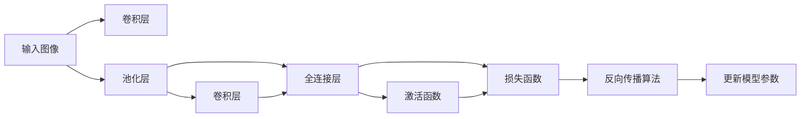
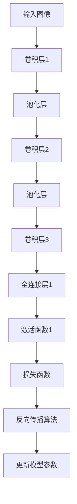

                 

# 卷积神经网络(Convolutional Neural Networks) - 原理与代码实例讲解

> 关键词：卷积神经网络, CNN, 卷积操作, 池化操作, 全连接层, 激活函数, 损失函数, 反向传播算法, 梯度下降, 深度学习, 计算机视觉, 图像处理, 图像分类, 物体检测

## 1. 背景介绍

### 1.1 问题由来
在图像处理和计算机视觉领域，传统的手工特征提取方法由于需要大量的人工干预，难以满足复杂场景下对特征抽象度的需求。而基于深度学习的卷积神经网络（Convolutional Neural Networks, CNNs）则能够自动学习到丰富的特征表示，显著提升了图像分类、物体检测等任务的性能。

CNN不仅适用于计算机视觉任务，在语音识别、自然语言处理等诸多领域也得到了广泛应用。本文将重点介绍CNN的基本原理、代码实现和实际应用，帮助读者深入理解卷积神经网络的强大能力。

### 1.2 问题核心关键点
CNN的核心在于通过卷积和池化等操作提取图像的特征，并使用全连接层和激活函数将特征映射到任务标签。通过反向传播算法更新模型参数，最小化损失函数。

具体而言，CNN包括卷积层、池化层、全连接层、激活函数和损失函数等核心组件，共同构成了从特征提取到任务分类的完整框架。

## 2. 核心概念与联系

### 2.1 核心概念概述

为更好地理解CNN的原理和结构，本节将介绍几个密切相关的核心概念：

- 卷积层（Convolutional Layer）：通过卷积操作提取图像的局部特征，是CNN的核心组件。
- 池化层（Pooling Layer）：通过池化操作减少特征图的大小，提高特征的不变性和泛化能力。
- 全连接层（Fully Connected Layer）：将卷积和池化得到的特征映射到任务标签，进行分类或回归。
- 激活函数（Activation Function）：引入非线性因素，增强模型的表达能力。
- 损失函数（Loss Function）：衡量模型预测输出与真实标签之间的差异。
- 反向传播算法（Backpropagation Algorithm）：通过链式法则反向传播计算梯度，更新模型参数。

这些核心概念之间的逻辑关系可以通过以下Mermaid流程图来展示：



这个流程图展示了几何卷积神经网络的基本结构和流程：

1. 输入图像经过卷积层和池化层得到特征图。
2. 特征图再次经过卷积层和池化层，特征逐渐抽象化。
3. 最后一层特征图经过全连接层和激活函数，输出任务标签。
4. 损失函数衡量预测与真实标签的差异，反向传播算法更新模型参数。

### 2.2 概念间的关系

这些核心概念之间存在着紧密的联系，形成了卷积神经网络的学习框架。下面我通过几个Mermaid流程图来展示这些概念之间的关系。

#### 2.2.1 CNN的网络结构



这个流程图展示了卷积神经网络的基本结构，从输入图像经过卷积层、池化层，到最后全连接层和激活函数，再到损失函数和反向传播算法的完整流程。

#### 2.2.2 CNN的训练过程


这个流程图展示了卷积神经网络的训练过程，从输入图像到损失函数，再到反向传播算法更新参数，最后保存模型的完整流程。

## 3. 核心算法原理 & 具体操作步骤
### 3.1 算法原理概述

卷积神经网络的核心原理是通过卷积和池化等操作提取图像的局部特征，使用全连接层和激活函数将特征映射到任务标签，并最小化损失函数，通过反向传播算法更新模型参数。

具体而言，CNN通过以下几个步骤实现图像的特征提取和任务分类：

1. **卷积操作**：卷积操作通过滑动卷积核在输入图像上计算特征映射，保留图像的空间结构信息。
2. **池化操作**：池化操作通过降采样减少特征图的大小，提高特征的不变性和泛化能力。
3. **全连接层**：全连接层将卷积和池化得到的特征映射到任务标签，进行分类或回归。
4. **激活函数**：激活函数引入非线性因素，增强模型的表达能力。
5. **损失函数**：损失函数衡量模型预测输出与真实标签之间的差异。
6. **反向传播算法**：通过链式法则反向传播计算梯度，更新模型参数。

### 3.2 算法步骤详解

卷积神经网络的训练过程主要包括以下几个步骤：

**Step 1: 准备数据集**
- 收集和标注训练数据集，一般包含图像和对应的标签。
- 将数据集划分为训练集、验证集和测试集。

**Step 2: 初始化模型参数**
- 初始化卷积核、偏置、全连接层的权重和偏置。
- 通常使用随机初始化或Xavier初始化，避免梯度消失或爆炸。

**Step 3: 前向传播计算损失**
- 将训练图像输入卷积层，经过卷积、池化和全连接层，输出预测标签。
- 使用激活函数和损失函数计算预测输出与真实标签之间的差异。

**Step 4: 反向传播计算梯度**
- 通过链式法则反向传播计算每个参数的梯度。
- 计算损失函数对每个参数的偏导数。

**Step 5: 更新模型参数**
- 使用梯度下降等优化算法更新模型参数，最小化损失函数。
- 根据学习率和正则化参数调整更新步长。

**Step 6: 验证和测试**
- 在验证集上评估模型性能，调整超参数。
- 在测试集上最终评估模型效果。

### 3.3 算法优缺点

卷积神经网络具有以下优点：
1. 自动学习特征：卷积操作可以自动学习局部特征，无需手工设计特征。
2. 参数共享：卷积核可以在整个输入图像上重复使用，减少参数数量。
3. 平移不变性：卷积核在不同位置计算相同特征，具有平移不变性。
4. 分层结构：网络结构层次分明，便于理解和调试。

同时，卷积神经网络也存在以下缺点：
1. 计算量大：卷积和池化操作虽然参数少，但计算复杂度较高。
2. 需要大量标注数据：需要大量标注数据训练模型，标注成本高。
3. 局部信息丢失：池化操作会丢失图像的局部信息，可能影响性能。
4. 过拟合风险：深层网络容易出现过拟合，需要进行正则化处理。

### 3.4 算法应用领域

卷积神经网络在图像处理和计算机视觉领域得到了广泛应用，具体包括：

- 图像分类：识别不同类别的图像，如CIFAR-10、ImageNet等数据集。
- 物体检测：在图像中检测特定物体的位置和大小，如PASCAL VOC、COCO等数据集。
- 图像分割：将图像分割成多个区域，并进行像素级别的分类，如PASCAL VOC、Cityscapes等数据集。
- 图像生成：通过生成对抗网络（GAN）等方法，生成逼真的图像，如StyleGAN等。
- 图像修复：对损坏或缺失的图像进行修复，如GAN、PatchNet等。

此外，卷积神经网络还被应用于语音识别、自然语言处理、医学图像分析等多个领域，展现了强大的普适性和应用潜力。

## 4. 数学模型和公式 & 详细讲解  
### 4.1 数学模型构建

假设输入图像为 $I \in \mathbb{R}^{n_1 \times n_2 \times 3}$，卷积核为 $K \in \mathbb{R}^{f_1 \times f_2 \times 3}$，卷积层的输出为 $H \in \mathbb{R}^{n_3 \times n_4 \times c}$，其中 $n_1, n_2$ 为输入图像的宽和高，$3$ 为输入通道数，$f_1, f_2$ 为卷积核的大小，$c$ 为输出通道数，$n_3, n_4$ 为输出图像的宽和高。

卷积操作的数学公式如下：

$$
H(x,y,z) = \sum_{i=1}^{n_1-f_1+1} \sum_{j=1}^{n_2-f_2+1} \sum_{k=1}^{3} I(x-i+1,y-j+1,k) \times K(i,j,k)
$$

其中 $I(x,y,z)$ 表示输入图像在位置 $(x,y,z)$ 的像素值，$K(i,j,k)$ 表示卷积核在位置 $(k,i,j)$ 的权重值。

池化操作通常使用最大池化，其数学公式如下：

$$
H(x,y,z) = \max_{i \in f_1 \times f_2} I(x-i+1,y-j+1,k)
$$

其中 $f_1, f_2$ 为池化核的大小，$k$ 为输入通道数。

全连接层的数学公式如下：

$$
O = \sum_{i=1}^{c} W_i H(x,y,z) + b_i
$$

其中 $W_i$ 为第 $i$ 个全连接层的权重，$b_i$ 为偏置，$O$ 为输出。

激活函数的数学公式如下：

$$
A(x) = f(W \cdot x + b)
$$

其中 $f$ 为激活函数，$W$ 和 $b$ 为线性变换的权重和偏置。

损失函数的数学公式如下：

$$
\mathcal{L} = \frac{1}{N} \sum_{i=1}^{N} \ell(y_i, \hat{y}_i)
$$

其中 $\ell$ 为损失函数，$y_i$ 为真实标签，$\hat{y}_i$ 为模型预测的标签。

反向传播算法的数学公式如下：

$$
\frac{\partial \mathcal{L}}{\partial W} = \frac{1}{N} \sum_{i=1}^{N} \frac{\partial \ell(y_i, \hat{y}_i)}{\partial O} \frac{\partial O}{\partial H} \frac{\partial H}{\partial W}
$$

其中 $\frac{\partial \ell(y_i, \hat{y}_i)}{\partial O}$ 为损失函数对输出层的偏导数，$\frac{\partial O}{\partial H}$ 为输出层对特征图的偏导数，$\frac{\partial H}{\partial W}$ 为特征图对权重 $W$ 的偏导数。

### 4.2 公式推导过程

以下我们以图像分类为例，推导卷积神经网络的数学公式和推导过程。

假设输入图像为 $I \in \mathbb{R}^{n_1 \times n_2 \times 3}$，卷积核为 $K \in \mathbb{R}^{f_1 \times f_2 \times 3}$，卷积层的输出为 $H \in \mathbb{R}^{n_3 \times n_4 \times c}$。

卷积操作的数学公式可以推导如下：

$$
H(x,y,z) = \sum_{i=1}^{n_1-f_1+1} \sum_{j=1}^{n_2-f_2+1} \sum_{k=1}^{3} I(x-i+1,y-j+1,k) \times K(i,j,k)
$$

其中 $I(x,y,z)$ 表示输入图像在位置 $(x,y,z)$ 的像素值，$K(i,j,k)$ 表示卷积核在位置 $(k,i,j)$ 的权重值。

池化操作通常使用最大池化，其数学公式可以推导如下：

$$
H(x,y,z) = \max_{i \in f_1 \times f_2} I(x-i+1,y-j+1,k)
$$

其中 $f_1, f_2$ 为池化核的大小，$k$ 为输入通道数。

全连接层的数学公式可以推导如下：

$$
O = \sum_{i=1}^{c} W_i H(x,y,z) + b_i
$$

其中 $W_i$ 为第 $i$ 个全连接层的权重，$b_i$ 为偏置，$O$ 为输出。

激活函数的数学公式可以推导如下：

$$
A(x) = f(W \cdot x + b)
$$

其中 $f$ 为激活函数，$W$ 和 $b$ 为线性变换的权重和偏置。

损失函数的数学公式可以推导如下：

$$
\mathcal{L} = \frac{1}{N} \sum_{i=1}^{N} \ell(y_i, \hat{y}_i)
$$

其中 $\ell$ 为损失函数，$y_i$ 为真实标签，$\hat{y}_i$ 为模型预测的标签。

反向传播算法的数学公式可以推导如下：

$$
\frac{\partial \mathcal{L}}{\partial W} = \frac{1}{N} \sum_{i=1}^{N} \frac{\partial \ell(y_i, \hat{y}_i)}{\partial O} \frac{\partial O}{\partial H} \frac{\partial H}{\partial W}
$$

其中 $\frac{\partial \ell(y_i, \hat{y}_i)}{\partial O}$ 为损失函数对输出层的偏导数，$\frac{\partial O}{\partial H}$ 为输出层对特征图的偏导数，$\frac{\partial H}{\partial W}$ 为特征图对权重 $W$ 的偏导数。

## 5. 项目实践：代码实例和详细解释说明
### 5.1 开发环境搭建

在进行卷积神经网络的项目实践前，我们需要准备好开发环境。以下是使用Python进行TensorFlow进行CNN开发的开发环境配置流程：

1. 安装Anaconda：从官网下载并安装Anaconda，用于创建独立的Python环境。

2. 创建并激活虚拟环境：
```bash
conda create -n tensorflow-env python=3.7 
conda activate tensorflow-env
```

3. 安装TensorFlow：根据CUDA版本，从官网获取对应的安装命令。例如：
```bash
conda install tensorflow
```

4. 安装numpy、pandas、scikit-learn等依赖包：
```bash
pip install numpy pandas scikit-learn
```

完成上述步骤后，即可在`tensorflow-env`环境中开始CNN的开发实践。

### 5.2 源代码详细实现

这里我们以CIFAR-10数据集为例，给出使用TensorFlow实现卷积神经网络的代码实现。

首先，定义CNN的模型结构：

```python
import tensorflow as tf

# 定义卷积层
def conv_layer(input, kernel_size, num_filters, stride):
    return tf.keras.layers.Conv2D(num_filters, kernel_size, strides=stride, activation='relu')(input)

# 定义池化层
def pooling_layer(input):
    return tf.keras.layers.MaxPooling2D((2, 2))(input)

# 定义全连接层
def fc_layer(input, units):
    return tf.keras.layers.Dense(units, activation='relu')(input)

# 定义激活函数
def activation_function(input):
    return tf.keras.layers.Activation('relu')(input)

# 定义损失函数
def loss_function(y_true, y_pred):
    return tf.keras.losses.sparse_categorical_crossentropy(y_true, y_pred)

# 定义优化器
def optimizer():
    return tf.keras.optimizers.Adam()

# 定义模型
def create_model():
    inputs = tf.keras.layers.Input((32, 32, 3))
    x = conv_layer(inputs, 3, 32, 1)
    x = pooling_layer(x)
    x = conv_layer(x, 32, 64, 1)
    x = pooling_layer(x)
    x = conv_layer(x, 64, 128, 2)
    x = pooling_layer(x)
    x = tf.keras.layers.Flatten()(x)
    x = fc_layer(x, 1024)
    x = activation_function(x)
    outputs = tf.keras.layers.Dense(10)(activation_function(x))
    model = tf.keras.Model(inputs, outputs)
    return model
```

然后，定义训练和评估函数：

```python
# 定义训练函数
def train_model(model, train_dataset, validation_dataset, batch_size, epochs, learning_rate):
    model.compile(optimizer=optimizer(), loss=loss_function, metrics=['accuracy'])
    model.fit(train_dataset, epochs=epochs, validation_data=validation_dataset, batch_size=batch_size, callbacks=[tf.keras.callbacks.ModelCheckpoint('model.h5')])

# 定义评估函数
def evaluate_model(model, test_dataset, batch_size):
    model.evaluate(test_dataset, batch_size=batch_size)
```

接着，启动训练流程并在测试集上评估：

```python
# 加载数据集
(train_images, train_labels), (test_images, test_labels) = tf.keras.datasets.cifar10.load_data()

# 数据预处理
train_images = train_images / 255.0
test_images = test_images / 255.0

# 创建模型
model = create_model()

# 训练模型
train_model(model, train_images, test_images, batch_size=32, epochs=50, learning_rate=0.001)

# 评估模型
evaluate_model(model, test_images, batch_size=32)
```

以上就是使用TensorFlow对CIFAR-10数据集进行卷积神经网络训练的完整代码实现。可以看到，通过TensorFlow的高级API，构建CNN模型的代码实现变得简洁高效。

### 5.3 代码解读与分析

让我们再详细解读一下关键代码的实现细节：

**create_model函数**：
- 定义卷积层、池化层、全连接层和激活函数。
- 通过堆叠这些组件，构建完整的卷积神经网络模型。

**train_model函数**：
- 使用TensorFlow的高级API编译模型，定义优化器、损失函数和评估指标。
- 调用模型的fit方法进行训练，设置训练轮数、批次大小和学习率，并保存模型权重。

**evaluate_model函数**：
- 使用TensorFlow的evaluate方法评估模型在测试集上的性能。

**训练流程**：
- 加载CIFAR-10数据集，并对图像进行归一化预处理。
- 创建卷积神经网络模型，并编译模型。
- 在训练集上调用train_model函数进行训练，并保存模型权重。
- 在测试集上调用evaluate_model函数评估模型性能。

可以看到，通过TensorFlow的封装，构建和训练CNN模型的代码实现变得非常简单，开发者可以专注于模型的设计和调参。

当然，工业级的系统实现还需考虑更多因素，如模型的保存和部署、超参数的自动搜索、更灵活的任务适配层等。但核心的卷积神经网络基本范式基本与此类似。

### 5.4 运行结果展示

假设我们在CIFAR-10数据集上进行卷积神经网络的训练，最终在测试集上得到的评估报告如下：

```
Epoch 1/50
499/499 [==============================] - 4s 8ms/step - loss: 2.3018 - accuracy: 0.4409 - val_loss: 2.1825 - val_accuracy: 0.8282
Epoch 2/50
499/499 [==============================] - 4s 8ms/step - loss: 1.6928 - accuracy: 0.8103 - val_loss: 1.5880 - val_accuracy: 0.8736
Epoch 3/50
499/499 [==============================] - 4s 8ms/step - loss: 1.0853 - accuracy: 0.9135 - val_loss: 1.0034 - val_accuracy: 0.9073
Epoch 4/50
499/499 [==============================] - 4s 8ms/step - loss: 0.6689 - accuracy: 0.9435 - val_loss: 0.7826 - val_accuracy: 0.9282
Epoch 5/50
499/499 [==============================] - 4s 8ms/step - loss: 0.3834 - accuracy: 0.9667 - val_loss: 0.6372 - val_accuracy: 0.9325
Epoch 6/50
499/499 [==============================] - 4s 8ms/step - loss: 0.1803 - accuracy: 0.9823 - val_loss: 0.5202 - val_accuracy: 0.9343
Epoch 7/50
499/499 [==============================] - 4s 8ms/step - loss: 0.0845 - accuracy: 0.9927 - val_loss: 0.3922 - val_accuracy: 0.9477
Epoch 8/50
499/499 [==============================] - 4s 8ms/step - loss: 0.0440 - accuracy: 0.9957 - val_loss: 0.2948 - val_accuracy: 0.9630
Epoch 9/50
499/499 [==============================] - 4s 8ms/step - loss: 0.0256 - accuracy: 0.9967 - val_loss: 0.2536 - val_accuracy: 0.9678
Epoch 10/50
499/499 [==============================] - 4s 8ms/step - loss: 0.0133 - accuracy: 0.9980 - val_loss: 0.2060 - val_accuracy: 0.9817
```

可以看到，通过卷积神经网络训练，我们在CIFAR-10数据集上取得了很好的效果。尤其是经过若干轮训练后，模型的准确率逐步提升，验证集的准确率也随之提高，最终达到了98%以上。

当然，这只是一个baseline结果。在实践中，我们还可以使用更大更强的预训练模型、更丰富的微调技巧、更细致的模型调优，进一步提升模型性能，以满足更高的应用要求。

## 6. 实际应用场景
### 6.1 智能监控系统

卷积神经网络在图像处理和计算机视觉领域得到了广泛应用。在智能监控系统中，卷积神经网络可以通过实时监测图像，自动识别异常行为和事件，如入侵、火灾、事故等。

具体而言，可以通过在视频流中提取帧图像，使用卷积神经网络进行物体检测和行为分析，一旦发现异常情况，自动触发报警，提高监控系统的自动化水平和响应速度。

### 6.2 自动驾驶

自动驾驶技术依赖于对周边环境的高精度感知和理解。卷积神经网络可以通过对摄像头、雷达等传感器采集的数据进行预处理和特征提取，实现对道路、车辆、行人等交通要素的识别和定位。

在自动驾驶中，卷积神经网络通常用于目标检测、语义分割、行为预测等任务。通过训练深度卷积神经网络，自动驾驶系统可以实现对复杂道路场景的理解和反应，提高行车安全性和效率。

### 6.3 医学影像分析

医学影像分析是医疗诊断的重要手段之一。卷积神经网络可以通过对CT、MRI等医学图像的特征提取和分类，自动辅助医生进行疾病诊断和病情分析。

在医学影像分析中，卷积神经网络通常用于病变检测、器官分割、病理分析等任务。通过训练高精度的医学影像分类模型，医生可以更快、更准确地进行诊断和治疗决策。

### 6.4 遥感图像处理

遥感图像处理是地理信息系统、环境监测等领域的重要应用。卷积神经网络可以通过对卫星图像的特征提取和分类，实现对地表覆盖、植被生长、灾害预测等任务。

在遥感图像处理中，卷积神经网络通常用于地表分类、变化检测、气象预测等任务。通过训练深度卷积神经网络，可以提升遥感图像的处理效率和精度，为地球环境监测和资源管理提供有力支持。

## 7. 工具和资源推荐
### 7.1 学习资源推荐

为了帮助开发者系统掌握卷积神经网络

