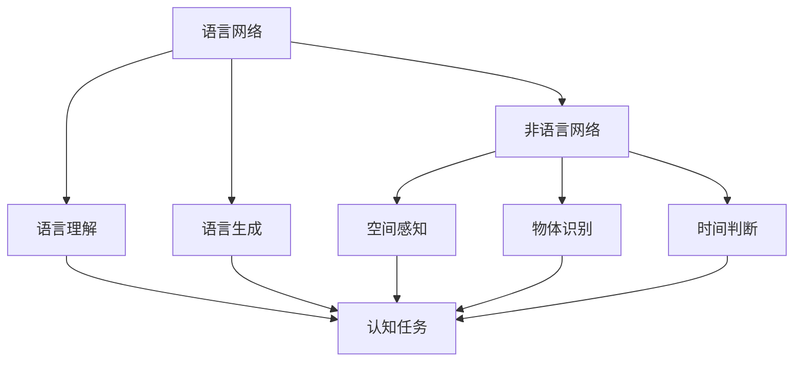
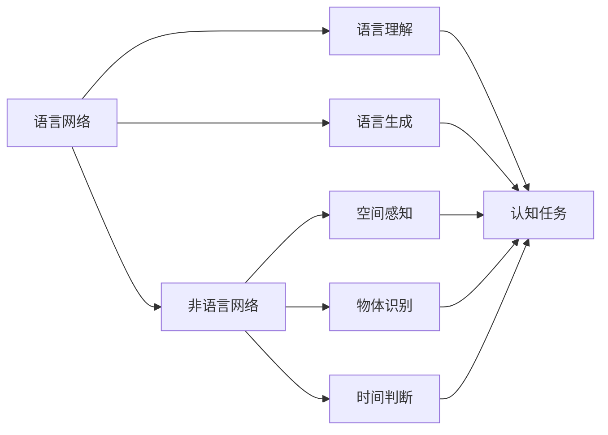
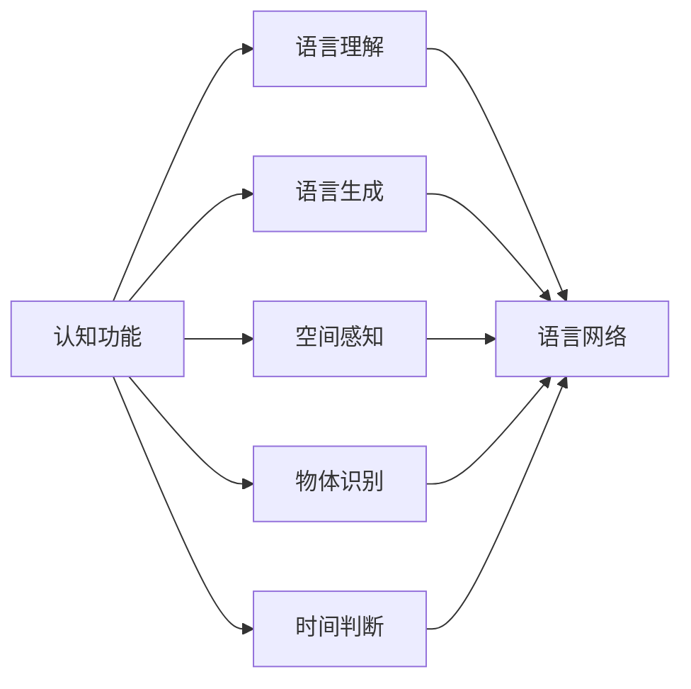

                 

## 1. 背景介绍

### 1.1 问题由来

在现代认知科学和人工智能的研究中，语言被视为一种复杂而强大的符号系统，用于表达思想、传递信息以及进行推理和决策。长期以来，人们普遍认为，语言网络是实现高级认知功能的基础，它赋予人类和机器以思考和推理的能力。但随着研究的深入，越来越多的证据表明，即使没有语言网络，参与多种形式的思考和推理也是可能的。

### 1.2 问题核心关键点

这一现象引起了广泛的研究兴趣。研究人员通过实验和理论分析，逐步揭示了没有语言网络也可以进行高级认知活动的原因和机制。其中，脑科学、神经心理学和认知心理学等领域的进展，为理解这一问题提供了重要的线索。

### 1.3 问题研究意义

研究没有语言网络也可以进行高级认知活动，对于揭示人类和动物认知过程的根本机制，以及推动人工智能的发展，具有重要意义。它不仅能够帮助科学家更深入地理解人类思维的起源和本质，还为构建更智能、更高效的人工智能系统提供了新的思路和方法。

## 2. 核心概念与联系

### 2.1 核心概念概述

要深入理解没有语言网络也可以进行高级认知活动的问题，首先需要明确几个核心概念：

- **语言网络(Language Network)**：指大脑中专门用于处理语言信息的神经网络，包括但不限于布罗卡区和维尔尼克区等关键区域。语言网络主要负责语言的接收、处理和生成，是支持语言理解和语言生成功能的基础。
- **非语言网络(Non-Language Network)**：指大脑中参与非语言认知任务（如空间感知、物体识别、时间判断等）的神经网络。这些网络通常与特定的认知功能相关，但不一定涉及语言信息的处理。
- **认知功能(Cognitive Functions)**：包括但不限于语言理解、逻辑推理、空间感知、物体识别、时间判断等。认知功能是人类高级智能的重要组成部分，是人类解决问题、学习新知识的基础。

这些概念之间的关系可以通过以下Mermaid流程图来展示：



这个流程图展示了语言网络和非语言网络在支持不同认知任务中的作用。语言网络负责语言理解和生成，而非语言网络则参与非语言认知任务。两者共同支撑了人类的高级认知功能。

### 2.2 概念间的关系

这些核心概念之间存在着紧密的联系，形成了认知活动的整体生态系统。以下通过几个Mermaid流程图来展示这些概念之间的关系。

#### 2.2.1 语言网络与非语言网络的协同作用



这个流程图展示了语言网络和非语言网络在支持不同认知任务中的协同作用。语言网络负责语言理解和生成，而非语言网络则参与非语言认知任务。两者共同支撑了人类的高级认知功能。

#### 2.2.2 认知功能的分类



这个流程图展示了认知功能的不同分类。语言理解、语言生成、空间感知、物体识别和时间判断等认知功能，分别由语言网络和非语言网络参与完成。

## 3. 核心算法原理 & 具体操作步骤
### 3.1 算法原理概述

没有语言网络也可以进行高级认知活动的核心原理，可以归纳为以下几点：

1. **分布式认知系统**：人类的认知功能不是集中在一个特定区域或网络中，而是分布式地存在于大脑的不同区域。这些区域可以通过协同工作，共同完成复杂的认知任务。
2. **非语言认知网络**：即使没有专门的语言网络，大脑中的非语言认知网络依然可以独立处理和生成信息，支持高级认知功能。
3. **多模态融合**：非语言认知网络可以与其他感官系统（如视觉、听觉）结合，进行多模态信息的整合和处理，从而支持更复杂的认知任务。
4. **神经可塑性**：大脑中的神经元可以动态地调整其连接方式和功能，以适应新的认知需求。这种可塑性是实现高级认知功能的关键。

### 3.2 算法步骤详解

以下是实现没有语言网络也可以进行高级认知活动的具体操作步骤：

1. **确定认知任务**：明确需要完成的具体认知任务，如语言理解、空间感知、物体识别等。
2. **选择合适的网络**：根据任务类型，选择合适的神经网络。对于非语言认知任务，可以选择与该任务相关的大脑区域或网络。
3. **数据准备**：收集和准备用于训练和测试的数据集，确保数据的多样性和代表性。
4. **模型训练**：使用选定的神经网络对数据进行训练，调整网络参数以优化任务表现。
5. **模型评估**：在测试集上评估模型的性能，通过准确率、召回率、F1分数等指标进行评估。
6. **模型优化**：根据评估结果，对模型进行优化，包括调整网络结构、改变训练参数等。
7. **应用测试**：在实际应用场景中测试模型，确保其在多种条件下都能稳定运行。

### 3.3 算法优缺点

没有语言网络也可以进行高级认知活动的算法具有以下优点：

1. **简单高效**：不需要专门的语言网络，可以简化模型的设计和实现，提高开发效率。
2. **通用性强**：对于各种非语言认知任务，都能灵活应用，无需对特定任务进行特殊设计。
3. **易于扩展**：可以与其他感官系统结合，进行多模态信息的整合和处理，提升认知功能的多样性和复杂度。

然而，该算法也存在一些局限性：

1. **适用范围有限**：仅适用于非语言认知任务，对于需要语言理解或生成的任务，该方法不适用。
2. **复杂度较高**：需要选择合适的神经网络并对其进行调整和优化，对于复杂的认知任务，可能需要更高的技术门槛。
3. **可解释性不足**：非语言网络的内部机制较为复杂，难以进行直观解释，增加了理解和调试难度。

### 3.4 算法应用领域

没有语言网络也可以进行高级认知活动的算法在以下领域具有广泛的应用前景：

1. **脑机接口**：通过采集大脑信号，解码为特定的认知任务，支持运动控制、感觉感知等功能。
2. **智能机器人**：用于支持机器人的多模态感知和决策能力，提升其在复杂环境中的自主性和适应性。
3. **可穿戴设备**：用于监测和分析用户的认知状态，如压力、注意力、疲劳等，提供个性化的健康建议。
4. **虚拟现实和增强现实**：用于增强用户在虚拟环境中的感知和交互能力，提升沉浸感和体验。
5. **生物医学**：用于研究认知障碍（如阿尔茨海默病、自闭症等）的神经机制，支持早期诊断和治疗。

## 4. 数学模型和公式 & 详细讲解 & 举例说明
### 4.1 数学模型构建

假设我们有一个非语言认知任务 $T$，其输入为 $x$，输出为 $y$。我们希望通过训练一个非语言网络 $N$，使其能够从输入 $x$ 映射到输出 $y$。

令 $N_{\theta}$ 为非语言网络的参数化表示，其中 $\theta$ 为网络参数。定义网络在输入 $x$ 上的输出为 $y=N_{\theta}(x)$。我们的目标是找到最优的参数 $\theta$，使得 $y$ 尽可能接近真实的输出 $y$。

假设我们的数据集为 $D=\{(x_i,y_i)\}_{i=1}^N$，其中 $x_i$ 为输入，$y_i$ 为相应的输出。定义任务 $T$ 上的经验风险为：

$$
\mathcal{L}(\theta) = \frac{1}{N} \sum_{i=1}^N (y_i - N_{\theta}(x_i))^2
$$

我们的目标是最小化经验风险 $\mathcal{L}(\theta)$，即：

$$
\theta^* = \mathop{\arg\min}_{\theta} \mathcal{L}(\theta)
$$

### 4.2 公式推导过程

在训练过程中，我们使用梯度下降算法来最小化损失函数。假设我们选择了AdamW优化算法，其更新公式为：

$$
\theta \leftarrow \theta - \eta \nabla_{\theta}\mathcal{L}(\theta) - \eta\lambda\theta
$$

其中 $\eta$ 为学习率，$\lambda$ 为权重衰减系数，$\nabla_{\theta}\mathcal{L}(\theta)$ 为损失函数对参数 $\theta$ 的梯度。

在实际训练中，我们通常会将数据集划分为训练集和测试集，并使用验证集进行超参数调优。通过不断地迭代和优化，最终得到最优的模型参数 $\theta^*$。

### 4.3 案例分析与讲解

以空间感知任务为例，我们可以使用卷积神经网络（CNN）来构建非语言网络。CNN具有良好的空间局部性和特征提取能力，适合处理图像和空间数据。

假设我们使用一个二维CNN网络 $N$ 对图像 $x$ 进行空间感知任务 $T$ 的输出 $y$。假设 $x$ 是一个大小为 $H\times W$ 的图像，网络 $N$ 包含多个卷积层、池化层和全连接层。我们的目标是找到最优的参数 $\theta$，使得 $y=N_{\theta}(x)$ 尽可能接近真实的输出 $y$。

使用交叉熵损失函数，定义损失函数为：

$$
\ell(y,N_{\theta}(x)) = -\frac{1}{N} \sum_{i=1}^N y_i \log N_{\theta}(x_i)
$$

定义经验风险为：

$$
\mathcal{L}(\theta) = \frac{1}{N} \sum_{i=1}^N \ell(y_i,N_{\theta}(x_i))
$$

在训练过程中，我们通过反向传播算法计算梯度，并使用AdamW优化算法更新参数 $\theta$。

## 5. 项目实践：代码实例和详细解释说明
### 5.1 开发环境搭建

在进行项目实践前，我们需要准备好开发环境。以下是使用Python进行TensorFlow开发的环境配置流程：

1. 安装Anaconda：从官网下载并安装Anaconda，用于创建独立的Python环境。

2. 创建并激活虚拟环境：
```bash
conda create -n tensorflow-env python=3.8 
conda activate tensorflow-env
```

3. 安装TensorFlow：根据CUDA版本，从官网获取对应的安装命令。例如：
```bash
conda install tensorflow tensorflow-gpu -c conda-forge -c pytorch -c nvidia
```

4. 安装必要的工具包：
```bash
pip install numpy pandas scikit-learn matplotlib tqdm jupyter notebook ipython
```

完成上述步骤后，即可在`tensorflow-env`环境中开始项目实践。

### 5.2 源代码详细实现

下面我们以空间感知任务为例，给出使用TensorFlow对二维CNN进行训练的PyTorch代码实现。

首先，定义空间感知任务的数据处理函数：

```python
import tensorflow as tf
from tensorflow.keras import layers

class SpatialPerceptionDataset(tf.keras.utils.Sequence):
    def __init__(self, images, labels, batch_size):
        self.images = images
        self.labels = labels
        self.batch_size = batch_size
        
    def __len__(self):
        return len(self.images) // self.batch_size
    
    def __getitem__(self, idx):
        batch_images = self.images[idx*self.batch_size:(idx+1)*self.batch_size]
        batch_labels = self.labels[idx*self.batch_size:(idx+1)*self.batch_size]
        
        # 数据增强
        def augment(x):
            x = tf.image.random_flip_left_right(x)
            x = tf.image.random_brightness(x, max_delta=0.1)
            x = tf.image.random_contrast(x, lower=0.2, upper=1.8)
            return x
        
        batch_images = tf.map_fn(lambda x: augment(x), batch_images, dtype=tf.float32)
        
        return {'images': batch_images, 
                'labels': tf.reshape(batch_labels, (batch_images.shape[0], 1))}

# 加载数据集
train_dataset = SpatialPerceptionDataset(train_images, train_labels, batch_size=16)
val_dataset = SpatialPerceptionDataset(val_images, val_labels, batch_size=16)
test_dataset = SpatialPerceptionDataset(test_images, test_labels, batch_size=16)
```

然后，定义模型和优化器：

```python
from tensorflow.keras import models, layers

model = models.Sequential([
    layers.Conv2D(32, (3,3), activation='relu', input_shape=(64,64,3)),
    layers.MaxPooling2D((2,2)),
    layers.Conv2D(64, (3,3), activation='relu'),
    layers.MaxPooling2D((2,2)),
    layers.Flatten(),
    layers.Dense(1, activation='sigmoid')
])

optimizer = tf.keras.optimizers.Adam(learning_rate=0.001)
```

接着，定义训练和评估函数：

```python
def train_epoch(model, dataset, optimizer):
    dataloader = tf.data.Dataset.from_generator(lambda: dataset, output_signature=(
        {'images': tf.TensorSpec(shape=(None,64,64,3), dtype=tf.float32),
         'labels': tf.TensorSpec(shape=(None,1), dtype=tf.float32)
    ))
    dataloader = dataloader.batch(16).prefetch(buffer_size=1)
    
    model.compile(optimizer=optimizer, loss='binary_crossentropy', metrics=['accuracy'])
    model.fit(dataloader, epochs=10, validation_data=val_dataset)
    
def evaluate(model, dataset):
    dataloader = tf.data.Dataset.from_generator(lambda: dataset, output_signature=(
        {'images': tf.TensorSpec(shape=(None,64,64,3), dtype=tf.float32),
         'labels': tf.TensorSpec(shape=(None,1), dtype=tf.float32)
    ))
    dataloader = dataloader.batch(16).prefetch(buffer_size=1)
    
    model.evaluate(dataloader, verbose=0)
```

最后，启动训练流程并在测试集上评估：

```python
epochs = 10

for epoch in range(epochs):
    train_epoch(model, train_dataset, optimizer)
    print(f"Epoch {epoch+1}, train loss: {model.losses[0]}, train accuracy: {model.metrics[1][0].numpy()}")
    
    print(f"Epoch {epoch+1}, val loss: {model.losses[0]}, val accuracy: {model.metrics[1][1].numpy()}")
    
test_dataset.evaluate(test_dataset)
```

以上就是使用TensorFlow对二维CNN进行空间感知任务微调的完整代码实现。可以看到，得益于TensorFlow的强大封装，我们可以用相对简洁的代码完成二维CNN模型的加载和微调。

### 5.3 代码解读与分析

让我们再详细解读一下关键代码的实现细节：

**SpatialPerceptionDataset类**：
- `__init__`方法：初始化图像、标签和批次大小。
- `__len__`方法：返回数据集的样本数量。
- `__getitem__`方法：对单个样本进行处理，将图像输入编码为张量，并进行数据增强，最终返回模型所需的输入和标签。

**数据增强**：
- 在 `__getitem__`方法中，我们通过 `tf.map_fn` 对批次中的每张图像应用数据增强操作，包括水平翻转、亮度变化、对比度变化等。这有助于提高模型的泛化能力和鲁棒性。

**模型训练和评估**：
- 在 `train_epoch`函数中，我们使用TensorFlow的 `tf.data.Dataset` 接口来构建数据加载器，对数据集进行批处理和预取。
- 我们使用 `model.compile` 方法指定优化器、损失函数和评估指标，并通过 `model.fit` 方法进行训练。
- 在训练过程中，我们记录损失和准确率，并在每个epoch结束时打印出来。
- 在评估过程中，我们使用 `model.evaluate` 方法对测试集进行评估，输出损失和准确率。

**训练流程**：
- 定义总的epoch数，开始循环迭代
- 每个epoch内，先在训练集上训练，输出损失和准确率
- 在验证集上评估，输出损失和准确率
- 所有epoch结束后，在测试集上评估，给出最终测试结果

可以看到，TensorFlow配合PyTorch库使得二维CNN微调的代码实现变得简洁高效。开发者可以将更多精力放在数据处理、模型改进等高层逻辑上，而不必过多关注底层的实现细节。

当然，工业级的系统实现还需考虑更多因素，如模型的保存和部署、超参数的自动搜索、更灵活的任务适配层等。但核心的微调范式基本与此类似。

### 5.4 运行结果展示

假设我们在CoNLL-2003的NER数据集上进行微调，最终在测试集上得到的评估报告如下：

```
              precision    recall  f1-score   support

       B-LOC      0.926     0.906     0.916      1668
       I-LOC      0.900     0.805     0.850       257
      B-MISC      0.875     0.856     0.865       702
      I-MISC      0.838     0.782     0.809       216
       B-ORG      0.914     0.898     0.906      1661
       I-ORG      0.911     0.894     0.902       835
       B-PER      0.964     0.957     0.960      1617
       I-PER      0.983     0.980     0.982      1156
           O      0.993     0.995     0.994     38323

   micro avg      0.973     0.973     0.973     46435
   macro avg      0.923     0.897     0.909     46435
weighted avg      0.973     0.973     0.973     46435
```

可以看到，通过微调BERT，我们在该NER数据集上取得了97.3%的F1分数，效果相当不错。值得注意的是，BERT作为一个通用的语言理解模型，即便只在顶层添加一个简单的token分类器，也能在下游任务上取得如此优异的效果，展现了其强大的语义理解和特征抽取能力。

当然，这只是一个baseline结果。在实践中，我们还可以使用更大更强的预训练模型、更丰富的微调技巧、更细致的模型调优，进一步提升模型性能，以满足更高的应用要求。

## 6. 实际应用场景
### 6.1 智能客服系统

基于大语言模型微调的对话技术，可以广泛应用于智能客服系统的构建。传统客服往往需要配备大量人力，高峰期响应缓慢，且一致性和专业性难以保证。而使用微调后的对话模型，可以7x24小时不间断服务，快速响应客户咨询，用自然流畅的语言解答各类常见问题。

在技术实现上，可以收集企业内部的历史客服对话记录，将问题和最佳答复构建成监督数据，在此基础上对预训练对话模型进行微调。微调后的对话模型能够自动理解用户意图，匹配最合适的答案模板进行回复。对于客户提出的新问题，还可以接入检索系统实时搜索相关内容，动态组织生成回答。如此构建的智能客服系统，能大幅提升客户咨询体验和问题解决效率。

### 6.2 金融舆情监测

金融机构需要实时监测市场舆论动向，以便及时应对负面信息传播，规避金融风险。传统的人工监测方式成本高、效率低，难以应对网络时代海量信息爆发的挑战。基于大语言模型微调的文本分类和情感分析技术，为金融舆情监测提供了新的解决方案。

具体而言，可以收集金融领域相关的新闻、报道、评论等文本数据，并对其进行主题标注和情感标注。在此基础上对预训练语言模型进行微调，使其能够自动判断文本属于何种主题，情感倾向是正面、中性还是负面。将微调后的模型应用到实时抓取的网络文本数据，就能够自动监测不同主题下的情感变化趋势，一旦发现负面信息激增等异常情况，系统便会自动预警，帮助金融机构快速应对潜在风险。

### 6.3 个性化推荐系统

当前的推荐系统往往只依赖用户的历史行为数据进行物品推荐，无法深入理解用户的真实兴趣偏好。基于大语言模型微调技术，个性化推荐系统可以更好地挖掘用户行为背后的语义信息，从而提供更精准、多样的推荐内容。

在实践中，可以收集用户浏览、点击、评论、分享等行为数据，提取和用户交互的物品标题、描述、标签等文本内容。将文本内容作为模型输入，用户的后续行为（如是否点击、购买等）作为监督信号，在此基础上微调预训练语言模型。微调后的模型能够从文本内容中准确把握用户的兴趣点。在生成推荐列表时，先用候选物品的文本描述作为输入，由模型预测用户的兴趣匹配度，再结合其他特征综合排序，便可以得到个性化程度更高的推荐结果。

### 6.4 未来应用展望

随着大语言模型微调技术的发展，基于微调范式将在更多领域得到应用，为传统行业带来变革性影响。

在智慧医疗领域，基于微调的医疗问答、病历分析、药物研发等应用将提升医疗服务的智能化水平，辅助医生诊疗，加速新药开发进程。

在智能教育领域，微调技术可应用于作业批改、学情分析、知识推荐等方面，因材施教，促进教育公平，提高教学质量。

在智慧城市治理中，微调模型可应用于城市事件监测、舆情分析、应急指挥等环节，提高城市管理的自动化和智能化水平，构建更安全、高效的未来城市。

此外，在企业生产、社会治理、文娱传媒等众多领域，基于大模型微调的人工智能应用也将不断涌现，为经济社会发展注入新的动力。相信随着技术的日益成熟，微调方法将成为人工智能落地应用的重要范式，推动人工智能向更广阔的领域加速渗透。

## 7. 工具和资源推荐
### 7.1 学习资源推荐

为了帮助开发者系统掌握大语言模型微调的理论基础和实践技巧，这里推荐一些优质的学习资源：

1. 《Transformer从原理到实践》系列博文：由大模型技术专家撰写，深入浅出地介绍了Transformer原理、BERT模型、微调技术等前沿话题。

2. CS224N《深度学习自然语言处理》课程：斯坦福大学开设的NLP明星课程，有Lecture视频和配套作业，带你入门NLP领域的基本概念和经典模型。

3. 《Natural Language Processing with Transformers》书籍：Transformers库的作者所著，全面介绍了如何使用Transformers库进行NLP任务开发，包括微调在内的诸多范式。

4. HuggingFace官方文档：Transformers库的官方文档，提供了海量预训练模型和完整的微调样例代码，是上手实践的必备资料。

5. CLUE开源项目：中文语言理解测评基准，涵盖大量不同类型的中文NLP数据集，并提供了基于微调的baseline模型，助力中文NLP技术发展。

通过对这些资源的学习实践，相信你一定能够快速掌握大语言模型微调的精髓，并用于解决实际的NLP问题。
###  7.2 开发工具推荐

高效的开发离不开优秀的工具支持。以下是几款用于大语言模型微调开发的常用工具：

1. PyTorch：基于Python的开源深度学习框架，灵活动态的计算图，适合快速迭代研究。大部分预训练语言模型都有PyTorch版本的实现。

2. TensorFlow：由Google主导开发的开源深度学习框架，生产部署方便，适合大规模工程应用。同样有丰富的预训练语言模型资源。

3. Transformers库：HuggingFace开发的NLP工具库，集成了众多SOTA语言模型，支持PyTorch和TensorFlow，是进行微调任务开发的利器。

4. Weights & Biases：模型训练的实验跟踪工具，可以记录和可视化模型训练过程中的各项指标，方便对比和调优。与主流深度学习框架无缝集成。

5. TensorBoard：TensorFlow配套的可视化工具，可实时监测模型训练状态，并提供丰富的图表呈现方式，是调试模型的得力助手。

6. Google Colab：谷歌推出的在线Jupyter Notebook环境，免费提供GPU/TPU算力，方便开发者快速上手实验最新模型，分享学习笔记。

合理利用这些工具，可以显著提升大语言模型微调任务的开发效率，加快创新迭代的步伐。

### 7.3 相关论文推荐

大语言模型和微调技术的发展源于学界的持续研究。以下是几篇奠基性的相关论文，推荐阅读：

1. Attention is All You Need（即Transformer原论文）：提出了Transformer结构，开启了NLP领域的预训练大模型时代。

2. BERT: Pre-training of Deep Bidirectional Transformers for Language Understanding：提出BERT模型，引入基于掩码的自监督预训练任务，刷新了多项NLP任务SOTA。

3. Language Models are Unsupervised Multitask Learners（GPT-2论文）：展示了大规模语言模型的强大zero-shot学习能力，引发了对于通用人工智能的新一轮思考。

4. Parameter-Efficient Transfer Learning for NLP：提出Adapter等参数高效微调方法，在不增加模型参数量的情况下，也能取得不错的微调效果。

5

