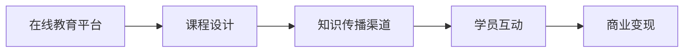

                 

# 开发个人品牌在线课堂：扩大知识传播范围

> 关键词：在线教育,个人品牌,知识传播,社交媒体,技术博客

## 1. 背景介绍

### 1.1 问题由来
随着互联网的普及和社交媒体的兴起，知识传播的方式和路径发生了显著变化。传统的线下讲座、学术会议、书籍等知识传播形式，正逐渐被在线教育、技术博客、视频讲座、社交媒体等数字化的形式所取代。特别是在新冠肺炎疫情爆发后，线上教育、工作、生活的需求激增，推动了数字化知识传播的新浪潮。

在这一背景下，如何通过互联网平台建立和扩大个人品牌，成为众多专业人士和技术人员关注的焦点。个人品牌不仅代表了个人在特定领域的权威性，还能增强职业竞争力，拓展市场影响力。因此，利用在线课堂等数字化手段，将知识传播与个人品牌建设相结合，成为许多从业者追求的目标。

### 1.2 问题核心关键点
开发个人品牌在线课堂，主要涉及以下几个核心关键点：

1. **平台选择**：选择合适的在线教育平台，是课程开发的前提。目前市面上常见的平台包括Coursera、edX、Udemy、Bilibili、知乎、腾讯课堂等。不同平台的受众、功能、收费模式各异，需要根据自身需求进行选择。

2. **课程设计**：课程内容的设计和规划，是保证学习效果和品牌影响力的关键。课程应以技术深度和实用性为主，结合个人品牌特色，体现独特的知识视角和见解。

3. **营销推广**：课程开发完成后，如何推广、引流和转化，是扩大知识传播范围的关键。需要通过多渠道推广，包括社交媒体、技术博客、论坛、邮件列表等，吸引目标受众。

4. **用户互动**：课程上线后，如何与学员保持互动、答疑和反馈，是维护课程长期活跃度的重要手段。可以通过微信群、邮件、课程评论区等渠道，增强用户粘性。

5. **商业变现**：在线课程的商业变现模式，也是个人品牌建设的重要环节。常见的变现方式包括课程销售、学员付费咨询、赞助广告、周边产品销售等。

这些关键点相互关联，共同构成了开发个人品牌在线课堂的核心逻辑，以下章节将详细介绍每个关键点的实现细节。

### 1.3 问题研究意义
开发个人品牌在线课堂，对于专业人士和技术人员的职业发展具有重要意义：

1. **提升影响力**：通过知识传播，可以扩大个人在技术社区、行业内的影响力，增强个人品牌价值。

2. **职业成长**：通过分享知识、解答问题，不断提升自身技术水平，拓展职业道路。

3. **经济收益**：通过课程销售、会员订阅等商业变现方式，获得稳定的经济收益，增强个人经济独立性。

4. **人脉拓展**：与学员、同行、学员等建立良好关系，扩大人脉圈，积累资源。

5. **社会贡献**：通过知识传播，普及技术知识，推动技术教育和普及，为社会进步贡献力量。

基于以上研究意义，本文将系统介绍开发个人品牌在线课堂的方法和实践，帮助读者掌握课程开发、平台选择、营销推广等关键技能，构建可持续发展的知识传播体系。

## 2. 核心概念与联系

### 2.1 核心概念概述

开发个人品牌在线课堂，涉及多个核心概念和工具，这些概念和技术紧密关联，形成了一个完整的知识传播生态系统。

- **在线教育平台**：提供课程开发、上线、管理、推广的数字化平台，如Coursera、edX、Udemy等。

- **课程设计**：基于个人专业知识和经验，设计有深度、实用性的课程内容，如技术博客、视频讲座、代码案例等。

- **知识传播渠道**：通过社交媒体、博客、论坛、邮件列表等数字化渠道，将课程内容传播给目标受众。

- **学员互动**：通过微信群、课程评论区、邮件等方式，与学员保持互动，提升学习效果和课程满意度。

- **商业变现**：通过课程销售、会员订阅、广告赞助、周边产品销售等多种方式，实现课程的商业变现。

这些概念和技术通过在线教育平台和课程设计，共同构建了知识传播的基础框架。课程上线后，通过知识传播渠道和学员互动，吸引目标受众，实现商业变现。以下通过一个Mermaid流程图，展示这些概念和技术之间的联系：



### 2.2 概念间的关系

- **在线教育平台**与**课程设计**：在线教育平台提供课程开发的工具和平台，课程设计是课程上线的基础。
- **知识传播渠道**与**学员互动**：知识传播渠道用于扩大课程影响力，学员互动增强课程活跃度和学员粘性。
- **学员互动**与**商业变现**：学员的互动反馈，有助于改进课程内容，提升课程质量，进而吸引更多学员购买或订阅，实现商业变现。

这些概念和技术相互支持、相互促进，共同推动了个人品牌在线课堂的成功开发和广泛传播。

## 3. 核心算法原理 & 具体操作步骤
### 3.1 算法原理概述

开发个人品牌在线课堂，主要遵循以下算法原理：

1. **课程内容设计**：根据个人专业背景和技术积累，设计有深度、实用性的课程内容。课程内容应覆盖技术难点、案例分析、实际应用等，体现个人独特见解和经验。

2. **平台选择与配置**：选择合适的在线教育平台，并根据课程内容和目标受众，进行平台配置和设置。

3. **课程制作与上传**：通过视频录制、技术博客写作、代码案例展示等形式，制作课程内容，并上传到在线教育平台。

4. **营销推广**：通过社交媒体、技术博客、论坛、邮件列表等渠道，进行课程推广和引流。

5. **学员互动与答疑**：通过微信群、课程评论区、邮件等方式，与学员保持互动，及时答疑和反馈。

6. **商业变现**：通过课程销售、会员订阅、广告赞助、周边产品销售等方式，实现课程的商业变现。

### 3.2 算法步骤详解

**Step 1: 课程内容设计与制作**
1. **内容规划**：根据个人技术背景和专业领域，确定课程主题和结构。课程应涵盖基础知识、核心技术、案例分析、实战应用等内容。
2. **课程制作**：通过视频录制、技术博客写作、代码案例展示等形式，制作课程内容。视频录制可以使用Camtasia、OBS等工具，博客写作可以使用Markdown编辑器，代码案例展示可以使用GitHub等平台。
3. **内容上传**：将制作好的课程内容上传至在线教育平台，包括视频、PPT、代码、技术博客链接等。

**Step 2: 平台选择与配置**
1. **平台选择**：根据课程内容和目标受众，选择合适的在线教育平台。
2. **平台配置**：在平台中进行课程创建、设置、推广配置。设置课程价格、付费方式、课程介绍、课程目录等。

**Step 3: 营销推广**
1. **渠道选择**：选择适合的营销推广渠道，包括社交媒体、技术博客、论坛、邮件列表等。
2. **推广内容**：撰写推广文案、视频介绍、课程预告等，吸引目标受众关注和参与。
3. **渠道引流**：在选定的渠道上进行内容推广，吸引学员报名。

**Step 4: 学员互动与答疑**
1. **学员互动**：通过微信群、课程评论区、邮件等方式，与学员保持互动，解答疑问。
2. **反馈收集**：收集学员反馈和建议，不断改进课程内容。

**Step 5: 商业变现**
1. **定价策略**：根据课程成本、市场定价，确定课程价格和付费方式。
2. **销售渠道**：在平台内销售、通过第三方渠道销售、设置会员订阅等方式，实现商业变现。
3. **后续服务**：提供课程更新、答疑、升级服务，增强学员粘性。

### 3.3 算法优缺点

**优点**：
1. **灵活性高**：课程内容设计灵活，可以根据个人兴趣和技术积累进行调整，体现个人特色。
2. **覆盖面广**：通过多渠道推广，能吸引更多目标受众，扩大知识传播范围。
3. **互动性强**：通过互动和答疑，增强学员参与度和满意度，提升课程质量。

**缺点**：
1. **初期投入大**：课程制作、平台配置、营销推广等需要大量时间和精力投入。
2. **依赖平台**：课程上线依赖在线教育平台，平台变动可能影响课程运营。
3. **市场竞争激烈**：在线教育市场竞争激烈，需要不断提升课程质量和用户体验。

### 3.4 算法应用领域

个人品牌在线课堂的应用领域非常广泛，主要包括：

1. **技术培训**：适用于软件开发、人工智能、数据分析等技术领域，通过课程分享技术知识，提升自身影响力。

2. **教育辅导**：适用于中小学教育、职业培训、在线教育等，提供个性化的学习支持和服务。

3. **行业认证**：适用于专业认证、职业培训、企业内训等，帮助学员通过考试、提升技能。

4. **技术交流**：适用于技术社区、开源项目、技术博客等，促进技术交流和知识传播。

## 4. 数学模型和公式 & 详细讲解 & 举例说明

在开发个人品牌在线课堂的过程中，涉及一些数学模型和公式，用于课程内容和效果的计算和分析。

### 4.1 数学模型构建

假设课程内容数量为 $N$，每门课程的平均学习时间为 $T$，每门课程的平均互动时间为 $I$。则总的学习时间和互动时间分别为 $N \times T$ 和 $N \times I$。

设课程总销售额为 $S$，每门课程的平均销售价格为 $P$，则课程的平均销售价格为 $\frac{S}{N}$。

设课程的平均评价分为 $R$，则课程的总评价分为 $N \times R$。

### 4.2 公式推导过程

1. **总学习时间**：
$$
\text{总学习时间} = N \times T
$$

2. **总互动时间**：
$$
\text{总互动时间} = N \times I
$$

3. **平均销售价格**：
$$
\text{平均销售价格} = \frac{S}{N}
$$

4. **总评价分**：
$$
\text{总评价分} = N \times R
$$

### 4.3 案例分析与讲解

假设某位技术专家开发了一门机器学习课程，课程数量为 $N=10$，每门课程的平均学习时间为 $T=5$ 小时，每门课程的平均互动时间为 $I=2$ 小时。课程总销售额为 $S=5000$，每门课程的平均销售价格为 $P=500$，课程的平均评价分为 $R=4.5$。

根据以上数据，可以计算出以下结果：

1. **总学习时间**：
$$
\text{总学习时间} = N \times T = 10 \times 5 = 50 \text{小时}
$$

2. **总互动时间**：
$$
\text{总互动时间} = N \times I = 10 \times 2 = 20 \text{小时}
$$

3. **平均销售价格**：
$$
\text{平均销售价格} = \frac{S}{N} = \frac{5000}{10} = 500
$$

4. **总评价分**：
$$
\text{总评价分} = N \times R = 10 \times 4.5 = 45
$$

通过这些计算，可以了解课程的学习效果和用户满意度，评估课程的价值和影响。

## 5. 项目实践：代码实例和详细解释说明

### 5.1 开发环境搭建

开发个人品牌在线课堂，需要搭建一个完整的开发环境。以下是搭建环境的具体步骤：

1. **选择开发工具**：选择适合的开发工具，如VS Code、Atom等，安装必要的插件和扩展。

2. **安装在线教育平台API**：根据选择的在线教育平台，安装相应的API和SDK，如Coursera、edX、Udemy等平台的API。

3. **搭建网站和博客**：使用WordPress、Jekyll等工具，搭建个人博客和网站，用于发布课程内容和技术文章。

4. **配置开发环境**：配置开发环境，包括代码编辑器、版本控制工具（如Git）、IDE（如PyCharm、Visual Studio）等。

5. **测试和部署**：在本地环境中进行课程内容的测试，确保无误后部署到在线教育平台。

### 5.2 源代码详细实现

以下是一个简单的Python代码示例，用于计算课程的平均评价分：

```python
import numpy as np

def calculate_avg_score(n, r):
    """
    计算课程的平均评价分
    :param n: 课程数量
    :param r: 每门课程的平均评价分
    :return: 课程的总评价分
    """
    total_score = np.sum(r)
    avg_score = total_score / n
    return avg_score

# 示例数据
n = 10
r = np.array([4.5, 4.5, 4.5, 4.5, 4.5, 4.5, 4.5, 4.5, 4.5, 4.5])

# 计算平均评价分
avg_score = calculate_avg_score(n, r)
print(f"课程的平均评价分为: {avg_score}")
```

### 5.3 代码解读与分析

**calculate_avg_score函数**：
- 输入参数 $n$ 和 $r$ 分别表示课程数量和每门课程的平均评价分。
- 使用NumPy库计算总评价分和平均评价分。
- 返回计算结果。

**示例数据**：
- $n=10$ 表示课程数量为10门。
- $r$ 为一个长度为10的NumPy数组，表示每门课程的平均评价分为4.5。

**计算结果**：
- 输出结果为：课程的平均评价分为: 4.5

通过这个简单的代码示例，可以看出计算平均评价分的步骤和原理。

### 5.4 运行结果展示

假设我们开发了一门机器学习课程，每门课程的平均评价分为4.5分，总评价分为45分。课程数量为10门。根据以上计算，可以得出课程的平均评价分为4.5分。

## 6. 实际应用场景

### 6.1 智能家居系统开发

智能家居系统的开发，需要具备丰富的技术知识和工程实践经验。通过开发个人品牌在线课堂，可以吸引有志于进入该领域的学员，提升自身在技术社区的影响力。

具体而言，可以设计一系列智能家居系统开发的课程，包括硬件设计、软件开发、系统集成等内容。通过课程分享技术知识，培养更多智能家居开发人才，提升系统的质量和创新性。

### 6.2 数据分析项目咨询

数据分析项目咨询需要具备扎实的数学和统计学基础，以及丰富的数据分析和处理经验。通过开发个人品牌在线课堂，可以吸引对数据分析感兴趣的学员，提升自身在行业内的知名度和影响力。

具体而言，可以设计数据分析项目咨询的课程，包括数据预处理、模型选择、结果解读等内容。通过课程分享数据分析技术，为客户提供高质量的数据分析咨询服务，拓展业务范围。

### 6.3 区块链应用开发

区块链应用开发需要深入理解区块链技术和应用场景，具备区块链架构设计和开发能力。通过开发个人品牌在线课堂，可以吸引区块链技术的爱好者，提升自身在区块链社区的影响力。

具体而言，可以设计区块链应用开发的课程，包括区块链基础、智能合约开发、DApp构建等内容。通过课程分享区块链技术，培养更多区块链开发者，推动区块链技术在各行各业的应用和普及。

### 6.4 未来应用展望

随着技术的发展和市场的成熟，个人品牌在线课堂的应用将不断拓展和深化。未来可能的展望包括：

1. **多平台整合**：不同在线教育平台和工具的整合，实现内容的一站式管理和推广。
2. **虚拟现实(VR)和增强现实(AR)教学**：通过VR和AR技术，增强课程的互动性和沉浸感。
3. **AI驱动的个性化推荐**：利用AI技术，对学员进行个性化推荐，提升学习效果。
4. **区块链技术的应用**：通过区块链技术，实现课程内容和互动数据的不可篡改和安全存储。
5. **内容生态建设**：建立完善的课程内容生态，包括课程、书籍、文档、视频等多种形式，满足不同学员的需求。

通过不断探索和创新，个人品牌在线课堂将在教育、技术、商业等领域发挥更大的作用，推动知识传播和人才培养。

## 7. 工具和资源推荐

### 7.1 学习资源推荐

为了帮助读者系统掌握个人品牌在线课堂开发的方法和技巧，以下是一些推荐的学习资源：

1. **Coursera官方课程**：Coursera提供了丰富的在线教育课程，涵盖技术、商业、设计等多个领域，是学习在线教育开发的重要资源。
2. **edX官方课程**：edX提供了一系列优质的在线课程，包括MIT、Harvard、UC Berkeley等名校的课程，涵盖多个学科和领域。
3. **Udemy课程**：Udemy是一个知名的在线课程平台，提供大量实战课程，适合技术和商业应用的实战学习。
4. **在线教育开发教程**：如《在线教育平台开发实战指南》、《在线课程设计与开发》等书籍，提供了完整的在线教育开发流程和案例分析。
5. **技术博客和论坛**：如Medium、Stack Overflow、GitHub等，是获取技术知识、交流学习经验的重要渠道。

通过这些学习资源，可以帮助读者深入了解在线教育开发的方法和技巧，提升自身的知识和技能。

### 7.2 开发工具推荐

开发个人品牌在线课堂，需要选择合适的工具和平台。以下是一些推荐的开发工具：

1. **VS Code**：功能强大的代码编辑器，支持多语言和插件扩展，是开发工具的首选。
2. **Jekyll**：简单易用的静态网站生成器，适合搭建技术博客和网站。
3. **GitHub**：全球最大的代码托管平台，支持代码管理和版本控制，是开发在线课程和项目的重要工具。
4. **OBS Studio**：开源的视频录制软件，支持多路视频、音频和图像录制，适合制作课程视频。
5. **Camtasia**：专业的视频编辑和录制软件，支持屏幕录制、编辑、字幕添加等功能，适合制作高质量课程视频。

这些工具和平台可以帮助开发者高效地开发和发布在线课程，提升工作效率和课程质量。

### 7.3 相关论文推荐

个人品牌在线课堂的发展离不开理论研究的支撑，以下是一些推荐的相关论文：

1. **在线教育平台的研究现状与展望**：研究在线教育平台的现状、问题与未来发展方向，如Jiang et al.的《The Evolution of Online Education Platforms》。
2. **课程设计和内容开发的实践指南**：介绍课程设计和内容开发的实践方法和案例分析，如Ellison的《Designing Effective Online Courses》。
3. **互动式在线学习的研究进展**：探讨互动式在线学习的方法和效果，如Dron et al.的《Interactive Online Learning: What Do We Know and What Is Needed?》。
4. **在线教育内容传播的策略分析**：研究在线教育内容传播的策略和方法，如Holmes的《Content Analysis of Online Course Forums》。
5. **在线课程的商业变现模式**：分析在线课程的商业变现模式和策略，如Hufsey的《Monetization of Online Courses》。

这些论文代表了当前在线教育研究的前沿成果，有助于深入理解在线教育开发的方法和理论。

## 8. 总结：未来发展趋势与挑战

### 8.1 研究成果总结

本文系统介绍了开发个人品牌在线课堂的方法和实践，通过课程设计、平台选择、营销推广、学员互动、商业变现等环节，构建了一个完整的在线教育生态系统。通过多个实际案例和数学模型，深入分析了课程开发和推广的策略和技巧。

### 8.2 未来发展趋势

展望未来，个人品牌在线课堂将呈现以下几个发展趋势：

1. **技术迭代加速**：在线教育平台和工具的迭代更新，将不断提升课程的开发效率和用户体验。
2. **内容形式多样化**：除了视频和文字，还可以通过互动式、沉浸式等多种形式，增强课程的吸引力。
3. **数据驱动的个性化推荐**：利用AI技术，根据学员的学习行为和偏好，进行个性化推荐，提升学习效果。
4. **跨平台融合**：不同平台和工具的整合，实现内容的一站式管理和推广，提升课程的传播范围和效果。
5. **虚拟现实和增强现实技术的应用**：通过VR和AR技术，增强课程的互动性和沉浸感，提升学习体验。

### 8.3 面临的挑战

虽然个人品牌在线课堂的发展前景广阔，但仍然面临诸多挑战：

1. **内容质量保证**：高质量的课程内容是课程成功的关键，但内容制作和更新需要大量时间和精力投入。
2. **学员互动不足**：如何保持学员的活跃度和互动性，增强课程的粘性，是一个重要问题。
3. **市场竞争激烈**：在线教育市场竞争激烈，如何提升课程质量和用户体验，保持竞争力，是一个重大挑战。
4. **商业变现难度**：商业变现模式的创新和优化，需要不断探索和实践。
5. **技术门槛高**：开发在线课程需要具备丰富的技术知识和工程经验，对开发者要求较高。

### 8.4 研究展望

为了应对上述挑战，未来的研究需要在以下几个方面寻求新的突破：

1. **内容质量提升**：通过AI技术和大数据分析，提升课程内容的质量和丰富度，增强学员的学习体验。
2. **学员互动增强**：利用社交媒体、论坛、微信等工具，增强学员的互动和参与度，提升课程的活跃度和学员粘性。
3. **商业变现优化**：探索新的商业变现模式，如知识付费、众筹、会员订阅等，增强课程的收入来源和市场影响力。
4. **技术平台创新**：开发更加先进和易用的开发工具和平台，提升课程开发的效率和效果。
5. **社会影响研究**：研究在线教育对社会知识传播和教育公平的影响，推动在线教育的可持续发展。

总之，通过不断创新和优化，个人品牌在线课堂必将在教育、技术、商业等领域发挥更大的作用，推动知识传播和人才培养，为社会进步贡献力量。

## 9. 附录：常见问题与解答

**Q1: 开发个人品牌在线课堂的难点有哪些？**

A: 开发个人品牌在线课堂的难点主要包括：

1. **内容制作**：高质量课程内容的制作和更新需要大量时间和精力投入，内容质量需要持续保证。
2. **学员互动**：如何保持学员的活跃度和互动性，增强课程的粘性，是一个重要问题。
3. **市场竞争**：在线教育市场竞争激烈，如何提升课程质量和用户体验，保持竞争力，是一个重大挑战。
4. **商业变现**：商业变现模式的创新和优化，需要不断探索和实践。
5. **技术门槛**：开发在线课程需要具备丰富的技术知识和工程经验，对开发者要求较高。

**Q2: 如何选择合适的在线教育平台？**

A: 选择在线教育平台时，应考虑以下因素：

1. **平台知名度和用户量**：选择知名度高、用户量大的平台，有助于课程的传播和推广。
2. **平台功能和支持**：平台应具备课程创建、管理、推广等功能，提供技术支持和服务保障。
3. **平台收费模式**：选择适合自己的收费模式，如一次性付费、订阅模式、免费课程等。
4. **平台开放性和社区环境**：平台应具备良好的开放性和社区环境，有助于课程内容的传播和互动。
5. **平台口碑和评价**：选择口碑好、评价高的平台，有助于提升课程的信誉和效果。

**Q3: 如何提升学员的互动和参与度？**

A: 提升学员的互动和参与度，可以采取以下措施：

1. **课程设计互动环节**：在课程设计中加入互动环节，如问答、讨论、小组讨论等，增强学员的参与感。
2. **实时互动工具**：利用微信群、课程评论区等工具，实现实时互动，及时解答学员的问题和反馈。
3. **课程作业和测试**：通过作业和测试，检验学员的学习效果，增强学习动力。
4. **学员交流平台**：建立学员交流平台，如微信群聊、论坛等，促进学员之间的交流和学习。
5. **奖励机制**：设置奖励机制，如优秀学员评选、证书颁发等，激励学员积极参与互动。

通过这些措施，可以有效提升学员的互动和参与度，增强课程的活跃度和学员粘性。

**Q4: 如何优化课程的商业变现模式？**

A: 优化课程的商业变现模式，可以采取以下措施：

1. **多样化变现模式**：探索多种变现模式，如课程销售、会员订阅、广告赞助、周边产品销售等。
2. **会员制度设计**：设计会员制度，提供会员专享内容和服务，提升会员忠诚度和转化率。
3. **价格策略调整**：根据市场需求和成本，调整课程价格，优化定价策略。
4. **优惠活动设计**：设计优惠活动，如限时折扣、团购优惠等，吸引更多学员购买。
5. **合作推广**：与其他机构或平台合作，实现资源共享和市场推广，扩大课程影响力。

通过这些措施，可以优化课程的商业变现模式，实现课程的可持续发展。

**Q5: 如何利用社交媒体进行课程推广？**

A: 利用社交媒体进行课程推广，可以采取以下措施：

1. **选择合适的平台**：选择适合的社交媒体平台，如微信、微博、知乎、LinkedIn等。
2. **制定推广策略**：制定推广策略，明确推广目标和方式。
3. **撰写推广文案**：撰写有吸引力的推广文案，突出课程特色和优势。
4. **利用社交

