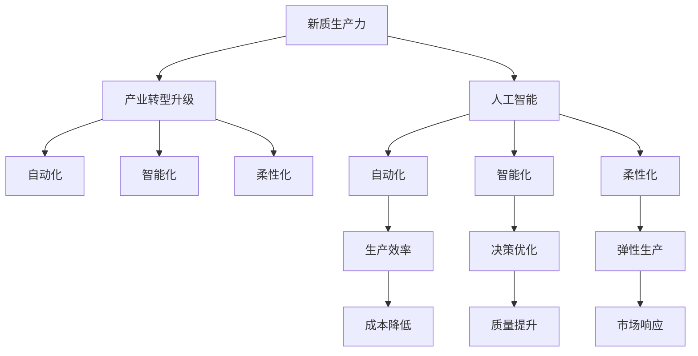

                 

## 1. 背景介绍

在数字化转型的浪潮中，人工智能（AI）技术正以前所未有的速度改变着各行各业的格局。从传统制造业到互联网服务，从金融业到医疗健康，AI技术在提升效率、优化运营、改善用户体验等方面发挥了重要作用。本文将探讨以新质生产力推动产业转型升级的关键问题，分析AI技术在各行业的实际应用案例，展望未来发展趋势，并提出几点建议。

## 2. 核心概念与联系

### 2.1 核心概念概述

- **新质生产力**：指的是由新技术引发的生产力和生产关系的质变。在AI时代，新质生产力主要体现在自动化、智能化、网络化等新形态的生产力。
- **产业转型升级**：指通过技术创新、管理创新、商业模式创新等手段，提升产业的核心竞争力和可持续发展能力，实现从传统产业向高附加值产业的跨越。
- **人工智能**：利用计算机技术模拟人类智能行为，包括感知、推理、学习、决策等能力，用于解决复杂问题。

这些概念之间存在紧密的联系。新质生产力是产业转型升级的核心驱动力，而人工智能则是实现新质生产力的重要手段。通过AI技术的应用，可以实现生产力的自动化、智能化和柔性化，推动产业结构优化升级，提升企业竞争力。

### 2.2 概念间的关系

为更好地理解新质生产力与产业转型升级的关系，以下Mermaid流程图展示了这些概念之间的逻辑关系：



这个流程图展示了新质生产力通过人工智能技术，推动自动化、智能化和柔性化，从而实现生产效率提升、决策优化、成本降低、质量提升和市场响应速度加快，最终实现产业转型升级。

## 3. 核心算法原理 & 具体操作步骤

### 3.1 算法原理概述

以AI技术为基础的新质生产力，其核心在于算法原理的创新与应用。在产业转型升级的过程中，AI算法的主要任务是通过数据驱动的方式，优化生产流程、提高生产效率、提升产品质量和降低运营成本。

常见的AI算法包括监督学习、无监督学习、强化学习、迁移学习等。其中，监督学习通过标注数据训练模型，预测新数据的标签；无监督学习通过未标注数据挖掘模式，发现数据内在关系；强化学习通过与环境交互，优化决策策略；迁移学习通过预训练模型，将已有知识迁移到新任务上。

### 3.2 算法步骤详解

以一个典型的工业生产流程为例，介绍如何通过AI算法实现新质生产力：

1. **数据采集与处理**：从生产设备和传感器中采集实时数据，并进行清洗、标准化和归一化处理。
2. **模型训练**：选择适合的AI算法（如预测模型、优化模型、异常检测模型），利用处理后的数据进行模型训练。
3. **模型部署与应用**：将训练好的模型部署到生产现场，实时处理新数据，输出优化决策或异常预警。
4. **反馈与迭代**：收集模型输出结果和实际效果，反馈到模型训练阶段，进行模型迭代优化。

### 3.3 算法优缺点

AI算法在新质生产力中发挥了重要作用，但也存在一些局限性：

- **优点**：
  - 高效率：自动化处理大量数据，减少人工操作，提高效率。
  - 精准性：通过数据驱动的决策，减少人为误差，提高精度。
  - 灵活性：支持多种应用场景，如预测、优化、监控等。

- **缺点**：
  - 数据依赖：模型训练和应用依赖于高质量数据，数据不足或质量差会影响效果。
  - 复杂性：模型开发和调优过程复杂，需要专业知识和技术支持。
  - 安全风险：模型可能学习到数据中的噪音或偏见，导致错误决策。

### 3.4 算法应用领域

AI算法在新质生产力中的应用非常广泛，以下是几个典型的应用领域：

1. **制造业**：通过AI算法优化生产调度、质量控制、设备维护等环节，实现智能化生产。
2. **物流业**：利用AI算法进行路线规划、库存管理、需求预测，提升物流效率。
3. **金融业**：使用AI算法进行风险评估、信用评分、欺诈检测，提高金融安全性。
4. **医疗健康**：通过AI算法进行疾病诊断、个性化治疗、患者监测，提升医疗服务质量。
5. **零售业**：利用AI算法进行商品推荐、库存管理、营销分析，优化销售策略。

## 4. 数学模型和公式 & 详细讲解 & 举例说明

### 4.1 数学模型构建

在新质生产力应用中，数学模型是理解和实现AI算法的基础。以下是几个常见的数学模型及其构建方法：

- **线性回归模型**：
  $$
  y = \beta_0 + \beta_1x_1 + \beta_2x_2 + ... + \beta_nx_n + \epsilon
  $$
  其中，$y$ 为输出变量，$\beta_i$ 为回归系数，$x_i$ 为输入变量，$\epsilon$ 为误差项。

- **决策树模型**：
  $$
  \text{DecisionTree}(x) = \left\{
  \begin{array}{l}
  \text{输出} = 类别1,\text{if}\ x_1 \leq \theta_1 \\
  \text{输出} = 类别2,\text{if}\ x_1 > \theta_1
  \end{array}
  \right.
  $$
  其中，$x_1$ 为输入特征，$\theta_1$ 为决策阈值。

- **支持向量机模型**：
  $$
  \text{SVM}(x) = \sum_{i=1}^n(\alpha_ix_i + b)
  $$
  其中，$\alpha_i$ 为支持向量系数，$x_i$ 为输入特征，$b$ 为偏置项。

### 4.2 公式推导过程

以线性回归模型为例，介绍其推导过程：

1. 假设数据集为 $(x_i, y_i), i = 1, 2, ..., n$，其中 $y_i$ 为输出变量，$x_i$ 为输入变量。
2. 假设模型为 $y = \beta_0 + \beta_1x_1 + \beta_2x_2 + ... + \beta_nx_n + \epsilon$。
3. 最小二乘法求解回归系数 $\beta$：
  $$
  \beta = (X^TX)^{-1}X^Ty
  $$
  其中，$X$ 为输入矩阵，$y$ 为输出向量。
4. 计算残差平方和（RSS）：
  $$
  RSS = \sum_{i=1}^n(y_i - \hat{y_i})^2
  $$
  其中，$\hat{y_i}$ 为模型预测值。

### 4.3 案例分析与讲解

以一个工厂的生产线优化为例，介绍如何利用数学模型进行新质生产力的应用：

1. **问题定义**：
  - 目标：优化生产线的生产效率，提高产品质量，减少能源消耗。
  - 输入变量：生产设备状态、工人操作、原料供应等。
  - 输出变量：生产效率、产品质量、能源消耗等。

2. **数据采集**：
  - 从生产设备传感器和监控系统采集实时数据。
  - 数据包括设备运行状态、温度、湿度、压力等。

3. **模型选择与训练**：
  - 选择线性回归模型，利用采集的数据进行训练。
  - 模型输出为生产效率、产品质量、能源消耗的预测值。

4. **模型部署与应用**：
  - 将训练好的模型部署到生产现场的监控系统中。
  - 实时监测生产数据，根据模型输出调整生产参数。
  - 优化生产流程，提高生产效率，减少能源消耗。

## 5. 项目实践：代码实例和详细解释说明

### 5.1 开发环境搭建

要进行AI算法项目实践，需要搭建合适的开发环境。以下是Python环境下AI开发的基本步骤：

1. **安装Python**：
  - 下载并安装Python 3.x版本。
  - 安装anaconda，用于创建虚拟环境和安装依赖库。

2. **创建虚拟环境**：
  - 在终端中创建虚拟环境：
    ```
    conda create -n myenv python=3.7
    conda activate myenv
    ```
  - 安装必要的依赖库：
    ```
    conda install numpy scipy scikit-learn pandas matplotlib
    ```

3. **安装AI库**：
  - 安装TensorFlow、PyTorch、scikit-learn等AI库。
  - 安装相应的版本，例如：
    ```
    pip install tensorflow==2.6
    pip install torch==1.12
    ```

### 5.2 源代码详细实现

以下是一个使用TensorFlow实现线性回归模型的代码示例：

```python
import tensorflow as tf

# 定义输入变量和输出变量
x = tf.keras.layers.Input(shape=(1,), name='x')
y = tf.keras.layers.Dense(1, activation='linear')(x)

# 定义模型
model = tf.keras.models.Model(inputs=x, outputs=y)

# 编译模型
model.compile(optimizer=tf.keras.optimizers.Adam(learning_rate=0.001),
              loss='mse',
              metrics=['mae'])

# 训练模型
model.fit(x_train, y_train, epochs=100, batch_size=32, validation_data=(x_test, y_test))
```

### 5.3 代码解读与分析

- **输入变量**：使用`Input`层定义输入变量，维度为1。
- **输出变量**：使用`Dense`层定义输出变量，激活函数为线性函数。
- **模型定义**：使用`Model`类定义模型，指定输入和输出变量。
- **模型编译**：使用`compile`方法编译模型，指定优化器、损失函数和评估指标。
- **模型训练**：使用`fit`方法训练模型，指定训练数据、训练轮数、批次大小和验证数据。

### 5.4 运行结果展示

训练完成后，可以打印模型在测试集上的评估结果：

```python
loss, mae = model.evaluate(x_test, y_test)
print(f'Test loss: {loss}, Test MAE: {mae}')
```

## 6. 实际应用场景

### 6.1 智能制造

智能制造是制造业利用AI技术进行生产优化、质量控制、设备维护的典型应用。通过实时监测生产数据，利用机器学习算法优化生产调度，可以实现智能化生产。

例如，某汽车制造企业利用AI算法优化生产调度，通过预测设备维护需求，减少了生产线的停机时间，提高了生产效率。同时，通过异常检测算法，实时监测生产过程中的异常现象，减少了产品质量问题。

### 6.2 智慧物流

智慧物流利用AI技术进行路线规划、库存管理、需求预测等，提升物流效率和用户体验。例如，某物流公司利用AI算法优化配送路线，通过实时调整配送路线，减少了配送时间和成本。

### 6.3 智能客服

智能客服通过AI算法实现自然语言理解和对话生成，提供7x24小时不间断的客户服务。例如，某电商企业利用AI算法构建智能客服系统，通过分析客户咨询内容，自动生成最佳回答，提升了客户满意度。

### 6.4 未来应用展望

未来，随着AI技术的不断进步，新质生产力的应用场景将更加丰富。以下是几个可能的未来应用：

1. **自动驾驶**：通过AI算法实现无人驾驶，提升交通效率和安全性。
2. **医疗影像分析**：利用AI算法进行医疗影像分析，提高疾病诊断的准确性和效率。
3. **智能家居**：通过AI算法实现智能家居控制，提升家居的舒适度和安全性。
4. **金融风险管理**：利用AI算法进行金融风险预测和分析，提高金融安全性。

## 7. 工具和资源推荐

### 7.1 学习资源推荐

- **Coursera**：提供大量人工智能相关课程，涵盖机器学习、深度学习、自然语言处理等方向。
- **edX**：提供来自全球顶尖大学的人工智能课程，内容丰富且更新迅速。
- **GitHub**：收集了大量开源AI项目，包括代码示例、模型和数据集等。
- **arXiv**：提供最新的人工智能研究论文，涵盖多个领域的前沿进展。

### 7.2 开发工具推荐

- **TensorFlow**：Google开发的深度学习框架，支持多种AI算法和模型。
- **PyTorch**：Facebook开发的深度学习框架，灵活性高，适合研究和实验。
- **Jupyter Notebook**：提供交互式编程环境，方便调试和测试代码。
- **Keras**：基于TensorFlow和Theano的高级API，方便构建和训练模型。

### 7.3 相关论文推荐

- **Deep Learning**：Ian Goodfellow、Yoshua Bengio和Aaron Courville合著的经典教材，涵盖深度学习的理论和应用。
- **Pattern Recognition and Machine Learning**：Christopher Bishop合著的经典教材，涵盖模式识别和机器学习的理论基础。
- **Hands-On Machine Learning with Scikit-Learn, Keras, and TensorFlow**：Aurélien Géron合著的实战指南，涵盖机器学习和深度学习的实践应用。

## 8. 总结：未来发展趋势与挑战

### 8.1 研究成果总结

AI技术在新质生产力中发挥了重要作用，推动了产业转型升级。通过优化生产流程、提高生产效率、提升产品质量和降低运营成本，AI技术已成为企业竞争力的重要来源。

### 8.2 未来发展趋势

未来，AI技术将继续推动新质生产力的发展，以下是几个可能的趋势：

1. **AI技术的普及**：随着AI技术的不断成熟，越来越多的行业和企业将采用AI技术，提升生产力和效率。
2. **多模态融合**：将图像、语音、文本等多种模态信息融合，提升智能系统的综合能力。
3. **联邦学习**：在数据隐私和安全的前提下，利用多方数据进行模型训练，提升AI模型的泛化能力。
4. **自适应算法**：通过自适应算法，提升AI系统在动态环境中的适应能力和鲁棒性。

### 8.3 面临的挑战

尽管AI技术在新质生产力中发挥了重要作用，但仍面临一些挑战：

1. **数据隐私和安全**：大规模数据的应用可能带来隐私和安全问题，需要采取相应的措施进行保护。
2. **算法透明性**：AI算法的决策过程缺乏透明性，难以进行解释和监管。
3. **资源消耗**：AI算法需要大量计算资源，可能带来较高的硬件和能源消耗。
4. **人才培养**：AI技术的复杂性和快速发展需要大量的专业人才，但当前人才供应不足。

### 8.4 研究展望

未来，需要在以下几个方面进行深入研究：

1. **隐私保护**：研究数据隐私和安全保护技术，确保AI技术在数据敏感场景下的应用。
2. **算法透明性**：研究AI算法的透明性和可解释性，提高系统的可信任性和可接受性。
3. **资源优化**：研究AI系统的资源优化技术，提升系统的效率和性能。
4. **人才培养**：加强AI技术的教育培训，培养更多专业人才，推动AI技术的普及和应用。

总之，AI技术在新质生产力中具有广阔的应用前景，但需要在数据隐私、算法透明性、资源消耗和人才培养等方面进行深入研究，以实现AI技术的可持续发展。相信在学界和产业界的共同努力下，AI技术必将在推动产业转型升级中发挥更大的作用。

## 9. 附录：常见问题与解答

**Q1：如何选择合适的AI算法？**

A: 根据具体问题选择合适的算法。例如，预测问题可以使用线性回归、决策树、随机森林等算法；分类问题可以使用SVM、KNN、神经网络等算法；聚类问题可以使用K-means、DBSCAN等算法。

**Q2：AI算法开发需要哪些步骤？**

A: AI算法开发需要以下步骤：
1. 问题定义：明确目标和输入输出变量。
2. 数据采集：收集相关数据，并进行预处理和清洗。
3. 模型选择：根据问题选择合适的算法。
4. 模型训练：利用训练数据训练模型。
5. 模型评估：在测试数据上评估模型性能。
6. 模型应用：将训练好的模型应用到实际问题中。

**Q3：如何提高AI算法的性能？**

A: 提高AI算法性能的方法包括：
1. 数据增强：通过数据增强技术增加数据多样性。
2. 模型优化：使用优化算法提高模型收敛速度。
3. 超参数调优：通过超参数调优提高模型性能。
4. 正则化：使用正则化技术避免过拟合。
5. 模型融合：将多个模型进行融合，提升模型性能。

**Q4：如何评估AI算法的性能？**

A: 评估AI算法性能的方法包括：
1. 均方误差（MSE）：用于回归问题的评估。
2. 准确率（Accuracy）：用于分类问题的评估。
3. F1-score：用于分类和回归问题的综合评估。
4. AUC-ROC曲线：用于二分类问题的评估。

通过本文的系统梳理，可以看到，AI技术在新质生产力中具有广阔的应用前景，但需要在数据隐私、算法透明性、资源消耗和人才培养等方面进行深入研究，以实现AI技术的可持续发展。相信在学界和产业界的共同努力下，AI技术必将在推动产业转型升级中发挥更大的作用。

---

作者：禅与计算机程序设计艺术 / Zen and the Art of Computer Programming

