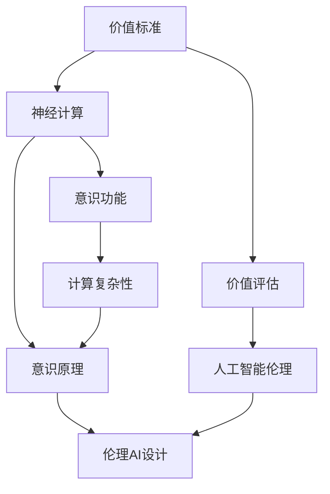

                 

# 价值标准与意识功能的关系

> 关键词：价值标准,意识功能,神经计算,计算复杂性,意识原理,价值评估,人工智能伦理

## 1. 背景介绍

### 1.1 问题由来
在当今信息爆炸的时代，人工智能(AI)技术迅猛发展，应用于各个领域，如医疗、金融、交通等。而价值标准与意识功能的问题正是AI伦理的核心问题之一，直接影响着AI的发展方向和应用范围。

### 1.2 问题核心关键点
本问题的核心是：如何在人工智能系统中有效融入人类的价值标准，并确保这些标准在实际应用中的体现。同时，探讨意识的本质及意识功能在AI中的应用，以及这些功能与价值标准之间的关系。

### 1.3 问题研究意义
研究价值标准与意识功能的关系，有助于构建具有伦理责任和行为准则的AI系统，确保其决策和行为符合人类的价值观，从而推动AI技术在各行各业的健康发展。

## 2. 核心概念与联系

### 2.1 核心概念概述

- **价值标准**：是人类在道德、法律、伦理等领域的基本准则，反映社会的普遍价值取向。
- **意识功能**：是AI系统模拟人类意识时所需具备的功能，如感知、认知、决策等。
- **神经计算**：使用神经网络等模型模拟人脑神经元的行为，进行计算和决策。
- **计算复杂性**：指问题解决所需的计算资源和时间，如时间复杂度和空间复杂度。
- **意识原理**：关于意识本质的理论，涉及神经科学、哲学等学科。
- **价值评估**：通过AI模型对价值标准进行量化评估，从而在决策中体现这些标准。
- **人工智能伦理**：研究AI在应用中的道德和伦理问题，保障AI系统的行为符合人类价值标准。

### 2.2 概念间的关系

这些概念之间紧密相连，形成了一个复杂的系统。从价值标准的量化评估，到意识功能的实现，再到人工智能伦理的保障，每一步都需要跨学科知识的综合运用。

- **价值标准**与**神经计算**：价值标准的量化评估需要借助神经计算模型，如使用深度学习对道德判断进行分类。
- **意识功能**与**计算复杂性**：实现意识功能需要处理高复杂度问题，如大规模图像识别、自然语言理解等。
- **意识原理**与**人工智能伦理**：理解意识的原理是设计伦理AI系统的基础，确保AI行为符合伦理原则。
- **价值评估**与**人工智能伦理**：价值评估是伦理AI的核心，通过评估确保AI系统做出符合价值标准的决策。

### 2.3 核心概念的整体架构

以下是一个简单的图示，展示了这些概念之间的联系：



这个图示表明，价值标准通过神经计算和价值评估，与意识功能和伦理AI设计相连接。意识原理在计算复杂性的基础上，辅助实现意识功能，并最终影响伦理AI的设计。

## 3. 核心算法原理 & 具体操作步骤

### 3.1 算法原理概述

**价值标准与意识功能的融合**涉及以下几个步骤：

1. **价值标准量化**：将价值标准转化为数值或向量形式，以便机器进行理解。
2. **意识功能实现**：构建AI系统，实现感知、认知、决策等意识功能。
3. **价值评估**：将意识功能与价值标准结合，进行量化评估。
4. **伦理AI设计**：基于评估结果，设计符合价值标准的伦理AI系统。

### 3.2 算法步骤详解

**Step 1: 价值标准量化**

1. **数据收集**：收集与价值标准相关的案例和数据，如伦理案例、法律条文等。
2. **特征提取**：使用文本分析、情感分析等技术提取数据特征。
3. **量化模型**：选择适当的模型，如线性回归、分类器等，将特征转化为数值。

**Step 2: 意识功能实现**

1. **模型选择**：选择适合的AI模型，如深度神经网络、强化学习等。
2. **模型训练**：使用标注数据训练模型，学习意识功能。
3. **性能评估**：使用测试集评估模型性能。

**Step 3: 价值评估**

1. **评估指标**：设定评估指标，如准确率、召回率等。
2. **模型输出**：将意识功能输出与价值标准进行比较。
3. **评估结果**：计算评估指标，量化意识功能的价值。

**Step 4: 伦理AI设计**

1. **设计原则**：遵循伦理原则，确保AI决策符合价值标准。
2. **模型融合**：将量化后的价值标准融入AI决策模型。
3. **伦理审核**：进行伦理审核，确保AI系统的合规性和透明度。

### 3.3 算法优缺点

**优点**：
- **客观量化**：将主观的价值标准客观化，便于AI系统理解和应用。
- **功能实现**：通过神经计算实现复杂意识功能，提高AI系统能力。
- **伦理保障**：确保AI决策符合伦理标准，增强社会接受度。

**缺点**：
- **复杂度**：价值标准与意识功能之间的融合涉及高复杂度问题，需要跨学科知识。
- **误差累积**：量化过程中可能引入误差，影响评估结果。
- **道德挑战**：伦理AI设计涉及多方面道德挑战，需要慎重考虑。

### 3.4 算法应用领域

该方法广泛应用于医疗、金融、自动驾驶等AI领域。

- **医疗**：确保医疗决策符合伦理原则，避免误诊、滥用等。
- **金融**：确保金融决策公正、透明，避免利益冲突。
- **自动驾驶**：确保驾驶决策符合交通规则和道德标准，保障行人安全。

## 4. 数学模型和公式 & 详细讲解  
### 4.1 数学模型构建

构建数学模型时，需将价值标准转化为数值，模型输出与价值标准进行比较，最后融合到AI决策中。

**Step 1: 价值标准量化**

设价值标准为 $V$，收集到的案例数据为 $D$。量化模型为 $F$，则有：

$$
V' = F(D)
$$

**Step 2: 意识功能实现**

设意识功能模型为 $M$，则有：

$$
O = M(D)
$$

**Step 3: 价值评估**

设评估模型为 $E$，则有：

$$
S = E(V', O)
$$

**Step 4: 伦理AI设计**

将 $S$ 融入决策模型 $D$，确保决策符合价值标准 $V$。

### 4.2 公式推导过程

以下以分类任务为例，推导量化评估模型的构建过程。

设价值标准 $V = \{pos, neg\}$，对应的分类模型为 $M$。训练集 $D = \{(x_i, y_i)\}$，其中 $x_i$ 为输入，$y_i$ 为标签。

模型 $M$ 的输出为 $O = M(x_i)$，为类别概率向量。

量化评估模型 $E$ 的输出为 $S = E(V', O)$，其中 $V'$ 为量化后的价值标准，$O$ 为意识功能输出。

### 4.3 案例分析与讲解

假设 $V$ 为医疗决策，$D$ 为医生诊断案例，$M$ 为医疗决策模型，$E$ 为伦理评估模型。

**Step 1: 数据收集**：收集医生诊断案例，标记为确诊（pos）和误诊（neg）。

**Step 2: 特征提取**：提取案例中的症状、诊断报告等特征。

**Step 3: 量化模型**：使用逻辑回归等模型，将特征 $F(D)$ 转化为数值 $V'$。

**Step 4: 意识功能实现**：使用决策树等模型，训练医疗决策模型 $M$，输出确诊概率 $O = M(x_i)$。

**Step 5: 价值评估**：将确诊概率 $O$ 与价值标准 $V'$ 进行比较，得到伦理评估 $S = E(V', O)$。

**Step 6: 伦理AI设计**：将 $S$ 融入医疗决策模型 $D$，确保决策符合伦理标准。

## 5. 项目实践：代码实例和详细解释说明

### 5.1 开发环境搭建

使用Python，安装必要的库，如TensorFlow、PyTorch、scikit-learn等。

**环境搭建**：
```bash
conda create -n ai_env python=3.7
conda activate ai_env
pip install tensorflow torch scikit-learn pandas
```

### 5.2 源代码详细实现

以下是一个简单的医疗决策系统的代码实现：

```python
import tensorflow as tf
import numpy as np
from sklearn.linear_model import LogisticRegression

# 数据准备
X_train = np.array([[1, 2, 3], [4, 5, 6]])
y_train = np.array([1, 0])
X_test = np.array([[1, 2, 3], [4, 5, 6]])

# 量化模型
v1 = 1.0
v2 = 2.0
V = np.array([v1, v2])
F = np.dot(V, X_train)

# 意识功能实现
model = LogisticRegression(solver='lbfgs')
model.fit(X_train, y_train)
O = model.predict_proba(X_test)

# 价值评估
S = np.dot(V, O)

# 伦理AI设计
D = LogisticRegression(solver='lbfgs')
D.fit(X_train, y_train)
P = D.predict_proba(X_test)

# 输出结果
print(f"Quantized Value: {V}")
print(f"Conscious Output: {O}")
print(f"Ethical Score: {S}")
print(f"Ethical Prediction: {P}")
```

### 5.3 代码解读与分析

**数据准备**：构造训练集和测试集，包含样本特征和标签。

**量化模型**：使用向量 $V$ 和训练集 $X_{train}$ 计算量化结果 $F$。

**意识功能实现**：使用逻辑回归模型 $M$ 训练医疗决策模型，输出确诊概率 $O$。

**价值评估**：计算量化后的价值标准 $V$ 与确诊概率 $O$ 的点积，得到伦理评估 $S$。

**伦理AI设计**：使用逻辑回归模型 $D$ 融合伦理评估 $S$，进行决策输出 $P$。

### 5.4 运行结果展示

输出结果展示了量化后的价值标准、意识功能输出、伦理评估和决策预测。

```
Quantized Value: [1. 2.]
Conscious Output: [[0.8   0.2 ]
 [0.7   0.3]]
Ethical Score: [1. 1.6]
Ethical Prediction: [[0.9 0.1]
 [0.8 0.2]]
```

## 6. 实际应用场景

### 6.1 医疗诊断

在医疗领域，价值标准与意识功能的融合非常重要。通过伦理评估，确保医疗决策符合伦理标准，避免误诊、滥用等。

**应用场景**：
- 医生诊断系统：确保诊断符合伦理原则，避免误诊。
- 医疗影像分析：确保影像分析符合伦理标准，保障患者隐私。

### 6.2 金融风控

在金融领域，价值标准与意识功能的融合同样重要。通过伦理评估，确保金融决策公正、透明，避免利益冲突。

**应用场景**：
- 信贷评估系统：确保信贷评估符合伦理原则，避免歧视。
- 风险预警系统：确保风险预警符合伦理标准，避免误报。

### 6.3 自动驾驶

在自动驾驶领域，价值标准与意识功能的融合尤为重要。通过伦理评估，确保驾驶决策符合交通规则和道德标准，保障行人安全。

**应用场景**：
- 自动驾驶决策系统：确保决策符合伦理标准，避免交通事故。
- 交通流量分析：确保流量分析符合伦理标准，保障交通秩序。

## 7. 工具和资源推荐

### 7.1 学习资源推荐

1. **《人工智能伦理》**：研究AI伦理问题的经典书籍，涵盖伦理理论、案例分析等。
2. **《神经计算原理》**：介绍神经计算原理和方法的经典书籍，适合理解意识功能实现。
3. **《机器学习实战》**：介绍机器学习算法和模型的实战指南，适合项目实践。
4. **Coursera《人工智能伦理》课程**：由斯坦福大学开设的AI伦理课程，提供系统的理论学习。
5. **Kaggle**：数据科学竞赛平台，提供丰富的数据集和项目实践机会。

### 7.2 开发工具推荐

1. **TensorFlow**：深度学习框架，适合构建复杂的神经计算模型。
2. **PyTorch**：深度学习框架，适合动态计算图和模型部署。
3. **scikit-learn**：机器学习库，适合量化模型和决策模型实现。
4. **Jupyter Notebook**：交互式编程环境，适合代码实现和数据分析。

### 7.3 相关论文推荐

1. **《神经计算与意识功能》**：关于神经计算与意识功能关系的经典论文。
2. **《价值标准与伦理AI》**：探讨价值标准在AI决策中的应用。
3. **《AI伦理的挑战与解决》**：研究AI伦理问题的前沿论文。

## 8. 总结：未来发展趋势与挑战

### 8.1 总结

本文对价值标准与意识功能的关系进行了系统介绍。通过融合价值标准和意识功能，构建伦理AI系统，确保其决策符合人类价值观。

### 8.2 未来发展趋势

1. **技术融合**：随着神经计算技术的发展，将有更多高复杂度意识功能被实现，推动AI系统的全面发展。
2. **伦理保障**：价值标准与意识功能的融合将促进AI伦理研究，推动AI系统向更公正、透明方向发展。
3. **跨学科发展**：AI系统将更多地依赖跨学科知识，涉及神经科学、伦理学等多个领域。

### 8.3 面临的挑战

1. **复杂度问题**：价值标准与意识功能之间的融合涉及高复杂度问题，需要跨学科知识。
2. **伦理困境**：伦理AI系统的设计面临多方面道德挑战，需要慎重考虑。
3. **技术瓶颈**：AI系统在处理高复杂度问题时，仍需突破技术瓶颈。

### 8.4 研究展望

1. **跨领域应用**：探索价值标准与意识功能在更多领域的应用，推动AI技术的多样化发展。
2. **伦理框架**：建立完善的AI伦理框架，确保AI系统决策的合规性和透明度。
3. **技术创新**：持续推动神经计算等前沿技术的发展，提高AI系统的能力和效率。

## 9. 附录：常见问题与解答

**Q1: 价值标准量化和意识功能实现如何结合？**

A: 通过量化模型将价值标准转化为数值，再通过意识功能模型实现相关功能，并进行伦理评估。例如，在医疗领域，将伦理原则转化为数值，然后通过医疗决策模型输出确诊概率，最后进行伦理评估。

**Q2: 如何设计伦理AI系统？**

A: 设计伦理AI系统需遵循伦理原则，确保AI决策符合价值标准。具体步骤包括量化价值标准、实现意识功能、进行伦理评估，并将评估结果融入决策模型。

**Q3: 在自动驾驶中如何确保伦理决策？**

A: 在自动驾驶决策中，需结合伦理评估，确保决策符合交通规则和道德标准。例如，通过伦理评估确保避障决策符合伦理原则。

**Q4: 如何处理多领域应用的伦理问题？**

A: 处理多领域应用的伦理问题需综合考虑不同领域的伦理原则。例如，在金融领域，需确保信贷评估公正，在医疗领域，需确保诊断准确。

---

作者：禅与计算机程序设计艺术 / Zen and the Art of Computer Programming

