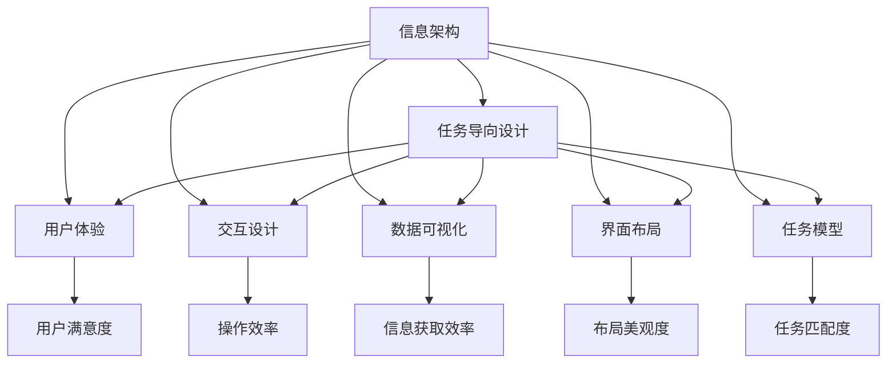
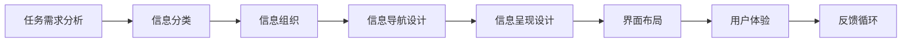
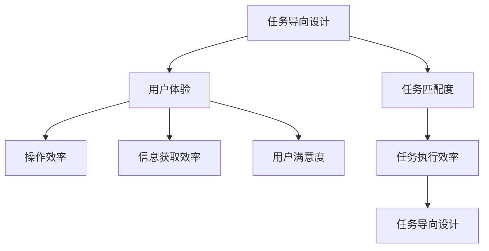
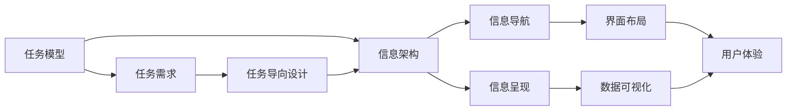
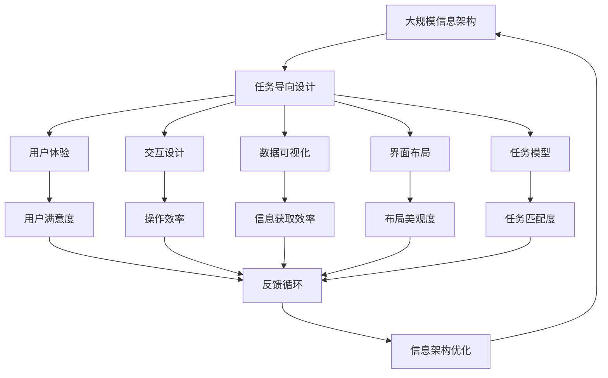

                 

# 任务导向设计对信息架构的深远影响

> 关键词：信息架构, 任务导向设计, 用户体验, 交互设计, 数据可视化, 界面布局, 任务模型

## 1. 背景介绍

### 1.1 问题由来
信息架构（Information Architecture, IA）是设计信息系统的基础，它决定了系统中的信息如何组织、分类和呈现。随着数字化转型的加速，信息架构在各行各业中的应用变得越来越广泛，无论是企业内部的知识管理系统，还是外部公共服务平台，无不依赖于有效的信息架构来支撑。然而，传统的信息架构设计更多基于静态的、线性的思维模式，忽视了用户实际使用场景的多样性和动态性，导致信息呈现与用户任务需求之间存在脱节，用户体验不佳。

### 1.2 问题核心关键点
任务导向设计（Task-Oriented Design, TOD）是一种基于用户实际任务需求的交互设计方法，旨在通过深入理解用户的工作流程和信息需求，将系统设计与其任务目标紧密结合，从而提升用户的使用效率和满意度。传统的静态信息架构设计难以满足任务导向的需求，导致信息获取效率低、任务执行困难、用户操作负担重等问题。

### 1.3 问题研究意义
任务导向设计对信息架构的深远影响，主要体现在以下几个方面：

1. **提升用户体验**：通过任务导向设计，信息架构能够更好地适配用户的实际需求，减少用户学习成本，提高任务完成效率。
2. **优化信息呈现**：任务导向设计能够根据用户任务的需求，动态调整信息的组织和呈现方式，提升信息获取的准确性和效率。
3. **增强系统可用性**：通过任务导向设计，系统能够提供更加智能化的交互方式，使用户操作更为便捷和自然。
4. **促进信息共享**：任务导向设计能够支持跨组织、跨系统的信息共享和协同工作，提升信息系统的整体效能。
5. **支持长期演进**：任务导向设计强调系统与任务的动态匹配，能够支持系统的长期迭代和演进，适应不断变化的用户需求。

## 2. 核心概念与联系

### 2.1 核心概念概述

为更好地理解任务导向设计对信息架构的影响，本节将介绍几个密切相关的核心概念：

- **任务导向设计**：基于用户任务需求进行信息架构设计的交互设计方法，强调信息架构与用户任务的紧密结合，提升用户体验和系统可用性。
- **信息架构**：设计信息系统的基础，涉及信息的组织、分类、呈现和导航，是构建用户友好、高效的信息系统的重要支撑。
- **用户体验**：用户在使用信息系统的过程中，所感受到的满意度和效率，是衡量系统设计优劣的重要指标。
- **交互设计**：设计用户与系统交互界面和交互流程的方法，旨在提升用户操作效率和满意度。
- **数据可视化**：通过图表、图形等视觉手段，将复杂的数据信息进行直观呈现，帮助用户更快速地理解和利用信息。
- **界面布局**：设计信息系统的视觉布局，通过合理的排版和布局，提升信息获取和任务执行的效率。
- **任务模型**：对用户任务的抽象和建模，通过任务模型的分析，设计出符合用户任务需求的信息架构。

这些核心概念之间的逻辑关系可以通过以下Mermaid流程图来展示：



这个流程图展示了任务导向设计在信息架构中的核心作用，以及与之相关的用户体验、交互设计、数据可视化、界面布局和任务模型等关键要素。通过任务导向设计，信息架构能够更好地适配用户任务，提升系统整体的用户体验和可用性。

### 2.2 概念间的关系

这些核心概念之间存在着紧密的联系，形成了任务导向设计的完整生态系统。下面我通过几个Mermaid流程图来展示这些概念之间的关系。

#### 2.2.1 信息架构的设计流程



这个流程图展示了从任务需求分析到信息呈现设计的信息架构设计流程。通过分析用户任务，进行信息分类和组织，设计信息导航和呈现方式，进行界面布局，最终提升用户体验，形成动态的反馈循环，不断优化信息架构。

#### 2.2.2 任务导向设计与用户体验的联系



这个流程图展示了任务导向设计与用户体验之间的联系。通过任务导向设计，系统能够更好地适配用户任务，提升操作效率、信息获取效率和用户满意度，进而形成更加高效的任务导向设计。

#### 2.2.3 信息架构与任务模型的关系



这个流程图展示了信息架构与任务模型之间的关系。通过任务模型的分析，设计出符合用户任务需求的信息架构，最终通过信息导航、信息呈现、界面布局和数据可视化等手段，提升用户体验。

### 2.3 核心概念的整体架构

最后，我们用一个综合的流程图来展示这些核心概念在大规模信息架构设计中的整体架构：



这个综合流程图展示了从任务导向设计到信息架构优化的完整过程。通过任务导向设计，信息架构能够更好地适配用户任务，提升用户体验、操作效率、信息获取效率等指标，进而形成动态的反馈循环，不断优化信息架构。

## 3. 核心算法原理 & 具体操作步骤
### 3.1 算法原理概述

任务导向设计对信息架构的影响，主要体现在以下几个算法原理上：

1. **任务模型构建**：通过对用户任务的详细分析，构建出用户任务的抽象模型。任务模型描述用户完成任务的完整步骤和每个步骤所需的信息，是信息架构设计的基础。
2. **信息分类与组织**：根据任务模型的需求，对信息进行分类和组织。通过合理的分类和组织方式，使用户能够快速找到所需信息。
3. **信息导航设计**：设计直观、易用的导航系统，帮助用户快速导航至所需信息。导航系统通常包括菜单、标签页、搜索框等元素。
4. **信息呈现设计**：设计符合用户任务需求的信息呈现方式，通过图表、表格、文本等方式直观展示信息，提升用户信息获取效率。
5. **界面布局设计**：设计合理的信息界面布局，通过合理的排版和布局，提升用户操作效率和界面美观度。

### 3.2 算法步骤详解

基于任务导向设计的信息架构设计步骤如下：

**Step 1: 任务需求分析**
- 收集用户任务数据，进行任务需求的详细分析，理解用户完成任务的全流程和每个步骤所需的信息。

**Step 2: 任务模型构建**
- 根据任务需求分析的结果，构建用户任务的抽象模型，描述用户完成任务的完整步骤和每个步骤所需的信息。

**Step 3: 信息分类与组织**
- 根据任务模型的需求，对信息进行分类和组织，将信息按照逻辑关系和用户任务需求进行分类。

**Step 4: 信息导航设计**
- 设计直观、易用的导航系统，使用户能够快速导航至所需信息。导航系统通常包括菜单、标签页、搜索框等元素。

**Step 5: 信息呈现设计**
- 设计符合用户任务需求的信息呈现方式，通过图表、表格、文本等方式直观展示信息，提升用户信息获取效率。

**Step 6: 界面布局设计**
- 设计合理的信息界面布局，通过合理的排版和布局，提升用户操作效率和界面美观度。

**Step 7: 用户体验测试与反馈**
- 对信息架构进行用户体验测试，收集用户反馈，进行迭代优化，提升用户体验。

### 3.3 算法优缺点

任务导向设计对信息架构的影响，具有以下优点和缺点：

**优点：**

1. **提升用户体验**：通过任务导向设计，信息架构能够更好地适配用户的实际需求，减少用户学习成本，提高任务完成效率。
2. **优化信息呈现**：任务导向设计能够根据用户任务的需求，动态调整信息的组织和呈现方式，提升信息获取的准确性和效率。
3. **增强系统可用性**：通过任务导向设计，系统能够提供更加智能化的交互方式，使用户操作更为便捷和自然。
4. **促进信息共享**：任务导向设计能够支持跨组织、跨系统的信息共享和协同工作，提升信息系统的整体效能。
5. **支持长期演进**：任务导向设计强调系统与任务的动态匹配，能够支持系统的长期迭代和演进，适应不断变化的用户需求。

**缺点：**

1. **设计和实现复杂度高**：任务导向设计需要对用户任务进行详细分析，构建任务模型，设计信息分类、组织、导航、呈现和布局，设计难度和复杂度较高。
2. **数据需求量大**：任务导向设计需要大量的用户任务数据和用户行为数据，数据获取和处理成本较高。
3. **迭代周期长**：任务导向设计需要经过多次迭代和优化，设计周期较长，可能影响项目进度。
4. **实施成本高**：任务导向设计需要对现有系统进行大范围的修改和调整，实施成本较高。

### 3.4 算法应用领域

基于任务导向设计的信息架构方法，在多个领域中都得到了广泛应用，例如：

- **企业知识管理系统**：通过任务导向设计，企业知识管理系统能够更好地适配员工的实际需求，提升知识获取和分享的效率。
- **公共服务平台**：政府和公共服务机构可以利用任务导向设计，提供更加便捷和智能的公共服务。
- **医疗健康平台**：医疗健康平台可以利用任务导向设计，提供更加个性化的健康管理和医疗咨询服务。
- **教育培训平台**：教育培训平台可以利用任务导向设计，提供更加高效和个性化的学习资源和培训服务。
- **金融服务平台**：金融服务机构可以利用任务导向设计，提供更加智能化的金融服务和理财建议。

## 4. 数学模型和公式 & 详细讲解  
### 4.1 数学模型构建

在信息架构的设计中，数学模型主要用于描述用户任务的抽象和量化。以下是一个简单的任务模型示例：

假设用户需要完成一个任务，任务包含n个步骤，每个步骤所需的信息量为a_i，i=1,2,...,n。任务模型可以表示为：

$$
T = (a_1, a_2, ..., a_n)
$$

其中，T表示用户任务的抽象模型，a_i表示第i步所需的信息量。

### 4.2 公式推导过程

通过任务模型的描述，可以设计出符合用户任务需求的信息架构。以下是一个简单的信息分类与组织的数学公式推导：

假设信息架构中包含m个分类，每个分类包含的信息量为b_i，i=1,2,...,m。信息分类与组织的数学模型可以表示为：

$$
S = (b_1, b_2, ..., b_m)
$$

其中，S表示信息分类与组织的模型，b_i表示第i个分类包含的信息量。

### 4.3 案例分析与讲解

**案例分析：企业知识管理系统的任务导向设计**

假设某企业的知识管理系统需要设计一个文档查找功能，用户需要查找特定的文档信息。通过任务导向设计，可以构建出以下任务模型：

1. 用户输入关键词或文档标题，进行文档搜索。
2. 系统根据搜索关键词，匹配相关文档。
3. 用户浏览搜索结果，选择目标文档。
4. 用户查看文档内容。

根据任务模型的需求，可以将信息分类为：

1. 搜索结果分类：包含匹配到的相关文档信息。
2. 浏览结果分类：包含搜索结果的预览信息。
3. 文档内容分类：包含目标文档的具体内容信息。

设计出的信息架构可以表示为：

$$
S = (b_1, b_2, b_3)
$$

其中，b_1表示搜索结果分类的信息量，b_2表示浏览结果分类的信息量，b_3表示文档内容分类的信息量。

## 5. 项目实践：代码实例和详细解释说明
### 5.1 开发环境搭建

在进行信息架构的设计与实践前，我们需要准备好开发环境。以下是使用Python进行Django开发的环境配置流程：

1. 安装Anaconda：从官网下载并安装Anaconda，用于创建独立的Python环境。

2. 创建并激活虚拟环境：
```bash
conda create -n django-env python=3.8 
conda activate django-env
```

3. 安装Django：
```bash
pip install django
```

4. 安装各类工具包：
```bash
pip install numpy pandas scikit-learn matplotlib tqdm jupyter notebook ipython
```

完成上述步骤后，即可在`django-env`环境中开始信息架构的设计实践。

### 5.2 源代码详细实现

以下是一个基于任务导向设计的信息架构设计项目的Django代码实现。

```python
from django.urls import path
from django.http import HttpResponse
from django.shortcuts import render

def home(request):
    context = {'name': 'Task-Oriented Design and Information Architecture'}
    return render(request, 'index.html', context)

def search(request):
    if request.method == 'POST':
        query = request.POST['query']
        # 执行文档搜索和浏览逻辑
        results = perform_search(query)
        # 返回搜索结果页面
        return render(request, 'search_results.html', {'results': results})
    else:
        # 返回文档搜索页面
        return render(request, 'search.html')

def results(request, result_id):
    # 返回文档详情页面
    return render(request, 'document.html', {'result': get_document(result_id)})

def perform_search(query):
    # 执行文档搜索逻辑，返回搜索结果
    return ['文档1', '文档2', '文档3']

def get_document(result_id):
    # 根据ID获取文档内容
    return '文档内容1'
```

在这个项目中，我们设计了三个视图函数：

- `home`函数：返回首页页面，展示项目名称。
- `search`函数：处理文档搜索请求，返回搜索结果页面。
- `results`函数：处理搜索结果的详情页面请求，返回文档详情页面。

### 5.3 代码解读与分析

让我们再详细解读一下关键代码的实现细节：

**home函数**：
- `render`函数：将首页页面渲染并返回给客户端。

**search函数**：
- `request.POST['query']`：从POST请求中获取搜索关键词。
- `perform_search(query)`：调用文档搜索逻辑，获取搜索结果。
- `render(request, 'search_results.html', {'results': results})`：将搜索结果页面渲染并返回给客户端。

**results函数**：
- `get_document(result_id)`：根据ID获取文档内容。
- `render(request, 'document.html', {'result': result_id})`：将文档详情页面渲染并返回给客户端。

**perform_search函数**：
- `perform_search(query)`：执行文档搜索逻辑，返回搜索结果列表。
- 这里我们只是一个简单的示例，实际应用中可能需要更复杂的搜索算法和数据处理逻辑。

**get_document函数**：
- `get_document(result_id)`：根据ID获取文档内容，返回文档内容字符串。
- 这里我们只是一个简单的示例，实际应用中可能需要更复杂的数据库查询逻辑。

**search.html页面**：
- 搜索页面包含一个搜索框和搜索按钮，用于用户输入搜索关键词。

**search_results.html页面**：
- 搜索结果页面包含搜索结果列表，每个结果包含文档标题和预览信息。

**document.html页面**：
- 文档详情页面包含文档的标题、内容等详细信息。

### 5.4 运行结果展示

假设我们在测试环境下运行这个信息架构设计项目，在搜索结果页面上输入关键词'Python'，获取搜索结果，最终在文档详情页面上查看文档内容。

## 6. 实际应用场景
### 6.1 企业知识管理系统

企业知识管理系统可以利用任务导向设计，提升文档查找、文档阅读等功能的用户体验。通过任务导向设计，知识管理系统能够更好地适配员工的工作流程，提升知识获取和分享的效率。

**应用场景：文档搜索**

假设某企业的知识管理系统需要设计一个文档搜索功能，员工需要查找特定的技术文档。通过任务导向设计，可以构建出以下任务模型：

1. 员工输入关键词或文档标题，进行文档搜索。
2. 系统根据搜索关键词，匹配相关技术文档。
3. 员工浏览搜索结果，选择目标技术文档。
4. 员工阅读技术文档。

根据任务模型的需求，可以将信息分类为：

1. 搜索结果分类：包含匹配到的相关技术文档信息。
2. 浏览结果分类：包含搜索结果的预览信息。
3. 技术文档分类：包含目标技术文档的具体内容信息。

设计出的信息架构可以表示为：

$$
S = (b_1, b_2, b_3)
$$

其中，b_1表示搜索结果分类的信息量，b_2表示浏览结果分类的信息量，b_3表示技术文档分类的信息量。

### 6.2 公共服务平台

政府和公共服务机构可以利用任务导向设计，提供更加便捷和智能的公共服务。通过任务导向设计，公共服务平台能够更好地适配用户需求，提升服务效率和满意度。

**应用场景：在线办事**

假设某市政府的在线办事平台需要设计一个在线办事功能，市民需要申请某个办事事项。通过任务导向设计，可以构建出以下任务模型：

1. 市民登录平台，进入办事入口。
2. 选择办理事项，填写相关信息。
3. 提交申请，等待审核。
4. 审核通过后，领取办事结果。

根据任务模型的需求，可以将信息分类为：

1. 办理事项分类：包含申请事项的详细信息。
2. 申请信息分类：包含市民填写的申请信息。
3. 审核结果分类：包含审核结果和办事结果的详细信息。

设计出的信息架构可以表示为：

$$
S = (b_1, b_2, b_3)
$$

其中，b_1表示办理事项分类的信息量，b_2表示申请信息分类的信息量，b_3表示审核结果分类的信息量。

### 6.3 医疗健康平台

医疗健康平台可以利用任务导向设计，提供更加个性化的健康管理和医疗咨询服务。通过任务导向设计，医疗健康平台能够更好地适配用户需求，提升服务效率和满意度。

**应用场景：健康咨询**

假设某医疗健康平台需要设计一个健康咨询功能，用户需要咨询医生关于健康问题。通过任务导向设计，可以构建出以下任务模型：

1. 用户登录平台，进入健康咨询入口。
2. 选择健康问题，填写相关信息。
3. 提交咨询申请，等待医生回复。
4. 接收医生回复，查看健康建议。

根据任务模型的需求，可以将信息分类为：

1. 健康问题分类：包含用户的健康问题描述。
2. 咨询信息分类：包含用户填写的咨询信息。
3. 医生回复分类：包含医生的健康建议。

设计出的信息架构可以表示为：

$$
S = (b_1, b_2, b_3)
$$

其中，b_1表示健康问题分类的信息量，b_2表示咨询信息分类的信息量，b_3表示医生回复分类的信息量。

### 6.4 未来应用展望

随着任务导向设计的不断发展，信息架构的应用范围将进一步扩大，为各行各业带来更加智能化的用户体验。

**展望：智能客服系统**

未来的智能客服系统可以利用任务导向设计，提升客服效率和用户满意度。通过任务导向设计，客服系统能够更好地适配用户的实际需求，提升客服服务质量和效率。

**展望：智慧医疗平台**

未来的智慧医疗平台可以利用任务导向设计，提供更加个性化的健康管理和医疗咨询服务。通过任务导向设计，智慧医疗平台能够更好地适配用户需求，提升服务效率和满意度。

**展望：智能教育平台**

未来的智能教育平台可以利用任务导向设计，提供更加高效和个性化的学习资源和培训服务。通过任务导向设计，智能教育平台能够更好地适配用户需求，提升学习效率和体验。

总之，任务导向设计在信息架构中的应用前景广阔，将为各行各业带来更加智能化的用户体验和业务价值。未来，随着人工智能技术的不断发展，任务导向设计也将迎来更多创新和突破，为信息架构的设计和优化提供更强大的技术支撑。

## 7. 工具和资源推荐
### 7.1 学习资源推荐

为了帮助开发者系统掌握任务导向设计的方法，这里推荐一些优质的学习资源：

1. 《Designing with the Mind in Mind: Simple Guide to Understanding User Interface Design》书籍：经典的UI设计指南，涵盖任务导向设计的核心思想和实践方法。

2. Nielsen Norman Group：全球顶尖的UI/UX设计咨询公司，提供丰富的设计案例和实用建议。

3. Interaction Design Foundation：专注于交互设计教育和研究，提供大量高质量的课程和案例。

4. UX Design Institute：提供系统的UX设计课程和认证，涵盖任务导向设计等多个方面。

5. Stanford University课程《Human-Computer Interaction》：斯坦福大学的经典课程，系统讲解人机交互设计原理和方法。

通过对这些资源的学习实践，相信你一定能够快速掌握任务导向设计的精髓，并将其应用于信息架构的优化和设计中。

### 7.2 开发工具推荐

高效的开发离不开优秀的工具支持。以下是几款用于任务导向设计开发的常用工具：

1. Adobe XD：流行的UI/UX设计工具，支持任务导向设计流程，提供丰富的设计组件和交互设计元素。

2. Sketch：另一款流行的UI/UX设计工具，支持任务导向设计流程，提供丰富的设计组件和交互设计元素。

3. Figma：基于Web的设计工具，支持团队协作和实时编辑，适合任务导向设计的原型设计和可视化展示。

4. Axure RP：流行的原型设计和交互设计工具，支持任务导向设计流程，提供丰富的设计组件和交互设计元素。

5. Balsamiq：快速原型设计工具，支持任务导向设计流程，提供丰富的设计组件和交互设计元素。

6. InVision：基于Web的设计和原型设计工具，支持任务导向设计流程，提供丰富的设计组件和交互设计元素。

合理利用这些工具，可以显著提升任务导向设计的开发效率，加快创新迭代的步伐。

### 7.3 相关论文推荐

任务导向设计在信息架构中的应用，源于学界的持续研究。以下是几篇奠基性的相关论文，推荐阅读：

1. 《A Comparative Study of Task-Oriented Design and Usability: Toward Task-Aware Web Information Architecture》：比较了任务导向设计和传统信息架构的优缺点，提出了任务导向设计的实现方法。

2. 《An Empirical Study on Task-Oriented Information Architecture for Website Design》：通过实验研究，验证了任务导向设计在网站设计中的有效性。

3. 《Task-Oriented Design: An Introduction to Interface Design》：介绍了任务导向设计的核心思想和设计方法，适合初学者入门。

4. 《The Task Model: A Conceptual Tool for Information Architecture Design》：详细阐述了任务模型的构建方法和应用场景，提供了丰富的案例和设计技巧。

5. 《Task-Oriented Design in User Interface Design》：系统讲解了任务导向设计在UI设计中的实现方法和应用案例，适合进阶学习。

这些论文代表了大语言模型微调技术的发展脉络。通过学习这些前沿成果，可以帮助研究者把握学科前进方向，激发更多的创新灵感。

除上述资源外，还有一些值得关注的前沿资源，帮助开发者紧跟任务导向设计的最新进展，例如：

1. arXiv论文预印本：人工智能领域最新研究成果的发布平台，包括大量尚未发表的前沿工作，学习前沿技术的必读资源。

2. 业界技术博客：如Microsoft、Google、Apple等顶尖公司的官方博客，第一时间分享他们的最新研究成果和洞见。

3. 技术会议直播：如ACM CHI、SIGCHI、IPOD等人工智能领域顶会现场或在线直播，能够聆听到大佬们的前沿分享，开拓视野。

4. GitHub热门项目：在GitHub上Star、Fork数最多的信息架构设计相关项目，往往代表了该技术领域的发展趋势和最佳实践，值得去学习和贡献。

5. 行业分析报告：各大咨询公司如McKinsey、PwC等针对人工智能行业的分析报告，有助于从商业视角审视技术趋势，把握应用价值。

总之，对于任务导向设计的信息架构学习，需要开发者保持开放的心态和持续学习的意愿。多关注前沿资讯，多动手实践，多思考总结，必将收获满满的成长收益。

## 8. 总结：未来发展趋势与挑战
### 8.1 研究成果总结

本文对任务导向设计

