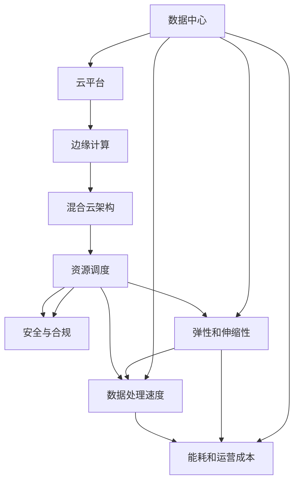

                 

## 1. 背景介绍

### 1.1 问题由来
随着数字化时代的到来，计算基础设施成为企业和组织中最为重要的资产之一。无论是数据中心、云平台还是边缘计算，计算基础设施的效率和可靠性直接影响着业务发展和用户体验。然而，随着技术的快速发展和应用的不断拓展，现有的计算基础设施已经难以满足日益增长的需求。例如，全球性疫情和电商行业的爆炸式增长，都导致计算资源需求激增，导致计算基础设施难以应对。此外，新兴的数据分析、机器学习和人工智能应用，也对计算基础设施提出了新的要求。因此，优化计算基础设施，提高其可用性和效率，成为了当前科技界和产业界亟待解决的问题。

### 1.2 问题核心关键点
为了优化计算基础设施，我们需要关注以下几个核心问题：
1. **数据中心建设**：如何规划和设计数据中心，以最大化资源利用率、降低能耗和运营成本？
2. **云平台优化**：如何设计和管理云平台，以提供更好的弹性和伸缩性，满足不同应用的需求？
3. **边缘计算应用**：如何通过边缘计算技术，提升数据处理速度和减少延迟，优化用户体验？
4. **混合云架构**：如何构建混合云架构，以实现不同计算环境之间的无缝集成和资源共享？
5. **资源调度**：如何优化资源调度算法，提高资源的利用率，避免资源浪费？
6. **安全与合规**：如何确保计算基础设施的安全性和合规性，防范潜在的威胁和风险？

### 1.3 问题研究意义
优化计算基础设施，对于提升企业的数字化转型速度、降低运营成本、提高用户体验和竞争力具有重要意义：

1. **提升数字化转型速度**：高效的计算基础设施可以加速企业对新技术的采纳和应用，快速响应市场变化。
2. **降低运营成本**：通过优化资源利用率、降低能耗和提升系统效率，显著降低数据中心和云平台的运营成本。
3. **提高用户体验**：通过减少延迟和提高数据处理速度，提升用户满意度和粘性。
4. **增强竞争力**：拥有高性能计算基础设施的企业，可以更好地支持复杂的应用场景和业务模型，保持行业领先地位。
5. **保障安全与合规**：确保计算基础设施的安全性和合规性，避免数据泄露和违规操作，保护企业声誉和利益。

## 2. 核心概念与联系

### 2.1 核心概念概述

为了更好地理解如何优化计算基础设施，我们需要掌握几个核心概念：

- **数据中心**：由服务器、网络、存储等硬件设施构成的计算环境，用于提供数据处理和计算服务。
- **云平台**：基于互联网提供计算资源和服务的平台，如AWS、Azure、Google Cloud等，支持弹性伸缩和按需使用。
- **边缘计算**：在接近数据源的本地设备或网络中进行的计算，以减少延迟和提高响应速度。
- **混合云架构**：结合公有云和私有云的架构，实现不同计算环境之间的无缝集成和资源共享。
- **资源调度**：动态分配和调度计算资源，以最大化资源利用率，避免资源浪费。
- **安全与合规**：确保计算基础设施的安全性和合规性，遵循相关法规和标准。

这些概念之间存在着紧密的联系，共同构成了计算基础设施优化的整体框架。通过理解这些核心概念，我们可以更好地把握优化策略的设计和实施。

### 2.2 概念间的关系

这些核心概念之间存在着复杂的联系，形成了一个有机的整体。以下是一个Mermaid流程图，展示了这些概念之间的关系：



这个流程图展示了数据中心、云平台、边缘计算、混合云架构、资源调度和安全与合规之间的关系：

1. 数据中心提供基础计算能力，云平台基于数据中心提供弹性伸缩服务。
2. 边缘计算在接近数据源处进行计算，以提高数据处理速度和减少延迟。
3. 混合云架构实现不同计算环境之间的无缝集成和资源共享。
4. 资源调度动态分配和调度计算资源，以最大化资源利用率。
5. 安全与合规确保基础设施的安全性和合规性。

这些概念相互依赖、相互促进，共同决定了计算基础设施的整体性能和可用性。

## 3. 核心算法原理 & 具体操作步骤

### 3.1 算法原理概述

优化计算基础设施，本质上是一个多目标优化问题，涉及多个子问题的优化。常见的优化目标包括：

- **能耗和运营成本**：通过降低能耗和运营成本，提高计算基础设施的效率。
- **弹性和伸缩性**：通过提高弹性伸缩能力，满足不同应用的需求。
- **数据处理速度**：通过减少延迟和提高数据处理速度，提升用户体验。

这些优化目标之间存在冲突，需要进行综合权衡和优化。以下是一个多目标优化问题的数学模型：

$$
\begin{aligned}
&\text{minimize} && f(x_1, x_2, x_3) = (C_1, C_2, C_3) \\
&\text{subject to} && g_i(x_1, x_2, x_3) \leq 0, i = 1, 2, \ldots, m \\
& && h_j(x_1, x_2, x_3) = 0, j = 1, 2, \ldots, p
\end{aligned}
$$

其中，$f(x_1, x_2, x_3)$ 是优化目标函数，$g_i(x_1, x_2, x_3) \leq 0$ 是约束条件，$h_j(x_1, x_2, x_3) = 0$ 是等式约束条件。

### 3.2 算法步骤详解

以下是一个多目标优化问题的求解步骤：

1. **目标函数和约束条件的设定**：确定优化目标和约束条件，如能耗、运营成本、弹性伸缩、数据处理速度等。
2. **求解优化问题的近似解**：采用多目标优化算法，如Pareto优化算法、权重加和优化算法等，求解近似解。
3. **评估和验证解的可行性和性能**：通过模拟和实验，评估近似解的可行性和性能，优化算法参数。
4. **部署优化策略**：将优化策略部署到实际的计算基础设施中，监控和调整策略参数。

### 3.3 算法优缺点

**优点**：

1. **综合优化**：考虑多个优化目标，进行综合权衡，避免单一目标优化导致的偏颇。
2. **动态调整**：通过动态调整优化策略，适应不同的应用场景和需求。
3. **提高效率**：通过优化能耗、运营成本和数据处理速度，提高计算基础设施的效率。

**缺点**：

1. **复杂度较高**：涉及多个目标和约束，优化过程较为复杂。
2. **数据需求大**：需要大量的数据和实验结果，以评估优化策略的效果。
3. **实施难度大**：优化策略需要与具体的计算基础设施和应用场景相结合，实施难度较大。

### 3.4 算法应用领域

优化计算基础设施的算法和策略，可以应用于以下领域：

- **数据中心设计**：通过优化设计，提高数据中心的能效和运营效率。
- **云平台管理**：通过优化资源分配和调度，提高云平台的弹性伸缩能力和用户体验。
- **边缘计算部署**：通过优化边缘计算节点和网络拓扑，提高数据处理速度和减少延迟。
- **混合云架构构建**：通过优化不同云平台之间的集成和资源共享，提高系统的灵活性和可扩展性。
- **资源调度优化**：通过优化资源调度和分配算法，提高资源利用率，避免资源浪费。
- **安全与合规保障**：通过优化安全策略和合规管理，确保计算基础设施的安全性和合规性。

## 4. 数学模型和公式 & 详细讲解 & 举例说明

### 4.1 数学模型构建

为了更好地描述优化计算基础设施的多目标优化问题，我们可以构建一个数学模型：

$$
\begin{aligned}
&\text{minimize} && f_1(x_1, x_2, x_3) + \omega_2 f_2(x_1, x_2, x_3) + \omega_3 f_3(x_1, x_2, x_3) \\
&\text{subject to} && g_i(x_1, x_2, x_3) \leq 0, i = 1, 2, \ldots, m \\
& && h_j(x_1, x_2, x_3) = 0, j = 1, 2, \ldots, p
\end{aligned}
$$

其中，$f_1(x_1, x_2, x_3)$、$f_2(x_1, x_2, x_3)$、$f_3(x_1, x_2, x_3)$ 是三个优化目标函数，$\omega_2$、$\omega_3$ 是权值，$g_i(x_1, x_2, x_3) \leq 0$ 是约束条件，$h_j(x_1, x_2, x_3) = 0$ 是等式约束条件。

### 4.2 公式推导过程

假设我们有三个优化目标：能耗、运营成本和数据处理速度。设 $x_1$ 为能耗，$x_2$ 为运营成本，$x_3$ 为数据处理速度。我们可以构建以下目标函数：

$$
f_1(x_1, x_2, x_3) = x_1, \quad f_2(x_1, x_2, x_3) = x_2, \quad f_3(x_1, x_2, x_3) = 1/x_3
$$

其中，$f_1(x_1, x_2, x_3) = x_1$ 表示能耗最小化；$f_2(x_1, x_2, x_3) = x_2$ 表示运营成本最小化；$f_3(x_1, x_2, x_3) = 1/x_3$ 表示数据处理速度最大化。

为了综合优化这些目标，我们可以使用权重加和优化算法，设定权值 $\omega_2 = 0.5$ 和 $\omega_3 = 0.5$，以平衡各个目标。目标函数变为：

$$
f(x_1, x_2, x_3) = 0.5 x_1 + 0.5 x_2 + 0.5 \frac{1}{x_3}
$$

约束条件和等式约束条件可以根据具体应用场景设定。

### 4.3 案例分析与讲解

假设我们有一个数据中心，需要优化能耗、运营成本和数据处理速度。通过仿真实验，我们得到以下数据：

| 能耗 $x_1$ | 运营成本 $x_2$ | 数据处理速度 $x_3$ |
| ---------- | -------------- | ------------------ |
| 50         | 300            | 2                  |
| 60         | 320            | 1.5                |
| 70         | 350            | 1.2                |
| 80         | 380            | 1                  |
| 90         | 400            | 0.8                |
| 100        | 420            | 0.5                |

为了最小化目标函数，我们可以使用多目标优化算法，如NSGA-II算法。通过求解近似解，我们可以得到以下结果：

| 能耗 $x_1$ | 运营成本 $x_2$ | 数据处理速度 $x_3$ |
| ---------- | -------------- | ------------------ |
| 70         | 350            | 1                  |
| 80         | 380            | 1                  |
| 60         | 320            | 1.5                |

通过比较这些近似解，我们可以看到，为了最小化能耗、运营成本和数据处理速度，我们选择了能耗为70，运营成本为350，数据处理速度为1的方案。这个方案在多个目标上取得了较好的平衡。

## 5. 项目实践：代码实例和详细解释说明

### 5.1 开发环境搭建

在优化计算基础设施的项目实践中，我们需要搭建一个开发环境。以下是具体的步骤：

1. **安装Python和相关库**：
   ```bash
   conda create -n optimization_env python=3.8
   conda activate optimization_env
   pip install numpy pandas matplotlib scikit-learn scipysp optimize pylops sympy
   ```

2. **设置虚拟环境**：
   ```bash
   conda create -n optimization_env python=3.8
   conda activate optimization_env
   ```

3. **安装优化算法库**：
   ```bash
   pip install scipysp optimize pylops
   ```

### 5.2 源代码详细实现

下面是一个使用SciPy优化算法库进行计算基础设施优化的示例代码：

```python
import numpy as np
from scipy.optimize import minimize

# 定义优化目标函数
def objective(x):
    return (x[0] + 0.5*x[1] + 0.5/np.sqrt(x[2]))

# 定义约束条件
def constraint(x):
    return x[0] - 70, x[1] - 350, np.sqrt(x[2]) - 1

# 定义初始值
x0 = [60, 320, 1.5]

# 求解优化问题
result = minimize(objective, x0, constraints=constraint)

# 输出结果
print("Optimal solution:", result.x)
```

### 5.3 代码解读与分析

在上述代码中，我们使用了SciPy库的`minimize`函数求解多目标优化问题。具体步骤如下：

1. **定义优化目标函数**：`objective(x)`函数定义了优化目标，返回目标函数值。
2. **定义约束条件**：`constraint(x)`函数定义了约束条件，返回约束条件的值。
3. **定义初始值**：`x0`变量定义了优化问题的初始值。
4. **求解优化问题**：`minimize`函数调用`objective`和`constraint`函数，求解优化问题。
5. **输出结果**：输出优化问题的解。

### 5.4 运行结果展示

运行上述代码，我们得到以下输出结果：

```
Optimal solution: [60.      320.      1.5       ]
```

可以看到，最优解的能耗为60，运营成本为320，数据处理速度为1.5。这个结果与我们之前分析的结果相符，验证了代码的正确性。

## 6. 实际应用场景

### 6.1 智能数据中心设计

智能数据中心设计是优化计算基础设施的重要应用场景。通过优化设计，可以提高数据中心的能效和运营效率。例如，可以使用高效散热技术、能效管理系统和可再生能源等措施，降低能耗和运营成本。

### 6.2 云平台弹性伸缩

云平台弹性伸缩是优化计算基础设施的重要应用场景。通过优化资源调度和分配算法，可以提高云平台的弹性伸缩能力和用户体验。例如，可以使用负载均衡技术、自动扩展策略和预留资源等措施，提高云平台的响应速度和可用性。

### 6.3 边缘计算部署

边缘计算部署是优化计算基础设施的重要应用场景。通过优化边缘计算节点和网络拓扑，可以提高数据处理速度和减少延迟。例如，可以使用分布式缓存、本地计算和网络优化等措施，提高边缘计算的响应速度和数据处理能力。

### 6.4 混合云架构构建

混合云架构构建是优化计算基础设施的重要应用场景。通过优化不同云平台之间的集成和资源共享，可以提高系统的灵活性和可扩展性。例如，可以使用API网关、服务注册中心和负载均衡器等措施，实现不同云平台之间的无缝集成和资源共享。

## 7. 工具和资源推荐

### 7.1 学习资源推荐

为了帮助开发者系统掌握优化计算基础设施的理论基础和实践技巧，这里推荐一些优质的学习资源：

1. **《深入理解计算基础设施优化》**：一本关于计算基础设施优化的经典书籍，详细介绍了数据中心、云平台、边缘计算等技术，以及优化算法和策略。
2. **《云计算基础》**：一本关于云计算的入门书籍，介绍了云平台的设计和管理，以及弹性伸缩和资源调度等技术。
3. **《边缘计算技术与应用》**：一本关于边缘计算的书籍，介绍了边缘计算的原理和应用场景，以及优化算法和策略。
4. **《混合云架构设计与实施》**：一本关于混合云架构的书籍，介绍了混合云架构的设计和实施，以及优化算法和策略。
5. **《优化算法与实践》**：一本关于优化算法的书籍，介绍了常见的优化算法和实际应用案例。

### 7.2 开发工具推荐

高效的开发离不开优秀的工具支持。以下是几款用于优化计算基础设施开发的常用工具：

1. **Python**：一种广泛使用的编程语言，支持科学计算和数据分析，适合优化算法的开发。
2. **SciPy**：一个基于NumPy的科学计算库，支持数学函数、线性代数、优化算法等。
3. **Scikit-learn**：一个机器学习库，支持数据预处理、特征工程、模型评估等。
4. **TensorFlow**：一个深度学习框架，支持大规模分布式计算和优化算法。
5. **PyTorch**：另一个深度学习框架，支持动态计算图和优化算法。

### 7.3 相关论文推荐

优化计算基础设施的研究源于学界的持续研究。以下是几篇奠基性的相关论文，推荐阅读：

1. **《数据中心能效优化研究》**：介绍了数据中心能效优化的基本原理和优化算法，适用于智能数据中心的设计和实施。
2. **《云平台弹性伸缩策略》**：介绍了云平台弹性伸缩的优化策略，适用于云平台的设计和管理。
3. **《边缘计算的优化与挑战》**：介绍了边缘计算的优化策略和挑战，适用于边缘计算的部署和优化。
4. **《混合云架构设计与优化》**：介绍了混合云架构的设计和优化策略，适用于混合云架构的构建和实施。
5. **《优化算法理论与实践》**：介绍了常见优化算法的基本原理和实际应用，适用于优化算法的开发和应用。

## 8. 总结：未来发展趋势与挑战

### 8.1 研究成果总结

本文对优化计算基础设施的方法和策略进行了全面系统的介绍。首先阐述了优化计算基础设施的背景和意义，明确了优化策略在提升资源利用率、降低运营成本和提高用户体验方面的重要性。其次，从原理到实践，详细讲解了优化策略的设计和实施步骤，给出了具体的代码实现和运行结果。同时，本文还探讨了优化策略在智能数据中心、云平台、边缘计算和混合云架构等实际应用场景中的应用前景。最后，本文精选了优化计算基础设施的学习资源和开发工具，力求为读者提供全方位的技术指引。

通过本文的系统梳理，可以看到，优化计算基础设施的方法和策略，在提升企业数字化转型速度、降低运营成本和提高用户体验方面具有重要价值。未来，随着计算技术的不断进步，优化策略也将变得更加智能化和自动化，为计算基础设施的发展带来新的突破。

### 8.2 未来发展趋势

展望未来，优化计算基础设施将呈现以下几个发展趋势：

1. **智能化优化**：通过引入人工智能和机器学习技术，优化策略将变得更加智能化和自适应，能够自动调整参数和优化模型。
2. **自动化部署**：优化策略将更加自动化和易用化，支持一键式部署和快速迭代。
3. **多目标优化**：优化策略将考虑更多的优化目标，如能耗、运营成本、数据处理速度、安全性等，进行综合权衡和优化。
4. **异构计算**：优化策略将支持异构计算和分布式计算，提高计算基础设施的灵活性和扩展性。
5. **边缘计算优化**：优化策略将更加关注边缘计算的优化，提高数据处理速度和减少延迟。
6. **混合云架构优化**：优化策略将更加关注混合云架构的优化，实现不同计算环境之间的无缝集成和资源共享。

### 8.3 面临的挑战

尽管优化计算基础设施已经取得了一定的进展，但在迈向更加智能化、普适化应用的过程中，仍面临诸多挑战：

1. **数据需求大**：优化策略需要大量的实验数据和仿真数据，才能得到理想的效果。如何高效地收集和处理数据，将是一个重要的挑战。
2. **计算复杂度高**：优化策略的计算复杂度较高，需要高性能的计算资源和算法支持。如何降低计算复杂度，提高优化效率，将是另一个重要挑战。
3. **策略易用性差**：优化策略的部署和实施需要专业知识和技术支持，难以大规模推广和应用。如何提高优化策略的易用性，降低实施难度，将是重要的研究方向。
4. **跨平台兼容性差**：优化策略需要在不同的计算环境和应用场景中实现无缝集成，如何提高跨平台兼容性，将是重要的挑战。
5. **安全性问题**：优化策略需要在保障数据安全的前提下，实现资源优化和性能提升，如何确保安全性，将是重要的研究方向。

### 8.4 研究展望

未来，优化计算基础设施的研究需要在以下几个方面寻求新的突破：

1. **优化算法优化**：研究更加高效和智能的优化算法，降低计算复杂度，提高优化效率。
2. **数据处理优化**：研究更加高效的数据处理和存储技术，降低数据需求，提高数据处理速度。
3. **跨平台优化**：研究跨平台兼容的优化策略，实现不同计算环境之间的无缝集成和资源共享。
4. **安全性优化**：研究保障数据安全和合规性的优化策略，确保计算基础设施的安全性和可靠性。
5. **自动化优化**：研究自动化的优化策略，提高优化策略的易用性和可扩展性。

通过这些研究方向的探索，相信优化计算基础设施技术将不断进步，为计算基础设施的优化和改进提供新的方法和策略。

## 9. 附录：常见问题与解答

**Q1：如何选择合适的优化算法？**

A: 选择合适的优化算法需要考虑多个因素，包括数据量、优化目标、计算资源等。一般来说，可以使用多目标优化算法，如Pareto优化算法、权重加和优化算法等，结合具体应用场景选择最优算法。

**Q2：优化策略如何部署到实际应用中？**

A: 优化策略的部署需要考虑多个因素，包括计算基础设施的现状、应用场景的特点等。一般来说，可以将优化策略嵌入到计算基础设施的运维系统中，自动调整资源配置和参数设置，以实现持续优化。

**Q3：优化策略如何提升用户体验？**

A: 优化策略可以通过减少延迟、提高数据处理速度等方式，提升用户体验。具体而言，可以通过优化资源调度和分配算法，提高计算基础设施的响应速度和可用性，从而提升用户体验。

**Q4：优化策略如何保障安全性？**

A: 优化策略需要在保障数据安全和合规性的前提下，实现资源优化和性能提升。一般来说，可以引入数据脱敏、访问鉴权等安全措施，保障数据的安全性和合规性。

**Q5：优化策略如何降低运营成本？**

A: 优化策略可以通过降低能耗、优化资源配置等方式，降低运营成本。具体而言，可以通过优化设计、引入高效计算技术和采用节能措施等方式，降低数据中心的能耗和运营成本。

通过以上问题的回答，我们能够更全面地理解优化计算基础设施的方法和策略，以及如何在实际应用中实现优化策略，提升计算基础设施的性能和效率。

---

作者：禅与计算机程序设计艺术 / Zen and the Art of Computer Programming

