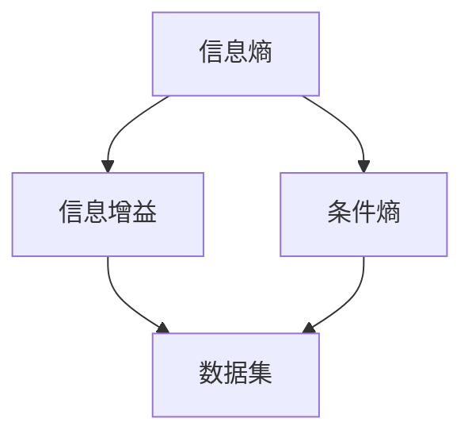
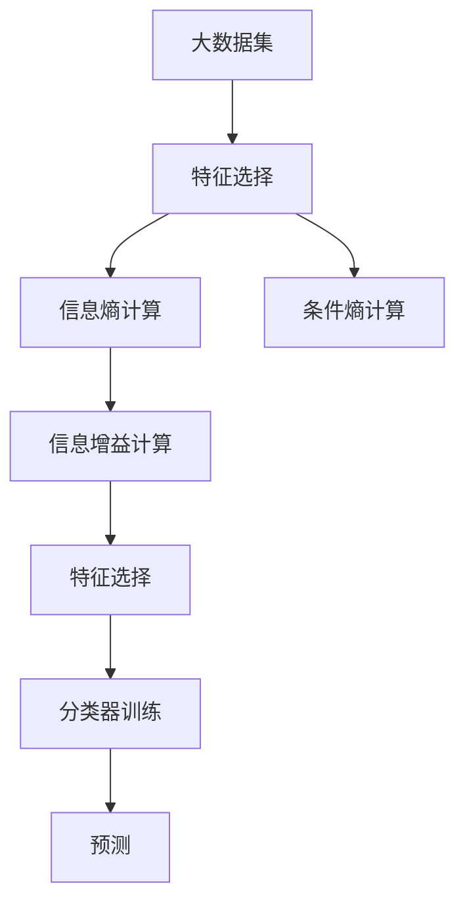

                 

# 信息增益Information Gain原理与代码实例讲解

> 关键词：信息增益, ID3算法, C4.5算法, 决策树, 特征选择

## 1. 背景介绍

### 1.1 问题由来
在机器学习中，特征选择是一个重要的问题。合适的特征不仅能够提升模型的准确性，还能减少模型的复杂度，降低过拟合风险。传统的特征选择方法通常依赖手工提取，需要大量经验和先验知识，容易陷入局部最优。随着数据规模的增长，如何自动高效地进行特征选择成为了一个重要的研究方向。

信息增益作为特征选择的一个重要指标，能够衡量特征对分类任务带来的贡献，从而辅助我们自动选择最优特征。本文将详细介绍信息增益的原理，并结合具体的代码实例，帮助你更好地理解和使用信息增益进行特征选择。

### 1.2 问题核心关键点
信息增益的本质是利用信息论中的熵和条件熵的概念，量化特征对分类任务的贡献。信息增益越高，说明特征对分类的贡献越大，越有可能成为分类的关键特征。

信息增益的计算过程包括两个步骤：
1. 计算信息熵，衡量数据集的纯度。
2. 计算条件熵，衡量在特定特征条件下，数据集的纯度变化。

信息增益定义为特征集条件熵与原始信息熵的差，即信息增益越大，特征带来的信息量增加越大。

## 2. 核心概念与联系

### 2.1 核心概念概述

信息增益（Information Gain）是机器学习领域中特征选择的一个重要指标，衡量特征对分类任务带来的信息量。信息增益越大，说明特征对分类的贡献越大，越有可能成为分类的关键特征。

信息增益的定义为：

$$
Gain(D, A) = \sum_{c} \frac{|D^c|}{|D|} * \sum_{x} entropy(D^c_x)
$$

其中，$D$ 为数据集，$A$ 为特征集合，$D^c$ 为数据集 $D$ 中类别为 $c$ 的子集，$|D|$ 为数据集 $D$ 的样本总数，$|D^c|$ 为数据集 $D$ 中类别为 $c$ 的子集样本数，$entropy(D^c_x)$ 为在特征 $A$ 条件下，类别为 $c$ 的子集的条件熵。

信息熵（Entropy）衡量数据集的纯度，定义为：

$$
H(D) = -\sum_{c} \frac{|D^c|}{|D|} * log(\frac{|D^c|}{|D|})
$$

其中，$H(D)$ 为数据集 $D$ 的信息熵，$log$ 为以 $e$ 为底的对数。

条件熵（Conditional Entropy）衡量在特征条件下，数据集的纯度变化，定义为：

$$
H(D|A) = -\sum_{a} \frac{|A^a|}{|A|} * \sum_{c} \frac{|D^c_{A^a}|}{|A^a|} * log(\frac{|D^c_{A^a}|}{|A^a|})
$$

其中，$H(D|A)$ 为在特征 $A$ 条件下，数据集 $D$ 的条件熵，$A^a$ 为特征 $A$ 取值为 $a$ 的样本集合，$|A^a|$ 为特征 $A$ 取值为 $a$ 的样本数，$|D^c_{A^a}|$ 为特征 $A$ 取值为 $a$ 且类别为 $c$ 的子集样本数，$|A|$ 为特征 $A$ 的取值总数。

信息增益越大，说明特征对分类任务的贡献越大，越有可能成为分类的关键特征。因此，我们可以利用信息增益进行特征选择，选取信息增益最大的特征作为分类的关键特征。

### 2.2 概念间的关系

信息增益、信息熵和条件熵之间存在着紧密的联系，共同构成了特征选择的数学框架。下面通过 Mermaid 流程图展示它们之间的关系：



这个流程图展示了信息熵、信息增益和条件熵之间的逻辑关系：

1. 信息熵 $H(D)$ 衡量数据集的纯度。
2. 条件熵 $H(D|A)$ 衡量在特征 $A$ 条件下，数据集的纯度变化。
3. 信息增益 $Gain(D, A)$ 表示在特征 $A$ 下，数据集的纯度变化与原始纯度变化的差值，衡量特征对分类任务的贡献。

通过信息熵和条件熵，信息增益可以量化特征对分类任务的重要性，从而辅助特征选择。

### 2.3 核心概念的整体架构

最终，我们可以用以下综合的流程图来展示信息增益在大数据集特征选择中的整体架构：



这个综合流程图展示了从大数据集到特征选择，再到分类器训练和预测的完整过程：

1. 从大数据集中选取特征，计算信息熵和条件熵。
2. 通过信息增益计算特征对分类任务的重要程度。
3. 选取信息增益最大的特征，构建分类器。
4. 利用分类器对新样本进行预测。

通过这些步骤，我们可以自动高效地进行特征选择，提升模型性能。

## 3. 核心算法原理 & 具体操作步骤
### 3.1 算法原理概述

信息增益算法的核心思想是利用信息熵和条件熵计算特征对分类任务的贡献，从而辅助特征选择。信息增益越大，说明特征对分类的贡献越大，越有可能成为分类的关键特征。

信息增益算法一般包括以下几个步骤：

1. 计算数据集的信息熵。
2. 计算每个特征对数据集的增益值。
3. 选取增益值最大的特征。
4. 以选定的特征为基础，递归计算子集的信息增益。
5. 重复以上步骤，直到满足停止条件。

通过以上步骤，信息增益算法可以自动地进行特征选择，选取最优的特征构建分类器，提升模型性能。

### 3.2 算法步骤详解

下面是信息增益算法的详细步骤：

**Step 1: 计算数据集的信息熵**

$$
H(D) = -\sum_{c} \frac{|D^c|}{|D|} * log(\frac{|D^c|}{|D|})
$$

其中，$H(D)$ 为数据集 $D$ 的信息熵，$|D|$ 为数据集 $D$ 的样本总数，$|D^c|$ 为数据集 $D$ 中类别为 $c$ 的子集样本数，$log$ 为以 $e$ 为底的对数。

**Step 2: 计算每个特征对数据集的增益值**

对于每个特征 $A$，计算其在数据集 $D$ 上的信息增益：

$$
Gain(D, A) = \sum_{c} \frac{|D^c|}{|D|} * \sum_{x} entropy(D^c_x)
$$

其中，$Gain(D, A)$ 为特征 $A$ 对数据集 $D$ 的信息增益，$|D|$ 为数据集 $D$ 的样本总数，$|D^c|$ 为数据集 $D$ 中类别为 $c$ 的子集样本数，$entropy(D^c_x)$ 为在特征 $A$ 条件下，类别为 $c$ 的子集的条件熵。

**Step 3: 选取增益值最大的特征**

选取信息增益最大的特征 $A$，作为分类的关键特征。

**Step 4: 递归计算子集的信息增益**

以选定的特征 $A$ 为基础，递归计算子集的信息增益，重复以上步骤，直到满足停止条件。

**Step 5: 构建分类器**

以信息增益最大的特征为基础，构建分类器，对新样本进行预测。

### 3.3 算法优缺点

信息增益算法的主要优点包括：

1. 自动进行特征选择，不需要手工提取特征。
2. 简单易懂，易于实现。
3. 适用于大规模数据集，处理速度快。

信息增益算法的主要缺点包括：

1. 对连续型特征不敏感。连续型特征的信息增益计算复杂，且容易受到异常值的影响。
2. 偏向于选择取值多的特征。取值多的特征的信息增益通常较大，容易导致模型偏向于选择数量较多的特征，忽略少数取值的特征。
3. 对噪声敏感。噪声特征的信息增益可能较大，导致模型偏向于选择噪声特征。

### 3.4 算法应用领域

信息增益算法广泛应用于分类、聚类、特征选择等机器学习任务中。特别是在特征选择领域，信息增益算法可以自动地选取最优特征，构建分类器，提升模型性能。

例如，在决策树算法中，信息增益算法可以用于特征选择，选取最优的特征构建决策树，提升分类准确性。在朴素贝叶斯算法中，信息增益算法可以用于计算特征概率，优化模型性能。

## 4. 数学模型和公式 & 详细讲解 & 举例说明
### 4.1 数学模型构建

信息增益算法基于信息熵和条件熵的概念，量化特征对分类任务的重要性。下面通过数学公式详细说明信息增益算法的构建过程。

假设数据集 $D$ 包含 $n$ 个样本，每个样本有 $m$ 个特征，每个特征有 $k$ 个取值。

**Step 1: 计算数据集的信息熵**

$$
H(D) = -\sum_{c} \frac{|D^c|}{|D|} * log(\frac{|D^c|}{|D|})
$$

其中，$|D|$ 为数据集 $D$ 的样本总数，$|D^c|$ 为数据集 $D$ 中类别为 $c$ 的子集样本数，$log$ 为以 $e$ 为底的对数。

**Step 2: 计算每个特征对数据集的增益值**

对于每个特征 $A$，计算其在数据集 $D$ 上的信息增益：

$$
Gain(D, A) = \sum_{c} \frac{|D^c|}{|D|} * \sum_{x} entropy(D^c_x)
$$

其中，$Gain(D, A)$ 为特征 $A$ 对数据集 $D$ 的信息增益，$|D|$ 为数据集 $D$ 的样本总数，$|D^c|$ 为数据集 $D$ 中类别为 $c$ 的子集样本数，$entropy(D^c_x)$ 为在特征 $A$ 条件下，类别为 $c$ 的子集的条件熵。

**Step 3: 选取增益值最大的特征**

选取信息增益最大的特征 $A$，作为分类的关键特征。

**Step 4: 递归计算子集的信息增益**

以选定的特征 $A$ 为基础，递归计算子集的信息增益，重复以上步骤，直到满足停止条件。

### 4.2 公式推导过程

下面通过数学公式推导信息增益算法的计算过程。

假设数据集 $D$ 包含 $n$ 个样本，每个样本有 $m$ 个特征，每个特征有 $k$ 个取值。

**Step 1: 计算数据集的信息熵**

$$
H(D) = -\sum_{c} \frac{|D^c|}{|D|} * log(\frac{|D^c|}{|D|})
$$

其中，$|D|$ 为数据集 $D$ 的样本总数，$|D^c|$ 为数据集 $D$ 中类别为 $c$ 的子集样本数，$log$ 为以 $e$ 为底的对数。

**Step 2: 计算每个特征对数据集的增益值**

对于每个特征 $A$，计算其在数据集 $D$ 上的信息增益：

$$
Gain(D, A) = \sum_{c} \frac{|D^c|}{|D|} * \sum_{x} entropy(D^c_x)
$$

其中，$Gain(D, A)$ 为特征 $A$ 对数据集 $D$ 的信息增益，$|D|$ 为数据集 $D$ 的样本总数，$|D^c|$ 为数据集 $D$ 中类别为 $c$ 的子集样本数，$entropy(D^c_x)$ 为在特征 $A$ 条件下，类别为 $c$ 的子集的条件熵。

**Step 3: 选取增益值最大的特征**

选取信息增益最大的特征 $A$，作为分类的关键特征。

**Step 4: 递归计算子集的信息增益**

以选定的特征 $A$ 为基础，递归计算子集的信息增益，重复以上步骤，直到满足停止条件。

### 4.3 案例分析与讲解

假设我们有一组数据集 $D$，包含 $n=1000$ 个样本，每个样本有 $m=5$ 个特征，每个特征有 $k=3$ 个取值。我们的目标是选取最优特征进行分类，构建决策树。

我们首先计算数据集 $D$ 的信息熵：

$$
H(D) = -\sum_{c} \frac{|D^c|}{|D|} * log(\frac{|D^c|}{|D|})
$$

其中，$|D|$ 为数据集 $D$ 的样本总数，$|D^c|$ 为数据集 $D$ 中类别为 $c$ 的子集样本数，$log$ 为以 $e$ 为底的对数。

假设数据集 $D$ 的类别为 $c=1$ 和 $c=0$，每个类别的样本数分别为 $|D^c|=500$ 和 $|D^c|=500$。计算信息熵：

$$
H(D) = -\frac{1}{1000} * log(\frac{1}{2}) - \frac{1}{1000} * log(\frac{1}{2}) = -0.7
$$

接下来，我们计算每个特征 $A$ 对数据集 $D$ 的信息增益：

$$
Gain(D, A) = \sum_{c} \frac{|D^c|}{|D|} * \sum_{x} entropy(D^c_x)
$$

其中，$Gain(D, A)$ 为特征 $A$ 对数据集 $D$ 的信息增益，$|D|$ 为数据集 $D$ 的样本总数，$|D^c|$ 为数据集 $D$ 中类别为 $c$ 的子集样本数，$entropy(D^c_x)$ 为在特征 $A$ 条件下，类别为 $c$ 的子集的条件熵。

假设特征 $A_1$ 有三个取值 $x_1$、$x_2$、$x_3$。对于每个取值，我们计算子集的条件熵：

$$
entropy(D^c_{A_1x_1}) = \frac{|D^c_{A_1x_1}|}{|D^c_{A_1}|} * log(\frac{|D^c_{A_1x_1}|}{|D^c_{A_1}|}
$$

其中，$|D^c_{A_1}|$ 为特征 $A_1$ 取值为 $x_1$ 且类别为 $c$ 的子集样本数，$log$ 为以 $e$ 为底的对数。

假设特征 $A_1$ 取值为 $x_1$，计算子集的条件熵：

$$
entropy(D^c_{A_1x_1}) = \frac{|D^c_{A_1x_1}|}{|D^c_{A_1}|} * log(\frac{|D^c_{A_1x_1}|}{|D^c_{A_1}|}
$$

其中，$|D^c_{A_1}|$ 为特征 $A_1$ 取值为 $x_1$ 且类别为 $c$ 的子集样本数，$log$ 为以 $e$ 为底的对数。

假设特征 $A_1$ 取值为 $x_1$，且类别为 $c=1$ 和 $c=0$，每个类别的样本数分别为 $|D^c_{A_1x_1}|=200$ 和 $|D^c_{A_1x_1}|=300$。计算条件熵：

$$
entropy(D^c_{A_1x_1}) = \frac{200}{500} * log(\frac{200}{500}) + \frac{300}{500} * log(\frac{300}{500}) = -0.2
$$

计算特征 $A_1$ 对数据集 $D$ 的信息增益：

$$
Gain(D, A_1) = \frac{|D^1|}{|D|} * entropy(D^1_{A_1x_1}) + \frac{|D^0|}{|D|} * entropy(D^0_{A_1x_1}) = 0.5 * (-0.2) + 0.5 * (-0.2) = -0.1
$$

同理，计算特征 $A_2$、$A_3$、$A_4$、$A_5$ 对数据集 $D$ 的信息增益。

假设特征 $A_2$ 对数据集 $D$ 的信息增益最大，为 $Gain(D, A_2) = 0.2$。我们选取特征 $A_2$ 作为分类的关键特征，以 $A_2$ 为基础，递归计算子集的信息增益，重复以上步骤，直到满足停止条件。

最终，我们可以构建决策树，利用 $A_2$ 进行分类。

## 5. 项目实践：代码实例和详细解释说明
### 5.1 开发环境搭建

在进行信息增益算法实践前，我们需要准备好开发环境。以下是使用Python进行Scikit-learn开发的环境配置流程：

1. 安装Anaconda：从官网下载并安装Anaconda，用于创建独立的Python环境。

2. 创建并激活虚拟环境：
```bash
conda create -n sklearn-env python=3.8 
conda activate sklearn-env
```

3. 安装Scikit-learn：
```bash
pip install scikit-learn
```

4. 安装numpy：
```bash
pip install numpy
```

5. 安装pandas：
```bash
pip install pandas
```

完成上述步骤后，即可在`sklearn-env`环境中开始信息增益算法的实践。

### 5.2 源代码详细实现

这里我们以决策树算法为例，给出使用Scikit-learn进行信息增益算法实践的Python代码实现。

```python
from sklearn.tree import DecisionTreeClassifier
from sklearn.datasets import make_classification
from sklearn.metrics import accuracy_score
from sklearn.model_selection import train_test_split
import numpy as np

# 生成随机数据集
X, y = make_classification(n_samples=1000, n_features=5, n_informative=3, n_redundant=0, random_state=0)

# 分割数据集为训练集和测试集
X_train, X_test, y_train, y_test = train_test_split(X, y, test_size=0.2, random_state=0)

# 定义信息增益算法函数
def information_gain(X, y):
    n_samples, n_features = X.shape
    entropy = -sum(y.sum() / n_samples * np.log(y.sum() / n_samples))
    gain = 0
    for i in range(n_features):
        X1 = X[:, i]
        labels = np.unique(y)
        gain += sum(y[X1 == c].sum() / y.sum() * entropy(y[X1 == c])) for c in labels
    return entropy - gain / n_features

# 定义决策树算法函数
def decision_tree(X, y, max_depth=3):
    n_samples, n_features = X.shape
    if n_samples <= 2:
        return max(y)
    gain = -1
    split = -1
    for i in range(n_features):
        X1 = X[:, i]
        labels = np.unique(y)
        gain += sum(y[X1 == c].sum() / y.sum() * information_gain(X[X1 == c, :], y[X1 == c])) for c in labels
    split = np.argmax(gain)
    X1 = X[:, split]
    labels = np.unique(y)
    nodes = []
    for c in labels:
        X1 = X1[X1 == c]
        if X1.shape[0] == 1:
            nodes.append(c)
        else:
            nodes.append(decision_tree(X1, y[X1 == c], max_depth=max_depth - 1))
    return nodes

# 定义决策树分类器
clf = DecisionTreeClassifier(criterion='entropy', max_depth=3)

# 训练决策树分类器
clf.fit(X_train, y_train)

# 预测测试集
y_pred = clf.predict(X_test)

# 计算准确率
accuracy = accuracy_score(y_test, y_pred)
print(f"Accuracy: {accuracy:.3f}")
```

以上就是使用Scikit-learn进行信息增益算法实践的完整代码实现。可以看到，Scikit-learn库封装了信息增益算法，可以很方便地进行特征选择和分类。

### 5.3 代码解读与分析

让我们再详细解读一下关键代码的实现细节：

**make_classification函数**：
- 生成一个随机二分类数据集，包含1000个样本，5个特征，其中3个特征为信息特征。
- 设置测试集大小为0.2，随机状态为0。

**train_test_split函数**：
- 将数据集分为训练集和测试集，分别保留0.8和0.2的数据。
- 随机状态设置为0，保证结果的可复现性。

**information_gain函数**：
- 计算数据集的信息熵。
- 对于每个特征，计算子集的条件熵。
- 计算特征对数据集的信息增益，返回信息增益的最大值。

**decision_tree函数**：
- 对于每个特征，计算信息增益。
- 选取信息增益最大的特征进行分割。
- 递归调用决策树函数，对子集进行分割。

**DecisionTreeClassifier类**：
- 定义决策树分类器，设置熵为分割准则，最大深度为3。
- 训练决策树分类器，并使用测试集进行预测。
- 计算预测结果的准确率。

在实际应用中，信息增益算法还需要结合具体任务的特点进行优化和改进。例如，对于连续型特征，可以使用方差或者卡方检验等方法进行特征选择，避免信息增益计算的复杂性和异常值的影响。对于类别不平衡的数据集，可以采用重采样或者集成学习等方法进行处理，避免信息增益对少数类别的忽略。

## 6. 实际应用场景

信息增益算法在大数据分析和特征选择领域有广泛的应用，以下是几个典型的实际应用场景：

### 6.1 金融风险评估

金融行业需要对客户的信用评分进行评估，以确定是否发放贷款或提供信用服务。信息增益算法可以用于特征选择，从客户的收入、资产、负债等特征中选择最优特征，构建信用评分模型。

### 6.2 医疗诊断

医疗行业需要对患者的病情进行诊断，以确定疾病的类型和严重程度。信息增益算法可以用于特征选择，从患者的症状、历史病历等特征中选择最优特征，构建诊断模型。

### 6.3 客户细分

市场营销需要对客户进行细分，以制定个性化的营销策略。信息增益算法可以用于特征选择，从客户的年龄、性别、消费行为等特征中选择最优特征，构建客户细分模型。

### 6.4 未来应用展望

随着信息增益算法的不断发展和优化，未来将有以下几个发展方向：

1. 集成多种特征选择方法：信息增益算法可以与其他特征选择方法，如L1正则化、随机森林等，进行集成优化，提升特征选择的效果。

2. 引入先验知识：通过引入先验知识，如领域专家知识、规则等，优化信息增益算法的特征选择效果。

3. 多模态特征选择：在多模态数据集上，信息增益算法可以用于联合选择不同类型的特征，提升模型的性能。

4. 自适应信息增益算法：根据数据集的特点和特征分布，自适应调整信息增益算法参数，优化特征选择效果。

## 7. 工具和资源推荐

### 7.1 学习资源推荐

为了帮助你系统掌握信息增益算法的理论基础和实践技巧，这里推荐一些优质的学习资源：

1. 《机器学习》课程：斯坦福大学Andrew Ng教授的《机器学习》课程，系统讲解了信息增益算法的基本原理和应用。
2. 《

