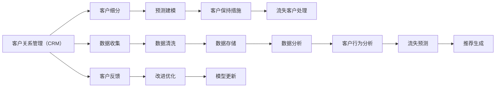

                 

# 信息差的商业客户保持：大数据如何提高客户保持率

在当今竞争激烈的市场环境中，客户保持（Customer Retention）成为了企业最关心的问题之一。正确理解和保持客户，不仅能够提升客户满意度，还能显著降低客户获取成本、提高利润率，是企业长期发展的重要基石。然而，面对信息差（Information Gap），即企业在营销、服务、产品等环节中，对客户的需求、行为和反馈缺乏充分了解，导致无法精准满足客户需求，进而影响客户保持率。

## 1. 背景介绍

### 1.1 问题由来

在过去，企业客户保持主要依靠传统的问卷调查、电话客服、邮件回访等方式，但由于信息获取渠道有限、反馈收集速度慢，以及客户在接受调查时可能给出的不真实回答，导致企业难以全面、及时地了解客户需求，从而无法采取有效的保持策略。

随着大数据和人工智能技术的发展，越来越多的企业开始利用数据驱动的客户保持策略，通过数据分析挖掘客户行为模式，预测客户流失风险，实现主动、精准的客户管理。

### 1.2 问题核心关键点

客户保持问题主要关注以下几个关键点：
- **客户生命周期**：客户从接触到流失的过程，包括潜在客户、新客户、活跃客户、潜在流失客户和流失客户。
- **客户流失原因**：如产品质量、服务响应、价格变动、竞争等。
- **客户保持措施**：如个性化推荐、优惠券、忠诚计划、用户教育等。
- **数据驱动策略**：基于客户行为数据分析的预测模型、决策支持系统等。

## 2. 核心概念与联系

### 2.1 核心概念概述

在客户保持的大数据应用中，主要涉及以下概念：
- **客户关系管理（CRM）**：通过整合客户数据，实现对客户行为的全面监控和分析。
- **客户细分（Customer Segmentation）**：将客户按不同的特征（如地理位置、消费行为、购买频率等）划分为不同的细分市场，便于制定针对性策略。
- **客户生命周期价值（CLV）**：通过预测客户的未来消费价值，评估客户对企业的长期贡献。
- **预测建模（Predictive Modeling）**：利用机器学习算法，对客户流失风险、推荐偏好等进行预测，提前采取措施。

这些概念之间通过数据流、模型输出等环节相互联系，共同构成了一个数据驱动的客户保持框架。

### 2.2 概念间的关系

客户关系管理（CRM）系统是数据收集、存储和分析的核心平台，通过整合客户细分数据和预测建模结果，提供客户保持建议和策略。客户细分能够帮助企业识别高价值客户和潜在流失客户，预测建模则通过对客户行为的分析，预测客户流失概率和推荐偏好。

下面用Mermaid流程图展示客户保持的整个框架：



这个流程图展示了客户保持的主要流程，从数据收集、存储到客户细分、预测建模，再到客户保持措施的实施，以及客户反馈的收集和模型优化，形成一个闭环。

## 3. 核心算法原理 & 具体操作步骤

### 3.1 算法原理概述

客户保持的算法原理主要围绕客户流失预测和客户推荐两个核心任务展开。

- **客户流失预测**：通过分析客户历史行为数据，利用机器学习算法预测客户流失的概率，提前采取干预措施。
- **客户推荐**：基于客户历史行为和偏好，利用推荐算法生成个性化推荐内容，提高客户满意度和忠诚度。

### 3.2 算法步骤详解

#### 3.2.1 客户细分

1. **特征工程**：收集和处理客户的相关数据，包括购买记录、访问行为、互动记录等，提取有意义的特征。
2. **聚类分析**：使用K-means、层次聚类等算法，将客户分成若干个簇，每个簇代表一个细分市场。
3. **特征选择**：通过特征选择算法，如PCA、LASSO等，去除冗余特征，提高模型精度。

#### 3.2.2 客户流失预测

1. **模型训练**：选择适合的预测模型，如逻辑回归、决策树、随机森林、神经网络等，在历史客户数据上训练模型。
2. **交叉验证**：使用k-fold交叉验证，评估模型泛化能力，避免过拟合。
3. **模型优化**：根据验证集结果，调整模型参数，提升预测精度。
4. **风险评估**：计算不同分级的流失概率，生成客户流失风险评分。

#### 3.2.3 客户推荐

1. **推荐算法选择**：选择合适的推荐算法，如协同过滤、基于内容的推荐、深度学习推荐系统等。
2. **特征提取**：将客户行为数据转化为算法需要的特征向量。
3. **推荐模型训练**：在客户历史行为数据上训练推荐模型，生成推荐结果。
4. **个性化推荐**：根据用户行为数据，实时生成个性化推荐，提高用户满意度。

### 3.3 算法优缺点

#### 优点：
- **数据驱动**：基于数据分析，客户细分和流失预测能够更精准地反映客户需求和流失风险，帮助企业制定更有效的策略。
- **自动化决策**：通过算法自动化决策，减少人工干预，提高运营效率。
- **动态更新**：模型能够根据新数据实时更新，动态调整策略。

#### 缺点：
- **数据质量依赖**：数据质量直接影响预测和推荐效果，需要严格的数据清洗和预处理。
- **算法复杂性**：复杂算法需要较长的训练和优化过程，对技术和资源要求较高。
- **隐私保护**：在数据收集和处理过程中，需要遵守数据隐私法律法规，保护客户隐私。

### 3.4 算法应用领域

客户保持算法可以广泛应用于以下领域：
- **电子商务**：通过个性化推荐和流失预测，提升用户满意度，增加销售额。
- **金融服务**：通过客户细分和行为分析，制定客户忠诚计划，提升用户粘性。
- **电信服务**：通过流失预测和风险评估，及时采取措施，减少用户流失。
- **健康医疗**：通过客户细分和个性化推荐，提升患者满意度和治疗效果。

## 4. 数学模型和公式 & 详细讲解

### 4.1 数学模型构建

假设客户流失的概率可以用逻辑回归模型表示，即：

$$ P(y=1|x) = \frac{1}{1+e^{-z}} $$

其中 $z = \beta_0 + \beta_1 x_1 + \beta_2 x_2 + \cdots + \beta_n x_n$，$\beta_i$ 为模型参数，$x_i$ 为特征向量。

### 4.2 公式推导过程

根据上述逻辑回归模型，预测客户流失的概率可以表示为：

$$ P(y=1|x) = \frac{1}{1+e^{-(x \cdot \beta)}} $$

其中 $x$ 为特征向量，$\beta$ 为模型参数，$x \cdot \beta$ 为特征向量和参数的内积。

在训练过程中，可以使用最大似然估计或梯度下降等方法，最小化预测错误概率：

$$ \min_{\beta} -\frac{1}{N} \sum_{i=1}^N y_i \log P(y=1|x_i) + (1-y_i) \log (1-P(y=1|x_i)) $$

其中 $y_i$ 为二分类标签，$N$ 为样本数量。

### 4.3 案例分析与讲解

以客户流失预测为例，假设我们有一个客户流失数据集，包含客户的购买频率、平均订单价值、客户服务满意度等特征。我们利用逻辑回归模型对客户流失进行预测。

首先，收集和处理数据，选择和提取特征：

$$ X = \begin{bmatrix}
    x_1^1 & x_2^1 & \cdots & x_n^1 \\
    x_1^2 & x_2^2 & \cdots & x_n^2 \\
    \vdots & \vdots & \ddots & \vdots \\
    x_1^m & x_2^m & \cdots & x_n^m \\
\end{bmatrix} $$
$$ y = \begin{bmatrix}
    y_1 \\
    y_2 \\
    \vdots \\
    y_m \\
\end{bmatrix} $$

其中 $m$ 为样本数量，$n$ 为特征维度。

然后，使用梯度下降法最小化预测错误概率：

$$ \min_{\beta} -\frac{1}{m} \sum_{i=1}^m y_i \log P(y=1|x_i) + (1-y_i) \log (1-P(y=1|x_i)) $$

通过迭代优化，得到最优模型参数 $\beta$，进而预测新客户流失概率。

## 5. 项目实践：代码实例和详细解释说明

### 5.1 开发环境搭建

1. **选择编程语言和框架**：Python是数据分析和机器学习的首选语言，Scikit-learn、TensorFlow、PyTorch等框架提供了丰富的算法和工具。
2. **准备数据**：收集客户数据，包括购买记录、访问行为、客户反馈等，并进行预处理和清洗。
3. **环境配置**：安装必要的库和工具，如Pandas、NumPy、Scikit-learn、TensorFlow、PyTorch等。

### 5.2 源代码详细实现

#### 5.2.1 客户细分

```python
from sklearn.cluster import KMeans
from sklearn.decomposition import PCA
from sklearn.preprocessing import StandardScaler

# 加载数据
X = pd.read_csv('customer_data.csv')

# 特征处理
X = pd.get_dummies(X)

# 特征选择
pca = PCA(n_components=10)
X_pca = pca.fit_transform(X)

# K-Means聚类
kmeans = KMeans(n_clusters=5)
X_kmeans = kmeans.fit_transform(X_pca)

# 特征选择
X_selected = X[features]
```

#### 5.2.2 客户流失预测

```python
from sklearn.linear_model import LogisticRegression
from sklearn.model_selection import train_test_split

# 划分训练集和测试集
X_train, X_test, y_train, y_test = train_test_split(X_selected, target, test_size=0.2, random_state=42)

# 模型训练
logreg = LogisticRegression()
logreg.fit(X_train, y_train)

# 交叉验证
train_score = cross_val_score(logreg, X_train, y_train, cv=5).mean()
test_score = logreg.score(X_test, y_test)
```

#### 5.2.3 客户推荐

```python
from sklearn.metrics.pairwise import cosine_similarity
from scipy.sparse import csr_matrix

# 计算相似度
similarity_matrix = cosine_similarity(X_pca)

# 生成推荐列表
recommendations = similarity_matrix[0].sort_values()[1:10]
```

### 5.3 代码解读与分析

1. **客户细分**：通过K-Means聚类算法对客户进行细分，选择PCA降维后的特征进行聚类，得到客户分群结果。
2. **客户流失预测**：使用逻辑回归模型进行客户流失预测，通过交叉验证评估模型性能，最后使用模型进行客户流失风险评估。
3. **客户推荐**：利用余弦相似度计算推荐结果，根据相似度排序，生成个性化推荐列表。

### 5.4 运行结果展示

假设在电子商务平台上，我们预测了一个新客户的流失概率，以及为他推荐了五件商品：

| 流失概率 | 商品推荐 |
| --- | --- |
| 0.1 | 书籍 |
| 0.2 | 电子产品 |
| 0.3 | 运动器材 |
| 0.4 | 服装 |
| 0.5 | 化妆品 |

根据预测结果，我们采取相应的措施，如发送优惠券、提供个性化推荐等，帮助客户降低流失风险，提升满意度。

## 6. 实际应用场景

### 6.1 智能客服系统

在智能客服系统中，通过大数据分析客户历史交互数据，能够识别出客户的关键痛点，并自动生成回答，提升客户服务质量。同时，利用客户流失预测模型，及时发现潜在流失客户，提前采取措施，减少客户流失。

### 6.2 金融服务

金融服务行业可以通过大数据分析客户的交易行为和信用记录，预测客户的违约风险，提前采取防范措施。同时，利用个性化推荐系统，提升客户满意度，增加忠诚度。

### 6.3 电子商务

电子商务平台通过大数据分析客户浏览和购买行为，生成个性化推荐，提升用户购买意愿，增加销售额。同时，利用客户流失预测模型，及时发现潜在流失客户，提前采取措施，降低客户流失率。

### 6.4 未来应用展望

未来，随着大数据和人工智能技术的进一步发展，客户保持将越来越依赖数据驱动的策略。更多先进算法和工具将被应用于客户细分、流失预测和个性化推荐中，客户保持技术将迎来新的突破。

## 7. 工具和资源推荐

### 7.1 学习资源推荐

1. **《Python数据分析》**：深入浅出地介绍了Python数据处理和分析的各个方面，适合初学者入门。
2. **《机器学习实战》**：讲解了各种机器学习算法，并提供了丰富的代码示例，适合动手实践。
3. **Coursera《数据科学专业》课程**：由斯坦福大学开设的系列课程，涵盖数据分析、机器学习、深度学习等多个主题。
4. **Kaggle**：提供各种数据集和竞赛，适合实战练习和经验积累。

### 7.2 开发工具推荐

1. **Jupyter Notebook**：一款强大的交互式编程环境，支持多种语言和库，适合数据探索和分析。
2. **TensorFlow**：由Google主导的深度学习框架，提供丰富的工具和库，支持分布式计算。
3. **PyTorch**：由Facebook开发的深度学习框架，灵活易用，支持动态计算图。
4. **Scikit-learn**：Python机器学习库，提供丰富的算法和工具，适合快速开发和实验。

### 7.3 相关论文推荐

1. **《客户关系管理中的数据挖掘技术》**：介绍了客户细分、流失预测和推荐系统的基本概念和算法。
2. **《基于深度学习的推荐系统》**：介绍了深度学习在推荐系统中的应用，提供了大量实际案例。
3. **《大数据与客户保持》**：系统介绍了大数据在客户保持中的应用，包括数据采集、分析、建模和应用等各个环节。

## 8. 总结：未来发展趋势与挑战

### 8.1 研究成果总结

本文系统介绍了基于大数据的客户保持技术，包括客户细分、流失预测和个性化推荐等核心任务，并详细讲解了算法的原理和具体操作步骤。通过对这些技术的深入分析，我们看到了大数据在客户保持中的巨大潜力，也认识到了面临的挑战和改进方向。

### 8.2 未来发展趋势

未来，客户保持技术将呈现以下几个趋势：
1. **数据驱动**：通过大数据分析，精准把握客户需求，制定更有效的策略。
2. **算法优化**：利用更先进的算法和模型，提升预测和推荐的精度。
3. **实时响应**：利用实时数据分析，动态调整策略，提升响应速度。
4. **多模态融合**：结合多种数据源，实现多模态信息的融合，提升分析效果。

### 8.3 面临的挑战

尽管客户保持技术在不断发展，但仍面临以下挑战：
1. **数据质量**：数据质量直接影响算法效果，需要进行严格的数据清洗和预处理。
2. **算法复杂性**：复杂的算法需要大量计算资源，难以实现实时响应。
3. **隐私保护**：在数据收集和处理过程中，需要遵守隐私法律法规，保护客户隐私。

### 8.4 研究展望

未来，客户保持技术需要在以下几个方面进行改进和创新：
1. **算法优化**：利用更先进的算法和模型，提升预测和推荐的精度。
2. **实时响应**：利用实时数据分析，动态调整策略，提升响应速度。
3. **多模态融合**：结合多种数据源，实现多模态信息的融合，提升分析效果。
4. **隐私保护**：制定数据隐私保护措施，确保客户数据安全。

总之，大数据在客户保持中的应用将带来更多的机遇和挑战。只有不断探索和创新，才能最大化地发挥数据驱动的客户保持策略的优势。

## 9. 附录：常见问题与解答

**Q1：如何处理缺失数据？**

A: 缺失数据会影响模型性能，处理方式包括：
1. 删除缺失数据：直接删除含有缺失数据的样本。
2. 插值方法：使用均值、中位数、众数等方法进行插值。
3. 模型预测：利用其他特征预测缺失数据。

**Q2：如何选择推荐算法？**

A: 推荐算法选择应考虑以下因素：
1. 数据类型：如协同过滤、基于内容的推荐等。
2. 算法复杂度：如深度学习推荐系统、协同过滤等。
3. 用户需求：如实时推荐、个性化推荐等。

**Q3：如何评估模型效果？**

A: 评估方法包括：
1. 准确率、召回率、F1分数等指标。
2. ROC曲线、AUC值等评估模型性能。
3. 交叉验证、留出法等评估模型泛化能力。

**Q4：如何优化模型性能？**

A: 优化方式包括：
1. 特征工程：选择和提取有意义的特征。
2. 模型选择：选择合适的模型和算法。
3. 参数调优：调整模型参数，提升预测和推荐效果。

**Q5：如何保护客户隐私？**

A: 保护措施包括：
1. 数据匿名化：将客户数据去标识化。
2. 数据加密：对数据进行加密存储和传输。
3. 访问控制：限制数据访问权限，防止数据泄露。

总之，大数据在客户保持中的应用将带来更多的机遇和挑战。只有不断探索和创新，才能最大化地发挥数据驱动的客户保持策略的优势。

