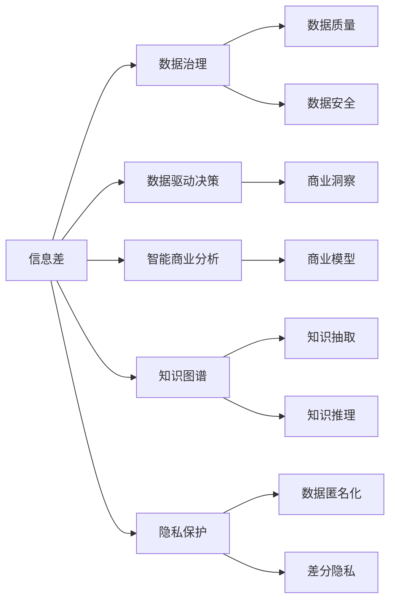
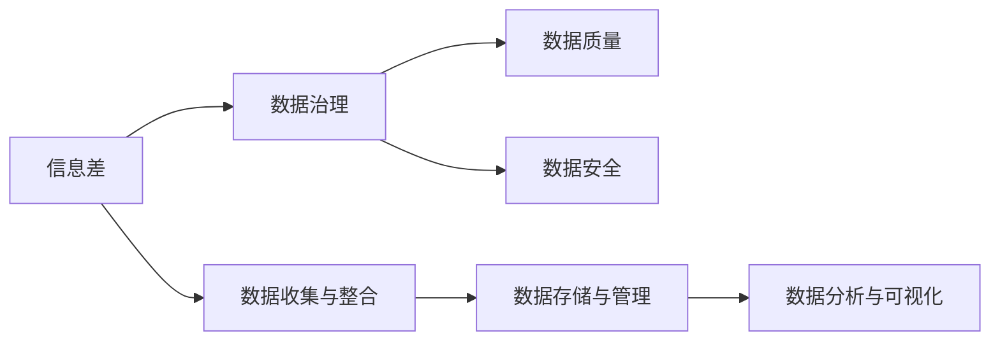
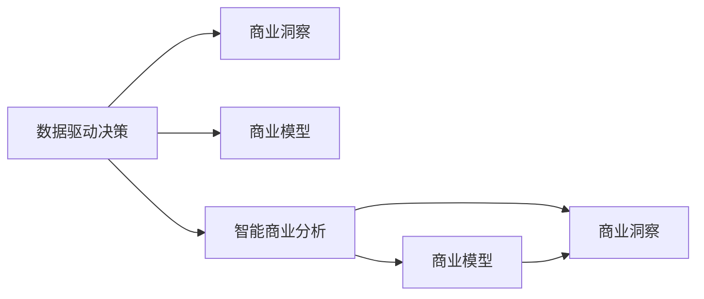
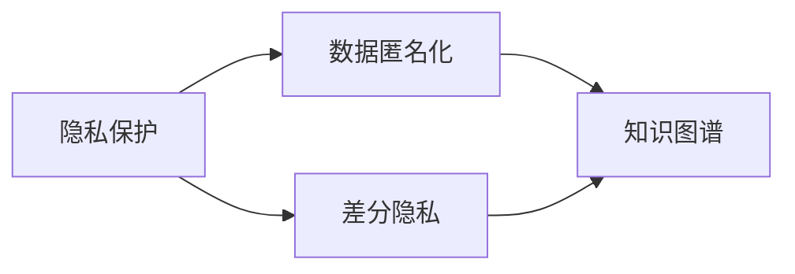
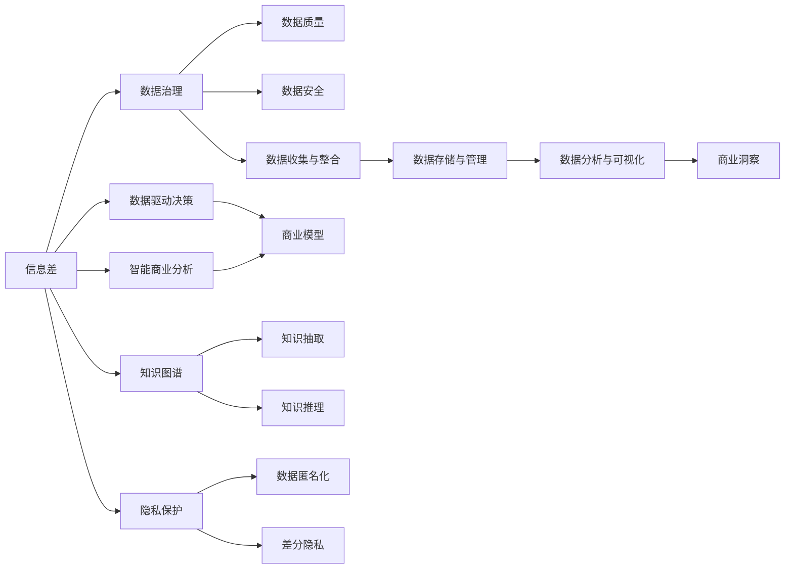

                 

# 信息差的商业挑战应对：大数据时代的挑战与对策

## 1. 背景介绍

### 1.1 问题由来
在当今大数据时代，信息差（Information Gap）已成为企业发展的重要瓶颈。信息差指的是企业内部的决策者和执行者之间，以及企业与外部市场环境之间，存在的知识、信息获取和使用上的不对称。这种不对称会导致信息不对称、决策错误、执行偏差，最终影响企业竞争力和市场表现。信息差问题尤其突出在以下几个方面：

1. **市场洞察力不足**：企业在快速变化的市场环境中，很难实时获取准确的消费者需求、竞争态势、政策法规等重要信息，从而无法制定科学合理的市场策略。
2. **执行决策偏差**：由于信息不完整、不准确，导致部门间协调不畅、执行决策偏离预期目标，造成资源浪费和效率低下。
3. **数据孤岛问题**：各部门数据分散存储，缺乏有效的数据整合和共享机制，使得企业整体数据资源无法发挥其最大价值。
4. **数据隐私和安全风险**：在数据收集和处理过程中，如何平衡数据利用和隐私保护，保护客户数据安全，是企业面临的又一重大挑战。

这些问题不仅影响了企业的运营效率和市场竞争力，还对企业长期发展构成威胁。因此，应对信息差挑战，成为当前企业智能化转型的关键任务。

### 1.2 问题核心关键点
为了有效应对信息差挑战，企业需要构建一套覆盖从数据收集、整合、分析到应用的全流程信息管理解决方案。核心关键点包括：

1. **数据收集与整合**：建立统一的、多源数据采集和整合平台，确保数据来源的多样性和完整性。
2. **数据存储与管理**：使用高效的数据存储技术，如分布式数据库、云存储等，保障数据的安全性和可访问性。
3. **数据分析与可视化**：利用先进的分析算法和可视化工具，从海量数据中提取有价值的信息和洞察。
4. **知识与决策支持**：构建基于知识图谱和决策支持系统（DSS）的企业智能平台，辅助决策者进行科学的商业决策。
5. **数据隐私与安全**：采用隐私保护技术，如差分隐私、联邦学习等，确保数据使用过程中的隐私安全。

### 1.3 问题研究意义
应对信息差挑战，不仅有助于提升企业的运营效率和市场竞争力，还能增强企业的决策科学性和风险管理能力，是企业智能化转型的重要方向。具体意义如下：

1. **提升市场响应速度**：通过高效的数据收集和分析，企业能够快速捕捉市场变化，及时调整市场策略，提升响应速度。
2. **优化资源配置**：借助数据驱动的决策支持，企业能够更科学地分配资源，避免资源浪费，提高资源利用效率。
3. **降低决策风险**：通过数据和知识支撑的决策过程，企业能够降低决策失误的风险，提高决策的准确性和可靠性。
4. **增强企业创新能力**：丰富的数据和知识积累，可以激发新的商业创意和创新路径，增强企业的竞争优势。
5. **提升客户满意度**：基于数据洞察的个性化服务和推荐，能够提升客户体验，增强客户粘性和满意度。

## 2. 核心概念与联系

### 2.1 核心概念概述

为更好地理解信息差应对方法，本节将介绍几个密切相关的核心概念：

- **信息差（Information Gap）**：指企业内部和外部信息获取与利用的不对称，导致信息不对称、决策错误、执行偏差等问题。
- **数据治理（Data Governance）**：通过制度和技术手段，确保数据质量和数据使用的合规性、安全性。
- **数据驱动决策（Data-Driven Decision Making）**：利用数据分析和模型预测，支持科学合理的商业决策。
- **智能商业分析（Smart Business Analytics）**：结合先进的数据分析和可视化技术，从数据中提取商业洞察。
- **知识图谱（Knowledge Graph）**：以图形化方式组织和关联知识，支持智能搜索和推理。
- **隐私保护（Privacy Protection）**：通过技术手段保障用户数据隐私，防止数据滥用和泄露。

这些核心概念之间的逻辑关系可以通过以下Mermaid流程图来展示：



这个流程图展示了信息差应对过程中各概念之间的联系：

1. 数据治理是基础，确保数据质量和数据使用的合规性和安全性。
2. 数据驱动决策通过分析数据，生成商业洞察和模型预测，支持决策。
3. 智能商业分析结合先进的数据分析技术和可视化工具，提取商业洞察。
4. 知识图谱以图形化方式组织和关联知识，支持智能搜索和推理。
5. 隐私保护通过技术手段保障用户数据隐私，防止数据滥用和泄露。

### 2.2 概念间的关系

这些核心概念之间存在着紧密的联系，形成了信息差应对的完整生态系统。下面我通过几个Mermaid流程图来展示这些概念之间的关系。

#### 2.2.1 数据治理与信息差的关系



这个流程图展示了数据治理在信息差应对中的作用。数据治理通过确保数据质量和数据使用的合规性、安全性，为信息差的应对提供了基础保障。

#### 2.2.2 数据驱动决策与智能商业分析的关系



这个流程图展示了数据驱动决策和智能商业分析的相互作用。数据驱动决策通过分析数据，生成商业洞察和模型预测，支持决策。智能商业分析则结合先进的数据分析技术和可视化工具，提取商业洞察。

#### 2.2.3 隐私保护与知识图谱的关系



这个流程图展示了隐私保护和知识图谱的联系。隐私保护通过技术手段保障用户数据隐私，防止数据滥用和泄露。知识图谱则以图形化方式组织和关联知识，支持智能搜索和推理。

### 2.3 核心概念的整体架构

最后，我们用一个综合的流程图来展示这些核心概念在信息差应对过程中的整体架构：



这个综合流程图展示了从信息差应对到知识驱动决策的完整过程。数据治理作为基础，确保数据质量和数据使用的合规性和安全性。数据驱动决策通过分析数据，生成商业洞察和模型预测，支持决策。智能商业分析结合先进的数据分析技术和可视化工具，提取商业洞察。知识图谱以图形化方式组织和关联知识，支持智能搜索和推理。隐私保护通过技术手段保障用户数据隐私，防止数据滥用和泄露。

## 3. 核心算法原理 & 具体操作步骤
### 3.1 算法原理概述

信息差应对的算法原理主要包括数据治理、数据驱动决策、智能商业分析和隐私保护等核心步骤。其核心思想是：

1. **数据治理**：构建数据治理体系，确保数据质量和数据使用的合规性、安全性。
2. **数据驱动决策**：利用数据分析和模型预测，支持科学合理的商业决策。
3. **智能商业分析**：结合先进的数据分析和可视化技术，从数据中提取商业洞察。
4. **隐私保护**：采用隐私保护技术，保障用户数据隐私，防止数据滥用和泄露。

形式化地，假设企业内部存在信息差，数据治理的目标是：

$$
\mathop{\min}_{g} \text{Loss}(g) = \sum_{i=1}^{N} (||g(x_i) - y_i||^2)
$$

其中 $g$ 为数据治理模型，$x_i$ 为原始数据，$y_i$ 为治理后的数据，$N$ 为数据集大小。

通过最小化损失函数，数据治理模型能够最大化数据治理效果。

### 3.2 算法步骤详解

信息差应对的算法步骤如下：

**Step 1: 数据收集与整合**

- 收集来自不同渠道和部门的数据，包括销售、客户、供应链等。
- 使用ETL（Extract, Transform, Load）工具进行数据清洗和整合，确保数据一致性和完整性。

**Step 2: 数据存储与管理**

- 使用分布式数据库或云存储技术，确保数据的安全性和可访问性。
- 采用数据分区、索引等技术，提升数据查询和分析的效率。

**Step 3: 数据分析与可视化**

- 使用高级数据分析技术，如机器学习、深度学习等，从数据中提取有价值的信息和洞察。
- 使用数据可视化工具，如Tableau、PowerBI等，将分析结果以图表形式展示，便于决策者理解和使用。

**Step 4: 数据驱动决策**

- 结合数据分析结果，构建决策支持模型，辅助决策者进行商业决策。
- 使用预测模型和优化算法，评估不同决策方案的潜在效果和风险。

**Step 5: 隐私保护**

- 采用差分隐私、联邦学习等技术，保障用户数据隐私，防止数据滥用和泄露。
- 通过数据匿名化等手段，保护企业数据安全，防止数据被恶意攻击。

通过上述步骤，企业能够从数据收集、整合、存储、分析到应用的全流程中，有效应对信息差挑战，提升决策科学性和执行效率。

### 3.3 算法优缺点

信息差应对的算法具有以下优点：

1. **提升决策科学性**：利用数据驱动的决策支持，减少决策失误，提高决策的准确性和可靠性。
2. **优化资源配置**：通过数据分析，优化资源分配，提高资源利用效率。
3. **增强市场响应速度**：通过实时数据分析，快速捕捉市场变化，及时调整市场策略。

同时，该算法也存在一些缺点：

1. **数据治理复杂度高**：数据治理需要构建完整的体系和流程，涉及数据清洗、整合、标准化等复杂环节。
2. **数据隐私和安全风险**：隐私保护和数据安全是信息差应对的关键，但技术实现和监管难度较大。
3. **技术成本高**：高级数据分析和隐私保护技术需要高成本的软硬件资源，对企业技术能力要求较高。

尽管存在这些局限性，但就目前而言，数据驱动的决策支持和智能商业分析是信息差应对的最主流方法，能够显著提升企业的运营效率和市场竞争力。未来相关研究的重点在于如何进一步降低数据治理成本，提高隐私保护技术的可操作性和数据使用的安全性。

### 3.4 算法应用领域

信息差应对的算法已经在多个行业领域得到广泛应用，例如：

- **零售业**：通过分析消费者行为数据，优化商品推荐和库存管理，提升客户满意度和销售额。
- **金融业**：利用交易数据和市场情报，预测市场波动，制定风险控制策略，保护客户资产安全。
- **制造业**：通过供应链数据分析，优化生产计划和物流调度，降低成本，提高生产效率。
- **医疗健康**：结合患者数据和医疗记录，预测疾病风险，制定个性化治疗方案，提升诊疗效果。
- **政府公共服务**：分析社会经济数据，制定公共政策，优化资源配置，提升公共服务质量。

这些应用场景展示了信息差应对方法在各个行业领域的强大潜力，为企业智能化转型提供了有力支持。

## 4. 数学模型和公式 & 详细讲解 & 举例说明

### 4.1 数学模型构建

在信息差应对中，我们通常使用以下数学模型来描述问题：

- **数据治理模型**：
  $$
  \mathop{\min}_{g} \text{Loss}(g) = \sum_{i=1}^{N} (||g(x_i) - y_i||^2)
  $$
  其中 $g$ 为数据治理模型，$x_i$ 为原始数据，$y_i$ 为治理后的数据，$N$ 为数据集大小。

- **数据分析与可视化模型**：
  $$
  \mathop{\min}_{a} \text{Loss}(a) = \sum_{i=1}^{M} (||a(x_i) - y_i||^2)
  $$
  其中 $a$ 为分析模型，$x_i$ 为原始数据，$y_i$ 为分析结果，$M$ 为分析样本大小。

- **数据驱动决策模型**：
  $$
  \mathop{\min}_{d} \text{Loss}(d) = \sum_{i=1}^{N} ||d(x_i) - y_i||^2
  $$
  其中 $d$ 为决策模型，$x_i$ 为输入数据，$y_i$ 为决策结果，$N$ 为决策样本大小。

### 4.2 公式推导过程

以下我们以零售业为例，推导数据驱动决策模型的公式：

假设零售企业每天收集销售数据 $x_i$，包括商品ID、销售量、时间戳等。目标是根据历史销售数据，预测未来销售趋势，制定合理的库存管理策略。

设预测模型为 $d(x_i)$，真实销售量为 $y_i$，则数据驱动决策模型的目标函数为：
$$
\mathop{\min}_{d} \text{Loss}(d) = \sum_{i=1}^{N} ||d(x_i) - y_i||^2
$$

其中 $N$ 为预测样本数量。

在预测模型中，通常使用回归模型，如线性回归、随机森林等，来拟合历史数据。回归模型的预测结果为 $d(x_i)$，即模型对输入数据 $x_i$ 的预测值。

通过最小化损失函数，数据驱动决策模型能够最大化预测准确性，从而支持科学合理的库存管理。

### 4.3 案例分析与讲解

假设某零售企业每天收集100个商品的销售数据，数据集大小为 $N=100$。我们利用线性回归模型进行预测，最小化均方误差（MSE）损失函数。

首先，构建训练集和测试集：
- 训练集：前80个样本
- 测试集：后20个样本

使用Python和Scikit-Learn库，进行回归模型训练和预测：

```python
from sklearn.linear_model import LinearRegression
from sklearn.metrics import mean_squared_error

# 构建训练集和测试集
train_data = X_train
test_data = X_test
train_labels = y_train
test_labels = y_test

# 构建线性回归模型
model = LinearRegression()

# 训练模型
model.fit(train_data, train_labels)

# 预测测试集
y_pred = model.predict(test_data)

# 计算MSE损失
mse_loss = mean_squared_error(test_labels, y_pred)

print("MSE Loss:", mse_loss)
```

通过上述代码，我们可以训练线性回归模型，并计算其对测试集的预测误差（MSE Loss）。最小化MSE损失函数，可以提升预测模型的准确性，从而支持科学的库存管理决策。

## 5. 项目实践：代码实例和详细解释说明
### 5.1 开发环境搭建

在进行信息差应对实践前，我们需要准备好开发环境。以下是使用Python进行Pandas、NumPy、Matplotlib、Scikit-Learn等库的开发环境配置流程：

1. 安装Anaconda：从官网下载并安装Anaconda，用于创建独立的Python环境。

2. 创建并激活虚拟环境：
```bash
conda create -n info_gap_env python=3.8 
conda activate info_gap_env
```

3. 安装Pandas、NumPy、Matplotlib、Scikit-Learn：
```bash
conda install pandas numpy matplotlib scikit-learn -c anaconda
```

4. 安装机器学习和深度学习框架：
```bash
conda install tensorflow pytorch scikit-learn torchvision torchaudio -c pytorch -c conda-forge
```

5. 安装数据可视化工具：
```bash
pip install seaborn plotly
```

完成上述步骤后，即可在`info_gap_env`环境中开始信息差应对实践。

### 5.2 源代码详细实现

这里我们以零售业为例，展示如何使用Pandas、NumPy和Scikit-Learn库进行数据分析和预测：

```python
import pandas as pd
import numpy as np
from sklearn.linear_model import LinearRegression
from sklearn.metrics import mean_squared_error
import matplotlib.pyplot as plt

# 读取销售数据
data = pd.read_csv('sales_data.csv')

# 数据预处理
X = data[['item_id', 'date']].values
y = data['sales_volume'].values

# 构建训练集和测试集
train_ratio = 0.8
train_size = int(train_ratio * len(X))
train_data = X[:train_size]
train_labels = y[:train_size]
test_data = X[train_size:]
test_labels = y[train_size:]

# 构建线性回归模型
model = LinearRegression()

# 训练模型
model.fit(train_data, train_labels)

# 预测测试集
y_pred = model.predict(test_data)

# 计算MSE损失
mse_loss = mean_squared_error(test_labels, y_pred)

# 输出MSE损失
print("MSE Loss:", mse_loss)

# 绘制预测结果
plt.scatter(test_labels, y_pred)
plt.xlabel('True Sales Volume')
plt.ylabel('Predicted Sales Volume')
plt.title('Sales Volume Prediction')
plt.show()
```

### 5.3 代码解读与分析

让我们再详细解读一下关键代码的实现细节：

**数据预处理**：
- 使用Pandas库读取销售数据，并进行数据清洗和预处理，提取商品ID、日期、销售量等关键特征。
- 使用NumPy库将数据转换为数组形式，便于模型训练和预测。

**模型训练**：
- 使用Scikit-Learn库中的LinearRegression模型进行回归预测。
- 通过设置训练集大小和测试集大小，将数据集划分为训练集和测试集。
- 使用模型训练数据进行模型拟合，得到线性回归模型。

**模型评估**：
- 使用均方误差（MSE）计算模型对测试集的预测误差，评估模型性能。
- 绘制预测结果的散点图，直观展示预测效果。

**代码运行结果**：
- 输出MSE损失值，反映模型预测的准确性。
- 显示散点图，直观展示预测结果和真实值之间的差异。

可以看到，通过上述代码，我们能够构建一个简单的线性回归模型，用于零售业销售趋势的预测和库存管理决策。在实际应用中，还可以进一步优化模型，结合更多特征，提高预测精度。

## 6. 实际应用场景
### 6.1 智能库存管理

在零售业，信息差应对技术可以用于智能库存管理。传统的库存管理依赖于人工经验和简单的统计模型，无法实时捕捉市场变化和预测需求趋势。通过信息差应对，企业可以构建基于数据的库存管理模型，优化库存水平，降低库存成本。

在实践过程中，企业可以采集销售数据、库存数据、市场趋势等多元数据，使用数据驱动的决策支持系统进行预测和优化。例如，利用回归模型预测未来销售趋势，结合库存水平、订单量等实时数据，生成库存预警和调整策略，确保库存水平在合理范围内波动。

### 6.2 个性化推荐

在电子商务领域，信息差应对技术可以用于个性化推荐。通过分析用户行为数据和商品信息，构建用户画像和商品画像，实现精准推荐。例如，利用协同过滤和深度学习模型，分析用户历史购买行为和评分数据，生成个性化推荐列表，提升用户体验和购买转化率。

在实践过程中，企业可以采集用户点击、浏览、购买等行为数据，结合商品标签、描述等信息，使用机器学习模型进行分析和预测。例如，使用协同过滤算法推荐用户可能感兴趣的商品，使用深度学习模型预测用户评分，生成个性化推荐列表，提升用户粘性和满意度。

### 6.3 金融风险管理

在金融领域，信息差应对技术可以用于金融风险管理。通过分析市场数据和交易数据，预测市场波动和风险事件，制定合理的风险控制策略。例如，利用时间序列分析和机器学习模型，预测股票市场趋势，制定股票买卖策略，降低投资风险。

在实践过程中，企业可以采集股票市场数据、公司财务数据、宏观经济指标等多元数据，使用时间序列分析和机器学习模型进行分析和预测。例如，使用ARIMA模型预测股票价格，使用神经网络模型预测市场波动，生成风险控制策略，降低投资风险。

### 6.4 未来应用展望

随着信息差应对技术的不断演进，未来在更多领域将有更广泛的应用，如智慧城市、智能制造、医疗健康等。以下是对未来应用场景的展望：

- **智慧城市治理**：通过分析城市数据，优化城市管理，提升公共服务质量。例如，利用传感器数据和交通流量数据，优化交通信号灯控制，降低交通拥堵。
- **智能制造优化**：通过分析生产数据和设备运行数据，优化生产计划和设备维护，提高生产效率。例如，利用机器学习模型预测设备故障，提前进行维护，降低停机时间和维修成本。
- **医疗健康诊断**：通过分析患者数据和医疗记录，预测疾病风险，制定个性化治疗方案。例如，利用深度学习模型分析患者基因数据和病历数据，生成个性化治疗方案，提高诊疗效果。

这些应用场景展示了信息差应对方法在各领域的强大潜力，为企业智能化转型提供了有力支持。未来，伴随信息差应对技术的不断发展和成熟，其应用范围和深度将进一步拓展，推动各行各业的数字化和智能化进程。

## 7. 工具和资源推荐
### 7.1 学习资源推荐

为了帮助开发者系统掌握信息差应对的理论基础和实践技巧，这里推荐一些优质的学习资源：

1. **《数据治理与信息管理》系列课程**：由顶尖大学和数据科学专家授课，全面讲解数据治理的原理和实践方法。

2. **《数据驱动决策》系列书籍**：介绍数据驱动决策的思路和工具，涵盖数据分析、预测模型、决策支持系统等内容。

3. **《智能商业分析》系列博客**：由商业智能专家撰写，分享先进的商业分析技术和工具，提供丰富的实战案例。

4. **Kaggle竞赛**：参加数据科学和机器学习竞赛，通过实战提升数据分析和模型预测能力。

5. **Coursera和edX在线课程**：提供多种数据科学和商业分析相关的课程，涵盖数据治理、数据分析、商业模型等内容。

通过对这些资源的学习实践，相信你一定能够快速掌握信息差应对的精髓，并用于解决实际的商业问题。

### 7.2 开发工具推荐

高效的开发离不开优秀的工具支持。以下是几款用于信息差应对开发的常用工具：

1. **Jupyter Notebook**：强大的交互式编程环境，支持Python、R等语言，方便数据分析和模型开发。

2. **Tableau**：强大的数据可视化工具，能够直观展示数据分析结果，支持多种数据源和可视化类型。

3. **Python**：强大的编程语言，支持丰富的数据处理、机器学习和深度学习库。

4. **R语言**：统计分析利器，支持丰富的数据处理和机器学习库。

5. **TensorFlow和PyTorch**：强大的深度学习框架，支持高效的神经网络模型训练和预测。

6. **Pandas**：数据处理和分析工具，支持快速高效的数据处理和分析。

合理利用这些工具，可以显著提升信息差应对任务的开发效率，加快创新迭代的步伐。

### 7.3 相关论文推荐

信息差应对技术的发展源于学界的持续研究。以下是几篇奠基性的相关论文，推荐阅读：

1. **《数据治理与信息管理》**：介绍数据治理的原理、方法和实践，涵盖数据质量、数据安全、数据隐私等内容。

2. **《数据驱动决策》**：介绍数据驱动决策的原理、方法和工具，涵盖数据分析、预测模型、决策支持系统等内容。

3. **《智能商业分析》**：介绍智能商业分析的原理、方法和工具，涵盖商业洞察、商业模型、商业可视化等内容。

4. **《隐私保护技术》**：介绍隐私保护技术的原理、方法和实践，涵盖数据匿名化、差分隐私、联邦学习等内容。

5. **《知识图谱技术》**：介绍知识图谱的原理、方法和实践，涵盖知识抽取、知识推理、知识可视化等内容。

这些论文代表了大数据和信息差应对技术的发展脉络。通过学习这些前沿成果，可以帮助研究者把握学科前进方向，激发更多的创新灵感。

## 8. 总结：未来发展趋势与挑战
### 8.1 总结

本文对信息差应对方法进行了全面系统的介绍。首先阐述了信息差问题在现代商业中的重要性，明确

