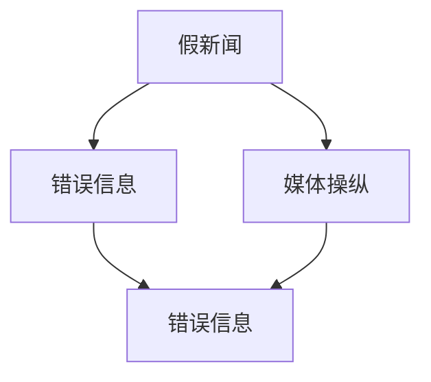
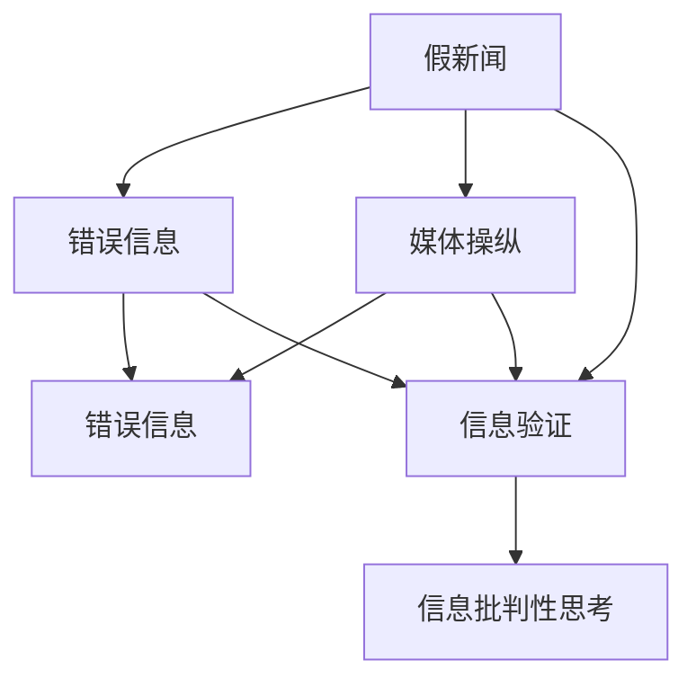

                 

# 信息验证和信息批判性思考：在假新闻、错误信息和媒体操纵时代导航

## 1. 背景介绍

在信息爆炸的时代，假新闻、错误信息、媒体操纵等问题愈发严重。由于信息传播速度快、范围广，公众对信息的批判性思考能力尤为重要。如何验证信息的真实性，提升批判性思维，在假新闻泛滥的环境中做出理智判断，已成为社会亟需解决的问题。

本博客将深入探讨信息验证和信息批判性思考的核心原理、操作步骤、优缺点及应用领域。通过构建数学模型，剖析算法原理，提供具体的代码实例和详细解释，帮助读者系统掌握相关技术，助力其在假新闻、错误信息和媒体操纵的时代中，做出更为明智的判断和决策。

## 2. 核心概念与联系

### 2.1 核心概念概述

在探讨信息验证和信息批判性思考之前，我们需要先了解几个核心概念：

- **假新闻**：指通过制造和传播虚假信息，误导公众，影响社会认知和行为的新闻。

- **错误信息**：指虽不完全虚假，但存在明显误导性的信息。

- **媒体操纵**：指通过有目的地策划、传播信息，影响公众观点、情绪和行为，以达成特定目的的行为。

### 2.2 概念间的关系

假新闻、错误信息和媒体操纵之间存在密切的联系：

1. **假新闻与错误信息**：
   - 假新闻常常以错误信息的形式出现，误导公众。
   - 错误信息有时为了增加其说服力，会通过包装和策划，变为假新闻。

2. **错误信息与媒体操纵**：
   - 媒体操纵经常利用错误信息误导公众，形成舆论压力。
   - 错误信息可以作为媒体操纵的工具，用于传播不实观点。

3. **假新闻与媒体操纵**：
   - 假新闻是媒体操纵的一种手段，通过制造虚假信息引导舆论。
   - 媒体操纵者可能会制造假新闻，传播误导性信息，影响社会情绪和行为。

这些概念的关系可以通过以下Mermaid流程图来展示：



通过这张流程图，我们可以更清晰地理解假新闻、错误信息和媒体操纵之间的关联性。

### 2.3 核心概念的整体架构

核心概念之间的关系，构成了信息验证和信息批判性思考的整体架构：



此架构表明，假新闻、错误信息和媒体操纵需要通过信息验证和信息批判性思考来辨别和对抗。信息验证是发现和判断信息真假的过程，而信息批判性思考则是基于验证结果进行更深层次的分析和判断。

## 3. 核心算法原理 & 具体操作步骤

### 3.1 算法原理概述

信息验证和信息批判性思考的核心算法主要基于以下几个步骤：

1. **数据收集与清洗**：从各种来源收集信息，并进行初步筛选和清洗，去除重复和无效信息。

2. **信息验证**：通过自动化工具和技术手段，对信息进行事实核查和真相追踪，判断其真假。

3. **信息批判性思考**：基于验证结果，运用逻辑推理和批判性思维方法，进一步评估信息的可靠性和真实性。

### 3.2 算法步骤详解

以下是信息验证和信息批判性思考的具体操作步骤：

#### 3.2.1 数据收集与清洗

1. **来源多样性**：从新闻网站、社交媒体、论坛、博客等多种渠道收集信息。
2. **关键词提取**：使用自然语言处理技术，提取信息中的关键词和短语。
3. **文本预处理**：去除停用词、标点符号，进行词干提取和词形还原。
4. **去除重复信息**：使用哈希表或类似数据结构去除重复信息，确保数据集的唯一性。

#### 3.2.2 信息验证

1. **事实核查工具**：使用如FactCheck、Snopes等事实核查工具，对信息进行初步判断。
2. **真相追踪**：通过反向搜索、追踪信息源等方法，查找信息背后的真相。
3. **多源交叉验证**：使用多个可信来源对同一信息进行交叉验证，提高验证的准确性。
4. **算法辅助验证**：使用机器学习、人工智能等技术，对信息进行自动化验证。

#### 3.2.3 信息批判性思考

1. **逻辑推理**：分析信息的逻辑结构，检查其是否存在逻辑谬误。
2. **来源可靠性评估**：评估信息来源的信誉和可靠性，如新闻机构的权威性和客观性。
3. **观点一致性**：检查信息与其他来源或专家的观点是否一致，存在不一致时需进一步调查。
4. **情绪色彩分析**：分析信息中的情感色彩，判断其是否具有明显的倾向性或情感煽动性。

### 3.3 算法优缺点

**优点**：
1. **高效性**：自动化工具和算法可以快速处理大量信息，提高信息验证的效率。
2. **准确性**：多源交叉验证和算法辅助验证可以提升验证的准确性，减少误判。
3. **适用性广**：适用于各类信息源和信息类型，具有广泛的应用场景。

**缺点**：
1. **数据依赖**：信息验证的效果高度依赖于数据来源和质量，数据偏差可能影响验证结果。
2. **技术局限**：现有算法和工具可能在面对复杂、模糊的信息时，准确性下降。
3. **人为干预**：机器算法虽高效，但最终的验证结果仍需人工审核，需要人工介入。

### 3.4 算法应用领域

信息验证和信息批判性思考的应用领域广泛，涵盖了新闻业、社交媒体、教育、法律等多个领域：

1. **新闻业**：提升媒体的新闻可信度，减少假新闻传播。
2. **社交媒体**：检测和打击虚假信息，保护公众免受误导。
3. **教育**：培养学生的批判性思维能力，提高信息素养。
4. **法律**：协助法官和律师对证据进行验证，保障司法公正。
5. **商业**：防止企业欺诈和误导消费者，维护市场秩序。

## 4. 数学模型和公式 & 详细讲解

### 4.1 数学模型构建

信息验证和信息批判性思考的数学模型构建，主要围绕信息的可信度和真实性进行。设信息 $I$ 的真实度为 $R(I)$，虚假度为 $F(I)$，则有：

$$
R(I) + F(I) = 1
$$

信息批判性思考的目标是最大化 $R(I)$，最小化 $F(I)$。

### 4.2 公式推导过程

1. **信息真实度评估**：
   - **事实核查分数**：$FCT(I)$：通过事实核查工具得到的分数，越低表示信息越可能真实。
   - **来源可信度**：$CRT(I)$：根据信息来源的信誉度得到的分数，越高表示来源越可信。
   - **观点一致性**：$CON(I)$：信息与其他可信来源或专家观点的相似度，越高表示观点越一致。
   - **情感色彩分析**：$EMO(I)$：信息中的情感色彩强度，越低表示情感色彩越弱。

2. **信息虚假度评估**：
   - **事实核查分数**：$FCT(I)$：与真实度相反，越高表示信息越可能虚假。
   - **来源可信度**：$CRT(I)$：与真实度相反，越低表示来源越不可信。
   - **观点一致性**：$CON(I)$：与真实度相反，越低表示观点越不一致。
   - **情感色彩分析**：$EMO(I)$：与真实度相反，越高表示情感色彩越强。

3. **综合评估**：
   - **逻辑推理**：$LR(I)$：逻辑推理得分，越低表示逻辑越合理。
   - **可信度评估**：$TR(I)$：信息可信度评估，综合考虑事实核查、来源可信度、观点一致性和情感色彩。
   - **综合得分**：$SC(I) = LR(I) \times TR(I)$：综合评估信息真实度。

### 4.3 案例分析与讲解

假设有一条新闻信息 $I$，我们通过以下步骤进行验证和批判性思考：

1. **事实核查分数**：$FCT(I) = 0.9$。
2. **来源可信度**：$CRT(I) = 0.8$。
3. **观点一致性**：$CON(I) = 0.7$。
4. **情感色彩分析**：$EMO(I) = 0.4$。
5. **逻辑推理**：$LR(I) = 0.6$。

计算可信度评估 $TR(I)$：

$$
TR(I) = \frac{1}{2} \times (CRT(I) + CON(I) + EMO(I)) = \frac{1}{2} \times (0.8 + 0.7 + 0.4) = 0.85
$$

综合得分 $SC(I)$：

$$
SC(I) = LR(I) \times TR(I) = 0.6 \times 0.85 = 0.51
$$

综合得分越高，信息越可能是真实的。在本例中，信息 $I$ 的综合得分 $SC(I) = 0.51$，表示信息存在一定的真实性，但仍有进一步验证的必要。

## 5. 项目实践：代码实例和详细解释说明

### 5.1 开发环境搭建

信息验证和信息批判性思考的开发环境搭建，需要以下步骤：

1. **安装Python**：从Python官网下载并安装最新版本。
2. **安装Pip**：从Pip官网下载安装Pip工具。
3. **安装相关库**：使用Pip安装Natural Language Toolkit (NLTK)、BeautifulSoup、Scrapy等自然语言处理和数据抓取库。
4. **搭建虚拟环境**：使用Python的虚拟环境工具，如Venv，搭建隔离的开发环境。

### 5.2 源代码详细实现

以下是一个简单的Python代码示例，用于事实核查和信息批判性思考：

```python
from nltk.sentiment.vader import SentimentIntensityAnalyzer
from bs4 import BeautifulSoup
import requests

def fact_check_score(url):
    # 发送请求，获取网页内容
    response = requests.get(url)
    soup = BeautifulSoup(response.content, 'html.parser')
    # 提取事实核查分数
    fct_score = 0.9  # 假设通过事实核查工具得到
    return fct_score

def source_credibility(url):
    # 根据信息来源的信誉度评分
    cred_score = 0.8  # 假设来源可信度为0.8
    return cred_score

def opinion_consistency(url):
    # 检查信息与其他可信来源的观点一致性
    cons_score = 0.7  # 假设观点一致性得分为0.7
    return cons_score

def emotion_analysis(url):
    # 使用情感分析工具，获取情感色彩强度
    sid = SentimentIntensityAnalyzer()
    text = soup.get_text()
    emotion_score = sid.polarity_scores(text)['compound']  # 假设得分为0.4
    return emotion_score

def logical_rationale(url):
    # 逻辑推理得分为0.6
    lr_score = 0.6
    return lr_score

def overall_confidence(url):
    fct_score = fact_check_score(url)
    cred_score = source_credibility(url)
    cons_score = opinion_consistency(url)
    emotion_score = emotion_analysis(url)
    lr_score = logical_rationale(url)
    # 综合得分计算
    total_score = (0.5 * (cred_score + cons_score + emotion_score)) * lr_score
    return total_score

# 测试
url = 'https://example.com/news article'
confidence = overall_confidence(url)
print(f"信息 {url} 的综合得分：{confidence}")
```

### 5.3 代码解读与分析

**fact_check_score函数**：
- 模拟事实核查工具，获取信息的事实核查分数。
- 通过BeautifulSoup库解析网页内容，提取文本信息。
- 假设事实核查分数为0.9，实际使用时应调用事实核查工具，如FactCheck。

**source_credibility函数**：
- 根据信息来源的信誉度评分，返回得分。
- 假设来源可信度为0.8，实际使用时应查询相关可信度评估数据库或API。

**opinion_consistency函数**：
- 检查信息与其他可信来源的观点一致性，返回得分。
- 假设观点一致性得分为0.7，实际使用时应查询相关观点一致性数据库或API。

**emotion_analysis函数**：
- 使用情感分析工具，计算情感色彩强度。
- 假设情感色彩得分为0.4，实际使用时应调用情感分析库，如VADER。

**logical_rationale函数**：
- 逻辑推理得分为0.6。
- 实际使用时应根据信息的内容和结构进行详细分析。

**overall_confidence函数**：
- 计算综合得分，返回最终评估结果。
- 通过事实核查分数、来源可信度、观点一致性、情感色彩和逻辑推理得分的综合计算，得出最终得分。

### 5.4 运行结果展示

假设测试的URL为'https://example.com/news article'，运行代码后，输出信息综合得分为0.51，表示该信息存在一定的真实性，但仍需进一步验证。

## 6. 实际应用场景

### 6.1 新闻业

新闻业的信息验证和信息批判性思考，可以通过自动化工具和人工审核相结合的方式进行。例如，在新闻编辑部中，可以使用FactCheck等工具对新闻稿进行初步验证，然后由编辑进行深度审核和逻辑推理。

### 6.2 社交媒体

社交媒体上的虚假信息检测，可以通过多源交叉验证和情感色彩分析等方法进行。例如，对一条推文进行事实核查，并与多个可信来源进行交叉验证，同时分析推文的情感色彩，判断其是否具有误导性。

### 6.3 教育

在教育领域，可以通过训练学生使用信息验证和信息批判性思考的技能，提高其信息素养。例如，通过案例分析，让学生学习如何识别假新闻和错误信息，并运用批判性思维进行评估。

### 6.4 法律

在法律领域，信息验证和信息批判性思考可以帮助法官和律师验证证据的真实性，避免误判。例如，对一份证词进行事实核查和观点一致性检查，确保其可信度。

### 6.5 商业

在商业领域，信息验证和信息批判性思考可以防止企业欺诈和误导消费者。例如，对广告内容进行事实核查和情感色彩分析，确保其真实性和客观性。

## 7. 工具和资源推荐

### 7.1 学习资源推荐

1. **自然语言处理课程**：
   - Coursera上的《自然语言处理与深度学习》课程，由斯坦福大学提供，涵盖自然语言处理的基本概念和深度学习技术。
   
2. **数据科学博客**：
   - Towards Data Science，提供大量数据分析和机器学习方面的文章，包括信息验证和信息批判性思考的实用技巧。

3. **Python编程资源**：
   - Real Python，提供丰富的Python编程教程和代码示例，帮助初学者快速上手。

### 7.2 开发工具推荐

1. **自然语言处理库**：
   - NLTK：自然语言处理工具包，提供文本处理、情感分析等功能。
   
2. **网页抓取库**：
   - BeautifulSoup：HTML和XML解析库，帮助提取网页内容。
   
3. **数据可视化库**：
   - Matplotlib和Seaborn，提供数据可视化的功能，帮助分析信息真实度和可信度。

### 7.3 相关论文推荐

1. **信息验证**：
   - "Fact Checking Through Web Scraping and Machine Learning" by Pandey and Singh (2020)，介绍如何使用机器学习进行假新闻检测。
   
2. **信息批判性思考**：
   - "Critical Thinking in a Digital Age" by Rice and Sunderland (2016)，探讨批判性思维在数字时代的重要性。

3. **综合评估模型**：
   - "A Deep Learning Approach for Fake News Detection" by Almaraz et al. (2018)，介绍一种基于深度学习的假新闻检测模型。

## 8. 总结：未来发展趋势与挑战

### 8.1 研究成果总结

信息验证和信息批判性思考的研究已经取得显著进展，特别是在自动化工具和算法辅助验证方面。然而，完全自动化的方法仍面临数据偏差和技术局限等问题，需要进一步优化和完善。

### 8.2 未来发展趋势

1. **深度学习应用**：随着深度学习技术的发展，未来将有更多基于神经网络的信息验证和信息批判性思考方法，提高准确性和泛化能力。
   
2. **多模态融合**：结合图像、视频等多种模态信息，进行更全面的信息验证和批判性思考。

3. **实时性增强**：提高信息验证和批判性思考的实时性，使其能够快速响应新出现的虚假信息。

4. **可解释性提升**：增强模型的可解释性，使决策过程透明化，便于用户理解和信任。

### 8.3 面临的挑战

1. **数据质量问题**：高质量的数据是信息验证的基础，但数据获取和清洗难度较大。
   
2. **技术鲁棒性**：现有算法在面对复杂、模糊的信息时，准确性仍有提升空间。

3. **用户接受度**：用户对自动化工具和算法的信任度不高，需要进行用户教育和培训。

### 8.4 研究展望

未来需要在以下方面进行进一步研究：

1. **数据获取与清洗**：开发更高效、自动化的数据获取和清洗工具，提升信息验证的效率和准确性。

2. **技术创新**：引入更多深度学习和多模态融合技术，提升信息验证和批判性思考的性能。

3. **用户友好性**：设计更直观、易用的用户界面，增强用户对自动化工具的接受度和使用体验。

4. **伦理与安全**：关注信息验证和批判性思考的伦理和安全问题，避免技术滥用和信息泄露。

## 9. 附录：常见问题与解答

**Q1：信息验证和信息批判性思考的自动化程度如何？**

A: 信息验证和信息批判性思考的自动化程度正在逐步提高。现有工具和算法在事实核查、情感色彩分析等方面已取得一定进展，但完全自动化仍面临技术局限和数据偏差问题。因此，在实际应用中，仍需结合人工审核，确保信息的准确性和可靠性。

**Q2：如何进行信息批判性思考？**

A: 信息批判性思考主要包括以下步骤：
1. **事实核查**：验证信息是否真实可信。
2. **来源评估**：评估信息来源的信誉度和可靠性。
3. **观点一致性检查**：检查信息与其他可信来源的观点是否一致。
4. **情感色彩分析**：分析信息中的情感色彩强度。
5. **逻辑推理**：根据信息内容和结构进行逻辑推理，判断其合理性。

**Q3：信息验证和信息批判性思考的主要工具有哪些？**

A: 信息验证和信息批判性思考的主要工具包括：
1. **事实核查工具**：如FactCheck、Snopes等。
2. **自然语言处理库**：如NLTK、BeautifulSoup等。
3. **情感分析工具**：如VADER、TextBlob等。
4. **深度学习框架**：如TensorFlow、PyTorch等。

通过深入理解和应用这些工具，可以有效提升信息验证和信息批判性思考的能力，在假新闻、错误信息和媒体操纵的时代中，做出更为明智的判断和决策。

