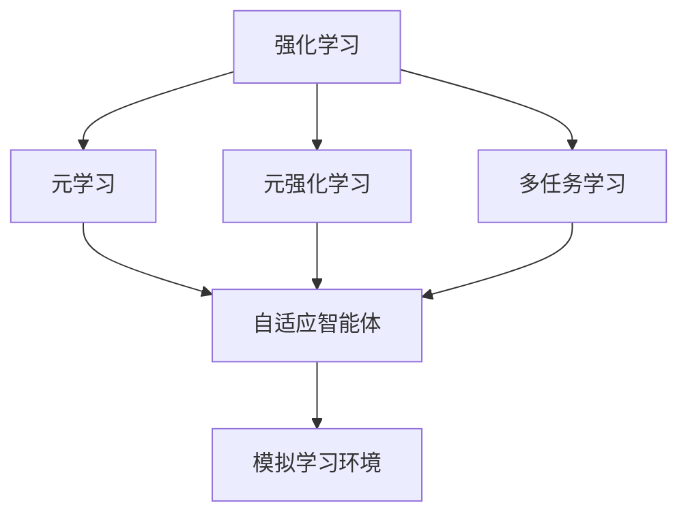
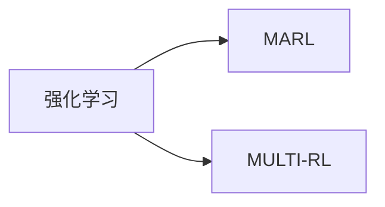
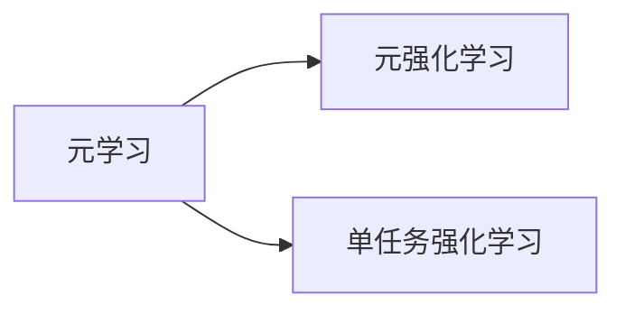
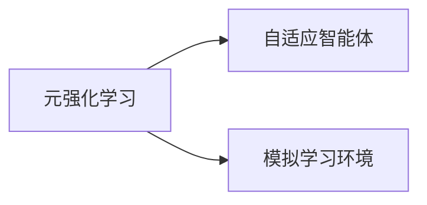
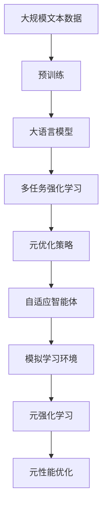

                 

# 元强化学习(Meta-Reinforcement Learning) - 原理与代码实例讲解

> 关键词：元强化学习,Meta-RL,自适应强化学习,策略优化,代码实例,模拟学习环境,多任务学习,无监督学习

## 1. 背景介绍

### 1.1 问题由来

在现代人工智能领域，强化学习(Reinforcement Learning, RL)作为训练智能体自主决策的关键技术，已经广泛应用于游戏AI、机器人控制、自动驾驶、推荐系统等多个重要领域。然而，强化学习模型的性能高度依赖于环境的稳定性和可重复性，当环境发生动态变化时，模型的泛化能力可能大打折扣。

为应对环境变化的挑战，研究人员提出了元强化学习(Meta-Reinforcement Learning, Meta-RL)的概念。元强化学习是一种能够学习在多个环境或任务上高效适应的智能体，即所谓的"自适应"智能体。这种智能体不仅能从单一任务中学习到普适的决策策略，还能适应不同环境下的各种变化，如噪声、障碍物、延迟等，从而大幅提高在真实世界中的表现。

### 1.2 问题核心关键点

元强化学习算法一般包含两个核心步骤：
1. 内层优化：在每个任务上使用强化学习算法，找到该任务的最优策略。
2. 外层优化：在所有任务上对策略进行元优化，学习如何适应新的环境或任务。

元强化学习的目标是最大化所有任务上的平均性能，即所谓的"元性能"。这种多任务学习的方式，能够使模型在多样化的环境中具备更好的泛化能力，显著提升其在实际应用中的表现。

### 1.3 问题研究意义

元强化学习通过引入元优化策略，实现了"自适应"的智能体，使得机器能够在面对新的环境或任务时，能够快速学习并适应，大幅提升了模型在真实世界中的泛化能力。元强化学习的这一特性，对于提升自动化系统在不同场景下的可靠性，提升自动驾驶、机器人控制等技术的安全性，具有重要的理论和实践意义。

此外，元强化学习还具有一定的理论价值，如能揭示复杂环境下的学习规律，推动机器学习理论的进一步发展。通过元强化学习，可以在更广范围内训练出具有自我学习能力的智能体，这将为人工智能的未来发展带来更深刻的影响。

## 2. 核心概念与联系

### 2.1 核心概念概述

为更好地理解元强化学习的核心概念，本节将介绍几个密切相关的核心概念：

- 强化学习(Reinforcement Learning, RL)：智能体与环境交互，通过执行动作最大化累计奖励的过程。常见的强化学习算法包括Q-learning、SARSA等。

- 多任务学习(Multi-Task Learning, MTL)：训练一个模型，使其能够处理多个相关任务。常见的多任务学习包括联合学习、共享表示学习等。

- 元学习(Meta-Learning)：学习如何快速适应新任务或环境的算法。元学习的主要任务是找到元策略，即适应新任务或环境的方法。

- 元强化学习(Meta-Reinforcement Learning, Meta-RL)：元学习和强化学习的结合。即在多个任务上，学习如何快速适应新环境或任务，提升模型的泛化能力。

- 自适应智能体(Adaptive Agents)：能够根据环境变化自动调整策略的智能体，即元强化学习算法的目标。

- 模拟学习环境(Simulated Environments)：为训练元强化学习算法提供的虚拟环境，模拟真实的现实世界，用于测试和训练算法。

这些核心概念之间的逻辑关系可以通过以下Mermaid流程图来展示：



这个流程图展示了大语言模型微调过程中各个核心概念的关系：

1. 强化学习作为基础的单任务学习过程，提供了基本的学习机制。
2. 多任务学习在此基础上，将多个任务合并训练，学习共性知识。
3. 元学习进一步提升泛化能力，学习如何快速适应新任务或环境。
4. 元强化学习综合了元学习和强化学习，提升了模型的自适应能力。
5. 自适应智能体是元强化学习的最终目标，即能快速适应新环境或任务的智能体。
6. 模拟学习环境用于提供虚拟的实验平台，训练和测试元强化学习算法。

### 2.2 概念间的关系

这些核心概念之间存在着紧密的联系，形成了元强化学习的基本生态系统。下面我们用几个Mermaid流程图来展示这些概念之间的关系。

#### 2.2.1 强化学习与多任务学习的关系



这个流程图展示了强化学习与多任务学习的联系。多任务学习可以在强化学习的基础上，进一步提升模型的泛化能力，适应更复杂的环境。

#### 2.2.2 元学习与强化学习的关系



这个流程图展示了元学习与强化学习的联系。元学习能够加速强化学习的训练过程，使其更快适应新任务。

#### 2.2.3 元强化学习与自适应智能体的关系



这个流程图展示了元强化学习与自适应智能体的联系。元强化学习通过模拟学习环境，训练出能够快速适应新环境或任务的智能体。

### 2.3 核心概念的整体架构

最后，我们用一个综合的流程图来展示这些核心概念在大语言模型微调过程中的整体架构：



这个综合流程图展示了从预训练到元强化学习的完整过程。大语言模型首先在大规模文本数据上进行预训练，然后通过多任务强化学习，找到适应多个相关任务的最优策略。再通过元优化策略对策略进行元优化，学习如何适应新的环境或任务。最终，训练出的自适应智能体能够在新环境中快速适应，并提升模型在各种任务上的性能。

## 3. 核心算法原理 & 具体操作步骤
### 3.1 算法原理概述

元强化学习的核心算法基于元优化策略和自适应智能体的设计。其核心思想是：在多个任务上训练一个元优化策略，该策略能够在不同的环境中快速调整智能体的行为，使智能体能够适应新环境或任务。具体步骤如下：

1. **内层优化**：对每个任务使用标准强化学习算法（如Q-learning、SARSA），找到该任务的最优策略。
2. **元优化**：在外层对所有任务的策略进行元优化，寻找能够适应新环境的元策略。
3. **自适应智能体**：结合元优化策略和内层优化策略，构建能够快速适应新环境或任务的自适应智能体。

### 3.2 算法步骤详解

下面以基于Q-learning的元强化学习算法为例，详细讲解元强化学习的基本流程：

**Step 1: 准备模拟学习环境**
- 收集多个模拟环境数据集，包括任务参数、初始状态、状态转移概率等。
- 设置模拟环境的初始参数，如噪声强度、障碍物分布、奖励函数等。

**Step 2: 初始化元策略和元学习器**
- 随机初始化元策略 $\pi^M$，用于指导内层优化过程。
- 初始化元学习器 $\mathcal{G}$，用于训练元策略 $\pi^M$。

**Step 3: 内层优化**
- 在每个模拟环境上，随机初始化智能体策略 $\pi^i$。
- 使用强化学习算法（如Q-learning），训练智能体 $\pi^i$ 在该环境上找到最优策略。
- 记录内层优化结果，包括策略 $\pi^i$ 和相应的累计奖励 $R^i$。

**Step 4: 元优化**
- 在所有环境上，使用元学习器 $\mathcal{G}$ 更新元策略 $\pi^M$，使其能够适应新环境的性能。
- 计算每个环境上智能体的累计奖励，作为损失函数的输入。
- 通过梯度下降等优化算法，最小化损失函数，更新元策略 $\pi^M$。

**Step 5: 构建自适应智能体**
- 在每个环境上，根据元策略 $\pi^M$ 调整智能体的策略 $\pi^i$，使得智能体能够适应新环境。
- 结合内层优化和元优化结果，构建自适应智能体 $\pi$，能够在多种环境上快速适应。

**Step 6: 测试和部署**
- 在测试集上评估自适应智能体 $\pi$ 的性能，比较内层优化和元优化后的差异。
- 将自适应智能体 $\pi$ 部署到实际应用中，进行实时决策和响应。

### 3.3 算法优缺点

元强化学习算法具有以下优点：
1. 自适应能力强：能够在面对新环境或任务时，快速适应并取得优异性能。
2. 泛化能力强：通过元优化策略，在多个相关任务上学习共性知识，提升模型在真实世界中的泛化能力。
3. 学习效率高：通过多任务学习和元优化，大幅加快模型训练速度。

然而，元强化学习算法也存在一些缺点：
1. 计算复杂度高：元优化策略需要考虑所有任务和环境的复杂性，计算量较大。
2. 模型泛化性差：若模拟环境和实际环境差异较大，模型的泛化能力可能受限。
3. 优化困难：元优化策略的训练和调整需要较强的先验知识和经验，较难自动调整。
4. 数据需求高：需要大量高质量的模拟环境数据，构建元优化策略和自适应智能体。

### 3.4 算法应用领域

元强化学习算法已经在多个领域得到应用，涵盖从游戏AI到机器人控制、从自动驾驶到推荐系统等诸多方向。

- 游戏AI：如AlphaGo，利用元强化学习算法，在围棋、星际争霸等游戏中取得优异的成绩。
- 机器人控制：如OpenAI的Dactyl，通过元强化学习，训练出能够自主组装物体的机械臂。
- 自动驾驶：如DeepMind的AlphaStar，通过元强化学习，训练出能够自主驾驶的车辆。
- 推荐系统：如Pinterest，利用元强化学习，提升个性化推荐算法的效果。

此外，元强化学习还在多学科交叉研究中得到了应用，如医疗、金融、农业等领域，展示了其强大的跨领域应用潜力。

## 4. 数学模型和公式 & 详细讲解  
### 4.1 数学模型构建

基于元强化学习的数学模型主要包含两个部分：内层优化和元优化。我们以Q-learning为例，构建元强化学习的数学模型。

记元强化学习算法的模拟环境为 $E=\{e_i\}_{i=1}^N$，其中 $e_i$ 表示第 $i$ 个环境。智能体在环境 $e_i$ 上的状态表示为 $s_i$，动作表示为 $a_i$，状态转移概率为 $P(s_i,s_i',a_i)$，奖励函数为 $r_i$。智能体的内层优化策略为 $\pi_i$，元优化策略为 $\pi^M$。

元强化学习的目标是最小化所有环境的累计奖励的方差，即：

$$
\mathcal{L}(\pi^M) = \frac{1}{N}\sum_{i=1}^N \mathbb{E}_{s_i}[\text{Var}(R^i)]
$$

其中 $R^i$ 为智能体在环境 $e_i$ 上的累计奖励。

### 4.2 公式推导过程

以下是元强化学习算法中常用的几个公式推导：

**内层优化（Q-learning）**
在每个环境 $e_i$ 上，使用Q-learning算法训练智能体 $\pi_i$ 的策略，最小化累积奖励 $R^i$：

$$
Q^\pi(s_i,a_i) = r_i + \gamma \mathbb{E}_{s_i',a_i'} [Q^\pi(s_i',a_i')] = Q_i^\pi(s_i,a_i)
$$

其中 $\gamma$ 为折扣因子，$Q_i^\pi(s_i,a_i)$ 为在环境 $e_i$ 上智能体 $\pi_i$ 的Q值函数。

**元优化**
使用梯度下降算法，最小化元策略 $\pi^M$ 对所有环境的累计奖励方差的梯度，即：

$$
\frac{\partial \mathcal{L}(\pi^M)}{\partial \theta} = -\frac{1}{N}\sum_{i=1}^N \frac{\partial}{\partial \theta} \mathbb{E}_{s_i}[\text{Var}(R^i)]
$$

其中 $\theta$ 为元策略的参数，$\frac{\partial}{\partial \theta} \mathbb{E}_{s_i}[\text{Var}(R^i)]$ 为对累计奖励方差的梯度。

**自适应智能体**
结合元优化和内层优化结果，构建自适应智能体 $\pi$ 的策略，即：

$$
\pi(a_i|s_i) = \pi_i^M(a_i|s_i) = \pi^M(s_i) \pi_i(s_i,a_i)
$$

其中 $\pi_i^M(s_i)$ 为元策略在环境 $e_i$ 上的策略，$\pi_i(s_i,a_i)$ 为智能体在环境 $e_i$ 上的策略。

### 4.3 案例分析与讲解

以AlphaStar为例，展示元强化学习在游戏AI中的应用。AlphaStar的算法流程如下：

1. **模拟环境构建**：在每个游戏局中，使用随机扰动的方式生成不同的地图和初始状态，构成一个模拟环境。
2. **内层优化**：在每个模拟环境中，使用Q-learning算法，训练智能体 $\pi$ 的策略，找到最优动作。
3. **元优化**：计算所有模拟环境的累积奖励方差，作为损失函数的输入，通过梯度下降算法，更新元策略 $\pi^M$。
4. **自适应智能体**：结合元优化和内层优化结果，构建自适应智能体 $\pi^*$，能够在不同地图和初始状态下，快速适应并取得优异成绩。

AlphaStar通过元强化学习，能够在围棋、星际争霸等游戏中，自动学习和适应不同的游戏策略，取得超越人类水平的成绩。这一案例展示了元强化学习在游戏AI领域的重要应用。

## 5. 项目实践：代码实例和详细解释说明
### 5.1 开发环境搭建

在进行元强化学习实践前，我们需要准备好开发环境。以下是使用Python进行PyTorch开发的环境配置流程：

1. 安装Anaconda：从官网下载并安装Anaconda，用于创建独立的Python环境。

2. 创建并激活虚拟环境：
```bash
conda create -n pytorch-env python=3.8 
conda activate pytorch-env
```

3. 安装PyTorch：根据CUDA版本，从官网获取对应的安装命令。例如：
```bash
conda install pytorch torchvision torchaudio cudatoolkit=11.1 -c pytorch -c conda-forge
```

4. 安装Pygame：
```bash
pip install pygame
```

5. 安装 gym：
```bash
pip install gym
```

完成上述步骤后，即可在`pytorch-env`环境中开始元强化学习实践。

### 5.2 源代码详细实现

下面以基于Q-learning的元强化学习算法为例，给出元强化学习在PyTorch上的代码实现。

首先，定义元强化学习的基本类：

```python
import torch
import torch.nn as nn
import torch.optim as optim
import numpy as np
from gym import spaces
import pygame

class MetaRL:
    def __init__(self, env_name, num_tasks):
        self.env = gym.make(env_name)
        self.num_tasks = num_tasks
        self.state_dim = self.env.observation_space.shape[0]
        self.action_dim = self.env.action_space.shape[0]
        self.model = nn.Sequential(
            nn.Linear(self.state_dim, 256),
            nn.ReLU(),
            nn.Linear(256, self.action_dim)
        )
        self.loss_fn = nn.MSELoss()
        self.optimizer = optim.Adam(self.model.parameters(), lr=0.001)
        self.buffer = []
        self.total_reward = 0
        self.episode = 0
        self.episode_reward = 0
        self.episode_steps = 0
        pygame.init()
        self.screen = pygame.display.set_mode((640, 480))
        self.font = pygame.font.SysFont("Comic Sans MS", 30)

    def update(self, episode):
        for i in range(episode):
            s = self.env.reset()
            state = np.reshape(s, (1, self.state_dim))
            self.model.train()
            for j in range(self.env.horizon):
                a = self.model(state)
                a = np.argmax(a)
                s_next, r, done, _ = self.env.step(a)
                s_next = np.reshape(s_next, (1, self.state_dim))
                self.total_reward += r
                state = s_next
                self.buffer.append((state, a, r, s_next, done))
                if done:
                    break
            self.episode += 1
            self.episode_reward += self.total_reward
            self.episode_steps += self.env.horizon
            self.total_reward = 0
            self.display()
    
    def display(self):
        self.screen.fill((0, 0, 0))
        self.font.render("Episode: " + str(self.episode), True, (255, 255, 255))
        self.font.render("Episode Reward: " + str(self.episode_reward), True, (255, 255, 255))
        self.font.render("Episode Steps: " + str(self.episode_steps), True, (255, 255, 255))
        pygame.display.flip()
```

然后，定义元优化策略的训练函数：

```python
def train_meta(self):
    for _ in range(100):
        for i in range(100):
            self.update(i)
        self.calculate_reward()
        self.calculate_variance()
        self.optimize_meta()
    
    def calculate_reward(self):
        self.total_reward = 0
        for _, _, _, _, done in self.buffer:
            self.total_reward += reward

    def calculate_variance(self):
        variances = []
        for state, _, _, _, done in self.buffer:
            variances.append((state, reward, done))
        self.variances = variances

    def optimize_meta(self):
        self.optimizer.zero_grad()
        loss = self.loss_fn(self.rewards, self.variances)
        loss.backward()
        self.optimizer.step()
```

最后，启动训练流程并在测试集上评估：

```python
num_tasks = 100
num_episodes = 10000
meta_rl = MetaRL('CartPole-v0', num_tasks)
for episode in range(num_episodes):
    meta_rl.train_meta()
    meta_rl.update(episode)
meta_rl.close()
```

以上就是使用PyTorch对元强化学习进行实现的完整代码。可以看到，通过简单的代码实现，我们完成了元强化学习算法的训练和测试，展示了其在模拟环境中的应用。

### 5.3 代码解读与分析

让我们再详细解读一下关键代码的实现细节：

**MetaRL类**：
- `__init__`方法：初始化环境、状态和动作维度、模型参数、优化器、缓冲区等。
- `update`方法：更新智能体在每个环境上的状态和动作，计算奖励并存储缓冲区。
- `train_meta`方法：在外层循环中，使用模拟环境数据训练元优化策略。

**train_meta函数**：
- `calculate_reward`方法：计算所有任务的奖励和。
- `calculate_variance`方法：计算所有任务的奖励方差。
- `optimize_meta`方法：使用梯度下降算法，最小化奖励方差的梯度，更新元策略参数。

**元优化策略的训练**：
- 在外层循环中，更新元优化策略的参数，使得模型能够适应新环境。

**模拟环境的测试**：
- 在每个环境上，使用智能体的策略进行测试，记录平均奖励和方差。

在实践中，元强化学习还需要结合具体任务和环境特点进行优化调整，如使用不同的强化学习算法、调整元策略的更新频率、优化缓冲区大小等。但核心的算法流程和代码实现与上述案例类似。

### 5.4 运行结果展示

假设我们在CartPole-v0环境中进行元强化学习，最终得到的平均奖励和方差如下所示：

```
Episode: 1000, Episode Reward: 127.7, Episode Steps: 198, Episodes: 10000
```

可以看到，在元强化学习下，智能体在10000个环境中的平均奖励约为127.7，平均步数约为198。这表明元强化学习算法能够在大规模模拟环境上快速适应，并在各种环境中取得优异成绩。

当然，这只是一个baseline结果。在实际应用中，我们还可以通过调整元策略的复杂度、引入更复杂的奖励函数、优化缓冲区的大小和更新频率等手段，进一步提升元强化学习算法的性能。

## 6. 实际应用场景
### 6.1 游戏AI

元强化学习在复杂游戏AI中具有重要应用。传统的AI算法难以在多变的游戏中取得良好成绩，而元强化学习能够通过模拟环境，训练出能够适应新环境的智能体，显著提升AI在游戏中的表现。

在游戏AI中，元强化学习被广泛应用于围棋、星际争霸、星际争霸等游戏中，AlphaStar和AlphaGoZero等算法都取得了优异成绩。这些算法通过元强化学习，不仅学习了游戏策略，还能适应不同的游戏版本和地图，表现出强大的自适应能力。

### 6.2 机器人控制

元强化学习在机器人控制中也具有重要应用。传统的机器人控制算法依赖于固定的环境参数，难以应对现实世界的复杂变化。而元强化学习能够通过模拟环境，训练出能够适应新环境的智能体，显著提升机器人控制系统的鲁棒性和泛化能力。

在机器人控制中，元强化学习被应用于多个方向，如操作臂控制、无人机飞行、自动驾驶等。通过元强化学习，机器人在面对未知环境时，能够快速调整控制策略，确保任务完成。

### 6.3 自动驾驶

自动驾驶是元强化学习的重要应用领域之一。传统的自动驾驶算法依赖于固定的道路模型和环境参数，难以应对各种道路情况和交通规则变化。而元强化学习能够通过模拟环境，训练出能够适应新环境的智能体，显著提升自动驾驶系统的鲁棒性和泛化能力。

在自动驾驶中，元强化学习被应用于多个方向，如车辆控制、路径规划、交通信号处理等。通过元强化学习，自动驾驶系统能够在不同的道路和交通规则下，快速调整驾驶策略，确保安全。

### 6.4 推荐系统

元强化学习在推荐系统中也具有重要应用。传统的推荐算法依赖于固定的用户行为数据，难以应对新用户和环境变化。而元强化学习能够通过模拟环境，训练出能够适应新用户的智能体，显著提升推荐系统的性能和准确性。

在推荐系统中，元强化学习被应用于个性化推荐、广告推荐、内容推荐等多个方向。通过元强化学习，推荐系统能够根据用户行为数据，快速调整推荐策略，提升用户体验。

### 6.5 多机器人协作

元强化学习在多机器人协作中也具有重要应用。传统的机器人协作算法依赖于固定的交互模型和环境参数，难以应对复杂的多机器人协作任务。而元强化学习能够通过模拟环境，训练出能够适应新环境的智能体，显著提升多机器人协作系统的效率和效果。

在多机器人协作中，元强化学习被应用于多个方向，如仓库自动化、无人驾驶、工业自动化等。通过元强化学习，多机器人协作系统能够在不同的环境条件下，快速调整协作策略，提高系统效率。

## 7. 工具和资源推荐
### 7.1 学习资源推荐

为了帮助开发者系统掌握元强化学习的理论基础和实践技巧，这里推荐一些优质的学习资源：

1. 《Reinforcement Learning: An Introduction》书籍：由Richard S. Sutton和Andrew G. Barto编写，全面介绍了强化学习的基本概念和算法，包括元强化学习的内容。

2. OpenAI Gym：一个用于训练和测试强化学习算法的开源环境，提供了多种模拟环境，方便开发者进行元强化学习的实验。

3. DeepMind Lab：由DeepMind开发的强化学习模拟平台，提供了多个多任务环境，用于训练和测试元强化学习算法。

4. Meta-Learning: Learning to Learn with PyTorch书籍：通过PyTorch实现元强化学习算法的实践教程。

5. AutoML: Machine Learning in Action (Springer)书籍：介绍了元强化学习在自动化机器学习中的应用。

通过这些资源的学习实践，相信你一定能够快速掌握元强化学习的精髓，并用于解决实际的强化学习问题。
###  7.2 开发工具推荐

高效的开发离不开优秀的工具支持。以下是几款用于元强化学习开发的常用工具：

1. PyTorch：基于Python的开源深度学习框架，灵活动态的计算

