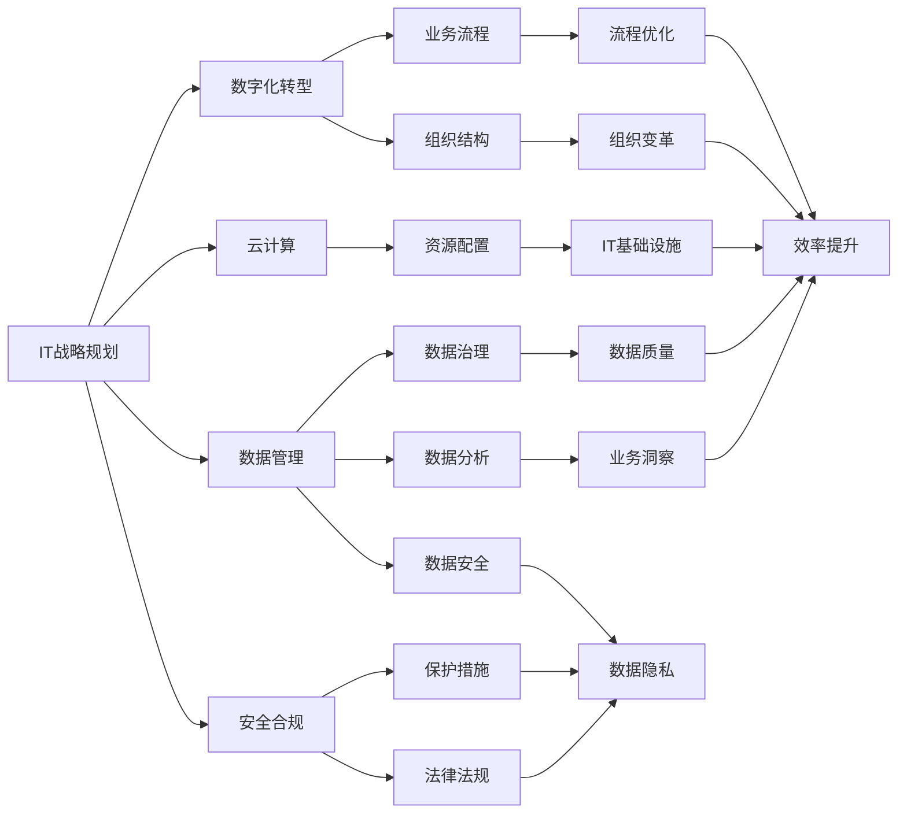
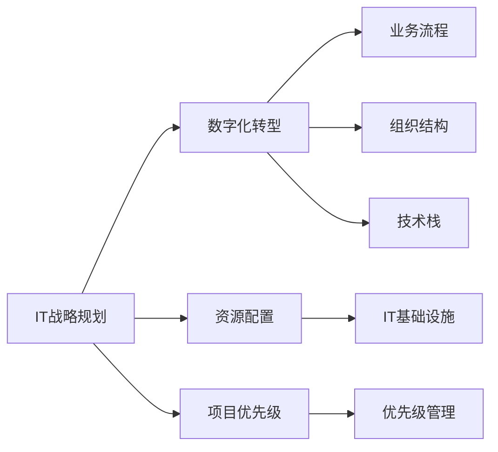
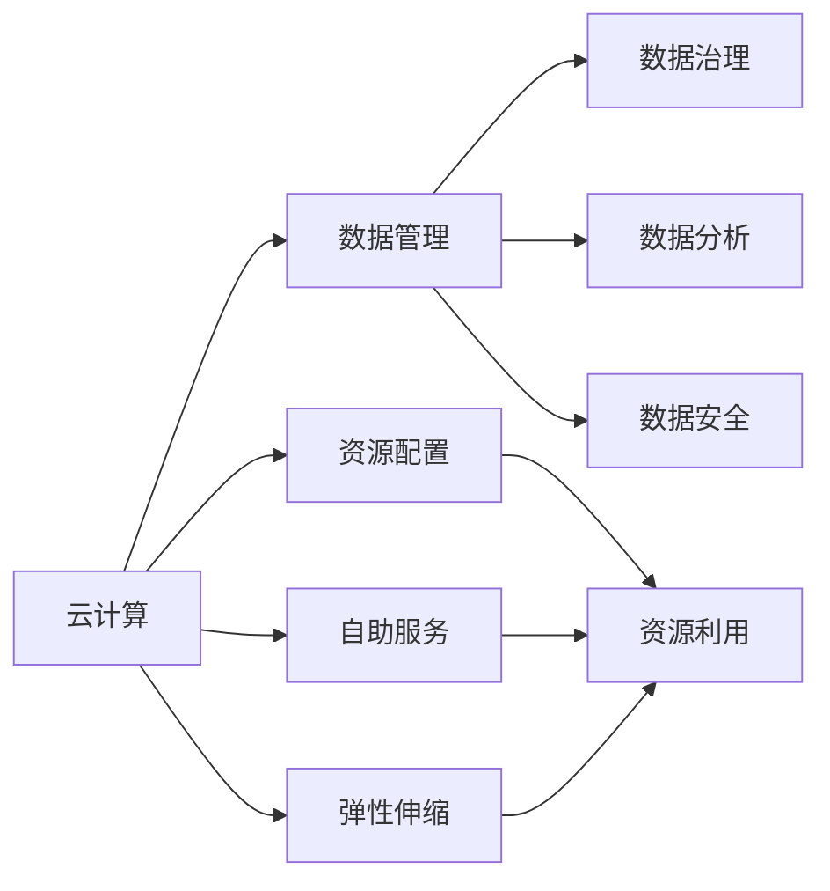
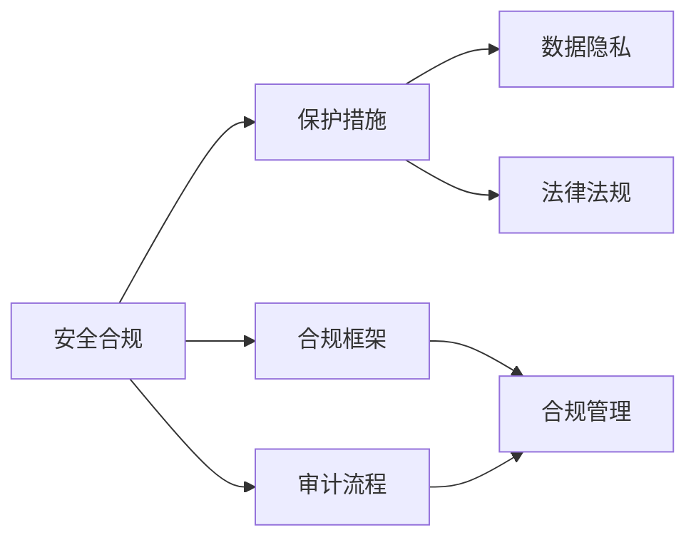
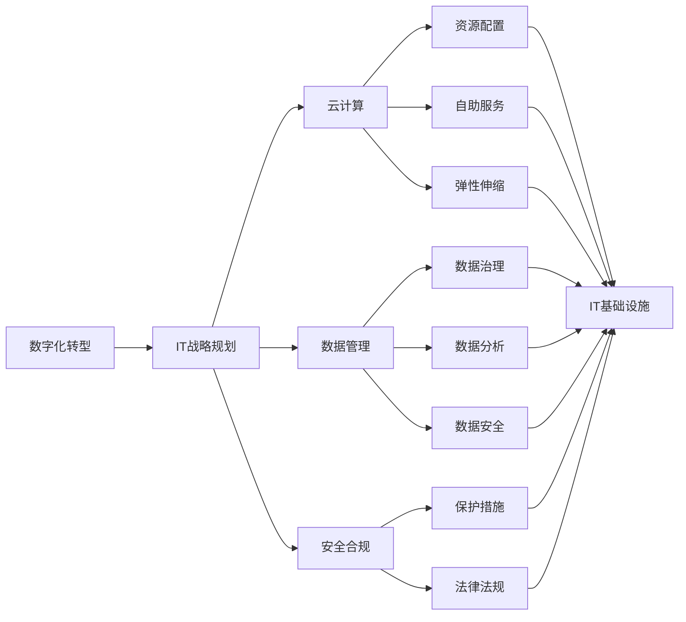

                 

# 公司IT战略规划的制定、实施

> 关键词：IT战略规划,公司治理,数字化转型,云计算,数据管理,安全合规

## 1. 背景介绍

### 1.1 问题由来
在当今数字化时代，信息技术（IT）已成为企业核心竞争力的一个重要组成部分。如何制定和实施有效的IT战略规划，以支持公司的长期发展目标，是所有企业必须面对的挑战。然而，由于信息技术的复杂性和快速变化，很多企业在IT战略规划上存在困惑和误区。为了解决这一问题，本文将深入探讨公司IT战略规划的制定和实施方法，为企业的数字化转型提供指导。

### 1.2 问题核心关键点
制定和实施IT战略规划的关键点包括以下几个方面：
- 确定企业数字化转型的目标和愿景。
- 评估现有IT基础设施和技术栈，制定差异化的IT战略。
- 选择合适的云计算和数据管理技术。
- 建立完整的安全合规框架，确保数据和系统安全。
- 制定灵活的IT运营模式，提高企业灵活性和适应性。

本文将围绕以上关键点，系统阐述公司IT战略规划的制定和实施方法。

### 1.3 问题研究意义
制定和实施IT战略规划，对于推动企业的数字化转型，提升核心竞争力，具有重要意义：

1. **支持长期目标**：通过明确的IT战略规划，企业可以明确数字化转型的方向和路径，确保各业务部门的协同工作。
2. **优化资源利用**：IT战略规划有助于优化资源配置，提升IT系统的利用效率，降低IT成本。
3. **提升灵活性**：灵活的IT运营模式，可以支持企业快速响应市场变化，提升企业的市场适应性和竞争力。
4. **确保安全合规**：在IT战略规划中建立完善的安全合规框架，可以有效防范数据泄露、网络攻击等风险，保护企业利益。
5. **推动创新发展**：通过引入新技术和创新模式，IT战略规划可以推动企业的创新发展，提升企业的市场竞争力。

## 2. 核心概念与联系

### 2.1 核心概念概述

为更好地理解公司IT战略规划的制定和实施，本节将介绍几个密切相关的核心概念：

- **IT战略规划**：指企业为实现数字化转型目标，制定和实施的IT发展策略和路径。包括IT架构、技术选型、资源配置、项目优先级等方面。

- **数字化转型**：指企业通过应用先进的信息技术，提升业务效率和创新能力，实现战略目标的过程。涉及业务流程、组织结构、技术栈等多个层面。

- **云计算**：指通过互联网提供可扩展、自助服务、按需计费的IT资源和能力，支持企业灵活部署和管理IT系统。

- **数据管理**：指企业通过数据治理、数据分析、数据安全等措施，管理和利用数据资源，提升数据价值。

- **安全合规**：指企业在IT系统中建立完善的保护措施和合规框架，确保数据和系统的安全，遵循相关法律法规。

- **弹性架构**：指企业通过灵活的IT架构和运营模式，支持业务快速扩展和适应性，提升系统稳定性。

这些核心概念之间的逻辑关系可以通过以下Mermaid流程图来展示：



这个流程图展示了IT战略规划与数字化转型、云计算、数据管理、安全合规等关键概念之间的关系：

1. IT战略规划是数字化转型的核心驱动力，涉及云计算、数据管理、安全合规等多个领域。
2. 云计算为数字化转型提供了灵活的IT资源和能力，支持业务快速扩展。
3. 数据管理通过数据治理、数据分析、数据安全等措施，提升数据价值。
4. 安全合规通过建立完善的保护措施和法律法规框架，确保数据和系统的安全。
5. 弹性架构通过灵活的IT架构和运营模式，支持业务的快速扩展和适应性。

这些核心概念共同构成了公司IT战略规划的完整生态系统，使其能够有效支持企业的数字化转型目标。

### 2.2 概念间的关系

这些核心概念之间存在着紧密的联系，形成了公司IT战略规划的完整生态系统。下面我通过几个Mermaid流程图来展示这些概念之间的关系。

#### 2.2.1 IT战略规划与数字化转型



这个流程图展示了IT战略规划与数字化转型之间的紧密联系。

1. IT战略规划通过明确数字化转型的目标和路径，指导业务流程、组织结构和技术栈的优化。
2. 数字化转型通过IT基础设施和优先级管理，确保IT战略规划的落地实施。

#### 2.2.2 云计算与数据管理



这个流程图展示了云计算与数据管理之间的关系。

1. 云计算通过资源配置、自助服务和弹性伸缩，支持数据管理的数据治理、数据分析和数据安全。
2. 数据管理通过数据治理、数据分析和数据安全，提升数据价值，支撑云计算的资源利用。

#### 2.2.3 安全合规与保护措施



这个流程图展示了安全合规与保护措施之间的关系。

1. 安全合规通过建立合规框架和审计流程，确保保护措施的有效性和合规性。
2. 保护措施通过数据隐私和法律法规，提升系统的安全性和合规性。

### 2.3 核心概念的整体架构

最后，我们用一个综合的流程图来展示这些核心概念在IT战略规划中的整体架构：



这个综合流程图展示了IT战略规划中各个概念的相互关系和作用，为后续深入讨论具体的战略规划方法和技术奠定了基础。

## 3. 核心算法原理 & 具体操作步骤
### 3.1 算法原理概述

公司IT战略规划的制定和实施，本质上是一个系统性的工程问题，涉及多领域的协调和优化。其核心思想是通过科学的方法，合理配置IT资源，构建灵活的IT架构，推动企业的数字化转型。

形式化地，假设企业的IT战略规划为 $S$，数字化转型目标为 $T$，云计算能力为 $C$，数据管理能力为 $D$，安全合规框架为 $S_{\text{security}}$。则IT战略规划的目标是找到最优解：

$$
\hat{S}=\mathop{\arg\min}_{S} \mathcal{L}(S, T, C, D, S_{\text{security}})
$$

其中 $\mathcal{L}$ 为损失函数，用于衡量战略规划与目标、能力、合规框架的匹配度。具体的损失函数设计需要根据企业的实际情况进行调整。

### 3.2 算法步骤详解

公司IT战略规划的制定和实施，一般包括以下几个关键步骤：

**Step 1: 调研和需求分析**
- 收集企业内部和外部的数字化转型需求，明确数字化转型的目标和愿景。
- 调研现有IT基础设施和技术栈，评估其现状和改进空间。
- 了解企业的业务流程、组织结构和技术需求，识别数字化转型的关键环节。

**Step 2: 制定IT战略规划**
- 基于调研结果，制定IT战略规划，明确IT架构、技术选型、资源配置等关键要素。
- 确定数字化转型的优先级和路径，确保各业务部门的协同工作。
- 引入云计算、数据管理和安全合规等技术，提升IT系统的灵活性和安全性。

**Step 3: 实施和优化**
- 根据IT战略规划，逐步实施IT系统建设和优化。
- 定期评估IT系统的性能和效果，进行优化和调整。
- 引入最新的技术和管理实践，保持IT系统的先进性和竞争力。

**Step 4: 监控和反馈**
- 建立IT系统的监控和反馈机制，实时掌握系统的运行状态。
- 定期进行审计和评估，确保IT系统符合安全合规要求。
- 收集用户反馈和业务需求，持续优化IT战略规划和实施。

### 3.3 算法优缺点

公司IT战略规划的制定和实施方法，具有以下优点：
1. **系统性和全局性**：通过科学的方法和全面的视角，确保IT战略规划的合理性和可行性。
2. **灵活性和适应性**：引入云计算、数据管理等技术，支持业务快速扩展和适应性。
3. **资源优化**：优化IT资源配置，提升IT系统的利用效率，降低IT成本。
4. **安全和合规**：建立安全合规框架，确保数据和系统的安全，遵循相关法律法规。

同时，该方法也存在一些局限性：
1. **复杂度高**：涉及多个领域的协调和优化，需要较高的专业知识和经验。
2. **周期长**：规划和实施周期较长，需要投入大量的时间和资源。
3. **风险大**：IT系统的复杂性和不确定性，可能导致规划和实施过程中的风险。

尽管存在这些局限性，但就目前而言，科学的方法论和系统的工程实践，仍是制定和实施IT战略规划的重要保障。

### 3.4 算法应用领域

公司IT战略规划的制定和实施方法，在以下几个领域得到了广泛应用：

- **金融行业**：通过IT战略规划，金融机构能够提升风险管理、客户服务、产品创新等方面的能力。
- **医疗行业**：通过IT战略规划，医疗机构能够实现电子病历、远程医疗、智能诊断等创新应用。
- **制造行业**：通过IT战略规划，制造企业能够提升生产效率、供应链管理、质量控制等方面的能力。
- **零售行业**：通过IT战略规划，零售企业能够实现库存管理、客户营销、供应链优化等方面的创新。
- **教育行业**：通过IT战略规划，教育机构能够提升在线教育、教学管理、资源共享等方面的能力。

## 4. 数学模型和公式 & 详细讲解 & 举例说明
### 4.1 数学模型构建

本文将使用数学语言对公司IT战略规划的制定和实施过程进行更加严格的刻画。

记数字化转型的目标为 $T$，云计算能力为 $C$，数据管理能力为 $D$，安全合规框架为 $S_{\text{security}}$，则公司IT战略规划的目标是找到最优解：

$$
\hat{S}=\mathop{\arg\min}_{S} \mathcal{L}(S, T, C, D, S_{\text{security}})
$$

其中 $\mathcal{L}$ 为损失函数，用于衡量战略规划与目标、能力、合规框架的匹配度。具体的损失函数设计需要根据企业的实际情况进行调整。

### 4.2 公式推导过程

以下我们以资源配置为例，推导损失函数及其梯度的计算公式。

假设云计算资源配置为 $x$，数据管理资源配置为 $y$，则资源配置的目标是最小化总成本，即：

$$
\mathcal{L}_{\text{resource}}(x, y) = w_x c_x(x) + w_y c_y(y)
$$

其中 $w_x$ 和 $w_y$ 为不同资源类型的权重，$c_x(x)$ 和 $c_y(y)$ 为不同资源的成本函数。

对资源配置的梯度计算如下：

$$
\frac{\partial \mathcal{L}_{\text{resource}}}{\partial x} = w_x \frac{\partial c_x(x)}{\partial x}
$$

$$
\frac{\partial \mathcal{L}_{\text{resource}}}{\partial y} = w_y \frac{\partial c_y(y)}{\partial y}
$$

在得到梯度后，即可带入优化算法，更新资源配置，最小化总成本。

### 4.3 案例分析与讲解

假设我们为一个零售企业制定IT战略规划，需要考虑以下因素：

1. **数字化转型的目标**：提升客户体验和运营效率。
2. **云计算能力**：通过云计算平台支持电商业务和数据分析。
3. **数据管理能力**：实现库存管理和客户数据的分析。
4. **安全合规框架**：确保客户数据的安全和合规性。

我们可以使用上述数学模型和损失函数，进行资源配置的优化。例如，可以设定电商业务占总业务的70%，数据分析占总业务的30%，以此比例分配云计算资源和数据管理资源。通过求解上述优化问题，可以得到最优的资源配置方案。

## 5. 项目实践：代码实例和详细解释说明
### 5.1 开发环境搭建

在进行IT战略规划的实践前，我们需要准备好开发环境。以下是使用Python进行IT战略规划环境配置流程：

1. 安装Anaconda：从官网下载并安装Anaconda，用于创建独立的Python环境。

2. 创建并激活虚拟环境：
```bash
conda create -n it_planning python=3.8 
conda activate it_planning
```

3. 安装Python依赖库：
```bash
pip install numpy pandas scikit-learn matplotlib IPython jupyter notebook
```

4. 安装企业级IT规划工具：如Microsoft Project、GanttProject等，用于项目管理、资源配置等。

完成上述步骤后，即可在`it_planning`环境中开始IT战略规划实践。

### 5.2 源代码详细实现

下面我们以一个零售企业的IT战略规划为例，给出使用Python和相关工具进行资源配置优化的代码实现。

首先，定义企业数字化转型的目标和云计算、数据管理、安全合规的资源需求：

```python
from sympy import symbols, Function, Eq, solve

# 定义变量
x, y = symbols('x y')

# 定义云计算和数据管理的成本函数
c_x = Function('c_x')(x)
c_y = Function('c_y')(y)

# 定义损失函数
L = c_x + c_y

# 定义优化目标
optimize = Eq(L, symbols('target'))
```

然后，定义优化求解函数：

```python
from sympy import solve

# 定义优化求解函数
def optimize_resources():
    # 设定优化目标为最小化成本函数
    target = solve(optimize, x, y)[0]

    # 输出最优资源配置
    print(f"最优云计算资源配置: {target[0]}")
    print(f"最优数据管理资源配置: {target[1]}")
```

最后，调用优化函数，输出结果：

```python
optimize_resources()
```

### 5.3 代码解读与分析

让我们再详细解读一下关键代码的实现细节：

**定义变量**：
- `x` 和 `y` 分别表示云计算和数据管理的资源配置。

**定义成本函数**：
- `c_x` 和 `c_y` 分别为云计算和数据管理的成本函数，可以使用线性函数或其他复杂函数表示。

**定义损失函数**：
- `L` 为资源配置的目标函数，即最小化总成本。

**优化求解函数**：
- 使用Sympy库求解优化问题，找到最优的资源配置方案。

**输出结果**：
- 输出最优的云计算和数据管理资源配置，用于指导企业的IT战略规划。

### 5.4 运行结果展示

假设我们通过优化求解，得到最优的云计算和数据管理资源配置为：
- 云计算资源配置为 $x = 2000$
- 数据管理资源配置为 $y = 1000$

则企业可以通过这些配置，构建相应的IT架构和运营模式，支持数字化转型目标的实现。

## 6. 实际应用场景
### 6.1 智能制造

在智能制造领域，公司IT战略规划能够帮助企业实现生产过程的数字化和智能化。通过引入云计算、物联网、大数据等技术，企业可以实现设备的远程监控、预测性维护、生产调度优化等创新应用，提升生产效率和质量。

### 6.2 智慧城市

在智慧城市建设中，公司IT战略规划能够帮助政府和企业实现城市管理和服务的数字化。通过云计算、物联网、地理信息等技术，政府可以提升城市治理、公共服务、应急管理等方面的能力，为企业提供更加高效便捷的公共服务。

### 6.3 智慧医疗

在智慧医疗领域，公司IT战略规划能够帮助医疗机构实现电子病历、远程诊疗、精准医疗等创新应用。通过云计算、大数据、人工智能等技术，医疗机构可以提升诊断准确率、治疗效果、患者体验等方面的能力。

### 6.4 未来应用展望

随着技术的发展，公司IT战略规划的应用场景将更加广泛，为企业带来更多的创新机会。例如，在自动驾驶、智能物流、智慧农业等领域，公司IT战略规划也将发挥重要作用。

## 7. 工具和资源推荐
### 7.1 学习资源推荐

为了帮助开发者系统掌握公司IT战略规划的理论基础和实践技巧，这里推荐一些优质的学习资源：

1. **《公司IT战略规划指南》**：介绍了企业数字化转型的基本概念和最佳实践，涵盖战略制定、项目管理和资源配置等多个方面。

2. **《数字化转型最佳实践》**：汇集了全球领先企业的数字化转型案例，提供实用的经验和方法。

3. **Microsoft Project**：项目管理工具，支持资源配置、进度跟踪、成本控制等功能，适用于复杂的企业IT战略规划项目。

4. **GanttProject**：开源项目管理工具，支持资源配置、任务分配、进度跟踪等功能，适用于中小企业的IT战略规划项目。

5. **Google Cloud Platform**：提供丰富的云计算资源和服务，支持企业构建灵活、高效的IT架构。

6. **AWS**：提供强大的云计算能力，支持企业构建弹性、安全的IT架构。

7. **Azure**：提供全面的云计算解决方案，支持企业构建可靠、高效的IT架构。

### 7.2 开发工具推荐

高效的开发离不开优秀的工具支持。以下是几款用于IT战略规划开发的常用工具：

1. **Python**：基于Python的开发环境，灵活便捷，适用于数据建模和算法优化。

2. **Microsoft Project**：项目管理工具，支持资源配置、进度跟踪、成本控制等功能，适用于复杂的企业IT战略规划项目。

3. **GanttProject**：开源项目管理工具，支持资源配置、任务分配、进度跟踪等功能，适用于中小企业的IT战略规划项目。

4. **Microsoft Excel**：数据管理和分析工具，支持多种数据类型和统计函数，适用于资源配置和成本计算。

5. **Google Sheets**：云端数据管理和分析工具，支持多种数据类型和函数库，适用于远程协作和数据共享。

### 7.3 相关论文推荐

公司IT战略规划技术的发展源于学界的持续研究。以下是几篇奠基性的相关论文，推荐阅读：

1. **《企业数字化转型的驱动因素与战略选择》**：探讨了企业数字化转型的基本概念和驱动因素，提出了多种战略选择和实施路径。

2. **《云计算在企业数字化转型中的作用》**：分析了云计算对企业数字化转型的影响和应用，提出了云计算架构和运营模式。

3. **《大数据在企业数字化转型中的应用》**：介绍了大数据技术在企业数字化转型中的应用场景和关键技术。

4. **《公司IT战略规划与资源配置的优化方法》**：研究了公司IT战略规划与资源配置的优化问题，提出了多种优化方法和案例分析。

5. **《企业数字化转型的安全与合规框架》**：探讨了企业数字化转型中的安全与合规问题，提出了完善的安全与合规框架和实践方法。

这些论文代表了大公司IT战略规划技术的发展脉络。通过学习这些前沿成果，可以帮助研究者把握学科前进方向，激发更多的创新灵感。

除上述资源外，还有一些值得关注的前沿资源，帮助开发者紧跟IT战略规划技术的最新进展，例如：

1. **arXiv论文预印本**：人工智能领域最新研究成果的发布平台，包括大量尚未发表的前沿工作，学习前沿技术的必读资源。

2. **业界技术博客**：如Microsoft、Google、IBM等顶尖实验室的官方博客，第一时间分享他们的最新研究成果和洞见。

3. **技术会议直播**：如Gartner、Forrester、IDC等顶级咨询公司的技术会议现场或在线直播，能够聆听到权威专家的前沿分享，开拓视野。

4. **GitHub热门项目**：在GitHub上Star、Fork数最多的IT战略规划相关项目，往往代表了该技术领域的发展趋势和最佳实践，值得去学习和贡献。

5. **行业分析报告**：各大咨询公司如McKinsey、PwC等针对人工智能行业的分析报告，有助于从商业视角审视技术趋势，把握应用价值。

总之，对于IT战略规划技术的学习和实践，需要开发者保持开放的心态和持续学习的意愿。多关注前沿资讯，多动手实践，多思考总结，必将收获满满的成长收益。

## 8. 总结：未来发展趋势与挑战
### 8.1 总结

本文对公司IT战略规划的制定和实施方法进行了全面系统的介绍。首先阐述了企业数字化转型的目标和重要性，明确了IT战略规划的制定和实施方法。其次，从原理到实践，详细讲解了IT战略规划的数学模型和关键步骤，给出了IT战略规划任务开发的完整代码实例。同时，本文还广泛探讨了IT战略规划在智能制造、智慧城市、智慧医疗等多个行业领域的应用前景，展示了IT战略规划的巨大潜力。此外，本文精选了IT战略规划技术的各类学习资源，力求为读者提供全方位的技术指引。

通过本文的系统梳理，可以看到，公司IT战略规划方法在推动企业数字化转型、提升核心竞争力方面具有重要价值。科学的IT战略规划能够优化资源配置，构建灵活的IT架构，提升IT系统的利用效率，确保IT系统的安全和合规。未来，伴随IT战略规划方法的不断演进，企业的数字化转型将更加高效和稳健。

### 8.2 未来发展趋势

展望未来，公司IT战略规划技术将呈现以下几个发展趋势：

1. **云原生架构**：随着云原生技术的发展，企业将更加依赖云平台来构建和部署IT系统，提升系统的灵活性和可扩展性。

2. **数据驱动决策**：通过大数据和人工智能技术，企业将能够更好地理解和利用数据，支持决策和运营优化。

3. **自动化和智能化**：自动化工具和AI算法将越来越多地应用于IT战略规划中，提高规划和实施的效率和准确性。

4. **混合云架构**：企业将更加灵活地使用多云平台，提升资源的弹性和灵活性。

5. **安全合规**：随着法律法规的完善和业务需求的提升，企业将更加重视IT系统的安全合规性。

6. **数字化生态系统**：企业将更加关注生态系统的构建，通过开放API和标准化接口，实现系统间的互操作和协作。

以上趋势凸显了公司IT战略规划技术的广阔前景。这些方向的探索发展，必将进一步提升企业数字化转型的效果和质量，为企业的长期发展提供坚实的技术保障。

### 8.3 面临的挑战

尽管公司IT战略规划技术已经取得了显著成就，但在迈向更加智能化、普适化应用的过程中，它仍面临诸多挑战：

1. **复杂度高**：IT战略规划涉及多个领域的协调和优化，需要较高的专业知识和经验。

2. **资源投入大**：IT战略规划的实施需要大量的时间和资源，可能对企业的短期利益产生影响。

3. **风险高**：IT系统的复杂性和不确定性，可能导致规划和实施过程中的风险。

4. **缺乏标准化**：不同企业的IT架构和运营模式存在差异，难以实现统一的标准化。

5. **人才缺乏**：高水平的人才紧缺，制约了IT战略规划的实施效果。

6. **技术更新快**：IT技术和市场需求快速变化，需要持续关注和学习新技术。

尽管存在这些挑战，但公司IT战略规划作为企业数字化转型的重要工具，其发展方向和价值不容忽视。通过积极应对和解决问题，企业可以更好地实现数字化转型的目标。

### 8.4 研究展望

面向未来，公司IT战略规划技术的研究需要从以下几个方面进行深入探索：

1. **多领域融合**：将云计算、大数据、人工智能等技术融合，提升IT战略规划的科学性和前瞻性。

2. **资源优化**：通过优化资源配置和运营模式，提升IT系统的利用效率和灵活性。

3. **风险管理**：建立全面的风险管理机制，评估和规避IT战略规划的风险。

4. **标准化和规范**：制定行业标准和规范，

