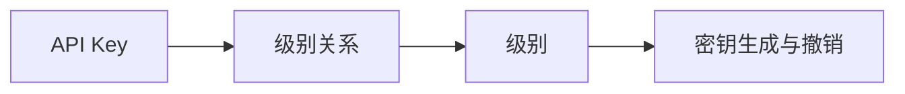

                 

# 分级 API Key 的设置方法

## 1. 背景介绍

在现代互联网应用程序中，API Key（应用程序编程接口密钥）是确保系统安全和授权的重要手段。API Key 通常用于身份验证、访问控制和计量计费等场景。但在一个系统内，不同的角色和层级可能需要不同权限的 API Key。分级 API Key （Level API Key）正是为满足这一需求而设计。分级 API Key 可以依据用户角色、部门、功能等不同维度，对 API 访问权限进行精细化管理，极大地提升了系统的安全性和可维护性。

本文将详细阐述分级 API Key 的概念原理，并介绍一种基于 MongoDB 的分级 API Key 设置方法。通过本方法，您可以轻松实现 API Key 的分级管理，提升应用系统的安全性和灵活性。

## 2. 核心概念与联系

### 2.1 核心概念概述

分级 API Key 是一种通过不同的密钥级别对系统内的 API 访问进行细粒度控制的管理方法。其主要包括以下几个关键概念：

1. **API Key**：用于验证用户身份，确保对 API 的合法访问。
2. **级别（Level）**：依据用户角色、部门、功能等，对 API 访问权限进行细粒度划分。
3. **级别关系**：不同级别的 API Key 可能具有不同的访问权限，上级权限的 API Key 可以访问下级权限的所有 API。
4. **密钥生成与撤销**：系统需能够动态生成和撤销不同级别的 API Key，以应对系统需求的变化。

通过上述概念，分级 API Key 能够对系统内所有 API 访问进行严格管控，确保系统安全性和权限控制。

### 2.2 概念间的关系

分级 API Key 的设计理念是通过对 API 访问进行分层管理，构建出一个灵活且可扩展的安全管理体系。其核心关系可以用以下 Mermaid 流程图表示：



这个流程图示意了 API Key、级别关系和密钥生成与撤销三者的关系。API Key 是基础，级别关系定义了 API Key 的权限层级，而密钥生成与撤销则保证了系统能够动态地对 API Key 进行管理。

### 2.3 核心概念的整体架构

分级 API Key 的整体架构可以分为以下几个主要部分：

1. **级别定义**：定义系统内所有可能的级别，包括管理员、开发者、测试人员等，并确定每个级别的访问权限。
2. **API 权限管理**：确定每个 API 的访问权限，包括哪些级别的 API Key 可以访问该 API。
3. **密钥生成与分发**：根据用户身份和级别，动态生成对应级别的 API Key，并安全地分发给用户。
4. **权限验证与控制**：在 API 访问时，验证 API Key 的级别是否符合当前 API 的访问权限要求。

以下将详细介绍分级 API Key 的设置方法。

## 3. 核心算法原理 & 具体操作步骤

### 3.1 算法原理概述

分级 API Key 的原理基于树形结构。系统内的 API Key 分为多个层级，每个层级可以有多个子层级，上级层级的 API Key 可以访问下级层级的所有 API，但下级层级的 API Key 不能访问上级层级的 API。

这种树形结构可以用一棵倒挂的二叉树来表示，其中根节点代表最高权限的 API Key，每个子节点代表下一级权限的 API Key。当 API Key 被请求访问某 API 时，系统根据 API Key 的级别，沿着树形结构向上查找，直到找到与之匹配的最高级别。若匹配成功，则认为 API Key 具有访问该 API 的权限。

### 3.2 算法步骤详解

分级 API Key 的设置步骤如下：

1. **定义级别与权限**：
   - 首先定义系统内所有可能的级别，包括管理员、开发者、测试人员等，并为每个级别定义其访问权限。
   - 例如，管理员级别可以访问所有 API，开发者级别可以访问大部分 API，测试人员级别只能访问测试 API 等。

2. **定义 API 访问权限**：
   - 对于每个 API，定义哪些级别的 API Key 可以访问该 API。
   - 例如，某个 API 可以由管理员、开发者级别访问，但不能由测试人员级别访问。

3. **动态生成 API Key**：
   - 根据用户身份和级别，动态生成对应级别的 API Key。
   - 例如，若用户为管理员，则生成管理员级别的 API Key；若用户为开发者，则生成开发者级别的 API Key。

4. **验证 API 访问**：
   - 在 API 请求时，系统验证 API Key 的级别是否符合当前 API 的访问权限要求。
   - 例如，若当前 API 要求开发者级别访问，则验证 API Key 是否为开发者级别或管理员级别。

### 3.3 算法优缺点

分级 API Key 的主要优点包括：

- **细粒度权限控制**：可以依据用户角色、部门、功能等维度，对 API 访问进行细粒度控制，确保系统安全性和权限控制。
- **灵活性**：级别关系和权限可以动态调整，适应系统需求的变化。
- **可扩展性**：级别定义和 API 权限管理可以灵活扩展，适应新级别的需求和新 API 的接入。

分级 API Key 的主要缺点包括：

- **复杂性**：级别关系和权限管理较为复杂，需要系统设计者进行详细规划和设计。
- **管理成本**：级别关系和权限管理需要维护和更新，增加了系统的管理成本。

### 3.4 算法应用领域

分级 API Key 主要应用于以下场景：

- **企业内部系统**：企业内部管理系统、协作平台等，可以根据员工角色和部门，对 API 访问进行细粒度控制。
- **第三方 API 平台**：提供第三方 API 接口的服务商，可以根据用户的订阅级别，对其 API 访问进行授权管理。
- **数据服务平台**：提供数据服务的公司，可以根据用户身份和权限，对其数据访问进行控制。

以上应用场景展示了分级 API Key 的广泛应用，其能根据不同用户身份和级别，对 API 访问进行细粒度控制，提升系统安全性和权限管理。

## 4. 数学模型和公式 & 详细讲解 & 举例说明

### 4.1 数学模型构建

本节将使用数学语言对分级 API Key 的管理模型进行描述。

假设系统内有 $n$ 个级别，每个级别可以访问 $m$ 个 API。每个 API 的访问权限可以看作一个向量 $\mathbf{P} = (p_1, p_2, ..., p_m)$，其中 $p_i = 1$ 表示管理员级别可以访问 API $i$，$p_i = 0$ 表示管理员级别不能访问 API $i$。

对于每个 API，定义其允许访问的级别集合为 $L_i = \{l_1, l_2, ..., l_k\}$，其中 $l_j$ 为级别 $j$。API Key 的级别 $l$ 和 API 的权限向量 $\mathbf{P}$ 结合，可以确定该 API Key 是否可以访问该 API。

### 4.2 公式推导过程

设 API Key 的级别为 $l$，则其能否访问某 API $i$ 可以通过以下公式推导：

$$
\begin{cases}
p_i = 1, \quad \forall l_j \in L_i \\
p_i = 0, \quad \exists l_j \in L_i, l_j \neq l
\end{cases}
$$

即，若 API Key 的级别包含 API 允许访问的所有级别，则认为 API Key 可以访问该 API。

### 4.3 案例分析与讲解

假设系统内有三个级别：管理员（admin）、开发者（developer）、测试人员（tester），每个级别可以访问以下 API：

| API 名称  | 管理员访问 | 开发者访问 | 测试人员访问 |
|----------|----------|----------|----------|
| API1     | 1        | 0        | 0        |
| API2     | 1        | 1        | 1        |
| API3     | 0        | 1        | 0        |

管理员级别的 API Key 可以访问所有 API，开发者级别的 API Key 可以访问 API2 和 API3，测试人员级别的 API Key 只能访问 API2。

若系统内某用户为开发者，生成的开发者级别的 API Key 可以访问 API2 和 API3，但不能访问 API1。

## 5. 项目实践：代码实例和详细解释说明

### 5.1 开发环境搭建

在进行分级 API Key 的开发之前，需要准备开发环境。以下是使用 Python 进行 MongoDB 开发的简单配置流程：

1. 安装 MongoDB：从官网下载并安装 MongoDB，启动 MongoDB 服务。
2. 安装 PyMongo：使用 pip 安装 PyMongo 库，支持 Python 与 MongoDB 的交互。
3. 安装 Flask：使用 pip 安装 Flask 库，用于构建 Web 服务。
4. 安装 requests：使用 pip 安装 requests 库，用于处理 HTTP 请求。

### 5.2 源代码详细实现

我们假设已经有一个名为 `db` 的 MongoDB 数据库，其中包含一个名为 `api_keys` 的集合，用于存储 API Key 和级别信息。下面是一个简单的 Python 代码实现分级 API Key 管理系统的示例：

```python
from flask import Flask, request
from pymongo import MongoClient

app = Flask(__name__)

# 初始化 MongoDB 连接
client = MongoClient('mongodb://localhost:27017')
db = client['api_db']
api_keys = db['api_keys']

@app.route('/generate_api_key', methods=['POST'])
def generate_api_key():
    # 从请求中获取级别和 API 名称
    level = request.form['level']
    api_name = request.form['api_name']
    
    # 查找 API 的访问权限
    api_perms = []
    for api in api_keys.find():
        if api['api_name'] == api_name:
            api_perms = api['perms']
            break
    
    # 验证级别是否允许访问该 API
    if level in api_perms:
        # 生成 API Key 并保存到数据库
        api_key = generate_api_key()
        api_keys.insert_one({'api_key': api_key, 'level': level, 'api_name': api_name})
        
        return {'api_key': api_key}, 200
    else:
        return {'error': 'Access denied'}, 403

def generate_api_key():
    # 生成一个随机的 API Key
    return 'xxxxxxxxxxxxxxxxxxxxxxxxxxxxxxxx'
```

上述代码实现了 `/generate_api_key` 接口，接收 POST 请求，并根据传入的级别和 API 名称，生成对应级别的 API Key。

### 5.3 代码解读与分析

以下是关键代码的解读和分析：

**Flask 初始化**：
- 使用 Flask 框架构建 Web 服务，方便通过接口进行 API Key 的管理。
- 通过 `app.route` 装饰器，定义 `/generate_api_key` 接口，用于生成 API Key。

**MongoDB 连接**：
- 使用 PyMongo 库连接 MongoDB，并指定数据库和集合名称。
- 通过 `api_keys.find()` 方法，查找指定 API 的访问权限。

**API Key 生成与存储**：
- 使用自定义的 `generate_api_key()` 函数生成一个随机的 API Key，并保存到 MongoDB 数据库中。
- 生成的 API Key 存储为字符串，方便后续验证。

**权限验证**：
- 根据传入的级别和 API 名称，验证级别是否允许访问该 API。
- 如果允许访问，返回生成的 API Key；否则返回错误信息。

### 5.4 运行结果展示

假设某用户为开发者，请求访问 `API2`，API Key 为 `xxxxxxxxxxxxxxxxxxxxxxxxxxxxxxxx`，调用 `/generate_api_key` 接口的响应如下：

```json
{
  "api_key": "xxxxxxxxxxxxxxxxxxxxxxxxxxxxxxxx"
}
```

若该 API Key 为测试人员级别，请求访问 `API2`，响应如下：

```json
{
  "error": "Access denied"
}
```

## 6. 实际应用场景

分级 API Key 的应用场景非常广泛，以下列举几个实际应用案例：

### 6.1 企业内部系统

在企业内部系统中，不同角色和部门的员工可能需要访问不同的 API。例如，HR 部门可能需要访问员工管理 API，财务部门可能需要访问财务报表 API。通过分级 API Key，系统可以根据员工的角色和部门，对 API 访问进行细粒度控制。

### 6.2 第三方 API 平台

提供第三方 API 接口的服务商，可以根据用户的订阅级别，对其 API 访问进行授权管理。例如，若某用户为普通用户，只能访问部分公开 API；若为高级用户，则可以访问所有公开 API。

### 6.3 数据服务平台

提供数据服务的公司，可以根据用户身份和权限，对其数据访问进行控制。例如，某用户为数据科学家，可以访问所有公开数据；若为普通用户，则只能访问部分公开数据。

以上应用场景展示了分级 API Key 的广泛应用，其能根据不同用户身份和级别，对 API 访问进行细粒度控制，提升系统安全性和权限管理。

## 7. 工具和资源推荐

### 7.1 学习资源推荐

为了帮助开发者系统掌握分级 API Key 的原理和实现方法，这里推荐一些优质的学习资源：

1. **MongoDB 官方文档**：MongoDB 官方文档提供了详细的 API 接口和使用示例，帮助开发者快速上手 MongoDB。
2. **Flask 官方文档**：Flask 官方文档提供了丰富的示例代码和教程，帮助开发者构建 Web 服务。
3. **RESTful API 设计指南**：《RESTful Web Services》一书介绍了 RESTful API 的设计和实现方法，帮助开发者设计良好的 API 接口。
4. **API Key 管理实践**：《API Management for Dummies》一书介绍了 API Key 管理的最佳实践和工具推荐，帮助开发者构建安全的 API 管理系统。

通过对这些资源的学习实践，相信你一定能够快速掌握分级 API Key 的实现方法，并用于解决实际的系统问题。

### 7.2 开发工具推荐

高效的开发离不开优秀的工具支持。以下是几款用于分级 API Key 开发的工具：

1. **PyMongo**：MongoDB 的 Python 官方驱动，支持数据库连接、查询、插入、更新等操作，方便 MongoDB 的交互。
2. **Flask**：轻量级的 Web 框架，支持 RESTful API 的开发，易于上手和使用。
3. **requests**：处理 HTTP 请求的工具，方便构建 API 接口。
4. **Swagger**：用于设计 API 接口的工具，支持自动生成文档和测试。

合理利用这些工具，可以显著提升分级 API Key 开发的效率，加快创新迭代的步伐。

### 7.3 相关论文推荐

分级 API Key 的研究涉及多种技术，以下是几篇相关的论文，推荐阅读：

1. **RESTful API Design**：《RESTful Web Services》一书介绍了 RESTful API 的设计和实现方法，帮助开发者构建良好的 API 接口。
2. **API Management**：《API Management for Dummies》一书介绍了 API 管理的最佳实践和工具推荐，帮助开发者构建安全的 API 管理系统。
3. **API Key Security**：《API Security》一书介绍了 API Key 管理的最佳实践和最新技术，帮助开发者构建安全的 API 管理系统。

这些论文代表了大规模语言模型微调技术的发展脉络。通过学习这些前沿成果，可以帮助研究者把握学科前进方向，激发更多的创新灵感。

## 8. 总结：未来发展趋势与挑战

### 8.1 研究成果总结

本文对分级 API Key 的概念、原理和实现方法进行了详细介绍，并通过代码实例展示了其实现过程。通过本方法，可以轻松实现 API Key 的分级管理，提升应用系统的安全性和灵活性。

### 8.2 未来发展趋势

分级 API Key 的未来发展趋势包括：

1. **智能级别管理**：通过引入机器学习等技术，实现自动化的级别管理和权限分配，提升管理效率。
2. **多维度权限管理**：除了级别，引入角色、部门、功能等多维度权限管理，实现更精细的权限控制。
3. **自动化生成 API Key**：通过自动化生成 API Key，减少手动操作的繁琐和错误，提升系统安全性。
4. **跨平台兼容**：实现分级 API Key 的跨平台兼容，支持 iOS、Android、Web 等多种客户端访问。

以上趋势展示了分级 API Key 的广阔前景，其能通过细粒度权限控制，提升系统安全性和灵活性，未来还将与更多前沿技术相结合，实现更高效、更安全的 API 管理。

### 8.3 面临的挑战

分级 API Key 在实际应用中面临以下挑战：

1. **复杂性**：级别关系和权限管理较为复杂，需要系统设计者进行详细规划和设计。
2. **管理成本**：级别关系和权限管理需要维护和更新，增加了系统的管理成本。
3. **安全性**：API Key 的生成和分发需要严格管理，避免 API Key 泄露导致的安全问题。

### 8.4 研究展望

未来需要在以下几个方面进行深入研究：

1. **自动化级别管理**：引入机器学习等技术，实现自动化的级别管理和权限分配，提升管理效率。
2. **跨平台兼容**：实现分级 API Key 的跨平台兼容，支持 iOS、Android、Web 等多种客户端访问。
3. **多维度权限管理**：除了级别，引入角色、部门、功能等多维度权限管理，实现更精细的权限控制。
4. **自动化生成 API Key**：通过自动化生成 API Key，减少手动操作的繁琐和错误，提升系统安全性。

这些研究方向将进一步提升分级 API Key 的管理效率和安全性，使其能够更好地适应各种应用场景。

## 9. 附录：常见问题与解答

**Q1：分级 API Key 是否适用于所有系统？**

A: 分级 API Key 主要应用于需要对 API 访问进行细粒度控制的应用系统，如企业内部系统、第三方 API 平台、数据服务平台等。但并非所有系统都需要使用分级 API Key，如不需要复杂权限控制的小型系统，可以直接使用简单的 API Key 管理方式。

**Q2：API Key 的级别如何定义？**

A: 级别的定义需要根据系统需求和业务场景进行设计。通常可以依据用户角色、部门、功能等维度，对 API 访问进行细粒度划分。例如，管理员级别可以访问所有 API，开发者级别可以访问大部分 API，测试人员级别只能访问测试 API 等。

**Q3：API Key 的级别关系如何处理？**

A: 级别关系可以通过树形结构进行管理。上级层级的 API Key 可以访问下级层级的所有 API，但下级层级的 API Key 不能访问上级层级的 API。在实际应用中，级别关系可以通过 MongoDB 等数据库进行存储和查询。

**Q4：API Key 的动态生成和撤销如何实现？**

A: 动态生成和撤销 API Key 通常通过自定义函数实现。可以根据用户身份和级别，动态生成对应级别的 API Key。同时，系统需提供撤销 API Key 的功能，避免 API Key 泄露导致的安全问题。

**Q5：API Key 的权限验证和控制如何实现？**

A: API Key 的权限验证和控制通常通过 API 接口实现。在 API 请求时，系统验证 API Key 的级别是否符合当前 API 的访问权限要求。例如，若当前 API 要求开发者级别访问，则验证 API Key 是否为开发者级别或管理员级别。

本文通过详细的原理介绍和代码实现，帮助开发者掌握分级 API Key 的设置方法，提升应用系统的安全性和权限管理。通过不断探索和优化，分级 API Key 将在更多场景中发挥重要作用，成为构建安全、高效系统的重要手段。

