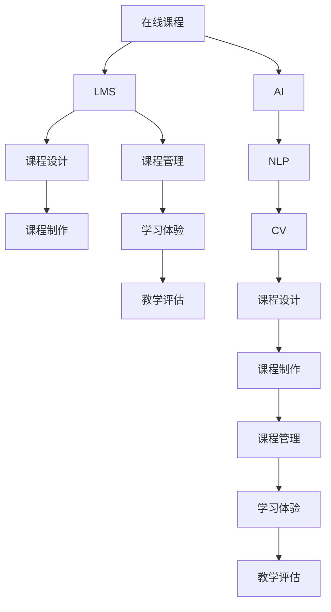
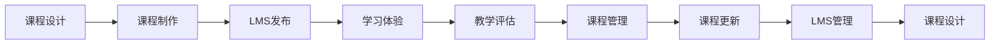
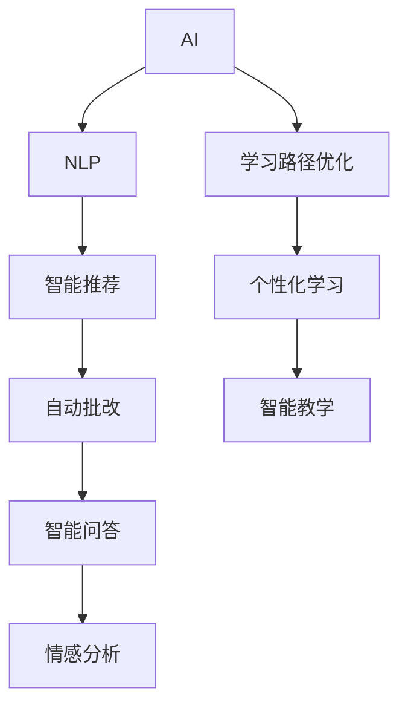
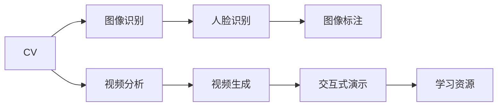

                 

# 利用技术能力创建在线课程

> 关键词：
在线课程,学习管理系统(LMS),教育技术,人工智能,自然语言处理(NLP),计算机视觉,课程设计,教学评估

## 1. 背景介绍

### 1.1 问题由来
随着互联网和信息技术的发展，教育领域也逐渐进入了数字化、智能化的新时代。在线课程作为一种新兴的教育模式，正在逐步替代传统的面对面教学，成为学习知识的重要渠道。在线课程打破了时间和空间的限制，让知识更易获取、共享，同时也为教育工作者提供了更多创新的教学手段。

然而，在线课程的制作、管理、评估等环节仍然面临诸多挑战。如何高效地创建高质量的在线课程，提升学生学习效果，成为教育工作者和IT技术人员共同关注的重要课题。技术在这一过程中扮演着关键角色，利用先进的技术手段可以提高课程制作效率，优化学习体验，实现精准教学评估，从而提升整体教育质量。

### 1.2 问题核心关键点
1. **课程设计**：如何设计符合学习目标、内容丰富、形式多样化的在线课程。
2. **课程制作**：如何利用技术手段简化课程制作过程，提高效率。
3. **课程管理**：如何利用技术手段实现课程的自动化管理，确保课程内容的更新和维护。
4. **学习体验**：如何利用技术提升学习体验，如互动性、个性化学习等。
5. **教学评估**：如何利用技术手段进行精准的、可量化的教学评估。
6. **学生支持**：如何利用技术手段提供及时有效的学生支持。

### 1.3 问题研究意义
在线课程的开发利用了先进的技术手段，如学习管理系统(LMS)、人工智能、自然语言处理(NLP)、计算机视觉等，为教育事业注入了新的活力。其研究意义在于：

1. **提升教育质量**：通过技术手段提升课程设计和制作效率，提供更好的学习体验和支持，进而提升教育质量。
2. **推动教育公平**：在线课程打破了地理和时间的限制，使更多人能够获得优质的教育资源。
3. **激发创新教学**：技术的融入激发了新的教学模式和理念，推动教育改革和创新。
4. **提高学生参与度**：技术手段能够提高学生的学习参与度和互动性，增强学习效果。
5. **实现个性化学习**：技术手段能够根据学生的学习习惯和能力，提供个性化的学习路径和资源。
6. **简化管理维护**：技术手段能够实现课程内容的自动化管理，降低管理维护成本，提升效率。

## 2. 核心概念与联系

### 2.1 核心概念概述

为更好地理解在线课程的开发过程和技术支撑，本节将介绍几个关键概念及其相互联系。

- **在线课程**：基于互联网平台提供的学习资源，包括视频、文本、互动练习等多种形式，旨在支持学生自主学习。
- **学习管理系统(LMS)**：在线课程的管理和运营平台，提供课程发布、学习跟踪、作业提交、互动讨论等功能。
- **人工智能(AI)**：利用机器学习、自然语言处理等技术，提供智能化的教学服务，如自动批改、智能推荐、情感分析等。
- **自然语言处理(NLP)**：处理、理解和生成人类语言的技术，可用于文本分析、自动生成、智能问答等。
- **计算机视觉(CV)**：通过图像识别、视频分析等技术，实现视觉信息的自动化处理，如人脸识别、图像标记等。
- **课程设计**：基于学习目标和内容，设计合理的课程结构、活动和评估方法。
- **课程制作**：将课程设计转化为具体的课程内容，包括视频录制、文本编写、互动设计等。
- **课程管理**：对课程内容进行更新、维护和管理，确保课程的有效性和时效性。
- **学习体验**：通过技术手段提升学习的互动性、个性化和趣味性，增强学生的学习动机。
- **教学评估**：利用数据和算法，对学生的学习效果进行量化评估，指导教学改进。

这些概念之间的关系可以通过以下Mermaid流程图来展示：



这个流程图展示了在线课程开发的整体流程及其所需技术支撑：

1. 在线课程基于LMS平台发布，并通过AI、NLP、CV等技术提供智能化服务。
2. 课程设计是课程开发的基础，课程制作将设计转化为具体内容。
3. 课程管理对内容进行更新和维护。
4. 学习体验和教学评估通过技术手段提升学习效果。

### 2.2 概念间的关系

这些核心概念之间存在着紧密的联系，形成了在线课程开发的技术框架。下面我们通过几个Mermaid流程图来展示这些概念之间的关系。

#### 2.2.1 在线课程的整体流程



这个流程图展示了在线课程开发的基本流程：

1. 课程设计确定学习目标和内容。
2. 课程制作将设计转化为具体的课程内容。
3. LMS发布平台发布课程。
4. 学习体验提升学习效果。
5. 教学评估量化学习效果。
6. 课程管理更新课程内容。

#### 2.2.2 AI和NLP的应用



这个流程图展示了AI和NLP技术在线课程中的应用：

1. NLP技术提供文本分析、自动生成等功能。
2. AI技术实现智能推荐、自动批改、智能问答、情感分析等应用。
3. AI和NLP技术协同提升个性化学习和智能教学。

#### 2.2.3 CV在课程中的应用



这个流程图展示了计算机视觉技术在线课程中的应用：

1. CV技术实现图像识别、人脸识别、图像标注等。
2. 视频分析用于生成学习资源，交互式演示增强学习效果。

### 2.3 核心概念的整体架构

最后，我们用一个综合的流程图来展示这些核心概念在线课程开发中的整体架构：

```mermaid
graph TB
    A[课程设计] --> B[课程制作]
    B --> C[LMS发布]
    C --> D[学习体验]
    D --> E[教学评估]
    E --> F[课程管理]
    F --> G[课程更新]
    G --> H[LMS管理]
    H --> I[课程设计]
    I --> J[课程制作]
    J --> K[课程管理]
    K --> L[学习体验]
    L --> M[教学评估]
    M --> N[课程更新]
    N --> O[LMS管理]
    O --> P[课程设计]
    P --> Q[课程制作]
    Q --> R[LMS发布]
    R --> S[学习体验]
    S --> T[教学评估]
    T --> U[课程管理]
    U --> V[课程更新]
    V --> W[LMS管理]
    W --> X[课程设计]
    X --> Y[课程制作]
    Y --> Z[LMS发布]
    Z --> $[学习体验]
    $ --> %[教学评估]
    % --> &[课程管理]
    & --> '[LMS管理]
    ' --> ( [课程设计]
```

这个综合流程图展示了在线课程开发中各个环节的技术联系：

1. 课程设计是整个开发的基础。
2. 课程制作将设计转化为具体的课程内容。
3. LMS发布平台提供课程发布和管理的支撑。
4. 学习体验通过技术手段提升学习效果。
5. 教学评估量化学习效果，指导课程改进。
6. 课程管理确保课程内容的时效性。
7. AI、NLP、CV等技术提供智能化服务，提升学习体验和评估精度。

通过这些流程图，我们可以更清晰地理解在线课程开发过程中各个核心概念的关系和作用，为后续深入讨论具体的技术实现奠定基础。

## 3. 核心算法原理 & 具体操作步骤
### 3.1 算法原理概述

在线课程的开发利用了多个前沿技术，包括AI、NLP、CV等，涉及复杂的算法和模型。本节将详细介绍这些核心算法原理。

**3.1.1 自然语言处理(NLP)算法原理**

自然语言处理(NLP)是用于处理、分析和理解人类语言的技术。在线课程中的NLP应用主要包括以下几个方面：

1. **文本分析**：利用NLP技术对课程文本进行情感分析、主题分析等，帮助教师了解学生反馈和课程效果。
2. **自动生成**：利用NLP技术自动生成课程内容，如自动编写课程简介、生成练习题等。
3. **智能问答**：利用NLP技术构建智能问答系统，解答学生的疑问。

NLP算法通常基于语言模型和序列建模，使用深度学习技术，如循环神经网络(RNN)、长短时记忆网络(LSTM)、Transformer等。以Transformer为例，其基本原理是通过自注意力机制处理序列数据，实现高效的文本表示和分类。

**3.1.2 计算机视觉(CV)算法原理**

计算机视觉(CV)技术主要用于处理图像和视频数据，在线课程中的CV应用主要包括以下几个方面：

1. **图像识别**：通过CV技术自动识别课程中包含的图像和标签，提供图像注释。
2. **视频分析**：利用CV技术分析视频内容，如面部表情识别、姿态识别等，提供视频注释。
3. **交互式演示**：利用CV技术实现交互式演示，如手势识别、物体跟踪等，增强学习体验。

CV算法通常基于卷积神经网络(CNN)、深度神经网络(DNN)等，使用特征提取和分类技术，实现对图像和视频的理解和分析。

**3.1.3 人工智能(AI)算法原理**

人工智能(AI)技术在线课程中的应用主要包括以下几个方面：

1. **智能推荐**：利用AI技术根据学生的学习行为和偏好，推荐合适的学习资源。
2. **自动批改**：利用AI技术自动批改学生的作业和测试，提供反馈和建议。
3. **情感分析**：利用AI技术分析学生的情感状态，提供个性化的学习建议。

AI算法通常基于机器学习技术，如决策树、随机森林、深度学习等，使用特征工程和模型训练，实现对数据的分析和预测。

### 3.2 算法步骤详解

在线课程开发利用了多种前沿技术，涉及复杂的算法和模型。以下将详细讲解在线课程开发中的关键算法步骤：

**3.2.1 课程设计算法步骤**

1. **需求分析**：确定课程的学习目标、内容、形式等。
2. **内容规划**：根据需求分析，规划课程的具体内容，包括视频、文本、练习题等。
3. **设计活动**：设计课程中的互动活动，如讨论、作业、测验等，增强学习效果。
4. **评估设计**：设计课程评估方式，确保教学目标的实现。

**3.2.2 课程制作算法步骤**

1. **视频录制**：录制课程视频，确保画面清晰、声音清晰。
2. **文本编写**：编写课程文本，包括课程简介、讲义、练习题等。
3. **互动设计**：设计互动元素，如问答、测验、讨论等，增强学习体验。
4. **资源整合**：整合各种学习资源，如视频、文本、PPT等，构建完整的课程体系。

**3.2.3 课程管理算法步骤**

1. **内容上传**：将课程内容上传到LMS平台，确保内容的时效性。
2. **活动管理**：管理课程中的互动活动，确保活动的正常进行。
3. **数据收集**：收集学生的学习数据，如观看时长、答题情况等。
4. **数据分析**：分析学生的学习数据，了解学生的学习效果和行为。

**3.2.4 学习体验算法步骤**

1. **个性化推荐**：根据学生的学习数据，利用AI技术推荐合适的学习资源。
2. **智能互动**：利用AI技术实现智能问答、情感分析等，增强学习体验。
3. **实时反馈**：提供实时的学习反馈，如自动批改、智能推荐等。

**3.2.5 教学评估算法步骤**

1. **数据收集**：收集学生的学习数据，如观看时长、答题情况等。
2. **数据分析**：分析学生的学习数据，量化学习效果。
3. **反馈优化**：根据评估结果，提供个性化的学习建议，优化教学效果。

### 3.3 算法优缺点

在线课程开发利用了先进的技术手段，以下将详细讲解这些算法的优缺点。

**3.3.1 NLP算法的优缺点**

- **优点**：
  - 能够处理大规模文本数据，提供丰富的语义分析。
  - 能够自动生成课程内容，提高制作效率。
  - 能够实现智能问答，提升学习体验。
  
- **缺点**：
  - 依赖高质量的标注数据，标注成本较高。
  - 对语言的复杂性处理能力有限，可能存在误解或错误。
  - 对领域专业性要求高，需要领域专家的指导。

**3.3.2 CV算法的优缺点**

- **优点**：
  - 能够处理图像和视频数据，提供丰富的视觉分析。
  - 能够实现交互式演示，增强学习体验。
  - 能够提供实时的情感分析，优化学习效果。
  
- **缺点**：
  - 对硬件要求较高，需要高性能的计算设备和存储设备。
  - 对数据质量要求高，需要高质量的标注数据。
  - 对算法的复杂度要求高，需要大量的模型训练和优化。

**3.3.3 AI算法的优缺点**

- **优点**：
  - 能够实现个性化推荐，提高学习效果。
  - 能够提供实时的学习反馈，提升学习体验。
  - 能够实现情感分析，提供个性化的学习建议。
  
- **缺点**：
  - 对数据质量和多样性要求高，需要大量的数据支持。
  - 对算法的复杂度要求高，需要大量的模型训练和优化。
  - 对算法的公平性和可解释性要求高，需要透明和可解释的模型。

### 3.4 算法应用领域

在线课程开发利用了多种前沿技术，以下是这些算法在实际应用中的具体应用领域：

- **教育行业**：在线课程在教育行业中的应用最为广泛，涵盖小学、中学、大学等各个阶段。
- **职业培训**：在线课程在职业培训中的应用越来越普遍，如编程、设计、管理等。
- **企业培训**：在线课程在企业培训中的应用也越来越广泛，如技能培训、技术培训等。
- **继续教育**：在线课程在继续教育中的应用也越来越普遍，如公务员培训、职称考试培训等。
- **在线教育平台**：在线课程在各大在线教育平台上的应用广泛，如Coursera、edX、Udacity等。
- **政府教育**：在线课程在政府教育中的应用也越来越普遍，如公职人员培训、继续教育等。

这些应用领域展示了在线课程开发的广泛性和重要性，技术的支撑使得在线课程成为学习的重要渠道。

## 4. 数学模型和公式 & 详细讲解 & 举例说明

### 4.1 数学模型构建

在线课程开发利用了多种前沿技术，涉及复杂的算法和模型。以下将详细讲解这些核心数学模型。

**4.1.1 自然语言处理(NLP)数学模型**

NLP算法通常基于语言模型和序列建模，使用深度学习技术，如循环神经网络(RNN)、长短时记忆网络(LSTM)、Transformer等。以Transformer为例，其基本模型可以表示为：

$$
y = \text{softmax}(W_a \text{softmax}(W_b x + b_b) + b_a)
$$

其中，$x$为输入序列，$W_a$和$W_b$为模型参数，$b_a$和$b_b$为偏置项，$\text{softmax}$为激活函数。

**4.1.2 计算机视觉(CV)数学模型**

CV算法通常基于卷积神经网络(CNN)、深度神经网络(DNN)等，使用特征提取和分类技术，实现对图像和视频的理解和分析。以卷积神经网络为例，其基本模型可以表示为：

$$
y = \text{softmax}(W_h \text{softmax}(W_f x + b_f) + b_h)
$$

其中，$x$为输入图像，$W_f$和$W_h$为模型参数，$b_f$和$b_h$为偏置项，$\text{softmax}$为激活函数。

**4.1.3 人工智能(AI)数学模型**

AI算法通常基于机器学习技术，如决策树、随机森林、深度学习等，使用特征工程和模型训练，实现对数据的分析和预测。以深度学习为例，其基本模型可以表示为：

$$
y = \text{softmax}(W_a \text{softmax}(W_b x + b_b) + b_a)
$$

其中，$x$为输入数据，$W_a$和$W_b$为模型参数，$b_a$和$b_b$为偏置项，$\text{softmax}$为激活函数。

### 4.2 公式推导过程

以下将详细讲解在线课程开发中涉及的核心公式推导过程。

**4.2.1 自然语言处理(NLP)公式推导**

以Transformer模型为例，其核心公式可以表示为：

$$
y_i = \text{softmax}\left(\frac{\text{exp}(\text{scores}_{i,j})}{\sum_{k=1}^K \text{exp}(\text{scores}_{i,k})}\right)_{j=1}^K
$$

其中，$scores_{i,j}$为注意力机制的计算结果，$y_i$为输出序列。

**4.2.2 计算机视觉(CV)公式推导**

以卷积神经网络为例，其核心公式可以表示为：

$$
y_i = \text{softmax}\left(\frac{\text{exp}(\text{scores}_{i,j})}{\sum_{k=1}^K \text{exp}(\text{scores}_{i,k})}\right)_{j=1}^K
$$

其中，$scores_{i,j}$为卷积操作和激活函数的计算结果，$y_i$为输出序列。

**4.2.3 人工智能(AI)公式推导**

以深度学习为例，其核心公式可以表示为：

$$
y_i = \text{softmax}\left(\frac{\text{exp}(\text{scores}_{i,j})}{\sum_{k=1}^K \text{exp}(\text{scores}_{i,k})}\right)_{j=1}^K
$$

其中，$scores_{i,j}$为深度学习模型的计算结果，$y_i$为输出序列。

### 4.3 案例分析与讲解

**4.3.1 自然语言处理(NLP)案例分析**

以情感分析为例，NLP模型可以使用以下步骤进行训练和推理：

1. **数据准备**：收集标注好的情感数据，将文本数据转化为向量表示。
2. **模型训练**：使用深度学习模型对情感数据进行训练，调整模型参数，使其能够准确预测情感标签。
3. **模型推理**：将新的文本数据转化为向量表示，使用训练好的模型进行情感分析，输出情感标签。

**4.3.2 计算机视觉(CV)案例分析**

以图像识别为例，CV模型可以使用以下步骤进行训练和推理：

1. **数据准备**：收集标注好的图像数据，将图像数据转化为向量表示。
2. **模型训练**：使用卷积神经网络对图像数据进行训练，调整模型参数，使其能够准确识别图像类别。
3. **模型推理**：将新的图像数据转化为向量表示，使用训练好的模型进行图像识别，输出图像类别。

**4.3.3 人工智能(AI)案例分析**

以智能推荐为例，AI模型可以使用以下步骤进行训练和推理：

1. **数据准备**：收集用户的学习行为数据，如观看时长、答题情况等，转化为向量表示。
2. **模型训练**：使用深度学习模型对学习行为数据进行训练，调整模型参数，使其能够准确预测用户感兴趣的学习资源。
3. **模型推理**：根据用户的学习行为数据，使用训练好的模型进行智能推荐，输出推荐的学习资源。

## 5. 项目实践：代码实例和详细解释说明

### 5.1 开发环境搭建

在进行在线课程开发前，我们需要准备好开发环境。以下是使用Python进行PyTorch开发的环境配置流程：

1. 安装Anaconda：从官网下载并安装Anaconda，用于创建独立的Python环境。

2. 创建并激活虚拟环境：
```bash
conda create -n pytorch-env python=3.8 
conda activate pytorch-env
```

3. 安装PyTorch：根据CUDA版本，从官网获取对应的安装命令。例如：
```bash
conda install pytorch torchvision torchaudio cudatoolkit=11.1 -c pytorch -c conda-forge
```

4. 安装Transformers库：
```bash
pip install transformers
```

5. 安装各类工具包：
```bash
pip install numpy pandas scikit-learn matplotlib tqdm jupyter notebook ipython
```

完成上述步骤后，即可在`pytorch-env`环境中开始在线课程开发。

### 5.2 源代码详细实现

这里我们以自然语言处理(NLP)的情感分析任务为例，给出使用Transformers库进行情感分析的PyTorch代码实现。

首先，定义情感分析模型的数据处理函数：

```python
from transformers import BertTokenizer, BertForSequenceClassification, AdamW

tokenizer = BertTokenizer.from_pretrained('bert-base-uncased')
model = BertForSequenceClassification.from_pretrained('bert-base-uncased', num_labels=2)

def preprocess(text):
    return tokenizer.encode(text, add_special_tokens=True, max_length=256)

def predict(text):
    input_ids = preprocess(text)
    input_ids = torch.tensor(input_ids, dtype=torch.long).unsqueeze(0)
    attention_mask = torch.ones_like(input_ids).unsqueeze(0)
    outputs = model(input_ids, attention_mask=attention_mask)
    logits = outputs.logits
    prob = torch.softmax(logits, dim=1)
    label = torch.argmax(prob, dim=1)
    return label.item()

# 测试
text = '这是一门非常有趣且有用的课程。'
label = predict(text)
print(label)
```

然后，定义情感分析模型的训练函数：

```python
from torch.utils.data import DataLoader, RandomSampler, SequentialSampler
from torch.optim import AdamW
from sklearn.metrics import accuracy_score, precision_recall_fscore_support

device = torch.device('cuda' if torch.cuda.is_available() else 'cpu')

def train(data_loader, model, optimizer, criterion):
    model.train()
    total_loss = 0
    total_correct = 0
    for batch in data_loader:
        inputs, labels = batch
        inputs = inputs.to(device)
        labels = labels.to(device)
        optimizer.zero_grad()
        outputs = model(inputs, attention_mask=inputs)
        loss = criterion(outputs, labels)
        loss.backward()
        optimizer.step()
        total_loss += loss.item()
        total_correct += accuracy_score(labels, outputs.argmax(dim=1))
    return total_loss / len(data_loader), total_correct / len(data_loader)

# 数据集准备
train_dataset = Dataset(...)
dev_dataset = Dataset(...)
test_dataset = Dataset(...)

# 定义训练参数
batch_size = 32
learning_rate = 5e-5
epochs = 3
training_steps = len(train_dataset) * epochs
logging_steps = 1000
max_steps = training_steps

# 模型初始化
model = BertForSequenceClassification.from_pretrained('bert-base-uncased', num_labels=2)
optimizer = AdamW(model.parameters(), lr=learning_rate)
criterion = torch.nn.CrossEntropyLoss()

# 定义数据加载器
train_loader = DataLoader(train_dataset, batch_size=batch_size, shuffle=True)
dev_loader = DataLoader(dev_dataset, batch_size=batch_size, shuffle=False)
test_loader = DataLoader(test_dataset, batch_size=batch_size, shuffle=False)

# 训练模型
model.to(device)
total_train_loss = 0
total_train_acc = 0
for epoch in range(epochs):
    train_loss, train_acc = train(train_loader, model, optimizer, criterion)
    print('Epoch {}/{} Training Loss: {:.4f} Training Acc: {:.4f}'.format(epoch+1, epochs, train_loss, train_acc))
    total_train_loss += train_loss * len(train_loader)
    total_train_acc += train_acc * len(train_loader)

# 模型评估
total_dev_loss, total_dev_acc = 0, 0
for batch in dev_loader:
    inputs, labels = batch
    inputs = inputs.to(device)
    labels = labels.to(device)
    outputs = model(inputs, attention_mask=inputs)
    loss = criterion(outputs, labels)
    

