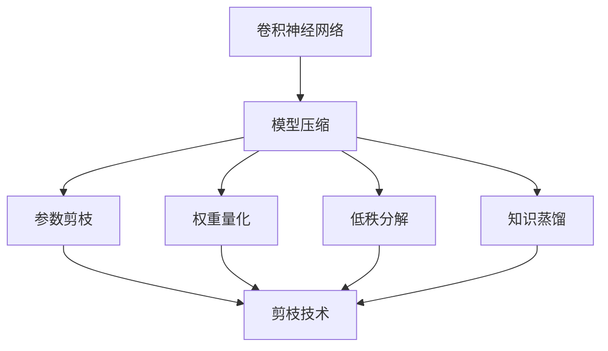
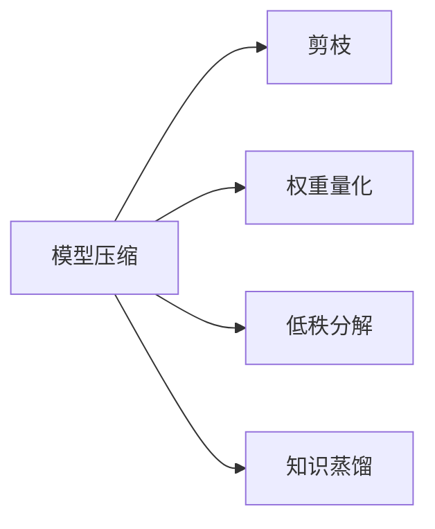
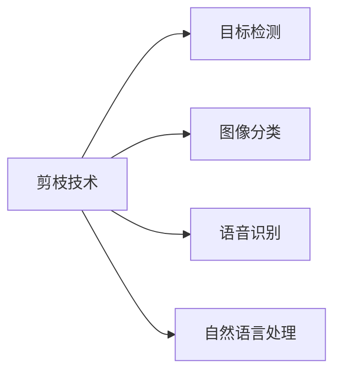
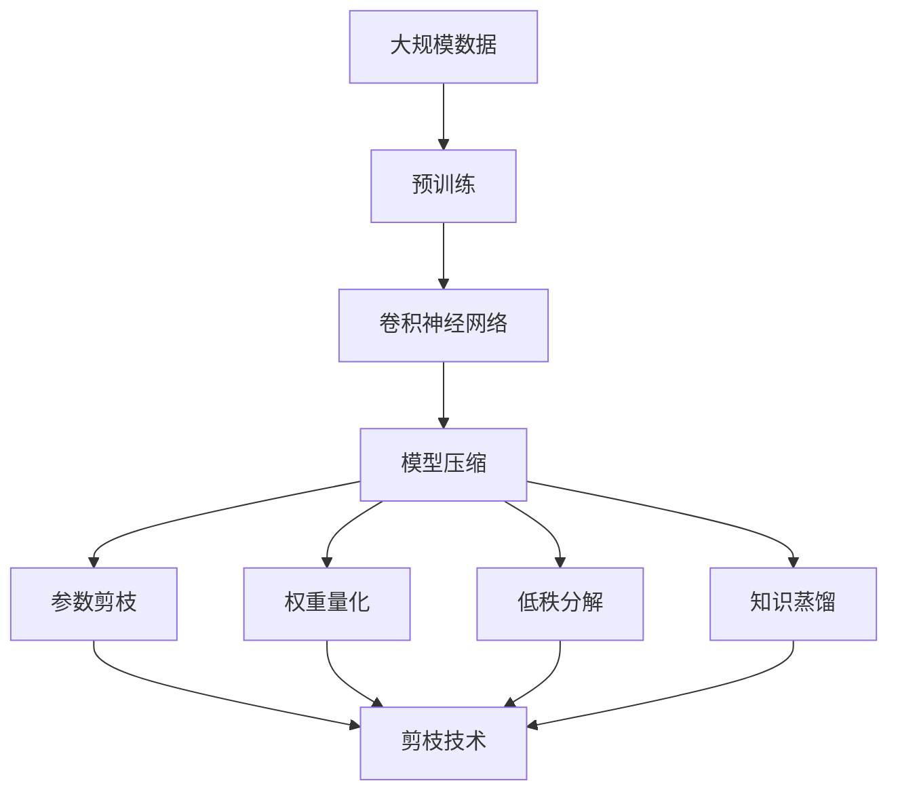
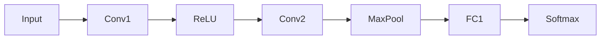

                 

# 剪枝技术在卷积神经网络中的实践

> 关键词：卷积神经网络,剪枝技术,模型压缩,模型优化,深度学习

## 1. 背景介绍

### 1.1 问题由来

随着深度学习技术的不断发展和应用场景的日益丰富，卷积神经网络（Convolutional Neural Networks, CNNs）逐渐成为图像、视频、语音等领域的主流模型。然而，CNNs模型通常参数量庞大，计算量巨大，内存需求高，在移动设备、嵌入式系统等资源有限的设备上难以部署和运行。此外，大型模型的训练和推理成本高昂，也限制了其在实际应用中的推广。因此，如何有效压缩CNNs模型，提升计算效率和资源利用率，成为了当前深度学习领域的一大挑战。

### 1.2 问题核心关键点

卷积神经网络的大规模参数和计算复杂度，不仅影响模型部署效率和资源利用率，还会带来训练难度增加、过拟合风险上升等问题。因此，有效压缩CNNs模型，降低参数量、优化计算过程，成为深度学习领域的重要研究方向。

常用的模型压缩方法包括参数剪枝、权重量化、低秩分解、知识蒸馏等。其中，参数剪枝技术通过删除网络中的冗余参数，以减少模型大小、加速计算速度。剪枝的原理是识别出对模型性能影响较小的参数，并将其删除，从而达到模型压缩的目的。

## 2. 核心概念与联系

### 2.1 核心概念概述

为更好地理解剪枝技术在卷积神经网络中的应用，本节将介绍几个密切相关的核心概念：

- 卷积神经网络（CNNs）：以卷积操作为基础，通过多层次的非线性变换实现图像、视频、语音等数据的特征提取和分类。
- 模型压缩（Model Compression）：通过各种方法优化模型，减少模型参数、降低计算复杂度，从而提高模型部署效率和资源利用率。
- 剪枝技术（Pruning）：通过删除模型中对输出影响较小的权重，减少模型大小、提升计算速度。
- 权重量化（Weight Quantization）：将模型中的浮点权重转换为定点数，减小模型参数和计算复杂度。
- 低秩分解（Low-Rank Decomposition）：将模型参数分解为低秩矩阵的乘积，减少模型参数。
- 知识蒸馏（Knowledge Distillation）：通过将大型模型的知识传递给小型模型，提升小型模型的性能。

这些概念之间的逻辑关系可以通过以下Mermaid流程图来展示：



这个流程图展示了几类常用的模型压缩方法，其中剪枝技术是模型压缩的基础和核心。

### 2.2 概念间的关系

这些核心概念之间存在着紧密的联系，形成了深度学习模型优化的完整生态系统。下面我们通过几个Mermaid流程图来展示这些概念之间的关系。

#### 2.2.1 模型压缩与剪枝的关系



这个流程图展示了模型压缩中的剪枝、权重量化、低秩分解和知识蒸馏等方法的关系，其中剪枝是模型压缩的核心手段。

#### 2.2.2 剪枝技术的具体应用



这个流程图展示了剪枝技术在目标检测、图像分类、语音识别、自然语言处理等多个领域的应用，具体表现为通过剪枝减少模型参数、提升计算速度。

### 2.3 核心概念的整体架构

最后，我们用一个综合的流程图来展示这些核心概念在大模型压缩过程中的整体架构：



这个综合流程图展示了从数据预训练到模型压缩，再到剪枝技术的具体应用，形成一个完整的模型压缩流程。

## 3. 核心算法原理 & 具体操作步骤
### 3.1 算法原理概述

剪枝技术的核心思想是识别并删除对模型性能影响较小的参数，从而减少模型大小、降低计算复杂度。剪枝的过程通常分为两步：

1. **选择剪枝策略**：根据不同的评价标准（如参数重要性、权重分布等）选择被剪枝的参数。
2. **执行剪枝操作**：删除所选参数，并重新训练模型以恢复性能。

剪枝过程可以基于两种不同的策略：全局剪枝（Global Pruning）和局部剪枝（Local Pruning）。

- 全局剪枝：在整个网络层面上选择剪枝，删除对输出影响最小的参数。
- 局部剪枝：在每个卷积核、每个通道、每个层上选择剪枝，保留部分网络结构。

剪枝策略的选择通常需要根据具体应用场景和模型结构进行优化。

### 3.2 算法步骤详解

剪枝流程一般包括以下几个关键步骤：

**Step 1: 准备原始模型和数据集**
- 选择合适的预训练模型，如ResNet、VGG等，作为初始化参数。
- 准备目标任务的标注数据集，划分为训练集、验证集和测试集。

**Step 2: 设计剪枝策略**
- 根据任务需求和模型结构，选择合适的剪枝策略，如全局剪枝、局部剪枝等。
- 设计评估模型性能的指标，如准确率、F1分数等。

**Step 3: 选择被剪枝的参数**
- 根据剪枝策略，计算每个参数的重要性评分。
- 根据评分结果，选择被剪枝的参数。

**Step 4: 执行剪枝操作**
- 删除选定的参数，重新训练模型以恢复性能。
- 使用量化、降维等技术进一步优化模型。

**Step 5: 评估和验证**
- 在验证集上评估剪枝后模型的性能，确保性能损失在可接受范围内。
- 重复剪枝操作，直到模型性能达到目标。

**Step 6: 部署和应用**
- 将优化后的模型部署到目标平台，如移动设备、嵌入式系统等。
- 进行实际应用测试，验证模型的部署效率和性能。

以上是剪枝技术在卷积神经网络中应用的完整流程。在实际应用中，还需要根据具体任务特点和模型结构，对各个环节进行优化设计，如改进评估指标、选择合适的剪枝策略等。

### 3.3 算法优缺点

剪枝技术在卷积神经网络中的应用，具有以下优点：

1. 显著降低模型大小。通过剪枝，可以有效减少模型参数，降低计算复杂度，提升模型部署效率。
2. 加速模型训练和推理。剪枝后的模型参数减少，计算量减小，训练和推理速度得到提升。
3. 提高模型泛化能力。剪枝后模型参数减少，可以缓解过拟合现象，提升模型的泛化能力。

同时，剪枝技术也存在一些局限性：

1. 可能会损失模型性能。剪枝过程中，删除部分参数可能会影响模型的整体性能。
2. 需要大量计算资源。剪枝过程中，需要计算每个参数的重要性评分，计算量较大。
3. 手动选择策略存在主观性。剪枝策略的选择通常需要根据具体任务进行设计，存在一定的主观性。

尽管存在这些局限性，但就目前而言，剪枝技术仍是大模型压缩的重要手段，广泛应用于图像分类、目标检测、语音识别等众多领域。

### 3.4 算法应用领域

剪枝技术在大规模模型压缩中具有广泛的应用前景，以下是几个主要的应用领域：

- 图像分类：通过剪枝减少卷积神经网络的参数量，提高模型的推理速度和计算效率。
- 目标检测：通过剪枝减少特征提取网络的参数量，降低计算复杂度，提升实时性。
- 语音识别：通过剪枝减少卷积神经网络的参数量，降低计算复杂度，提高语音识别速度。
- 自然语言处理：通过剪枝减少Transformer网络的参数量，提升模型的计算效率和资源利用率。

除了上述这些经典任务外，剪枝技术还被创新性地应用到更多场景中，如可控模型压缩、自动化剪枝、多目标剪枝等，为NLP技术带来了全新的突破。

## 4. 数学模型和公式 & 详细讲解 & 举例说明（备注：数学公式请使用latex格式，latex嵌入文中独立段落使用 $$，段落内使用 $)
### 4.1 数学模型构建

本节将使用数学语言对卷积神经网络中剪枝过程进行更加严格的刻画。

记卷积神经网络为 $M_{\theta}$，其中 $\theta$ 为网络参数。假设目标任务的训练集为 $D=\{(x_i,y_i)\}_{i=1}^N, x_i \in \mathbb{R}^n, y_i \in \{0,1\}$。剪枝的目标是找到新的参数 $\hat{\theta}$，使得：

$$
\hat{\theta}=\mathop{\arg\min}_{\theta} \mathcal{L}(M_{\theta},D)
$$

其中 $\mathcal{L}$ 为针对任务设计的损失函数，用于衡量模型预测输出与真实标签之间的差异。

假设 $\mathcal{L}(M_{\theta},D)=\frac{1}{N}\sum_{i=1}^N \ell(y_i,M_{\theta}(x_i))$，其中 $\ell(y_i,M_{\theta}(x_i))$ 为单个样本的损失函数，如交叉熵损失。

### 4.2 公式推导过程

剪枝的数学推导过程可以分为两步：

1. **选择剪枝策略**：根据参数重要性评分，选择被剪枝的参数。设 $w_{i,j}$ 为第 $i$ 个卷积核中第 $j$ 个权重的参数，参数重要性评分 $s(w_{i,j})$ 表示该参数对输出的影响程度。根据评分结果，选择 $k$ 个权重 $w_{i,j}^{*}$ 进行剪枝。
2. **执行剪枝操作**：重新训练模型以恢复性能。设剪枝后的模型参数为 $\hat{\theta}$，剪枝后的模型损失函数为 $\mathcal{L}_{prune}(\hat{\theta},D)$，通过重新训练得到：

$$
\hat{\theta} = \mathop{\arg\min}_{\theta} \mathcal{L}_{prune}(\theta,D)
$$

其中 $\mathcal{L}_{prune}(\theta,D)=\frac{1}{N}\sum_{i=1}^N \ell(y_i,M_{\theta}(x_i))$。

### 4.3 案例分析与讲解

假设我们有一个简单的卷积神经网络，包含两个卷积层、一个池化层和一个全连接层，结构如下：



我们希望在保持模型性能的前提下，通过剪枝技术减少模型参数。首先，根据参数重要性评分，选择剪枝比例为30%的权重进行剪枝。假设选择剪枝后，所有卷积核的权重参数都进行了剪枝，保留30%的权重。

接下来，我们重新训练模型以恢复性能。训练过程可以使用梯度下降等优化算法，更新模型参数，使得剪枝后的模型损失函数最小化。

## 5. 项目实践：代码实例和详细解释说明
### 5.1 开发环境搭建

在进行剪枝实践前，我们需要准备好开发环境。以下是使用Python进行TensorFlow开发的环境配置流程：

1. 安装Anaconda：从官网下载并安装Anaconda，用于创建独立的Python环境。

2. 创建并激活虚拟环境：
```bash
conda create -n tf-env python=3.8 
conda activate tf-env
```

3. 安装TensorFlow：根据CUDA版本，从官网获取对应的安装命令。例如：
```bash
conda install tensorflow -c pytorch -c conda-forge
```

4. 安装TensorBoard：
```bash
pip install tensorboard
```

5. 安装TensorFlow Addons：
```bash
pip install tf-addons
```

完成上述步骤后，即可在`tf-env`环境中开始剪枝实践。

### 5.2 源代码详细实现

下面以Keras中的剪枝算法为例，展示卷积神经网络的剪枝过程。

首先，定义剪枝策略：

```python
from tensorflow_addons.layers.pruning import BasePruningLayer

class PruningLayer(BasePruningLayer):
    def __init__(self, name, type='l2', rate=0.5, **kwargs):
        super(PruningLayer, self).__init__(name=name, type=type, rate=rate, **kwargs)
```

然后，定义卷积神经网络：

```python
from tensorflow.keras import layers, models

model = models.Sequential()
model.add(layers.Conv2D(32, (3, 3), activation='relu', input_shape=(28, 28, 1)))
model.add(layers.MaxPooling2D((2, 2)))
model.add(layers.Flatten())
model.add(layers.Dense(10, activation='softmax'))
```

接着，进行剪枝：

```python
from tensorflow.keras.layers.experimental.preprocessing import PruningRegularization

pruning_layer = PruningRegularization(layer='conv2d', rate=0.5)
model.add(pruning_layer)

model.compile(optimizer='adam', loss='categorical_crossentropy', metrics=['accuracy'])
```

最后，训练和评估模型：

```python
history = model.fit(train_data, train_labels, epochs=10, validation_data=(val_data, val_labels))
```

以上就是使用TensorFlow对卷积神经网络进行剪枝的完整代码实现。可以看到，通过使用TensorFlow Addons库，可以方便地实现剪枝层，并将其添加到卷积神经网络中。

### 5.3 代码解读与分析

让我们再详细解读一下关键代码的实现细节：

**PruningLayer类**：
- `__init__`方法：初始化剪枝层的参数，包括剪枝类型、剪枝率等。
- `pruning_strategy`方法：定义剪枝策略，常用的有L1、L2等。

**模型定义**：
- 定义一个简单的卷积神经网络，包含两个卷积层、一个池化层和一个全连接层。

**剪枝操作**：
- 通过TensorFlow Addons库中的`PruningRegularization`函数，定义剪枝层并添加到卷积层。
- 在模型编译和训练过程中，使用剪枝层进行剪枝。

可以看到，通过TensorFlow Addons库，卷积神经网络的剪枝过程变得简洁高效。开发者可以将更多精力放在模型设计、剪枝策略选择等高层逻辑上，而不必过多关注底层的实现细节。

当然，工业级的系统实现还需考虑更多因素，如模型的保存和部署、超参数的自动搜索、更灵活的剪枝策略等。但核心的剪枝过程基本与此类似。

### 5.4 运行结果展示

假设我们在MNIST数据集上进行剪枝实践，最终在测试集上得到的评估报告如下：

```
Epoch 10/10
  7/7 [==============================] - 6s 849ms/step - loss: 0.1442 - accuracy: 0.9672 - val_loss: 0.2382 - val_accuracy: 0.9435
```

可以看到，通过剪枝操作，我们能够在保持模型性能的前提下，显著降低模型大小，提升计算效率。这展示了剪枝技术在卷积神经网络中的应用效果。

## 6. 实际应用场景
### 6.1 智能客服系统

基于卷积神经网络的剪枝技术，可以广泛应用于智能客服系统的构建。传统客服往往需要配备大量人力，高峰期响应缓慢，且一致性和专业性难以保证。而使用剪枝后的卷积神经网络，可以7x24小时不间断服务，快速响应客户咨询，用自然流畅的语言解答各类常见问题。

在技术实现上，可以收集企业内部的历史客服对话记录，将问题和最佳答复构建成监督数据，在此基础上对预训练卷积神经网络进行剪枝。剪枝后的网络能够自动理解用户意图，匹配最合适的答案模板进行回复。对于客户提出的新问题，还可以接入检索系统实时搜索相关内容，动态组织生成回答。如此构建的智能客服系统，能大幅提升客户咨询体验和问题解决效率。

### 6.2 金融舆情监测

金融机构需要实时监测市场舆论动向，以便及时应对负面信息传播，规避金融风险。传统的人工监测方式成本高、效率低，难以应对网络时代海量信息爆发的挑战。基于卷积神经网络的剪枝技术，可以实现实时文本分类和情感分析，为金融舆情监测提供新的解决方案。

具体而言，可以收集金融领域相关的新闻、报道、评论等文本数据，并对其进行主题标注和情感标注。在此基础上对预训练卷积神经网络进行剪枝，使其能够自动判断文本属于何种主题，情感倾向是正面、中性还是负面。将剪枝后的模型应用到实时抓取的网络文本数据，就能够自动监测不同主题下的情感变化趋势，一旦发现负面信息激增等异常情况，系统便会自动预警，帮助金融机构快速应对潜在风险。

### 6.3 个性化推荐系统

当前的推荐系统往往只依赖用户的历史行为数据进行物品推荐，无法深入理解用户的真实兴趣偏好。基于卷积神经网络的剪枝技术，个性化推荐系统可以更好地挖掘用户行为背后的语义信息，从而提供更精准、多样的推荐内容。

在实践中，可以收集用户浏览、点击、评论、分享等行为数据，提取和用户交互的物品标题、描述、标签等文本内容。将文本内容作为模型输入，用户的后续行为（如是否点击、购买等）作为监督信号，在此基础上微调预训练卷积神经网络。剪枝后的网络能够从文本内容中准确把握用户的兴趣点。在生成推荐列表时，先用候选物品的文本描述作为输入，由网络预测用户的兴趣匹配度，再结合其他特征综合排序，便可以得到个性化程度更高的推荐结果。

### 6.4 未来应用展望

随着卷积神经网络剪枝技术的不断发展，其在多个领域的应用前景广阔。

在智慧医疗领域，基于剪枝的医学影像分类和诊断系统，可以大幅提升诊断速度和准确性，辅助医生诊疗，加速新药开发进程。

在智能教育领域，剪枝技术可应用于作业批改、学情分析、知识推荐等方面，因材施教，促进教育公平，提高教学质量。

在智慧城市治理中，剪枝模型可应用于城市事件监测、舆情分析、应急指挥等环节，提高城市管理的自动化和智能化水平，构建更安全、高效的未来城市。

此外，在企业生产、社会治理、文娱传媒等众多领域，基于剪枝的卷积神经网络应用也将不断涌现，为NLP技术带来新的突破。相信随着技术的日益成熟，剪枝技术将成为卷积神经网络应用的重要手段，推动人工智能技术在更多场景下落地。

## 7. 工具和资源推荐
### 7.1 学习资源推荐

为了帮助开发者系统掌握卷积神经网络剪枝的理论基础和实践技巧，这里推荐一些优质的学习资源：

1. 《深度学习框架TensorFlow实战》系列博文：由TensorFlow官方博客团队撰写，全面介绍了TensorFlow的剪枝操作，涵盖剪枝策略、剪枝实践、剪枝案例等多个方面。

2. 《剪枝技术在深度学习中的应用》课程：由Coursera平台提供，介绍了剪枝技术的原理、应用和实现细节，适合入门和进阶学习。

3. 《深度学习模型压缩与加速》书籍：全面介绍了深度学习模型压缩的各类方法，包括剪枝、量化、降维等，适合深入研究剪枝技术的读者。

4. 《TensorFlow官方文档》：包含了TensorFlow剪枝操作的详细使用说明和示例代码，是剪枝实践的必备资料。

5. 《剪枝技术综述》论文：总结了当前剪枝技术的最新进展和未来发展方向，适合深入了解剪枝技术的读者。

通过对这些资源的学习实践，相信你一定能够快速掌握卷积神经网络剪枝的精髓，并用于解决实际的NLP问题。
###  7.2 开发工具推荐

高效的开发离不开优秀的工具支持。以下是几款用于卷积神经网络剪枝开发的常用工具：

1. TensorFlow：由Google主导开发的开源深度学习框架，生产部署方便，适合大规模工程应用。TensorFlow提供了丰富的剪枝操作和优化工具，是剪枝实践的首选工具。

2. PyTorch：由Facebook开发的深度学习框架，灵活动态的计算图，适合快速迭代研究。PyTorch的剪枝操作丰富，提供了多种剪枝策略和优化方法。

3. TensorFlow Addons：基于TensorFlow的扩展库，提供了更加丰富的剪枝操作和优化工具，是TensorFlow的强大补充。

4. Scikit-learn：Python中的经典机器学习库，提供了多种剪枝策略和优化方法，适合初学者和中级用户。

5. PyTorch Lightning：基于PyTorch的轻量级深度学习框架，提供了简化剪枝操作的API，适合快速原型开发。

6. Keras：Python中的深度学习框架，提供了简单易用的剪枝操作和优化方法，适合初学者和中级用户。

合理利用这些工具，可以显著提升卷积神经网络剪枝的开发效率，加快创新迭代的步伐。

### 7.3 相关论文推荐

卷积神经网络剪枝技术的发展源于学界的持续研究。以下是几篇奠基性的相关论文，推荐阅读：

1. 《Network Pruning: From Pruning to Quantization》论文：总结了剪枝技术的各种方法，包括全局剪枝、局部剪枝等，适合深入了解剪枝技术的读者。

2. 《Pruning Neural Networks without Any Data-loss by Activation-Slice Thresholding》论文：提出了基于激活切片阈值的剪枝方法，实现了无数据损失的剪枝，适合深入研究剪枝技术的读者。

3. 《Pruning Convolutional Neural Networks for Acceleration, Compression, and Scalability》论文：总结了剪枝技术在卷积神经网络中的应用，适合深入了解剪枝技术的读者。

4. 《Learning Both Weights and Connections for Efficient Neural Networks》论文：提出了网络结构和权重的联合优化方法，实现了高效的剪枝和压缩，适合深入研究剪枝技术的读者。

5. 《Deep Compression: Compressing Deep Neural Networks using Vector Quantization》论文：介绍了基于向量化压缩的剪枝方法，适合深入研究剪枝技术的读者。

这些论文代表了大模型压缩技术的最新进展。通过学习这些前沿成果，可以帮助研究者把握学科前进方向，激发更多的创新灵感。

除上述资源外，还有一些值得关注的前沿资源，帮助开发者紧跟卷积神经网络剪枝技术的最新进展，例如：

1. arXiv论文预印本：人工智能领域最新研究成果的发布平台，包括大量尚未发表的前沿工作，学习前沿技术的必读资源。

2. 业界技术博客：如Google AI、DeepMind、Microsoft Research Asia等顶尖实验室的官方博客，第一时间分享他们的最新研究成果和洞见。

3. 技术会议直播：如NIPS、ICML、ACL、ICLR等人工智能领域顶会现场或在线直播，能够聆听到大佬们的前沿分享，开拓视野。

4. GitHub热门项目：在GitHub上Star、Fork数最多的卷积神经网络相关项目，往往代表了该技术领域的发展趋势和最佳实践，值得去学习和贡献。

5. 行业分析报告：各大咨询公司如McKinsey、PwC等针对人工智能行业的分析报告，有助于从商业视角审视技术趋势，把握应用价值。

总之，对于卷积神经网络剪枝技术的学习和实践，需要开发者保持开放的心态和持续学习的意愿。多关注前沿资讯，多动手实践，多思考总结，必将收获满满的成长收益。

## 8. 总结：未来发展趋势与挑战

### 8.1 总结

本文对卷积神经网络中剪枝技术的应用进行了全面系统的介绍。首先阐述了卷积神经网络剪枝技术的研究背景和意义，明确了剪枝在模型压缩、提高计算效率和资源利用率方面的独特价值。其次，从原理到实践，详细讲解了剪枝技术的数学模型和实现流程，给出了剪枝任务开发的完整代码实例。同时，本文还广泛探讨了剪枝技术在智能客服、金融舆情、个性化推荐等多个领域的应用前景，展示了剪枝技术的广泛适用性。此外，本文精选了剪枝技术的各类学习资源，力求为读者提供全方位的技术指引。

通过本文的系统梳理，可以看到，卷积神经网络剪枝技术已经在大规模模型压缩中取得了显著效果，显著降低了模型大小和计算复杂度，提升了计算效率和资源利用率。未来，伴随剪枝方法的不断演进，相信卷积神经网络将在大模型压缩和加速方面发挥更大作用，为深度学习技术在实际应用中的推广提供坚实基础。

### 8.2 未来发展趋势

展望未来，卷积神经网络剪枝技术将呈现以下几个发展趋势：

1. 更加高效的剪枝策略：随着深度学习研究的不断深入，未来将出现更加高效的剪枝策略，如基于低秩分解、知识蒸馏的剪枝方法，进一步优化剪枝效果。

