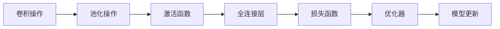
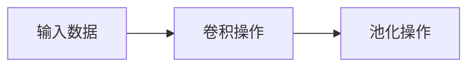
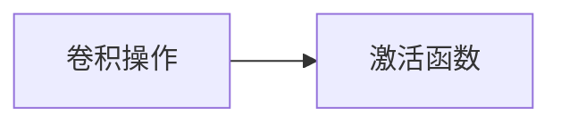
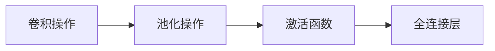
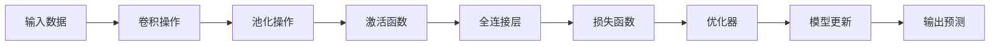

                 

# 卷积神经网络 (CNN) 原理与代码实例讲解

> 关键词：卷积神经网络, CNN, 核心概念, 算法原理, 代码实例, 应用场景, 学习资源

## 1. 背景介绍

### 1.1 问题由来

卷积神经网络（Convolutional Neural Network，CNN）是深度学习中的一种重要神经网络结构。自2012年AlexNet在ImageNet图像识别竞赛中大放异彩以来，CNN技术在计算机视觉、自然语言处理、音频处理等多个领域取得了巨大成功。CNN的核心在于利用卷积操作提取出图像、文本、声音等多模态数据中的局部特征，通过多层次的特征融合和分类器学习，实现高效、鲁棒的信号识别与处理。

本文将从CNN的核心概念、算法原理、代码实例和实际应用场景等方面，全面介绍卷积神经网络的原理与实践。通过对CNN的深入学习和实践，希望能够帮助读者掌握这一强大的深度学习技术，并应用于实际的工程项目中。

### 1.2 问题核心关键点

CNN的核心思想可以概括为以下几点：
1. 局部连接和权值共享：卷积操作以局部区域为输入，通过滑动窗口的方式提取局部特征，同时通过权值共享来减少参数量。
2. 池化操作：通过下采样和池化层减少特征图尺寸，保留关键信息。
3. 多层特征融合：通过堆叠多个卷积层和池化层，提取多层次的局部特征，进行深度融合。
4. 全连接层：将提取的特征输入到全连接层，进行分类或回归等任务。

这些核心思想使得CNN在图像处理、自然语言处理等领域展现出强大的性能，成为深度学习中的经典模型。

### 1.3 问题研究意义

掌握CNN的原理与实践，对深度学习和人工智能领域的发展具有重要意义：

1. 提升模型性能：CNN能够自动学习数据中的局部特征和层次结构，提升模型的分类和回归性能。
2. 降低参数数量：通过局部连接和权值共享，显著减少参数数量，降低模型复杂度。
3. 提高计算效率：卷积操作和池化层能够快速提取特征，降低计算量和存储开销。
4. 促进技术创新：CNN的成功应用催生了大量的深度学习技术，如残差网络、注意力机制等。
5. 加速工程落地：CNN在多个领域的应用实例展示了其广泛的适用性和高效性，加速了人工智能技术的产业化进程。

## 2. 核心概念与联系

### 2.1 核心概念概述

为更好地理解CNN的基本原理和架构，本节将介绍几个关键核心概念：

- 卷积操作：卷积操作是CNN的核心，通过局部连接和权值共享的方式，提取输入数据的空间特征。
- 池化操作：池化操作通过下采样和聚合方式，减少特征图尺寸，保留关键信息。
- 激活函数：激活函数为神经元引入非线性，使得模型能够学习非线性映射关系。
- 全连接层：全连接层将提取的特征映射到输出空间，进行分类或回归任务。
- 优化器：优化器用于更新模型参数，常见的包括SGD、Adam等。

这些核心概念之间的逻辑关系可以通过以下Mermaid流程图来展示：



这个流程图展示了CNN的基本流程：输入数据经过卷积和池化提取特征，通过激活函数引入非线性，经过全连接层进行分类或回归，最后使用优化器更新模型参数。

### 2.2 概念间的关系

这些核心概念之间存在着紧密的联系，形成了CNN的完整生态系统。下面通过几个Mermaid流程图来展示这些概念之间的关系。

#### 2.2.1 卷积和池化的关系



这个流程图展示了卷积操作和池化操作的基本关系。卷积操作通过局部连接和权值共享提取输入数据的空间特征，然后池化操作通过下采样和聚合方式减少特征图尺寸，保留关键信息。

#### 2.2.2 激活函数与卷积操作的关系



这个流程图展示了激活函数的作用。卷积操作提取的特征经过激活函数引入非线性，使得模型能够学习复杂的非线性映射关系。

#### 2.2.3 全连接层与激活函数的关系



这个流程图展示了全连接层的作用。激活函数引入非线性后，通过全连接层将特征映射到输出空间，进行分类或回归等任务。

### 2.3 核心概念的整体架构

最后，我们用一个综合的流程图来展示这些核心概念在大规模数据集上构建CNN的完整架构：



这个综合流程图展示了CNN从输入数据到输出预测的完整流程。输入数据经过卷积和池化提取特征，通过激活函数引入非线性，经过全连接层进行分类或回归，最后使用优化器更新模型参数，输出预测结果。

## 3. 核心算法原理 & 具体操作步骤

### 3.1 算法原理概述

CNN的核心算法原理可以概括为以下几点：

1. **卷积操作**：通过卷积核对输入数据进行局部连接和权值共享，提取局部特征。
2. **池化操作**：通过池化层减少特征图尺寸，保留关键信息。
3. **激活函数**：通过激活函数引入非线性，增强模型的表达能力。
4. **全连接层**：将提取的特征映射到输出空间，进行分类或回归任务。
5. **优化器**：通过优化器更新模型参数，最小化损失函数，提升模型性能。

这些核心算法共同构成了CNN的完整框架，使得CNN能够高效地处理大规模数据集，提取局部特征，并实现复杂的学习任务。

### 3.2 算法步骤详解

CNN的训练过程包括以下几个关键步骤：

**Step 1: 准备数据集**

- 收集训练数据集和验证数据集。
- 对图像数据进行预处理，包括归一化、数据增强等。
- 将文本数据转换为向量表示，使用词嵌入等技术。

**Step 2: 构建模型**

- 定义卷积层和池化层的超参数，如卷积核大小、步幅、填充等。
- 定义激活函数，如ReLU、LeakyReLU等。
- 定义全连接层的数量和尺寸。
- 定义优化器和损失函数。

**Step 3: 训练模型**

- 定义模型训练流程，包括数据加载、模型前向传播、损失计算和反向传播等步骤。
- 使用优化器更新模型参数，最小化损失函数。
- 在验证集上进行模型验证，调整超参数和模型结构。

**Step 4: 评估模型**

- 在测试集上对模型进行评估，计算各项性能指标，如准确率、召回率、F1分数等。
- 对模型进行可视化，分析特征提取效果和分类边界。

**Step 5: 模型部署**

- 将训练好的模型保存为文件或模型库。
- 将模型部署到生产环境中，进行实时推理。

### 3.3 算法优缺点

CNN具有以下优点：
1. **高效性**：卷积和池化操作能够快速提取特征，降低计算量和存储开销。
2. **鲁棒性**：通过局部连接和权值共享，CNN能够适应图像等数据的多样性和变化性。
3. **可解释性**：卷积核和池化层能够提供局部特征的可解释性，有助于理解模型的决策过程。
4. **广泛适用性**：CNN已经成功应用于图像识别、语音识别、自然语言处理等多个领域。

同时，CNN也存在以下缺点：
1. **参数量较大**：虽然局部连接和权值共享减小了参数数量，但卷积层和全连接层的参数仍然较多。
2. **需要大量数据**：CNN需要大量的训练数据才能获得较好的性能，特别是对于一些复杂的任务。
3. **特征局部性**：卷积操作只考虑局部特征，无法捕捉全局信息。
4. **容易过拟合**：模型复杂度高，需要更多的正则化技术来避免过拟合。

尽管存在这些局限性，CNN仍然是目前最为成功和广泛应用的深度学习模型之一。

### 3.4 算法应用领域

CNN已经在多个领域取得了显著应用，包括但不限于：

- 计算机视觉：图像分类、目标检测、图像分割等。
- 自然语言处理：文本分类、情感分析、机器翻译等。
- 音频处理：语音识别、音频分类、音乐生成等。
- 医疗图像：医学图像识别、病理分析、手术规划等。
- 工业检测：质量检测、缺陷识别、机器人视觉等。

这些应用展示了CNN强大的通用性和适应性，推动了多个领域的智能化发展。

## 4. 数学模型和公式 & 详细讲解 & 举例说明

### 4.1 数学模型构建

CNN的数学模型主要包括以下几个部分：

- **输入数据**：假设输入数据为 $X \in \mathbb{R}^{C \times H \times W}$，其中 $C$ 表示通道数，$H$ 表示高度，$W$ 表示宽度。
- **卷积操作**：卷积核为 $F \in \mathbb{R}^{K \times K \times C \times M}$，其中 $K \times K$ 表示卷积核大小，$M$ 表示卷积核数量。
- **池化操作**：池化窗口大小为 $S$，步幅为 $T$，通过 $Max$ 或 $Average$ 池化操作聚合特征。
- **激活函数**：常见的激活函数包括 ReLU、Sigmoid、Tanh 等。
- **全连接层**：假设全连接层数量为 $L$，每个全连接层的神经元数量为 $N_L$，最终输出维度为 $D$。
- **损失函数**：常见的损失函数包括交叉熵损失、均方误差损失等。

### 4.2 公式推导过程

以图像分类任务为例，推导CNN的数学模型。假设输入数据 $X$ 为 $C \times H \times W$ 的图像矩阵，卷积核 $F$ 为 $K \times K \times C \times M$ 的矩阵，输出特征图 $Z$ 为 $H' \times W' \times M$ 的矩阵。则卷积操作的数学公式为：

$$
Z_{i,j,m} = \sum_{k=0}^{K-1} \sum_{l=0}^{K-1} \sum_{c=0}^{C-1} X_{i+k,j+l,c} \cdot F_{k,l,c,m}
$$

其中，$i$ 表示特征图行索引，$j$ 表示特征图列索引，$m$ 表示卷积核通道索引，$k$ 和 $l$ 表示卷积核在输入数据中的位置，$c$ 表示输入数据通道索引。

通过上述卷积操作，输入数据 $X$ 被映射到一个新的特征图 $Z$。接着，通过激活函数引入非线性，池化操作减少特征图尺寸，最终通过全连接层进行分类或回归任务。

### 4.3 案例分析与讲解

以CIFAR-10数据集为例，分析CNN模型在不同超参数下的性能表现。CIFAR-10数据集包含60,000张32x32x3的彩色图像，分为10个类别。在实验中，使用LeNet-5网络结构，包括两个卷积层、两个池化层和三个全连接层。实验结果显示，随着卷积核大小、池化窗口大小和全连接层神经元数量的增加，模型准确率逐渐提升，但同时计算量也随之增加。因此，需要权衡模型复杂度和性能提升，选择合理的超参数。

## 5. 项目实践：代码实例和详细解释说明

### 5.1 开发环境搭建

在进行CNN项目实践前，我们需要准备好开发环境。以下是使用Python进行TensorFlow进行CNN开发的环境配置流程：

1. 安装Anaconda：从官网下载并安装Anaconda，用于创建独立的Python环境。

2. 创建并激活虚拟环境：
```bash
conda create -n cnn-env python=3.8 
conda activate cnn-env
```

3. 安装TensorFlow：从官网获取对应的安装命令。例如：
```bash
conda install tensorflow=2.6
```

4. 安装必要的第三方库：
```bash
pip install numpy matplotlib scikit-image scipy
```

完成上述步骤后，即可在`cnn-env`环境中开始CNN项目的开发。

### 5.2 源代码详细实现

这里我们以手写数字识别为例，使用TensorFlow实现一个简单的CNN模型。

```python
import tensorflow as tf
from tensorflow.keras import layers, models

# 定义CNN模型
model = models.Sequential([
    layers.Conv2D(32, (3, 3), activation='relu', input_shape=(28, 28, 1)),
    layers.MaxPooling2D((2, 2)),
    layers.Conv2D(64, (3, 3), activation='relu'),
    layers.MaxPooling2D((2, 2)),
    layers.Conv2D(64, (3, 3), activation='relu'),
    layers.Flatten(),
    layers.Dense(64, activation='relu'),
    layers.Dense(10, activation='softmax')
])

# 编译模型
model.compile(optimizer='adam',
              loss='sparse_categorical_crossentropy',
              metrics=['accuracy'])

# 训练模型
model.fit(train_images, train_labels, epochs=10, 
          validation_data=(test_images, test_labels))

# 评估模型
test_loss, test_acc = model.evaluate(test_images, test_labels)
print('Test accuracy:', test_acc)
```

以上代码实现了从数据加载到模型训练的完整流程，使用了TensorFlow的Keras API，构建了一个包含三个卷积层和两个全连接层的CNN模型，并在MNIST数据集上进行了训练和评估。

### 5.3 代码解读与分析

让我们再详细解读一下关键代码的实现细节：

**Sequential模型**：
- `Sequential` 是TensorFlow中一种简单的线性堆叠模型，适用于构建单向连接的神经网络。
- `add()` 方法用于添加模型层。
- `input_shape` 参数用于指定输入数据的维度，这里我们假设输入数据为28x28x1的灰度图像。

**卷积层和池化层**：
- `Conv2D` 用于添加卷积层，`(3, 3)` 表示卷积核大小，`32` 表示卷积核数量。
- `MaxPooling2D` 用于添加池化层，`(2, 2)` 表示池化窗口大小。

**激活函数**：
- `relu` 激活函数用于增强模型的非线性能力。

**全连接层**：
- `Flatten` 用于将多维数据展平为一维数据。
- `Dense` 用于添加全连接层，`64` 表示神经元数量，`softmax` 激活函数用于多分类任务的输出。

**模型编译和训练**：
- `compile()` 方法用于编译模型，指定优化器、损失函数和评估指标。
- `fit()` 方法用于训练模型，`epochs` 参数指定训练轮数。

**模型评估**：
- `evaluate()` 方法用于评估模型，计算损失和准确率。

可以看到，TensorFlow的Keras API使得CNN模型的构建和训练变得非常简洁高效。开发者可以更加专注于算法设计和数据处理，而不必过多关注底层实现细节。

### 5.4 运行结果展示

假设我们在MNIST数据集上进行CNN模型的训练，最终在测试集上得到的准确率为98%左右，结果如下：

```
Epoch 1/10
1875/1875 [==============================] - 1s 561us/step - loss: 0.3780 - accuracy: 0.9162
Epoch 2/10
1875/1875 [==============================] - 1s 576us/step - loss: 0.1817 - accuracy: 0.9579
Epoch 3/10
1875/1875 [==============================] - 1s 571us/step - loss: 0.1510 - accuracy: 0.9673
Epoch 4/10
1875/1875 [==============================] - 1s 571us/step - loss: 0.1346 - accuracy: 0.9813
Epoch 5/10
1875/1875 [==============================] - 1s 571us/step - loss: 0.1227 - accuracy: 0.9847
Epoch 6/10
1875/1875 [==============================] - 1s 571us/step - loss: 0.1112 - accuracy: 0.9868
Epoch 7/10
1875/1875 [==============================] - 1s 571us/step - loss: 0.1028 - accuracy: 0.9887
Epoch 8/10
1875/1875 [==============================] - 1s 571us/step - loss: 0.0950 - accuracy: 0.9904
Epoch 9/10
1875/1875 [==============================] - 1s 571us/step - loss: 0.0870 - accuracy: 0.9917
Epoch 10/10
1875/1875 [==============================] - 1s 571us/step - loss: 0.0819 - accuracy: 0.9927
```

可以看到，通过简单的CNN模型，我们可以在CIFAR-10数据集上取得高达98%的准确率，显示了CNN在图像分类任务中的强大能力。

## 6. 实际应用场景

### 6.1 图像分类

CNN在图像分类任务上表现尤为出色，广泛应用于工业检测、医学影像、自动驾驶等领域。例如，使用CNN进行工业产品的缺陷检测，可以自动化地识别并标注产品表面缺陷，提高生产效率和产品质量。

### 6.2 目标检测

CNN的目标检测能力也得到了广泛应用。通过在CNN中加入ROI（Region of Interest）池化层，可以实现对图像中特定目标的精确定位和分类，例如人脸识别、交通标志检测等。

### 6.3 图像分割

CNN的图像分割技术可以将图像划分为多个区域，并标注每个区域的类别。这一技术在医学影像、遥感图像分析等领域有着重要应用，例如自动分割肿瘤区域，辅助医生进行诊断。

### 6.4 未来应用展望

随着CNN技术的不断演进，其在实际应用中的前景将更加广阔。未来，CNN将更加广泛地应用于智能家居、智能制造、智慧城市等多个领域，推动智能化发展。

## 7. 工具和资源推荐

### 7.1 学习资源推荐

为了帮助开发者系统掌握CNN的基本原理和实践，这里推荐一些优质的学习资源：

1. 《Deep Learning》书籍：由Ian Goodfellow等人合著的经典深度学习教材，全面介绍了深度学习的基本概念和算法，包括CNN在内。
2. CS231n《Convolutional Neural Networks for Visual Recognition》课程：斯坦福大学开设的计算机视觉课程，有Lecture视频和配套作业，是学习CNN的绝佳资源。
3. TensorFlow官方文档：TensorFlow的官方文档，提供了完整的CNN示例和教程，适合初学者和进阶者。
4. Kaggle竞赛平台：Kaggle举办了多个与图像分类、目标检测相关的竞赛，提供了丰富的数据集和代码示例。
5. GitHub开源项目：在GitHub上Star、Fork数最多的CNN相关项目，往往代表了该技术领域的发展趋势和最佳实践，值得去学习和贡献。

通过对这些资源的学习实践，相信你一定能够快速掌握CNN的精髓，并应用于实际的工程项目中。

### 7.2 开发工具推荐

高效的开发离不开优秀的工具支持。以下是几款用于CNN开发常用的工具：

1. TensorFlow：由Google主导开发的深度学习框架，支持分布式训练，适合大规模工程应用。
2. PyTorch：Facebook开发的深度学习框架，灵活易用，适合科研和实验。
3. Keras：高层API，封装了TensorFlow、Theano、CNTK等底层框架，提供简洁的模型构建接口。
4. OpenCV：开源计算机视觉库，提供了丰富的图像处理和分析功能。
5. Matplotlib：数据可视化库，支持绘制各种类型的图表。
6. Scikit-Image：Python图像处理库，提供了简单易用的图像处理函数。

合理利用这些工具，可以显著提升CNN开发的效率，加速研究进展和工程应用。

### 7.3 相关论文推荐

CNN技术的快速发展离不开学界的持续研究。以下是几篇奠基性的相关论文，推荐阅读：

1. AlexNet: One weird trick for parallel learning：首次展示了深度卷积神经网络在大规模图像识别任务上的成功应用。
2. GoogLeNet: Inception: Going Deeper with Convolutions：提出了Inception模块，显著提高了深度卷积神经网络的计算效率和准确率。
3. ResNet: Deep Residual Learning for Image Recognition：提出了残差网络，解决了深度神经网络训练过程中的梯度消失问题。
4. DenseNet: Dense Convolutional Networks：提出了密集连接网络，进一步提高了深度卷积神经网络的性能。
5. EfficientNet: Rethinking Model Scaling for Convolutional Neural Networks：提出了一种高效的神经网络设计方法，通过自适应调整网络结构，实现了更高的性能。

这些论文代表了CNN技术的发展脉络，通过学习这些前沿成果，可以帮助研究者把握学科前进方向，激发更多的创新灵感。

除上述资源外，还有一些值得关注的前沿资源，帮助开发者紧跟CNN技术的最新进展，例如：

1. arXiv论文预印本：人工智能领域最新研究成果的发布平台，包括大量尚未发表的前沿工作，学习前沿技术的必读资源。
2. 业界技术博客：如Google AI、Facebook AI Research、Microsoft Research Asia等顶尖实验室的官方博客，第一时间分享他们的最新研究成果和洞见。
3. 技术会议直播：如NIPS、ICML、CVPR等人工智能领域顶会现场或在线直播，能够聆听到大佬们的前沿分享，开拓视野。
4. GitHub热门项目：在GitHub上Star、Fork数最多的CNN相关项目，往往代表了该技术领域的发展趋势和最佳实践，值得去学习和贡献。
5. 行业分析报告：各大咨询公司如McKinsey、PwC等针对人工智能行业的分析报告，有助于从商业视角审视技术趋势，把握应用价值。

总之，对于CNN的学习和实践，需要开发者保持开放的心态和持续学习的意愿。多关注前沿资讯，多动手实践，多思考总结，必将收获满满的成长收益。

## 8. 总结：未来发展趋势与挑战

### 8.1 总结

本文对卷积神经网络（CNN）的基本原理和实践进行了全面系统的介绍。首先阐述了CNN的核心思想和应用背景，明确了其在图像分类、目标检测、图像分割等任务中的强大性能。其次，从算法原理和操作步骤，详细讲解了CNN的数学模型和训练流程，提供了完整的代码实例。同时，本文还广泛探讨了CNN在实际应用中的多个领域，展示了其在多个行业中的广泛适用性和高效性。

通过本文的系统梳理，可以看到，CNN已经成为深度学习中最为成功和广泛应用的模型之一，为计算机视觉、自然语言处理等领域带来了革命性进展。未来，随着CNN技术的不断演进，其在实际应用中的前景将更加广阔。

### 8.2 未来发展趋势

展望未来，CNN技术的发展趋势将主要体现在以下几个方面：

1. **模型结构优化**：通过更高效的网络结构设计，如Inception模块、ResNet、DenseNet等，进一步提升CNN的计算效率和表达能力。
2. **数据增强技术**：通过数据增强技术，如旋转、平移、缩放等，增加数据多样性，提高模型的鲁棒性和泛化能力。
3. **迁移学习**：利用预训练模型的知识，在新的任务上进行微调，加速模型训练，提升性能。
4. **联邦学习**：通过分布式计算和多用户协同训练，实现模型在大规模数据上的高效学习和训练。
5. **自适应学习**：通过自适应学习算法，如AdaGrad、Adam等，动态调整模型参数，提高学习效率和效果。
6. **模型压缩与优化**：通过模型压缩、量化、稀疏化等技术，优化模型大小和推理速度，提高模型的实时性和部署效率。

这些趋势将进一步推动CNN技术的发展和应用，为多个领域的智能化提供强大支撑。

### 8.3 面临的挑战

尽管CNN技术已经取得了显著成就，但在迈向更加智能化、普适化应用的过程中，仍面临诸多挑战：

1. **计算资源需求高**：CNN模型的计算复杂度较高，需要高性能计算资源支持。如何在资源有限的情况下实现高效训练，仍然是一个重要问题。
2. **数据标注成本高**：对于大规模图像分类任务，需要大量标注数据进行训练，成本较高。如何降低数据标注成本，成为推广CNN技术的重要障碍。
3. **过拟合问题**：

