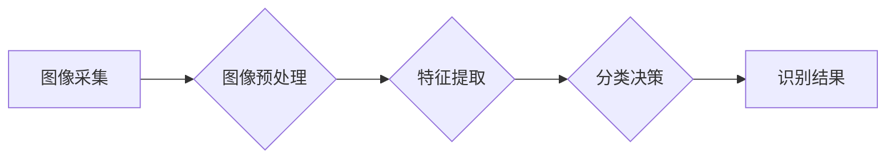

## 基于OpenCV的鲜花的图像分类系统详细设计与具体代码实现

> 关键词：图像分类、OpenCV、深度学习、卷积神经网络、鲜花识别、计算机视觉

## 1. 背景介绍

鲜花作为一种重要的观赏植物，在人们的生活中扮演着重要的角色。随着人工智能技术的快速发展，图像分类技术在鲜花识别领域得到了广泛应用。基于OpenCV的鲜花图像分类系统能够自动识别不同种类的鲜花，为花卉种植、销售、研究等领域提供便利。

传统的鲜花识别方法主要依赖于人工特征提取，效率低且难以识别复杂的花卉品种。而深度学习技术能够自动学习图像特征，提高识别准确率和效率。本文将介绍基于OpenCV和深度学习的鲜花图像分类系统的设计与实现。

## 2. 核心概念与联系

### 2.1 核心概念

* **图像分类:** 将图像划分为不同的类别，例如识别不同种类的鲜花。
* **OpenCV:**  一个开源的计算机视觉库，提供丰富的图像处理和分析功能。
* **深度学习:** 一种机器学习方法，利用多层神经网络学习图像特征。
* **卷积神经网络 (CNN):**  一种专门用于图像处理的深度学习网络结构，能够有效地提取图像特征。

### 2.2 架构关系



## 3. 核心算法原理 & 具体操作步骤

### 3.1 算法原理概述

本文采用卷积神经网络 (CNN) 作为核心算法，用于鲜花图像的分类。CNN 能够自动学习图像特征，并将其映射到不同的类别。

CNN 的主要结构包括卷积层、池化层和全连接层。卷积层通过卷积核提取图像特征，池化层降低特征维度，全连接层进行分类决策。

### 3.2 算法步骤详解

1. **数据采集和预处理:** 收集不同种类鲜花的图像数据，并进行预处理，例如图像裁剪、尺寸调整、色彩规范化等。
2. **模型训练:** 使用预训练的 CNN 模型或从头训练 CNN 模型，训练数据包括预处理后的鲜花图像及其对应的类别标签。
3. **模型评估:** 使用测试数据评估模型的分类准确率、召回率、F1-score 等指标。
4. **模型部署:** 将训练好的模型部署到实际应用场景中，例如手机应用程序、嵌入式系统等。

### 3.3 算法优缺点

**优点:**

* 自动学习图像特征，无需人工特征提取。
* 识别准确率高，能够识别复杂的花卉品种。
* 可移植性强，能够应用于不同的图像采集设备和平台。

**缺点:**

* 训练数据量大，需要大量的标注数据。
* 训练时间长，需要强大的计算资源。
* 模型复杂度高，部署成本较高。

### 3.4 算法应用领域

* **花卉种植:** 自动识别不同种类的鲜花，帮助种植者进行品种管理和病虫害防治。
* **花卉销售:** 自动识别鲜花种类，为消费者提供更精准的商品信息。
* **花卉研究:** 自动识别鲜花种类，帮助研究者进行花卉分类和进化研究。

## 4. 数学模型和公式 & 详细讲解 & 举例说明

### 4.1 数学模型构建

CNN 的数学模型主要基于卷积运算、池化运算和激活函数。

* **卷积运算:** 使用卷积核对图像进行卷积，提取图像特征。卷积核是一个小的矩阵，通过滑动在图像上，计算每个位置的卷积结果。

* **池化运算:** 对卷积后的特征图进行池化，降低特征维度，提高模型鲁棒性。常见的池化方法包括最大池化和平均池化。

* **激活函数:** 将卷积和池化后的特征映射到非线性空间，提高模型的表达能力。常见的激活函数包括ReLU、Sigmoid 和 Tanh。

### 4.2 公式推导过程

**卷积运算公式:**

$$
y_{i,j} = \sum_{m=0}^{M-1} \sum_{n=0}^{N-1} x_{i+m,j+n} * w_{m,n}
$$

其中:

* $y_{i,j}$ 是卷积结果的像素值。
* $x_{i+m,j+n}$ 是输入图像的像素值。
* $w_{m,n}$ 是卷积核的权值。
* $M$ 和 $N$ 是卷积核的大小。

**最大池化公式:**

$$
y_{i,j} = \max(x_{i,j}, x_{i+1,j}, x_{i,j+1}, x_{i+1,j+1})
$$

其中:

* $y_{i,j}$ 是池化结果的像素值。
* $x_{i,j}$ 是输入特征图的像素值。

### 4.3 案例分析与讲解

假设我们使用一个 3x3 的卷积核对一个 5x5 的图像进行卷积运算。卷积核的权值如下:

$$
w = \begin{bmatrix}
1 & 2 & 1 \\
2 & 4 & 2 \\
1 & 2 & 1
\end{bmatrix}
$$

卷积运算的结果将是一个 3x3 的特征图。

## 5. 项目实践：代码实例和详细解释说明

### 5.1 开发环境搭建

* 操作系统: Windows/Linux/macOS
* Python 版本: 3.6+
* OpenCV 版本: 4.x
* TensorFlow/PyTorch 等深度学习框架

### 5.2 源代码详细实现

```python
import cv2
import numpy as np
from tensorflow.keras.models import load_model

# 加载预训练模型
model = load_model('flower_classification_model.h5')

# 定义图像预处理函数
def preprocess_image(image):
    image = cv2.resize(image, (224, 224))
    image = np.expand_dims(image, axis=0)
    image = image / 255.0
    return image

# 定义图像分类函数
def classify_flower(image_path):
    # 读取图像
    image = cv2.imread(image_path)

    # 预处理图像
    preprocessed_image = preprocess_image(image)

    # 进行分类
    prediction = model.predict(preprocessed_image)
    predicted_class = np.argmax(prediction)

    # 返回分类结果
    return predicted_class

# 示例代码
image_path = 'flower.jpg'
predicted_class = classify_flower(image_path)

# 打印分类结果
print(f'Predicted class: {predicted_class}')
```

### 5.3 代码解读与分析

* 代码首先加载预训练的 CNN 模型。
* 定义了 `preprocess_image` 函数，对图像进行尺寸调整、归一化等预处理操作。
* `classify_flower` 函数读取图像，预处理图像，并使用模型进行分类。
* 最后打印分类结果。

### 5.4 运行结果展示

运行代码后，将输出预测的鲜花类别。

## 6. 实际应用场景

### 6.1 鲜花电商平台

* 自动识别鲜花种类，为消费者提供更精准的商品信息。
* 根据用户喜好推荐相关鲜花品种。
* 自动生成鲜花图片标签，方便搜索和分类。

### 6.2 花卉种植园

* 自动识别不同种类的鲜花，帮助种植者进行品种管理和病虫害防治。
* 根据鲜花生长情况，自动调整浇水、施肥等操作。
* 自动统计鲜花产量和销售情况。

### 6.3 花卉研究机构

* 自动识别鲜花种类，帮助研究者进行花卉分类和进化研究。
* 分析鲜花图像特征，研究花卉的生长规律和遗传特性。
* 建立鲜花数据库，方便研究者查询和分析。

### 6.4 未来应用展望

随着人工智能技术的不断发展，鲜花图像分类系统将有更广泛的应用场景，例如：

* **智能家居:**  识别家中鲜花种类，提醒用户及时浇水和施肥。
* **医疗诊断:**  识别特定花卉，辅助医生诊断疾病。
* **艺术创作:**  利用鲜花图像数据进行艺术创作，例如生成鲜花图案或绘画。

## 7. 工具和资源推荐

### 7.1 学习资源推荐

* **OpenCV 官方文档:** https://docs.opencv.org/
* **TensorFlow 官方文档:** https://www.tensorflow.org/
* **PyTorch 官方文档:** https://pytorch.org/
* **Coursera 深度学习课程:** https://www.coursera.org/learn/deep-learning

### 7.2 开发工具推荐

* **VS Code:** https://code.visualstudio.com/
* **PyCharm:** https://www.jetbrains.com/pycharm/
* **Jupyter Notebook:** https://jupyter.org/

### 7.3 相关论文推荐

* **AlexNet:** http://papers.nips.cc/paper/4824-imagenet-classification-with-deep-convolutional-neural-networks.pdf
* **VGGNet:** http://arxiv.org/abs/1409.1556
* **ResNet:** http://arxiv.org/abs/1512.03385

## 8. 总结：未来发展趋势与挑战

### 8.1 研究成果总结

本文介绍了基于OpenCV和深度学习的鲜花图像分类系统的设计与实现。该系统能够自动识别不同种类的鲜花，并具有较高的识别准确率。

### 8.2 未来发展趋势

* **模型精度提升:**  探索更深层次的网络结构和训练方法，提高模型的识别精度。
* **实时性增强:**  优化模型推理速度，实现实时鲜花识别。
* **多模态融合:**  结合其他传感器数据，例如气味、纹理等，提高识别准确率。
* **迁移学习:**  利用预训练模型，减少训练数据量，降低训练成本。

### 8.3 面临的挑战

* **数据标注:**  鲜花图像数据标注工作量大，成本高。
* **模型复杂度:**  深度学习模型复杂度高，部署成本较高。
* **硬件资源:**  训练深度学习模型需要强大的计算资源。

### 8.4 研究展望

未来，我们将继续研究鲜花图像分类系统，探索更先进的算法和技术，提高系统的识别精度、实时性和鲁棒性，并将其应用于更多实际场景。

## 9. 附录：常见问题与解答

* **Q1: 如何选择合适的预训练模型？**

   A1:  可以选择根据任务需求选择合适的预训练模型，例如ResNet、VGGNet等。

* **Q2: 如何进行图像预处理？**

   A2:  常见的图像预处理方法包括尺寸调整、归一化、数据增强等。

* **Q3: 如何评估模型性能？**

   A3:  可以使用准确率、召回率、F1-score等指标评估模型性能。


作者：禅与计算机程序设计艺术 / Zen and the Art of Computer Programming 
