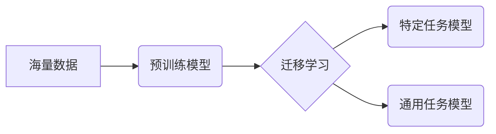

## 基础模型的学术研究与技术开发

> 关键词：基础模型、深度学习、迁移学习、预训练、微调、自然语言处理、计算机视觉

### 1. 背景介绍

近年来，深度学习技术取得了飞速发展，基础模型在人工智能领域扮演着越来越重要的角色。基础模型是指在海量数据上进行预训练的强大深度学习模型，其强大的泛化能力和可迁移性使其能够应用于各种下游任务，例如自然语言处理、计算机视觉、语音识别等。

传统的深度学习模型通常需要针对特定任务进行专门训练，这需要大量的标注数据和计算资源。而基础模型的出现改变了这一现状，它通过在通用数据集上进行预训练，学习了丰富的底层知识和表示，从而能够更有效地适应不同的下游任务。

### 2. 核心概念与联系

**2.1 核心概念**

* **基础模型 (Foundation Model):** 在海量数据上进行预训练的强大深度学习模型，具有强大的泛化能力和可迁移性。
* **预训练 (Pre-training):** 在未标记数据上训练模型，学习通用知识和表示。
* **微调 (Fine-tuning):** 在预训练模型的基础上，使用少量标记数据进行训练，使其适应特定任务。
* **迁移学习 (Transfer Learning):** 将预训练模型的知识迁移到新的任务中。

**2.2 架构关系**



**2.3 联系**

基础模型通过预训练学习了丰富的底层知识和表示，可以作为迁移学习的起点，将预训练模型的知识迁移到新的任务中，从而提高模型的性能和效率。

### 3. 核心算法原理 & 具体操作步骤

**3.1 算法原理概述**

基础模型的训练主要基于深度学习算法，例如 Transformer、BERT、GPT 等。这些算法通过多层神经网络结构，学习输入数据之间的上下文关系和依赖性，从而构建出丰富的语义表示。

**3.2 算法步骤详解**

1. **数据预处理:** 将原始数据进行清洗、格式化和编码，使其能够被模型理解。
2. **模型构建:** 根据任务需求选择合适的深度学习架构，例如 Transformer、BERT、GPT 等。
3. **预训练:** 在海量未标记数据上训练模型，学习通用知识和表示。常用的预训练目标包括语言建模、文本分类、句子相似度等。
4. **微调:** 在预训练模型的基础上，使用少量标记数据进行训练，使其适应特定任务。
5. **评估:** 使用测试数据评估模型的性能，并根据结果进行模型调优。

**3.3 算法优缺点**

**优点:**

* 强大的泛化能力和可迁移性
* 能够适应各种下游任务
* 提高模型的效率和性能

**缺点:**

* 需要大量的计算资源和时间进行预训练
* 预训练数据质量对模型性能有重要影响
* 微调过程可能需要大量的标记数据

**3.4 算法应用领域**

基础模型在自然语言处理、计算机视觉、语音识别等领域都有广泛的应用，例如:

* **自然语言处理:** 文本分类、情感分析、机器翻译、问答系统等
* **计算机视觉:** 图像识别、物体检测、图像分割等
* **语音识别:** 语音转文本、语音合成等

### 4. 数学模型和公式 & 详细讲解 & 举例说明

**4.1 数学模型构建**

基础模型通常基于深度神经网络，其数学模型可以表示为一个多层感知机，其中每一层包含多个神经元。每个神经元接收来自上一层的输出作为输入，并通过激活函数进行处理，输出到下一层。

**4.2 公式推导过程**

深度神经网络的输出可以表示为：

$$
y = f(W_L \cdot a_{L-1} + b_L)
$$

其中：

* $y$ 是网络的输出
* $f$ 是激活函数
* $W_L$ 是第 $L$ 层的权重矩阵
* $a_{L-1}$ 是第 $L-1$ 层的激活值
* $b_L$ 是第 $L$ 层的偏置向量

**4.3 案例分析与讲解**

例如，在 BERT 模型中，其数学模型基于 Transformer 架构，包含多个编码器和解码器层。每个编码器层包含多头自注意力机制和前馈神经网络，用于学习文本序列之间的上下文关系。解码器层则用于生成目标文本序列。

### 5. 项目实践：代码实例和详细解释说明

**5.1 开发环境搭建**

* Python 3.6+
* PyTorch 或 TensorFlow
* CUDA 和 cuDNN

**5.2 源代码详细实现**

```python
# 使用 PyTorch 实现一个简单的 Transformer 模型
import torch
import torch.nn as nn

class Transformer(nn.Module):
    def __init__(self, input_size, hidden_size, num_layers, num_heads):
        super(Transformer, self).__init__()
        self.encoder = nn.TransformerEncoder(nn.TransformerEncoderLayer(d_model=hidden_size, nhead=num_heads), num_layers)
        self.decoder = nn.TransformerDecoder(nn.TransformerDecoderLayer(d_model=hidden_size, nhead=num_heads), num_layers)
        self.linear = nn.Linear(hidden_size, input_size)

    def forward(self, src, tgt, src_mask, tgt_mask):
        src = self.encoder(src, src_mask)
        tgt = self.decoder(tgt, src, tgt_mask)
        output = self.linear(tgt)
        return output
```

**5.3 代码解读与分析**

* 该代码实现了一个简单的 Transformer 模型，包含编码器和解码器层。
* 编码器层用于学习输入序列的上下文关系，解码器层用于生成目标序列。
* `nn.TransformerEncoderLayer` 和 `nn.TransformerDecoderLayer` 是 PyTorch 中的预定义 Transformer 层。
* `src_mask` 和 `tgt_mask` 用于屏蔽输入和输出序列中不必要的元素。

**5.4 运行结果展示**

运行该代码可以进行机器翻译、文本摘要等任务。

### 6. 实际应用场景

基础模型在各个领域都有广泛的应用，例如：

* **自然语言处理:**

    * **机器翻译:** 基于预训练的机器翻译模型可以实现更高效、更准确的翻译。
    * **文本摘要:** 基于预训练的文本摘要模型可以自动生成文本的简洁摘要。
    * **问答系统:** 基于预训练的问答系统可以理解用户的问题并提供准确的答案。

* **计算机视觉:**

    * **图像识别:** 基于预训练的图像识别模型可以识别图像中的物体、场景和人物。
    * **物体检测:** 基于预训练的物体检测模型可以定位图像中的物体并识别其类别。
    * **图像分割:** 基于预训练的图像分割模型可以将图像分割成不同的区域。

* **语音识别:**

    * **语音转文本:** 基于预训练的语音转文本模型可以将语音转换为文本。
    * **语音合成:** 基于预训练的语音合成模型可以将文本转换为语音。

**6.4 未来应用展望**

基础模型在未来将继续推动人工智能的发展，并应用于更多领域，例如：

* **个性化推荐:** 基于用户行为和偏好的基础模型可以提供更精准的个性化推荐。
* **医疗诊断:** 基于医学图像和病历数据的基础模型可以辅助医生进行诊断。
* **科学研究:** 基于大量科学数据的基础模型可以帮助科学家发现新的规律和知识。

### 7. 工具和资源推荐

**7.1 学习资源推荐**

* **书籍:**

    * 《深度学习》 by Ian Goodfellow, Yoshua Bengio, and Aaron Courville
    * 《自然语言处理》 by Dan Jurafsky and James H. Martin

* **在线课程:**

    * Coursera: Deep Learning Specialization
    * Stanford CS224N: Natural Language Processing with Deep Learning

**7.2 开发工具推荐**

* **PyTorch:** https://pytorch.org/
* **TensorFlow:** https://www.tensorflow.org/

**7.3 相关论文推荐**

* BERT: Pre-training of Deep Bidirectional Transformers for Language Understanding
* GPT-3: Language Models are Few-Shot Learners
* T5: Text-to-Text Transfer Transformer

### 8. 总结：未来发展趋势与挑战

**8.1 研究成果总结**

基础模型在过去几年取得了显著的进展，其强大的泛化能力和可迁移性为人工智能的发展带来了新的机遇。

**8.2 未来发展趋势**

* **模型规模的进一步扩大:** 更大的模型规模可以学习更丰富的知识和表示，从而提高模型的性能。
* **多模态基础模型:** 将文本、图像、音频等多种模态数据融合到一起，构建更强大的多模态基础模型。
* **可解释性研究:** 研究基础模型的决策过程，提高模型的可解释性和透明度。

**8.3 面临的挑战**

* **计算资源需求:** 训练大型基础模型需要大量的计算资源，这对于资源有限的机构和个人来说是一个挑战。
* **数据偏见:** 预训练数据可能存在偏见，这会导致模型在某些任务上表现不佳。
* **安全性和隐私性:** 基础模型可能被用于恶意目的，例如生成虚假信息或进行身份盗窃。

**8.4 研究展望**

未来，基础模型的研究将继续朝着更强大、更安全、更可解释的方向发展。


### 9. 附录：常见问题与解答

**9.1 如何选择合适的预训练模型？**

选择合适的预训练模型需要根据具体的任务需求和数据特点进行考虑。例如，对于文本分类任务，可以选择 BERT 或 RoBERTa 等预训练语言模型；对于图像识别任务，可以选择 ResNet 或 EfficientNet 等预训练图像模型。

**9.2 如何进行模型微调？**

模型微调需要使用少量标记数据，调整预训练模型的参数，使其适应特定的任务。常用的微调方法包括全量微调、参数冻结微调和层级微调。

**9.3 如何评估基础模型的性能？**

基础模型的性能可以根据具体的任务需求进行评估。常用的评估指标包括准确率、召回率、F1-score、BLEU 等。


作者：禅与计算机程序设计艺术 / Zen and the Art of Computer Programming 
