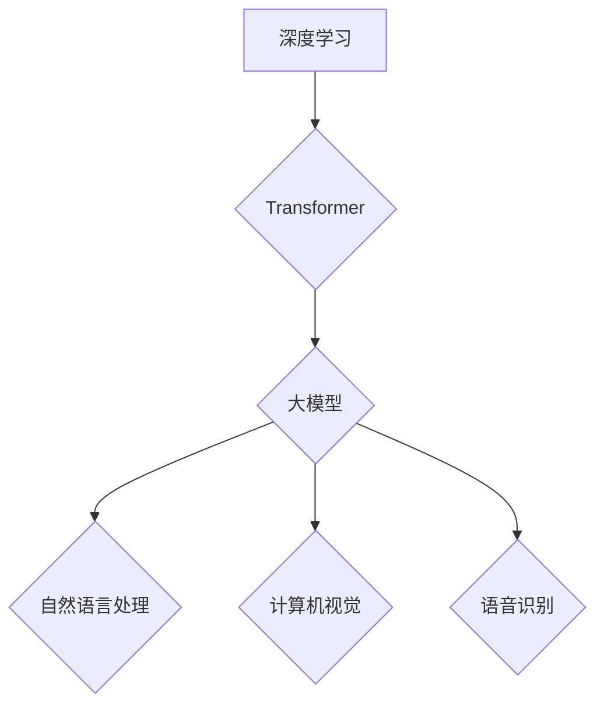

## 大模型的技术发展与市场匹配

> 关键词：大模型、深度学习、Transformer、自然语言处理、计算机视觉、市场匹配、应用场景、伦理挑战

### 1. 背景介绍

近年来，深度学习技术取得了飞速发展，特别是大模型的出现，为人工智能领域带来了革命性的变革。大模型是指参数规模庞大、训练数据海量的人工智能模型，其强大的学习能力和泛化能力使其能够在自然语言处理、计算机视觉、语音识别等多个领域取得突破性进展。

从早期的小规模模型发展到如今的数十亿甚至千亿参数的大模型，大模型的规模不断扩大，其性能也随之提升。例如，GPT-3、BERT、DALL-E 2 等大模型在文本生成、语言理解、图像生成等任务上展现出令人惊叹的能力，引发了学术界和产业界的广泛关注。

然而，大模型的快速发展也面临着一些挑战。一方面，大模型的训练成本高昂，需要大量的计算资源和数据。另一方面，大模型的部署和应用也存在一些技术难题，例如模型的推理速度、内存占用等问题。

此外，大模型的潜在风险也引发了人们的担忧，例如模型的偏见、误用等问题。因此，如何有效地将大模型的技术成果转化为实际应用，并解决其带来的挑战，是当前人工智能领域的重要课题。

### 2. 核心概念与联系

大模型的核心概念包括：

* **深度学习:** 大模型是基于深度学习技术的，深度学习是一种机器学习的子领域，它利用多层神经网络来模拟人类大脑的学习过程。
* **Transformer:** Transformer是一种新型的神经网络架构，它能够有效地处理序列数据，例如文本和音频。Transformer的出现使得大模型的训练和应用取得了新的突破。
* **参数规模:** 大模型的参数规模通常在数十亿甚至千亿级别，大量的参数使得大模型能够学习到更复杂的模式和知识。
* **训练数据:** 大模型的训练需要海量的数据，这些数据可以来自文本、图像、音频等多种来源。

**Mermaid 流程图:**



### 3. 核心算法原理 & 具体操作步骤

#### 3.1  算法原理概述

大模型的训练主要基于深度学习算法，其中Transformer架构是目前大模型训练中最为常用的架构。Transformer的优势在于其能够有效地处理序列数据，并具有强大的并行计算能力。

Transformer的核心组件包括：

* **自注意力机制:** 自注意力机制能够捕捉序列数据中不同元素之间的关系，并赋予每个元素不同的权重。
* **多头注意力:** 多头注意力机制通过使用多个自注意力层来学习不同类型的序列关系。
* **前馈神经网络:** 前馈神经网络用于对每个元素进行非线性变换。
* **位置编码:** 位置编码用于将序列中的位置信息编码到模型中，因为Transformer本身不具备对序列位置的感知能力。

#### 3.2  算法步骤详解

大模型的训练步骤可以概括为以下几个阶段：

1. **数据预处理:** 将原始数据进行清洗、格式化和编码，使其能够被模型理解。
2. **模型构建:** 根据具体的任务需求，选择合适的Transformer架构，并设置模型参数。
3. **模型训练:** 使用训练数据训练模型，通过反向传播算法不断调整模型参数，使其能够更好地预测目标输出。
4. **模型评估:** 使用验证数据评估模型的性能，并根据评估结果进行模型调优。
5. **模型部署:** 将训练好的模型部署到实际应用场景中，用于进行预测或其他任务。

#### 3.3  算法优缺点

**优点:**

* **强大的学习能力:** 大模型能够学习到复杂的模式和知识，在各种任务上表现出色。
* **良好的泛化能力:** 大模型能够将学习到的知识应用到新的数据和任务中。
* **可迁移性:** 大模型可以迁移到不同的任务和领域，无需从头开始训练。

**缺点:**

* **训练成本高昂:** 大模型的训练需要大量的计算资源和数据。
* **部署成本高:** 大模型的部署需要强大的硬件设备和软件支持。
* **可解释性差:** 大模型的决策过程难以理解，这可能会导致模型的误用和滥用。

#### 3.4  算法应用领域

大模型在多个领域都有广泛的应用，例如：

* **自然语言处理:** 文本生成、机器翻译、问答系统、情感分析等。
* **计算机视觉:** 图像识别、物体检测、图像生成等。
* **语音识别:** 语音转文本、语音合成等。
* **药物研发:** 药物发现、药物设计等。
* **金融科技:** 风险评估、欺诈检测等。

### 4. 数学模型和公式 & 详细讲解 & 举例说明

#### 4.1  数学模型构建

Transformer模型的核心是自注意力机制，其数学模型可以表示为：

$$
Attention(Q, K, V) = softmax(\frac{QK^T}{\sqrt{d_k}})V
$$

其中：

* $Q$：查询矩阵
* $K$：键矩阵
* $V$：值矩阵
* $d_k$：键向量的维度
* $softmax$：softmax函数

#### 4.2  公式推导过程

自注意力机制的目的是计算每个查询元素与所有键元素之间的相关性，并根据相关性对值元素进行加权求和。

1. 计算查询矩阵 $Q$ 与键矩阵 $K$ 的点积，并将结果除以 $\sqrt{d_k}$，这可以用来衡量每个查询元素与所有键元素之间的相似度。
2. 使用 softmax 函数对点积结果进行归一化，得到每个查询元素与所有键元素之间的相关性分数。
3. 将相关性分数与值矩阵 $V$ 进行加权求和，得到每个查询元素的最终输出。

#### 4.3  案例分析与讲解

例如，在机器翻译任务中，查询矩阵 $Q$ 可以表示源语言的词向量，键矩阵 $K$ 可以表示目标语言的词向量，值矩阵 $V$ 可以表示目标语言的词嵌入。

通过自注意力机制，模型可以学习到源语言和目标语言之间的词语对应关系，从而实现机器翻译。

### 5. 项目实践：代码实例和详细解释说明

#### 5.1  开发环境搭建

大模型的开发需要强大的计算资源和软件支持。常用的开发环境包括：

* **云计算平台:** AWS、Google Cloud、Azure 等
* **深度学习框架:** TensorFlow、PyTorch 等
* **编程语言:** Python

#### 5.2  源代码详细实现

由于大模型的代码实现非常复杂，这里只提供一个简单的 Transformer 模型的代码示例：

```python
import torch
import torch.nn as nn

class Transformer(nn.Module):
    def __init__(self, input_size, hidden_size, num_layers, num_heads):
        super(Transformer, self).__init__()
        self.encoder = nn.TransformerEncoder(nn.TransformerEncoderLayer(d_model=hidden_size, nhead=num_heads), num_layers)
        self.decoder = nn.TransformerDecoder(nn.TransformerDecoderLayer(d_model=hidden_size, nhead=num_heads), num_layers)
        self.linear = nn.Linear(hidden_size, input_size)

    def forward(self, src, tgt, src_mask, tgt_mask):
        src = self.encoder(src, src_mask)
        tgt = self.decoder(tgt, src, tgt_mask)
        output = self.linear(tgt)
        return output
```

#### 5.3  代码解读与分析

该代码示例定义了一个简单的 Transformer 模型，它包含一个编码器和一个解码器。

* 编码器用于将输入序列编码成隐藏表示。
* 解码器用于将隐藏表示解码成输出序列。

#### 5.4  运行结果展示

大模型的运行结果通常需要使用评估指标进行衡量，例如：

* **自然语言处理:** perplexity、BLEU 等
* **计算机视觉:** accuracy、mAP 等

### 6. 实际应用场景

大模型在多个实际应用场景中取得了成功，例如：

* **ChatGPT:** 一款基于 GPT-3 的对话机器人，能够进行自然流畅的对话。
* **DALL-E 2:** 一款基于 Transformer 的图像生成模型，能够根据文本描述生成逼真的图像。
* **LaMDA:** 一款基于 Transformer 的对话模型，能够进行更深入和富有洞察力的对话。

#### 6.4  未来应用展望

大模型的未来应用前景广阔，例如：

* **个性化教育:** 根据学生的学习情况提供个性化的学习方案。
* **医疗诊断:** 辅助医生进行疾病诊断和治疗方案制定。
* **科学研究:** 加速科学研究的进程，例如药物研发、材料科学等。

### 7. 工具和资源推荐

#### 7.1  学习资源推荐

* **书籍:**
    * 《深度学习》
    * 《Transformer 详解》
* **在线课程:**
    * Coursera 的深度学习课程
    * fast.ai 的深度学习课程

#### 7.2  开发工具推荐

* **深度学习框架:** TensorFlow、PyTorch
* **云计算平台:** AWS、Google Cloud、Azure

#### 7.3  相关论文推荐

* 《Attention Is All You Need》
* 《BERT: Pre-training of Deep Bidirectional Transformers for Language Understanding》
* 《GPT-3: Language Models are Few-Shot Learners》

### 8. 总结：未来发展趋势与挑战

#### 8.1  研究成果总结

大模型技术取得了显著的进展，在多个领域取得了突破性成果。

#### 8.2  未来发展趋势

* **模型规模的进一步扩大:** 随着计算资源的不断发展，大模型的规模将继续扩大，其性能也将得到进一步提升。
* **模型效率的提升:** 研究人员将致力于开发更有效的训练和推理算法，降低大模型的训练和部署成本。
* **模型的解释性和可控性:** 研究人员将致力于提高大模型的解释性和可控性，使其能够更好地服务于人类社会。

#### 8.3  面临的挑战

* **数据获取和隐私保护:** 大模型的训练需要海量数据，如何获取高质量数据并保护用户隐私是一个重要的挑战。
* **计算资源的限制:** 大模型的训练需要大量的计算资源，如何降低训练成本是一个重要的研究方向。
* **模型的偏见和误用:** 大模型可能存在偏见和误用风险，如何解决这些问题是一个重要的伦理挑战。

#### 8.4  研究展望

未来，大模型技术将继续发展，并应用于更多领域，为人类社会带来更多福祉。

### 9. 附录：常见问题与解答

* **什么是大模型？** 大模型是指参数规模庞大、训练数据海量的人工智能模型。
* **大模型的训练成本高昂吗？** 是的，大模型的训练需要大量的计算资源和数据。
* **大模型的应用场景有哪些？** 大模型在自然语言处理、计算机视觉、语音识别等多个领域都有广泛的应用。
* **大模型存在哪些风险？** 大模型可能存在偏见、误用等风险。


作者：禅与计算机程序设计艺术 / Zen and the Art of Computer Programming 
