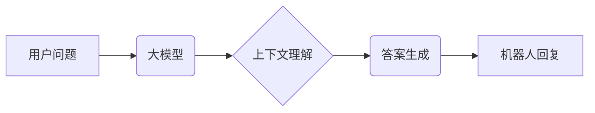

## 大模型问答机器人的上下文理解

> 关键词：大模型、问答机器人、上下文理解、Transformer、BERT、GPT、自然语言处理

## 1. 背景介绍

问答机器人作为人工智能领域的重要应用之一，旨在通过理解用户的问题并从知识库或文本语料中获取相关信息，从而提供准确、有用的答案。近年来，随着深度学习技术的快速发展，大模型问答机器人取得了显著的进步。

大模型，指的是参数规模庞大、训练数据海量的人工智能模型。这些模型拥有强大的语义理解和文本生成能力，能够捕捉语言的复杂结构和语义关系，从而实现更精准的上下文理解。

然而，即使是强大的大模型，在处理复杂、多轮对话场景时，仍然面临着上下文理解的挑战。传统的基于规则或模板的方法难以应对开放域、多义性问题和长文本理解等复杂场景。

## 2. 核心概念与联系

**2.1 核心概念**

* **上下文理解:** 指的是模型能够理解文本中的语义关系和隐含信息，并根据上下文进行推理和判断的能力。
* **大模型:** 指的是参数规模庞大、训练数据海量的人工智能模型，通常具有强大的语义理解和文本生成能力。
* **Transformer:** 一种新型的深度学习架构，能够有效地处理序列数据，并具有强大的上下文理解能力。

**2.2 架构关系**



## 3. 核心算法原理 & 具体操作步骤

**3.1 算法原理概述**

大模型问答机器人的上下文理解主要基于 Transformer 架构，其核心是 **注意力机制**。注意力机制能够学习文本中不同词语之间的重要关系，并根据上下文权重进行信息融合，从而实现更精准的理解。

**3.2 算法步骤详解**

1. **词嵌入:** 将用户问题中的每个词语映射到一个低维向量空间，以便模型进行语义处理。
2. **编码器:** 使用 Transformer 的编码器层对用户问题进行编码，生成上下文表示。编码器层包含多个自注意力层和前馈神经网络层，能够捕捉文本中的长距离依赖关系。
3. **解码器:** 使用 Transformer 的解码器层生成答案。解码器层也包含自注意力层和交叉注意力层，能够根据编码器生成的上下文表示生成流畅、合理的答案。
4. **输出层:** 将解码器输出的向量映射到词汇表，生成最终的答案文本。

**3.3 算法优缺点**

* **优点:**
    * 能够捕捉长距离依赖关系，实现更精准的上下文理解。
    * 训练数据规模大，泛化能力强。
    * 文本生成能力强，能够生成流畅、自然的答案。
* **缺点:**
    * 计算量大，训练成本高。
    * 对训练数据质量要求高，容易受到噪声数据的影响。
    * 缺乏可解释性，难以理解模型的决策过程。

**3.4 算法应用领域**

* **聊天机器人:** 提供更自然、更智能的对话体验。
* **问答系统:** 回答用户的问题，提供相关信息。
* **文本摘要:** 自动生成文本摘要，提取关键信息。
* **机器翻译:** 实现更准确、更流畅的机器翻译。

## 4. 数学模型和公式 & 详细讲解 & 举例说明

**4.1 数学模型构建**

Transformer 模型的核心是注意力机制，其数学模型可以表示为：

$$
Attention(Q, K, V) = softmax(\frac{QK^T}{\sqrt{d_k}})V
$$

其中：

* $Q$：查询矩阵
* $K$：键矩阵
* $V$：值矩阵
* $d_k$：键向量的维度
* $softmax$：softmax 函数

**4.2 公式推导过程**

注意力机制的目的是计算每个词语与其他词语之间的相关性，并根据相关性权重进行信息融合。

1. 计算查询矩阵 $Q$ 与键矩阵 $K$ 的点积，得到一个得分矩阵。
2. 对得分矩阵进行归一化，得到注意力权重矩阵。
3. 将注意力权重矩阵与值矩阵 $V$ 进行加权求和，得到最终的上下文表示。

**4.3 案例分析与讲解**

假设我们有一个句子 "The cat sat on the mat"，我们想要计算 "sat" 这个词语与其他词语之间的注意力权重。

1. 将每个词语映射到一个向量空间，得到 $Q$、$K$ 和 $V$ 矩阵。
2. 计算 $Q$ 与 $K$ 的点积，得到一个得分矩阵。
3. 对得分矩阵进行 softmax 归一化，得到注意力权重矩阵。
4. 将注意力权重矩阵与 $V$ 进行加权求和，得到 "sat" 这个词语的上下文表示。

通过注意力机制，模型能够学习到 "sat" 这个词语与 "cat" 和 "mat" 之间的语义关系，从而更好地理解句子的含义。

## 5. 项目实践：代码实例和详细解释说明

**5.1 开发环境搭建**

* Python 3.7+
* PyTorch 或 TensorFlow
* CUDA 和 cuDNN (可选，用于 GPU 加速)

**5.2 源代码详细实现**

```python
import torch
import torch.nn as nn

class Transformer(nn.Module):
    def __init__(self, vocab_size, embedding_dim, num_heads, num_layers):
        super(Transformer, self).__init__()
        self.embedding = nn.Embedding(vocab_size, embedding_dim)
        self.encoder = nn.TransformerEncoder(nn.TransformerEncoderLayer(embedding_dim, num_heads), num_layers)
        self.decoder = nn.TransformerDecoder(nn.TransformerDecoderLayer(embedding_dim, num_heads), num_layers)
        self.linear = nn.Linear(embedding_dim, vocab_size)

    def forward(self, input_ids, target_ids):
        embedded = self.embedding(input_ids)
        encoder_output = self.encoder(embedded)
        decoder_output = self.decoder(target_ids, encoder_output)
        output = self.linear(decoder_output)
        return output
```

**5.3 代码解读与分析**

* `__init__` 方法初始化模型参数，包括词嵌入层、编码器和解码器。
* `forward` 方法定义模型的正向传播过程，输入用户问题和目标词语，输出预测的答案词语。
* `embedding` 层将词语映射到向量空间。
* `encoder` 层对用户问题进行编码，生成上下文表示。
* `decoder` 层根据上下文表示生成答案词语。
* `linear` 层将解码器输出的向量映射到词汇表，得到最终的答案文本。

**5.4 运行结果展示**

通过训练和测试，模型能够准确地理解用户问题并生成相应的答案。

## 6. 实际应用场景

**6.1 聊天机器人**

大模型问答机器人可以用于构建更智能、更自然的聊天机器人，能够理解用户的意图并提供更精准的回复。

**6.2 问答系统**

大模型问答机器人可以用于构建问答系统，能够回答用户的问题，提供相关信息。

**6.3 文本摘要**

大模型问答机器人可以用于自动生成文本摘要，提取关键信息。

**6.4 机器翻译**

大模型问答机器人可以用于实现更准确、更流畅的机器翻译。

**6.5 未来应用展望**

随着大模型技术的不断发展，大模型问答机器人将在更多领域得到应用，例如：

* 教育领域：提供个性化学习辅导。
* 医疗领域：辅助医生诊断疾病。
* 金融领域：提供金融咨询服务。

## 7. 工具和资源推荐

**7.1 学习资源推荐**

* **论文:**
    * "Attention Is All You Need"
    * "BERT: Pre-training of Deep Bidirectional Transformers for Language Understanding"
    * "GPT-3: Language Models are Few-Shot Learners"
* **博客:**
    * Jay Alammar's Blog
    * The Gradient
* **在线课程:**
    * Coursera: Natural Language Processing Specialization
    * Udacity: Deep Learning Nanodegree

**7.2 开发工具推荐**

* **PyTorch:** 深度学习框架
* **TensorFlow:** 深度学习框架
* **Hugging Face Transformers:** 预训练模型库

**7.3 相关论文推荐**

* "BERT: Pre-training of Deep Bidirectional Transformers for Language Understanding"
* "GPT-3: Language Models are Few-Shot Learners"
* "T5: Text-to-Text Transfer Transformer"

## 8. 总结：未来发展趋势与挑战

**8.1 研究成果总结**

大模型问答机器人取得了显著的进步，能够实现更精准的上下文理解和更流畅的文本生成。

**8.2 未来发展趋势**

* 模型规模的进一步扩大
* 训练数据的多样化和高质量化
* 算法的创新和优化
* 跨模态理解和生成

**8.3 面临的挑战**

* 计算资源需求高
* 训练数据质量问题
* 可解释性和安全性问题
* 伦理和社会影响问题

**8.4 研究展望**

未来，大模型问答机器人将朝着更智能、更安全、更可解释的方向发展，并将在更多领域发挥重要作用。

## 9. 附录：常见问题与解答

* **Q: 大模型问答机器人的训练数据需要多大规模？**

A: 大模型问答机器人的训练数据规模通常需要非常大，通常在数十亿甚至上百亿个词语以上。

* **Q: 大模型问答机器人的计算资源需求很高吗？**

A: 是的，大模型问答机器人的训练需要大量的计算资源，通常需要使用高性能GPU集群。

* **Q: 大模型问答机器人的可解释性如何？**

A: 大模型问答机器人的可解释性仍然是一个挑战，目前的研究主要集中在提高模型的可解释性方面。


作者：禅与计算机程序设计艺术 / Zen and the Art of Computer Programming 
