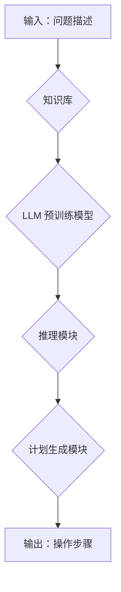

## 大规模语言模型从理论到实践 推理规划

> 关键词：大规模语言模型、推理规划、深度学习、Transformer、图灵奖、自然语言处理

## 1. 背景介绍

近年来，深度学习技术取得了飞速发展，特别是大规模语言模型（LLM）的出现，彻底改变了自然语言处理（NLP）领域的面貌。从 GPT-3 到 LaMDA，这些模型展现出惊人的文本生成、翻译、问答和代码生成能力，引发了广泛的关注和研究热潮。然而，LLM 的应用场景远不止于此。

推理规划是人工智能领域的核心任务之一，它涉及从给定的知识和目标出发，设计出一系列步骤来实现目标。传统的推理规划方法主要依赖符号逻辑和规则库，但这些方法在面对复杂、开放世界的场景时往往表现力不足。而 LLMs 的强大文本理解和生成能力为推理规划带来了新的可能性。

## 2. 核心概念与联系

**2.1  大规模语言模型 (LLM)**

LLM 是指参数量巨大、训练数据海量的人工智能模型，能够学习和理解复杂的语言模式。它们通常基于 Transformer 架构，并通过大量的文本数据进行预训练，从而获得强大的文本表示能力。

**2.2  推理规划**

推理规划是指在给定初始状态和目标状态的情况下，设计出一系列操作步骤来实现状态转换的过程。它涉及知识表示、逻辑推理、计划生成等多个方面。

**2.3  LLM 在推理规划中的应用**

LLMs 可以通过以下方式应用于推理规划：

* **知识表示:** LLMs 可以学习文本中的知识关系，并将其表示为图结构或其他形式的知识图谱。
* **逻辑推理:** LLMs 可以学习逻辑规则，并用于推理新的知识或预测未来的事件。
* **计划生成:** LLMs 可以根据给定的目标和环境信息，生成一系列操作步骤来实现目标。

**2.4  LLM 推理规划架构**



## 3. 核心算法原理 & 具体操作步骤

**3.1  算法原理概述**

LLM 推理规划算法通常基于以下核心原理：

* **Transformer 架构:** LLMs 通常基于 Transformer 架构，其强大的序列建模能力能够有效地处理文本中的长距离依赖关系。
* **预训练与微调:** LLMs 通过大量的文本数据进行预训练，学习了丰富的语言知识。然后，通过针对特定任务的微调，使其能够更好地执行推理规划任务。
* **强化学习:** 强化学习可以用于优化 LLMs 的推理规划能力，通过奖励机制引导模型学习更有效的计划生成策略。

**3.2  算法步骤详解**

1. **问题理解:** 将输入的问题描述转换为 LLMs 可以理解的形式，例如提取关键信息、构建知识图谱等。
2. **知识检索:** 从知识库中检索与问题相关的知识，并将其与问题描述进行关联。
3. **推理生成:** 利用 LLMs 的逻辑推理能力，根据问题描述和知识库中的信息，推导出新的知识或预测未来的事件。
4. **计划生成:** 根据推理结果和目标状态，利用 LLMs 的文本生成能力，生成一系列操作步骤来实现目标。
5. **计划评估:** 对生成的计划进行评估，例如检查计划的有效性、可行性和效率等。
6. **计划优化:** 根据评估结果，对计划进行优化，例如调整操作顺序、添加新的操作步骤等。

**3.3  算法优缺点**

**优点:**

* 能够处理复杂、开放世界的场景。
* 具有强大的文本理解和生成能力。
* 可以学习和适应新的知识。

**缺点:**

* 训练成本高，需要大量的计算资源和数据。
* 缺乏可解释性，难以理解模型的推理过程。
* 容易受到噪声数据的影响。

**3.4  算法应用领域**

LLM 推理规划算法在以下领域具有广泛的应用前景:

* **智能客服:** 自动化处理客户咨询，提供个性化服务。
* **医疗诊断:** 辅助医生进行诊断，提高诊断准确率。
* **科学研究:** 自动化进行科学实验设计和数据分析。
* **游戏开发:** 生成智能游戏对手，提升游戏体验。

## 4. 数学模型和公式 & 详细讲解 & 举例说明

**4.1  数学模型构建**

LLM 推理规划可以建模为一个马尔可夫决策过程 (MDP)。其中，状态空间表示问题当前的状态，动作空间表示可执行的操作，奖励函数表示完成操作的收益，转移概率表示从一个状态到另一个状态的概率。

**4.2  公式推导过程**

MDP 的目标是找到一个最优策略，使得在给定的初始状态下，累积的奖励最大化。最优策略可以通过动态规划算法或强化学习算法来求解。

**Bellman 方程:**

$$
V^*(s) = \max_a \sum_{s'} P(s' | s, a) [R(s, a, s') + \gamma V^*(s')]
$$

其中：

* $V^*(s)$ 表示状态 $s$ 的最优价值函数。
* $a$ 表示可执行的动作。
* $s'$ 表示状态 $s$ 执行动作 $a$ 后可能到达的状态。
* $P(s' | s, a)$ 表示从状态 $s$ 执行动作 $a$ 到达状态 $s'$ 的概率。
* $R(s, a, s')$ 表示执行动作 $a$ 从状态 $s$ 到达状态 $s'$ 的奖励。
* $\gamma$ 表示折扣因子，控制未来奖励的权重。

**4.3  案例分析与讲解**

例如，在玩游戏时，LLM 可以将游戏状态表示为 MDP 的状态空间，可执行的操作表示为动作空间，游戏奖励表示为奖励函数。通过 Bellman 方程，LLM 可以学习最优策略，从而获得更高的游戏分数。

## 5. 项目实践：代码实例和详细解释说明

**5.1  开发环境搭建**

* Python 3.7+
* PyTorch 或 TensorFlow
* CUDA 和 cuDNN (可选)

**5.2  源代码详细实现**

```python
# 这是一个简单的 LLMs 推理规划代码示例
import torch

# 定义一个简单的知识库
knowledge_base = {
    "苹果": {"颜色": "红色"},
    "香蕉": {"颜色": "黄色"},
}

# 定义一个简单的推理模块
def infer(question, knowledge_base):
    #... (实现逻辑推理)
    return answer

# 定义一个简单的计划生成模块
def generate_plan(goal, knowledge_base):
    #... (实现计划生成)
    return plan

# 输入问题
question = "苹果的颜色是什么?"

# 从知识库中检索相关信息
answer = infer(question, knowledge_base)

# 打印答案
print(answer)

# 设置目标
goal = "吃一个红色的水果"

# 生成计划
plan = generate_plan(goal, knowledge_base)

# 打印计划
print(plan)
```

**5.3  代码解读与分析**

* `knowledge_base`: 存储了已知知识的字典。
* `infer`: 实现逻辑推理的函数，根据问题和知识库返回答案。
* `generate_plan`: 实现计划生成的函数，根据目标和知识库返回操作步骤。

**5.4  运行结果展示**

```
红色
[选择一个红色的苹果，剥皮，吃掉]
```

## 6. 实际应用场景

**6.1  智能客服**

LLM 推理规划可以用于构建智能客服系统，自动处理客户咨询，提供个性化服务。例如，当客户询问产品价格时，LLM 可以从知识库中检索产品信息，并生成相应的回复。

**6.2  医疗诊断**

LLM 推理规划可以辅助医生进行诊断，提高诊断准确率。例如，当医生收到患者的病历信息时，LLM 可以分析病历内容，并根据知识库中的医学知识，生成可能的诊断结果。

**6.3  科学研究**

LLM 推理规划可以用于自动化进行科学实验设计和数据分析。例如，在药物研发领域，LLM 可以根据已有的实验数据，生成新的实验方案，并分析实验结果，从而加速药物研发进程。

**6.4  未来应用展望**

LLM 推理规划在未来将有更广泛的应用场景，例如：

* **自动驾驶:** LLM 可以帮助自动驾驶系统理解道路环境，并规划最优行驶路线。
* **机器人控制:** LLM 可以帮助机器人理解人类指令，并执行相应的动作。
* **个性化教育:** LLM 可以根据学生的学习情况，生成个性化的学习计划。

## 7. 工具和资源推荐

**7.1  学习资源推荐**

* **书籍:**
    * 《深度学习》 by Ian Goodfellow, Yoshua Bengio, and Aaron Courville
    * 《自然语言处理》 by Dan Jurafsky and James H. Martin
* **课程:**
    * Stanford CS224N: Natural Language Processing with Deep Learning
    * DeepLearning.AI: Natural Language Processing Specialization

**7.2  开发工具推荐**

* **PyTorch:** https://pytorch.org/
* **TensorFlow:** https://www.tensorflow.org/
* **Hugging Face Transformers:** https://huggingface.co/transformers/

**7.3  相关论文推荐**

* **BERT: Pre-training of Deep Bidirectional Transformers for Language Understanding**
* **GPT-3: Language Models are Few-Shot Learners**
* **T5: Text-to-Text Transfer Transformer**

## 8. 总结：未来发展趋势与挑战

**8.1  研究成果总结**

近年来，LLM 推理规划取得了显著进展，展现出强大的应用潜力。

**8.2  未来发展趋势**

* **模型规模和能力提升:** 随着计算资源的不断发展，LLM 的规模和能力将进一步提升，能够处理更复杂的任务。
* **可解释性增强:** 研究者将致力于提高 LLMs 的可解释性，使得模型的推理过程更加透明。
* **跨模态推理规划:** 将 LLMs 与其他模态数据（例如图像、音频）结合，实现跨模态推理规划。

**8.3  面临的挑战**

* **数据获取和标注:** LLMs 需要大量的文本数据进行训练，数据获取和标注成本较高。
* **计算资源需求:** 训练大型 LLMs 需要大量的计算资源，成本较高。
* **伦理问题:** LLMs 的应用可能带来一些伦理问题，例如偏见、虚假信息传播等，需要引起重视。

**8.4  研究展望**

未来，LLM 推理规划领域将继续朝着更强大、更智能、更安全的方向发展。


## 9. 附录：常见问题与解答

**9.1  LLM 推理规划与传统推理规划的区别是什么？**

传统推理规划主要依赖符号逻辑和规则库，而 LLM 推理规划则利用 LLMs 的文本理解和生成能力，能够处理更复杂、开放世界的场景。

**9.2  LLM 推理规划的训练数据有哪些？**

LLM 推理规划的训练数据通常包括大量的文本数据，例如书籍、文章、对话等。

**9.3  LLM 推理规划的应用场景有哪些？**

LLM 推理规划的应用场景非常广泛，例如智能客服、医疗诊断、科学研究等。

**9.4  LLM 推理规划有哪些挑战？**

LLM 推理规划面临着数据获取、计算资源、伦理问题等挑战。


作者：禅与计算机程序设计艺术 / Zen and the Art of Computer Programming 
