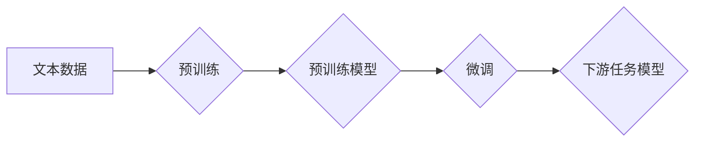

## 大语言模型原理与工程实践：大语言模型怎么训练

> 关键词：大语言模型、Transformer、深度学习、自然语言处理、文本生成、预训练、微调、BERT、GPT

## 1. 背景介绍

近年来，深度学习技术取得了飞速发展，尤其是在自然语言处理（NLP）领域取得了突破性进展。大语言模型（Large Language Model，LLM）作为深度学习在NLP领域的代表性成果，展现出强大的文本理解和生成能力，在机器翻译、文本摘要、对话系统、代码生成等领域展现出巨大的应用潜力。

大语言模型通常是指参数量超过10亿的深度学习模型，通过训练海量文本数据，学习语言的语法、语义和上下文关系，从而能够理解和生成人类语言。与传统的基于规则的NLP方法相比，大语言模型具有以下优势：

* **更强的泛化能力:** 通过学习海量文本数据，大语言模型能够更好地理解语言的复杂性和多样性，从而在处理新的文本任务时表现更出色。
* **更自然的语言表达:** 大语言模型能够生成更流畅、更自然的文本，更接近人类的语言表达方式。
* **更灵活的应用场景:** 大语言模型可以应用于多种NLP任务，例如文本分类、情感分析、问答系统等，其应用场景非常广泛。

## 2. 核心概念与联系

大语言模型的核心概念包括：

* **Transformer:** Transformer是一种新型的深度学习架构，其主要特点是利用注意力机制来捕捉文本序列中的长距离依赖关系，从而能够更好地理解文本的语义。
* **预训练:** 预训练是指在大量文本数据上训练模型，使其学习到语言的通用知识和表示。预训练模型可以用于各种下游任务，并通过微调进一步提升性能。
* **微调:** 微调是指在特定任务数据上对预训练模型进行进一步训练，使其能够更好地适应该任务。

**Mermaid 流程图:**



## 3. 核心算法原理 & 具体操作步骤

### 3.1  算法原理概述

大语言模型的核心算法是Transformer，其主要特点是利用注意力机制来捕捉文本序列中的长距离依赖关系。注意力机制可以理解为模型对输入序列中不同位置的词语赋予不同权重，从而更加关注与当前任务相关的词语信息。

Transformer由编码器和解码器两部分组成。编码器负责将输入文本序列编码成一个固定长度的向量表示，解码器则根据编码器的输出生成目标文本序列。

### 3.2  算法步骤详解

1. **词嵌入:** 将输入文本中的每个词语映射到一个低维向量空间中，每个词语都有一个唯一的向量表示。
2. **编码器:** 将词嵌入序列输入到编码器中，编码器通过多层Transformer模块进行处理，每个模块包含多头注意力机制和前馈神经网络。
3. **解码器:** 将编码器的输出作为输入，解码器通过多层Transformer模块生成目标文本序列。
4. **输出层:** 将解码器的输出映射到目标词汇表，得到最终的文本预测结果。

### 3.3  算法优缺点

**优点:**

* **捕捉长距离依赖关系:** 注意力机制能够有效地捕捉文本序列中长距离的依赖关系，从而更好地理解文本的语义。
* **并行计算能力强:** Transformer的架构使得模型能够并行计算，训练速度更快。
* **性能优异:** Transformer在各种NLP任务上都取得了优异的性能。

**缺点:**

* **参数量大:** Transformer模型的参数量很大，需要大量的计算资源进行训练。
* **训练成本高:** 训练Transformer模型需要大量的计算资源和时间，成本较高。

### 3.4  算法应用领域

Transformer算法在以下领域有广泛的应用:

* **机器翻译:** 将一种语言翻译成另一种语言。
* **文本摘要:** 将长文本压缩成短文本。
* **对话系统:** 与人类进行自然语言对话。
* **代码生成:** 自动生成代码。
* **问答系统:** 回答用户提出的问题。

## 4. 数学模型和公式 & 详细讲解 & 举例说明

### 4.1  数学模型构建

Transformer模型的数学模型主要基于以下几个核心组件:

* **词嵌入层:** 将每个词语映射到一个低维向量空间中，例如Word2Vec或GloVe。
* **多头注意力机制:** 捕捉文本序列中不同位置词语之间的关系，计算每个词语对其他词语的注意力权重。
* **前馈神经网络:** 对每个词语的嵌入向量进行非线性变换，提取更深层的语义信息。

### 4.2  公式推导过程

**多头注意力机制:**

$$
Attention(Q, K, V) = softmax(\frac{QK^T}{\sqrt{d_k}})V
$$

其中:

* $Q$：查询矩阵
* $K$：键矩阵
* $V$：值矩阵
* $d_k$：键向量的维度
* $softmax$：softmax函数

**公式解释:**

多头注意力机制首先计算查询矩阵 $Q$ 与键矩阵 $K$ 的点积，然后进行归一化，得到注意力权重。最后，将注意力权重与值矩阵 $V$ 相乘，得到最终的注意力输出。

**举例说明:**

假设我们有一个文本序列 "The cat sat on the mat"，每个词语都对应一个词嵌入向量。

* $Q$：查询矩阵，每个词语的嵌入向量作为一行。
* $K$：键矩阵，每个词语的嵌入向量作为一行。
* $V$：值矩阵，每个词语的嵌入向量作为一行。

通过计算 $QK^T$，我们可以得到每个词语对其他词语的注意力权重。例如，"cat" 对 "sat" 的注意力权重可能较高，因为它们在语义上相关。

### 4.3  案例分析与讲解

BERT模型是基于Transformer架构的预训练语言模型，其在文本理解任务上取得了显著的成果。BERT通过在大量的文本数据上进行预训练，学习到语言的通用知识和表示，从而能够更好地理解文本的语义。

BERT的预训练目标是预测句子中被遮盖的词语，通过这种方式，BERT能够学习到词语之间的上下文关系。在微调阶段，BERT可以用于各种下游任务，例如文本分类、情感分析、问答系统等。

## 5. 项目实践：代码实例和详细解释说明

### 5.1  开发环境搭建

* Python 3.6+
* TensorFlow 或 PyTorch
* CUDA 和 cuDNN (可选，用于GPU加速)

### 5.2  源代码详细实现

以下是一个简单的Transformer模型的代码示例，使用PyTorch框架实现:

```python
import torch
import torch.nn as nn

class Transformer(nn.Module):
    def __init__(self, vocab_size, embedding_dim, num_heads, num_layers):
        super(Transformer, self).__init__()
        self.embedding = nn.Embedding(vocab_size, embedding_dim)
        self.transformer_layers = nn.ModuleList([
            nn.TransformerEncoderLayer(embedding_dim, num_heads)
            for _ in range(num_layers)
        ])
        self.linear = nn.Linear(embedding_dim, vocab_size)

    def forward(self, x):
        x = self.embedding(x)
        for layer in self.transformer_layers:
            x = layer(x)
        x = self.linear(x)
        return x
```

### 5.3  代码解读与分析

* `__init__` 方法初始化模型参数，包括词嵌入层、Transformer层和输出层。
* `forward` 方法定义模型的正向传播过程，将输入序列经过词嵌入层、Transformer层和输出层，最终得到目标文本序列的预测结果。

### 5.4  运行结果展示

运行该代码需要准备训练数据和模型参数，并使用训练脚本进行训练。训练完成后，可以评估模型性能，例如在测试集上的准确率或BLEU分数。

## 6. 实际应用场景

大语言模型在以下实际应用场景中展现出巨大的潜力:

* **聊天机器人:** 大语言模型可以用于构建更智能、更自然的聊天机器人，能够理解用户的意图并提供更准确的回复。
* **文本生成:** 大语言模型可以用于生成各种类型的文本，例如新闻文章、小说、诗歌等。
* **机器翻译:** 大语言模型可以用于更高效、更准确的机器翻译，突破语言障碍。
* **代码生成:** 大语言模型可以辅助程序员编写代码，提高开发效率。

### 6.4  未来应用展望

随着大语言模型技术的不断发展，其应用场景将更加广泛，例如:

* **个性化教育:** 根据学生的学习情况，提供个性化的学习内容和辅导。
* **医疗诊断:** 辅助医生进行疾病诊断，提高诊断准确率。
* **法律服务:** 自动分析法律文件，提供法律建议。

## 7. 工具和资源推荐

### 7.1  学习资源推荐

* **书籍:**
    * 《深度学习》 by Ian Goodfellow, Yoshua Bengio, and Aaron Courville
    * 《自然语言处理》 by Dan Jurafsky and James H. Martin
* **在线课程:**
    * Coursera: Natural Language Processing Specialization
    * Stanford CS224N: Natural Language Processing with Deep Learning

### 7.2  开发工具推荐

* **TensorFlow:** https://www.tensorflow.org/
* **PyTorch:** https://pytorch.org/
* **Hugging Face Transformers:** https://huggingface.co/transformers/

### 7.3  相关论文推荐

* **Attention Is All You Need:** https://arxiv.org/abs/1706.03762
* **BERT: Pre-training of Deep Bidirectional Transformers for Language Understanding:** https://arxiv.org/abs/1810.04805

## 8. 总结：未来发展趋势与挑战

### 8.1  研究成果总结

大语言模型在文本理解和生成任务上取得了显著的成果，其应用场景不断扩展，为人工智能的发展带来了新的机遇。

### 8.2  未来发展趋势

* **模型规模更大:** 随着计算资源的不断发展，大语言模型的规模将进一步扩大，模型能力将得到提升。
* **多模态学习:** 大语言模型将与其他模态数据，例如图像、音频、视频等进行融合，实现多模态理解和生成。
* **可解释性增强:** 研究如何提高大语言模型的可解释性，使其决策过程更加透明。

### 8.3  面临的挑战

* **训练成本高:** 训练大语言模型需要大量的计算资源和时间，成本较高。
* **数据偏见:** 大语言模型的训练数据可能存在偏见，导致模型输出存在偏差。
* **安全风险:** 大语言模型可能被用于生成虚假信息或进行恶意攻击。

### 8.4  研究展望

未来研究将集中在以下几个方面:

* **降低训练成本:** 研究更有效的训练方法和算法，降低训练成本。
* **解决数据偏见问题:** 开发方法来识别和缓解训练数据中的偏见。
* **增强模型安全性和可靠性:** 研究方法来防止大语言模型被用于恶意目的。

## 9. 附录：常见问题与解答

* **什么是预训练模型?** 预训练模型是在大量文本数据上进行训练的模型，其已经学习到语言的通用知识和表示。
* **如何微调预训练模型?** 微调是指在特定任务数据上对预训练模型进行进一步训练，使其能够更好地适应该任务。
* **大语言模型有哪些应用场景?** 大语言模型可以应用于机器翻译、文本摘要、对话系统、代码生成等多种领域。

作者：禅与计算机程序设计艺术 / Zen and the Art of Computer Programming


