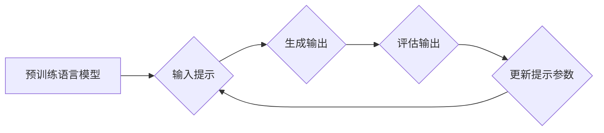

## 大语言模型原理与工程实践：提示微调

> 关键词：大语言模型、提示微调、参数效率、迁移学习、自然语言处理

### 1. 背景介绍

近年来，大语言模型（Large Language Models，LLMs）在自然语言处理（Natural Language Processing，NLP）领域取得了令人瞩目的成就。从文本生成、翻译到问答和代码编写，LLMs展现出强大的能力，深刻地改变了我们与语言交互的方式。然而，训练这些庞大的模型需要海量数据和计算资源，对于资源有限的开发者和研究者来说，这是一个巨大的挑战。

提示微调（Prompt Tuning）应运而生，它提供了一种参数效率高的训练方法，可以有效地提升预训练语言模型在特定任务上的性能，而无需对模型本身进行大幅度修改。

### 2. 核心概念与联系

提示微调的核心思想是，通过学习一系列与特定任务相关的提示（Prompt），引导预训练语言模型生成更准确、更有针对性的输出。

**提示（Prompt）**：是指输入到语言模型的初始文本序列，它可以包含任务描述、示例数据或其他相关信息，引导模型理解任务目标并生成相应的输出。

**预训练语言模型（Pre-trained Language Model）**：是指在海量文本数据上进行预训练的语言模型，已经具备了丰富的语言知识和理解能力。

**微调（Fine-tuning）**：是指在特定任务数据上对预训练语言模型进行进一步训练，以提升其在该任务上的性能。

**提示微调流程图**



### 3. 核心算法原理 & 具体操作步骤

#### 3.1  算法原理概述

提示微调的核心是学习一个与特定任务相关的提示嵌入（Prompt Embedding）。这个嵌入可以被视为一个向量，它包含了任务的语义信息。在训练过程中，模型会学习到如何将这个提示嵌入与预训练语言模型的输入进行融合，从而生成更准确的输出。

#### 3.2  算法步骤详解

1. **选择预训练语言模型:** 选择一个合适的预训练语言模型作为基础，例如BERT、GPT或T5。

2. **定义任务和提示:** 确定需要微调的任务类型，并设计相应的提示格式。提示可以包含任务描述、示例数据或其他相关信息。

3. **构建提示嵌入:** 将提示转换为一个向量表示，称为提示嵌入。可以使用词嵌入技术或其他方法来构建提示嵌入。

4. **微调模型:** 将提示嵌入作为模型输入的一部分，并使用特定任务的数据进行微调。

5. **评估性能:** 在验证集上评估模型的性能，并根据结果调整提示嵌入和训练参数。

#### 3.3  算法优缺点

**优点:**

* **参数效率:** 只需要微调提示嵌入，而不是整个模型参数，大大降低了训练成本和资源需求。
* **迁移学习:** 可以将微调后的提示应用于其他类似的任务，实现知识迁移。
* **可解释性:** 提示嵌入可以提供对模型决策的直观解释。

**缺点:**

* **提示设计:** 设计有效的提示需要一定的经验和技巧，不同的提示可能导致不同的性能。
* **任务适应性:** 提示微调可能对特定任务有较强的适应性，难以推广到完全不同的任务。

#### 3.4  算法应用领域

提示微调在各种自然语言处理任务中都有广泛的应用，例如：

* **文本分类:** 根据文本内容进行分类，例如情感分析、主题识别等。
* **问答系统:** 回答用户提出的问题，例如搜索引擎、聊天机器人等。
* **文本生成:** 生成高质量的文本内容，例如文章写作、故事创作等。
* **机器翻译:** 将文本从一种语言翻译成另一种语言。

### 4. 数学模型和公式 & 详细讲解 & 举例说明

#### 4.1  数学模型构建

假设我们有一个预训练语言模型 $M$，它接受一个文本序列 $x$ 作为输入，并输出一个隐藏状态 $h$。

$$h = M(x)$$

提示微调的目标是学习一个与特定任务相关的提示嵌入 $p$，并将它与输入文本序列 $x$ 进行融合，从而生成更准确的输出。

我们可以使用一个简单的线性融合机制来实现提示嵌入的融合：

$$h' = \text{concat}(p, h)$$

其中，$h'$ 是融合后的隐藏状态。

#### 4.2  公式推导过程

假设我们有一个分类任务，需要将文本序列 $x$ 分到 $k$ 个类别中。我们可以使用一个softmax函数将融合后的隐藏状态 $h'$ 映射到概率分布：

$$P(y|x) = \text{softmax}(W h')$$

其中，$y$ 是文本序列 $x$ 的类别标签，$W$ 是一个权重矩阵。

#### 4.3  案例分析与讲解

例如，我们想要微调一个预训练语言模型进行情感分析任务。我们可以设计一个提示嵌入，包含任务描述和情感标签：

$$p = [\text{情感分析}, \text{正面}]$$

当输入一个文本序列 $x$ 时，模型会将提示嵌入 $p$ 与隐藏状态 $h$ 进行融合，并输出一个概率分布，表示文本 $x$ 属于不同情感标签的概率。

### 5. 项目实践：代码实例和详细解释说明

#### 5.1  开发环境搭建

* Python 3.7+
* PyTorch 1.7+
* Transformers 4.10+

#### 5.2  源代码详细实现

```python
from transformers import AutoModelForSequenceClassification, AutoTokenizer

# 加载预训练模型和词典
model_name = "bert-base-uncased"
model = AutoModelForSequenceClassification.from_pretrained(model_name)
tokenizer = AutoTokenizer.from_pretrained(model_name)

# 定义提示嵌入
prompt_embedding = torch.randn(1, 768)  # 假设提示嵌入维度为768

# 定义训练数据
train_data = [
    ("This movie is amazing!", "positive"),
    ("I hate this movie.", "negative"),
    #...
]

# 定义训练函数
def train_model(model, tokenizer, train_data, epochs=3):
    #...

# 训练模型
train_model(model, tokenizer, train_data)

# 保存模型
model.save_pretrained("my_model")
```

#### 5.3  代码解读与分析

* 代码首先加载预训练模型和词典。
* 然后定义一个提示嵌入，并将其作为模型输入的一部分。
* 接着定义训练数据，并使用训练函数进行模型训练。
* 最后保存训练好的模型。

#### 5.4  运行结果展示

训练完成后，可以将模型应用于新的文本数据进行情感分析。

### 6. 实际应用场景

提示微调在实际应用场景中具有广泛的应用前景，例如：

* **个性化推荐:** 根据用户的偏好和历史行为，生成个性化的推荐提示，提升推荐系统的准确性。
* **对话系统:** 使用提示微调训练对话系统，使其能够更好地理解用户的意图并生成更自然、更流畅的回复。
* **代码生成:** 使用提示微调训练代码生成模型，使其能够根据用户需求生成更准确、更符合规范的代码。

### 6.4  未来应用展望

随着大语言模型的发展和应用场景的不断拓展，提示微调技术将发挥越来越重要的作用。未来，我们可能会看到以下趋势：

* **更复杂的提示设计:** 开发更复杂的提示设计方法，以更好地引导模型生成更准确、更有针对性的输出。
* **自动化提示生成:** 研究自动化提示生成的方法，降低提示设计的门槛，使提示微调技术更易于推广。
* **多模态提示微调:** 将提示微调技术扩展到多模态领域，例如文本-图像、文本-音频等，实现更丰富的应用场景。

### 7. 工具和资源推荐

#### 7.1  学习资源推荐

* **论文:**

    * Prompt Tuning in Language Models
    * Adapters for Language Modeling

* **博客:**

    * The Illustrated Prompt Tuning
    * Prompt Engineering for Large Language Models

#### 7.2  开发工具推荐

* **Transformers:** 一个用于自然语言处理的开源库，提供了许多预训练语言模型和微调工具。
* **Hugging Face:** 一个用于分享和探索机器学习模型的平台，提供了大量的预训练语言模型和提示示例。

#### 7.3  相关论文推荐

* **Prompt Tuning in Language Models**
* **Adapter Tuning: Efficient Transfer Learning for Large Language Models**
* **Exploring the Limits of Transfer Learning with a Unified Text-to-Text Transformer**

### 8. 总结：未来发展趋势与挑战

提示微调技术为大语言模型的应用提供了新的思路和方法，它在参数效率、迁移学习和可解释性方面都具有优势。未来，提示微调技术将继续发展，并应用于更广泛的领域。

然而，提示微调技术也面临着一些挑战，例如：

* **提示设计:** 设计有效的提示仍然是一个需要经验和技巧的过程。
* **任务适应性:** 提示微调可能对特定任务有较强的适应性，难以推广到完全不同的任务。
* **可解释性:** 尽管提示嵌入可以提供对模型决策的直观解释，但仍然需要进一步研究以提高其可解释性。

### 9. 附录：常见问题与解答

* **什么是提示微调？**

提示微调是一种参数效率高的训练方法，通过学习与特定任务相关的提示，引导预训练语言模型生成更准确的输出。

* **提示微调的优势是什么？**

提示微调具有参数效率高、迁移学习能力强和可解释性好等优势。

* **提示微调的应用场景有哪些？**

提示微调可以应用于文本分类、问答系统、文本生成、机器翻译等各种自然语言处理任务。

* **如何设计有效的提示？**

设计有效的提示需要根据具体任务和模型的特点进行设计，通常需要包含任务描述、示例数据或其他相关信息。

* **提示微调的未来发展趋势是什么？**

未来，提示微调技术将朝着更复杂的提示设计、自动化提示生成和多模态提示微调的方向发展。


作者：禅与计算机程序设计艺术 / Zen and the Art of Computer Programming 
