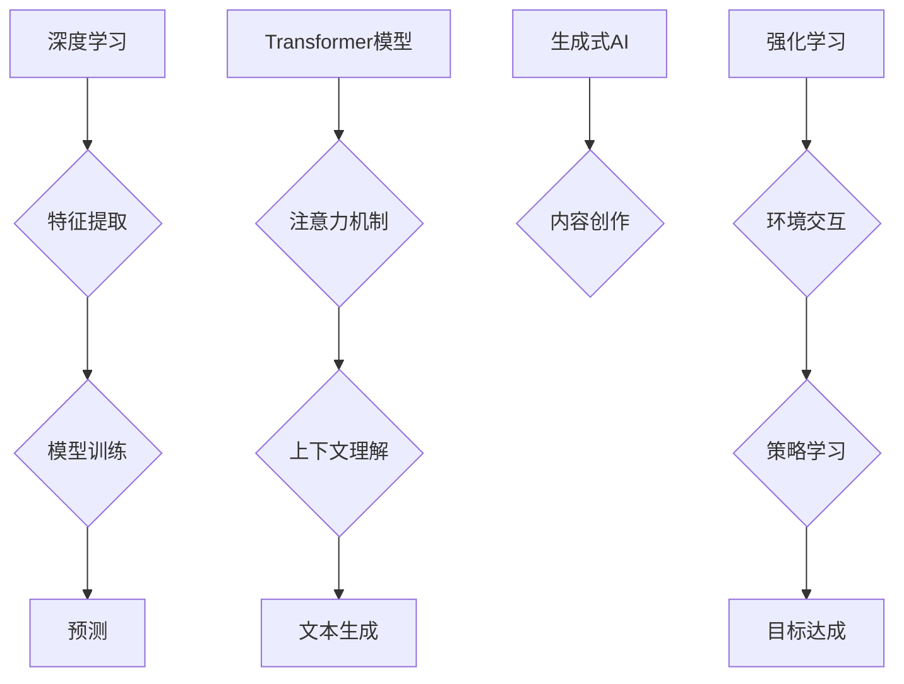

## 新一代AI技术的应用场景

> 关键词：深度学习、Transformer、自然语言处理、计算机视觉、生成式AI、强化学习、应用场景

## 1. 背景介绍

人工智能（AI）技术近年来发展迅速，从最初的局限于特定领域的专家系统，发展到如今能够处理复杂任务的通用人工智能。新一代AI技术，特别是深度学习、Transformer模型等，在计算能力、算法效率和数据处理能力方面取得了突破性进展，为AI技术的应用场景拓展了无限可能。

传统AI技术主要依赖于人工特征工程，需要专家手动提取数据中的特征，而深度学习则能够自动学习数据中的特征，从而提高了AI模型的准确性和泛化能力。Transformer模型的出现，进一步推动了自然语言处理（NLP）领域的进步，其强大的序列建模能力使得其在机器翻译、文本摘要、对话系统等领域取得了显著成果。

## 2. 核心概念与联系

**2.1 深度学习**

深度学习是一种机器学习的子领域，它利用多层神经网络来模拟人类大脑的学习过程。深度学习模型能够从海量数据中自动学习特征，并进行复杂的模式识别和预测。

**2.2 Transformer模型**

Transformer模型是一种新的神经网络架构，它主要用于自然语言处理任务。Transformer模型的核心是“注意力机制”，它能够学习文本中单词之间的关系，从而更好地理解上下文信息。

**2.3 生成式AI**

生成式AI是指能够生成新内容的AI模型，例如文本、图像、音频等。生成式AI通常基于深度学习技术，例如GAN（生成对抗网络）和Transformer模型。

**2.4 强化学习**

强化学习是一种基于奖励机制的机器学习算法，它通过不断与环境交互，学习最优的策略来获得最大奖励。强化学习在机器人控制、游戏AI等领域有着广泛的应用。

**Mermaid 流程图**



## 3. 核心算法原理 & 具体操作步骤

### 3.1 算法原理概述

深度学习算法的核心是多层神经网络，它由多个神经元组成的层级结构组成。每个神经元接收来自上一层的输入，并通过激活函数进行处理，然后将处理后的结果传递给下一层。通过训练，神经网络能够学习数据中的特征，并进行复杂的模式识别和预测。

### 3.2 算法步骤详解

1. **数据预处理:** 将原始数据转换为深度学习模型可以理解的格式，例如归一化、编码等。
2. **模型构建:** 根据任务需求选择合适的深度学习模型架构，例如卷积神经网络（CNN）、循环神经网络（RNN）等。
3. **模型训练:** 使用训练数据训练深度学习模型，通过调整模型参数，使模型的预测结果与真实值尽可能接近。
4. **模型评估:** 使用测试数据评估模型的性能，例如准确率、召回率等。
5. **模型部署:** 将训练好的模型部署到实际应用场景中，用于进行预测或其他任务。

### 3.3 算法优缺点

**优点:**

* 自动特征提取，无需人工干预。
* 能够处理海量数据，学习复杂模式。
* 性能优异，在许多任务中取得了突破性进展。

**缺点:**

* 训练数据量大，需要大量计算资源。
* 模型解释性差，难以理解模型的决策过程。
* 容易受到数据偏差的影响。

### 3.4 算法应用领域

* **计算机视觉:** 图像识别、物体检测、图像分割等。
* **自然语言处理:** 机器翻译、文本摘要、情感分析等。
* **语音识别:** 语音转文本、语音合成等。
* **推荐系统:** 商品推荐、内容推荐等。
* **医疗诊断:** 病情诊断、疾病预测等。

## 4. 数学模型和公式 & 详细讲解 & 举例说明

### 4.1 数学模型构建

深度学习模型的数学基础是神经网络，它由多个层级结构组成，每个层级包含多个神经元。每个神经元接收来自上一层的输入，并通过激活函数进行处理，然后将处理后的结果传递给下一层。

**神经网络模型:**

$$
y = f(W_L x_L + b_L)
$$

其中：

* $y$ 是输出值
* $x_L$ 是上一层的输出值
* $W_L$ 是当前层的权重矩阵
* $b_L$ 是当前层的偏置向量
* $f$ 是激活函数

### 4.2 公式推导过程

深度学习模型的训练过程是通过反向传播算法来进行的。反向传播算法的核心是计算模型预测结果与真实值的误差，然后根据误差反向更新模型参数，使得模型的预测结果越来越接近真实值。

**损失函数:**

$$
L = \frac{1}{N} \sum_{i=1}^{N} (y_i - \hat{y}_i)^2
$$

其中：

* $L$ 是损失函数
* $N$ 是样本数量
* $y_i$ 是真实值
* $\hat{y}_i$ 是模型预测值

**梯度下降算法:**

$$
\theta = \theta - \alpha \nabla L(\theta)
$$

其中：

* $\theta$ 是模型参数
* $\alpha$ 是学习率
* $\nabla L(\theta)$ 是损失函数对模型参数的梯度

### 4.3 案例分析与讲解

**图像分类:**

假设我们有一个图像分类任务，目标是将图像分类为不同的类别，例如猫、狗、鸟等。我们可以使用卷积神经网络（CNN）来解决这个问题。CNN能够自动学习图像中的特征，例如边缘、纹理等，并将其用于分类。

**训练过程:**

1. 使用大量的图像数据训练CNN模型。
2. 计算模型预测结果与真实值的误差。
3. 使用梯度下降算法更新模型参数，使得模型的预测结果越来越接近真实值。

**测试过程:**

1. 将新的图像输入到训练好的CNN模型中。
2. 模型会输出每个类别的概率。
3. 选择概率最高的类别作为图像的分类结果。

## 5. 项目实践：代码实例和详细解释说明

### 5.1 开发环境搭建

* Python 3.x
* TensorFlow 或 PyTorch 深度学习框架
* Jupyter Notebook 或 VS Code 代码编辑器

### 5.2 源代码详细实现

```python
import tensorflow as tf

# 定义模型结构
model = tf.keras.models.Sequential([
    tf.keras.layers.Conv2D(32, (3, 3), activation='relu', input_shape=(28, 28, 1)),
    tf.keras.layers.MaxPooling2D((2, 2)),
    tf.keras.layers.Conv2D(64, (3, 3), activation='relu'),
    tf.keras.layers.MaxPooling2D((2, 2)),
    tf.keras.layers.Flatten(),
    tf.keras.layers.Dense(10, activation='softmax')
])

# 编译模型
model.compile(optimizer='adam',
              loss='sparse_categorical_crossentropy',
              metrics=['accuracy'])

# 训练模型
model.fit(x_train, y_train, epochs=5)

# 评估模型
loss, accuracy = model.evaluate(x_test, y_test)
print('Test loss:', loss)
print('Test accuracy:', accuracy)
```

### 5.3 代码解读与分析

这段代码定义了一个简单的卷积神经网络模型，用于手写数字识别任务。

* `tf.keras.models.Sequential` 创建了一个顺序模型，即层级结构按照顺序连接。
* `tf.keras.layers.Conv2D` 定义了一个卷积层，用于学习图像特征。
* `tf.keras.layers.MaxPooling2D` 定义了一个最大池化层，用于降低特征图的尺寸。
* `tf.keras.layers.Flatten` 将多维特征图转换为一维向量。
* `tf.keras.layers.Dense` 定义了一个全连接层，用于分类。
* `model.compile` 编译模型，指定优化器、损失函数和评价指标。
* `model.fit` 训练模型，使用训练数据进行训练。
* `model.evaluate` 评估模型，使用测试数据计算损失和准确率。

### 5.4 运行结果展示

训练完成后，模型会输出测试集上的损失和准确率。

## 6. 实际应用场景

### 6.1 医疗诊断

* **疾病预测:** 利用深度学习模型分析患者的医疗影像、病史和基因信息，预测患病风险。
* **疾病诊断:** 基于图像识别技术，辅助医生诊断疾病，例如癌症、心血管疾病等。

### 6.2 金融风险管理

* **欺诈检测:** 利用机器学习模型分析交易数据，识别异常交易行为，防止金融欺诈。
* **信用评分:** 基于客户的财务数据和行为数据，评估客户的信用风险。

### 6.3 自动驾驶

* **目标检测:** 利用计算机视觉技术，识别道路上的车辆、行人、交通信号灯等目标。
* **路径规划:** 根据环境信息，规划最优的驾驶路径。

### 6.4 个性化推荐

* **商品推荐:** 根据用户的购买历史、浏览记录和兴趣偏好，推荐相关的商品。
* **内容推荐:** 根据用户的阅读习惯、观看记录和兴趣偏好，推荐相关的文章、视频、音乐等内容。

### 6.5 语音助手

* **语音识别:** 将语音转换为文本，实现人机交互。
* **自然语言理解:** 理解用户的语音指令，并执行相应的操作。

### 6.6 其他应用场景

* **智能客服:** 利用聊天机器人技术，提供24小时在线客服服务。
* **机器翻译:** 利用深度学习模型，实现不同语言之间的文本翻译。
* **图像生成:** 利用生成式AI模型，生成逼真的图像。

### 6.4 未来应用展望

新一代AI技术将继续推动人工智能的快速发展，在更多领域得到广泛应用。例如：

* **医疗保健:** 更精准的疾病诊断、个性化的治疗方案、药物研发加速。
* **教育:** 智能化的教学系统、个性化的学习路径、提高教育效率。
* **金融:** 更智能的风险管理、更精准的投资决策、更便捷的金融服务。
* **制造业:** 智能化生产线、预测性维护、提高生产效率。

## 7. 工具和资源推荐

### 7.1 学习资源推荐

* **书籍:**
    * 深度学习 (Deep Learning) - Ian Goodfellow, Yoshua Bengio, Aaron Courville
    * 自然语言处理 (Natural Language Processing) - Dan Jurafsky, James H. Martin
* **在线课程:**
    * Coursera: 深度学习 Specialization
    * Udacity: AI Programming with Python Nanodegree
    * fast.ai: Practical Deep Learning for Coders

### 7.2 开发工具推荐

* **深度学习框架:** TensorFlow, PyTorch, Keras
* **编程语言:** Python
* **数据处理工具:** Pandas, NumPy
* **可视化工具:** Matplotlib, Seaborn

### 7.3 相关论文推荐

* Attention Is All You Need (Vaswani et al., 2017)
* Generative Adversarial Networks (Goodfellow et al., 2014)
* Deep Residual Learning for Image Recognition (He et al., 2016)

## 8. 总结：未来发展趋势与挑战

### 8.1 研究成果总结

新一代AI技术取得了显著的成果，在图像识别、自然语言处理、语音识别等领域取得了突破性进展。

### 8.2 未来发展趋势

*