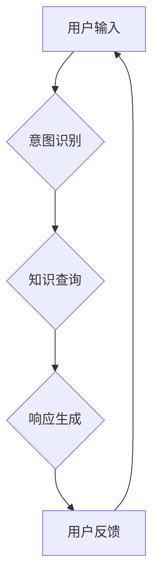

## 未来CUI在数字产品中的应用详细趋势

> 关键词：CUI, 自然语言交互, 混合现实, 人机交互, 数字产品, 深度学习, 认知计算

### 1. 背景介绍

随着人工智能、混合现实和物联网技术的飞速发展，传统的图形用户界面（GUI）逐渐展现出其局限性。用户对更自然、更智能、更沉浸式的交互体验的需求日益增长。在这种背景下，基于自然语言交互的下一代用户界面——CUI（Conversational User Interface，对话式用户界面）应运而生，并逐渐成为数字产品发展的重要趋势。

CUI的核心在于通过自然语言进行交互，例如语音、文本等，与用户进行更像人类对话的交流。它能够理解用户的意图，并提供更精准、更人性化的响应。CUI的出现，将彻底改变我们与数字产品交互的方式，为用户带来更加便捷、高效、愉悦的体验。

### 2. 核心概念与联系

#### 2.1  CUI的构成要素

CUI并非单一技术，而是由多种技术融合而成，包括：

* **自然语言处理（NLP）：** 理解和处理人类语言，包括语音识别、文本分析、意图识别等。
* **对话系统：** 建立与用户进行对话的逻辑框架，并根据用户输入进行响应。
* **机器学习（ML）：** 通过训练数据，使CUI系统能够不断学习和改进，提供更精准的响应。
* **知识图谱：** 提供CUI系统理解用户意图和提供相关信息的知识基础。
* **混合现实（MR）：** 将虚拟元素与现实世界融合，为用户提供更沉浸式的交互体验。

#### 2.2  CUI与其他交互模式的关系

CUI并非替代传统GUI，而是与之协同，形成更加丰富、更加智能的交互模式。

* **CUI+GUI：** 将自然语言交互与图形界面相结合，例如语音控制+鼠标操作，提供更灵活、更便捷的交互体验。
* **CUI+触控：** 将自然语言交互与触控操作相结合，例如语音指令+手势操作，更加直观、更加自然。
* **CUI+体感：** 将自然语言交互与体感操作相结合，例如语音指令+身体动作，更加沉浸、更加趣味。

**Mermaid 流程图**



### 3. 核心算法原理 & 具体操作步骤

#### 3.1  算法原理概述

CUI的核心算法主要包括：

* **语音识别算法：** 将语音信号转换为文本，常用的算法包括基于隐马尔可夫模型（HMM）的语音识别、深度学习（DNN）的语音识别等。
* **自然语言理解算法：** 将文本转换为机器可理解的语义表示，常用的算法包括词性标注、依存句法分析、语义角色标注等。
* **对话管理算法：** 控制对话流程，理解用户意图，并生成相应的响应，常用的算法包括状态机、基于规则的对话系统、基于机器学习的对话系统等。

#### 3.2  算法步骤详解

以基于深度学习的对话系统为例，其具体操作步骤如下：

1. **语音输入：** 用户通过语音输入指令。
2. **语音识别：** 使用语音识别算法将语音信号转换为文本。
3. **文本预处理：** 对文本进行清洗、分词、词性标注等预处理操作。
4. **语义理解：** 使用自然语言理解算法将文本转换为语义表示，例如词向量、句向量等。
5. **意图识别：** 根据语义表示，识别用户的意图，例如查询天气、预订酒店等。
6. **对话管理：** 根据用户的意图，选择合适的响应，并控制对话流程。
7. **文本生成：** 使用文本生成算法生成自然语言响应。
8. **语音合成：** 将文本响应转换为语音，输出给用户。

#### 3.3  算法优缺点

**优点：**

* **自然交互：** 用户可以通过自然语言进行交互，更加便捷、更加人性化。
* **智能化：** 基于机器学习的CUI系统能够不断学习和改进，提供更精准、更智能的响应。
* **多模态交互：** CUI可以结合语音、文本、图像、视频等多种模态信息，提供更加丰富的交互体验。

**缺点：**

* **理解复杂性：** 自然语言的理解难度较高，需要复杂的算法和大量的训练数据。
* **对话流畅性：** 现有的CUI系统对话流畅性仍有待提高，难以完全模拟人类对话的自然流暢。
* **安全性和隐私性：** CUI系统需要处理用户的个人信息，需要加强安全性和隐私保护措施。

#### 3.4  算法应用领域

CUI技术在各个领域都有广泛的应用，例如：

* **智能家居：** 通过语音控制家电、灯光、温度等。
* **智能客服：** 自动回答用户常见问题，提供24小时在线服务。
* **教育培训：** 提供个性化学习辅导，增强学习兴趣。
* **医疗保健：** 辅助医生诊断疾病、提供健康咨询。
* **娱乐休闲：** 提供更加沉浸式的游戏体验、个性化的内容推荐。

### 4. 数学模型和公式 & 详细讲解 & 举例说明

#### 4.1  数学模型构建

CUI系统中的核心算法通常基于概率模型和统计模型。例如，语音识别算法通常使用隐马尔可夫模型（HMM）进行建模，对话管理算法则可以使用状态机或条件随机场（CRF）进行建模。

#### 4.2  公式推导过程

以HMM为例，其核心公式包括：

* **发射概率：** $P(o_t | q_t)$，表示在状态 $q_t$ 下观测到输出 $o_t$ 的概率。
* **转移概率：** $P(q_{t+1} | q_t)$，表示从状态 $q_t$ 转移到状态 $q_{t+1}$ 的概率。
* **初始概率：** $P(q_1)$，表示初始状态 $q_1$ 的概率。

HMM的目标是找到最有可能导致观测序列 $O = \{o_1, o_2,..., o_T\}$ 的状态序列 $Q = \{q_1, q_2,..., q_T\}$，可以使用维特比算法进行求解。

#### 4.3  案例分析与讲解

例如，在语音识别任务中，HMM可以将语音信号序列建模为一系列状态，每个状态代表一个音素或音节。发射概率可以根据训练数据统计每个音素在不同状态下出现的概率，转移概率可以根据语音语义规则统计不同音素之间的转移概率。

### 5. 项目实践：代码实例和详细解释说明

#### 5.1  开发环境搭建

CUI系统的开发环境通常包括：

* **操作系统：** Linux、Windows、macOS 等。
* **编程语言：** Python、Java、C++ 等。
* **深度学习框架：** TensorFlow、PyTorch、Keras 等。
* **自然语言处理库：** NLTK、spaCy、Stanford CoreNLP 等。

#### 5.2  源代码详细实现

以下是一个简单的基于Python和Rasa的CUI系统代码示例：

```python
from rasa_sdk import Action, Tracker
from rasa_sdk.executor import CollectingDispatcher

class ActionHelloWorld(Action):

    def name(self) -> str:
        return "action_hello_world"

    def run(self, dispatcher: CollectingDispatcher,
            tracker: Tracker,
            domain: Dict[Text, Any]) -> List[Dict[Text, Any]]:

        dispatcher.utter_message(text="Hello world!")

        return []
```

#### 5.3  代码解读与分析

该代码定义了一个名为`ActionHelloWorld`的Action类，该类继承自`rasa_sdk.Action`类。

* `name()`方法返回Action的名称，用于在对话流程中调用该Action。
* `run()`方法是Action的执行方法，接受`dispatcher`、`tracker`和`domain`三个参数。
* `dispatcher`用于发送消息给用户。
* `tracker`用于获取对话历史记录。
* `domain`用于获取对话域的定义。

该Action的`run()`方法在收到用户输入后，会发送一条“Hello world!”的消息给用户。

#### 5.4  运行结果展示

运行该代码后，用户可以与CUI系统进行对话，输入任何内容，系统都会回复“Hello world!”。

### 6. 实际应用场景

#### 6.1  智能客服

CUI技术可以用于构建智能客服系统，自动回答用户常见问题，提供24小时在线服务。例如，用户可以通过语音或文本向智能客服咨询产品信息、订单状态等问题，系统会根据预先训练好的知识库和对话规则，提供准确、高效的回复。

#### 6.2  智能家居

CUI技术可以用于控制智能家居设备，例如灯光、空调、电视等。用户可以通过语音指令控制家电，例如“打开客厅灯”、“调低空调温度”等。

#### 6.3  教育培训

CUI技术可以用于提供个性化学习辅导，增强学习兴趣。例如，CUI系统可以根据用户的学习进度和知识点，提供个性化的学习内容和练习题，并通过语音或文本进行互动，帮助用户更好地理解知识点。

#### 6.4  未来应用展望

随着人工智能、混合现实和物联网技术的不断发展，CUI技术将在未来得到更广泛的应用，例如：

* **沉浸式体验：** CUI技术可以与混合现实技术结合，提供更加沉浸式的交互体验，例如虚拟现实游戏、虚拟旅游等。
* **个性化服务：** CUI系统可以根据用户的个人喜好和需求，提供更加个性化的服务，例如个性化推荐、定制化产品等。
* **跨语言沟通：** CUI技术可以支持多种语言的交互，打破语言障碍，促进跨文化交流。

### 7. 工具和资源推荐

#### 7.1  学习资源推荐

* **书籍：**
    * 《深度学习》
    * 《自然语言处理》
    * 《对话系统设计与实现》
* **在线课程：**
    * Coursera
    * edX
    * Udacity

#### 7.2  开发工具推荐

* **Rasa：** 开源对话平台，用于构建基于机器学习的对话系统。
* **Dialogflow：** Google提供的对话平台，用于构建基于自然语言理解的对话系统。
* **Amazon Lex：** Amazon提供的对话平台，用于构建基于语音和文本的对话系统。

#### 7.3  相关论文推荐

* **BERT：** Pre-training of Deep Bidirectional Transformers for Language Understanding
* **GPT-3：** Language Models are Few-Shot Learners
* **Transformer：** Attention Is All You Need

### 8. 总结：未来发展趋势与挑战

#### 8.1  研究成果总结

CUI技术在近年来取得了显著进展，例如：

* **自然语言理解能力的提升：** 深度学习技术的应用使得CUI系统能够更好地理解用户的自然语言输入。
* **对话流畅性的增强：** 基于强化学习的对话管理算法能够使CUI系统对话更加自然、更加流畅。
* **多模态交互的融合：** CUI系统开始融合语音、文本、图像、视频等多种模态信息，提供更加丰富的交互体验。

#### 8.2  未来发展趋势

CUI技术未来将朝着以下方向发展：

* **更智能的交互：** CUI系统将更加智能，能够理解用户的复杂意图，并提供更加个性化的响应。
* **更沉浸式的体验：** CUI系统将与混合现实技术结合，提供更加沉浸式的交互体验。
* **更广泛的应用场景：** CUI技术将应用于更多领域，例如医疗保健、教育培训、金融服务等。

#### 8.3  面临的挑战

CUI