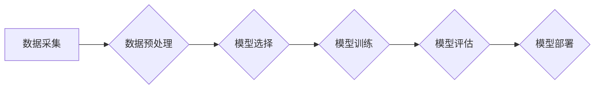

## 机器学习 原理与代码实例讲解

> 关键词：机器学习、算法原理、代码实现、深度学习、监督学习、无监督学习、分类、回归

## 1. 背景介绍

机器学习作为人工智能领域的核心技术之一，近年来发展迅速，并在各个领域取得了令人瞩目的成就。从语音识别、图像识别到推荐系统、医疗诊断，机器学习的应用无处不在。 

然而，对于许多人来说，机器学习仍然是一个充满神秘色彩的领域。其复杂的算法和数学模型让人望而却步。本篇文章将从基础概念开始，逐步深入到算法原理和代码实现，帮助读者理解机器学习的本质，并掌握基本的机器学习技能。

## 2. 核心概念与联系

机器学习的核心思想是让计算机从数据中学习，无需事先编程。它通过构建数学模型，从数据中提取规律，并利用这些规律进行预测或决策。

**机器学习流程图:**



**核心概念:**

* **监督学习:**  利用标记数据训练模型，预测新的数据标签。例如，图像分类、文本分类等。
* **无监督学习:**  利用未标记数据发现数据中的潜在结构或模式。例如，聚类、降维等。
* **强化学习:**  通过试错学习，在环境中获得最大奖励。例如，游戏AI、机器人控制等。
* **模型:**  用于学习数据规律的数学函数。
* **训练:**  利用数据调整模型参数，使其能够准确预测。
* **评估:**  使用测试数据评估模型的性能。
* **部署:**  将训练好的模型应用于实际场景。

## 3. 核心算法原理 & 具体操作步骤

### 3.1  算法原理概述

本节将介绍机器学习中常用的算法，包括线性回归、逻辑回归、决策树、支持向量机等。

**线性回归:**

线性回归是一种用于预测连续数值的监督学习算法。它假设数据之间存在线性关系，并通过最小化预测误差来学习模型参数。

**逻辑回归:**

逻辑回归是一种用于预测分类结果的监督学习算法。它将线性回归的结果映射到0到1之间，并根据阈值判断类别。

**决策树:**

决策树是一种树形结构的分类算法。它通过一系列的决策规则，将数据划分到不同的类别。

**支持向量机:**

支持向量机是一种用于分类和回归的监督学习算法。它通过寻找数据中最大间隔的超平面来进行分类。

### 3.2  算法步骤详解

**线性回归:**

1.  **数据预处理:**  对数据进行清洗、标准化等处理。
2.  **模型构建:**  使用线性回归模型，定义预测目标变量与特征变量之间的关系。
3.  **模型训练:**  使用梯度下降算法，最小化模型预测误差。
4.  **模型评估:**  使用测试数据评估模型的性能，例如R-squared值。

**逻辑回归:**

1.  **数据预处理:**  对数据进行清洗、标准化等处理。
2.  **模型构建:**  使用逻辑回归模型，定义预测目标变量与特征变量之间的关系。
3.  **模型训练:**  使用梯度下降算法，最小化模型预测误差。
4.  **模型评估:**  使用测试数据评估模型的性能，例如准确率、召回率等。

### 3.3  算法优缺点

**线性回归:**

*   **优点:**  简单易懂，计算效率高。
*   **缺点:**  假设数据之间存在线性关系，对非线性关系的拟合能力较差。

**逻辑回归:**

*   **优点:**  适用于分类问题，解释性强。
*   **缺点:**  对高维数据容易过拟合。

**决策树:**

*   **优点:**  易于理解和解释，对非线性关系的拟合能力强。
*   **缺点:**  容易过拟合，对数据变化敏感。

**支持向量机:**

*   **优点:**  对高维数据具有较好的泛化能力。
*   **缺点:**  训练时间较长，参数选择较复杂。

### 3.4  算法应用领域

*   **线性回归:**  房价预测、股票价格预测等。
*   **逻辑回归:**  垃圾邮件分类、客户流失预测等。
*   **决策树:**  信用风险评估、医疗诊断等。
*   **支持向量机:**  图像识别、文本分类等。

## 4. 数学模型和公式 & 详细讲解 & 举例说明

### 4.1  数学模型构建

机器学习算法的核心是数学模型。这些模型通过参数来描述数据之间的关系。

**线性回归模型:**

$$
y = \theta_0 + \theta_1x_1 + \theta_2x_2 +... + \theta_nx_n
$$

其中：

*   $y$ 是预测目标变量。
*   $\theta_0, \theta_1,..., \theta_n$ 是模型参数。
*   $x_1, x_2,..., x_n$ 是特征变量。

### 4.2  公式推导过程

**线性回归模型的目标是最小化预测误差。**

预测误差可以使用均方误差 (MSE) 来衡量:

$$
MSE = \frac{1}{n} \sum_{i=1}^{n} (y_i - \hat{y}_i)^2
$$

其中：

*   $y_i$ 是真实目标变量。
*   $\hat{y}_i$ 是模型预测的目标变量。

**使用梯度下降算法来最小化 MSE。**

梯度下降算法通过迭代更新模型参数，逐步降低 MSE。

### 4.3  案例分析与讲解

**假设我们想要预测房屋价格。**

特征变量包括房屋面积、房间数量、地理位置等。

我们可以使用线性回归模型来建立房屋价格预测模型。

通过训练模型，我们可以得到模型参数，并使用这些参数预测新的房屋价格。

## 5. 项目实践：代码实例和详细解释说明

### 5.1  开发环境搭建

本项目使用 Python 语言进行开发。

需要安装以下库:

*   NumPy
*   Pandas
*   Scikit-learn

### 5.2  源代码详细实现

```python
import numpy as np
from sklearn.linear_model import LinearRegression
from sklearn.model_selection import train_test_split
from sklearn.metrics import mean_squared_error

# 加载数据
data = pd.read_csv('house_price.csv')

# 划分训练集和测试集
X = data[['area', 'rooms']]
y = data['price']
X_train, X_test, y_train, y_test = train_test_split(X, y, test_size=0.2, random_state=42)

# 创建线性回归模型
model = LinearRegression()

# 训练模型
model.fit(X_train, y_train)

# 预测测试集数据
y_pred = model.predict(X_test)

# 计算模型性能
mse = mean_squared_error(y_test, y_pred)
print(f'Mean Squared Error: {mse}')
```

### 5.3  代码解读与分析

1.  **数据加载:** 使用 Pandas 库加载数据。
2.  **数据划分:** 将数据划分为训练集和测试集。
3.  **模型创建:** 使用 Scikit-learn 库创建线性回归模型。
4.  **模型训练:** 使用训练集训练模型。
5.  **模型预测:** 使用测试集数据进行预测。
6.  **模型评估:** 使用均方误差 (MSE) 来评估模型性能。

### 5.4  运行结果展示

运行代码后，会输出模型的均方误差值。

## 6. 实际应用场景

机器学习在各个领域都有广泛的应用，例如：

*   **推荐系统:**  根据用户的历史行为，推荐感兴趣的内容。
*   **图像识别:**  识别图像中的物体、场景等。
*   **自然语言处理:**  理解和生成人类语言。
*   **医疗诊断:**  辅助医生诊断疾病。
*   **金融风险评估:**  评估客户的信用风险。

## 7. 工具和资源推荐

### 7.1  学习资源推荐

*   **书籍:**
    *   《机器学习》 - 周志华
    *   《深入理解机器学习》 -  李航
*   **在线课程:**
    *   Coursera:  Machine Learning by Andrew Ng
    *   edX:  Artificial Intelligence by Columbia University

### 7.2  开发工具推荐

*   **Python:**  机器学习开发的常用语言。
*   **Scikit-learn:**  机器学习算法库。
*   **TensorFlow:**  深度学习框架。
*   **PyTorch:**  深度学习框架。

### 7.3  相关论文推荐

*   **《Support Vector Machines》** - Vapnik, V. N. (1995)
*   **《Decision Trees》** - Breiman, L., Friedman, J. H., Olshen, R. A., & Stone, C. J. (1984)
*   **《The Elements of Statistical Learning》** - Hastie, T., Tibshirani, R., & Friedman, J. (2009)

## 8. 总结：未来发展趋势与挑战

### 8.1  研究成果总结

机器学习取得了令人瞩目的成就，在各个领域都发挥着重要作用。

### 8.2  未来发展趋势

*   **深度学习:**  深度学习算法在图像识别、自然语言处理等领域取得了突破性进展，未来将继续发展。
*   **迁移学习:**  迁移学习可以利用已有模型的知识，快速适应新的任务，未来将更加广泛应用。
*   **联邦学习:**  联邦学习可以保护数据隐私，未来将应用于医疗、金融等敏感领域。

### 8.3  面临的挑战

*   **数据质量:**  机器学习算法对数据质量要求很高，数据不完整、不准确会影响模型性能。
*   **模型解释性:**  许多机器学习算法的决策过程难以解释，这限制了其在一些领域应用。
*   **公平性与伦理:**  机器学习算法可能存在偏见，导致不公平的结果，需要关注算法的公平性与伦理问题。

### 8.4  研究展望

未来机器学习研究将继续探索新的算法、新的应用场景，并解决现有挑战，推动人工智能技术的发展。

## 9. 附录：常见问题与解答

*   **什么是机器学习？**

机器学习是一种人工智能技术，通过算法从数据中学习，无需事先编程。

*   **机器学习有哪些类型？**

常见的机器学习类型包括监督学习、无监督学习和强化学习。

*   **如何选择合适的机器学习算法？**

选择合适的机器学习算法需要考虑数据类型、任务目标和模型性能等因素。

*   **如何评估机器学习模型的性能？**

常用的评估指标包括准确率、召回率、F1-score、AUC等。

*   **机器学习有哪些应用场景？**

机器学习应用广泛，例如推荐系统、图像识别、自然语言处理、医疗诊断等。


作者：禅与计算机程序设计艺术 / Zen and the Art of Computer Programming 
