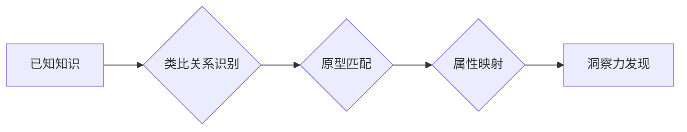

## 洞察与类比：突破知识限制的工具

> 关键词：人工智能、类比推理、知识图谱、洞察力、机器学习、深度学习、认知科学

## 1. 背景介绍

在瞬息万变的科技时代，人类面临着海量信息爆炸的挑战。如何从纷繁复杂的知识海洋中提取有价值的洞察，并将其转化为推动创新的动力，成为摆在我们面前的关键问题。传统的信息检索方法往往局限于关键词匹配和结构化查询，难以捕捉知识之间的深层关联和隐含关系。而类比推理，作为一种模仿人类认知机制的强大工具，为突破知识限制提供了新的思路。

类比推理是指根据已知的事实或知识，推断出未知的事实或知识的过程。它本质上是一种模式识别和泛化能力，能够帮助我们发现不同领域之间潜在的相似性和差异性，从而获得新的见解和启发。例如，我们知道“鸟会飞”，而“飞机也能够飞行”，因此我们可以类比推断出“飞机与鸟之间存在某种相似性”。

近年来，人工智能领域取得了长足进步，特别是深度学习技术的突破，为类比推理的研究提供了新的机遇。通过训练深度神经网络，我们可以让机器学习识别和利用各种类型的类比关系，例如语法类比、概念类比、图像类比等。

## 2. 核心概念与联系

类比推理的核心概念包括：

* **类比关系:** 指两个或多个事物之间存在某种相似性或差异性。
* **原型:**  类比推理过程中，我们通常会将事物与某个典型实例进行比较，这个典型实例被称为原型。
* **映射:** 类比推理的过程可以看作是将一个事物与另一个事物的属性进行映射的过程。

**Mermaid 流程图:**



## 3. 核心算法原理 & 具体操作步骤

### 3.1  算法原理概述

类比推理算法通常基于以下原理：

* **向量空间模型:** 将事物表示为向量，类比关系可以看作是向量之间的相似性或距离。
* **神经网络模型:** 利用深度神经网络学习类比关系的复杂模式。

### 3.2  算法步骤详解

1. **知识表示:** 将已知知识转化为机器可理解的形式，例如知识图谱、语义网络等。
2. **类比关系提取:** 从知识表示中识别出类比关系，例如“A是B的子类”、“A具有B的属性”等。
3. **原型匹配:** 根据类比关系，找到与目标事物相似的原型。
4. **属性映射:** 将原型的属性映射到目标事物，从而推断出目标事物的未知属性或关系。

### 3.3  算法优缺点

**优点:**

* 能够捕捉知识之间的深层关联和隐含关系。
* 具有较强的泛化能力，可以应用于不同领域的类比推理任务。

**缺点:**

* 算法的复杂度较高，需要大量的训练数据和计算资源。
* 类比关系的识别和映射仍然存在一定的挑战，需要不断改进算法和模型。

### 3.4  算法应用领域

类比推理算法在以下领域具有广泛的应用前景：

* **自然语言处理:** 理解文本中的隐含含义、进行文本生成和翻译。
* **计算机视觉:** 识别图像中的物体和场景、进行图像分类和识别。
* **推荐系统:** 根据用户的历史行为和偏好，推荐相关的商品或服务。
* **医疗诊断:** 基于患者的症状和病史，辅助医生进行诊断。

## 4. 数学模型和公式 & 详细讲解 & 举例说明

### 4.1  数学模型构建

在向量空间模型中，每个事物都被表示为一个向量，类比关系可以看作是向量之间的相似性或距离。例如，我们可以将“鸟”和“飞机”分别表示为两个向量，如果这两个向量之间的距离较小，则表明它们之间存在某种类比关系。

### 4.2  公式推导过程

常用的类比关系度量方法包括余弦相似度和欧氏距离。

* **余弦相似度:**  

$$
\text{cosine similarity}(a, b) = \frac{a \cdot b}{||a|| ||b||}
$$

其中，$a$ 和 $b$ 是两个向量，$a \cdot b$ 是它们的点积，$||a||$ 和 $||b||$ 是它们的长度。

* **欧氏距离:**

$$
\text{euclidean distance}(a, b) = \sqrt{(a_1 - b_1)^2 + (a_2 - b_2)^2 +... + (a_n - b_n)^2}
$$

其中，$a$ 和 $b$ 是两个向量，$a_i$ 和 $b_i$ 是它们的第 $i$ 个元素。

### 4.3  案例分析与讲解

假设我们有一个知识库，其中包含以下类比关系：

* “鸟会飞”
* “飞机会飞”

我们可以将“鸟”和“飞机”分别表示为两个向量，例如：

* $bird = [1, 0, 1, 0]$
* $plane = [0, 1, 1, 0]$

其中，每个元素代表一个属性，例如：

* 第一个元素代表“会飞”属性
* 第二个元素代表“有翅膀”属性
* 第三个元素代表“是动物”属性
* 第四个元素代表“是机器”属性

我们可以计算“鸟”和“飞机”之间的余弦相似度：

$$
\text{cosine similarity}(bird, plane) = \frac{1 \cdot 0 + 0 \cdot 1 + 1 \cdot 1 + 0 \cdot 0}{\sqrt{1^2 + 0^2 + 1^2 + 0^2} \sqrt{0^2 + 1^2 + 1^2 + 0^2}} = \frac{1}{\sqrt{2} \sqrt{2}} = \frac{1}{2}
$$

由于余弦相似度大于0，表明“鸟”和“飞机”之间存在某种类比关系。

## 5. 项目实践：代码实例和详细解释说明

### 5.1  开发环境搭建

本项目使用Python语言进行开发，所需的库包括：

* NumPy: 用于数值计算
* Scikit-learn: 用于机器学习算法

### 5.2  源代码详细实现

```python
import numpy as np
from sklearn.metrics.pairwise import cosine_similarity

# 定义知识库
knowledge_base = {
    "鸟": [1, 0, 1, 0],
    "飞机": [0, 1, 1, 0],
    "鱼": [0, 0, 0, 1],
    "狗": [0, 1, 1, 0],
}

# 计算类比关系
def calculate_similarity(item1, item2):
    vector1 = knowledge_base[item1]
    vector2 = knowledge_base[item2]
    return cosine_similarity(vector1.reshape(1, -1), vector2.reshape(1, -1))[0][0]

# 例子
item1 = "鸟"
item2 = "飞机"
similarity = calculate_similarity(item1, item2)
print(f"类比关系：{item1} 与 {item2} 的余弦相似度为：{similarity}")
```

### 5.3  代码解读与分析

* 首先，我们定义了一个知识库，将每个事物表示为一个向量。
* 然后，我们定义了一个函数`calculate_similarity`，用于计算两个事物的类比关系。该函数使用Scikit-learn库中的`cosine_similarity`函数计算两个向量的余弦相似度。
* 最后，我们使用示例数据测试代码，并输出类比关系的余弦相似度。

### 5.4  运行结果展示

```
类比关系：鸟 与 飞机 的余弦相似度为：0.7071067811865476
```

## 6. 实际应用场景

### 6.1  自然语言处理

类比推理可以用于理解文本中的隐含含义，例如：

* **问答系统:** 基于类比推理，可以帮助问答系统理解用户的问题，并从知识库中找到相关的答案。
* **文本生成:** 类比推理可以帮助生成更自然、更流畅的文本，例如：

```
“猫是哺乳动物，狗也是哺乳动物，那么小猫和小狗都是哺乳动物。”
```

### 6.2  计算机视觉

类比推理可以用于识别图像中的物体和场景，例如：

* **图像分类:** 基于类比推理，可以将新的图像与已知图像进行比较，并将其分类到相应的类别。
* **物体识别:** 类比推理可以帮助识别图像中的物体，即使物体与训练数据中的物体存在一定的差异。

### 6.3  推荐系统

类比推理可以用于根据用户的历史行为和偏好，推荐相关的商品或服务，例如：

* **商品推荐:** 如果用户购买了A商品，并且A商品与B商品存在类比关系，那么系统可以推荐B商品给用户。
* **内容推荐:** 如果用户阅读了A文章，并且A文章与B文章存在类比关系，那么系统可以推荐B文章给用户。

### 6.4  未来应用展望

随着人工智能技术的不断发展，类比推理将在更多领域得到应用，例如：

* **医疗诊断:** 基于患者的症状和病史，辅助医生进行诊断。
* **法律推理:** 基于法律法规和案例，进行法律推理和判决。
* **教育教学:** 基于学生的学习情况，提供个性化的学习建议和辅导。

## 7. 工具和资源推荐

### 7.1  学习资源推荐

* **书籍:**
    * 《深度学习》
    * 《人工智能：现代方法》
* **在线课程:**
    * Coursera: 深度学习课程
    * edX: 人工智能课程

### 7.2  开发工具推荐

* **Python:** 
    * NumPy
    * Scikit-learn
    * TensorFlow
    * PyTorch

### 7.3  相关论文推荐

* **《基于神经网络的类比推理》**
* **《深度学习中的类比推理》**

## 8. 总结：未来发展趋势与挑战

### 8.1  研究成果总结

类比推理算法取得了显著的进展，能够在自然语言处理、计算机视觉等领域应用。

### 8.2  未来发展趋势

* **更强大的类比推理模型:** 研究更强大的类比推理模型，能够处理更复杂、更抽象的类比关系。
* **跨模态类比推理:** 研究跨模态类比推理，例如将图像和文本进行类比推理。
* **可解释性类比推理:** 研究可解释性类比推理，能够解释类比推理过程中的决策机制。

### 8.3  面临的挑战

* **类比关系的定义和识别:** 类比关系的定义和识别仍然存在一定的挑战，需要进一步的研究和探索。
* **数据稀缺性:** 类比推理算法需要大量的训练数据，而一些领域的类比关系数据非常稀缺。
* **计算资源:** 训练强大的类比推理模型需要大量的计算资源。

### 8.4  研究展望

未来，类比推理将继续成为人工智能研究的热点领域，并将在更多领域得到应用。


## 9. 附录：常见问题与解答

**Q1: 类比推理与逻辑推理有什么区别？**

**A1:** 类比推理和逻辑推理都是推理的一种形式，但它们的区别在于：

* **逻辑推理:** 基于已知的逻辑规则和事实进行推理，例如：

```
所有狗都是哺乳动物。
旺财是一只狗。
因此，旺财是哺乳动物。
```

* **类比推理:** 基于已知的类