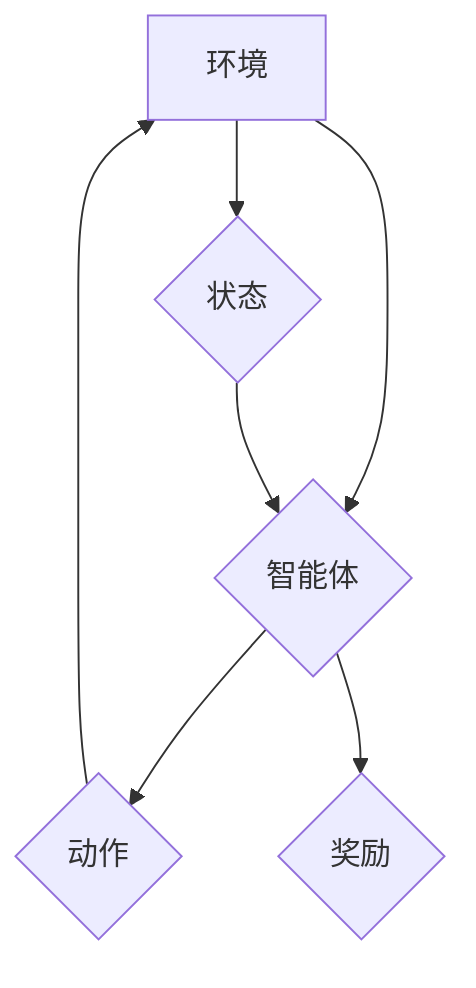

## 深度学习与强化学习的应用

> 关键词：深度学习、强化学习、神经网络、机器学习、算法、应用场景、实践案例、未来趋势

## 1. 背景介绍

人工智能（AI）近年来取得了令人瞩目的进展，深度学习和强化学习作为其重要组成部分，在各个领域展现出强大的应用潜力。深度学习通过模仿人类大脑神经网络结构，利用多层神经网络进行特征提取和学习，能够处理复杂的数据模式，在图像识别、自然语言处理等领域取得突破性进展。强化学习则通过设计奖励机制，让智能体在环境中学习最优策略，在机器人控制、游戏 AI 等领域展现出强大的适应性和自主学习能力。

深度学习和强化学习的结合，使得人工智能能够更加智能化、自主化，并应用于更广泛的领域。例如，深度强化学习算法可以训练智能体在复杂的虚拟环境中学习驾驶汽车、玩游戏，甚至控制机器人完成复杂的任务。

## 2. 核心概念与联系

**2.1 深度学习**

深度学习是一种机器学习的子领域，它利用多层神经网络来学习数据中的复杂模式。深度学习模型由多个神经元层组成，每个神经元接收来自上一层的输入，并通过激活函数进行处理，输出到下一层。通过训练，神经网络的权重和偏置会不断调整，最终能够学习到数据的特征表示和决策规则。

**2.2 强化学习**

强化学习是一种基于交互学习的机器学习方法。智能体在环境中采取行动，根据环境反馈获得奖励或惩罚。智能体的目标是通过不断学习和调整策略，最大化累积的奖励。强化学习算法的核心是价值函数，它评估智能体在特定状态下采取特定行动的长期价值。

**2.3 深度强化学习**

深度强化学习将深度学习和强化学习相结合，利用深度神经网络来学习价值函数和策略。深度强化学习算法能够处理高维输入和复杂环境，并学习到更复杂的策略。

**Mermaid 流程图**



## 3. 核心算法原理 & 具体操作步骤

### 3.1 算法原理概述

深度强化学习算法的核心是利用深度神经网络来学习价值函数和策略。价值函数评估智能体在特定状态下采取特定行动的长期价值，策略则决定智能体在不同状态下采取的行动。

常见的深度强化学习算法包括：

* **DQN (Deep Q-Network)**：利用深度神经网络来估计 Q 值，并通过经验回放机制来训练。
* **A2C (Advantage Actor-Critic)**：将 Actor-Critic 框架与深度神经网络结合，同时学习策略和价值函数。
* **PPO (Proximal Policy Optimization)**：通过限制策略更新的范围，提高算法的稳定性和收敛性。

### 3.2 算法步骤详解

以 DQN 算法为例，其训练步骤如下：

1. **初始化深度神经网络**: 设置网络结构和参数。
2. **收集经验**: 智能体在环境中采取行动，收集状态、动作、奖励和下一个状态的经验数据。
3. **存储经验**: 将收集到的经验数据存储在经验回放池中。
4. **训练神经网络**: 从经验回放池中随机抽取样本，利用目标 Q 值和神经网络预测的 Q 值进行反向传播训练。
5. **更新策略**: 根据训练后的神经网络，更新智能体的策略。
6. **重复步骤 2-5**: 直到智能体在环境中表现达到预期目标。

### 3.3 算法优缺点

**优点**:

* 能够处理高维输入和复杂环境。
* 学习能力强，能够学习到复杂的策略。
* 训练效率高，可以通过经验回放机制提高训练效率。

**缺点**:

* 训练过程需要大量数据和计算资源。
* 算法的稳定性和收敛性需要仔细调参。
* 难以解释模型的决策过程。

### 3.4 算法应用领域

深度强化学习算法在以下领域具有广泛的应用前景：

* **机器人控制**: 训练机器人完成复杂的任务，例如导航、抓取、组装等。
* **游戏 AI**: 开发更智能的游戏 AI，例如玩策略游戏、模拟现实世界游戏等。
* **自动驾驶**: 训练自动驾驶系统，使其能够在复杂道路环境中安全驾驶。
* **医疗保健**: 辅助医生诊断疾病、制定治疗方案等。
* **金融市场**: 进行股票预测、风险管理等。

## 4. 数学模型和公式 & 详细讲解 & 举例说明

### 4.1 数学模型构建

深度强化学习算法的核心是价值函数和策略函数。

* **价值函数**: 评估智能体在特定状态下采取特定行动的长期价值。

* **策略函数**: 根据当前状态决定智能体采取的行动。

### 4.2 公式推导过程

**Q 值函数**:

$$Q(s, a) = E[\sum_{t=0}^{\infty} \gamma^t r_{t+1}|s_t = s, a_t = a]$$

其中：

* $s$ 表示状态
* $a$ 表示动作
* $r_{t+1}$ 表示在时间步 $t+1$ 获得的奖励
* $\gamma$ 表示折扣因子，控制未来奖励的权重

**策略梯度**:

$$\nabla_{\theta} J(\theta) = E_{\pi_{\theta}}[\nabla_{\theta} \log \pi_{\theta}(a|s) Q(s, a)]$$

其中：

* $\theta$ 表示策略网络的参数
* $J(\theta)$ 表示策略网络的目标函数
* $\pi_{\theta}(a|s)$ 表示策略网络在状态 $s$ 下采取动作 $a$ 的概率

### 4.3 案例分析与讲解

**举例说明**:

在玩游戏 Atari 的情况下，深度强化学习算法可以学习到玩游戏的策略。

* 状态：游戏画面，包括游戏角色、敌人、道具等信息。
* 动作：游戏角色可以采取的行动，例如向上、向下、向左、向右移动、跳跃等。
* 奖励：当游戏角色完成任务或获得分数时，获得奖励；当游戏角色失败时，获得惩罚。

深度强化学习算法通过训练深度神经网络，学习到状态和动作之间的映射关系，从而能够学习到玩游戏的策略。

## 5. 项目实践：代码实例和详细解释说明

### 5.1 开发环境搭建

* Python 3.x
* TensorFlow 或 PyTorch 深度学习框架
* OpenAI Gym 游戏环境

### 5.2 源代码详细实现

```python
import gym
import tensorflow as tf

# 定义 DQN 算法
class DQN:
    def __init__(self, state_size, action_size):
        # 初始化神经网络
        self.model = tf.keras.models.Sequential([
            tf.keras.layers.Dense(64, activation='relu', input_shape=(state_size,)),
            tf.keras.layers.Dense(64, activation='relu'),
            tf.keras.layers.Dense(action_size)
        ])

    # 选择动作
    def choose_action(self, state):
        # 使用 epsilon-greedy 策略选择动作
        if tf.random.uniform(()) < 0.1:
            return tf.random.uniform(shape=(1,), minval=0, maxval=self.model.output_shape[-1], dtype=tf.int32)
        else:
            return tf.argmax(self.model(state), axis=-1)

    # 更新神经网络
    def update_model(self, state, action, reward, next_state, done):
        # 计算目标 Q 值
        target_q = reward + (1 - done) * self.model(next_state)
        # 使用目标 Q 值更新神经网络
        with tf.GradientTape() as tape:
            q_value = self.model(state)
            loss = tf.keras.losses.mean_squared_error(target_q, q_value[0, action])
        gradients = tape.gradient(loss, self.model.trainable_variables)
        self.optimizer.apply_gradients(zip(gradients, self.model.trainable_variables))

# 创建游戏环境
env = gym.make('CartPole-v1')

# 初始化 DQN 算法
dqn = DQN(state_size=env.observation_space.shape[0], action_size=env.action_space.n)

# 训练 DQN 算法
for episode in range(1000):
    state = env.reset()
    done = False
    total_reward = 0
    while not done:
        action = dqn.choose_action(state)
        next_state, reward, done, _ = env.step(action)
        dqn.update_model(state, action, reward, next_state, done)
        state = next_state
        total_reward += reward
    print(f'Episode {episode+1}: Total Reward = {total_reward}')

# 测试 DQN 算法
state = env.reset()
while True:
    env.render()
    action = dqn.choose_action(state)
    next_state, reward, done, _ = env.step(action)
    state = next_state
    if done:
        break
env.close()
```

### 5.3 代码解读与分析

* 代码首先定义了 DQN 算法类，包括初始化神经网络、选择动作和更新神经网络的方法。
* 然后创建游戏环境，并初始化 DQN 算法实例。
* 训练循环中，智能体在环境中采取行动，收集经验数据，并使用这些数据更新神经网络。
* 测试循环中，使用训练好的神经网络控制智能体在环境中进行操作。

### 5.4 运行结果展示

运行代码后，会看到智能体在游戏环境中进行操作，并逐渐学习到玩游戏的策略。最终，智能体能够在环境中保持平衡，获得高分。

## 6. 实际应用场景

### 6.1 自动驾驶

深度强化学习算法可以训练自动驾驶系统，使其能够在复杂道路环境中安全驾驶。例如，AlphaGo 的开发者 DeepMind 使用深度强化学习算法训练了一个自动驾驶系统，该系统能够在模拟环境中完成复杂的驾驶任务。

### 6.2 游戏 AI

深度强化学习算法可以开发更智能的游戏 AI，例如玩策略游戏、模拟现实世界游戏等。例如，OpenAI 的 Dota 2 AI 使用深度强化学习算法，在 Dota 2 游戏中取得了人类职业玩家的水平。

### 6.3 机器人控制

深度强化学习算法可以训练机器人完成复杂的任务，例如导航、抓取、组装等。例如，Google DeepMind 的 AlphaBot 使用深度强化学习算法训练了一个机器人，能够在复杂环境中自主导航。

### 6.4 未来应用展望

深度强化学习算法在未来将有更广泛的应用前景，例如：

* **医疗保健**: 辅助医生诊断疾病、制定治疗方案等。
* **金融市场**: 进行股票预测、风险管理等。
* **个性化教育**: 根据学生的学习情况提供个性化的学习方案。
* **科学研究**: 加速科学发现，例如药物研发、材料科学等。

## 7. 工具和资源推荐

### 7.1 学习资源推荐

* **书籍**:
    * Deep Reinforcement Learning Hands-On by Maxim Lapan
    * Reinforcement Learning: An Introduction by Richard S. Sutton and Andrew G. Barto
* **在线课程**:
    * Deep Reinforcement Learning Specialization by DeepLearning.AI
    * Reinforcement Learning by David Silver (University of DeepMind)

### 7.2 开发工具推荐

* **TensorFlow**: Google 开发的开源深度学习框架。
* **PyTorch**: Facebook 开发的开源深度学习框架。
* **OpenAI Gym**: 用于训练强化学习算法的开源游戏环境。

### 7.3 相关论文推荐

* **Deep Q-Network**: Mnih et al., 2015
* **Proximal Policy Optimization**: