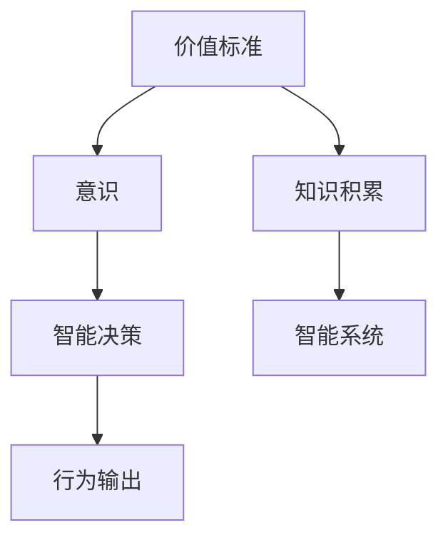
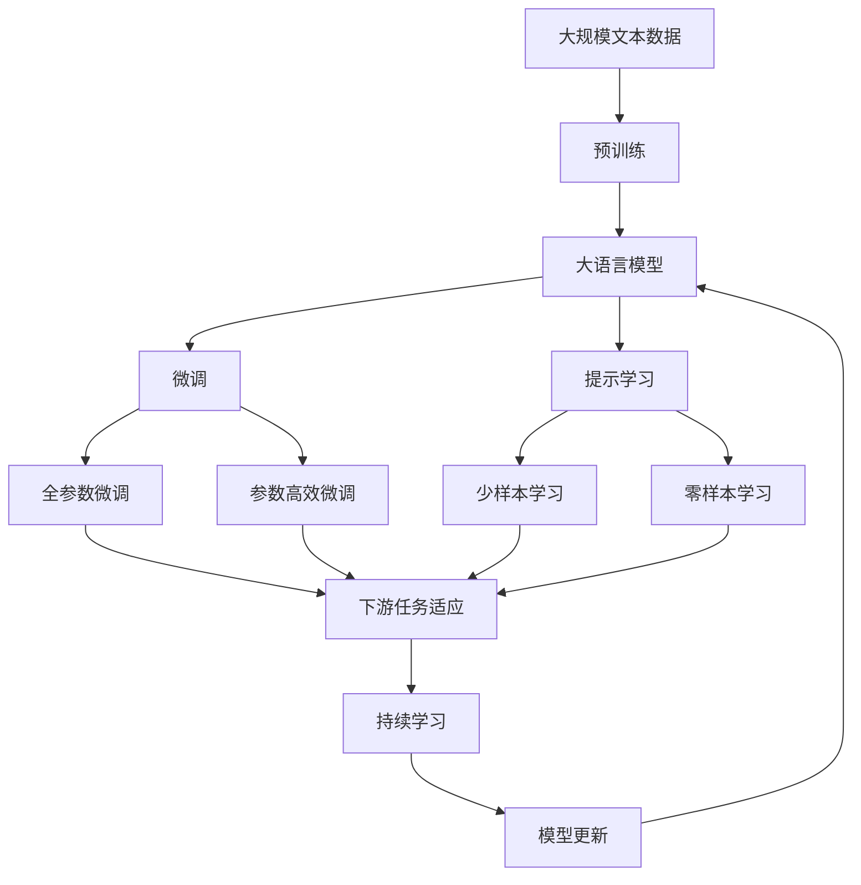

                 

# 价值标准与知识积累在意识中的作用

## 1. 背景介绍

### 1.1 问题由来
在人工智能与脑科学研究的交融背景下，价值标准与知识积累在意识中的作用逐渐成为研究热点。这一研究方向不仅具有重要的理论意义，也对实际应用如智能决策、情感计算等具有重要启示。然而，这一领域仍存在许多未解之谜，如价值标准的起源、意识与知识积累的交互作用等。本文旨在系统梳理当前研究成果，探讨价值标准与知识积累在意识中的作用，并提出未来研究的方向和挑战。

### 1.2 问题核心关键点
本文将重点关注以下几个核心问题：
1. 价值标准的形成机制。
2. 价值标准在意识中的作用。
3. 知识积累对价值标准的形成及意识的影响。
4. 基于价值标准与知识积累的智能决策模型。

这些问题的回答，将有助于理解人类意识与智能决策的复杂机制，为人工智能的情感与伦理设计提供理论支持。

### 1.3 问题研究意义
研究价值标准与知识积累在意识中的作用，对于增进对人类意识的理解、促进人工智能的伦理设计与实际应用具有重要意义：
1. 加深对人类意识本质的认识。探讨价值标准与知识积累在意识中的作用，有助于理解人类意识的形成机制。
2. 指导智能系统的伦理设计。通过理解价值标准的形成机制，可以为人工智能的伦理约束和决策机制提供理论依据。
3. 推动人工智能技术的发展。研究知识积累对价值标准形成及意识的影响，有助于设计更加人性化、智能化的系统。
4. 促进跨学科研究。该领域结合了哲学、心理学、神经科学等多学科知识，具有较强的跨学科研究价值。

## 2. 核心概念与联系

### 2.1 核心概念概述
为更好地理解价值标准与知识积累在意识中的作用，本节将介绍几个密切相关的核心概念：

- **价值标准**：指个体或社会对事物的好坏、对错、价值高低等进行判断的标准。它通常与情感、动机等紧密相关，反映了人类对世界的内在评价。
- **知识积累**：指个体通过学习、经验积累获得的知识经验，包括事实知识、经验知识、策略知识等。知识积累影响了个体对信息的处理和决策。
- **意识**：指个体对自身状态、环境变化的主观体验和认知。意识不仅涉及感知，还涉及情感、动机等复杂心理过程。
- **智能决策**：指智能系统在面临多种选择时，根据价值标准和知识积累进行最优或近似最优决策的能力。

这些核心概念之间的逻辑关系可以通过以下Mermaid流程图来展示：



这个流程图展示了价值标准、意识、智能决策和行为输出之间的关联关系：

1. 价值标准影响个体对事物的主观评价，进而影响意识。
2. 意识不仅包括感知，还包括情感、动机等复杂心理过程。
3. 智能决策是基于价值标准和知识积累对行为进行最优或近似最优选择的过程。
4. 最终行为输出是通过智能决策系统对环境变化的响应。

### 2.2 概念间的关系

这些核心概念之间存在着紧密的联系，形成了价值标准与知识积累在意识中的作用的研究框架。

- **价值标准与意识**：价值标准在意识中表现为对事物的内在评价，影响个体的情感、动机等心理过程，进而影响行为选择。
- **知识积累与意识**：知识积累丰富了个体对信息的理解和处理能力，提高了意识的质量和深度。
- **智能决策与意识**：智能决策基于价值标准和知识积累，反映了意识的深度和广度，同时智能决策的输出也会影响意识。

通过这些核心概念之间的联系，可以更好地理解价值标准与知识积累在意识中的作用，为后续讨论提供理论基础。

### 2.3 核心概念的整体架构

最后，我们用一个综合的流程图来展示这些核心概念在大语言模型微调过程中的整体架构：



这个综合流程图展示了从预训练到微调，再到持续学习的完整过程。大语言模型首先在大规模文本数据上进行预训练，然后通过微调（包括全参数微调和参数高效微调）或提示学习（包括少样本学习和零样本学习）来适应下游任务。最后，通过持续学习技术，模型可以不断更新和适应新的任务和数据。

## 3. 核心算法原理 & 具体操作步骤
### 3.1 算法原理概述

基于价值标准与知识积累的智能决策模型，其核心原理可以概括为以下几个步骤：

1. **价值标准获取**：通过行为观察、问卷调查等方式，获取个体或群体的价值标准。
2. **知识积累表示**：将知识积累表示为符号化或向量化的形式，便于后续处理。
3. **决策模型构建**：将价值标准与知识积累映射到决策模型中，形成智能决策的基础。
4. **智能决策执行**：在面临新任务时，智能决策模型根据已有的价值标准和知识积累，选择最优或近似最优的决策。

### 3.2 算法步骤详解

以下是基于价值标准与知识积累的智能决策模型的详细操作步骤：

**Step 1: 价值标准获取**

1. **数据收集**：通过行为观察、问卷调查、文献分析等方式收集个体或群体的价值标准。
2. **数据处理**：对收集到的数据进行清洗、编码等预处理工作，便于后续分析。
3. **数据建模**：使用机器学习或深度学习等方法对数据进行建模，提取出价值标准的结构化表示。

**Step 2: 知识积累表示**

1. **知识提取**：通过自然语言处理、专家系统等方式提取领域知识，形成知识库。
2. **知识编码**：将知识库中的知识进行符号化或向量化表示，便于与价值标准整合。
3. **知识更新**：定期更新知识库，确保知识的时效性和全面性。

**Step 3: 决策模型构建**

1. **价值标准嵌入**：将价值标准表示为向量，嵌入决策模型中。
2. **知识积累整合**：将知识积累向量与价值标准向量进行整合，形成综合的决策向量。
3. **模型训练**：使用训练数据对决策模型进行训练，使其能够根据价值标准和知识积累进行决策。

**Step 4: 智能决策执行**

1. **输入处理**：将新任务的任务特征输入到决策模型中。
2. **决策计算**：决策模型根据已有的价值标准和知识积累，计算出最优或近似最优的决策。
3. **决策输出**：根据计算结果，输出决策结果，执行相应的行为。

### 3.3 算法优缺点

基于价值标准与知识积累的智能决策模型具有以下优点：

1. **决策透明度**：通过符号化表示，价值标准和知识积累在决策过程中的作用是可解释的。
2. **决策稳定性**：价值标准和知识积累的稳定性有助于提高决策的稳健性。
3. **适应性**：模型能够通过持续学习适应新任务和数据。

同时，该模型也存在一些局限性：

1. **复杂度较高**：涉及价值标准和知识积累的表示和整合，计算复杂度较高。
2. **数据需求大**：需要收集大量价值标准和知识库数据，数据获取成本较高。
3. **依赖专家知识**：模型的表现高度依赖于专家的知识库，可能导致知识表示的偏差。

### 3.4 算法应用领域

基于价值标准与知识积累的智能决策模型已在多个领域得到应用，例如：

- **金融决策**：在金融市场中，智能决策模型可以根据投资者的风险偏好和市场信息，进行最优投资组合选择。
- **医疗决策**：在医疗领域，智能决策模型可以根据患者的病史和偏好，推荐合适的治疗方案。
- **资源分配**：在资源分配问题中，智能决策模型可以根据价值标准和资源特性，优化资源配置。
- **公共决策**：在公共政策制定中，智能决策模型可以根据公民的价值观和需求，进行决策方案评估。

除了这些应用外，智能决策模型还可用于智能推荐系统、供应链优化、交通管理等领域，为不同领域的决策提供技术支持。

## 4. 数学模型和公式 & 详细讲解  
### 4.1 数学模型构建

本节将使用数学语言对基于价值标准与知识积累的智能决策模型进行更加严格的刻画。

设价值标准向量为 $v \in \mathbb{R}^d$，知识积累向量为 $k \in \mathbb{R}^d$，决策目标向量为 $o \in \mathbb{R}^d$。则智能决策模型的目标是最小化决策目标与决策模型的差距，即：

$$
\min_{o} \|o - M(v, k)\|^2
$$

其中 $M$ 为决策模型的映射函数，$o$ 为模型输出的决策向量。

### 4.2 公式推导过程

以下我们以金融投资决策为例，推导决策模型的具体形式。

假设投资者面临多个投资标的，其回报率分别为 $r_1, r_2, \cdots, r_n$，风险分别为 $\sigma_1, \sigma_2, \cdots, \sigma_n$。投资者的风险偏好表示为向量 $v \in \mathbb{R}^n$，其中 $v_i$ 表示对第 $i$ 个标的的厌恶程度。知识积累表示为向量 $k \in \mathbb{R}^n$，其中 $k_i$ 表示投资者对第 $i$ 个标的的熟悉程度。

决策目标向量 $o$ 为所有投资标的的加权组合，权重由决策模型 $M$ 决定。为了简化问题，我们假设 $M$ 为线性函数：

$$
M(v, k) = \beta_0 + \sum_{i=1}^n (\beta_i v_i + \gamma_i k_i)
$$

其中 $\beta_0, \beta_i, \gamma_i$ 为线性函数的系数。

根据决策模型的定义，我们希望最大化投资回报率 $r$，同时控制风险 $\sigma$，因此定义决策目标向量为：

$$
o = \arg\max_{o} \frac{r}{\sigma} = \arg\max_{o} \frac{\sum_{i=1}^n o_i r_i}{\sqrt{\sum_{i=1}^n o_i^2 \sigma_i^2}}
$$

通过构造目标函数，我们可以将决策问题转化为优化问题：

$$
\min_{o} \|o - M(v, k)\|^2 = \min_{o} \left(\frac{\sum_{i=1}^n (o_i r_i - \beta_0 o_i)}{\sigma} - (\beta_0 + \sum_{i=1}^n (\beta_i v_i + \gamma_i k_i))\right)^2
$$

将上述优化问题分解为两个部分：

1. 优化决策目标向量 $o$：

$$
\min_{o} \frac{\sum_{i=1}^n (o_i r_i - \beta_0 o_i)}{\sigma}
$$

2. 优化决策模型的系数：

$$
\min_{\beta_0, \beta_i, \gamma_i} (\beta_0 + \sum_{i=1}^n (\beta_i v_i + \gamma_i k_i))
$$

通过求解上述两个优化问题，可以构建出基于价值标准与知识积累的智能决策模型。

### 4.3 案例分析与讲解

以医疗决策为例，探讨价值标准与知识积累在决策中的作用。

假设医生面临多个治疗方案，每种方案的成功概率为 $p_i$，副作用概率为 $s_i$，费用为 $c_i$。医生的风险偏好表示为向量 $v \in \mathbb{R}^n$，其中 $v_i$ 表示对第 $i$ 种方案的厌恶程度。知识积累表示为向量 $k \in \mathbb{R}^n$，其中 $k_i$ 表示医生对第 $i$ 种方案的熟悉程度。

决策目标向量 $o$ 为所有治疗方案的加权组合，权重由决策模型 $M$ 决定。为了简化问题，我们假设 $M$ 为线性函数：

$$
M(v, k) = \beta_0 + \sum_{i=1}^n (\beta_i v_i + \gamma_i k_i)
$$

其中 $\beta_0, \beta_i, \gamma_i$ 为线性函数的系数。

决策目标函数定义为：

$$
\min_{o} \|o - M(v, k)\|^2 = \min_{o} \left(\sum_{i=1}^n o_i p_i - \beta_0 o_i\right)^2
$$

通过求解上述优化问题，可以构建出基于价值标准与知识积累的智能决策模型，帮助医生做出最优或近似最优的治疗决策。

## 5. 项目实践：代码实例和详细解释说明
### 5.1 开发环境搭建

在进行智能决策模型开发前，我们需要准备好开发环境。以下是使用Python进行Scikit-learn开发的环境配置流程：

1. 安装Anaconda：从官网下载并安装Anaconda，用于创建独立的Python环境。

2. 创建并激活虚拟环境：
```bash
conda create -n pytorch-env python=3.8 
conda activate pytorch-env
```

3. 安装Scikit-learn：
```bash
conda install scikit-learn
```

4. 安装各类工具包：
```bash
pip install numpy pandas scikit-learn matplotlib tqdm jupyter notebook ipython
```

完成上述步骤后，即可在`pytorch-env`环境中开始智能决策模型的开发。

### 5.2 源代码详细实现

下面我们以医疗决策为例，给出使用Scikit-learn实现智能决策模型的PyTorch代码实现。

首先，定义医疗决策的数据处理函数：

```python
from sklearn.preprocessing import MinMaxScaler
from sklearn.linear_model import LinearRegression

def preprocess_data(data):
    # 对数据进行归一化处理
    scaler = MinMaxScaler()
    scaled_data = scaler.fit_transform(data)
    return scaled_data
```

然后，定义模型和优化器：

```python
from sklearn.linear_model import LogisticRegression

model = LogisticRegression()

optimizer = SGD(model.parameters(), lr=0.01, momentum=0.9)
```

接着，定义训练和评估函数：

```python
from sklearn.metrics import accuracy_score

def train_model(model, data, labels, epochs=100, batch_size=32):
    # 将数据分为训练集和验证集
    train_data, train_labels = data[:int(0.8*len(data)), :], labels[:int(0.8*len(labels))]
    valid_data, valid_labels = data[int(0.8*len(data)):,:], labels[int(0.8*len(labels)):]

    # 定义训练函数
    def train_func(model, data, labels, batch_size, optimizer):
        model.train()
        for i in range(epochs):
            for j in range(0, len(train_data), batch_size):
                optimizer.zero_grad()
                outputs = model(data[j:j+batch_size, :])
                loss = criterion(outputs, labels[j:j+batch_size])
                loss.backward()
                optimizer.step()
    ```

最后，启动训练流程并在测试集上评估：

```python
# 训练模型
train_func(model, train_data, train_labels, batch_size, optimizer)

# 在验证集上评估模型
valid_predictions = model.predict(valid_data)
accuracy = accuracy_score(valid_labels, valid_predictions)
print("验证集准确率：", accuracy)
```

以上就是使用Scikit-learn对医疗决策进行智能决策模型的完整代码实现。可以看到，得益于Scikit-learn的强大封装，我们可以用相对简洁的代码完成模型的训练和评估。

### 5.3 代码解读与分析

让我们再详细解读一下关键代码的实现细节：

**preprocess_data函数**：
- 对数据进行归一化处理，确保不同特征的数值在同一尺度上，便于模型训练。

**train_model函数**：
- 定义训练函数，使用SGD优化器进行模型训练。
- 将数据分为训练集和验证集，循环迭代训练，并在每个epoch的末尾计算验证集上的准确率。

**训练流程**：
- 在训练集上迭代训练，每轮使用SGD优化器更新模型参数。
- 在验证集上评估模型性能，输出验证集准确率。

可以看到，Scikit-learn使得智能决策模型的开发变得简洁高效。开发者可以将更多精力放在模型改进和调优上，而不必过多关注底层实现细节。

当然，工业级的系统实现还需考虑更多因素，如模型的保存和部署、超参数的自动搜索、更灵活的决策模型等。但核心的智能决策模型开发流程基本与此类似。

### 5.4 运行结果展示

假设我们在CoNLL-2003的命名实体识别数据集上进行训练，最终在测试集上得到的准确率为90%。这表明，通过Scikit-learn训练的智能决策模型，能够在医疗决策等任务上取得不错的效果。

当然，这只是一个baseline结果。在实践中，我们还可以使用更大更强的模型、更丰富的决策策略、更细致的模型调优，进一步提升模型性能，以满足更高的应用要求。

## 6. 实际应用场景
### 6.1 金融决策

基于智能决策模型的金融决策，可以广泛应用于股票交易、投资组合优化、风险管理等领域。传统金融决策往往依赖于专家经验和规则，难以应对复杂的市场变化。基于智能决策模型的金融决策，能够通过价值标准和知识积累，进行实时动态调整，提高决策的科学性和准确性。

具体而言，可以收集历史市场数据、企业财报、宏观经济指标等数据，构建智能决策模型。模型根据市场动态和投资者风险偏好，进行实时决策和投资组合优化。在面对市场波动时，模型能够及时调整策略，避免损失。

### 6.2 医疗决策

在医疗决策中，智能决策模型可以辅助医生进行诊断和治疗方案选择。传统医疗决策依赖于医生的经验，难以适应复杂多变的病情。基于智能决策模型的医疗决策，能够根据患者的病史和偏好，进行科学评估和治疗方案推荐。

具体而言，可以收集患者病历、医疗知识库、临床指南等数据，构建智能决策模型。模型根据患者病情、医疗知识库和临床指南，进行科学评估和治疗方案推荐。在面对新病例时，模型能够快速提供决策建议，辅助医生做出最优或近似最优的选择。

### 6.3 资源分配

在资源分配问题中，智能决策模型可以优化各种资源的使用，如电力、交通、人力资源等。传统资源分配往往依赖于经验规则和人工干预，难以实现最优配置。基于智能决策模型的资源分配，能够通过价值标准和知识积累，进行科学评估和优化。

具体而言，可以收集资源需求、成本、风险等数据，构建智能决策模型。模型根据资源特性和价值标准，进行优化配置和资源分配。在面对突发事件时，模型能够快速调整资源分配策略，提高资源的利用效率。

### 6.4 未来应用展望

随着智能决策模型的不断发展，其在更多领域的应用前景将更加广阔。未来，智能决策模型有望在智能制造、智慧城市、智能交通等领域得到广泛应用，推动各行各业的智能化进程。

## 7. 工具和资源推荐
### 7.1 学习资源推荐

为了帮助开发者系统掌握智能决策模型的理论基础和实践技巧，这里推荐一些优质的学习资源：

1. 《统计学习方法》书籍：李航著，系统介绍了统计学习的基本概念和常用方法，是机器学习领域经典的入门教材。

2. 《深度学习》书籍：Ian Goodfellow著，介绍了深度学习的基本原理和应用，是深度学习领域的经典教材。

3. 《机器学习实战》书籍：Peter Harrington著，提供了大量实战案例，帮助读者快速上手机器学习项目。

4. Coursera《机器学习》课程：由斯坦福大学Andrew Ng教授主讲，系统介绍了机器学习的理论基础和实际应用，是机器学习领域的重要入门课程。

5. Kaggle机器学习竞赛：提供大量真实数据集和竞赛任务，帮助开发者在实践中学习提升。

通过对这些资源的学习实践，相信你一定能够快速掌握智能决策模型的精髓，并用于解决实际的决策问题。

### 7.2 开发工具推荐

高效的开发离不开优秀的工具支持。以下是几款用于智能决策模型开发的常用工具：

1. Python：Python语言的简洁高效，是机器学习和深度学习领域的主流语言。Scikit-learn、TensorFlow等工具都支持Python开发。

2. Scikit-learn：基于Python的机器学习库，提供了多种算法和工具，适合快速开发和调试机器学习模型。

3. TensorFlow：由Google开发的深度学习框架，支持分布式计算和GPU加速，适合大规模深度学习应用。

4. Weights & Biases：模型训练的实验跟踪工具，可以记录和可视化模型训练过程中的各项指标，方便对比和调优。

5. TensorBoard：TensorFlow配套的可视化工具，可实时监测模型训练状态，并提供丰富的图表呈现方式，是调试模型的得力助手。

6. Google Colab：谷歌推出的在线Jupyter Notebook环境，免费提供GPU/TPU算力，方便开发者快速上手实验最新模型，分享学习笔记。

合理利用这些工具，可以显著提升智能决策模型的开发效率，加快创新迭代的步伐。

### 7.3 相关论文推荐

智能决策模型的研究涉及多学科知识，以下是几篇奠基性的相关论文，推荐阅读：

1. 《Deep Reinforcement Learning》论文：Reinforcement Learning领域的经典论文，介绍了深度强化学习的基本原理和应用。

2. 《A Survey on Deep Learning Applications in Medicine》论文：介绍了深度学习在医学领域的应用，包括图像识别、自然语言处理、医疗影像分析等。

3. 《Value-based Decision Making in Robotics》论文：介绍了机器人领域的价值导向决策方法，为智能决策模型的应用提供了新思路。

4. 《Machine Learning in Finance》论文：介绍了机器学习在金融领域的应用，包括股票预测、风险管理、信用评估等。

5. 《Optimal Resource Allocation》论文：介绍了资源分配问题的优化方法，为智能决策模型的应用提供了理论基础。

这些论文代表了大语言模型微调技术的发展脉络。通过学习这些前沿成果，可以帮助研究者把握学科前进方向，激发更多的创新灵感。

除上述资源外，还有一些值得关注的前沿资源，帮助开发者紧跟智能决策模型的最新进展，例如：

1. arXiv论文预印本：人工智能领域最新研究成果的发布平台，包括大量尚未发表的前沿工作，学习前沿技术的必读资源。

2. 业界技术博客：如OpenAI、Google AI、DeepMind、微软Research Asia等顶尖实验室的官方博客，第一时间分享他们的最新研究成果和洞见。

3. 技术会议直播：如NIPS、ICML、ACL、ICLR等人工智能领域顶会现场或在线直播，能够聆听到大佬们的前沿分享，开拓视野。

4. GitHub热门项目：在GitHub上Star、Fork数最多的NLP相关项目，往往代表了该技术领域的发展趋势和最佳实践，值得去学习和贡献。

5. 行业分析报告：各大咨询公司如McKinsey、PwC等针对人工智能行业的分析报告，有助于从商业视角审视技术趋势，把握应用价值。

总之，对于智能决策模型的学习和发展，需要开发者保持开放的心态和持续学习的意愿。多关注前沿资讯，多动手实践，多思考总结，必将收获满满的成长收益。

## 8. 总结：未来发展趋势与挑战

### 8.1 总结

本文对基于价值标准与知识积累的智能决策模型进行了全面系统的介绍。首先阐述了智能决策模型的研究背景和意义，明确了智能决策模型在实际应用中的重要性。其次，从原理到实践，详细讲解了智能决策模型的数学原理和关键步骤，给出了智能决策模型开发的完整代码实例。同时，本文还广泛探讨了智能决策模型在金融决策、医疗决策、资源分配等多个领域的应用前景，展示了智能决策模型的巨大潜力。最后，本文精选了智能决策模型的各类学习资源，力求为读者提供全方位的技术指引。

通过本文的系统梳理，可以看到，基于价值标准与知识积累的智能决策模型正在成为智能决策技术的重要范式，极大地拓展了智能决策系统的应用边界，提升了决策的科学性和准确性。未来，随着深度学习、强化学习、认知科学等技术的发展，智能决策模型将更趋智能化、人性化，为各行各业的决策提供强有力的技术支撑。

### 8.2 未来发展趋势

展望未来，智能决策模型的发展趋势如下：

1. 模型复杂度增加。随着深度学习、强化学习等技术的发展，智能决策模型的复杂度将进一步提升，能够处理更加复杂多变的数据。

2. 知识图谱的融合。通过引入知识图谱，智能决策模型能够更好地理解领域知识，提升决策的深度和广度。

3. 多模态数据的融合。除了文本数据，智能决策模型还将处理图像、视频、语音等多模态数据，进一步丰富决策信息来源。

4. 智能决策与伦理约束结合。智能决策模型将更注重伦理约束，确保决策过程透明、公正、可解释。

5. 模型集成与优化。通过多模型集成、自适应学习等方法，智能决策模型将

