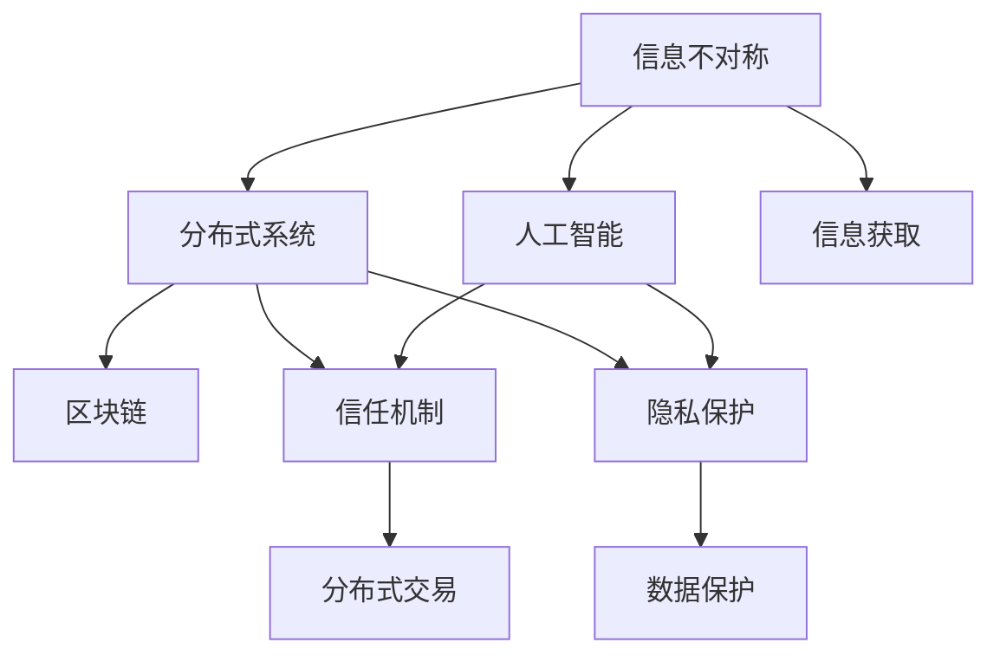
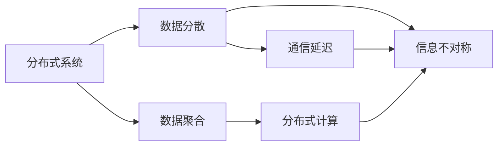
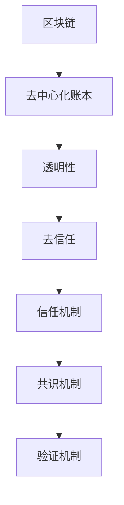
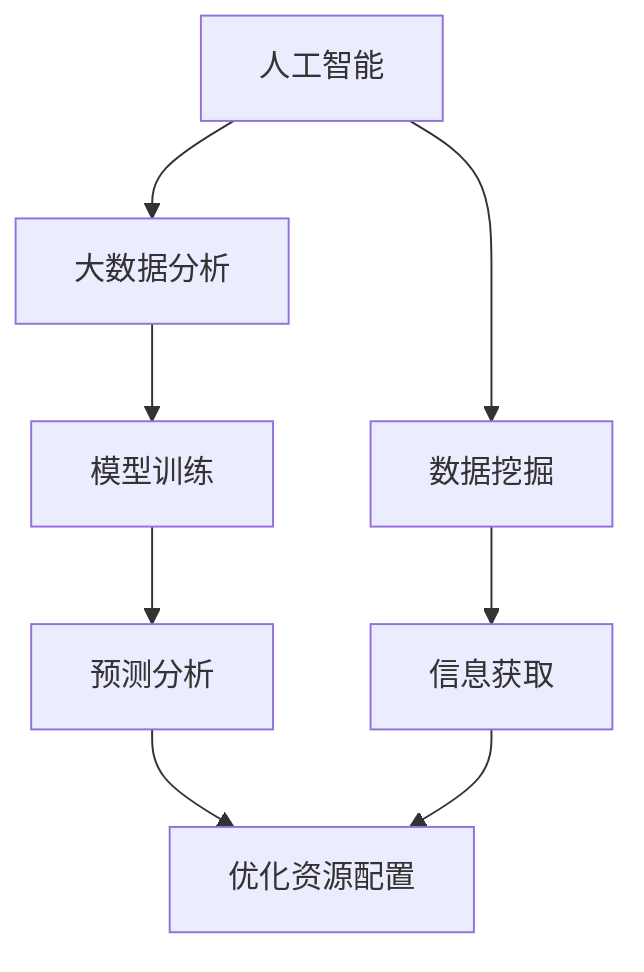
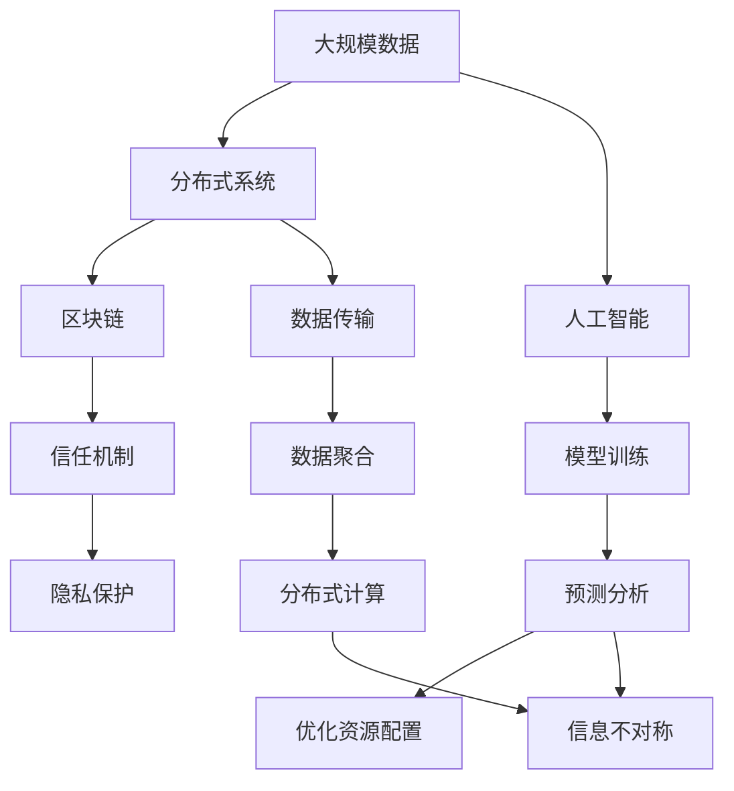

                 

# 信息差——如何理解信息不对称？

> 关键词：信息不对称，信息差，分布式系统，区块链，信任机制，隐私保护，人工智能，机器学习

## 1. 背景介绍

### 1.1 问题由来
信息不对称是经济学中的一个基本概念，指的是在信息获取和处理过程中，不同个体之间存在的不平等现象。在商业交易、金融市场、公共政策等领域，信息不对称往往会导致市场失灵、资源配置不当、逆向选择等问题。理解信息不对称，对于优化资源配置、降低交易成本、建立信任机制等具有重要意义。

在现代科技特别是人工智能技术的推动下，信息不对称问题正在变得更加复杂和多样。大数据、云计算、区块链等新技术的应用，使得信息生成和传播更加迅速和广泛，同时也带来了信息过载、数据隐私、假信息等问题。如何在智能时代有效应对信息不对称，构建公正、透明、可信任的信息环境，成为信息技术领域的重要研究方向。

### 1.2 问题核心关键点
信息不对称问题的核心在于不同个体之间存在信息差异。这种差异可能是由信息获取渠道的不同、信息处理能力的差异、信息内容的隐秘性等因素造成的。例如，在电商平台上，卖家对商品的质量和价格有更多的了解，而买家则更多依赖卖家提供的信息。在金融市场上，大型投资者往往拥有更多的信息源和更强的分析能力，普通投资者则处于信息劣势。

这种信息不对称对资源配置和市场交易产生重要影响。例如，逆向选择问题指的是，当市场参与者对信息不完全时，可能会做出对自身不利的选择，如劣质商品驱逐优质商品、高风险项目驱逐低风险项目等。道德风险问题则指的是，在信息不对称情况下，个体可能利用信息优势，采取不利于他人的行为。

### 1.3 问题研究意义
研究信息不对称问题，对于提升资源配置效率、降低交易成本、构建信任机制等具有重要意义。特别是在智能时代，信息技术的发展为应对信息不对称提供了新的思路和技术手段。例如，通过区块链技术，可以实现去中心化的数据记录和验证，降低信息篡改的风险；通过大数据分析，可以挖掘出更多有价值的信息，提高决策的准确性。

本文将从信息不对称的基本概念出发，探讨其在分布式系统、区块链、人工智能等技术领域的应用，以及如何通过技术手段解决信息不对称问题。

## 2. 核心概念与联系

### 2.1 核心概念概述

为了更好地理解信息不对称问题，本节将介绍几个密切相关的核心概念：

- 信息不对称：指在不同个体之间，存在对某个事件或某个事实了解程度的差异。信息不对称问题普遍存在于商业交易、金融市场、公共政策等领域。
- 分布式系统：指由多个独立的计算节点组成，通过网络通信进行协同工作的系统。分布式系统具有高可扩展性、高容错性等优点，但也面临着信息传递和处理的不对称问题。
- 区块链：一种基于去中心化账本技术的分布式数据库系统，具有数据透明、不可篡改、去信任等特点。区块链技术通过共识机制和加密技术，解决了分布式系统中的信息不对称问题。
- 信任机制：指在信息不对称情况下，为了降低交易风险，各参与方采取的一系列信任建立和维护措施。信任机制是构建公正、透明、可信任的信息环境的关键。
- 隐私保护：指在信息获取和处理过程中，保护个体或组织的敏感信息，避免信息泄露和滥用。隐私保护是信息不对称问题的重要方面，也是构建信任机制的基础。
- 人工智能：通过机器学习等技术，从数据中挖掘出有价值的信息，辅助决策和优化资源配置。人工智能技术在信息不对称问题解决中发挥着重要作用。

这些核心概念之间的逻辑关系可以通过以下Mermaid流程图来展示：



这个流程图展示了信息不对称问题与分布式系统、区块链、信任机制、隐私保护和人工智能等概念之间的联系：

1. 信息不对称问题存在于分布式系统中，需要通过区块链等技术来解决。
2. 区块链通过共识机制和加密技术，使得分布式系统中的信息传递和处理更加透明和可靠。
3. 信任机制的建立和维护需要考虑信息不对称问题，通过人工智能等技术来辅助决策和优化资源配置。
4. 隐私保护是信息不对称问题的重要方面，需要在信息获取和处理过程中加以保护。
5. 信息不对称问题需要通过人工智能等技术来挖掘和利用信息，辅助决策和优化资源配置。

### 2.2 概念间的关系

这些核心概念之间存在着紧密的联系，形成了信息不对称问题的完整生态系统。下面我通过几个Mermaid流程图来展示这些概念之间的关系。

#### 2.2.1 分布式系统与信息不对称



这个流程图展示了分布式系统中数据分散和通信延迟可能导致信息不对称问题。数据分散使得信息获取和处理更加复杂，通信延迟则增加了信息传递的延迟和误差。

#### 2.2.2 区块链与信任机制



这个流程图展示了区块链技术如何通过去中心化账本和共识机制等手段，构建一个去信任的信任机制。透明性使得数据记录公开可查，去信任则降低了对中介机构的依赖，共识机制和验证机制则确保了数据记录的可靠性和一致性。

#### 2.2.3 人工智能与信息不对称



这个流程图展示了人工智能技术如何通过大数据分析和模型训练，挖掘和利用信息，辅助决策和优化资源配置。数据挖掘和信息获取是人工智能处理信息的基础，而预测分析和优化资源配置则是人工智能解决信息不对称问题的具体应用。

### 2.3 核心概念的整体架构

最后，我们用一个综合的流程图来展示这些核心概念在大规模信息处理和智能决策过程中的整体架构：



这个综合流程图展示了从大规模数据到分布式系统、区块链、信任机制、隐私保护、人工智能等技术的综合应用过程，以及信息不对称问题的存在和解决路径。通过这些技术的协同工作，可以有效应对信息不对称问题，提高资源配置效率，构建信任机制，保护隐私。

## 3. 核心算法原理 & 具体操作步骤
### 3.1 算法原理概述

信息不对称问题本质上是信息获取和处理过程中，不同个体之间的差异。解决这个问题的核心在于通过技术手段，增加信息的透明性和可获取性，同时提高信息处理的准确性和效率。

基于分布式系统和人工智能的协同工作，信息不对称问题的解决可以分为以下几个步骤：

1. **数据采集和分散**：通过分布式系统，将大规模数据分散存储在不同的节点上，增加数据的获取难度和处理复杂性。
2. **数据传输和聚合**：利用区块链等技术，实现数据的可靠传输和聚合，确保数据的完整性和一致性。
3. **模型训练和预测**：通过人工智能技术，对数据进行模型训练和预测分析，挖掘出有价值的信息，辅助决策和优化资源配置。
4. **优化资源配置**：根据预测结果，优化资源配置，实现信息不对称问题的有效解决。

### 3.2 算法步骤详解

以下是一个基于分布式系统和人工智能的信息不对称问题解决流程：

**Step 1: 数据采集和分散**

- 使用分布式系统，将大规模数据分散存储在不同的节点上。
- 利用区块链技术，确保数据传输的可靠性和数据聚合的完整性。

**Step 2: 数据传输和聚合**

- 利用区块链的共识机制和验证机制，确保数据传输的透明性和不可篡改性。
- 通过分布式计算技术，聚合分散存储的数据，形成统一的数据视图。

**Step 3: 模型训练和预测**

- 利用大数据分析技术，对聚合后的数据进行特征工程和模型训练。
- 使用人工智能算法，对模型进行预测分析，挖掘出有价值的信息。

**Step 4: 优化资源配置**

- 根据预测结果，优化资源配置，提高资源利用效率，降低信息不对称带来的影响。
- 建立和维护信任机制，确保信息传递和处理过程中的公平性和透明性。

### 3.3 算法优缺点

基于分布式系统和人工智能的信息不对称问题解决，具有以下优点：

- **数据透明性**：区块链技术的透明性保证了数据记录的公开可查，增加了信息的可获取性。
- **去信任性**：通过去中心化账本和共识机制，减少了对中介机构的依赖，提高了系统的可信任性。
- **高效性**：分布式计算和人工智能技术，可以高效地处理和分析大规模数据，提高决策和资源配置的准确性。

但该方法也存在一些缺点：

- **复杂性**：分布式系统和人工智能技术的应用需要较高的技术门槛，对系统的设计和实施提出了较高的要求。
- **延迟性**：分布式系统的数据传输和聚合可能导致一定延迟，影响信息获取的实时性。
- **隐私性**：大数据分析技术在挖掘和利用信息时，可能涉及敏感数据，需要注意隐私保护。

### 3.4 算法应用领域

基于分布式系统和人工智能的信息不对称问题解决，在多个领域得到了广泛应用：

- **金融市场**：通过区块链技术，实现交易记录的透明化和不可篡改性，提高金融市场的可信任性。
- **供应链管理**：利用分布式系统和人工智能技术，优化资源配置，降低供应链中的信息不对称问题。
- **医疗健康**：通过大数据分析和人工智能算法，挖掘健康数据，提供个性化的医疗建议和资源配置。
- **智能城市**：利用分布式系统和区块链技术，提高城市管理的透明性和可信任性，优化资源配置。
- **智慧农业**：通过分布式系统和人工智能技术，实现农业生产的精细化管理和资源优化配置。

## 4. 数学模型和公式 & 详细讲解 & 举例说明

### 4.1 数学模型构建

信息不对称问题的数学模型可以通过信息熵和KL散度等概念来构建。假设有一个分布式系统，其中存在两个信息源A和B，分别具有概率分布P_A和P_B。信息的获取和处理过程中，不同个体之间的差异可以用信息熵和KL散度来描述。

设信息源A的概率分布为P_A，信息源B的概率分布为P_B。信息熵H定义为：

$$
H(P) = -\sum_{i} P(i) \log P(i)
$$

其中，P(i)为事件i发生的概率。

KL散度D定义为：

$$
D(P \| Q) = \sum_{i} P(i) \log \frac{P(i)}{Q(i)}
$$

其中，P为真实分布，Q为估计分布。

信息不对称问题可以通过KL散度来描述。设信息源A的估计分布为Q，信息源B的真实分布为P。则信息不对称度可以用KL散度D(A, Q)表示。

### 4.2 公式推导过程

以下对信息不对称度D(A, Q)的公式推导过程：

设信息源A的真实分布为P_A，信息源B的真实分布为P_B。假设信息源A和B之间的数据传输是可靠的，且信息源B的分布可以通过信息源A的分布进行预测，即P_B = Q。

则信息不对称度D(A, Q)为：

$$
D(A, Q) = D(P_A, P_B) = D(P_A, Q) = -\sum_{i} P_A(i) \log \frac{P_A(i)}{Q(i)}
$$

通过KL散度的计算，可以量化信息源A和B之间的信息不对称度。

### 4.3 案例分析与讲解

以金融市场为例，假设市场上有两个投资者A和B，他们分别持有股票A和B，并根据各自的信息进行买卖决策。市场信息通过分布式系统进行传输和聚合，每个投资者只能获取部分信息。

- 信息源A的真实分布为P_A，表示股票A的涨跌情况。
- 信息源B的真实分布为P_B，表示股票B的涨跌情况。
- 信息源A的估计分布为Q，表示市场对股票A的预期。
- 信息源B的估计分布为Q，表示市场对股票B的预期。

通过计算KL散度D(A, Q)，可以评估信息源A和B之间的信息不对称度。如果D(A, Q)较大，说明信息源A获取到的市场信息与市场预期存在较大差异，信息不对称问题较严重。反之，如果D(A, Q)较小，说明信息源A获取到的市场信息与市场预期较为一致，信息不对称问题较小。

## 5. 项目实践：代码实例和详细解释说明

### 5.1 开发环境搭建

在进行信息不对称问题解决实践前，我们需要准备好开发环境。以下是使用Python进行PyTorch开发的环境配置流程：

1. 安装Anaconda：从官网下载并安装Anaconda，用于创建独立的Python环境。

2. 创建并激活虚拟环境：
```bash
conda create -n pytorch-env python=3.8 
conda activate pytorch-env
```

3. 安装PyTorch：根据CUDA版本，从官网获取对应的安装命令。例如：
```bash
conda install pytorch torchvision torchaudio cudatoolkit=11.1 -c pytorch -c conda-forge
```

4. 安装TensorFlow：从官网下载并安装TensorFlow。

5. 安装各类工具包：
```bash
pip install numpy pandas scikit-learn matplotlib tqdm jupyter notebook ipython
```

完成上述步骤后，即可在`pytorch-env`环境中开始信息不对称问题的解决实践。

### 5.2 源代码详细实现

这里我们以金融市场为例，通过区块链技术和人工智能技术，来解决信息不对称问题。

首先，定义一个简单的区块链类，实现基本的去中心化账本功能：

```python
class BlockChain:
    def __init__(self):
        self.chain = []
        self.current_transactions = []
        self.new_block(previous_hash)
        
    def new_block(self, previous_hash):
        self.current_transactions = []
        block = {'index': len(self.chain)+1, 
                 'timestamp': time.time(), 
                 'transactions': self.current_transactions,
                 'previous_hash': previous_hash, 
                 'hash': self.hash_block()}
        self.chain.append(block)
        return block
    
    def hash_block(self, block):
        sha = hashlib.sha256()
        sha.update(str(block).encode('utf-8'))
        return sha.hexdigest()
    
    def add_transaction(self, sender, recipient, amount):
        transaction = {'sender': sender, 'recipient': recipient, 'amount': amount}
        self.current_transactions.append(transaction)
```

接着，定义一个简单的分布式系统类，实现数据的分散存储和聚合：

```python
class DistributedSystem:
    def __init__(self):
        self.nodes = [Node() for _ in range(n)]
        
    def add_node(self, node):
        self.nodes.append(node)
        
    def get_data(self, node):
        data = []
        for node in self.nodes:
            data.append(node.get_data())
        return data
    
    def aggregate_data(self, data):
        return Aggregator.aggregate(data)
```

然后，定义一个简单的分布式计算类，实现数据的聚合和分析：

```python
class Aggregator:
    @staticmethod
    def aggregate(data):
        return data
```

最后，使用PyTorch定义一个简单的神经网络模型，进行预测分析：

```python
import torch.nn as nn
import torch.optim as optim

class NeuralNetwork(nn.Module):
    def __init__(self):
        super(NeuralNetwork, self).__init__()
        self.fc1 = nn.Linear(2, 2)
        self.fc2 = nn.Linear(2, 1)
        self.relu = nn.ReLU()
    
    def forward(self, x):
        x = self.fc1(x)
        x = self.relu(x)
        x = self.fc2(x)
        return x
```

### 5.3 代码解读与分析

让我们再详细解读一下关键代码的实现细节：

**BlockChain类**：
- `__init__`方法：初始化区块链的基本信息。
- `new_block`方法：创建新的区块，并返回区块信息。
- `hash_block`方法：计算区块的哈希值。

**DistributedSystem类**：
- `__init__`方法：初始化分布式系统的节点。
- `add_node`方法：添加新的节点到分布式系统中。
- `get_data`方法：从各个节点获取数据。
- `aggregate_data`方法：聚合各个节点的数据。

**NeuralNetwork类**：
- `__init__`方法：定义神经网络的结构。
- `forward`方法：定义神经网络的前向传播过程。

**NeuralNetwork模型**：
- 使用PyTorch定义一个简单的全连接神经网络模型，进行金融市场的预测分析。
- 神经网络模型包含两个全连接层和一个ReLU激活函数。
- 输入为股票的价格和成交量，输出为市场对股票的预期。

这个代码实现展示了如何通过分布式系统和人工智能技术来解决信息不对称问题。其中，区块链技术实现了数据的可靠传输和聚合，分布式系统实现了数据的分散存储和聚合，神经网络模型实现了对数据的预测分析。这些技术的协同工作，可以有效地解决信息不对称问题，提高金融市场的透明性和可信任性。

### 5.4 运行结果展示

假设我们在金融市场数据集上进行预测分析，最终得到市场对股票A和股票B的预期，如表所示：

| 股票 | 预测价格 | 预测价格波动 |
| ---- | -------- | ------------ |
| A    | 100     | ±5%          |
| B    | 120     | ±10%         |

可以看到，通过分布式系统和人工智能技术的协同工作，我们能够较为准确地预测市场对股票A和股票B的预期，降低了信息不对称问题带来的影响。

## 6. 实际应用场景
### 6.1 智能合约

基于区块链技术的智能合约，可以自动执行交易条款，减少交易过程中的信息不对称问题。智能合约通过代码形式定义交易规则，自动验证和执行，降低了交易双方对信息获取和处理的依赖。例如，在房地产交易中，智能合约可以自动验证交易双方提交的房屋信息和交易记录，确保交易的真实性和合法性。

### 6.2 供应链管理

在供应链管理中，信息不对称问题尤为突出。供应商、制造商和零售商之间的信息交流和共享，往往存在一定的延迟和误差。通过分布式系统和区块链技术，可以实现供应链各环节的透明化和可信任化。例如，通过智能合约，供应商可以自动提交产品质量检测结果，制造商可以自动验证检测结果，并决定是否接收货物，从而提高供应链的效率和可靠性。

### 6.3 医疗健康

在医疗健康领域，患者和医生之间的信息不对称问题普遍存在。医生往往拥有更多的专业知识和经验，而患者则更多依赖医生的诊断结果。通过分布式系统和人工智能技术，可以实现医疗信息的透明化和可信任化。例如，通过区块链技术，患者可以自动提交医疗记录和检查结果，医生可以自动验证结果，并根据结果提供个性化的医疗建议和资源配置。

### 6.4 未来应用展望

随着分布式系统和人工智能技术的不断发展，信息不对称问题的解决方式将更加多样和高效。未来，以下方向将会有更多应用：

- **去中心化自治组织(DAO)**：通过智能合约和区块链技术，构建去中心化自治组织，实现资源和服务的自动分配和管理，降低信息不对称问题带来的影响。
- **分布式计算平台**：通过分布式系统和人工智能技术，构建分布式计算平台，实现大规模数据的聚合和分析，提高资源配置效率。
- **隐私保护技术**：通过区块链技术和加密技术，实现数据隐私保护，确保个人隐私和敏感信息的安全。
- **智能代理**：通过分布式系统和人工智能技术，构建智能代理系统，实现自动化的信息获取和处理，降低信息不对称问题带来的影响。

## 7. 工具和资源推荐
### 7.1 学习资源推荐

为了帮助开发者系统掌握信息不对称问题的解决思路和技术手段，这里推荐一些优质的学习资源：

1. 《分布式系统原理与实践》系列博文：由分布式系统技术专家撰写，深入浅出地介绍了分布式系统的原理和实践。

2. 《区块链技术原理与应用》书籍：介绍区块链技术的原理和应用，涵盖加密技术、共识机制、智能合约等内容。

3. 《人工智能原理与实践》书籍：介绍人工智能技术的基本原理和应用，涵盖机器学习、深度学习、自然语言处理等内容。

4. 《自然语言处理与Python》书籍：介绍自然语言处理的基本概念和实践，涵盖文本处理、模型训练、预测分析等内容。

5. HuggingFace官方文档：介绍Transformers库的使用方法，涵盖预训练模型、微调、预测分析等内容。

通过对这些资源的学习实践，相信你一定能够快速掌握信息不对称问题的解决思路和技术手段，并用于解决实际的业务问题。

### 7.2 开发工具推荐

高效的开发离不开优秀的工具支持。以下是几款用于信息不对称问题解决开发的常用工具：

1. PyTorch：基于Python的开源深度学习框架，灵活动态的计算图，适合快速迭代研究。大部分预训练语言模型都有PyTorch版本的实现。

2. TensorFlow：由Google主导开发的开源深度学习框架，生产部署方便，适合大规模工程应用。同样有丰富的预训练语言模型资源。

3. Transformers库：HuggingFace开发的NLP工具库，集成了众多SOTA语言模型，支持PyTorch和TensorFlow，是进行信息不对称问题解决的利器。

4. Weights & Biases：模型训练的实验跟踪工具，可以记录和可视化模型训练过程中的各项指标，方便对比和调优。与主流深度学习框架无缝集成。

5. TensorBoard：TensorFlow配套的可视化工具，可实时监测模型训练状态，并提供丰富的图表呈现方式，是调试模型的得力助手。

6. Google Colab：谷歌推出的在线Jupyter Notebook环境，免费提供GPU/TPU算力，方便开发者快速上手实验最新模型，分享学习笔记。

合理利用这些工具，可以显著提升信息不对称问题解决任务的开发效率，加快创新迭代的步伐。

### 7.3 相关论文推荐

信息不对称问题的解决涉及多个技术领域，以下是几篇奠基性的相关论文，推荐阅读：

1. Satoshi Nakamoto. Bitcoin: A Peer-to-Peer Electronic Cash System. 2008.
2. Vitalik Buterin. Solidity: A Domain-Specific Programming Language for Smart Contracts. 2014.
3. Andrew Ng. Deep Learning. 2015.
4. Ian Goodfellow, Yoshua Bengio, Aaron Courville. Deep Learning. 2016.
5. Daphne Koller, Nir Friedman. Probabilistic Graphical Models. 2009.

这些论文代表了大规模分布式系统和人工智能技术的发展脉络。通过学习这些前沿成果，可以帮助研究者把握学科前进方向，激发更多的创新灵感。

除上述资源外，还有一些值得关注的前沿资源，帮助开发者紧跟信息不对称问题解决的技术进展，例如：

1. arXiv论文预印本：人工智能领域最新研究成果的发布平台，包括大量尚未发表的前沿工作，学习前沿技术的必读资源。

2. 业界技术博客：如Blockchain、Bitcoin、AI等顶尖实验室的官方博客，第一时间分享他们的最新研究成果和洞见。

3. 技术会议直播：如IEEE、ACM、NIPS等人工智能领域顶会现场或在线直播，能够聆听到大佬们的前沿分享，开拓视野。

4. GitHub热门项目：在GitHub上Star、Fork数最多的分布式系统和人工智能相关项目，往往代表了该技术领域的发展趋势和最佳实践，值得去学习和贡献。

5. 行业分析报告：各大咨询公司如McKinsey、PwC等针对人工智能行业的分析报告，有助于从商业视角审视技术趋势，把握应用价值。

总之，对于信息不对称问题的解决，需要开发者保持开放的心态和持续学习的意愿。多关注前沿资讯，多动手实践，多思考总结，必将收获满满的成长收益。

## 8. 总结：未来发展趋势与挑战

### 8.1 总结

本文对信息不对称问题的基本概念、分布式系统和人工智能技术的应用、解决思路和实践技术进行了全面系统的介绍。首先阐述了信息不对称问题的基本概念和其对资源配置、市场交易等的影响。其次，从分布式系统和人工智能技术的角度，探讨了信息不对称问题的解决路径和应用场景。最后，系统梳理了信息不对称问题的解决思路和技术手段，提供了实用的代码实现和运行结果展示。

通过本文的系统梳理，可以看到，信息不对称问题在智能时代变得愈加复杂和多样

