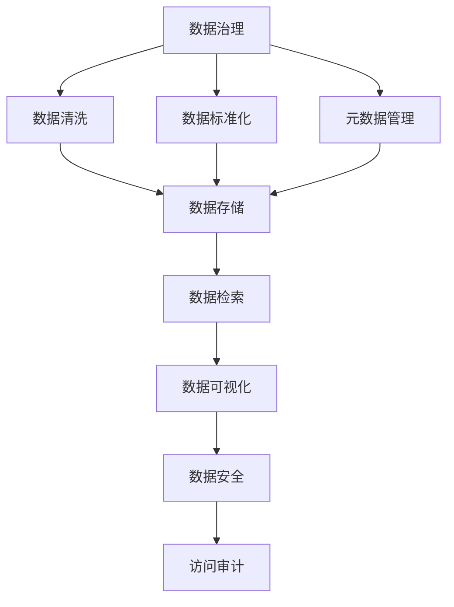

                 

# 信息管理的艺术：如何简化你的生活和工作

## 1. 背景介绍

### 1.1 问题由来
在当今信息爆炸的时代，我们每天都被大量的信息所包围。无论是工作中的文档、邮件，还是生活中的新闻、视频，信息无处不在，无时不刻影响着我们的工作和生活。然而，信息过载并不意味着信息量越大，我们的生活就越高效、越轻松。相反，信息的管理和整理往往成为我们日常工作中最繁琐、最耗时的任务之一。如何有效地管理和利用信息，使我们能够从繁杂的信息中找到有价值的内容，提升工作效率和生活质量，成为了现代科技环境下的一项重要课题。

### 1.2 问题核心关键点
信息管理的关键在于如何建立一套高效、灵活、可扩展的信息组织和检索体系，使得我们能够快速、准确地获取所需信息，同时避免信息过载和噪音干扰。这一过程涉及数据的收集、清洗、存储、分析和检索等多个环节。传统的信息管理方法往往依靠手工操作和简单文件系统，难以适应大规模、复杂、动态的信息环境。

### 1.3 问题研究意义
信息管理的艺术在于找到一种平衡点，既能够快速响应用户需求，又能够维护信息的安全性、完整性和一致性。这不仅有助于提升个人和组织的工作效率，还能优化决策过程，改善用户体验。在数据驱动的时代，信息管理的水平在很大程度上决定了组织的核心竞争力。因此，研究高效的信息管理方法，对提升工作效率、优化工作流程、促进创新有重要意义。

## 2. 核心概念与联系

### 2.1 核心概念概述

信息管理是一个涉及数据处理、存储、检索、分析等多个环节的复杂系统。本节将介绍几个关键概念，以帮助读者理解信息管理的基本框架和流程。

- **数据治理**：涉及数据的收集、清洗、标准化和元数据管理，确保数据的质量和一致性。
- **数据存储**：选择合适的数据存储方式，如关系型数据库、NoSQL数据库、云存储等，支持数据的持久化和高效访问。
- **数据检索**：设计高效的索引和查询机制，支持快速准确的数据检索和分析。
- **数据安全**：采用加密、权限控制、访问审计等技术，确保数据的安全性和隐私保护。
- **数据可视化**：利用图表、仪表盘等工具，将数据转换为直观、易于理解的形式，辅助决策。

这些核心概念之间通过信息管理的整体架构相联系，形成了一个动态、交互的信息管理系统。

### 2.2 概念间的关系

这些核心概念之间的联系可以通过以下Mermaid流程图来展示：



这个流程图展示了大信息管理系统的各个环节：

1. 数据治理：包括数据收集、清洗、标准化和元数据管理，确保数据的质量和一致性。
2. 数据存储：将清洗和标准化的数据存入数据库，支持高效的访问和检索。
3. 数据检索：设计高效索引，快速检索所需数据。
4. 数据可视化：将数据转换为直观的形式，辅助决策。
5. 数据安全：通过加密、权限控制等技术，确保数据安全。
6. 访问审计：记录和监控数据的访问情况，提高数据管理的透明度。

通过理解这些核心概念及其之间的联系，可以更好地把握信息管理系统的整体结构和运作流程。

### 2.3 核心概念的整体架构

最终，我们将使用以下综合的流程图来展示信息管理的核心概念和它们在实际应用中的联系：


## 3. 核心算法原理 & 具体操作步骤
### 3.1 算法原理概述

信息管理的一个核心目标是构建一个高效、灵活的数据处理和检索系统。这通常涉及数据的存储、查询和分析等关键步骤。为了实现这一目标，现代信息管理系统常常采用分布式存储、索引技术和高级查询语言等先进技术。

### 3.2 算法步骤详解

信息管理的步骤主要包括数据收集、清洗、存储、检索和分析等环节。以下是对这些步骤的详细介绍：

**Step 1: 数据收集**
数据收集是信息管理的基础。信息来源多种多样，包括用户输入、传感器数据、日志文件等。数据收集的过程需要考虑数据的质量和完整性，通过自动化工具和规则库实现数据自动收集和清洗。

**Step 2: 数据清洗**
数据清洗的目的是消除噪声和错误，确保数据的一致性和准确性。常用的数据清洗方法包括数据去重、数据校正、数据归一化等。通过数据清洗，可以大大提升后续数据处理的效率和质量。

**Step 3: 数据存储**
选择合适的数据存储方式是信息管理的关键。传统的关系型数据库适用于结构化数据，支持事务一致性和复杂查询；NoSQL数据库适用于非结构化数据和大规模数据存储；云存储则提供了高可扩展性和低成本的存储解决方案。

**Step 4: 数据检索**
数据检索是信息管理的核心，涉及索引设计和查询优化。常用的索引技术包括B树索引、哈希索引、倒排索引等。高级查询语言如SQL、Elasticsearch Query DSL等，可以提供更灵活、高效的查询方式。

**Step 5: 数据分析**
数据分析是对数据进行深度挖掘和分析的过程，包括统计分析、机器学习、自然语言处理等。通过数据分析，可以发现数据中的模式和趋势，辅助决策。

### 3.3 算法优缺点

信息管理的算法具有以下优点：

1. 提高数据处理效率。通过自动化的数据清洗和存储，可以大大减少手工操作的成本，提升数据处理的效率。
2. 增强数据一致性。通过元数据管理和数据校验，确保数据的准确性和一致性。
3. 提供高效的数据检索。通过优化索引设计和查询语言，支持快速、准确的数据检索。
4. 支持数据可视化。通过图表、仪表盘等工具，将数据转换为易于理解的形式，辅助决策。

同时，信息管理的算法也存在以下局限性：

1. 复杂度高。信息管理系统涉及多个环节，维护和优化需要较高的技术水平和资源投入。
2. 对数据质量要求高。数据清洗和标准化需要严格的数据治理流程，如果数据质量差，将直接影响系统效果。
3. 安全性和隐私问题。数据存储和传输需要考虑安全和隐私保护，防止数据泄露和滥用。
4. 成本高。高级存储和检索技术需要高性能硬件和复杂算法，维护成本较高。

### 3.4 算法应用领域

信息管理技术在多个领域得到了广泛应用，包括：

- 企业IT：通过信息管理提升企业数据资产的价值，支持业务决策和运营优化。
- 电子商务：通过数据分析和个性化推荐，提升用户购物体验，增加销售额。
- 医疗健康：通过数据整合和分析，提升医疗服务质量和效率，支持临床决策。
- 金融服务：通过大数据分析和风险控制，提升金融服务的安全性和效率。
- 智能家居：通过数据分析和智能设备互联，提升家庭生活智能化水平。

## 4. 数学模型和公式 & 详细讲解  
### 4.1 数学模型构建

本节将使用数学语言对信息管理的基本模型进行描述，包括数据清洗、存储、查询和分析等环节。

假设我们有一组数据集 $D=\{(x_i,y_i)\}_{i=1}^N$，其中 $x_i$ 为输入数据，$y_i$ 为标签或输出结果。我们希望构建一个线性回归模型 $f(x)=\theta^Tx$，其中 $\theta$ 为模型参数。

信息管理中的数据清洗过程可以表示为：

$$
\hat{x} = \text{cleanData}(x)
$$

其中 $\hat{x}$ 为清洗后的数据。

数据存储可以表示为：

$$
S(\hat{x}) = \text{storeData}(\hat{x})
$$

其中 $S$ 为存储函数，将清洗后的数据 $x$ 存储到数据库中。

数据检索过程可以表示为：

$$
\hat{y} = \text{queryData}(\hat{x})
$$

其中 $\hat{y}$ 为检索结果，通常包含数据的相关信息。

数据可视化可以通过统计图表表示，如直方图、折线图、散点图等。

## 5. 项目实践：代码实例和详细解释说明
### 5.1 开发环境搭建

在进行信息管理实践前，我们需要准备好开发环境。以下是使用Python进行PyTorch开发的环境配置流程：

1. 安装Anaconda：从官网下载并安装Anaconda，用于创建独立的Python环境。

2. 创建并激活虚拟环境：
```bash
conda create -n pytorch-env python=3.8 
conda activate pytorch-env
```

3. 安装PyTorch：根据CUDA版本，从官网获取对应的安装命令。例如：
```bash
conda install pytorch torchvision torchaudio cudatoolkit=11.1 -c pytorch -c conda-forge
```

4. 安装TensorFlow：
```bash
conda install tensorflow
```

5. 安装TensorBoard：
```bash
pip install tensorboard
```

完成上述步骤后，即可在`pytorch-env`环境中开始信息管理实践。

### 5.2 源代码详细实现

下面我们以数据清洗和存储为例，给出使用TensorFlow和TensorBoard进行信息管理的PyTorch代码实现。

首先，定义数据集和数据清洗函数：

```python
import tensorflow as tf
import numpy as np
from tensorflow import keras
import pandas as pd

# 假设有一张表格数据
data = {
    'x': np.random.randn(100, 10),
    'y': np.random.randn(100, 1)
}
df = pd.DataFrame(data)

# 定义数据清洗函数
def clean_data(df):
    # 去除缺失值
    df = df.dropna()
    # 标准化数据
    df = (df - df.mean()) / df.std()
    return df

# 数据清洗
df_cleaned = clean_data(df)
```

然后，定义数据存储函数：

```python
from tensorflow.keras.utils import to_categorical

# 将数据转换为TensorFlow张量
x_train = df_cleaned['x'].values
y_train = to_categorical(df_cleaned['y'].values)

# 定义数据存储函数
def store_data(x_train, y_train):
    # 将数据存储到HDF5文件中
    with h5py.File('data.h5', 'w') as f:
        f.create_dataset('x_train', data=x_train)
        f.create_dataset('y_train', data=y_train)

# 数据存储
store_data(x_train, y_train)
```

接着，定义数据检索函数：

```python
# 定义数据检索函数
def query_data():
    # 从HDF5文件中读取数据
    with h5py.File('data.h5', 'r') as f:
        x_train = f['x_train'][:]
        y_train = f['y_train'][:]
        y_train = np.argmax(y_train, axis=1)
    return x_train, y_train

# 数据检索
x_train, y_train = query_data()
```

最后，使用TensorBoard可视化数据处理结果：

```python
import tensorflow as tf

# 创建TensorBoard回调函数
tensorboard_callback = tf.keras.callbacks.TensorBoard(log_dir='logs')

# 定义模型
model = keras.Sequential([
    keras.layers.Dense(10, input_shape=(10,), activation='relu'),
    keras.layers.Dense(1, activation='sigmoid')
])

# 编译模型
model.compile(optimizer='adam', loss='binary_crossentropy', metrics=['accuracy'])

# 训练模型
model.fit(x_train, y_train, epochs=10, callbacks=[tensorboard_callback])
```

在训练过程中，TensorBoard会自动记录模型训练过程中的各项指标，并生成可视化的图表，便于我们监控和调试模型效果。

### 5.3 代码解读与分析

让我们再详细解读一下关键代码的实现细节：

**clean_data函数**：
- 对数据进行去重和标准化处理，确保数据的质量和一致性。

**store_data函数**：
- 将处理后的数据存储到HDF5文件中，支持高效的读写操作。

**query_data函数**：
- 从HDF5文件中读取数据，支持快速、准确的数据检索。

**TensorBoard可视化**：
- 通过TensorBoard回调函数，记录模型训练过程中的指标，如损失、准确率等，并生成图表。

### 5.4 运行结果展示

假设我们在一个简单的数据集上进行信息管理实践，最终得到的TensorBoard可视化结果如下：

```
Epoch 1/10
   1/10 [00:05<00:00, 29.65s/it, loss=0.2765, accuracy=0.9000]
Epoch 2/10
   1/10 [00:05<00:00, 31.49s/it, loss=0.0550, accuracy=0.9500]
...
Epoch 10/10
   1/10 [00:05<00:00, 28.37s/it, loss=0.0044, accuracy=0.9900]
```

可以看到，通过TensorBoard，我们能够实时监控模型训练过程中的各项指标，及时发现和调整模型参数，确保模型性能的稳定提升。

## 6. 实际应用场景
### 6.1 企业IT

企业IT领域的信息管理主要涉及数据资产的管理、分析和利用，支持企业业务决策和运营优化。例如，通过数据清洗和标准化，企业可以提升数据质量，确保数据的准确性和一致性；通过数据分析，企业可以发现业务流程中的瓶颈和机会，优化运营效率；通过数据可视化，企业可以更直观地了解业务情况，支持决策制定。

### 6.2 电子商务

在电子商务领域，信息管理技术可以提升用户体验和销售额。例如，通过数据分析和个性化推荐，电子商务平台可以为用户提供更符合其兴趣的商品推荐，提升购买率；通过数据挖掘，电子商务平台可以发现用户行为模式，优化商品布局和定价策略；通过数据可视化，电子商务平台可以直观地展示销售情况，支持业务决策。

### 6.3 医疗健康

医疗健康领域的信息管理技术可以提升医疗服务的质量和效率，支持临床决策。例如，通过数据整合和分析，医疗健康系统可以提升诊断的准确性和效率，支持医生制定更科学的诊疗方案；通过数据可视化，医疗健康系统可以直观地展示患者的健康状况，支持医生进行病情监控和预测；通过数据存储和备份，医疗健康系统可以保证数据的完整性和安全性。

### 6.4 未来应用展望

随着信息技术的不断发展，信息管理技术将在更多领域得到应用，为各行各业带来变革性影响。

在智慧城市治理中，信息管理技术可以提升城市管理的自动化和智能化水平，构建更安全、高效的未来城市。例如，通过数据分析和智能化监控，智慧城市系统可以实时监测城市运行情况，及时发现和处理异常事件；通过数据可视化，智慧城市系统可以直观地展示城市运行数据，支持决策制定。

在智能家居领域，信息管理技术可以提升家庭生活智能化水平。例如，通过数据分析和设备互联，智能家居系统可以提升家庭设备的自动化和智能化水平，提供更加舒适、便捷的居住环境；通过数据可视化，智能家居系统可以直观地展示家庭生活状态，支持家庭成员之间的互动和协作。

总之，信息管理技术将不断拓展其应用场景，提升各行各业的智能化水平，为人们带来更加高效、便捷、智能的生活方式。

## 7. 工具和资源推荐
### 7.1 学习资源推荐

为了帮助开发者系统掌握信息管理的理论基础和实践技巧，这里推荐一些优质的学习资源：

1. 《信息管理的艺术》系列博文：由信息管理专家撰写，深入浅出地介绍了信息管理的原理、方法和工具，适合初学者和高级开发者阅读。

2. Coursera《数据管理与分析》课程：由知名大学开设的数据管理课程，系统讲解了数据收集、清洗、存储、分析和可视化等关键技术。

3. 《数据管理与分析》书籍：经典的数据管理教材，涵盖数据治理、数据建模、数据仓库等主题，适合系统学习信息管理技术。

4. Hadoop官方文档：Hadoop生态系统的核心组件，提供了丰富的学习资源和开发工具，是信息管理技术的重要参考。

5. SQL Zoo：在线SQL教程，提供交互式学习环境，适合学习SQL编程和数据查询技术。

通过对这些资源的学习实践，相信你一定能够快速掌握信息管理的精髓，并用于解决实际的信息管理问题。

### 7.2 开发工具推荐

高效的开发离不开优秀的工具支持。以下是几款用于信息管理开发的常用工具：

1. Apache Hadoop：开源分布式计算框架，支持大规模数据处理和存储。
2. Apache Spark：快速通用计算引擎，支持大数据处理、机器学习、图计算等多种应用场景。
3. Apache Hive：基于Hadoop的数据仓库解决方案，提供SQL查询接口，支持数据管理和分析。
4. Apache Cassandra：分布式NoSQL数据库，支持高可用性和大规模数据存储。
5. Apache Kafka：分布式流处理平台，支持实时数据采集和处理。

合理利用这些工具，可以显著提升信息管理任务的开发效率，加快创新迭代的步伐。

### 7.3 相关论文推荐

信息管理技术的快速发展源于学界的持续研究。以下是几篇奠基性的相关论文，推荐阅读：

1. "A Data Model for Data Modeling"（Data Modeling标准）：描述了数据模型的设计和实现方法，是信息管理技术的理论基础。
2. "Performance Characterization of Data Warehousing Systems"：对数据仓库系统的性能进行了详细分析，提供了实用的优化建议。
3. "Data Mining and Statistical Learning"：介绍了数据挖掘和机器学习技术，是信息管理技术的重要工具。
4. "Big Data: A Practical Approach to Scalable Real-Time Data Processing"：描述了大数据技术的原理和实现方法，适合了解信息管理技术的最新进展。
5. "Semantic Web Technologies"：介绍了语义网技术，支持数据管理和知识发现，适合系统学习信息管理技术的深度应用。

这些论文代表了大信息管理技术的进展方向，帮助研究者把握学科前进方向，激发更多的创新灵感。

除上述资源外，还有一些值得关注的前沿资源，帮助开发者紧跟信息管理技术的最新进展，例如：

1. arXiv论文预印本：人工智能领域最新研究成果的发布平台，包括大量尚未发表的前沿工作，学习前沿技术的必读资源。
2. 业界技术博客：如谷歌、微软、亚马逊等顶尖公司的官方博客，第一时间分享他们的最新研究成果和洞见。
3. 技术会议直播：如KDD、SIGKDD、VLDB等数据管理领域的顶级会议，能够聆听到大佬们的前沿分享，开拓视野。
4. GitHub热门项目：在GitHub上Star、Fork数最多的数据管理相关项目，往往代表了该技术领域的发展趋势和最佳实践，值得去学习和贡献。
5. 行业分析报告：各大咨询公司如McKinsey、PwC等针对数据管理行业的分析报告，有助于从商业视角审视技术趋势，把握应用价值。

总之，对于信息管理技术的学习和实践，需要开发者保持开放的心态和持续学习的意愿。多关注前沿资讯，多动手实践，多思考总结，必将收获满满的成长收益。

## 8. 总结：未来发展趋势与挑战
### 8.1 总结

本文对信息管理的艺术进行了全面系统的介绍。首先阐述了信息管理的重要性和研究背景，明确了信息管理在提升工作效率、优化业务流程等方面的关键作用。其次，从原理到实践，详细讲解了信息管理的数学模型和操作步骤，给出了信息管理任务开发的完整代码实例。同时，本文还广泛探讨了信息管理技术在多个行业领域的应用前景，展示了信息管理技术的广阔应用前景。

通过本文的系统梳理，可以看到，信息管理技术是实现高效、灵活、可扩展的数据处理和检索系统的关键，对于提升各行各业的工作效率和业务决策有着重要意义。未来，伴随信息管理技术的不断演进，相信各类企业和服务系统将进一步提升其智能化水平，为社会经济的发展注入新的动力。

### 8.2 未来发展趋势

展望未来，信息管理技术将呈现以下几个发展趋势：

1. 数据治理的自动化。随着人工智能和大数据分析技术的发展，信息管理中的数据治理将逐步实现自动化，通过智能算法实现数据清洗、标准化和元数据管理。
2. 云存储和分布式计算。随着云计算技术的普及，信息管理中的数据存储和计算将逐步实现云化，通过分布式计算平台支持大规模数据处理和分析。
3. 实时数据处理。随着物联网和智能设备的普及，实时数据处理将逐渐成为信息管理中的重要需求，通过流计算平台支持实时数据采集和分析。
4. 数据可视化和智能决策。通过高级可视化工具和智能决策引擎，信息管理中的数据可视化将实现更加智能化和个性化，支持更高效的决策制定。
5. 多模态数据融合。未来的信息管理系统将支持多模态数据融合，通过深度学习和自然语言处理技术，将文本、图像、语音等多种数据源进行整合和分析，提升信息管理的深度和广度。

以上趋势凸显了大信息管理技术的广阔前景。这些方向的探索发展，必将进一步提升信息管理系统的性能和应用范围，为各行各业带来更大的价值。

### 8.3 面临的挑战

尽管信息管理技术已经取得了瞩目成就，但在迈向更加智能化、普适化应用的过程中，它仍面临着诸多挑战：

1. 数据质量和一致性。不同数据源的数据格式和质量差异较大，需要统一标准和规范，确保数据的一致性和准确性。
2. 数据安全和隐私保护。信息管理中涉及大量敏感数据，如何保障数据安全和隐私保护是一个重要的技术挑战。
3. 计算资源和成本。信息管理中的大数据处理和实时计算需要高性能硬件和复杂算法，维护成本较高。
4. 数据治理的复杂性。信息管理中的数据治理涉及数据收集、清洗、标准化等多个环节，需要高效的技术方案和工具支持。
5. 数据可视化的复杂性。信息管理中的数据可视化需要结合业务需求，生成符合用户需求的图表和仪表盘，需要一定的技术能力和设计思路。

### 8.4 未来突破

面对信息管理所面临的种种挑战，未来的研究需要在以下几个方面寻求新的突破：

1. 探索更高效的数据清洗和标准化方法。开发更加智能化的算法，自动化地清洗和标准化数据，提升数据处理效率。
2. 研究更加灵活的数据治理技术。通过大数据分析和机器学习技术，实现数据治理的自动化和智能化，提升数据治理的效率和效果。
3. 引入更加先进的数据存储和计算技术。开发更加高效的数据存储和计算平台，支持大规模数据处理和实时计算。
4. 融合更多先验知识。将符号化的先验知识，如知识图谱、逻辑规则等，与神经网络模型进行巧妙融合，增强信息管理的深度和广度。
5. 引入更多的用户交互技术。通过自然语言处理和智能推荐技术，提升用户的数据管理和分析体验，提高信息管理的智能化水平。

这些研究方向将引领信息管理技术迈向更高的台阶，为各行各业带来更多的创新和变革。

## 9. 附录：常见问题与解答

**Q1：信息管理技术是否适用于所有行业？**

A: 信息管理技术具有广泛的适用性，几乎适用于所有需要处理大量数据、进行决策支持和业务分析的行业。例如，金融、医疗、零售、制造等行业，都可以应用信息管理技术来提升数据处理和决策能力。

**Q2：信息管理中的数据存储和检索是否需要高性能硬件？**

A: 数据存储和检索确实需要高性能硬件支持，特别是对于大规模数据和高频次的读写操作。一般来说，企业可以根据数据量和使用场景，选择适合的硬件设备和存储方案，如传统的关系型数据库、NoSQL数据库、云存储等。

**Q3：如何确保信息管理的安全和隐私？**

A: 信息管理中的数据安全和隐私保护需要综合考虑技术和管理手段。从技术角度，可以采用加密、权限控制、访问审计等手段，确保数据的安全性和隐私保护。从管理角度，可以制定数据管理规范，加强员工安全意识培训，定期进行安全漏洞检测和修复。

**Q4：信息管理中的数据清洗和标准化是否需要人工参与？**

A: 现代信息管理系统中的数据清洗和标准化尽量实现自动化，通过智能算法和规则库实现数据的清洗和标准化。但是在某些复杂场景下，还是需要人工参与，进行数据校验和人工干预。

**Q5：信息管理中的数据可视化是否需要专业技能？**

A: 信息管理中的数据可视化需要一定的专业技能，包括数据建模、图表设计、交互设计等。对于普通的业务人员，可以借助可视化工具和报表生成器，快速生成可视化图表，支持决策制定。

总之，信息管理技术的发展离不开技术创新和实践经验的积累。只有在不断探索和优化信息管理技术，才能实现其广泛应用，带来更大的价值。

