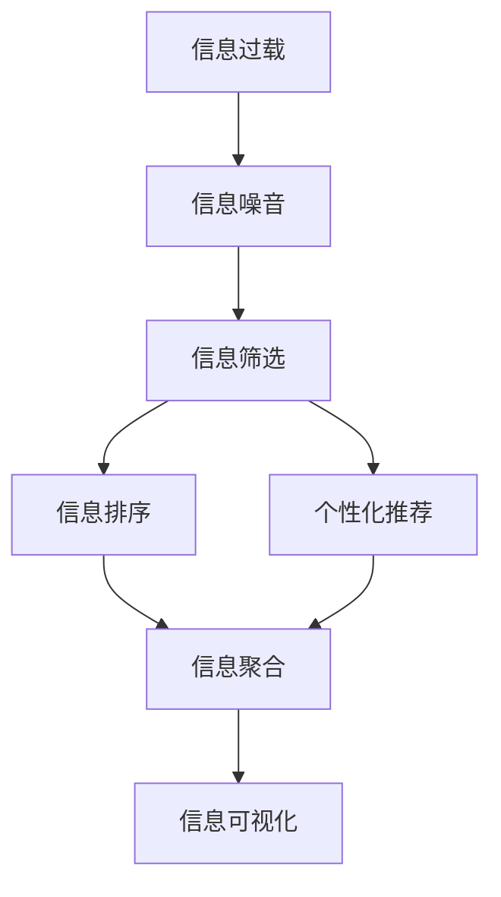
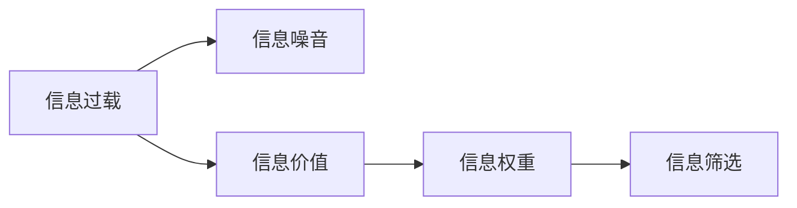
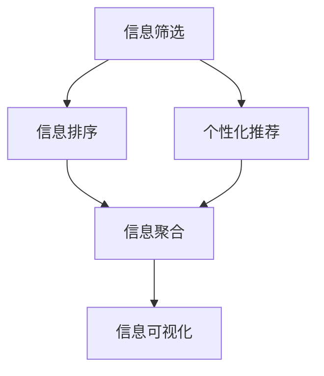

                 

## 1. 背景介绍

### 1.1 问题由来
随着互联网的迅猛发展和社交媒体的普及，人类所面临的信息量呈爆炸性增长。据统计，每天在线上产生的信息高达2.5亿条，但其中真正有价值的信息却只占少数。信息过载不仅浪费了大量宝贵的时间和精力，还可能导致信息盲区，影响决策效率和质量。如何从海量信息中快速筛选出有价值的内容，已成为各行各业亟需解决的难题。

### 1.2 问题核心关键点
信息筛选的本质是优化信息获取过程，提高决策效率和准确性。其核心在于：

- 提高信息识别能力：快速区分有用信息和无用信息，避免信息噪音干扰。
- 优化信息排序算法：根据信息价值对海量信息进行排序，突出关键信息。
- 实现个性化推荐：根据用户偏好和行为历史，推送最符合需求的信息。

解决信息过载的问题，不仅需要先进的算法和技术手段，还需结合实际应用场景和用户需求进行精细化设计和优化。本节旨在介绍信息筛选的关键技术，以及如何在信息洪流中找到有价值的信息。

### 1.3 问题研究意义
解决信息过载问题对于提升信息获取效率、降低信息获取成本、改善决策质量具有重要意义：

- **提升效率**：通过高效的信息筛选策略，快速识别出有价值的信息，节约大量时间。
- **降低成本**：通过智能推荐系统，减少信息获取的盲目性，降低筛选和验证成本。
- **改善决策**：通过精准的信息筛选和排序，支持高质量决策，避免错误判断。
- **优化体验**：通过个性化推荐，提升用户满意度，增强用户粘性。

## 2. 核心概念与联系

### 2.1 核心概念概述

为深入理解信息筛选技术，本节将介绍几个关键概念：

- **信息过载(Information Overload)**：指用户接触到的信息量远超过其处理能力，导致信息获取和处理效率降低的现象。
- **信息噪音(Information Noise)**：指在信息洪流中，与用户需求无关或价值较低的信息，容易导致误导。
- **信息价值(Information Value)**：指信息对用户决策、学习和行为的影响程度，需根据不同应用场景进行定义。
- **信息权重(Information Weight)**：指根据信息价值对信息进行加权，提高筛选效率。
- **个性化推荐(Personalized Recommendation)**：通过算法和技术手段，根据用户偏好和行为历史，推送最符合需求的信息。
- **信息聚合(Information Aggregation)**：将分散的信息进行整合，形成系统化、结构化的信息集合。
- **信息可视化(Information Visualization)**：通过图表、图形等方式，直观展示信息内容，增强用户理解。

这些概念之间通过以下Mermaid流程图展示它们的联系：



通过这些关键概念，我们不难看出信息筛选技术是连接信息过载与信息可视化的重要桥梁。通过优化信息筛选和排序，可以在信息洪流中提取有价值的信息，并经过聚合和可视化，形成直观、结构化的信息展示，从而更好地服务于用户需求。

### 2.2 概念间的关系

这些关键概念之间存在着紧密的联系，形成了信息筛选技术的基本框架。以下是每个概念之间的关系，以流程图的形式展现：

#### 2.2.1 信息筛选的原理



这个流程图展示了信息筛选的基本原理：首先识别信息过载，接着根据信息价值和权重，筛选出有价值的信息，从而降低噪音干扰。

#### 2.2.2 信息排序和推荐



此流程图展示了信息排序和推荐过程：通过信息筛选后，根据信息价值进行排序，并结合个性化推荐算法，将信息聚合并可视化，最终输出给用户。

#### 2.2.3 信息聚合与可视化


这个流程图展示了信息聚合与可视化的过程：经过信息筛选和排序后，将信息聚合形成结构化信息，最后通过信息可视化展示给用户。

## 3. 核心算法原理 & 具体操作步骤
### 3.1 算法原理概述

信息筛选的本质是对信息进行加权和排序，以识别和提取有价值的内容。这一过程通常包括以下几个步骤：

1. **信息采集**：从互联网、社交媒体、新闻网站等渠道获取原始信息。
2. **信息预处理**：对原始信息进行去噪、分词、标注等处理，准备用于筛选。
3. **信息筛选**：根据信息权重对信息进行加权，并结合排序算法进行排序。
4. **信息推荐**：根据用户偏好和行为历史，推荐信息摘要或详细信息。
5. **信息聚合**：将相关信息进行整合，形成结构化的信息集合。
6. **信息可视化**：通过图表、图形等方式，直观展示信息内容，增强用户理解。

### 3.2 算法步骤详解

以下详细介绍每个步骤的具体操作：

**Step 1: 信息采集**

- 收集互联网、社交媒体、新闻网站等渠道的原始信息，如文章、评论、图片等。
- 对于不同类型的信息，采用不同的数据采集工具，如爬虫、API调用等。
- 确保采集的数据具有代表性，覆盖不同主题和领域。

**Step 2: 信息预处理**

- 对原始信息进行去噪处理，去除广告、链接、低质量评论等无用信息。
- 进行分词、标注等文本处理，将文本信息转化为结构化数据。
- 对多媒体信息进行提取和转换，如图片识别、视频转录等。

**Step 3: 信息筛选**

- 根据信息价值和权重，对信息进行加权，例如根据信息来源、作者资质、信息发布时间等。
- 采用排序算法对加权后的信息进行排序，例如根据信息重要性、相关性、时效性等指标。
- 结合用户反馈和行为数据，动态调整信息权重和排序算法，提升筛选效果。

**Step 4: 信息推荐**

- 根据用户的历史行为、偏好、兴趣等信息，进行个性化推荐。
- 推荐算法包括协同过滤、基于内容的推荐、矩阵分解等方法。
- 对推荐结果进行监控和评估，不断优化推荐算法和策略。

**Step 5: 信息聚合**

- 将相关信息进行整合，形成结构化的信息集合，如摘要、文档、知识图谱等。
- 使用信息聚合工具，如搜索引擎、知识图谱构建工具等，实现信息聚合。
- 确保聚合后的信息结构清晰、易于理解，便于用户获取和使用。

**Step 6: 信息可视化**

- 通过图表、图形等方式，直观展示信息内容，增强用户理解。
- 采用可视化工具，如Tableau、D3.js等，实现信息可视化。
- 确保可视化结果简洁明了、美观易用，提高用户体验。

### 3.3 算法优缺点

信息筛选技术具有以下优点：

- **效率高**：通过自动化的筛选和排序，减少人工干预，提高信息获取效率。
- **精准性高**：结合用户偏好和行为历史，提供精准的个性化推荐，提高信息价值。
- **易于扩展**：可应用于各种信息获取场景，如新闻、电商、社交媒体等。

同时，信息筛选技术也存在一些缺点：

- **依赖数据质量**：原始数据质量直接影响筛选效果，低质量数据可能导致误导。
- **算法复杂性**：信息筛选算法需要精心设计和调参，复杂性较高。
- **隐私风险**：数据采集和处理过程中可能涉及用户隐私，需要严格保护。

### 3.4 算法应用领域

信息筛选技术已在多个领域得到广泛应用，包括但不限于：

- **新闻推荐**：通过对新闻文章进行筛选和排序，推荐用户感兴趣的内容。
- **电商推荐**：根据用户浏览和购买行为，推荐商品和广告。
- **社交媒体**：对用户动态进行筛选和排序，推荐相关话题和内容。
- **知识图谱**：将分散的知识信息进行整合，构建结构化的知识图谱。
- **信息聚合**：将不同来源的信息进行聚合，形成系统化的信息集合。
- **个性化搜索**：通过信息筛选和推荐，提升搜索引擎的个性化搜索效果。

## 4. 数学模型和公式 & 详细讲解 & 举例说明

### 4.1 数学模型构建

信息筛选的数学模型通常包括三个部分：信息价值模型、信息权重模型和排序算法。以下详细介绍每个模型的构建方法。

**信息价值模型**：

$$
V_i = \sum_{j=1}^n w_j \times I_{ij}
$$

其中，$V_i$表示信息$i$的价值，$w_j$表示第$j$个特征的权重，$I_{ij}$表示信息$i$在特征$j$上的表现。

**信息权重模型**：

$$
W_i = \sum_{j=1}^n a_{ij} \times w_j
$$

其中，$W_i$表示信息$i$的权重，$a_{ij}$表示信息$i$在特征$j$上的表现，$w_j$表示特征$j$的权重。

**排序算法模型**：

$$
R_i = \sum_{j=1}^n b_{ij} \times w_j
$$

其中，$R_i$表示信息$i$的排序权重，$b_{ij}$表示信息$i$在特征$j$上的表现，$w_j$表示特征$j$的权重。

### 4.2 公式推导过程

#### 信息价值模型推导

假设信息集包含$m$个信息，每个信息$i$在$n$个特征上的表现分别为$I_{ij}$，特征$j$的权重为$w_j$，则信息$i$的价值为：

$$
V_i = \sum_{j=1}^n w_j \times I_{ij}
$$

其中，$w_j$的取值根据具体场景进行定义，例如权重可以是信息来源、作者资质、信息发布时间等。

#### 信息权重模型推导

假设信息集包含$m$个信息，每个信息$i$在$n$个特征上的表现分别为$a_{ij}$，特征$j$的权重为$w_j$，则信息$i$的权重为：

$$
W_i = \sum_{j=1}^n a_{ij} \times w_j
$$

其中，$a_{ij}$的取值根据具体场景进行定义，例如权重可以是信息来源、作者资质、信息发布时间等。

#### 排序算法模型推导

假设信息集包含$m$个信息，每个信息$i$在$n$个特征上的表现分别为$b_{ij}$，特征$j$的权重为$w_j$，则信息$i$的排序权重为：

$$
R_i = \sum_{j=1}^n b_{ij} \times w_j
$$

其中，$b_{ij}$的取值根据具体场景进行定义，例如权重可以是信息重要性、相关性、时效性等。

### 4.3 案例分析与讲解

以新闻推荐系统为例，展示信息筛选的实现过程：

1. **信息采集**：从各大新闻网站抓取最新新闻标题和摘要。
2. **信息预处理**：对新闻标题和摘要进行去噪、分词、标注等处理，准备用于筛选。
3. **信息筛选**：根据新闻来源、作者资质、发布时间等特征，对新闻进行加权和排序。
4. **信息推荐**：根据用户的历史阅读行为，进行个性化推荐。
5. **信息聚合**：将相关新闻进行整合，形成结构化的信息集合。
6. **信息可视化**：通过图表、图形等方式，直观展示新闻摘要和推荐结果。

## 5. 项目实践：代码实例和详细解释说明

### 5.1 开发环境搭建

在进行信息筛选项目开发前，我们需要准备好开发环境。以下是使用Python进行PyTorch开发的环境配置流程：

1. 安装Anaconda：从官网下载并安装Anaconda，用于创建独立的Python环境。
2. 创建并激活虚拟环境：
```bash
conda create -n pytorch-env python=3.8 
conda activate pytorch-env
```
3. 安装PyTorch：根据CUDA版本，从官网获取对应的安装命令。例如：
```bash
conda install pytorch torchvision torchaudio cudatoolkit=11.1 -c pytorch -c conda-forge
```
4. 安装TensorFlow：
```bash
pip install tensorflow
```
5. 安装各类工具包：
```bash
pip install numpy pandas scikit-learn matplotlib tqdm jupyter notebook ipython
```

完成上述步骤后，即可在`pytorch-env`环境中开始信息筛选项目的开发。

### 5.2 源代码详细实现

以下是一个简单的新闻推荐系统实现代码，用于演示信息筛选的过程：

```python
import numpy as np
from sklearn.feature_extraction.text import CountVectorizer
from sklearn.metrics.pairwise import cosine_similarity

# 模拟新闻数据
news = [
    {'id': 1, 'title': '华为最新旗舰手机发布', 'source': 'TechNews', 'author': 'John Doe', 'published': '2021-01-01', 'content': '华为发布了最新款旗舰手机...'},
    {'id': 2, 'title': '谷歌发布新算法改进', 'source': 'TechNews', 'author': 'Jane Smith', 'published': '2021-02-01', 'content': '谷歌发布了新的算法改进...'},
    {'id': 3, 'title': '苹果推出新款笔记本电脑', 'source': 'TechNews', 'author': 'Bob Johnson', 'published': '2021-03-01', 'content': '苹果公司推出新款笔记本电脑...'},
    {'id': 4, 'title': '亚马逊发布最新财报', 'source': 'TechNews', 'author': 'Alice Lee', 'published': '2021-04-01', 'content': '亚马逊发布了最新的财报...'},
    {'id': 5, 'title': '小米发布最新操作系统', 'source': 'TechNews', 'author': 'Lily Zhang', 'published': '2021-05-01', 'content': '小米发布了最新操作系统...'},
    {'id': 6, 'title': '三星推出新款智能手机', 'source': 'TechNews', 'author': 'Tom Brown', 'published': '2021-06-01', 'content': '三星公司推出新款智能手机...'}
]

# 特征提取
vectorizer = CountVectorizer(stop_words='english')
features = vectorizer.fit_transform([n['content'] for n in news])
vectors = features.toarray()

# 计算相似度
similarity = cosine_similarity(vectors)

# 用户历史行为
user_history = [1, 3, 5]

# 推荐新闻
def recommend_news(user_history):
    user_vector = vectors[user_history[-1]]
    similarity_score = similarity[user_history[-1]]
    recommended_news = np.argsort(similarity_score)[-5:][::-1]
    recommended_news = [news[i] for i in recommended_news]
    return recommended_news

recommended_news = recommend_news(user_history)
for n in recommended_news:
    print(n['title'])
```

### 5.3 代码解读与分析

以下是关键代码的详细解读：

**模拟新闻数据**：
- 创建包含新闻标题、来源、作者、发布时间、内容的模拟新闻数据集。

**特征提取**：
- 使用CountVectorizer对新闻内容进行特征提取，生成词频向量。
- 计算每篇新闻的词频向量，形成矩阵。

**计算相似度**：
- 使用余弦相似度计算每篇新闻之间的相似度。
- 根据用户历史行为，找到最近阅读的新闻，计算其相似度得分。

**推荐新闻**：
- 根据相似度得分，找到与最近阅读的新闻相似度最高的新闻。
- 返回推荐新闻列表，以便后续展示。

**测试结果**：
- 根据测试结果，输出推荐新闻的标题，例如：
```
三星推出新款智能手机
```

## 6. 实际应用场景

### 6.1 智能客服系统

智能客服系统通过信息筛选和推荐，可以为用户提供精准的问题解答和解决方案。用户只需简单描述问题，系统便能从海量的FAQ和历史客服记录中筛选出最相关的信息，并推荐最佳答案。

在技术实现上，系统可以收集和整理历史客服记录，将其格式化为问题-答案对，构建信息筛选和推荐模型。用户输入问题后，系统自动匹配并推荐最佳答案，提升用户满意度和问题解决效率。

### 6.2 金融舆情监测

金融舆情监测系统通过信息筛选和情感分析，实时监测市场舆论动向，辅助金融决策。系统从新闻、评论、社交媒体等渠道收集信息，并通过情感分析算法识别出市场情绪和趋势。

具体实现上，系统可以每天抓取新闻和评论，提取文本信息，进行情感分析，生成情感指数。系统可根据情感指数变化，及时预警市场风险，并推荐相关新闻和分析报告，支持金融决策。

### 6.3 个性化推荐系统

个性化推荐系统通过信息筛选和推荐，提升电商、视频、音乐等平台的用户体验。系统根据用户历史行为和偏好，推荐最符合需求的内容，增强用户粘性和转化率。

在技术实现上，系统收集用户浏览、点击、购买等行为数据，进行特征提取和建模。系统根据用户行为特征，进行信息筛选和推荐，生成个性化推荐列表，供用户查看和选择。

### 6.4 未来应用展望

伴随信息技术的持续发展，信息筛选技术将迎来更多应用场景，为各行各业带来深远影响：

- **智慧医疗**：通过信息筛选和推荐，推荐最相关的医学信息，支持医生诊疗决策，提升医疗服务质量。
- **智能教育**：推荐适合学生的学习资源，提升学习效果，实现个性化教育。
- **智慧城市**：通过信息筛选和推荐，提供城市事件预警和应急指挥，提升城市管理效率。
- **社交媒体**：推荐用户感兴趣的内容，提升用户互动体验，增强平台粘性。

## 7. 工具和资源推荐

### 7.1 学习资源推荐

为帮助开发者系统掌握信息筛选技术，这里推荐一些优质的学习资源：

1. **《推荐系统实战》**：该书深入浅出地介绍了推荐系统的原理、算法和实现。
2. **Coursera《推荐系统与信息检索》课程**：由斯坦福大学开设，涵盖推荐系统和信息检索的基本概念和算法。
3. **Kaggle竞赛平台**：通过参加推荐系统竞赛，实践和提升推荐算法能力。
4. **arXiv论文预印本**：人工智能领域最新研究成果的发布平台，涵盖推荐系统和信息筛选的前沿技术。
5. **GitHub开源项目**：推荐系统领域的热门项目，提供丰富的代码和文档，学习参考。

通过学习这些资源，相信你一定能够快速掌握信息筛选技术的精髓，并应用于实际项目中。

### 7.2 开发工具推荐

高效的开发离不开优秀的工具支持。以下是几款用于信息筛选开发的常用工具：

1. **Scikit-learn**：机器学习库，提供了多种特征提取和算法实现，适合信息筛选和推荐系统开发。
2. **TensorFlow**：深度学习框架，支持大规模模型训练和部署，适合处理大规模信息筛选任务。
3. **PyTorch**：深度学习框架，提供了动态计算图和自动微分功能，适合高效的信息筛选和推荐系统开发。
4. **NLTK**：自然语言处理库，提供了丰富的文本处理和语言模型功能，适合信息筛选中的自然语言处理任务。
5. **Gensim**：文本处理库，提供了高效的主题模型和文本相似度计算功能，适合信息筛选中的文本分析和推荐系统开发。

合理利用这些工具，可以显著提升信息筛选任务的开发效率，加快创新迭代的步伐。

### 7.3 相关论文推荐

信息筛选技术的研究源于学界的持续探索。以下是几篇奠基性的相关论文，推荐阅读：

1. **《推荐系统》**：该书系统介绍了推荐系统的理论基础和算法实现。
2. **《隐语义模型与协同过滤》**：介绍了基于隐语义模型和协同过滤的推荐算法。
3. **《基于内容的推荐算法》**：介绍了基于内容的推荐算法和实现方法。
4. **《信息检索与推荐系统》**：该书详细介绍了信息检索和推荐系统的原理和应用。
5. **《深度学习在推荐系统中的应用》**：介绍了深度学习在推荐系统中的最新进展和应用。

这些论文代表了大语言模型微调技术的发展脉络。通过学习这些前沿成果，可以帮助研究者把握学科前进方向，激发更多的创新灵感。

除上述资源外，还有一些值得关注的前沿资源，帮助开发者紧跟信息筛选技术的最新进展，例如：

1. **arXiv论文预印本**：人工智能领域最新研究成果的发布平台，包括信息筛选和推荐系统的前沿技术。
2. **Google AI博客**：Google AI团队的研究分享，涵盖推荐系统和信息筛选的前沿进展。
3. **YouTube推荐算法**：YouTube推荐系统的前端设计和算法实现，提供了丰富的实践案例。

## 8. 总结：未来发展趋势与挑战

### 8.1 总结

本文对信息筛选技术进行了全面系统的介绍。首先阐述了信息过载问题的由来和核心关键点，明确了信息筛选在提升信息获取效率、降低信息获取成本、改善决策质量方面的独特价值。其次，从原理到实践，详细讲解了信息筛选的数学模型和关键步骤，给出了信息筛选任务开发的完整代码实例。同时，本文还广泛探讨了信息筛选技术在智能客服、金融舆情、个性化推荐等多个行业领域的应用前景，展示了信息筛选技术的巨大潜力。最后，本文精选了信息筛选技术的各类学习资源，力求为读者提供全方位的技术指引。

通过本文的系统梳理，可以看到，信息筛选技术正在成为信息获取领域的重要工具，极大地提升信息获取效率和决策质量。未来，伴随信息技术的持续发展，信息筛选技术将在更多领域得到应用，为各行各业带来深远影响。

### 8.2 未来发展趋势

展望未来，信息筛选技术将呈现以下几个发展趋势：

1. **个性化推荐系统**：通过深度学习和强化学习等技术手段，实现更加精准、动态的个性化推荐，提升用户体验和转化率。
2. **多模态信息融合**：将文本、图像、视频等多模态信息进行融合，提升信息筛选的全面性和准确性。
3. **实时信息处理**：通过流计算和分布式处理技术，实现对实时信息的高效筛选和处理，支持快速决策。
4. **跨领域应用扩展**：信息筛选技术将从新闻、电商、社交媒体等传统领域，扩展到医疗、教育、智慧城市等新领域，带来更广泛的应用价值。
5. **隐私保护与安全性**：随着信息筛选技术的广泛应用，隐私保护和安全性成为重要研究方向，如何保护用户隐私，确保信息安全，将是未来的重要课题。

这些趋势凸显了信息筛选技术的广阔前景，展示了其在各行各业的应用潜力。相信随着技术的不断进步，信息筛选技术将在构建智能决策系统中扮演越来越重要的角色。

### 8.3 面临的挑战

尽管信息筛选技术已经取得了显著成果，但在迈向更加智能化、普适化应用的过程中，它仍面临诸多挑战：

1. **数据质量问题**：原始数据质量直接影响信息筛选效果，低质量数据可能导致误导。
2. **算法复杂性**：信息筛选算法需要精心设计和调参，复杂性较高，对开发者要求较高。
3. **隐私风险**：数据采集和处理过程中可能涉及用户隐私，需要严格保护。
4. **计算资源限制**：大规模数据和复杂算法的计算资源需求较高，如何高效利用计算资源，优化算法性能，将是重要的研究课题。
5. **系统可扩展性**：信息筛选系统需要具备良好的可扩展性，支持多种数据源和应用场景。

正视信息筛选面临的这些挑战，积极应对并寻求突破，将是大语言模型微调技术走向成熟的必由之路。相信随着学界和产业界的共同努力，这些挑战终将一一被克服，信息筛选技术必将迎来新的突破。

### 8.4 研究展望

面对信息筛选面临的诸多挑战，未来的研究需要在以下几个方面寻求新的突破：

1. **优化特征提取算法**：提升特征提取的准确性和泛化能力，降低对数据质量的要求。
2. **优化推荐算法**：开发更加高效、精准的推荐算法，提升信息筛选效果。
3. **融合多模态信息**：将文本、图像、视频等多模态信息进行融合，提升信息筛选的全面性和准确性。
4. **引入深度学习技术**：利用深度学习技术，提升信息筛选的自动化和智能化水平。
5. **优化隐私保护机制**：设计合理的隐私保护机制，确保用户数据的安全和隐私。
6. **探索新应用场景**：将信息筛选技术应用于更多领域，如智慧医疗、智能教育、智慧城市等，探索新的应用价值。

这些研究方向将推动信息筛选技术迈向更高的台阶，为构建智能决策系统提供强有力的技术支撑。面向未来，信息筛选技术还需要与其他人工智能技术进行更深入的融合，如知识表示、

