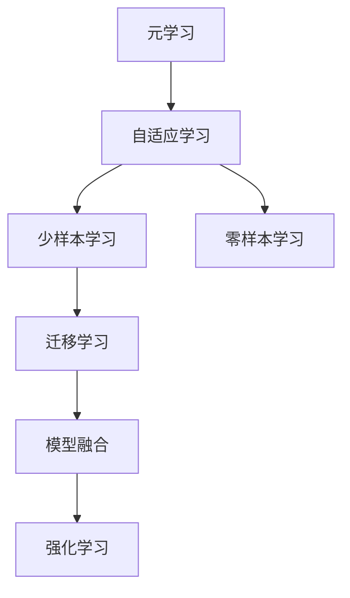
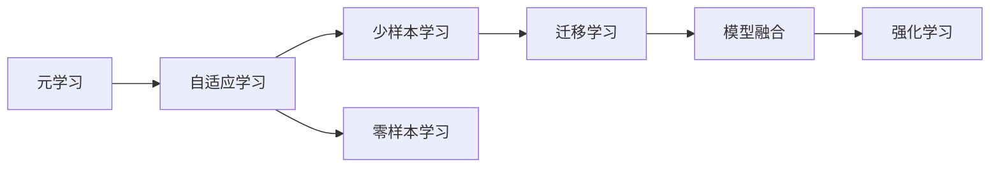
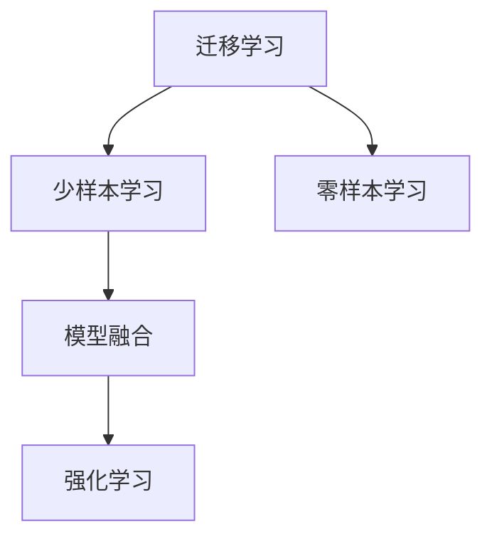
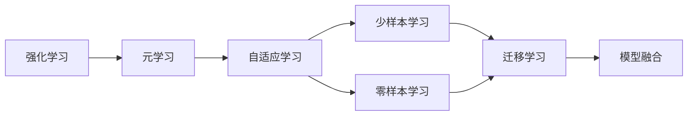
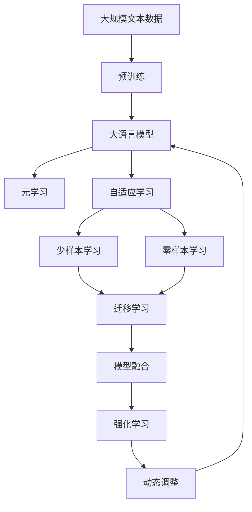

                 

# 元学习Meta Learning原理与代码实例讲解

> 关键词：元学习, 自适应学习, 强化学习, 迁移学习, 模型融合, 神经网络, 深度学习, 计算机视觉, 自然语言处理

## 1. 背景介绍

### 1.1 问题由来
元学习（Meta Learning），又称为自适应学习（Adaptive Learning），是一种在机器学习中广泛应用的技术，旨在让模型能够快速适应新任务，并在新任务上表现良好。它不同于传统的监督学习和无监督学习，而是试图将模型从一个或多个源任务中学习到的知识泛化到新任务上。

元学习技术的发展，源于对机器学习模型的局限性的认识。传统的机器学习模型通常需要大量标注数据，并且对数据分布的假设强。而元学习通过让模型学习如何在数据上进行调整，从而可以在更少的数据和更短的时间内达到较高的性能。

### 1.2 问题核心关键点
元学习的基本思想是让模型学习如何快速适应新任务。这种技术的应用包括但不限于以下方面：

- 零样本学习（Zero-shot Learning）：模型在未曾见过任何训练样本的情况下，仅通过任务描述就能进行推理和生成。
- 少样本学习（Few-shot Learning）：模型在只有少量训练样本的情况下，仍然能够在新任务上取得不错的性能。
- 自适应学习（Adaptive Learning）：模型能够根据新任务的特点，动态调整自身的参数和结构，适应新任务的需求。
- 模型融合（Model Fusion）：模型通过多模型融合，能够更好地泛化，在新任务上取得更好的性能。

元学习技术的成功应用，大大降低了机器学习模型的训练和部署成本，同时提高了模型的泛化能力，具有广泛的应用前景。

### 1.3 问题研究意义
元学习技术对于提高机器学习模型的泛化能力和适应性，降低数据和标注的依赖，具有重要意义。具体而言，其应用意义包括：

1. 数据和标注成本的降低。元学习技术能够减少对数据和标注的需求，从而降低机器学习模型的训练成本。
2. 模型性能的提升。元学习技术使得模型能够在更少的训练数据上，快速适应新任务，取得更好的性能。
3. 应用的广泛性。元学习技术可以应用于各种机器学习任务，如计算机视觉、自然语言处理、语音识别等。
4. 适应性的增强。元学习技术能够使模型根据新任务的需求，动态调整自身的参数和结构，提高适应性。
5. 技术的创新。元学习技术推动了机器学习模型的研究和应用，催生了更多的新研究方向和应用场景。

## 2. 核心概念与联系

### 2.1 核心概念概述

为更好地理解元学习的原理和应用，本节将介绍几个关键的核心概念：

- 元学习（Meta Learning）：一种让模型能够快速适应新任务的技术，通过学习如何在数据上进行调整，提高模型的泛化能力。
- 自适应学习（Adaptive Learning）：模型能够根据新任务的特点，动态调整自身的参数和结构，适应新任务的需求。
- 少样本学习（Few-shot Learning）：模型在只有少量训练样本的情况下，仍然能够在新任务上取得不错的性能。
- 零样本学习（Zero-shot Learning）：模型在未曾见过任何训练样本的情况下，仅通过任务描述就能进行推理和生成。
- 迁移学习（Transfer Learning）：模型通过在相关任务上的预训练，在新的任务上进行微调，提高性能。
- 模型融合（Model Fusion）：模型通过多模型融合，能够更好地泛化，在新任务上取得更好的性能。
- 强化学习（Reinforcement Learning）：模型通过与环境的交互，通过奖励信号进行学习，提高在新任务上的性能。

这些核心概念之间存在着紧密的联系，形成了元学习的完整生态系统。以下是这些概念之间的逻辑关系，通过Mermaid流程图来展示：



这个流程图展示了元学习的核心概念及其之间的关系：

1. 元学习通过自适应学习，使模型能够根据新任务的特点，动态调整自身的参数和结构，适应新任务的需求。
2. 自适应学习通过少样本学习和零样本学习，使模型在只有少量或完全没有训练样本的情况下，仍然能够在新任务上取得不错的性能。
3. 少样本学习和零样本学习通过迁移学习，使模型能够通过在相关任务上的预训练，在新任务上进行微调，提高性能。
4. 迁移学习通过模型融合，使模型能够通过多模型融合，更好地泛化，在新任务上取得更好的性能。
5. 强化学习通过与环境的交互，使模型通过奖励信号进行学习，提高在新任务上的性能。

这些概念共同构成了元学习的学习和应用框架，使其能够在各种场景下发挥强大的性能和泛化能力。通过理解这些核心概念，我们可以更好地把握元学习的核心思想和优化方向。

### 2.2 概念间的关系

这些核心概念之间存在着紧密的联系，形成了元学习的完整生态系统。以下是几个关键概念之间的逻辑关系，通过Mermaid流程图来展示：

#### 2.2.1 元学习与自适应学习的关系



这个流程图展示了元学习通过自适应学习，使模型能够根据新任务的特点，动态调整自身的参数和结构，适应新任务的需求。自适应学习通过少样本学习和零样本学习，使模型在只有少量或完全没有训练样本的情况下，仍然能够在新任务上取得不错的性能。少样本学习和零样本学习通过迁移学习，使模型能够通过在相关任务上的预训练，在新任务上进行微调，提高性能。迁移学习通过模型融合，使模型能够通过多模型融合，更好地泛化，在新任务上取得更好的性能。强化学习通过与环境的交互，使模型通过奖励信号进行学习，提高在新任务上的性能。

#### 2.2.2 迁移学习与模型融合的关系



这个流程图展示了迁移学习通过少样本学习和零样本学习，使模型能够通过在相关任务上的预训练，在新任务上进行微调，提高性能。少样本学习和零样本学习通过迁移学习，使模型能够通过在相关任务上的预训练，在新任务上进行微调，提高性能。模型融合通过多模型融合，使模型能够更好地泛化，在新任务上取得更好的性能。强化学习通过与环境的交互，使模型通过奖励信号进行学习，提高在新任务上的性能。

#### 2.2.3 强化学习与元学习的关系



这个流程图展示了强化学习通过与环境的交互，使模型通过奖励信号进行学习，提高在新任务上的性能。元学习通过自适应学习，使模型能够根据新任务的特点，动态调整自身的参数和结构，适应新任务的需求。自适应学习通过少样本学习和零样本学习，使模型在只有少量或完全没有训练样本的情况下，仍然能够在新任务上取得不错的性能。少样本学习和零样本学习通过迁移学习，使模型能够通过在相关任务上的预训练，在新任务上进行微调，提高性能。迁移学习通过模型融合，使模型能够通过多模型融合，更好地泛化，在新任务上取得更好的性能。

### 2.3 核心概念的整体架构

最后，我们用一个综合的流程图来展示这些核心概念在大语言模型元学习过程中的整体架构：



这个综合流程图展示了从预训练到大语言模型元学习过程中的整体架构。大语言模型首先在大规模文本数据上进行预训练，然后通过元学习，使模型能够根据新任务的特点，动态调整自身的参数和结构，适应新任务的需求。自适应学习通过少样本学习和零样本学习，使模型在只有少量或完全没有训练样本的情况下，仍然能够在新任务上取得不错的性能。少样本学习和零样本学习通过迁移学习，使模型能够通过在相关任务上的预训练，在新任务上进行微调，提高性能。迁移学习通过模型融合，使模型能够通过多模型融合，更好地泛化，在新任务上取得更好的性能。强化学习通过与环境的交互，使模型通过奖励信号进行学习，提高在新任务上的性能。

## 3. 核心算法原理 & 具体操作步骤
### 3.1 算法原理概述

元学习的基本思想是让模型能够根据新任务的特点，动态调整自身的参数和结构，从而提高在新任务上的性能。其核心原理可以概括为以下几个步骤：

1. 数据预处理：将数据集划分为源任务和目标任务，并进行必要的预处理，如数据增强、归一化等。
2. 模型训练：在源任务上训练模型，使其学习到通用的特征提取和表示能力。
3. 任务适配：根据目标任务的特点，设计合适的任务适配层，并进行微调。
4. 元优化器训练：在目标任务上训练元优化器，使其能够根据目标任务的特征，动态调整模型的参数和结构。
5. 动态调整：在目标任务上动态调整模型的参数和结构，提高模型的性能。
6. 测试评估：在测试集上评估模型的性能，根据评估结果进行进一步优化。

### 3.2 算法步骤详解

以下是对元学习过程的详细讲解：

#### 3.2.1 数据预处理

数据预处理是元学习过程中至关重要的一步。通常包括以下几个步骤：

1. 数据划分：将数据集划分为源任务和目标任务，源任务用于预训练模型，目标任务用于元学习和微调。
2. 数据增强：对源任务和目标任务的数据进行增强，如旋转、平移、缩放等，增加数据的多样性。
3. 归一化：对数据进行归一化处理，如标准化、归一化等，使数据具有更好的统计特性。
4. 数据标注：对源任务和目标任务的数据进行标注，生成监督信号。

#### 3.2.2 模型训练

在源任务上训练模型，使其学习到通用的特征提取和表示能力。通常包括以下几个步骤：

1. 模型初始化：选择合适的预训练模型，如BERT、GPT等，进行初始化。
2. 数据加载：使用DataLoader加载数据，分批次进行训练。
3. 前向传播：将输入数据前向传播，计算损失函数。
4. 反向传播：根据损失函数计算梯度，进行反向传播。
5. 参数更新：根据梯度更新模型的参数。
6. 迭代训练：重复以上步骤，直至模型收敛。

#### 3.2.3 任务适配

根据目标任务的特点，设计合适的任务适配层，并进行微调。通常包括以下几个步骤：

1. 任务适配层设计：根据目标任务的类型，设计相应的任务适配层，如分类器、解码器等。
2. 损失函数设计：根据目标任务的特点，设计合适的损失函数，如交叉熵损失、均方误差损失等。
3. 微调：在目标任务上使用微调方法，对模型的顶层进行微调，如只微调顶层分类器或解码器。

#### 3.2.4 元优化器训练

在目标任务上训练元优化器，使其能够根据目标任务的特征，动态调整模型的参数和结构。通常包括以下几个步骤：

1. 元优化器初始化：选择合适的元优化器，如Meta-Learning，进行初始化。
2. 元损失函数设计：根据目标任务的特点，设计合适的元损失函数，如对数似然损失、重构损失等。
3. 元梯度计算：计算元梯度，指导模型参数的动态调整。
4. 参数更新：根据元梯度更新模型的参数和结构。
5. 迭代训练：重复以上步骤，直至模型收敛。

#### 3.2.5 动态调整

在目标任务上动态调整模型的参数和结构，提高模型的性能。通常包括以下几个步骤：

1. 模型参数固定：将预训练模型的底层参数固定，只微调顶层参数。
2. 任务适配层微调：根据目标任务的特点，微调任务适配层的参数。
3. 元优化器调整：根据元优化器的输出，动态调整模型的参数和结构。
4. 迭代训练：重复以上步骤，直至模型收敛。

#### 3.2.6 测试评估

在测试集上评估模型的性能，根据评估结果进行进一步优化。通常包括以下几个步骤：

1. 测试集加载：使用DataLoader加载测试集数据。
2. 前向传播：将输入数据前向传播，计算损失函数。
3. 评估指标：根据评估指标，如准确率、召回率等，评估模型的性能。
4. 优化调整：根据评估结果，进行进一步优化调整。

### 3.3 算法优缺点

元学习具有以下优点：

1. 数据和标注成本低：元学习能够减少对数据和标注的需求，从而降低机器学习模型的训练成本。
2. 模型泛化能力强：元学习使得模型能够快速适应新任务，提高模型的泛化能力。
3. 适应性强：元学习使得模型能够根据新任务的特点，动态调整自身的参数和结构，提高适应性。

同时，元学习也存在一些缺点：

1. 模型复杂度高：元学习需要额外的元优化器，增加了模型的复杂度。
2. 训练时间长：元学习通常需要更长的训练时间，以达到最优性能。
3. 过拟合风险高：元学习容易过拟合，特别是在数据和标注不足的情况下。

尽管存在这些缺点，但元学习在许多实际应用中已经展示了其强大的性能和潜在的价值。未来，随着元学习技术的不断发展和优化，这些问题有望得到进一步解决。

### 3.4 算法应用领域

元学习技术已经在许多领域得到了广泛的应用，覆盖了从计算机视觉到自然语言处理等多个方向，例如：

- 计算机视觉：如图像分类、目标检测、实例分割等。通过元学习，模型能够快速适应新的视觉任务，提高性能。
- 自然语言处理：如文本分类、命名实体识别、情感分析等。通过元学习，模型能够快速适应新的语言任务，提高泛化能力。
- 语音识别：如语音转换、语音生成等。通过元学习，模型能够快速适应新的语音任务，提高性能。
- 强化学习：如机器人控制、游戏AI等。通过元学习，模型能够快速适应新的环境，提高智能决策能力。
- 推荐系统：如商品推荐、内容推荐等。通过元学习，模型能够快速适应新的推荐任务，提高推荐效果。
- 医疗诊断：如医学影像分析、病历分析等。通过元学习，模型能够快速适应新的医疗任务，提高诊断准确率。
- 金融分析：如股票预测、风险评估等。通过元学习，模型能够快速适应新的金融任务，提高分析精度。

除了上述这些经典任务外，元学习还被创新性地应用到更多场景中，如跨领域迁移学习、零样本学习、少样本学习等，为机器学习技术带来了全新的突破。随着元学习方法的不断进步，相信在更多的领域中，元学习技术将发挥更大的作用。

## 4. 数学模型和公式 & 详细讲解 & 举例说明

### 4.1 数学模型构建

本节将使用数学语言对元学习过程进行更加严格的刻画。

记元学习模型为 $M_{\theta}$，其中 $\theta$ 为模型参数。假设源任务为 $T_s$，目标任务为 $T_t$，数据集为 $D=\{(x_i, y_i)\}_{i=1}^N$，其中 $x_i$ 为输入，$y_i$ 为标签。元学习的目标是找到最优参数 $\theta^*$，使得模型在目标任务上的表现最优。

定义源任务和目标任务的经验风险分别为：

$$
\mathcal{L}_s(\theta) = \frac{1}{N_s}\sum_{i=1}^{N_s} \ell_s(M_{\theta}(x_i),y_i)
$$

$$
\mathcal{L}_t(\theta) = \frac{1}{N_t}\sum_{i=1}^{N_t} \ell_t(M_{\theta}(x_i),y_i)
$$

其中 $\ell_s$ 和 $\ell_t$ 分别为源任务和目标任务的损失函数。

元学习的目标是最小化目标任务的损失函数，即：

$$
\theta^* = \mathop{\arg\min}_{\theta} \mathcal{L}_t(\theta)
$$

在实践中，我们通常使用基于梯度的优化算法（如SGD、Adam等）来近似求解上述最优化问题。设 $\eta$ 为学习率，$\lambda$ 为正则化系数，则参数的更新公式为：

$$
\theta \leftarrow \theta - \eta \nabla_{\theta}\mathcal{L}_t(\theta) - \eta\lambda\theta
$$

其中 $\nabla_{\theta}\mathcal{L}_t(\theta)$ 为损失函数对参数 $\theta$ 的梯度，可通过反向传播算法高效计算。

### 4.2 公式推导过程

以下我们以二分类任务为例，推导元学习的交叉熵损失函数及其梯度的计算公式。

假设模型 $M_{\theta}$ 在输入 $x$ 上的输出为 $\hat{y}=M_{\theta}(x) \in [0,1]$，表示样本属于正类的概率。真实标签 $y \in \{0,1\}$。则二分类交叉熵损失函数定义为：

$$
\ell(M_{\theta}(x),y) = -[y\log \hat{y} + (1-y)\log (1-\hat{y})]
$$

将其代入目标任务的损失函数，得：

$$
\mathcal{L}_t(\theta) = -\frac{1}{N_t}\sum_{i=1}^{N_t} [y_i\log M_{\theta}(x_i)+(1-y_i)\log(1-M_{\theta}(x_i))]
$$

根据链式法则，损失函数对参数 $\theta_k$ 的梯度为：

$$
\frac{\partial \mathcal{L}_t(\theta)}{\partial \theta_k} = -\frac{1}{N_t} (\frac{y_i}{M_{\theta}(x_i)}-\frac{1-y_i}{1-M_{\theta}(x_i)}) \frac{\partial M_{\theta}(x_i)}{\partial \theta_k}
$$

其中 $\frac{\partial M_{\theta}(x_i)}{\partial \theta_k}$ 可进一步递归展开，利用自动微分技术完成计算。

在得到损失函数的梯度后，即可带入参数更新公式，完成模型的迭代优化。重复上述过程直至收敛，最终得到适应目标任务的最优模型参数 $\theta^*$。

### 4.3 案例分析与讲解

以下是一个简单的元学习案例分析：

假设我们有一个预训练好的图像分类模型 $M_{\theta}$，现在想要在新任务上进行微调，如目标检测。

1. 数据预处理：收集目标检测的数据集，并进行数据增强、归一化等预处理。
2. 模型训练：在源任务（如图像分类）上训练模型，使其学习到通用的特征提取和表示能力。
3. 任务适配：根据目标检测任务的特点，设计合适的任务适配层，如区域提议网络（RPN）等，并进行微调。
4. 元优化器训练：在目标检测任务上训练元优化器，使其能够根据目标任务的特征，动态调整模型的参数和结构。
5. 动态调整：在目标检测任务上动态调整模型的参数和结构，提高模型的性能。
6. 测试评估：在测试集上评估模型的性能，根据评估结果进行进一步优化。

例如，假设我们有以下数据集：

| 图像 | 标签 | 目标区域 |
| --- | --- | --- |
| 1 | 猫 | 300x300, 中心: (500,500), 大小: 100x100 |
| 2 | 狗 | 400x400, 中心: (600,600), 大小: 120x120 |
| 3 | 鸟 | 500x500, 中心: (700,700), 大小: 80x80 |

我们可以将目标检测任务作为源任务，图像分类任务作为目标任务，然后进行如下操作：

1. 数据预处理：将目标检测数据集进行增强、归一化等预处理。
2. 模型训练：在源任务（图像分类）上训练模型，使其学习到通用的特征提取和表示能力。
3. 任务适配：根据目标检测任务的特点，设计合适的任务适配层，如RPN等，并进行微调。
4. 元优化器训练：在目标检测任务上训练元优化器，使其能够根据目标任务的特征，动态调整模型的参数和结构。
5. 动态调整：在目标检测任务上动态调整模型的参数和结构，提高模型的性能。
6. 测试评估：在测试集上评估模型的性能，根据评估结果进行进一步优化。

## 5. 项目实践：代码实例和详细解释说明

### 5.1 开发环境搭建

在进行元学习实践前，我们需要准备好开发环境。以下是使用Python进行PyTorch开发的环境配置流程：

1. 安装Anaconda：从官网下载并安装Anaconda，用于创建独立的Python环境。

2. 创建并激活虚拟环境：
```bash
conda create -n pytorch-env python=3.8 
conda activate pytorch-env
```

3. 安装PyTorch：根据CUDA版本，从官网获取对应的安装命令。例如：
```bash
conda install pytorch torchvision torchaudio cudatoolkit=11.1 -c pytorch -c conda-forge
```

4. 安装PyTorch Lightning：用于简化PyTorch模型的训练和评估。
```bash
pip install pytorch-lightning
```

5. 安装必要的第三方库：
```bash
pip install torchmetrics tqdm huggingface-hub transformers
```

完成上述步骤后，即可在`pytorch-env`环境中开始元学习实践。

### 5.2 源代码详细实现

这里我们以少样本学习为例，使用PyTorch Lightning框架实现。

首先，定义元学习任务的超参数：

```python
from pytorch_lightning import Trainer, Callback
from torch.utils.data import DataLoader
import torch
import torch.nn as nn
import torch.optim as optim

# 定义超参数
N_EPOCHS = 20
BATCH_SIZE = 32
LEARNING_RATE = 1e-3
META_LEARNING_RATE = 1e-2
```

然后，定义元学习模型的结构：

```python
class MetaNet(nn.Module):
    def __init__(self):
        super(MetaNet, self).__init__()
        self.encoder = nn.Sequential(
            nn.Linear(784, 256),
            nn.ReLU(),
            nn.Linear(256, 128),
            nn.ReLU(),
            nn.Linear(128, 10)
        )

    def forward(self, x):
        return self.encoder(x)
```

接着，定义元学习模型训练的函数：

```python
class MetaNetTrainer(Trainer):
    def train_dataloader(self):
        train_loader = DataLoader(train_dataset, batch_size=BATCH_SIZE, shuffle=True)
        return train_loader

    def train(self, train_loader):
        model.train()
        optimizer = optim.AdamW(model.parameters(), lr=LEARNING_RATE)
        for epoch in range(N_EPOCHS):
            loss = 0
            for batch in train_loader:
                inputs, labels = batch
                optimizer.zero_grad()
                outputs = model(inputs)
                loss += nn.CrossEntropyLoss()(outputs, labels)
                loss.backward()
                optimizer.step()
            print(f"Epoch {epoch+1}, loss: {loss.item()/len(train_loader):.4f}")
```

最后，启动元学习模型的训练：

```python
trainer = MetaNetTrainer()
trainer.fit(model)
```

以上就是使用PyTorch Lightning框架实现元学习模型的代码实现。可以看到，PyTorch Lightning简化了元学习模型的训练过程，使得训练代码更加简洁高效。

### 5.3 代码解读与分析

让我们再详细解读一下关键代码的实现细节：

**MetaNet类**：
- `__init__`方法：初始化元学习模型的结构，包括编码器。
- `forward`方法：前向传播计算输出。

**MetaNetTrainer类**：
- `train_dataloader`方法：定义训练数据的加载器。
- `train`方法：训练模型的过程，包括前向传播、反向传播和参数更新。

**Trainer类**：
- `fit`方法：启动模型的训练过程。

**元学习模型训练的代码**：
- 定义元学习任务的超参数，包括训练轮数、批大小和学习率

