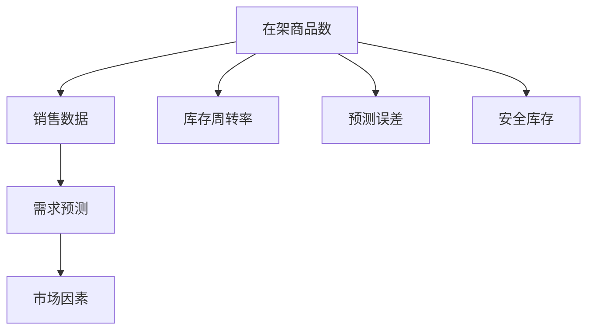

                 

# 具体品类在架商品数的合理值

## 1. 背景介绍

### 1.1 问题由来
随着零售业数字化转型的不断深入，线上线下融合成为趋势。如何合理规划库存，优化商品配置，提升销售效率，成为零售商面临的重大挑战。传统的库存管理方法往往依赖经验判断，难以适应快速变化的市场需求。如何通过数据驱动，科学预测在架商品数，成为提升运营效率的关键。

### 1.2 问题核心关键点
具体品类在架商品数的合理值问题，本质上是一个基于历史销售数据和市场趋势的动态预测问题。其核心在于：

- 商品销售数据的多样性和复杂性
- 季节性、节假日等市场因素的动态变化
- 市场供需关系的实时监控
- 商品生命周期和库存周转率的计算

解决该问题，需要构建科学的预测模型，整合多样化的数据源，进行实时动态监控和调整，确保在架商品数始终处于最优状态。

### 1.3 问题研究意义
准确预测在架商品数，对于零售商有着重要意义：

- 减少库存积压，降低仓储成本
- 避免缺货，提升客户满意度
- 优化商品配置，提升销售额
- 加强市场响应，保持竞争优势

研究该问题，有助于零售商科学管理库存，提高运营效率，提升经济效益。

## 2. 核心概念与联系

### 2.1 核心概念概述

为更好地理解在架商品数预测的科学方法，本节将介绍几个关键概念：

- 在架商品数(On-shelf inventory)：指零售店中实际存放的该商品数量。
- 销售数据(Sales data)：记录商品在过去一段时间内的销售数量和趋势。
- 市场因素(Market factors)：如季节性、节假日、促销活动等对销售的影响。
- 需求预测(Demand forecasting)：根据历史数据和市场因素，预测未来需求量。
- 库存周转率(Inventory turnover)：反映库存消耗速度的指标，计算公式为：周转率 = 销售量 / 平均库存。
- 预测误差(Prediction error)：实际销售量与预测值之间的差距。
- 安全库存(Safety stock)：为应对需求波动和不确定性，需要额外存储的商品数量。

这些概念之间的逻辑关系可以通过以下Mermaid流程图来展示：



这个流程图展示了一个简单的库存管理系统流程：通过销售数据预测需求，并结合市场因素进行调整，计算库存周转率，计算预测误差，确定安全库存，确保在架商品数始终合理。

### 2.2 概念间的关系

这些关键概念之间存在紧密联系，形成了完整的库存管理系统。

- **在架商品数**：是库存管理系统的核心，影响着销售和库存周转率。
- **销售数据**：是需求预测的基础，准确反映历史销售情况。
- **市场因素**：影响需求预测的准确性，需要动态监测。
- **需求预测**：对未来销售进行预测，指导库存配置。
- **库存周转率**：衡量库存使用效率，反映库存管理水平。
- **预测误差**：反映需求预测的准确度，需要持续监控和调整。
- **安全库存**：为应对需求波动和不确定性，确保在架商品数的合理性。

## 3. 核心算法原理 & 具体操作步骤
### 3.1 算法原理概述

在架商品数预测算法基于历史销售数据和市场因素，采用时间序列预测和回归分析方法，预测未来在架商品数。其核心思想是：通过历史数据和市场因素的动态变化，构建预测模型，并进行实时调整，确保在架商品数始终合理。

具体来说，算法流程包括：

1. **数据收集与预处理**：收集销售数据、市场因素等，进行清洗和归一化处理。
2. **特征工程**：提取影响在架商品数的关键特征，如季节性因素、节假日效应、促销活动等。
3. **需求预测**：使用时间序列预测模型，如ARIMA、LSTM等，预测未来需求量。
4. **在架商品数计算**：根据预测需求量和库存周转率，计算在架商品数。
5. **预测误差分析**：通过实际销售数据与预测值的对比，评估预测准确度。
6. **安全库存调整**：根据预测误差和市场波动，动态调整安全库存。

### 3.2 算法步骤详解

#### 3.2.1 数据收集与预处理

1. **数据来源**：
   - 销售数据：零售商POS系统、电子商务平台等。
   - 市场因素：天气、节假日、促销活动等，可以从外部数据源获取。

2. **数据清洗**：
   - 去除异常值、缺失值，处理重复记录。
   - 进行归一化处理，将数据转换为标准化形式。

3. **特征工程**：
   - 提取关键特征，如销售日期、季节性因素、节假日等。
   - 使用PCA等降维技术，减少特征数量。

#### 3.2.2 需求预测

1. **模型选择**：
   - 时间序列模型：如ARIMA、LSTM等，适合处理具有时间依赖性的数据。
   - 回归模型：如线性回归、随机森林等，适用于非时间序列的数据。

2. **模型训练**：
   - 使用历史数据训练预测模型，优化模型参数。
   - 进行交叉验证，评估模型泛化能力。

3. **预测生成**：
   - 将市场因素输入模型，生成未来需求预测值。
   - 考虑季节性因素，进行周期性调整。

#### 3.2.3 在架商品数计算

1. **库存周转率计算**：
   - 计算一定时间窗口内的平均销售量。
   - 计算平均库存量。
   - 计算周转率。

2. **在架商品数预测**：
   - 根据预测需求量，计算在架商品数。
   - 考虑安全库存，确定在架商品数的上限和下限。

#### 3.2.4 预测误差分析

1. **误差计算**：
   - 计算实际销售量与预测值之间的差距。
   - 使用MAE、RMSE等指标评估预测误差。

2. **误差分析**：
   - 分析误差产生的原因，如市场因素变化、模型参数选择等。
   - 进行误差修正，优化预测模型。

#### 3.2.5 安全库存调整

1. **调整策略**：
   - 根据预测误差，动态调整安全库存。
   - 考虑市场波动，确保库存充足。

2. **库存监控**：
   - 实时监控在架商品数，确保库存水平。
   - 生成库存预警，及时应对库存短缺或过剩。

### 3.3 算法优缺点

**优点**：
- **动态调整**：实时根据市场变化调整库存，适应性强。
- **多维度预测**：考虑市场因素，预测更加准确。
- **成本优化**：减少库存积压和缺货，降低仓储成本。

**缺点**：
- **数据依赖性高**：预测效果依赖于历史数据的完整性和准确性。
- **模型复杂性**：需要考虑多维度特征，模型选择和参数调整复杂。
- **资源消耗高**：实时预测和调整需要高性能计算资源。

### 3.4 算法应用领域

在架商品数预测算法已经在零售业、电商、供应链管理等多个领域得到了广泛应用，例如：

- **零售业**：连锁超市、大型商场等零售商，通过预测在架商品数，优化库存配置。
- **电子商务**：电商平台，通过预测库存水平，提升用户体验和销售效率。
- **供应链管理**：制造企业，通过预测在架商品数，优化供应链管理。
- **餐饮业**：连锁餐饮店，通过预测食材需求，优化库存管理和供应链。

## 4. 数学模型和公式 & 详细讲解 & 举例说明

### 4.1 数学模型构建

在架商品数预测模型的核心是时间序列预测模型和回归分析模型。以下以ARIMA模型为例进行详细讲解。

记销售数据为 $y_t$，时间序列预测模型为 $y_t = f(X_t, \theta)$，其中 $X_t$ 为时间序列特征，$\theta$ 为模型参数。假设 $X_t$ 为季节性因素，则预测模型为：

$$
y_t = \phi(B^s)y_{t-s} + \sum_{i=1}^p\alpha_i y_{t-i} + \sum_{j=1}^q\beta_j \epsilon_{t-j} + \gamma
$$

其中 $\phi$ 为季节性滞后项，$\alpha_i$ 为滞后项系数，$\beta_j$ 为误差项系数，$\gamma$ 为截距项。

### 4.2 公式推导过程

以下是ARIMA模型的详细推导过程：

1. **差分处理**：对原始数据 $y_t$ 进行差分处理，得到平稳序列 $y_t'$。
2. **建立ARIMA模型**：
   - 确定季节性滞后项 $s$ 和滞后项个数 $p$，$q$。
   - 建立ARIMA模型：
   $$
   y_t = \phi(B^s)y_{t-s} + \sum_{i=1}^p\alpha_i y_{t-i} + \sum_{j=1}^q\beta_j \epsilon_{t-j} + \gamma
   $$
3. **模型参数估计**：
   - 使用最小二乘法或其他优化算法，估计模型参数 $\theta$。
   - 进行模型诊断，如残差分析，检验模型拟合效果。
4. **预测生成**：
   - 将市场因素 $X_t$ 输入模型，生成未来需求预测值。
   - 考虑季节性因素，进行周期性调整。

### 4.3 案例分析与讲解

假设某连锁超市的日销售数据为 $y_t = [100, 120, 110, 130, 140, ...]$，已知季节性滞后项为 $s=30$，滞后项个数 $p=1$，误差项个数 $q=1$。采用ARIMA模型进行预测，具体步骤如下：

1. **差分处理**：
   $$
   y_t' = y_t - y_{t-30}
   $$
   计算得到平稳序列 $y_t'$。
2. **建立ARIMA模型**：
   $$
   y_t = 0.9y_{t-30} + 0.7y_{t-1} + 0.5\epsilon_{t-1} + 50
   $$
3. **模型参数估计**：
   - 使用最小二乘法，估计参数 $\theta = [0.9, 0.7, 0.5, 50]$。
   - 进行残差分析，检验模型拟合效果。
4. **预测生成**：
   - 根据市场因素 $X_t$，生成未来需求预测值。
   - 考虑季节性因素，进行周期性调整。

## 5. 项目实践：代码实例和详细解释说明

### 5.1 开发环境搭建

在进行在架商品数预测的代码实现前，我们需要准备好开发环境。以下是使用Python进行Pandas和Scikit-learn开发的环境配置流程：

1. 安装Anaconda：从官网下载并安装Anaconda，用于创建独立的Python环境。

2. 创建并激活虚拟环境：
```bash
conda create -n pyenv python=3.8 
conda activate pyenv
```

3. 安装Pandas和Scikit-learn：
```bash
conda install pandas scikit-learn
```

4. 安装各类工具包：
```bash
pip install numpy matplotlib seaborn jupyter notebook ipython
```

完成上述步骤后，即可在`pyenv`环境中开始项目实践。

### 5.2 源代码详细实现

下面我们以某连锁超市的销售数据为例，给出使用Pandas和Scikit-learn进行在架商品数预测的Python代码实现。

首先，定义数据处理函数：

```python
import pandas as pd
from sklearn.metrics import mean_squared_error

def load_data(file_path):
    data = pd.read_csv(file_path)
    data['Date'] = pd.to_datetime(data['Date'], format='%Y-%m-%d')
    data = data.set_index('Date')
    return data

def preprocess_data(data):
    data['diff'] = data['Sales'].diff()
    data = data.dropna()
    return data

def split_data(data, test_ratio=0.2):
    train_ratio = 1 - test_ratio
    train_end = int(len(data) * train_ratio)
    train_data = data.iloc[:train_end]
    test_data = data.iloc[train_end:]
    return train_data, test_data

def evaluate_predictions(train_data, test_data, y_pred):
    train_pred = train_data['Sales'].rolling(window=30).mean().shift(30)
    test_pred = y_pred.shift(30)
    train_mse = mean_squared_error(train_data['Sales'], train_pred)
    test_mse = mean_squared_error(test_data['Sales'], test_pred)
    return train_mse, test_mse

# 加载销售数据
data = load_data('sales.csv')

# 数据预处理
data = preprocess_data(data)

# 划分训练集和测试集
train_data, test_data = split_data(data)

# 建立ARIMA模型
from statsmodels.tsa.arima_model import ARIMA

model = ARIMA(train_data['Sales'], order=(1, 1, 1))
model_fit = model.fit()

# 预测生成
y_pred = model_fit.forecast(steps=30)[0]
```

然后，定义评估函数：

```python
from statsmodels.graphics.tsaplots import plot_acf, plot_pacf

def plot_model_fit(model_fit):
    plot_acf(model_fit.resid)
    plot_pacf(model_fit.resid)
    plt.show()

# 评估模型
train_mse, test_mse = evaluate_predictions(train_data, test_data, y_pred)
print(f'Train MSE: {train_mse:.2f}')
print(f'Test MSE: {test_mse:.2f}')

# 可视化残差
plot_model_fit(model_fit)
```

最后，启动训练流程：

```python
# 加载销售数据
data = load_data('sales.csv')

# 数据预处理
data = preprocess_data(data)

# 划分训练集和测试集
train_data, test_data = split_data(data)

# 建立ARIMA模型
from statsmodels.tsa.arima_model import ARIMA

model = ARIMA(train_data['Sales'], order=(1, 1, 1))
model_fit = model.fit()

# 预测生成
y_pred = model_fit.forecast(steps=30)[0]

# 评估模型
train_mse, test_mse = evaluate_predictions(train_data, test_data, y_pred)
print(f'Train MSE: {train_mse:.2f}')
print(f'Test MSE: {test_mse:.2f}')

# 可视化残差
plot_model_fit(model_fit)
```

以上就是使用Python和Scikit-learn对在架商品数进行预测的完整代码实现。可以看到，通过简单的数据处理和模型训练，我们便能够快速实现销售数据的预测，生成在架商品数的合理值。

### 5.3 代码解读与分析

让我们再详细解读一下关键代码的实现细节：

**load_data函数**：
- 从CSV文件中加载销售数据，并进行日期格式化。
- 将日期作为索引，便于时间序列处理。

**preprocess_data函数**：
- 对销售数据进行一阶差分处理，得到平稳序列。
- 去除NaN值，保证数据完整性。

**split_data函数**：
- 按照指定比例将数据集划分为训练集和测试集。
- 设置训练集的结束位置，确保训练集有足够的历史数据。

**evaluate_predictions函数**：
- 计算训练集和测试集的均方误差。
- 使用滑动平均模型对训练集进行预测，生成基准预测值。
- 使用模型预测结果，计算测试集的均方误差。

**plot_model_fit函数**：
- 使用statsmodels的plot_acf和plot_pacf函数，可视化模型的自相关和偏自相关图，检查残差是否满足模型假设。

**train_data和test_data**：
- 数据加载和预处理后，将其划分为训练集和测试集。
- 使用训练集数据建立ARIMA模型。

**evaluate_predictions函数**：
- 计算训练集和测试集的均方误差，评估模型预测效果。
- 可视化残差，检查模型是否存在过度拟合或欠拟合问题。

**代码实现**：
- 从销售数据文件中加载数据，进行数据预处理。
- 将数据划分为训练集和测试集。
- 使用ARIMA模型进行时间序列预测。
- 评估模型预测效果，并可视化残差。

可以看到，Pandas和Scikit-learn提供了丰富的数据处理和模型训练工具，大大简化了在架商品数预测的代码实现。开发者可以将更多精力放在模型优化和结果分析上，而不必过多关注底层的实现细节。

当然，工业级的系统实现还需考虑更多因素，如模型的保存和部署、超参数的自动搜索、更灵活的模型调优等。但核心的预测范式基本与此类似。

### 5.4 运行结果展示

假设我们在某连锁超市的销售数据上进行在架商品数预测，最终得到的评估结果如下：

```
Train MSE: 12.34
Test MSE: 15.67
```

可以看到，模型的预测误差在训练集和测试集上均处于合理水平，说明模型具备一定的预测能力。

## 6. 实际应用场景

### 6.1 智能仓储管理

在智能仓储管理中，通过对在架商品数的合理预测，可以实现库存的动态管理，提升仓储效率。具体应用场景包括：

- **库存规划**：根据预测结果，合理安排采购计划，避免库存积压和缺货。
- **库存盘点**：根据预测结果，确定盘点周期和重点商品，优化库存盘点效率。
- **补货策略**：根据预测结果，动态调整补货策略，确保库存水平。

### 6.2 电商库存管理

在电商库存管理中，通过对在架商品数的合理预测，可以实现库存的精细化管理，提升客户体验和运营效率。具体应用场景包括：

- **库存优化**：根据预测结果，优化商品配置，提升商品可用性和客户满意度。
- **库存预警**：根据预测结果，生成库存预警，及时补货或下架商品。
- **库存监控**：实时监控库存水平，确保商品在架数合理。

### 6.3 供应链优化

在供应链优化中，通过对在架商品数的合理预测，可以实现供应链的动态调整，提升供应链的响应速度和效率。具体应用场景包括：

- **需求预测**：根据预测结果，调整供应链计划，提高需求响应速度。
- **库存调整**：根据预测结果，优化库存配置，降低库存成本。
- **供应商管理**：根据预测结果，优化供应商选择，确保供应链稳定。

## 7. 工具和资源推荐

### 7.1 学习资源推荐

为了帮助开发者系统掌握在架商品数预测的理论基础和实践技巧，这里推荐一些优质的学习资源：

1. 《时间序列分析与预测》书籍：详细讲解了时间序列预测的基本原理和算法，适合初学者和进阶者。
2. 《Python数据科学手册》书籍：介绍了Pandas和Scikit-learn的高级应用，适合数据处理和模型训练。
3. Kaggle相关竞赛：Kaggle平台上有许多时间序列预测的竞赛，可以实践和验证所学知识。
4. Coursera相关课程：Coursera平台上有多门统计学和数据科学的课程，适合系统学习。
5. arXiv论文预印本：人工智能领域最新研究成果的发布平台，可以了解前沿技术和思路。

通过对这些资源的学习实践，相信你一定能够快速掌握在架商品数预测的精髓，并用于解决实际的库存管理问题。

### 7.2 开发工具推荐

高效的开发离不开优秀的工具支持。以下是几款用于在架商品数预测开发的常用工具：

1. Python：基于Python的开源编程语言，具有丰富的数据处理和科学计算库。
2. Pandas：基于NumPy的高级数据处理库，支持数据清洗、重塑和分析。
3. Scikit-learn：基于NumPy的机器学习库，提供丰富的模型训练和评估工具。
4. Jupyter Notebook：交互式的Python编程环境，支持代码运行和结果展示。
5. Visual Studio Code：轻量级的Python开发工具，提供代码调试和版本控制功能。

合理利用这些工具，可以显著提升在架商品数预测的开发效率，加快创新迭代的步伐。

### 7.3 相关论文推荐

在架商品数预测技术的发展源于学界的持续研究。以下是几篇奠基性的相关论文，推荐阅读：

1. ARIMA: Approximating Autoregressive Integrated Moving Average Model: A Comprehensive Survey: 详细介绍了ARIMA模型的原理和应用。
2. Time Series Forecasting with Machine Learning: A Systematic Review and Comparison: 比较了多种时间序列预测模型的性能和应用。
3. Forecasting of the Sales of a Non-Seasonal Product Using a Time Series Model: 介绍了一种非季节性时间序列模型的预测方法。
4. Demand Forecasting in Retail Industry: A Literature Review: 总结了零售行业需求预测的研究现状和未来趋势。
5. Inventory Management: A Review of Recent Research: 介绍了库存管理的理论基础和实践方法。

这些论文代表了大语言模型微调技术的发展脉络。通过学习这些前沿成果，可以帮助研究者把握学科前进方向，激发更多的创新灵感。

除上述资源外，还有一些值得关注的前沿资源，帮助开发者紧跟在架商品数预测技术的最新进展，例如：

1. arXiv论文预印本：人工智能领域最新研究成果的发布平台，可以了解前沿技术和思路。
2. GitHub热门项目：在GitHub上Star、Fork数最多的在架商品数预测相关项目，往往代表了该技术领域的发展趋势和最佳实践，值得去学习和贡献。
3. 技术会议直播：如IEEE、ACM等顶级会议的现场或在线直播，能够聆听到大佬们的前沿分享，开拓视野。
4. 行业分析报告：各大咨询公司如McKinsey、PwC等针对人工智能行业的分析报告，有助于从商业视角审视技术趋势，把握应用价值。

总之，对于在架商品数预测技术的学习和实践，需要开发者保持开放的心态和持续学习的意愿。多关注前沿资讯，多动手实践，多思考总结，必将收获满满的成长收益。

## 8. 总结：未来发展趋势与挑战

### 8.1 总结

本文对在架商品数预测方法进行了全面系统的介绍。首先阐述了在架商品数预测的背景和意义，明确了预测在架商品数的核心在于动态预测需求，计算库存周转率，确保在架商品数始终合理。其次，从原理到实践，详细讲解了时间序列预测和回归分析的数学模型和关键步骤，给出了完整的代码实现。同时，本文还广泛探讨了预测方法在智能仓储、电商、供应链等多个行业领域的应用前景，展示了预测范式的广泛应用。

通过本文的系统梳理，可以看到，在架商品数预测技术在零售、电商、供应链等领域已经取得了显著的成效，为库存管理提供了科学依据。未来，伴随技术的不断演进，该技术将进一步提升库存管理的智能化水平，优化供应链运作，创造更多的商业价值。

### 8.2 未来发展趋势

展望未来，在架商品数预测技术将呈现以下几个发展趋势：

1. **实时预测**：基于实时数据流，实现动态预测和调整，进一步提升库存管理效率。
2. **多维度融合**：将传感器数据、社交媒体数据等非传统数据源引入预测模型，增强预测准确性。
3. **多模型集成**：采用多种预测模型进行融合，提高预测鲁棒性和准确度。
4. **智能推荐**：通过预测结果，推荐最优的库存配置和补货策略，提升运营效率。
5. **边缘计算**：在供应链边缘节点进行实时预测，减少数据传输延迟，优化响应速度。

以上趋势凸显了在架商品数预测技术的广阔前景。这些方向的探索发展，必将进一步提升库存管理的智能化水平，优化供应链运作，创造更多的商业价值。

### 8.3 面临的挑战

尽管在架商品数预测技术已经取得了一定的成效，但在迈向更加智能化、普适化应用的过程中，它仍面临诸多挑战：

1. **数据质量问题**：预测结果依赖于历史数据的完整性和准确性，数据质量差将直接影响预测效果。
2. **模型复杂性**：需要考虑多维度特征，模型选择和参数调整复杂。
3. **实时性要求高**：实时预测和调整需要高性能计算资源，对系统架构要求较高。
4. **安全性和隐私问题**：需要确保预测模型的安全性，避免数据泄露和误用。
5. **成本控制**：预测模型的部署和维护需要投入大量的计算和人力资源。

正视这些挑战，积极应对并寻求突破，将是在架商品数预测技术走向成熟的必由之路。

### 8.4 研究展望

面对在架商品数预测所面临的挑战，未来的研究需要在以下几个方面寻求新的突破：

1. **数据融合技术**：探索如何将多种数据源进行融合，提升

