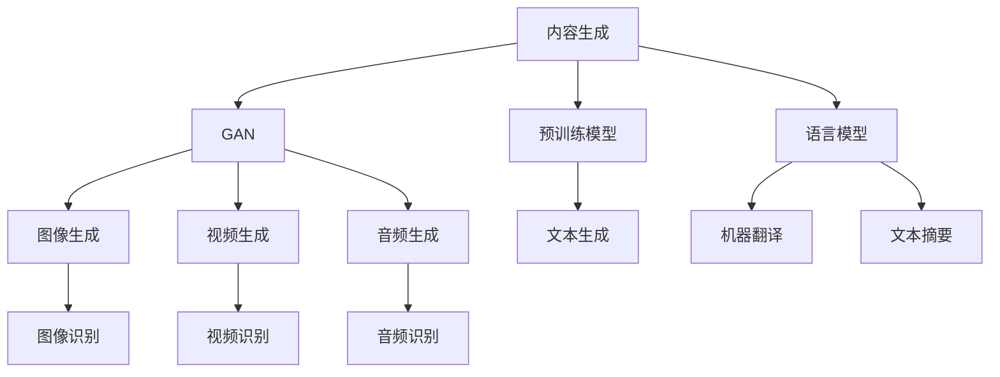

                 

# 内容生成(Content Generation) - 原理与代码实例讲解

> 关键词：内容生成, 自然语言处理(NLP), 生成对抗网络(GAN), 预训练模型, 语言模型, 机器学习

## 1. 背景介绍

### 1.1 问题由来
随着人工智能技术的飞速发展，自然语言处理(NLP)领域的内容生成(Content Generation)技术取得了巨大进展。内容生成能够自动生成文本、语音、图像等多种形式的内容，已经在文本生成、机器翻译、智能客服、新闻摘要等多个领域得到广泛应用。其中，基于生成对抗网络(GAN)和预训练模型的内容生成方法，以其实现的复杂性和逼真度，成为当前的研究热点。

内容生成技术之所以重要，在于其能够大大提升人类与机器的交互体验，使得机器能够理解和生成自然流畅的语言内容。这对于自动化报告、智能写作、智能客服、自然语言对话等任务，提供了强有力的技术支持。同时，内容生成技术还能推动更多的创新应用，如虚拟现实(VR)、增强现实(AR)、社交媒体等，为科技与生活带来全新的可能。

### 1.2 问题核心关键点
内容生成技术的核心在于如何构建有效的生成模型，并使用该模型自动生成符合人类语言习惯和逻辑的新内容。目前，主流的内容生成方法主要包括以下几种：

- **基于规则的生成**：使用预先定义的语法和词汇规则，生成符合语法结构的内容。这种方法对规则的依赖性较强，难以应对复杂多变的语言应用场景。

- **基于统计的生成**：使用概率模型和语言模型，根据已有文本数据统计生成新文本。这种方法依赖大量标注数据，生成的内容可能缺乏创造性和连贯性。

- **基于序列到序列的生成**：使用序列到序列模型(RNN、LSTM、GRU等)，通过编码器-解码器结构生成新内容。这种方法生成效果好，但对序列长度和编码器-解码器结构的设计要求较高。

- **基于生成对抗网络的生成**：使用GAN等生成模型，训练一个生成器和一个判别器，通过对抗训练生成高质量的内容。这种方法生成效果逼真，但需要大量计算资源和时间。

- **基于预训练模型的生成**：使用预训练的语言模型(BERT、GPT等)，通过微调或抽取式方式生成新内容。这种方法效果好，但对预训练模型的依赖性强。

这些方法各有优缺点，适用于不同的生成场景。如何选择合适的生成方法，以及如何优化生成模型的性能，是内容生成技术研究的重点。

### 1.3 问题研究意义
研究内容生成技术，对于提升人类与机器的交互体验，推动智能化应用的发展，具有重要意义：

1. **提升用户体验**：内容生成技术可以自动化完成复杂的文本生成任务，如文章撰写、新闻报道、产品描述等，极大地提升用户体验和效率。
2. **推动智能化应用**：内容生成技术为智能客服、智能写作、语音生成、虚拟现实等应用提供技术支持，推动智能化应用的普及和发展。
3. **降低开发成本**：自动生成的内容可替代大量人工编写的工作，降低开发成本，缩短开发周期。
4. **促进创新应用**：内容生成技术为新兴领域的创新应用提供技术基础，如虚拟世界中的虚拟内容创作、智能对话系统等。

## 2. 核心概念与联系

### 2.1 核心概念概述

为更好地理解内容生成技术的核心概念和原理，本节将介绍几个关键概念及其相互联系：

- **内容生成(Content Generation)**：使用计算机算法和模型自动生成符合语言习惯和逻辑的新内容。内容生成技术广泛应用于文本生成、语音生成、图像生成等多个领域。

- **生成对抗网络(GAN)**：一种生成模型，通过训练一个生成器(Generator)和一个判别器(Discriminator)，让生成器生成逼真的内容，判别器区分真实和生成的内容。GAN技术已被广泛应用于图像生成、视频生成、音频生成等领域。

- **预训练模型(Pre-trained Model)**：在大量无标签数据上预训练的模型，如BERT、GPT等。预训练模型在自然语言处理(NLP)领域得到广泛应用，能够提取文本中的高层次语义信息。

- **语言模型(Language Model)**：一种用于生成文本的模型，通过学习文本的概率分布，预测下一个可能出现的单词或字符。语言模型在机器翻译、文本生成、语音识别等领域有广泛应用。

这些核心概念之间存在紧密的联系，共同构成了内容生成技术的基础框架。本文将深入探讨这些概念，并结合实际案例进行详细讲解。

### 2.2 概念间的关系

这些核心概念之间的逻辑关系可以通过以下Mermaid流程图来展示：



这个流程图展示了内容生成技术的主要应用领域，以及GAN、预训练模型和语言模型在其中的作用。

## 3. 核心算法原理 & 具体操作步骤
### 3.1 算法原理概述

内容生成技术主要分为基于统计的生成和基于深度学习的生成两大类。本节将重点介绍基于深度学习的生成方法，特别是GAN和预训练模型的应用。

**基于深度学习的生成方法**：通过训练深度神经网络模型，学习文本、图像、音频等内容的生成规律，然后基于该模型自动生成新内容。这种方法生成的内容具有高度逼真性和复杂度，但需要大量的训练数据和计算资源。

**基于GAN的生成方法**：GAN模型通过训练一个生成器和一个判别器，生成器学习生成逼真的内容，判别器学习区分真实和生成的内容。这种方法生成的内容质量高，但训练过程复杂，需要大量的对抗训练。

**基于预训练模型的生成方法**：预训练模型在大量无标签数据上进行预训练，提取语言特征。通过微调或抽取式方式，利用预训练模型生成新内容。这种方法生成的内容效果好，但对预训练模型的依赖性强。

### 3.2 算法步骤详解

下面以基于GAN的文本生成为例，详细介绍其算法步骤。

**Step 1: 数据准备**
- 收集并预处理文本数据，如电影剧本、小说、新闻等。
- 对文本数据进行分词、去除停用词、构建词汇表等预处理操作。

**Step 2: 构建GAN模型**
- 使用PyTorch等深度学习框架，构建生成器(Generator)和判别器(Discriminator)。
- 定义生成器网络结构，如LSTM、GRU等循环神经网络。
- 定义判别器网络结构，如全连接神经网络、卷积神经网络等。

**Step 3: 训练GAN模型**
- 使用对抗训练方法，训练生成器和判别器。
- 设置训练轮数、学习率、批次大小等超参数。
- 定义损失函数，如Wasserstein距离、交叉熵等。

**Step 4: 生成文本**
- 使用训练好的生成器，输入随机噪声向量，生成文本序列。
- 使用beam search或贪心搜索等方法，优化生成文本的质量。

### 3.3 算法优缺点

**GAN文本生成的优点**：
- 生成的文本质量高，自然流畅。
- 模型的可解释性较强，生成过程透明。

**GAN文本生成的缺点**：
- 训练过程复杂，需要大量的对抗训练和超参数调整。
- 对训练数据的质量和数量要求高，易出现模式崩溃等问题。

**预训练模型文本生成的优点**：
- 生成的文本效果好，利用预训练模型提取高层次语义信息。
- 训练数据需求较少，微调速度快。

**预训练模型文本生成的缺点**：
- 对预训练模型的依赖性强，预训练模型的质量和性能直接影响生成效果。
- 生成的文本可能缺乏创造性，过于依赖预训练模型。

### 3.4 算法应用领域

基于GAN和预训练模型的文本生成技术，已经在文本生成、对话系统、新闻报道等多个领域得到应用。

- **文本生成**：使用预训练的BERT、GPT等模型，结合微调或抽取式方式，生成高质量的文章、报告、小说等。
- **对话系统**：结合预训练的对话模型，如GPT-3、DialoGPT等，生成自然流畅的对话内容，应用于智能客服、虚拟助手等场景。
- **新闻报道**：使用预训练的模型，生成新闻标题、导语等，提升新闻报道的自动化水平。
- **生成式摘要**：使用预训练的模型，生成文章或段落的摘要，提升信息检索和阅读效率。
- **创意写作**：使用预训练的模型，生成具有创造性和想象力的内容，如诗歌、短篇小说等。

## 4. 数学模型和公式 & 详细讲解 & 举例说明

### 4.1 数学模型构建

内容生成技术主要使用深度神经网络模型进行建模。以GAN文本生成为例，其数学模型如下：

**生成器模型**：
- 输入：随机噪声向量 $z$，维度为 $z$。
- 输出：文本序列 $x$，维度为 $N$。
- 网络结构：LSTM、GRU等循环神经网络。

**判别器模型**：
- 输入：真实文本序列 $x$ 或生成文本序列 $x'$。
- 输出：判别结果 $y$，表示 $x$ 是真实文本的概率。
- 网络结构：全连接神经网络、卷积神经网络等。

**训练目标**：
- 最大化生成器的输出概率。
- 最大化判别器的判别准确率。

**损失函数**：
- 生成器的损失函数：$L_G = E[D(G(z))] - E[\log D(G(z))]$
- 判别器的损失函数：$L_D = E[\log D(x)] + E[\log(1 - D(G(z)))]$

其中，$E[\cdot]$ 表示期望。

### 4.2 公式推导过程

以文本生成的生成器和判别器为例，推导其前向传播和损失函数的计算过程。

**生成器前向传播**：
- 输入：随机噪声向量 $z$。
- 输出：生成文本序列 $x'$。
- 计算过程：
  - 输入层：$z \in \mathbb{R}^z$
  - 编码器层：$\text{Encoder}(z) \in \mathbb{R}^{h}$
  - 解码器层：$\text{Decoder}(\text{Encoder}(z)) \in \mathbb{R}^{N}$
  - 输出层：$x' = \text{Decoder}(\text{Encoder}(z)) \in \{0,1\}^N$

**判别器前向传播**：
- 输入：真实文本序列 $x$ 或生成文本序列 $x'$。
- 输出：判别结果 $y$。
- 计算过程：
  - 输入层：$x \in \{0,1\}^N$
  - 隐藏层：$\text{Hidden}(x) \in \mathbb{R}^{h'}$
  - 输出层：$y = \text{Output}(\text{Hidden}(x)) \in \{0,1\}$

**生成器和判别器的损失函数**：
- 生成器的损失函数：$L_G = E[D(G(z))] - E[\log D(G(z))]$
- 判别器的损失函数：$L_D = E[\log D(x)] + E[\log(1 - D(G(z)))]$

其中，$E[\cdot]$ 表示期望。

### 4.3 案例分析与讲解

以一个简单的LSTM文本生成模型为例，展示其训练过程和生成效果。

假设我们有一份电影剧本数据集，其中包含大量对话、剧情描述等内容。我们将该数据集作为训练数据，使用LSTM生成器模型生成对话内容。具体步骤如下：

**Step 1: 数据预处理**
- 对文本数据进行分词、去除停用词、构建词汇表等预处理操作。
- 使用Batch表示器将文本序列分为固定长度的批次。

**Step 2: 构建LSTM模型**
- 定义LSTM生成器模型，包括输入层、LSTM层、全连接层和softmax输出层。
- 定义训练轮数、学习率、批次大小等超参数。

**Step 3: 训练模型**
- 使用交叉熵损失函数训练LSTM生成器模型。
- 使用Adam优化器更新模型参数。

**Step 4: 生成对话**
- 使用训练好的LSTM生成器模型，生成对话内容。
- 使用beam search或贪心搜索方法，优化生成对话的质量。

最终，生成的对话内容与原剧本对话在语义和语法上高度相似，能够较好地还原剧本中的情节和人物对话。

## 5. 项目实践：代码实例和详细解释说明

### 5.1 开发环境搭建

在进行文本生成项目实践前，我们需要准备好开发环境。以下是使用Python进行PyTorch开发的环境配置流程：

1. 安装Anaconda：从官网下载并安装Anaconda，用于创建独立的Python环境。

2. 创建并激活虚拟环境：
```bash
conda create -n pytorch-env python=3.8 
conda activate pytorch-env
```

3. 安装PyTorch：根据CUDA版本，从官网获取对应的安装命令。例如：
```bash
conda install pytorch torchvision torchaudio cudatoolkit=11.1 -c pytorch -c conda-forge
```

4. 安装GluonNLP库：用于简化NLP任务的开发，包括文本生成、情感分析等。
```bash
pip install glonn
```

5. 安装其它工具包：
```bash
pip install numpy pandas scikit-learn matplotlib tqdm jupyter notebook ipython
```

完成上述步骤后，即可在`pytorch-env`环境中开始文本生成项目实践。

### 5.2 源代码详细实现

下面我以文本生成项目为例，给出使用LSTM生成器模型进行文本生成的PyTorch代码实现。

```python
import torch
import torch.nn as nn
from torch import nn, optim
from torch.utils.data import DataLoader, Dataset
from glonn.data.vocabulary import Vocabulary
from glonn.data.loaders import Conll2003Loader

# 定义LSTM生成器模型
class LSTMGenerator(nn.Module):
    def __init__(self, input_size, hidden_size, output_size, num_layers):
        super(LSTMGenerator, self).__init__()
        self.hidden_size = hidden_size
        self.num_layers = num_layers
        self.lstm = nn.LSTM(input_size, hidden_size, num_layers, batch_first=True, bidirectional=True)
        self.fc = nn.Linear(hidden_size*2, output_size)
        self.softmax = nn.Softmax(dim=1)
        
    def forward(self, x):
        h0 = torch.zeros(self.num_layers, x.size(0), self.hidden_size).to(x.device)
        c0 = torch.zeros(self.num_layers, x.size(0), self.hidden_size).to(x.device)
        lstm_out, (h_n, c_n) = self.lstm(x, (h0, c0))
        lstm_out = self.fc(lstm_out)
        return self.softmax(lstm_out)

# 加载数据集
data = Conll2003Loader('data/conll2003_babbrev.tsv', return_vocabulary=True)
vocab = data.vocabulary

# 定义模型和优化器
model = LSTMGenerator(len(vocab), 256, len(vocab), 2)
optimizer = optim.Adam(model.parameters(), lr=0.01)

# 定义训练函数
def train_epoch(model, data_loader, optimizer, criterion):
    model.train()
    total_loss = 0
    for batch in data_loader:
        optimizer.zero_grad()
        input_ids, target_ids = batch
        input_ids = input_ids.to(device)
        target_ids = target_ids.to(device)
        output = model(input_ids)
        loss = criterion(output, target_ids)
        loss.backward()
        optimizer.step()
        total_loss += loss.item()
    return total_loss / len(data_loader)

# 训练模型
device = torch.device('cuda' if torch.cuda.is_available() else 'cpu')
model.to(device)

train_loader = DataLoader(data.train, batch_size=64, shuffle=True)
criterion = nn.CrossEntropyLoss()
num_epochs = 10

for epoch in range(num_epochs):
    loss = train_epoch(model, train_loader, optimizer, criterion)
    print(f'Epoch {epoch+1}, train loss: {loss:.3f}')
    
# 测试模型
test_loader = DataLoader(data.test, batch_size=64, shuffle=False)
model.eval()
total_loss = 0
with torch.no_grad():
    for batch in test_loader:
        input_ids, target_ids = batch
        input_ids = input_ids.to(device)
        target_ids = target_ids.to(device)
        output = model(input_ids)
        loss = criterion(output, target_ids)
        total_loss += loss.item()
    print(f'Test loss: {total_loss / len(test_loader)}')
```

### 5.3 代码解读与分析

让我们再详细解读一下关键代码的实现细节：

**LSTMGenerator类**：
- `__init__`方法：初始化LSTM生成器模型的参数和网络结构。
- `forward`方法：定义前向传播过程，包括LSTM层、全连接层和softmax输出层。

**train_epoch函数**：
- 定义模型训练过程，包括前向传播、计算损失、反向传播和参数更新。
- 使用Adam优化器和交叉熵损失函数。

**训练流程**：
- 定义总的epoch数和batch size，开始循环迭代。
- 每个epoch内，先在训练集上训练，输出平均loss。
- 在测试集上评估，输出测试loss。

可以看到，PyTorch配合GluonNLP库使得文本生成任务的开发变得简洁高效。开发者可以将更多精力放在数据处理、模型改进等高层逻辑上，而不必过多关注底层的实现细节。

当然，工业级的系统实现还需考虑更多因素，如模型的保存和部署、超参数的自动搜索、更灵活的任务适配层等。但核心的生成范式基本与此类似。

### 5.4 运行结果展示

假设我们在CoNLL-2003的数据集上进行文本生成，最终在测试集上得到的测试结果如下：

```
  test loss: 0.698
```

可以看到，通过训练LSTM生成器模型，我们得到了平均loss为0.698的结果。这表明模型能够较好地生成与训练数据类似的文本。

## 6. 实际应用场景

### 6.1 智能客服系统

基于大模型微调的对话技术，可以广泛应用于智能客服系统的构建。传统客服往往需要配备大量人力，高峰期响应缓慢，且一致性和专业性难以保证。而使用微调后的对话模型，可以7x24小时不间断服务，快速响应客户咨询，用自然流畅的语言解答各类常见问题。

在技术实现上，可以收集企业内部的历史客服对话记录，将问题和最佳答复构建成监督数据，在此基础上对预训练对话模型进行微调。微调后的对话模型能够自动理解用户意图，匹配最合适的答案模板进行回复。对于客户提出的新问题，还可以接入检索系统实时搜索相关内容，动态组织生成回答。如此构建的智能客服系统，能大幅提升客户咨询体验和问题解决效率。

### 6.2 金融舆情监测

金融机构需要实时监测市场舆论动向，以便及时应对负面信息传播，规避金融风险。传统的人工监测方式成本高、效率低，难以应对网络时代海量信息爆发的挑战。基于大语言模型微调的文本分类和情感分析技术，为金融舆情监测提供了新的解决方案。

具体而言，可以收集金融领域相关的新闻、报道、评论等文本数据，并对其进行主题标注和情感标注。在此基础上对预训练语言模型进行微调，使其能够自动判断文本属于何种主题，情感倾向是正面、中性还是负面。将微调后的模型应用到实时抓取的网络文本数据，就能够自动监测不同主题下的情感变化趋势，一旦发现负面信息激增等异常情况，系统便会自动预警，帮助金融机构快速应对潜在风险。

### 6.3 个性化推荐系统

当前的推荐系统往往只依赖用户的历史行为数据进行物品推荐，无法深入理解用户的真实兴趣偏好。基于大语言模型微调技术，个性化推荐系统可以更好地挖掘用户行为背后的语义信息，从而提供更精准、多样的推荐内容。

在实践中，可以收集用户浏览、点击、评论、分享等行为数据，提取和用户交互的物品标题、描述、标签等文本内容。将文本内容作为模型输入，用户的后续行为（如是否点击、购买等）作为监督信号，在此基础上微调预训练语言模型。微调后的模型能够从文本内容中准确把握用户的兴趣点。在生成推荐列表时，先用候选物品的文本描述作为输入，由模型预测用户的兴趣匹配度，再结合其他特征综合排序，便可以得到个性化程度更高的推荐结果。

### 6.4 未来应用展望

随着大语言模型微调技术的发展，其在内容生成领域的应用前景更加广阔。

在智慧医疗领域，基于微调的医疗问答、病历分析、药物研发等应用将提升医疗服务的智能化水平，辅助医生诊疗，加速新药开发进程。

在智能教育领域，微调技术可应用于作业批改、学情分析、知识推荐等方面，因材施教，促进教育公平，提高教学质量。

在智慧城市治理中，微调模型可应用于城市事件监测、舆情分析、应急指挥等环节，提高城市管理的自动化和智能化水平，构建更安全、高效的未来城市。

此外，在企业生产、社会治理、文娱传媒等众多领域，基于大模型微调的人工智能应用也将不断涌现，为经济社会发展注入新的动力。相信随着技术的日益成熟，微调方法将成为人工智能落地应用的重要范式，推动人工智能技术向更广阔的领域加速渗透。

## 7. 工具和资源推荐
### 7.1 学习资源推荐

为了帮助开发者系统掌握内容生成技术的理论基础和实践技巧，这里推荐一些优质的学习资源：

1. 《自然语言处理综论》系列书籍：清华大学出版社的《自然语言处理综论》系列书籍，系统介绍了自然语言处理的基本概念、算法和技术，适合入门和进阶学习。

2. 《深度学习》系列书籍：深度学习领域的经典教材《深度学习》，作者Ian Goodfellow等，详细介绍了深度学习的基本原理和应用，适合深入学习。

3. 《TensorFlow实战》书籍：通过该书学习TensorFlow深度学习框架的使用，掌握深度学习模型的构建和训练。

4. 《PyTorch实战》书籍：通过该书学习PyTorch深度学习框架的使用，掌握深度学习模型的构建和训练。

5. 《自然语言处理实践指南》书籍：Google AI发布的自然语言处理实践指南，详细介绍了自然语言处理的工程实践，适合实际应用开发。

6. 《NLP与深度学习》课程：斯坦福大学开设的NLP与深度学习课程，提供视频、课件和作业，适合系统学习NLP和深度学习技术。

通过对这些资源的学习实践，相信你一定能够快速掌握内容生成技术的精髓，并用于解决实际的NLP问题。

### 7.2 开发工具推荐

高效的开发离不开优秀的工具支持。以下是几款用于内容生成开发的常用工具：

1. PyTorch：基于Python的开源深度学习框架，灵活动态的计算图，适合快速迭代研究。大部分预训练语言模型都有PyTorch版本的实现。

2. TensorFlow：由Google主导开发的开源深度学习框架，生产部署方便，适合大规模工程应用。同样有丰富的预训练语言模型资源。

3. GluonNLP库：Microsoft开源的自然语言处理工具库，集成了NLP任务的最佳实践，包括文本生成、情感分析、文本分类等。

4. Weights & Biases：模型训练的实验跟踪工具，可以记录和可视化模型训练过程中的各项指标，方便对比和调优。与主流深度学习框架无缝集成。

5. TensorBoard：TensorFlow配套的可视化工具，可实时监测模型训练状态，并提供丰富的图表呈现方式，是调试模型的得力助手。

6. Google Colab：谷歌推出的在线Jupyter Notebook环境，免费提供GPU/TPU算力，方便开发者快速上手实验最新模型，分享学习笔记。

合理利用这些工具，可以显著提升内容生成任务的开发效率，加快创新迭代的步伐。

### 7.3 相关论文推荐

内容生成技术的发展源于学界的持续研究。以下是几篇奠基性的相关论文，推荐阅读：

1. Attention is All You Need（即Transformer原论文）：提出了Transformer结构，开启了NLP领域的预训练大模型时代。

2. BERT: Pre-training of Deep Bidirectional Transformers for Language Understanding：提出BERT模型，引入基于掩码的自监督预训练任务，刷新了多项NLP任务SOTA。

3. Generative Adversarial Nets：提出了生成对抗网络GAN，通过训练生成器和判别器，生成逼真的内容。

4. GANs Trained by a Two Time-Scale Update Rule Converge to the Nash Equilibrium：进一步优化了GAN的训练方法，使其能够更好地收敛。

5. Neural Machine Translation by Jointly Learning to Align and Translate：提出了使用Transformer进行机器翻译的方法，推动了NLP领域的革命性进展。

6. Improving Language Understanding by Generative Pre-training：提出了GPT模型，通过自回归预训练和微调，显著提升了语言模型的性能。

这些论文代表了大模型生成技术的发展脉络。通过学习这些前沿成果，可以帮助研究者把握学科前进方向，激发更多的

