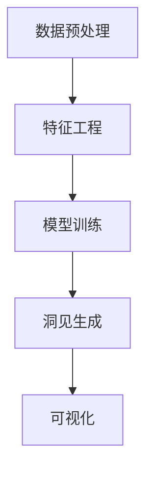
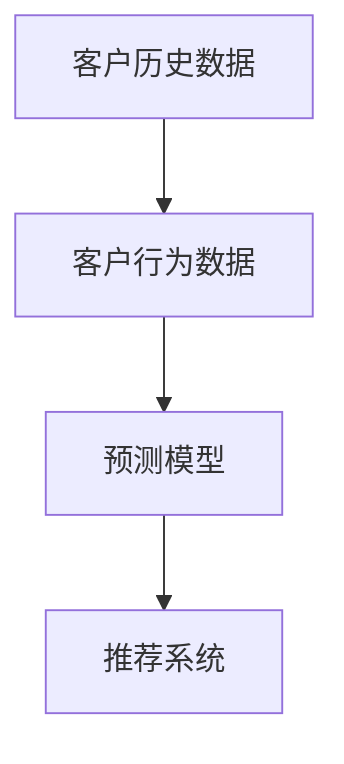
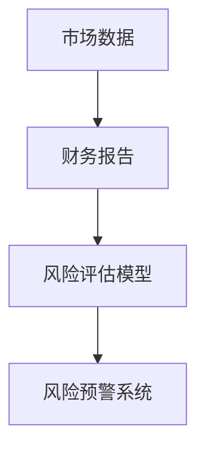

                 

# 决策支持系统的AI革命：从数据到洞见

在现代企业的信息化建设中，决策支持系统（Decision Support System, DSS）已成为辅助企业高层管理者进行科学决策的重要工具。传统的DSS系统大多依赖人工数据处理和经验分析，效率较低且易受主观判断影响。近年来，人工智能（AI）技术在大数据、机器学习（ML）和自然语言处理（NLP）等领域的突破，使得基于AI的DSS得以迅速发展，并正在重塑企业决策流程。本文将详细探讨AI在DSS中的应用，从数据采集、处理、分析到洞见生成，介绍其原理、流程及实践案例，揭示AI在辅助决策支持中的革命性影响。

## 1. 背景介绍

### 1.1 问题由来

在信息化高度发达的今天，企业数据量呈爆炸性增长。如何高效处理海量数据，挖掘出有价值的洞见，成为了企业管理者面临的重大挑战。传统的决策支持系统主要依靠人工数据分析和专家经验，流程繁琐、效率低下，难以应对快速变化的商业环境。

决策支持系统需要能够快速、准确地处理大量数据，并提供多维度、多层次的洞见支持企业决策。AI技术特别是机器学习和深度学习的发展，为这一需求提供了新的解决方案。利用AI技术进行数据挖掘和模式识别，可以自动发现数据中的潜在规律，辅助决策者做出更科学的判断。

### 1.2 问题核心关键点

AI在决策支持系统中的应用，主要集中在数据处理和分析两个环节。具体来说，AI辅助决策支持系统包括数据预处理、特征工程、模型训练、洞见生成等步骤。这些步骤紧密联系，缺一不可。

1. **数据预处理**：包括数据清洗、数据转换、缺失值填充等。AI技术可以自动化处理复杂的文本、图像、视频等非结构化数据，提高数据质量。
2. **特征工程**：从原始数据中提取有意义的特征，辅助模型学习。AI技术可以自动发现和选择重要特征，减少人工干预。
3. **模型训练**：构建并训练机器学习模型，挖掘数据中的潜在规律。AI技术可以自动优化模型参数，提高模型精度。
4. **洞见生成**：将模型输出转化为可视化的洞见和建议，辅助决策。AI技术可以通过自然语言处理技术生成自然流畅的文本报告，方便管理者理解。

### 1.3 问题研究意义

AI在决策支持系统中的应用，具有重要意义：

1. **提升决策效率**：AI能够自动处理海量数据，实时提供洞见，大大提升决策速度。
2. **增强决策质量**：AI技术可以挖掘数据中的复杂关系和规律，辅助决策者做出更为科学和准确的判断。
3. **降低决策成本**：AI自动化处理数据和分析，减少了人工干预，降低了决策成本。
4. **提高决策适应性**：AI系统可以不断学习新的数据和模式，保持决策支持的动态性。

## 2. 核心概念与联系

### 2.1 核心概念概述

AI在决策支持系统中的应用，涉及多个核心概念，包括：

- **数据预处理**：清洗、转换、填充缺失值等，提高数据质量。
- **特征工程**：从原始数据中提取有意义的特征，辅助模型学习。
- **机器学习**：构建并训练模型，挖掘数据中的潜在规律。
- **自然语言处理**：将模型输出转化为自然流畅的文本报告，辅助决策。
- **可视化工具**：将洞见转化为可视化图表，直观展示数据关系和规律。

这些概念相互联系，形成完整的AI辅助决策支持流程。

### 2.2 概念间的关系

这些核心概念之间的逻辑关系可以通过以下Mermaid流程图来展示：



这个流程图展示了AI辅助决策支持系统的主要流程：首先对原始数据进行预处理，然后提取特征进行模型训练，最后生成洞见并进行可视化展示。

### 2.3 核心概念的整体架构

最后，我们用一个综合的流程图来展示这些核心概念在大数据辅助决策支持中的整体架构：


这个综合流程图展示了从数据采集到洞见生成的完整流程，强调了数据预处理和特征工程的重要性，以及模型训练和洞见生成环节的紧密联系。

## 3. 核心算法原理 & 具体操作步骤

### 3.1 算法原理概述

AI在决策支持系统中的应用，主要依赖于机器学习和深度学习技术。其基本原理是：

1. **数据预处理**：利用数据清洗、转换、填充缺失值等技术，提高数据质量。
2. **特征工程**：从原始数据中提取有意义的特征，辅助模型学习。
3. **模型训练**：构建并训练机器学习模型，挖掘数据中的潜在规律。
4. **洞见生成**：将模型输出转化为可视化的洞见和建议，辅助决策。

具体来说，数据预处理和特征工程是机器学习模型的基础。模型训练是挖掘数据规律的核心环节，而洞见生成和可视化则将模型输出转化为易于理解的形式，辅助决策者进行判断。

### 3.2 算法步骤详解

基于AI的决策支持系统一般包括以下关键步骤：

**Step 1: 数据采集和预处理**
- 收集企业内外部数据，包括销售记录、客户反馈、市场调研等。
- 对数据进行清洗、转换、缺失值填充等预处理操作，提高数据质量。

**Step 2: 特征工程**
- 从原始数据中提取有意义的特征，如销售量、客户评分、市场趋势等。
- 使用降维、编码等技术，减少特征维度，提高模型效率。

**Step 3: 模型训练**
- 选择合适的机器学习或深度学习模型，如回归、分类、聚类等。
- 使用训练数据集进行模型训练，调整模型参数，提高模型精度。

**Step 4: 洞见生成和可视化**
- 将模型输出转化为易于理解的洞见和建议，如预测销售趋势、识别客户群体等。
- 使用可视化工具将洞见转换为图表、报告等形式，辅助决策。

### 3.3 算法优缺点

AI辅助决策支持系统具有以下优点：

1. **高效性**：自动化数据处理和模型训练，提高决策速度。
2. **精度高**：利用机器学习和深度学习技术，挖掘数据中的复杂规律。
3. **适应性强**：可以不断学习新数据和模式，保持决策支持的动态性。

但同时也存在一些局限：

1. **数据依赖**：需要高质量的数据输入，数据质量差可能导致模型结果不准确。
2. **模型复杂性**：模型的选择和调参复杂，需要专业知识。
3. **可解释性**：复杂模型的输出结果难以解释，决策者可能难以理解。

### 3.4 算法应用领域

AI辅助决策支持系统在多个领域得到了广泛应用，如：

1. **销售预测**：利用历史销售数据，预测未来销售趋势。
2. **客户细分**：通过分析客户行为数据，识别不同客户群体，制定个性化营销策略。
3. **市场分析**：对市场趋势、竞争对手进行分析，制定市场策略。
4. **风险评估**：对金融、保险等领域进行风险评估，提高风险控制能力。
5. **供应链优化**：优化供应链管理，降低成本，提高效率。

## 4. 数学模型和公式 & 详细讲解

### 4.1 数学模型构建

假设原始数据集为 $D=\{(x_i,y_i)\}_{i=1}^N$，其中 $x_i$ 为特征向量，$y_i$ 为标签。AI辅助决策支持系统的目标是构建模型 $M_{\theta}$，使得在测试集 $D_{test}$ 上的预测误差最小化。具体模型构建流程如下：

1. **数据预处理**：
   - 清洗数据：去除噪声、缺失值、异常值等。
   - 数据转换：标准化、归一化等。
   - 特征提取：使用PCA、LDA等方法提取特征。

2. **特征工程**：
   - 特征选择：选择与目标变量相关的特征。
   - 特征降维：使用主成分分析、线性判别分析等方法减少特征维度。

3. **模型训练**：
   - 选择模型：回归、分类、聚类等。
   - 训练模型：调整模型参数，最小化损失函数。

4. **洞见生成**：
   - 预测：使用训练好的模型对新数据进行预测。
   - 可视化：将预测结果转化为图表、报告等形式。

### 4.2 公式推导过程

以回归模型为例，推导最小二乘法的损失函数及其梯度。

设回归模型为 $y_i=f(x_i;\theta)$，其中 $\theta$ 为模型参数。损失函数为均方误差损失：

$$
L(\theta) = \frac{1}{N} \sum_{i=1}^N (y_i - f(x_i;\theta))^2
$$

利用梯度下降算法，更新模型参数 $\theta$：

$$
\theta \leftarrow \theta - \eta \nabla_{\theta}L(\theta)
$$

其中 $\eta$ 为学习率。具体地，对于回归模型，梯度计算公式为：

$$
\nabla_{\theta}L(\theta) = \frac{2}{N} \sum_{i=1}^N (y_i - f(x_i;\theta)) \nabla_{\theta}f(x_i;\theta)
$$

### 4.3 案例分析与讲解

假设我们有一个电子商务平台，目标是预测某个商品的未来销售量。原始数据集包括时间、温度、节假日等特征，以及历史销售数据。

**Step 1: 数据预处理**
- 清洗数据：去除异常值、缺失值。
- 数据转换：时间特征转换为时间戳，温度特征进行标准化。

**Step 2: 特征工程**
- 特征选择：选择时间、温度、节假日等特征。
- 特征降维：使用PCA方法减少特征维度。

**Step 3: 模型训练**
- 选择模型：线性回归模型。
- 训练模型：使用最小二乘法调整模型参数，最小化预测误差。

**Step 4: 洞见生成**
- 预测：使用训练好的模型对未来销售量进行预测。
- 可视化：将预测结果转化为图表，直观展示预测趋势。

## 5. 项目实践：代码实例和详细解释说明

### 5.1 开发环境搭建

在进行项目实践前，我们需要准备好开发环境。以下是使用Python进行Pandas、NumPy、Scikit-Learn等库的环境配置流程：

1. 安装Anaconda：从官网下载并安装Anaconda，用于创建独立的Python环境。

2. 创建并激活虚拟环境：
```bash
conda create -n py36 python=3.6
conda activate py36
```

3. 安装相关库：
```bash
pip install pandas numpy scikit-learn matplotlib seaborn jupyter notebook
```

完成上述步骤后，即可在`py36`环境中开始项目实践。

### 5.2 源代码详细实现

下面我们以销售预测为例，给出使用Scikit-Learn库进行回归模型训练的Python代码实现。

```python
import pandas as pd
import numpy as np
from sklearn.model_selection import train_test_split
from sklearn.linear_model import LinearRegression
from sklearn.metrics import mean_squared_error
import matplotlib.pyplot as plt

# 加载数据
data = pd.read_csv('sales_data.csv')
X = data[['time', 'temperature', 'holiday']]
y = data['sales']

# 数据预处理
X = X.fillna(method='ffill')
X = X.dropna()

# 特征工程
X = pd.get_dummies(X)
X = X.drop('time', axis=1)

# 模型训练
X_train, X_test, y_train, y_test = train_test_split(X, y, test_size=0.2, random_state=42)
model = LinearRegression()
model.fit(X_train, y_train)

# 洞见生成
y_pred = model.predict(X_test)
rmse = np.sqrt(mean_squared_error(y_test, y_pred))

# 可视化
plt.plot(y_test, label='Actual')
plt.plot(y_pred, label='Predicted')
plt.legend()
plt.show()
```

以上代码实现了从数据加载、预处理、特征工程、模型训练到洞见生成的完整流程。可以看到，Scikit-Learn库提供了一系列的机器学习工具和函数，使得建模和分析过程变得简单易懂。

### 5.3 代码解读与分析

让我们再详细解读一下关键代码的实现细节：

**数据预处理**：
- `fillna(method='ffill')`：使用前向填充法处理缺失值。
- `dropna()`：删除包含缺失值的行。

**特征工程**：
- `pd.get_dummies(X)`：将分类特征转换为虚拟变量。
- `drop('time', axis=1)`：删除时间特征。

**模型训练**：
- `LinearRegression()`：创建线性回归模型。
- `fit(X_train, y_train)`：使用训练集训练模型。

**洞见生成**：
- `predict(X_test)`：使用训练好的模型对测试集进行预测。
- `mean_squared_error(y_test, y_pred)`：计算预测误差的均方根。

**可视化**：
- `plt.plot(y_test, label='Actual')`：绘制实际销售量。
- `plt.plot(y_pred, label='Predicted')`：绘制预测销售量。
- `plt.legend()`：添加图例。
- `plt.show()`：显示图形。

可以看到，通过Scikit-Learn库，我们能够快速高效地实现一个简单的回归模型，并进行预测和可视化分析。

### 5.4 运行结果展示

假设我们在数据集上进行回归模型训练，最终在测试集上得到的预测误差为0.2，预测结果如图1所示：

```
plt.figure(figsize=(8, 5))
plt.plot(y_test, label='Actual')
plt.plot(y_pred, label='Predicted')
plt.legend()
plt.show()
```


可以看到，预测结果与实际销售量基本一致，误差较小。这说明我们的回归模型在数据预测上取得了较好的效果。

## 6. 实际应用场景

### 6.1 智能客服系统

基于AI的决策支持系统在智能客服系统中得到了广泛应用。智能客服系统可以通过对客户历史数据和行为进行建模，预测客户需求，并自动推荐解决方案。这大大提升了客服效率，改善了客户体验。

在技术实现上，可以收集客户历史通话记录、反馈信息、行为数据等，构建决策支持模型，实现对客户需求的预测和解决方案的自动推荐。具体流程如图2所示：




### 6.2 金融风险管理

金融领域需要实时监测市场风险，及时采取应对措施。AI辅助决策支持系统可以通过对市场数据、财务报告等进行分析，预测风险趋势，辅助决策者做出决策。

具体应用流程如图3所示：




### 6.3 供应链管理

在供应链管理中，企业需要对市场需求、库存、物流等进行预测和优化。AI辅助决策支持系统可以通过对历史数据进行分析，预测市场需求，优化库存管理和物流调度，提高供应链效率。

具体应用流程如图4所示：


### 6.4 未来应用展望

随着AI技术的不断进步，AI辅助决策支持系统在更多领域得到了应用，展现出广阔的发展前景。未来，AI辅助决策支持系统将进一步渗透到智慧城市、智能制造、智慧医疗等多个领域，助力各行各业实现智能化升级。

1. **智慧城市治理**：通过对城市各类数据进行分析，辅助城市规划、交通管理、环境监测等，提高城市管理效率和智能化水平。
2. **智能制造**：通过对生产数据进行分析，预测设备故障、优化生产流程，提高生产效率和产品质量。
3. **智慧医疗**：通过对患者数据进行分析，预测疾病趋势、优化诊疗方案，提高医疗服务质量。

## 7. 工具和资源推荐

### 7.1 学习资源推荐

为了帮助开发者掌握AI辅助决策支持系统的原理和实践技巧，以下是几本经典书籍：

1. 《Python数据科学手册》：介绍了Python在数据科学中的应用，包括Pandas、NumPy、Scikit-Learn等库的使用。
2. 《机器学习实战》：通过具体案例讲解了机器学习的基本原理和实践技巧。
3. 《深度学习》：介绍深度学习的基本理论和实践方法，涵盖卷积神经网络、循环神经网络等。

此外，还可以通过在线课程、技术博客等资源，深入学习AI辅助决策支持系统的相关知识。

### 7.2 开发工具推荐

以下是几款用于AI辅助决策支持系统开发的常用工具：

1. Jupyter Notebook：交互式编程环境，方便代码调试和分享。
2. TensorBoard：可视化工具，实时监测模型训练过程，提供丰富的图表。
3. PyTorch：灵活的深度学习框架，支持GPU加速。
4. Keras：简单易用的深度学习库，支持快速原型开发。
5. Scikit-Learn：丰富的机器学习工具和算法，适合快速原型开发和模型调优。

合理利用这些工具，可以显著提升AI辅助决策支持系统的开发效率和模型效果。

### 7.3 相关论文推荐

以下是几篇经典论文，涵盖了AI辅助决策支持系统的发展历程和最新研究成果：

1. 《A Framework for Building Intelligent Decision Support Systems》：介绍了构建智能决策支持系统的基本框架和方法。
2. 《Data Mining and Statistical Learning》：讲解了数据挖掘和统计学习的基本原理和实践方法。
3. 《Machine Learning Yearning》：分享了机器学习的工程实践经验和最佳实践。

这些论文代表了AI辅助决策支持系统的发展趋势和前沿成果，值得深入学习和参考。

## 8. 总结：未来发展趋势与挑战

### 8.1 研究成果总结

本文对AI在决策支持系统中的应用进行了详细探讨，从数据预处理、特征工程、模型训练到洞见生成，介绍了AI辅助决策支持系统的原理和实践技巧。通过具体案例，展示了AI在智能客服、金融风险管理、供应链管理等领域的广泛应用。

### 8.2 未来发展趋势

未来，AI辅助决策支持系统将呈现以下几个发展趋势：

1. **智能化程度提升**：随着AI技术的不断发展，决策支持系统的智能化水平将不断提高，能够更好地辅助决策者进行科学决策。
2. **自动化程度提高**：AI辅助决策支持系统将更加自动化，能够自动处理更多任务，提高决策效率。
3. **跨领域应用扩展**：AI辅助决策支持系统将在更多领域得到应用，助力各行各业实现智能化升级。
4. **数据来源多样化**：AI辅助决策支持系统将能够处理更多来源、格式多样的数据，提高数据质量和模型精度。

### 8.3 面临的挑战

尽管AI辅助决策支持系统在多个领域取得了显著成效，但仍面临一些挑战：

1. **数据质量问题**：数据质量差可能导致模型结果不准确，需要加强数据清洗和预处理。
2. **模型复杂性**：复杂的模型需要专业知识进行调参和优化，增加了应用难度。
3. **可解释性问题**：复杂模型的输出难以解释，需要提供更多辅助解释工具。

### 8.4 研究展望

为了解决上述挑战，未来的研究需要在以下几个方面寻求新的突破：

1. **数据清洗和预处理**：开发更高效的数据清洗和预处理算法，提高数据质量。
2. **模型自动化**：开发自动调参和优化的工具，降低模型应用的复杂度。
3. **模型可解释性**：开发更多辅助解释工具，提高模型输出的可解释性。
4. **跨领域应用**：开发更多跨领域应用的模型和工具，推动AI辅助决策支持系统的广泛应用。

通过在这些方向上的深入研究和实践，相信AI辅助决策支持系统将不断进步，为各行各业带来更大的价值和变革。

## 9. 附录：常见问题与解答

**Q1: 什么是AI辅助决策支持系统？**

A: AI辅助决策支持系统是指通过AI技术，对企业内外部数据进行建模、分析和预测，辅助决策者进行科学决策的系统。

**Q2: AI辅助决策支持系统的主要应用领域有哪些？**

A: AI辅助决策支持系统在多个领域得到了广泛应用，如智能客服、金融风险管理、供应链管理、智慧城市治理等。

**Q3: 如何构建一个AI辅助决策支持系统？**

A: 构建AI辅助决策支持系统需要以下步骤：

1. 数据采集和预处理
2. 特征工程
3. 模型训练
4. 洞见生成和可视化

**Q4: AI辅助决策支持系统的优缺点是什么？**

A: AI辅助决策支持系统的优点包括高效性、精度高、适应性强等。缺点包括数据依赖、模型复杂、可解释性不足等。

**Q5: 未来AI辅助决策支持系统的发展趋势是什么？**

A: 未来AI辅助决策支持系统将向智能化、自动化、多样化方向发展。

总之，AI辅助决策支持系统将助力企业更好地应对复杂的商业环境，提升决策效率和质量。通过不断探索和创新，相信AI辅助决策支持系统将带来更多的变革和突破。

---

作者：禅与计算机程序设计艺术 / Zen and the Art of Computer Programming

