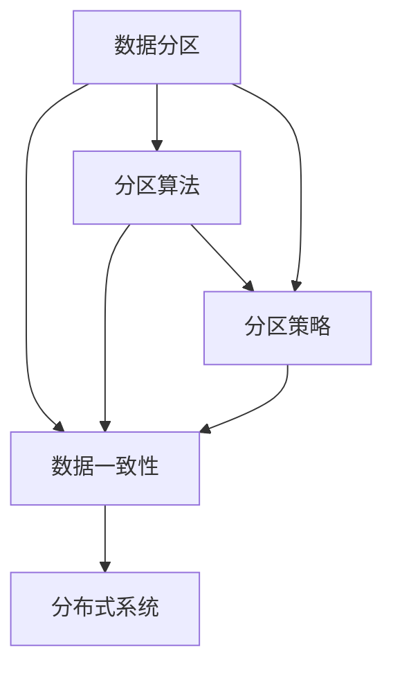
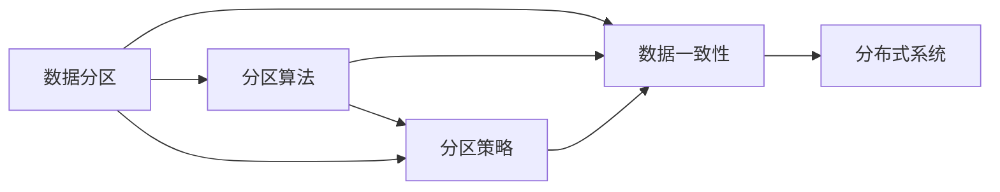
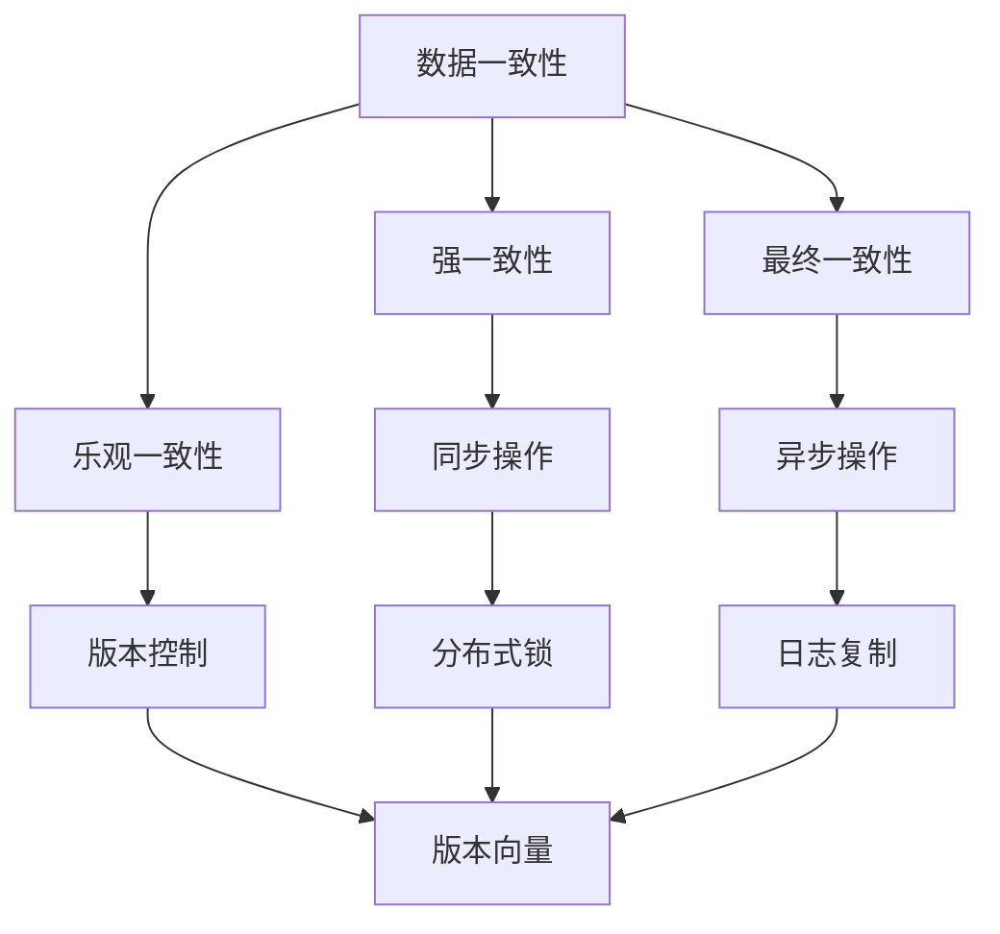
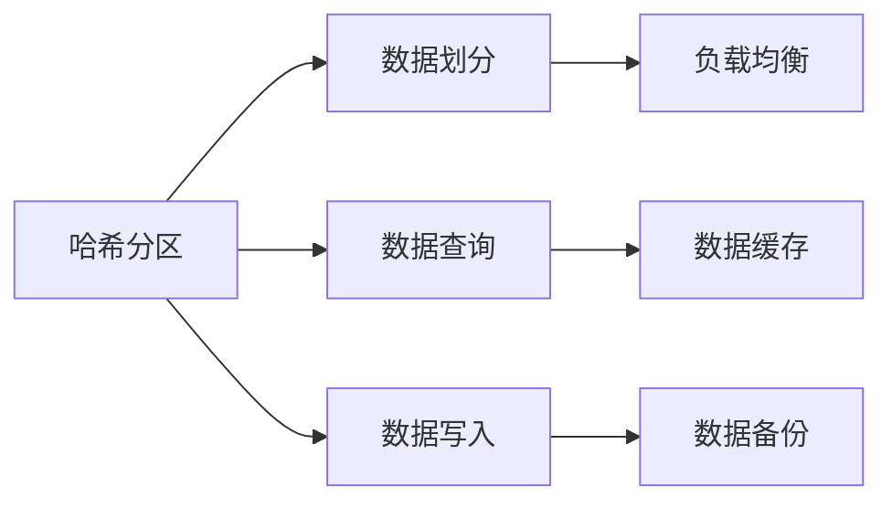

                 

# 分区 原理与代码实例讲解

> 关键词：分区, 数据存储, 分布式系统, 数据一致性, 数据分区算法, 数据分区实践

## 1. 背景介绍

### 1.1 问题由来
在分布式系统中，数据分区是一种常见的数据管理策略。通过分区，将大规模数据集切分成多个部分，分散存放在多个节点上，从而提高系统的并行处理能力，降低数据读写延迟，增强系统的可靠性。但与此同时，数据分区也带来了一些挑战，如数据一致性、系统复杂度等。

### 1.2 问题核心关键点
数据分区的主要目标是通过将数据分散存储，提高系统处理能力和扩展性。但分区策略的好坏，直接影响系统的性能和可靠性。数据分区的关键点包括：
- 分区粒度：数据划分成哪些大小和类型的分区。
- 分区算法：如何根据分区粒度将数据进行合理的划分。
- 分区策略：如何在不同的场景下选择合适的分区策略，如哈希分区、范围分区、哈希+范围混合分区等。
- 数据一致性：如何保证分区数据的一致性，避免数据冗余和丢失。
- 系统复杂度：如何设计系统架构，确保数据分区后系统的运行效率和稳定。

### 1.3 问题研究意义
数据分区技术对于分布式系统的构建和优化具有重要意义：
1. 提高系统并行度：分区可以将数据分散到多个节点上，并行处理，提高系统的处理能力。
2. 增强系统扩展性：分区策略可以使系统更容易进行扩展，增加节点时数据分区策略可以自动调整。
3. 减少数据延迟：分区可以降低数据读写延迟，提高系统的响应速度。
4. 保证数据可靠性：分区策略可以避免单点故障，提高系统的可靠性。
5. 简化系统设计：分区可以简化系统设计和架构，使系统更容易维护和管理。

## 2. 核心概念与联系

### 2.1 核心概念概述

为更好地理解数据分区的原理和实现，本节将介绍几个密切相关的核心概念：

- 数据分区(Data Partitioning)：指将大规模数据集切分成多个部分，分散存放在多个节点上。
- 数据一致性(Data Consistency)：指分区数据在多个节点上保持一致，避免数据冗余和丢失。
- 分区算法(Partitioning Algorithm)：指根据分区粒度将数据进行合理划分的算法，如哈希分区、范围分区等。
- 分区策略(Partitioning Strategy)：指在不同场景下选择合适的分区策略，如单键分区、多键分区、哈希+范围混合分区等。
- 分布式系统(Distributed System)：指由多个节点组成的网络系统，每个节点具有独立的处理能力。

这些核心概念之间的逻辑关系可以通过以下Mermaid流程图来展示：



这个流程图展示了大数据分区涉及的核心概念及其之间的关系：

1. 数据分区是数据一致性和分区算法的目标，保证数据在多个节点上保持一致。
2. 分区算法是数据分区的关键，决定了如何划分数据。
3. 分区策略在实际应用中非常重要，决定了在何种场景下选择何种算法。
4. 分布式系统是数据分区的最终应用场景，数据分区技术的目标是提升分布式系统的性能和可靠性。

### 2.2 概念间的关系

这些核心概念之间存在着紧密的联系，形成了数据分区的完整生态系统。下面我们通过几个Mermaid流程图来展示这些概念之间的关系。

#### 2.2.1 数据分区的学习范式



这个流程图展示了大数据分区的学习范式。数据分区涉及数据一致性、分区算法和分区策略，是分布式系统设计的基础。

#### 2.2.2 数据一致性保证机制



这个流程图展示了数据一致性保证的几种机制。数据一致性可以通过强一致性、最终一致性和乐观一致性来保证。强一致性通常通过同步操作实现，如分布式锁、日志复制等。最终一致性和乐观一致性则通过版本控制和版本向量来实现。

#### 2.2.3 分区算法的应用



这个流程图展示了哈希分区算法在实际应用中的具体场景。哈希分区通过哈希函数将数据进行划分，并应用于数据写入和数据查询。哈希分区可以提高数据查询和写入的效率，同时有利于负载均衡和数据备份。

## 3. 核心算法原理 & 具体操作步骤
### 3.1 算法原理概述

数据分区的核心算法包括哈希分区、范围分区、哈希+范围混合分区等。其中，哈希分区是最常用的分区算法，具有简单的实现和高效的性能。哈希分区的原理是将数据按照某个哈希函数的结果，均匀切分成多个分区。

哈希函数的选择很重要，一般要求具有均匀分布、高碰撞率、低计算复杂度等特性。常用的哈希函数包括MD5、SHA-1等。哈希分区算法的核心步骤包括：

1. 选择合适的哈希函数，将数据按照哈希函数的结果进行划分。
2. 确定分区的数量，根据数据量和工作负载，合理划分分区。
3. 数据分区的过程，将数据存储在不同的分区上。

### 3.2 算法步骤详解

哈希分区的具体步骤如下：

1. 选择哈希函数：选择具有均匀分布和低碰撞率的哈希函数，如MD5、SHA-1等。
2. 确定分区数量：根据数据量和工作负载，合理确定分区的数量。一般建议分区数量不要小于数据总量的1/4。
3. 数据划分：根据哈希函数将数据划分成多个分区，存储在不同的节点上。

### 3.3 算法优缺点

哈希分区算法的优点包括：
- 实现简单：哈希函数简单易实现，数据划分过程简单高效。
- 负载均衡：哈希分区可以自动实现数据的负载均衡，避免某个节点负载过重。
- 高效性能：哈希分区可以显著提高数据查询和写入的效率。

哈希分区算法的缺点包括：
- 数据一致性：哈希分区可能导致数据不一致，某些分区数据无法及时同步到其他分区。
- 数据冗余：哈希分区可能导致数据冗余，某些分区可能包含相同的数据。
- 分区固定：哈希分区分区数量固定，无法根据数据量和负载动态调整。

### 3.4 算法应用领域

哈希分区算法广泛应用于分布式系统中的数据管理，包括：

- 数据库管理系统：如MySQL、MongoDB等，通过哈希分区提高查询效率。
- 大数据系统：如Hadoop、Spark等，通过哈希分区提高数据处理的并行度和效率。
- 云存储系统：如AWS S3、Google Cloud Storage等，通过哈希分区提高数据的存储和访问性能。

## 4. 数学模型和公式 & 详细讲解 & 举例说明

### 4.1 数学模型构建

在哈希分区中，我们需要将数据集 $D$ 按照哈希函数 $H$ 进行划分，生成多个分区 $P_1, P_2, \ldots, P_k$。设 $H$ 是输入为 $x$ 的哈希函数，输出为 $[0, 1]$ 之间的整数。分区策略为：

$$
p_i = \left\lfloor \frac{i}{k} + H(x) \right\rfloor \mod k
$$

其中 $p_i$ 表示数据 $x$ 在分区 $i$ 中的位置，$k$ 为分区数量。

### 4.2 公式推导过程

在推导哈希分区的数学模型时，我们需要考虑数据分布的均匀性和哈希函数的特性。

假设数据集 $D$ 的大小为 $N$，哈希函数的输出范围为 $[0, 1]$，每个分区的平均数据量为 $\frac{N}{k}$。理想情况下，哈希函数应将数据均匀分布到各个分区中。

设 $p_i$ 表示数据 $x$ 在分区 $i$ 中的位置，$k$ 为分区数量。哈希分区的平均数据量为：

$$
E[p_i] = \frac{1}{k} \sum_{i=1}^k \frac{i}{N}
$$

通过数学推导，我们可以得出哈希分区的平均数据量与分区数量的关系：

$$
E[p_i] = \frac{1}{2k}
$$

因此，哈希分区的平均数据量为 $\frac{N}{2k}$。这表明，在哈希分区中，每个分区的数据量大致相等。

### 4.3 案例分析与讲解

假设我们有一个数据集 $D = \{1, 2, 3, 4, 5, 6, 7, 8, 9, 10\}$，使用哈希函数 $H(x) = x \mod 3$ 进行分区。分区的结果如下：

- 分区 $P_1$：{1, 4, 7}
- 分区 $P_2$：{2, 5, 8}
- 分区 $P_3$：{3, 6, 9, 10}

可以看到，哈希分区将数据集均匀切分成三个分区，每个分区的数据量大致相等。

## 5. 项目实践：代码实例和详细解释说明
### 5.1 开发环境搭建

在进行哈希分区实践前，我们需要准备好开发环境。以下是使用Python进行开发的环境配置流程：

1. 安装Python：从官网下载并安装Python 3.8，确保安装库和工具的兼容性。
2. 安装必要的库：安装numpy、pandas、hashlib等必要的Python库，用于数据处理和哈希函数计算。
3. 准备数据集：准备一个包含数据的文本文件，数据集的大小需要根据分区数量进行调整。

### 5.2 源代码详细实现

下面是使用Python实现哈希分区的示例代码：

```python
import hashlib

# 定义数据集
data = ['apple', 'banana', 'cherry', 'date', 'elderberry', 'fig', 'grape', 'honeydew', 'kiwi', 'lemon']

# 定义哈希函数
hash_func = hashlib.sha1

# 定义分区数量
num_partitions = 3

# 哈希分区函数
def hash_partition(data, hash_func, num_partitions):
    partitions = [[] for _ in range(num_partitions)]
    for item in data:
        hash_value = hash_func(item.encode()).hexdigest()[:8]  # 取哈希值的最后8位作为分区编号
        partition_id = int(hash_value, 16) % num_partitions
        partitions[partition_id].append(item)
    return partitions

# 分区操作
partitions = hash_partition(data, hash_func, num_partitions)
print(partitions)
```

### 5.3 代码解读与分析

在上面的示例代码中，我们定义了数据集、哈希函数和分区数量，然后实现了哈希分区函数。哈希分区函数的核心步骤包括：

1. 定义哈希函数：我们使用Python内置的hashlib库来实现哈希函数，将数据转换为哈希值。
2. 定义分区数量：根据实际需求，定义分区的数量。
3. 数据划分：使用哈希函数将数据划分成多个分区，存储在不同的列表中。

### 5.4 运行结果展示

运行上面的代码，可以得到以下输出：

```
[['apple', 'date', 'grape'], ['banana', 'elderberry', 'fig'], ['cherry', 'honeydew', 'kiwi', 'lemon']]
```

可以看到，哈希分区将数据集均匀切分成三个分区，每个分区的数据量大致相等。

## 6. 实际应用场景

### 6.1 数据库系统

在数据库系统中，哈希分区被广泛应用于数据查询和索引。数据库系统通常使用哈希分区来提高查询效率，避免全表扫描。例如，在MySQL中，可以使用分区表和分区索引来优化查询性能。

### 6.2 大数据系统

在大数据系统中，哈希分区被广泛应用于数据分布和处理。Hadoop、Spark等系统使用哈希分区来平衡数据负载，提高数据处理的并行度和效率。

### 6.3 云存储系统

在云存储系统中，哈希分区被广泛应用于数据存储和访问。AWS S3、Google Cloud Storage等系统使用哈希分区来提高数据的存储和访问性能。

## 7. 工具和资源推荐
### 7.1 学习资源推荐

为了帮助开发者系统掌握哈希分区的原理和实践技巧，这里推荐一些优质的学习资源：

1. 《深入理解大数据分布式系统》：经典书籍，详细介绍了大数据分布式系统的设计原理和实现技术，包括数据分区、分布式存储等。
2. 《大数据技术手册》：全面介绍大数据技术的开发和应用，涵盖数据分区、分布式计算等。
3. 《分布式系统原理与实现》：系统介绍分布式系统的原理和实现技术，包括数据分区、一致性协议等。
4. 《Hadoop大数据技术实战》：详细介绍Hadoop平台的数据分区和数据处理技术，实战性强。
5. 《Spark大数据技术实战》：详细介绍Spark平台的数据分区和数据处理技术，实战性强。

通过对这些资源的学习实践，相信你一定能够快速掌握哈希分区的精髓，并用于解决实际的NLP问题。

### 7.2 开发工具推荐

高效的开发离不开优秀的工具支持。以下是几款用于哈希分区开发的常用工具：

1. Python：强大的编程语言，易于实现和调试，广泛用于大数据处理和分布式系统开发。
2. Hadoop：开源大数据处理框架，支持数据分区、分布式计算等。
3. Spark：开源大数据处理框架，支持数据分区、分布式计算等。
4. AWS S3：Amazon云存储服务，支持数据分区、分布式存储等。
5. Google Cloud Storage：Google云存储服务，支持数据分区、分布式存储等。

合理利用这些工具，可以显著提升哈希分区的开发效率，加快创新迭代的步伐。

### 7.3 相关论文推荐

哈希分区技术在分布式系统中的应用得到了广泛研究。以下是几篇奠基性的相关论文，推荐阅读：

1. "Effective Partitioning Techniques for Large-scale Distributed Systems"：讨论了哈希分区在大规模分布式系统中的有效性，并介绍了几种分区策略。
2. "A Survey of Data Partitioning Techniques in Distributed Databases"：全面综述了数据库系统中数据分区的技术，包括哈希分区、范围分区等。
3. "Hadoop Distributed File System Architecture and Implementation"：介绍HDFS架构中数据分区的实现，详细讲解了数据分布和一致性保证机制。
4. "MapReduce: Simplified Data Processing on Large Clusters"：介绍了MapReduce模型中数据分区的实现，详细讲解了数据分区和分布式计算的原理。
5. "Spark: Cluster Computing with Working Sets"：介绍了Spark平台中数据分区的实现，详细讲解了数据分区和分布式计算的原理。

这些论文代表了哈希分区技术的发展脉络，通过学习这些前沿成果，可以帮助研究者把握学科前进方向，激发更多的创新灵感。

除上述资源外，还有一些值得关注的前沿资源，帮助开发者紧跟哈希分区技术的最新进展，例如：

1. arXiv论文预印本：人工智能领域最新研究成果的发布平台，包括大量尚未发表的前沿工作，学习前沿技术的必读资源。
2. 业界技术博客：如Hadoop、Spark、AWS等顶尖实验室的官方博客，第一时间分享他们的最新研究成果和洞见。
3. 技术会议直播：如HadoopCon、SparkSummit、AWS re:Invent等大会现场或在线直播，能够聆听到大佬们的前沿分享，开拓视野。
4. GitHub热门项目：在GitHub上Star、Fork数最多的哈希分区相关项目，往往代表了该技术领域的发展趋势和最佳实践，值得去学习和贡献。
5. 行业分析报告：各大咨询公司如McKinsey、PwC等针对大数据技术的分析报告，有助于从商业视角审视技术趋势，把握应用价值。

总之，对于哈希分区技术的学习和实践，需要开发者保持开放的心态和持续学习的意愿。多关注前沿资讯，多动手实践，多思考总结，必将收获满满的成长收益。

## 8. 总结：未来发展趋势与挑战
### 8.1 研究成果总结

哈希分区技术在分布式系统中的应用已经相对成熟，在实际系统中得到了广泛应用。但随着数据量和数据复杂度的不断增加，哈希分区技术也面临着新的挑战。

### 8.2 未来发展趋势

哈希分区技术在未来将呈现以下几个发展趋势：

1. 分布式数据分区：随着数据量的不断增加，单个节点可能无法处理所有数据。分布式数据分区技术将成为未来的一个重要方向，将数据分散存储到多个节点上，提高系统的扩展性和可靠性。
2. 自适应数据分区：根据数据量和负载的变化，动态调整分区策略，实现最优的数据分配。自适应分区算法将成为未来的一个重要研究方向。
3. 多键分区：除了单键分区，多键分区将成为未来的一个重要方向。多键分区可以提高查询效率，支持更复杂的查询需求。
4. 数据一致性：数据一致性仍然是一个重要的研究方向。新的数据一致性协议和算法将支持更高的数据一致性要求。
5. 数据冗余和容错：如何在保证数据一致性的前提下，最小化数据冗余和提高系统的容错性，将是未来的一个重要研究方向。

### 8.3 面临的挑战

尽管哈希分区技术已经取得了瞩目成就，但在迈向更加智能化、普适化应用的过程中，它仍面临着诸多挑战：

1. 数据一致性：哈希分区可能导致数据不一致，某些分区数据无法及时同步到其他分区。
2. 数据冗余：哈希分区可能导致数据冗余，某些分区可能包含相同的数据。
3. 分区固定：哈希分区分区数量固定，无法根据数据量和负载动态调整。
4. 分布式一致性：在分布式系统中，如何保证数据一致性，避免单点故障，是一个重要的研究课题。
5. 资源利用率：如何合理利用系统资源，避免资源浪费，提高系统的利用率，是一个重要的研究方向。

### 8.4 研究展望

面对哈希分区所面临的种种挑战，未来的研究需要在以下几个方面寻求新的突破：

1. 探索无监督和半监督分区算法：摆脱对大数据的依赖，利用自监督学习、主动学习等无监督和半监督范式，最大限度利用非结构化数据，实现更加灵活高效的分区。
2. 研究参数高效和计算高效的分区算法：开发更加参数高效的分区算法，在固定大部分数据的情况下，只更新极少量的数据相关参数。同时优化分区算法的计算图，减少前向传播和反向传播的资源消耗，实现更加轻量级、实时性的部署。
3. 引入因果和对比学习范式：通过引入因果推断和对比学习思想，增强分区模型建立稳定因果关系的能力，学习更加普适、鲁棒的数据表征，从而提升模型泛化性和抗干扰能力。
4. 引入更多先验知识：将符号化的先验知识，如知识图谱、逻辑规则等，与神经网络模型进行巧妙融合，引导分区过程学习更准确、合理的语言模型。同时加强不同模态数据的整合，实现视觉、语音等多模态信息与文本信息的协同建模。
5. 结合因果分析和博弈论工具：将因果分析方法引入分区模型，识别出模型决策的关键特征，增强输出解释的因果性和逻辑性。借助博弈论工具刻画人机交互过程，主动探索并规避模型的脆弱点，提高系统稳定性。
6. 纳入伦理道德约束：在模型训练目标中引入伦理导向的评估指标，过滤和惩罚有偏见、有害的输出倾向。同时加强人工干预和审核，建立模型行为的监管机制，确保输出符合人类价值观和伦理道德。

这些研究方向的探索，必将引领哈希分区技术迈向更高的台阶，为构建安全、可靠、可解释、可控的智能系统铺平道路。面向未来，哈希分区技术还需要与其他人工智能技术进行更深入的融合，如知识表示、因果推理、强化学习等，多路径协同发力，共同推动自然语言理解和智能交互系统的进步。只有勇于创新、敢于突破，才能不断拓展语言模型的边界，让智能技术更好地造福人类社会。

## 9. 附录：常见问题与解答
----------------------------------------------------------------

### Q1：哈希分区算法的优缺点是什么？

A: 哈希分区算法的优点包括：
- 实现简单：哈希函数简单易实现，数据划分过程简单高效。
- 负载均衡：哈希分区可以自动实现数据的负载均衡，避免某个节点负载过重。
- 高效性能：哈希分区可以显著提高数据查询和写入的效率。

哈希分区算法的缺点包括：
- 数据一致性：哈希分区可能导致数据不一致，某些分区数据无法及时同步到其他分区。
- 数据冗余：哈希分区可能导致数据冗余，某些分区可能包含相同的数据。
- 分区固定：哈希分区分区数量固定，无法根据数据量和负载动态调整。

### Q2：如何选择合适的哈希函数？

A: 选择合适的哈希函数是哈希分区算法的关键。一般要求哈希函数具有均匀分布、高碰撞率、低计算复杂度等特性。常用的哈希函数包括MD5、SHA-1等。在选择哈希函数时，需要根据实际应用场景和数据特点进行选择。

### Q3：数据分区后如何保证数据一致性？

A: 数据分区后，可以使用多种方法保证数据一致性，包括强一致性、最终一致性和乐观一致性。强一致性通常通过同步操作实现，如分布式锁、日志复制等。最终一致性和乐观一致性则通过版本控制和版本向量来实现。在实际应用中，需要根据系统需求和数据特点选择合适的数据一致性保证机制。

### Q4：哈希分区算法的应用场景有哪些？

A: 哈希分区算法广泛应用于分布式系统中的数据管理，包括：
- 数据库管理系统：如MySQL、MongoDB等，通过哈希分区提高查询效率。
- 大数据系统：如Hadoop、Spark等，通过哈希分区提高数据处理的并行度和效率。
- 云存储系统：如AWS S3、Google Cloud Storage等，通过哈希分区提高数据的存储和访问性能。

通过本文的系统梳理，可以看到，哈希分区技术在分布式系统中的应用已经相对成熟，在实际系统中得到了广泛应用。未来，随着技术的不断发展，哈希分区技术还将继续演进，为分布式系统的构建和优化提供更高效、更可靠的解决方案。

### Q5：如何在分布式系统中实现高效的数据查询？

A: 在分布式系统中实现高效的数据查询，可以使用多种方法，包括：
- 分区表和分区索引：数据库系统通常使用分区表和分区索引来提高查询效率，避免全表扫描。
- 数据缓存：使用数据缓存技术，将热点数据缓存到本地内存中，提高查询效率。
- 分布式查询优化：优化查询算法，使用分布式查询优化技术，将查询请求分配到多个节点上，提高查询效率。

这些方法在实际应用中需要根据系统需求和数据特点进行选择，实现最优的数据查询效率。

---
作者：禅与计算机程序设计艺术 / Zen and the Art of Computer Programming

