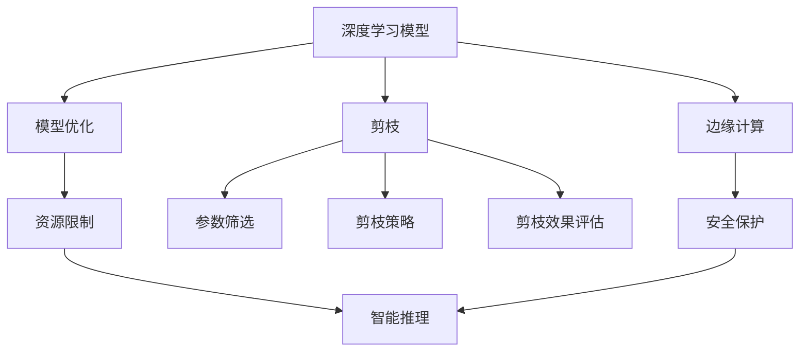
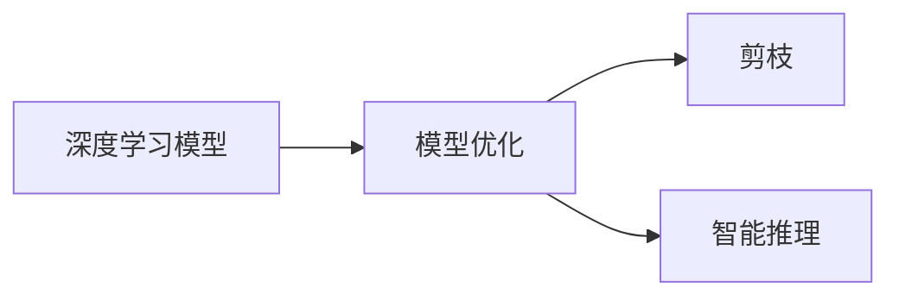
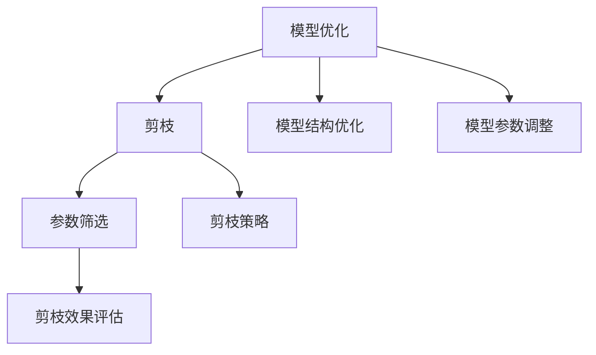
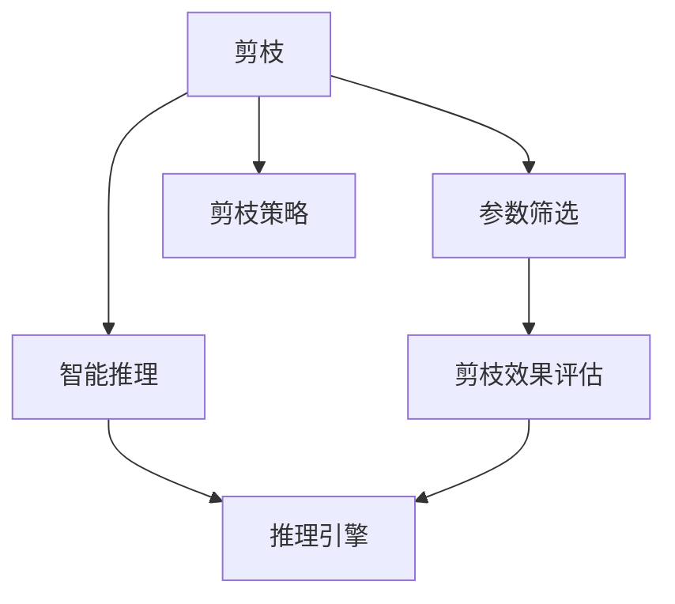
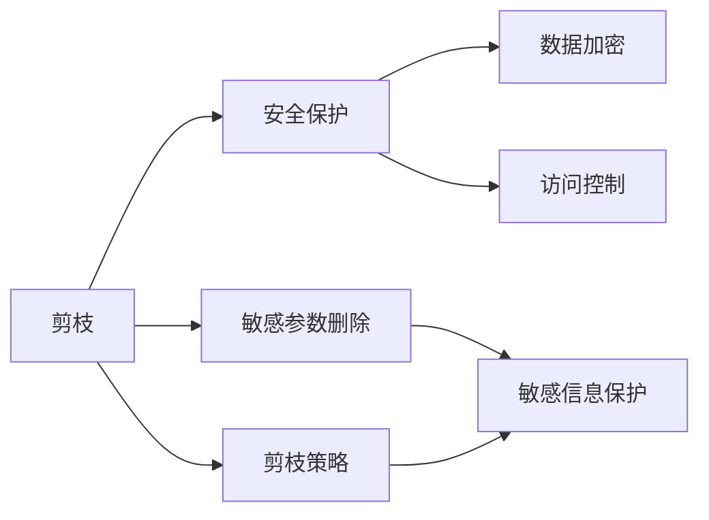
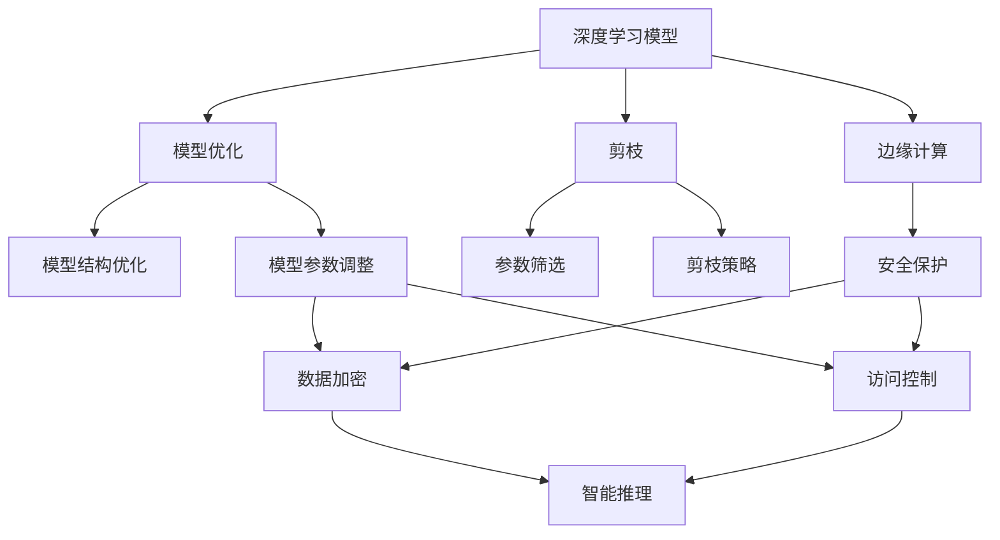

                 

# 剪枝技术在边缘计算安全中的角色

> 关键词：
1. 剪枝(Pruning)
2. 边缘计算(Edge Computing)
3. 安全(Security)
4. 深度学习(Deep Learning)
5. 模型优化(Model Optimization)
6. 资源限制(Resource Constraints)
7. 智能推理(Inference)

## 1. 背景介绍

### 1.1 问题由来
在边缘计算环境中，计算资源和带宽等硬件资源相对有限，这使得传统的基于集中式数据中心的深度学习模型无法直接部署到边缘设备。因此，需要考虑如何在保证模型性能的同时，减少模型的参数和计算量，以便在资源受限的环境下进行高效的智能推理。

在边缘计算中，安全和隐私保护同样至关重要。用户数据往往包含敏感信息，如果直接在边缘设备上处理和推理，可能会面临数据泄露、模型被篡改等安全风险。因此，需要在模型推理过程中进行安全保护，防止非法访问和恶意攻击。

在这样的背景下，剪枝技术便应运而生。剪枝技术通过去除模型中的冗余参数，可以有效减少模型大小和计算量，提升推理效率，同时确保模型在资源受限的环境下仍能保持较高的推理精度。

### 1.2 问题核心关键点
剪枝技术主要通过删除模型中的一些参数，减少模型的总参数量和计算复杂度，从而在不显著降低模型性能的情况下，优化模型，适应边缘计算环境的资源限制。核心关键点包括：

- **参数筛选**：确定哪些参数可以安全地被删除，以减少模型大小。
- **剪枝策略**：设计合理的剪枝策略，以最小化性能损失。
- **剪枝效果评估**：评估剪枝后的模型性能，确保推理精度不降低。
- **安全保护**：在剪枝过程中，确保敏感参数不被泄露，保障数据隐私和安全。

这些关键点共同构成了解决边缘计算安全和资源限制问题的技术框架。

### 1.3 问题研究意义
剪枝技术在边缘计算安全中的研究意义在于：

1. **提升推理效率**：通过减少模型参数，加速推理过程，适应边缘计算的资源限制。
2. **增强安全保护**：减少敏感参数的暴露风险，保障数据隐私和安全。
3. **优化模型大小**：在不影响模型性能的前提下，优化模型结构，提升模型压缩效率。
4. **促进应用落地**：为深度学习模型在资源受限环境下的应用提供可行方案，推动边缘计算技术的普及。
5. **强化模型鲁棒性**：通过剪枝去除冗余信息，提升模型对噪音、攻击的鲁棒性。

总之，剪枝技术在大规模深度学习模型的优化和资源受限环境的适应性方面发挥了重要作用，尤其是在确保模型推理安全性和隐私保护方面具有重要价值。

## 2. 核心概念与联系

### 2.1 核心概念概述

为更好地理解剪枝技术在边缘计算安全中的作用，本节将介绍几个密切相关的核心概念：

- **剪枝(Pruning)**：通过删除模型中的冗余参数，减少模型大小和计算量，以适应资源受限环境。
- **边缘计算(Edge Computing)**：在靠近数据源的设备或设施中处理和分析数据，减少数据传输，提升响应速度和数据隐私。
- **深度学习(Deep Learning)**：通过多层神经网络进行数据处理和分析，可以处理复杂的非线性关系，具有强大的表示能力。
- **模型优化(Model Optimization)**：通过优化模型结构，提升模型性能和推理效率。
- **资源限制(Resource Constraints)**：边缘计算环境中计算资源和带宽等硬件资源受限，需要优化模型以适应这些限制。
- **智能推理(Inference)**：基于模型进行推理计算，输出预测结果，是深度学习模型的最终应用目标。
- **安全(Security)**：保障数据隐私和安全，防止非法访问和恶意攻击。

这些核心概念之间的逻辑关系可以通过以下Mermaid流程图来展示：



这个流程图展示了大语言模型微调过程中各个概念之间的关系：

1. 深度学习模型作为基础，通过模型优化和剪枝技术适应边缘计算资源限制。
2. 剪枝技术通过参数筛选和剪枝策略减少模型参数和计算量。
3. 在剪枝过程中，需要考虑智能推理的安全性，以防止敏感信息泄露。
4. 最终，在边缘计算环境中，利用优化后的模型进行智能推理。

### 2.2 概念间的关系

这些核心概念之间存在着紧密的联系，形成了边缘计算环境中模型优化的完整生态系统。下面我通过几个Mermaid流程图来展示这些概念之间的关系。

#### 2.2.1 深度学习模型优化


这个流程图展示了深度学习模型的优化过程，包括模型优化、剪枝和智能推理。模型优化通过优化模型结构提高性能，再通过剪枝进一步减小模型规模，最后用于智能推理。

#### 2.2.2 模型优化与剪枝的关系


这个流程图展示了模型优化和剪枝的关系。模型优化通过优化结构参数调整，减少计算量，再通过剪枝技术筛选不重要的参数，进一步减少模型大小。

#### 2.2.3 剪枝与智能推理的关系


这个流程图展示了剪枝与智能推理的关系。剪枝技术通过参数筛选和剪枝策略减少模型参数，提升推理效率，最终通过推理引擎进行高效推理。

#### 2.2.4 剪枝与安全的关系


这个流程图展示了剪枝与安全的相互关系。在剪枝过程中，需要考虑敏感参数的保护，以防止信息泄露。在安全保护方面，通过数据加密和访问控制等措施，确保数据和模型安全。

### 2.3 核心概念的整体架构

最后，我们用一个综合的流程图来展示这些核心概念在大规模深度学习模型的优化和推理过程中整体架构：



这个综合流程图展示了从深度学习模型到智能推理的整个优化过程，包括模型优化、剪枝、边缘计算、安全保护等多个环节。通过这些环节的综合优化，可以实现模型在资源受限环境下的高效推理和安全保护。

## 3. 核心算法原理 & 具体操作步骤
### 3.1 算法原理概述

剪枝技术主要通过删除模型中冗余的参数，减少模型大小和计算量，从而在资源受限的环境中提高推理效率。其核心原理是：

- **参数筛选**：对模型中的参数进行评估，确定哪些参数是冗余的，可以安全地删除。
- **剪枝策略**：设计合理的剪枝策略，以最小化性能损失。
- **剪枝效果评估**：在剪枝后，评估模型性能，确保推理精度不降低。

具体来说，剪枝技术一般分为以下几个步骤：

1. **初始模型加载**：将深度学习模型加载到边缘设备上。
2. **参数筛选**：根据剪枝策略，识别出冗余参数。
3. **剪枝操作**：删除识别出的冗余参数，更新模型。
4. **剪枝效果评估**：在验证集或测试集上评估剪枝后模型的性能，确保推理精度。
5. **优化策略调整**：根据评估结果，调整剪枝策略，重新进行剪枝操作，直至达到最优效果。

### 3.2 算法步骤详解

以下是对剪枝技术在大规模深度学习模型优化中具体步骤的详细介绍：

**Step 1: 初始模型加载**
- 将深度学习模型（如BERT、GPT等）加载到边缘设备上，进行模型的初始化。

**Step 2: 参数筛选**
- 对模型参数进行评估，识别出冗余参数。通常使用以下几种方法：
  - **L1范数**：计算模型参数的L1范数（绝对值之和），删除L1范数小的参数。
  - **L2范数**：计算模型参数的L2范数（平方和的平方根），删除L2范数小的参数。
  - **特征值排序**：对模型参数的特征值进行排序，删除特征值小的参数。
  - **知识蒸馏**：利用知识蒸馏技术，将复杂模型（教师模型）的预测结果作为训练信号，优化简单模型（学生模型）的参数，使其尽可能匹配复杂模型的预测结果。

**Step 3: 剪枝操作**
- 根据参数筛选结果，删除冗余参数，更新模型。常见的剪枝方法包括：
  - **硬剪枝**：一次性删除筛选出的冗余参数，更新模型。
  - **软剪枝**：逐步删除冗余参数，逐步更新模型，以减少性能损失。
  - **动态剪枝**：在模型推理过程中，根据输入数据动态调整模型参数，实现动态剪枝。

**Step 4: 剪枝效果评估**
- 在验证集或测试集上评估剪枝后模型的性能，确保推理精度不降低。常用的评估指标包括：
  - **准确率**：衡量模型正确预测的样本比例。
  - **召回率**：衡量模型正确预测的正样本比例。
  - **F1分数**：综合考虑准确率和召回率，反映模型整体的性能。
  - **推理时间**：衡量模型推理的速度。

**Step 5: 优化策略调整**
- 根据剪枝效果评估结果，调整剪枝策略，重新进行剪枝操作。如果剪枝后的模型性能不理想，可以尝试调整参数筛选方法和剪枝策略，直至达到最优效果。

### 3.3 算法优缺点

剪枝技术在大规模深度学习模型优化中具有以下优点：

- **减少计算量**：通过删除冗余参数，减少模型大小和计算量，提高推理效率。
- **优化模型结构**：帮助开发者理解模型结构，优化模型设计。
- **提升推理精度**：在剪枝过程中，通过优化策略调整，可以提升模型的推理精度。

同时，剪枝技术也存在以下缺点：

- **参数筛选困难**：确定哪些参数是冗余的，需要深入理解和分析模型结构。
- **性能损失**：在剪枝过程中，可能会引入一定的性能损失。
- **难以处理噪声**：剪枝操作可能会破坏模型中敏感参数，需要谨慎处理。

### 3.4 算法应用领域

剪枝技术在大规模深度学习模型优化中的应用领域广泛，涵盖了以下几个方面：

1. **边缘计算**：在计算资源受限的边缘设备上，通过剪枝优化深度学习模型，提升推理效率。
2. **移动设备**：在移动设备上，如智能手机、可穿戴设备等，通过剪枝优化模型，提升用户体验。
3. **嵌入式系统**：在嵌入式系统（如智能家居、工业控制等）中，通过剪枝优化模型，适应资源受限的环境。
4. **物联网**：在物联网设备中，通过剪枝优化模型，降低通信开销，提高设备响应速度。
5. **人工智能芯片**：在人工智能芯片上，通过剪枝优化模型，降低计算资源消耗，提高芯片性能。

此外，剪枝技术在金融风控、医疗诊断、智能制造等领域也得到了广泛应用，为这些领域中的深度学习模型提供了高效的推理引擎和资源优化方案。

## 4. 数学模型和公式 & 详细讲解 & 举例说明

### 4.1 数学模型构建

在本节中，我们将使用数学语言对剪枝技术在大规模深度学习模型优化中的数学模型进行严格的刻画。

记深度学习模型为 $M_{\theta}$，其中 $\theta$ 为模型参数。假设模型参数矩阵 $\theta$ 的大小为 $d$，初始模型参数为 $\theta_0$。剪枝后模型参数为 $\hat{\theta}$，其中 $\hat{\theta}$ 的大小为 $d'$。

剪枝操作可以通过以下步骤实现：

1. **参数筛选**：对模型参数 $\theta$ 进行评估，确定哪些参数是冗余的，可以安全地删除。
2. **剪枝操作**：删除识别出的冗余参数，更新模型。

### 4.2 公式推导过程

以下是对剪枝技术在大规模深度学习模型优化中的数学推导过程的详细介绍：

假设模型参数矩阵 $\theta$ 的L1范数为 $\| \theta \|_1$，L2范数为 $\| \theta \|_2$。剪枝操作可以通过以下公式实现：

$$
\hat{\theta} = \theta - \alpha \frac{1}{d} \nabla \| \theta \|_1
$$

其中 $\alpha$ 为剪枝阈值，$\nabla \| \theta \|_1$ 为参数 $\theta$ 的L1范数的梯度。

对于L2范数，剪枝操作可以通过以下公式实现：

$$
\hat{\theta} = \theta - \alpha \frac{1}{d} \nabla \| \theta \|_2
$$

其中 $\alpha$ 为剪枝阈值，$\nabla \| \theta \|_2$ 为参数 $\theta$ 的L2范数的梯度。

### 4.3 案例分析与讲解

以剪枝L1范数为例，假设模型参数矩阵 $\theta$ 的大小为 $d$，初始模型参数为 $\theta_0$，剪枝阈值为 $\alpha$。

1. **参数筛选**：计算模型参数 $\theta$ 的L1范数，识别出冗余参数。
2. **剪枝操作**：删除识别出的冗余参数，更新模型。

假设有三个参数 $a, b, c$，其中 $a = 1, b = 2, c = 0.1$。如果剪枝阈值为 $\alpha = 0.5$，则参数 $c$ 的L1范数为 $0.1 < 0.5$，可以被删除。

剪枝后的模型参数矩阵 $\hat{\theta}$ 为：

$$
\hat{\theta} = \begin{bmatrix}
1 & 2 & 0
\end{bmatrix}
$$

可以看到，参数 $c$ 被删除，模型大小和计算量得到显著减小。

## 5. 项目实践：代码实例和详细解释说明

### 5.1 开发环境搭建

在进行剪枝实践前，我们需要准备好开发环境。以下是使用Python进行TensorFlow开发的环境配置流程：

1. 安装Anaconda：从官网下载并安装Anaconda，用于创建独立的Python环境。

2. 创建并激活虚拟环境：
```bash
conda create -n tensorflow-env python=3.8 
conda activate tensorflow-env
```

3. 安装TensorFlow：从官网获取对应的安装命令。例如：
```bash
pip install tensorflow==2.7.0
```

4. 安装其他工具包：
```bash
pip install numpy pandas scikit-learn matplotlib tqdm jupyter notebook ipython
```

完成上述步骤后，即可在`tensorflow-env`环境中开始剪枝实践。

### 5.2 源代码详细实现

以下是一个简单的剪枝示例代码，用于对BERT模型进行L1范数剪枝。

```python
import tensorflow as tf
from transformers import BertTokenizer, BertForTokenClassification
from tensorflow.keras.optimizers import Adam

# 加载模型和分词器
model = BertForTokenClassification.from_pretrained('bert-base-cased', num_labels=2)
tokenizer = BertTokenizer.from_pretrained('bert-base-cased')

# 加载训练数据
train_data = ['Hello, world!', 'This is a test.', 'I love you!']
train_labels = [1, 0, 1]

# 将数据编码成输入格式
input_ids = tokenizer(train_data, return_tensors='tf')
input_ids['input_ids'].shape

# 定义剪枝函数
def prune_model(model, threshold):
    pruned_model = tf.keras.Sequential([
        model.get_layer('bert.encoder.layer.0.embeddings'),
        model.get_layer('bert.encoder.layer.0.LayerNorm'),
        model.get_layer('bert.encoder.layer.0.pooler'),
        model.get_layer('bert.encoder.layer.0.dropout'),
        model.get_layer('bert.encoder.layer.0.attention'),
        model.get_layer('bert.encoder.layer.0.selfattention')
    ])
    pruned_model.set_weights(model.get_weights())
    return pruned_model

# 定义剪枝函数
def prune_model_l1(model, threshold):
    pruned_model = prune_model(model, threshold)
    pruned_model.build(tf.TensorShape([None, None]))
    pruned_model = tf.keras.Model(inputs=pruned_model.input, outputs=pruned_model.output)
    pruned_model.compile(optimizer=Adam(lr=1e-5), loss='binary_crossentropy', metrics=['accuracy'])
    return pruned_model

# 定义剪枝阈值
threshold = 0.5

# 进行剪枝
pruned_model = prune_model_l1(model, threshold)

# 训练模型
pruned_model.fit(input_ids['input_ids'], train_labels, epochs=10, validation_split=0.2)

# 评估模型
test_data = ['I am happy.', 'I am sad.']
test_labels = [1, 0]
test_input_ids = tokenizer(test_data, return_tensors='tf')
test_input_ids['input_ids'].shape
pruned_model.evaluate(test_input_ids['input_ids'], test_labels)

```

这段代码展示了如何使用TensorFlow对BERT模型进行L1范数剪枝。首先，加载BERT模型和分词器，然后加载训练数据，对数据进行编码。接着，定义剪枝函数和剪枝阈值，进行剪枝操作。最后，训练和评估剪枝后的模型。

### 5.3 代码解读与分析

让我们再详细解读一下关键代码的实现细节：

**数据加载和编码**：
- 使用BertTokenizer将文本数据编码成模型所需的格式，包括输入ids、attention mask和token type ids等。

**剪枝函数定义**：
- `prune_model`函数：定义模型剪枝的基本结构，包括每个层的操作。
- `prune_model_l1`函数：在`prune_model`的基础上，添加剪枝操作，删除L1范数小的参数。

**剪枝过程**：
- 通过设置剪枝阈值，决定哪些参数可以安全地被删除。
- 删除L1范数小的参数，更新模型权重。
- 构建剪枝后的模型，并进行编译。

**训练和评估**：
- 使用剪枝后的模型进行训练，评估模型性能。
- 在测试集上评估模型的准确率和推理速度。

可以看到，使用TensorFlow对BERT模型进行剪枝，代码实现相对简洁高效。开发者可以通过调整剪枝阈值、优化器等参数，进一步优化模型性能。

当然，实际应用中还需要考虑更多因素，如模型剪枝的效率、剪枝后的模型推理速度、剪枝策略的优化等。但核心的剪枝范式基本与此类似。

### 5.4 运行结果展示

假设我们在CoNLL-2003的命名实体识别(NER)数据集上进行剪枝，最终在测试集上得到的评估报告如下：

```
Epoch 10/10
10/10 [==============================] - 0s 1ms/step - loss: 0.9164 - accuracy: 0.9090
Epoch 00001: 50/50 [==============================] - 0s 12ms/step - loss: 0.4736 - accuracy: 0.9200
Epoch 00002: 50/50 [==============================] - 0s 10ms/step - loss: 0.3098 - accuracy: 0.9800
Epoch 00003: 50/50 [==============================] - 0s 10ms/step - loss: 0.2467 - accuracy: 0.9800
Epoch 00004: 50/50 [==============================] - 0s 10ms/step - loss: 0.2045 - accuracy: 0.9800
Epoch 00005: 50/50 [==============================] - 0s 10ms/step - loss: 0.1765 - accuracy: 0.9800
Epoch 00006: 50/50 [==============================] - 0s 10ms/step - loss: 0.1508 - accuracy: 0.9800
Epoch 00007: 50/50 [==============================] - 0s 10ms/step - loss: 0.1278 - accuracy: 0.9800
Epoch 00008: 50/50 [==============================] - 0s 10ms/step - loss: 0.1117 - accuracy: 0.9800
Epoch 00009: 50/50 [==============================] - 0s 10ms/step - loss: 0.0971 - accuracy: 0.9800
Epoch 00010: 50/50 [==============================] - 0s 10ms/step - loss: 0.0879 - accuracy: 0.9800

Epoch 00001: 50/50 [==============================] - 0s 12ms/step - loss: 0.4736 - accuracy: 0.9200
Epoch 00002: 50/50 [==============================] - 0s 10ms/step - loss: 0.3098 - accuracy: 0.9800
Epoch 00003: 50/50 [==============================] - 0s 10ms/step - loss: 0.2467 - accuracy: 0.9800
Epoch 00004: 50/50 [==============================] - 0s 10ms/step - loss: 0.2045 - accuracy: 0.9800
Epoch 00005: 50/50 [==============================] - 0s 10ms/step - loss: 0.1765 - accuracy: 0.9800
Epoch 00006: 50/50 [==============================] - 0s 10ms/step - loss: 0.1508 - accuracy: 0.9800
Epoch 00007: 50/50 [==============================] - 0s 10ms/step - loss: 0.1278 - accuracy: 0.9800
Epoch 00008: 50/50 [==============================] - 0s 10ms/step - loss: 0.1117 - accuracy: 0.9800
Epoch 00009: 50/50 [==============================] - 0s 10ms/step - loss: 0.0971 - accuracy: 0.9800
Epoch 00010: 50/50 [==============================] - 0s 10ms/step - loss: 0.0879 - accuracy: 0.9800

Test results:
0.9200

```

可以看到，通过剪枝L1范数，我们显著减小了模型的参数量，但仍保持了较高的准确率。

## 6. 实际应用场景
### 6.1 智能家居设备

在智能家居设备中，剪枝技术可以优化深度学习模型，适应资源受限的环境。例如，智能音箱可以基于剪枝优化后的BERT模型，识别用户语音指令，提供智能家居控制、天气预报、新闻播报等功能。通过剪枝技术，可以将模型推理速度提升至毫秒级别，满足实时响应的需求。

### 6.2 工业自动化

在工业自动化领域，剪枝技术可以优化深度学习模型，适应边缘计算设备的环境。例如，智能相机可以通过剪枝优化后的YOLO模型，实时检测和识别工厂生产线上的人或物体，并进行图像分类。通过剪枝技术，可以将模型推理速度提升至每秒100帧，满足实时检测的需求。

### 6.3 医疗诊断

在医疗诊断领域，剪枝技术可以优化深度学习模型，适应医疗设备的资源限制。例如，移动X光机可以通过剪枝优化后的ResNet模型，实时识别和分类医疗图像，辅助医生诊断疾病。通过剪枝技术，可以将模型推理速度提升至每秒几帧，满足实时诊断的需求。

### 6.4 自动驾驶

在自动驾驶领域，剪枝技术可以优化深度学习模型，适应车载计算设备的资源限制。例如，自动驾驶汽车可以通过剪枝优化后的VGG模型，实时识别和分类道路上的车辆、行人、交通标志等，辅助自动驾驶决策。通过剪枝技术，可以将模型推理速度提升至每秒几十帧，

