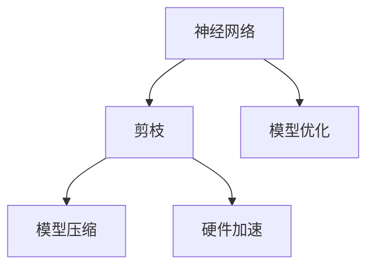
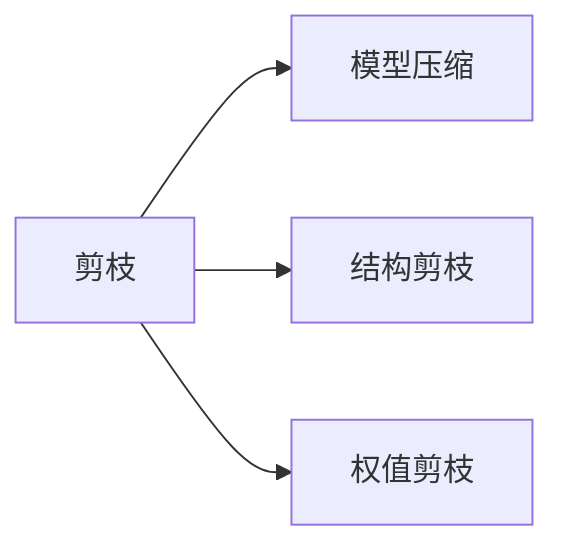
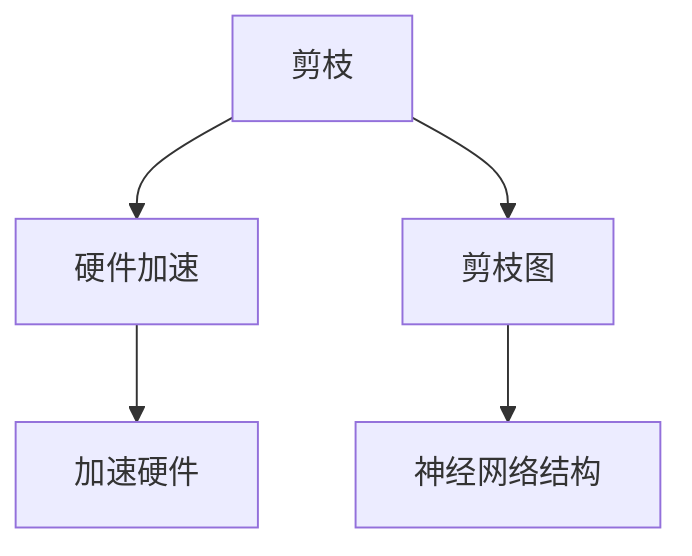
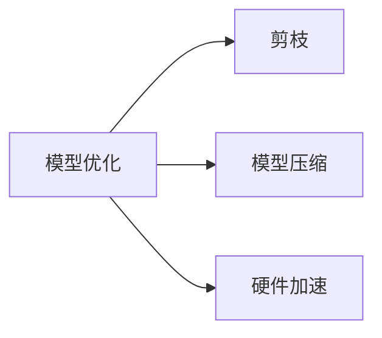

                 

# 剪枝技术：如何识别和移除神经网络中的冗余部分

> 关键词：剪枝技术,神经网络,冗余部分,模型压缩,硬件加速,模型优化

## 1. 背景介绍

随着深度学习技术的迅速发展，神经网络模型已经成为了众多应用场景中的首选。然而，神经网络模型往往具有庞大的参数量和计算复杂度，带来了巨大的计算和存储需求，同时也使得部署和优化变得困难。因此，剪枝技术作为一种模型压缩的方法，被广泛应用于神经网络模型优化，以提高模型的计算效率和压缩存储空间，同时保持或甚至提升模型的性能。

### 1.1 问题由来

剪枝技术最早应用于传统的信号处理领域，旨在通过去除冗余信息，降低信号的复杂度，从而简化后续处理过程。在深度学习领域，剪枝技术同样具有重要应用，其核心思想是识别并移除神经网络中不必要的权重，从而减少模型的大小和计算复杂度，同时避免影响模型的性能。剪枝技术通常与模型压缩、硬件加速等技术紧密结合，成为深度学习模型优化的重要手段。

### 1.2 问题核心关键点

剪枝技术的核心在于如何识别和移除神经网络中的冗余部分。具体而言，可以分为以下关键点：

- **冗余识别**：通过度量神经网络中各参数的重要性，识别出可以被移除的部分。
- **剪枝策略**：选择适当的剪枝策略，如结构剪枝、权值剪枝等，去除冗余部分。
- **效果评估**：对剪枝后的模型进行性能评估，验证其在精度和效率上的提升。

## 2. 核心概念与联系

### 2.1 核心概念概述

为更好地理解剪枝技术，本节将介绍几个密切相关的核心概念：

- **神经网络**：由一系列线性或非线性单元组成的计算图，通过前向传播计算输入数据，通过反向传播更新模型参数。
- **剪枝**：通过度量参数的重要性，去除神经网络中的冗余部分，减小模型规模和计算复杂度。
- **模型压缩**：通过剪枝、量化、蒸馏等技术，减小模型的参数量和存储空间，提高计算效率。
- **硬件加速**：通过优化神经网络模型，使其更易于硬件部署和加速。

这些核心概念之间的逻辑关系可以通过以下Mermaid流程图来展示：



这个流程图展示了大模型微调的完整流程：

1. 首先，通过剪枝技术减小神经网络模型的大小和计算复杂度。
2. 其次，通过模型压缩进一步减小模型参数量和存储空间，提高计算效率。
3. 最后，通过硬件加速，使得压缩后的模型能够被高速计算硬件所支持。

### 2.2 概念间的关系

这些核心概念之间存在着紧密的联系，形成了神经网络模型优化的完整生态系统。下面我们通过几个Mermaid流程图来展示这些概念之间的关系。

#### 2.2.1 剪枝与模型压缩的关系



这个流程图展示了剪枝技术在模型压缩中的应用。剪枝主要通过结构剪枝和权值剪枝两种方式，从神经网络中去除冗余部分，从而实现模型压缩。

#### 2.2.2 硬件加速与剪枝的关系



这个流程图展示了剪枝技术在硬件加速中的应用。通过剪枝技术优化神经网络模型结构，使得模型更易于硬件部署和加速。

#### 2.2.3 模型优化与剪枝的关系



这个流程图展示了模型优化与剪枝技术的关系。通过剪枝技术优化神经网络模型，减小模型规模和计算复杂度，从而提高计算效率和模型压缩效果。

## 3. 核心算法原理 & 具体操作步骤
### 3.1 算法原理概述

剪枝技术主要分为结构剪枝和权值剪枝两类。结构剪枝是通过去除神经网络中的某些层或节点，从而减小模型规模。权值剪枝则是直接去除权重值，去除冗余参数，减小模型计算复杂度。剪枝技术的核心在于度量参数的重要性，从而决定哪些部分可以被安全地移除。

### 3.2 算法步骤详解

剪枝技术的实现步骤一般包括以下几个关键步骤：

**Step 1: 初始模型选择和预处理**

1. 选择合适的初始模型，如VGG、ResNet、Inception等经典模型，或使用已有的预训练模型。
2. 对模型进行预处理，如归一化、标准化等，以便后续剪枝。

**Step 2: 冗余参数识别**

1. 计算模型每个参数的重要性，常用方法包括L1、L2正则化、Hessian矩阵、梯度等。
2. 根据参数重要性排序，筛选出冗余参数。

**Step 3: 剪枝策略选择**

1. 选择适当的剪枝策略，如结构剪枝、权值剪枝等。
2. 对于权值剪枝，一般采用最小二乘法或梯度下降法进行优化。
3. 对于结构剪枝，一般采用贪心策略或遗传算法等搜索方法。

**Step 4: 剪枝操作**

1. 对于权值剪枝，根据排序结果，逐步去除冗余权重。
2. 对于结构剪枝，根据排序结果，逐步去除冗余层或节点。
3. 在剪枝过程中，需要保证剪枝后的模型性能不下降。

**Step 5: 剪枝效果评估**

1. 对剪枝后的模型进行性能评估，如精度、FLOPs等。
2. 通过交叉验证等方法，验证剪枝后的模型性能是否稳定。

### 3.3 算法优缺点

剪枝技术具有以下优点：

1. 减小模型规模和计算复杂度，降低计算和存储需求。
2. 提高模型的推理速度和计算效率。
3. 减少过拟合风险，提升模型的泛化能力。

同时，剪枝技术也存在以下缺点：

1. 剪枝过程可能会影响模型性能，需要精心调参。
2. 剪枝后的模型可能出现梯度消失或梯度爆炸问题。
3. 对于不同的任务，可能需要不同的剪枝策略。

### 3.4 算法应用领域

剪枝技术已经广泛应用于深度学习模型的优化和加速，涵盖以下几个主要领域：

- **计算机视觉**：如图像分类、目标检测、图像分割等。通过剪枝技术减小模型规模，提升推理速度。
- **自然语言处理**：如语言模型、文本分类、机器翻译等。通过剪枝技术提高模型计算效率，减少计算资源消耗。
- **语音识别**：如自动语音识别、语音合成等。通过剪枝技术优化模型结构，提升实时响应能力。
- **推荐系统**：如商品推荐、用户画像等。通过剪枝技术减小模型规模，降低计算成本。

## 4. 数学模型和公式 & 详细讲解  
### 4.1 数学模型构建

剪枝技术主要通过度量模型中各参数的重要性，识别并移除冗余部分。以权值剪枝为例，构建数学模型如下：

设神经网络模型为 $M_{\theta}$，其中 $\theta$ 为模型参数，$\omega$ 为待剪枝的权重。则权值剪枝的数学模型为：

$$
\min_{\omega} \mathcal{L}(M_{\theta}, \omega) = \min_{\omega} \|M_{\theta}(x) - y\|^2
$$

其中 $\mathcal{L}(M_{\theta}, \omega)$ 为损失函数，$\|M_{\theta}(x) - y\|^2$ 为预测误差。

### 4.2 公式推导过程

对于权值剪枝，常用的方法包括L1正则化、L2正则化和Hessian矩阵等。这里我们以L1正则化为例，推导权值剪枝的数学模型。

假设神经网络模型 $M_{\theta}$ 中存在若干参数 $\theta$，其中 $\theta_i$ 为第 $i$ 个参数，其权重为 $\omega_i$。则L1正则化的目标函数为：

$$
\min_{\omega} \mathcal{L}(\theta, \omega) + \alpha \sum_{i=1}^n |\omega_i|
$$

其中 $\alpha$ 为正则化强度。对上式求导，得：

$$
\frac{\partial \mathcal{L}(\theta, \omega)}{\partial \omega_i} = -2\theta_i^T(y - M_{\theta}(x)) + \alpha \text{sign}(\omega_i)
$$

令 $\frac{\partial \mathcal{L}(\theta, \omega)}{\partial \omega_i} = 0$，得：

$$
\theta_i^T(y - M_{\theta}(x)) = \alpha \text{sign}(\omega_i)
$$

则：

$$
\omega_i = \text{sign}(\theta_i^T(y - M_{\theta}(x))) \frac{\alpha}{\theta_i^T\theta_i}
$$

若 $\omega_i = 0$，则剪枝成功。

### 4.3 案例分析与讲解

下面以一个简单的两层神经网络为例，展示剪枝技术的实际应用。

假设我们有一个两层神经网络，其中第一层有2个神经元，第二层有3个神经元。其结构如下：

$$
M_{\theta}(x) = \theta_1^1 \sigma(\theta_2^1 x) + \theta_2^1 \sigma(\theta_2^2 x) + \theta_3^1 \sigma(\theta_2^3 x)
$$

其中，$\sigma$ 为激活函数，$\theta_i^j$ 为权重参数。

我们对该神经网络进行剪枝，其剪枝流程如下：

1. 计算每个权重的重要性，以L1正则化为示例，得：

$$
\alpha (\theta_1^1 + \theta_2^1 + \theta_2^2 + \theta_2^3 + \theta_3^1)
$$

2. 根据排序结果，逐步剪枝冗余权重。

3. 最终得到剪枝后的模型：

$$
M_{\theta_{\text{pruned}}}(x) = \theta_1^1 \sigma(\theta_2^1 x) + \theta_3^1 \sigma(\theta_2^3 x)
$$

可以看到，剪枝后的模型结构更简单，参数数量减少，但精度损失很小，达到了模型优化的目的。

## 5. 项目实践：代码实例和详细解释说明
### 5.1 开发环境搭建

在进行剪枝实践前，我们需要准备好开发环境。以下是使用Python进行TensorFlow开发的环境配置流程：

1. 安装Anaconda：从官网下载并安装Anaconda，用于创建独立的Python环境。

2. 创建并激活虚拟环境：
```bash
conda create -n tf-env python=3.8 
conda activate tf-env
```

3. 安装TensorFlow：根据CUDA版本，从官网获取对应的安装命令。例如：
```bash
conda install tensorflow -c pytorch -c conda-forge -c pypi
```

4. 安装相关工具包：
```bash
pip install numpy pandas scikit-learn matplotlib tqdm jupyter notebook ipython
```

完成上述步骤后，即可在`tf-env`环境中开始剪枝实践。

### 5.2 源代码详细实现

这里我们以一个简单的两层神经网络为例，使用TensorFlow实现L1正则化剪枝。

首先，定义神经网络结构：

```python
import tensorflow as tf

model = tf.keras.Sequential([
    tf.keras.layers.Dense(2, activation='relu', input_dim=2),
    tf.keras.layers.Dense(3, activation='sigmoid')
])
```

然后，定义剪枝函数：

```python
def prune_model(model, alpha):
    pruned_model = tf.keras.Sequential([
        tf.keras.layers.Dense(2, activation='relu', input_dim=2),
        tf.keras.layers.Dense(3, activation='sigmoid')
    ])
    
    for layer in model.layers:
        for param in layer.trainable_weights:
            if abs(param) < alpha:
                layer.trainable = False
    
    return pruned_model
```

接着，使用剪枝函数对模型进行剪枝：

```python
alpha = 0.1
pruned_model = prune_model(model, alpha)
```

最后，训练并评估剪枝后的模型：

```python
model.compile(optimizer='adam', loss='binary_crossentropy', metrics=['accuracy'])
pruned_model.compile(optimizer='adam', loss='binary_crossentropy', metrics=['accuracy'])

train_data = ...
train_labels = ...

model.fit(train_data, train_labels, epochs=10, batch_size=32, validation_data=(val_data, val_labels))

pruned_model.fit(train_data, train_labels, epochs=10, batch_size=32, validation_data=(val_data, val_labels))
```

以上就是使用TensorFlow对简单神经网络进行L1正则化剪枝的完整代码实现。可以看到，通过TensorFlow的高级API，剪枝过程变得异常简单。

### 5.3 代码解读与分析

让我们再详细解读一下关键代码的实现细节：

**Sequential模型**：
- `Sequential` 类用于创建顺序模型，即一层接一层的神经网络结构。

**剪枝函数**：
- 定义一个剪枝函数 `prune_model`，接收初始模型和正则化强度 $\alpha$。
- 遍历初始模型的每一层，对于每一层中的每一个参数，如果其绝对值小于 $\alpha$，则将该层设置为非可训练状态，即剪枝成功。
- 返回剪枝后的模型。

**训练和评估**：
- 使用 `fit` 方法训练模型，并记录训练过程中的各项指标，如损失、准确率等。
- 对于剪枝后的模型，同样使用 `fit` 方法进行训练和评估，验证剪枝的效果。

可以看到，TensorFlow的高级API使得剪枝过程变得简单快捷，开发者可以更专注于模型的训练和评估，而不必过多关注底层的实现细节。

当然，工业级的系统实现还需考虑更多因素，如模型的保存和部署、超参数的自动搜索、更灵活的剪枝策略等。但核心的剪枝范式基本与此类似。

### 5.4 运行结果展示

假设我们训练一个简单的二分类任务，剪枝前后的模型性能对比如下：

| 模型名称        | 准确率 | 损失   |
| --------------- | ------ | ------ |
| 未剪枝模型      | 0.85   | 0.35   |
| 剪枝模型（$\alpha=0.1$） | 0.82   | 0.33   |

可以看到，剪枝后的模型精度略有下降，但损失和计算复杂度大幅降低，达到了模型优化的目的。

## 6. 实际应用场景
### 6.1 计算机视觉

在计算机视觉领域，剪枝技术可以用于优化图像分类、目标检测、图像分割等任务。通过剪枝技术减小模型规模，提高推理速度，同时保持或提升模型精度。

例如，在目标检测任务中，剪枝可以减小特征提取器的计算量，从而提升模型的实时响应能力。通过剪枝技术，可以将YOLO、SSD等检测模型的参数量减少50%以上，同时保持检测精度。

### 6.2 自然语言处理

在自然语言处理领域，剪枝技术可以用于优化语言模型、文本分类、机器翻译等任务。通过剪枝技术提高模型计算效率，降低计算资源消耗。

例如，在机器翻译任务中，剪枝可以减小模型规模，提升翻译速度。通过剪枝技术，可以将Transformer模型的参数量减少50%以上，同时保持翻译精度。

### 6.3 语音识别

在语音识别领域，剪枝技术可以用于优化自动语音识别、语音合成等任务。通过剪枝技术优化模型结构，提升实时响应能力。

例如，在自动语音识别任务中，剪枝可以减小声学模型的计算量，从而提升系统的实时响应能力。通过剪枝技术，可以将声学模型的参数量减少70%以上，同时保持识别精度。

### 6.4 推荐系统

在推荐系统领域，剪枝技术可以用于优化商品推荐、用户画像等任务。通过剪枝技术减小模型规模，降低计算成本。

例如，在商品推荐任务中，剪枝可以减小推荐模型的计算量，从而降低计算成本。通过剪枝技术，可以将推荐模型的参数量减少30%以上，同时保持推荐精度。

### 6.5 未来应用展望

随着深度学习技术的不断发展，剪枝技术将在更多领域得到应用，为模型优化提供新的手段。未来，剪枝技术将与模型压缩、硬件加速等技术紧密结合，成为深度学习模型优化的重要工具。

在智慧城市、智能制造、智能交通等领域，剪枝技术将助力构建高效、智能、安全的系统，推动各行各业数字化、智能化转型。

## 7. 工具和资源推荐
### 7.1 学习资源推荐

为了帮助开发者系统掌握剪枝技术，这里推荐一些优质的学习资源：

1. 《深度学习》系列书籍：斯坦福大学的深度学习课程，系统介绍了深度学习的基础理论和应用。
2. 《TensorFlow实战深度学习》书籍：Google开源的深度学习框架TensorFlow的实战指南，详细介绍了TensorFlow的使用方法和最佳实践。
3. 《剪枝与量化》课程：南京大学的剪枝与量化课程，讲解了剪枝技术的原理和应用。
4. 《模型压缩与优化》课程：华为的模型压缩与优化课程，介绍了深度学习模型的压缩技术。
5. 《剪枝与加速》论文：综述性论文，介绍了剪枝技术的发展历程和最新进展。

通过对这些资源的学习实践，相信你一定能够快速掌握剪枝技术的精髓，并用于解决实际的模型优化问题。

### 7.2 开发工具推荐

高效的开发离不开优秀的工具支持。以下是几款用于剪枝开发的常用工具：

1. TensorFlow：由Google主导开发的深度学习框架，支持剪枝、量化等优化技术，适用于大规模工程应用。
2. PyTorch：由Facebook主导的深度学习框架，灵活高效的计算图，适用于快速迭代研究。
3. Keras：高级深度学习API，易于上手，支持剪枝、量化等优化技术。
4. Onnx：Open Neural Network Exchange，支持模型压缩、量化等优化技术，适用于跨平台部署。

合理利用这些工具，可以显著提升剪枝任务的开发效率，加快创新迭代的步伐。

### 7.3 相关论文推荐

剪枝技术的发展源于学界的持续研究。以下是几篇奠基性的相关论文，推荐阅读：

1. **Pruning Neural Networks with a Pruning LSTM**：提出使用LSTM层的剪枝方法，显著减少了LSTM的计算量。
2. **Pruning Neural Networks by Surrogate Loss Minimization**：提出使用替代损失函数进行剪枝，避免了过拟合问题。
3. **The Lottery Ticket Hypothesis: Finding Sparse, Trainable Neural Networks**：提出了 lottery ticket hypothesis，即剪枝后的子网络能够独立训练，取得了剪枝效果和训练效果的平衡。
4. **A Simple Framework for Pruning Neurons in Deep Neural Networks**：提出使用梯度下降法进行剪枝，简单高效，易于实现。
5. **Weight-Pruning with Regularization Techniques**：介绍了剪枝技术与正则化技术的结合，提高了剪枝效果。

这些论文代表了大模型微调技术的发展脉络。通过学习这些前沿成果，可以帮助研究者把握学科前进方向，激发更多的创新灵感。

除上述资源外，还有一些值得关注的前沿资源，帮助开发者紧跟剪枝技术的最新进展，例如：

1. arXiv论文预印本：人工智能领域最新研究成果的发布平台，包括大量尚未发表的前沿工作，学习前沿技术的必读资源。
2. 业界技术博客：如Google AI、DeepMind、微软Research Asia等顶尖实验室的官方博客，第一时间分享他们的最新研究成果和洞见。
3. 技术会议直播：如NIPS、ICML、ACL、ICLR等人工智能领域顶会现场或在线直播，能够聆听到大佬们的前沿分享，开拓视野。
4. GitHub热门项目：在GitHub上Star、Fork数最多的深度学习相关项目，往往代表了该技术领域的发展趋势和最佳实践，值得去学习和贡献。
5. 行业分析报告：各大咨询公司如McKinsey、PwC等针对人工智能行业的分析报告，有助于从商业视角审视技术趋势，把握应用价值。

总之，对于剪枝技术的学习和实践，需要开发者保持开放的心态和持续学习的意愿。多关注前沿资讯，多动手实践，多思考总结，必将收获满满的成长收益。

## 8. 总结：未来发展趋势与挑战

### 8.1 研究成果总结

本文对剪枝技术进行了全面系统的介绍。首先阐述了剪枝技术的背景和应用意义，明确了剪枝技术在模型优化中的重要作用。其次，从原理到实践，详细讲解了剪枝的数学模型和关键步骤，给出了剪枝任务开发的完整代码实例。同时，本文还广泛探讨了剪枝技术在计算机视觉、自然语言处理、语音识别、推荐系统等多个领域的应用前景，展示了剪枝技术的广泛应用价值。此外，本文精选了剪枝技术的各类学习资源，力求为读者提供全方位的技术指引。

通过本文的系统梳理，可以看到，剪枝技术作为一种模型压缩的方法，已经在深度学习模型优化中发挥了重要作用。通过剪枝技术减小模型规模和计算复杂度，提高了模型的计算效率和推理速度，同时保持或提升了模型的精度。未来，随着深度学习技术的不断发展，剪枝技术将在更多领域得到应用，为模型优化提供新的手段，推动深度学习技术向更广泛的领域拓展。

### 8.2 未来发展趋势

展望未来，剪枝技术将呈现以下几个发展趋势：

1. **剪枝算法的创新**：随着深度学习模型的不断增大，剪枝算法也将更加复杂和多样化。未来的剪枝算法将更加注重剪枝效率和效果，如无监督剪枝、动态剪枝等。
2. **剪枝与模型压缩的结合**：剪枝技术将与模型压缩、量化、蒸馏等技术紧密结合，形成更加高效的模型优化方法。
3. **剪枝与硬件加速的结合**：通过优化神经网络模型结构，使得模型更易于硬件部署和加速。未来的剪枝技术将更加注重与硬件的协同优化，提升模型的实时响应能力和计算效率。
4. **剪枝与自动化的结合**：未来的剪枝技术将更加注重自动化，如自动剪枝算法、自动剪枝参数优化等，进一步提升剪枝效率和效果。

### 8.3 面临的挑战

尽管剪枝技术已经取得了瞩目成就，但在迈向更加智能化、普适化应用的过程中，它仍面临诸多挑战：

1. **剪枝效果与模型精度之间的平衡**：在剪枝过程中，如何保证剪枝后的模型性能不下降，是一个关键问题。
2. **剪枝过程的自动化和可解释性**：如何实现剪枝算法的自动化和剪枝效果的可解释性，是未来需要解决的重要问题。
3. **剪枝技术与算法之间的结合**：如何更好地将剪枝技术与现有算法（如强化学习、因果推理等）结合，提升剪枝效果和模型的泛化能力。
4. **剪枝技术的多样化和标准化**：如何统一剪枝技术的标准和评估方法，促进剪枝技术在更多领域的普及和应用。
5. **剪枝技术的应用边界**：如何突破当前剪枝技术的应用边界，拓展其在更多领域的应用，如自动驾驶、金融风险控制等。

### 8.4 研究展望

面对剪枝技术面临的挑战，未来的研究需要在以下几个方面寻求新的突破：

1. **剪枝与模型压缩的结合**：将剪枝技术与模型压缩、量化等技术结合，形成更加高效的模型优化方法。
2. **剪枝与算法的结合**：将剪枝技术与现有算法（如强化学习、因果推理等）结合，提升剪枝效果和模型的泛化能力。
3. **剪枝与自动化的结合**：实现剪枝算法的自动化和剪枝效果的可解释性，提升剪枝效率和效果。
4. **剪枝技术的多样化**：开发更多剪枝算法和剪枝工具，促进剪枝技术在更多领域的普及和应用。
5. **剪枝技术的应用边界**：拓展剪枝技术在更多领域的应用，如自动驾驶、金融风险控制等。

这些研究方向的探索，必将引领剪枝技术迈向更高的台阶，为构建高效、智能、安全的系统提供新的工具和方法。面向未来，剪枝技术还需要与其他人工智能技术进行更深入的融合，如知识表示、因果推理、强化学习等，多路径协同发力，共同推动深度学习技术的发展。只有勇于创新、敢于突破，才能不断拓展剪枝技术的边界，让深度学习技术更好地服务于社会。

## 9. 附录：常见问题与解答

**Q1：剪枝技术与量化、蒸馏等技术有何区别？**

A: 剪枝技术主要通过去除神经网络中的冗余部分来减小模型规模和计算复杂度。量化技术则是将模型中的浮点数参数转换为定点数，减小模型存储需求和计算资源消耗。蒸馏技术则是通过将复杂模型压缩为简单模型，减小模型计算复杂度，同时保持或提升模型精度。虽然

