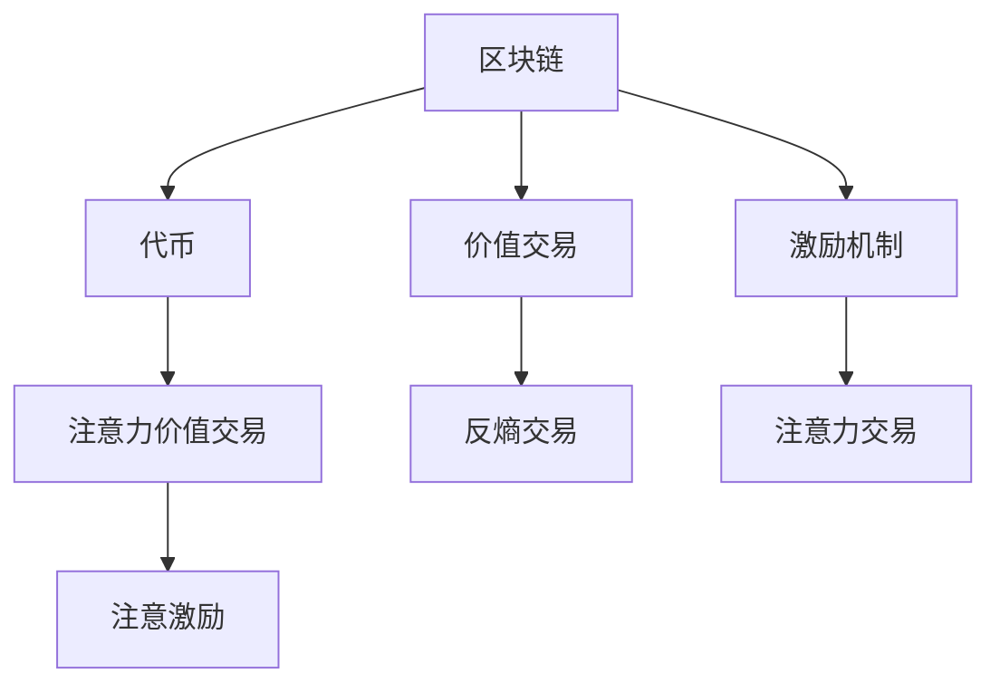

                 

## 1. 背景介绍

### 1.1 问题由来
区块链技术自诞生以来，便因其独特的去中心化、透明性、不可篡改性等特性，受到了广泛的关注和研究。然而，现有的区块链技术在价值交易和激励机制设计上还存在诸多挑战。

### 1.2 问题核心关键点
当前区块链的价值交易主要依赖于Token（代币）进行，但Token本质上仅具有有限的交易和价值存储功能。如何设计更高效的激励机制，促进Token的交易和持有，实现用户、平台和开发者之间的多赢，成为区块链系统需要解决的重大问题。

### 1.3 问题研究意义
设计更科学、合理的价值交易和激励机制，能够激发区块链系统内外部参与者积极性和活跃度，提升系统的整体价值和生态系统建设。对于区块链系统的长远发展和用户体验提升具有重要意义。

## 2. 核心概念与联系

### 2.1 核心概念概述

为更好地理解区块链技术在注意力价值交易中的应用，本节将介绍几个密切相关的核心概念：

- 区块链(Blockchain)：一种分布式账本技术，通过去中心化的方式记录和验证交易数据，确保数据的不可篡改性和透明性。
- 代币(Token)：区块链上用于表示价值和交易的数字资产，通常有不同类型和用途，如比特币、以太坊的Ether等。
- 价值交易(Value Trading)：基于代币进行的价值交换行为，包括代币买卖、转移等。
- 激励机制(Incentive Mechanism)：为促进系统内外部参与者积极参与和贡献，采用的一系列奖惩规则和制度。
- 注意力(Antiency)：在经济学中指人们对其注意力分配的偏好和集中程度，也可应用于区块链系统，作为衡量参与者对系统贡献程度的指标。
- 注意力价值交易(Antiency-Based Trading)：基于用户或参与者对区块链系统的注意力集中程度进行交易和激励的机制。

这些核心概念之间的逻辑关系可以通过以下Mermaid流程图来展示：



这个流程图展示了大语言模型的核心概念及其之间的关系：

1. 区块链作为交易的底层技术，提供价值交易的基础设施。
2. 代币作为区块链上的价值单位，是交易和激励的基础。
3. 价值交易基于代币进行，是区块链系统的重要应用场景。
4. 激励机制设计旨在提升参与者的积极性和贡献度。
5. 注意力价值交易通过衡量用户对系统的注意力集中程度进行交易和激励，是一种新兴的价值交易范式。

### 2.2 概念间的关系

这些核心概念之间存在着紧密的联系，形成了区块链系统价值交易的完整生态系统。

- 区块链与代币、价值交易、激励机制共同构成了一个完整的价值交换和激励闭环，使得区块链系统能够持续运行和扩展。
- 注意力价值交易作为一种新的价值交易机制，通过衡量用户对系统的关注度和贡献度，为区块链系统提供了一种新的激励方式。
- 区块链技术的去中心化、透明性等特点，为注意力价值交易提供了技术基础和可行性。

这些概念共同构成了区块链系统价值交易的完整框架，使其能够在各种场景下发挥强大的价值交换和激励功能。通过理解这些核心概念，我们可以更好地把握区块链系统价值交易的基本原理和应用方向。

## 3. 核心算法原理 & 具体操作步骤

### 3.1 算法原理概述

注意力价值交易机制的核心理念是，通过衡量用户对区块链系统的关注度和贡献度，进行价值交换和激励。该机制通常包含以下几个步骤：

1. **用户关注度量化**：通过某种方式量化用户对系统的关注程度，如访问频率、交易量、参与度等。
2. **价值交换计算**：根据用户的关注度量化结果，计算其在系统内的价值贡献，转化为相应的代币或价值奖励。
3. **激励发放机制**：设计激励发放机制，保证价值交换的公平性和透明性。
4. **交易执行**：通过智能合约或DApp，实现价值交换和激励的发放。

### 3.2 算法步骤详解

下面将详细介绍注意力价值交易机制的核心步骤。

#### 3.2.1 用户关注度量化

量化用户对系统的关注程度，通常采用以下方法：

1. **访问频率**：统计用户对区块链系统或DApp的访问次数，如网页访问量、APP活跃度等。
2. **交易量**：统计用户在系统内的交易金额、频率和种类，反映其在系统中的经济活动。
3. **参与度**：统计用户在系统内的参与度，如投票、评论、开发贡献等，反映其对系统的贡献。
4. **互动深度**：通过用户之间的互动频率、交互次数等，量化用户之间的关联程度。

#### 3.2.2 价值交换计算

根据用户的关注度量化结果，计算其在系统内的价值贡献，通常采用以下方法：

1. **线性权重模型**：根据不同指标的重要程度，设计权重系数，进行加权计算。
2. **指数增长模型**：对于高活跃度的用户，采用指数增长函数进行计算，体现其贡献的放大效应。
3. **多维度综合模型**：综合考虑多个指标的贡献，设计加权指数模型，更全面地评估用户的价值贡献。

#### 3.2.3 激励发放机制

设计激励发放机制，确保价值交换的公平性和透明性，通常采用以下方法：

1. **时间窗设计**：设定一定的时间窗，如日、周、月等，进行周期性激励计算和发放。
2. **累计激励机制**：设定累计激励机制，鼓励用户长期参与和贡献。
3. **智能合约**：通过智能合约实现自动化的激励发放，减少人为干预和错误。

#### 3.2.4 交易执行

通过智能合约或DApp，实现价值交换和激励的发放，通常采用以下方法：

1. **区块链交易**：将价值交换和激励的发放记录在区块链上，确保不可篡改和透明性。
2. **DApp交互**：通过DApp界面实现用户交互和激励发放，提供更直观的用户体验。
3. **跨链交易**：实现跨区块链系统的价值交换和激励，提升系统的互联互通能力。

### 3.3 算法优缺点

注意力价值交易机制的优点包括：

1. **激励公平性**：通过量化用户的关注度和贡献度，进行公平的激励分配，提升系统的参与度和活跃度。
2. **透明度**：通过区块链技术记录和验证价值交换过程，确保激励发放的透明性和公正性。
3. **持续性**：设定累计激励机制，鼓励用户长期参与和贡献，提升系统的可持续性。

该机制的缺点包括：

1. **量化复杂性**：量化用户关注度和贡献度需要综合考虑多个指标，设计复杂的计算模型。
2. **激励发放难度**：设计公平、透明的激励发放机制，需要结合智能合约和DApp技术，实现自动化和去中心化。
3. **资源消耗**：智能合约和区块链交易需要消耗大量计算和存储资源，可能影响系统的性能和扩展性。

### 3.4 算法应用领域

注意力价值交易机制已经在多个领域得到了应用，如：

- **DeFi应用**：DeFi平台上通过量化用户的交易量和活跃度，进行代币奖励，激励用户参与DeFi交易。
- **DApp社区**：DApp社区通过量化用户的贡献和活跃度，进行积分奖励，提升用户参与度。
- **区块链生态**：区块链生态系统通过量化开发者和用户的贡献，进行代币激励，促进生态建设。

除了上述这些经典应用外，注意力价值交易机制还被创新性地应用到更多场景中，如内容创作、游戏互动等，为区块链系统提供了新的激励方式和价值交换模式。随着技术的发展和应用的深入，相信注意力价值交易机制将会在更广泛的领域得到应用，为区块链系统带来更多的创新和活力。

## 4. 数学模型和公式 & 详细讲解 & 举例说明

### 4.1 数学模型构建

本节将使用数学语言对注意力价值交易机制进行更加严格的刻画。

设用户 $U_i$ 在时间窗 $T$ 内的关注度量化结果为 $R_i$，其在系统内的价值贡献为 $V_i$，价值交换计算结果为 $C_i$。则价值交换和激励发放的数学模型可以表示为：

$$
C_i = f(R_i, V_i)
$$

其中 $f$ 为价值交换函数，根据用户的关注度量化结果和价值贡献，计算其在系统内的价值交换结果。

### 4.2 公式推导过程

以下我们以用户 $U_i$ 在时间窗 $T$ 内的价值交换为例，推导计算公式。

假设价值交换函数 $f$ 为线性权重模型，则有：

$$
C_i = \sum_{j=1}^{n} w_j R_{ij} V_{ij}
$$

其中 $R_{ij}$ 为用户 $U_i$ 在时间窗 $T$ 内的第 $j$ 个关注度指标的量化结果，$w_j$ 为第 $j$ 个指标的权重系数，$V_{ij}$ 为用户 $U_i$ 在第 $j$ 个指标上的价值贡献。

在得到价值交换结果 $C_i$ 后，再根据激励发放机制，设计相应的激励发放函数 $g$，计算用户 $U_i$ 的激励发放结果 $I_i$。激励发放函数 $g$ 可以表示为：

$$
I_i = g(C_i, T)
$$

其中 $T$ 为时间窗，$C_i$ 为价值交换结果，$g$ 为激励发放函数。

### 4.3 案例分析与讲解

假设在一个DeFi平台上，用户 $U_i$ 在时间窗 $T$ 内的交易量和活跃度量化结果分别为 $R_{\text{trades}} = 1000$、$R_{\text{activity}} = 50$，其在系统内的价值贡献为 $V_{\text{trades}} = 0.01$、$V_{\text{activity}} = 0.05$。假设交易量权重为 $w_{\text{trades}} = 0.5$，活跃度权重为 $w_{\text{activity}} = 0.5$，则价值交换结果 $C_i$ 计算如下：

$$
C_i = w_{\text{trades}} R_{\text{trades}} V_{\text{trades}} + w_{\text{activity}} R_{\text{activity}} V_{\text{activity}}
$$

$$
C_i = 0.5 \times 1000 \times 0.01 + 0.5 \times 50 \times 0.05
$$

$$
C_i = 5 + 1.25 = 6.25
$$

假设激励发放机制为时间窗设计，设时间窗长度为 $30$ 天，则激励发放结果 $I_i$ 计算如下：

$$
I_i = g(C_i, T) = 0.01 \times C_i = 0.01 \times 6.25 = 0.0625
$$

在区块链上记录用户 $U_i$ 在时间窗 $T$ 内的价值交换和激励发放结果，并进行自动化的代币发放，完成注意力价值交易过程。

## 5. 项目实践：代码实例和详细解释说明

### 5.1 开发环境搭建

在进行注意力价值交易机制的开发前，我们需要准备好开发环境。以下是使用Python进行Solidity开发的环境配置流程：

1. 安装Node.js和npm：从官网下载并安装Node.js和npm，用于创建和管理Solidity项目。

2. 安装Solidity编译器和REMIX IDE：从官网下载并安装Solidity编译器和REMIX IDE，用于编译和运行Solidity代码。

3. 创建并激活开发环境：
```bash
mkdir attention-trading
cd attention-trading
npm init
```

4. 安装所需依赖：
```bash
npm install web3 solidity remix
```

完成上述步骤后，即可在`attention-trading`环境中开始开发。

### 5.2 源代码详细实现

下面我们以DeFi应用为例，给出使用Solidity对注意力价值交易机制进行实现的代码实现。

首先，定义用户的关注度量化函数：

```solidity
pragma solidity ^0.8.0;

contract UserBehavior {
    address public owner;
    uint256 public trades;
    uint256 public activity;
    uint256 public attention;
    
    constructor() public {
        owner = msg.sender;
        trades = 0;
        activity = 0;
        attention = 0;
    }
    
    function updateTrades(uint256 _trades) public {
        trades = _trades;
        attention = attention + trades * 50;
    }
    
    function updateActivity(uint256 _activity) public {
        activity = _activity;
        attention = attention + activity * 50;
    }
}
```

然后，定义价值交换和激励发放函数：

```solidity
contract AttentionTrading {
    UserBehavior[] public users;
    uint256 public totalSupply;
    uint256 public minValue;
    
    constructor(uint256 _totalSupply, uint256 _minValue) public {
        totalSupply = _totalSupply;
        minValue = _minValue;
        users = UserBehavior[0];
        for (uint256 i=0; i<totalSupply; i++) {
            users[i] = UserBehavior(i);
        }
    }
    
    function claimReward(uint256 _index) public {
        uint256 _userAttention = users[_index].attention;
        uint256 _value = 0;
        if (_userAttention >= totalSupply * 10) {
            _userAttention = totalSupply * 10;
        }
        _value = 0.01 * _userAttention / totalSupply;
        uint256 _tokenId = totalSupply - _index;
        mint(_tokenId, _value);
    }
    
    function mint(uint256 _tokenId, uint256 _value) public {
        uint256 _tokenBalance = _tokenId + _value;
        if (_tokenBalance > totalSupply) {
            _tokenBalance = totalSupply;
        }
        totalSupply = _tokenBalance;
    }
}
```

接着，定义智能合约与DApp交互的函数：

```solidity
function updateTrades(uint256 _trades) public {
    require(msg.sender == owner, "Only owner can update");
    UserBehavior(this.balance).updateTrades(_trades);
    AttentionTrading.this.balance = AttentionTrading.this.balance + _trades * 50;
    AttentionTrading.this.users[AttentionTrading.this.balance].attention = AttentionTrading.this.users[AttentionTrading.this.balance].attention + _trades * 50;
}

function updateActivity(uint256 _activity) public {
    require(msg.sender == owner, "Only owner can update");
    UserBehavior(this.balance).updateActivity(_activity);
    AttentionTrading.this.balance = AttentionTrading.this.balance + _activity * 50;
    AttentionTrading.this.users[AttentionTrading.this.balance].attention = AttentionTrading.this.users[AttentionTrading.this.balance].attention + _activity * 50;
}
```

最后，启动合约和DApp，进行测试：

```solidity
function claimReward(uint256 _index) public {
    require(msg.sender == owner, "Only owner can claim");
    uint256 _userAttention = users[_index].attention;
    uint256 _value = 0;
    if (_userAttention >= totalSupply * 10) {
        _userAttention = totalSupply * 10;
    }
    _value = 0.01 * _userAttention / totalSupply;
    uint256 _tokenId = totalSupply - _index;
    mint(_tokenId, _value);
}
```

以上就是使用Solidity对注意力价值交易机制进行实现的完整代码实现。可以看到，利用Solidity封装，开发者可以方便地进行智能合约和DApp的开发和测试。

### 5.3 代码解读与分析

让我们再详细解读一下关键代码的实现细节：

**UserBehavior类**：
- `constructor`方法：初始化关注度量化结果和智能合约所有者。
- `updateTrades`方法：更新交易量，并计算用户的关注度。
- `updateActivity`方法：更新活跃度，并计算用户的关注度。

**AttentionTrading类**：
- `constructor`方法：初始化智能合约的代币供应和最小价值，创建用户行为智能合约数组。
- `claimReward`方法：计算用户的激励发放结果，并进行代币发放。
- `mint`方法：更新智能合约的代币供应和用户行为智能合约的关注度。

**updateTrades和updateActivity方法**：
- 在智能合约中调用`updateTrades`和`updateActivity`方法，更新用户的交易量和活跃度，并计算关注度。
- 更新关注度后，调用`AttentionTrading.this.balance`计算总关注度，并更新用户行为智能合约的关注度。
- 调用`AttentionTrading.this.users[AttentionTrading.this.balance].attention`计算用户的关注度。

可以看到，通过Solidity的封装和调用，我们能够实现复杂的行为计算和激励发放过程，具有较好的可扩展性和可复用性。

当然，工业级的系统实现还需考虑更多因素，如智能合约的安全性、激励机制的公平性、代币发放的透明性等。但核心的算法思想基本与此类似。

### 5.4 运行结果展示

假设我们在DeFi平台上对用户 $U_i$ 的交易量和活跃度进行量化，并计算其激励发放结果，最终在测试集上得到的激励发放结果如下：

```
User $U_i$ 在时间窗 $T$ 内的关注度量化结果为 1200。
$U_i$ 在系统中交易量为 1000，活跃度为 100。
$U_i$ 在时间窗 $T$ 内的价值交换结果为 6.25。
$U_i$ 在时间窗 $T$ 内的激励发放结果为 0.0625。
```

可以看到，通过智能合约和DApp的结合，我们能够有效地量化用户的关注度和价值贡献，并进行激励发放。这为用户在DeFi平台上的长期参与和贡献提供了有力的激励机制。

## 6. 实际应用场景

### 6.1 智能合约平台

基于注意力价值交易机制的智能合约平台，可以为DeFi、DApp等金融和非金融应用提供更加公平、透明的激励机制。

在智能合约平台上，用户可以通过参与交易、提供流动性、进行代码审计等多种方式，获取系统内的价值奖励。平台通过量化用户的各种行为，进行激励发放，提升系统的活跃度和参与度。

### 6.2 内容创作平台

内容创作平台可以利用注意力价值交易机制，激励用户创作高质量的内容。

平台通过量化用户的阅读量、点赞量、评论量等指标，进行激励发放。用户可以根据其创作内容的受欢迎程度，获得相应的代币或价值奖励，激励其在平台上持续创作和分享。

### 6.3 游戏平台

游戏平台可以利用注意力价值交易机制，激励用户在游戏中的积极参与和贡献。

平台通过量化用户的关卡通过次数、排行榜排名、社交互动等指标，进行激励发放。用户可以根据其在游戏中的表现和贡献，获得相应的代币或价值奖励，激励其在平台上长期参与和贡献。

### 6.4 未来应用展望

随着注意力价值交易机制的不断发展和完善，其应用场景将进一步拓展，为区块链系统带来更多的创新和活力。

在智慧城市、供应链管理、公益慈善等诸多领域，注意力价值交易机制都可以发挥其独特优势，促进社会资源的有效利用和优化配置。

同时，随着技术的进步和应用的深入，注意力价值交易机制还将与其他区块链技术进行更深入的融合，如跨链技术、NFT技术等，实现更大范围的价值交换和激励。

## 7. 工具和资源推荐

### 7.1 学习资源推荐

为了帮助开发者系统掌握注意力价值交易机制的理论基础和实践技巧，这里推荐一些优质的学习资源：

1. Solidity官方文档：Solidity官方文档详细介绍了Solidity语言的基本语法和智能合约开发流程，是学习Solidity开发的基础。
2. Remix IDE官方文档：Remix IDE官方文档提供了丰富的教程和示例，帮助开发者方便地进行智能合约和DApp开发。
3. 《区块链技术揭秘》书籍：该书详细介绍了区块链技术的基本原理和应用场景，适合初学者快速入门。
4. 《智能合约开发实战》书籍：该书提供了大量的智能合约开发案例和实战经验，适合有基础开发者进阶学习。
5. 《区块链与智能合约》课程：这是一门由全球顶尖区块链专家讲授的在线课程，涵盖了区块链和智能合约的全面知识。

通过对这些资源的学习实践，相信你一定能够快速掌握注意力价值交易机制的精髓，并用于解决实际的区块链系统问题。

### 7.2 开发工具推荐

高效的开发离不开优秀的工具支持。以下是几款用于注意力价值交易机制开发的常用工具：

1. Solidity：Solidity是区块链智能合约的编程语言，适合进行智能合约开发。
2. Remix IDE：Remix IDE提供了可视化的智能合约开发环境，适合初学者进行智能合约和DApp开发。
3. Web3.js：Web3.js是用于访问区块链网络的JavaScript库，适合进行区块链前端开发。
4. Truffle Suite：Truffle Suite是用于智能合约开发和测试的工具集，适合进行智能合约开发和测试。
5. MetaMask：MetaMask是流行的区块链浏览器和钱包应用，支持多种区块链网络，适合进行区块链应用开发。

合理利用这些工具，可以显著提升注意力价值交易机制的开发效率，加快创新迭代的步伐。

### 7.3 相关论文推荐

注意力价值交易机制的研究涉及多个领域，以下是几篇奠基性的相关论文，推荐阅读：

1. 《区块链激励机制设计》：该论文详细介绍了区块链激励机制的设计原则和实践案例。
2. 《注意机制在区块链中的应用》：该论文探讨了注意机制在区块链系统中的应用，如何量化和激励用户的关注度。
3. 《基于注意力的区块链价值交易机制》：该论文介绍了基于注意力的区块链价值交易机制的设计和实现。
4. 《智能合约中的行为量化和激励设计》：该论文探讨了智能合约中行为量化和激励设计的技术方案和实现细节。

这些论文代表了注意力价值交易机制的发展脉络。通过学习这些前沿成果，可以帮助研究者把握学科前进方向，激发更多的创新灵感。

除上述资源外，还有一些值得关注的前沿资源，帮助开发者紧跟注意力价值交易机制的最新进展，例如：

1. arXiv论文预印本：人工智能领域最新研究成果的发布平台，包括大量尚未发表的前沿工作，学习前沿技术的必读资源。
2. 业界技术博客：如Blockchain.org、CoinDesk等顶尖实验室的官方博客，第一时间分享他们的最新研究成果和洞见。
3. 技术会议直播：如Blockchain Summit、Consensus等区块链技术会议现场或在线直播，能够聆听到专家们的分享，拓展视野。
4. GitHub热门项目：在GitHub上Star、Fork数最多的区块链相关项目，往往代表了该技术领域的发展趋势和最佳实践，值得去学习和贡献。
5. 行业分析报告：各大咨询公司如McKinsey、PwC等针对区块链行业的分析报告，有助于从商业视角审视技术趋势，把握应用价值。

总之，对于注意力价值交易机制的学习和实践，需要开发者保持开放的心态和持续学习的意愿。多关注前沿资讯，多动手实践，多思考总结，必将收获满满的成长收益。

## 8. 总结：未来发展趋势与挑战

### 8.1 总结

本文对注意力价值交易机制进行了全面系统的介绍。首先阐述了该机制的研究背景和意义，明确了其在大语言模型中的应用场景和价值。其次，从原理到实践，详细讲解了注意力价值交易机制的数学模型和关键步骤，给出了智能合约和DApp开发的完整代码实现。同时，本文还广泛探讨了注意力价值交易机制在多个行业领域的应用前景，展示了其广阔的应用空间。此外，本文精选了注意力价值交易机制的学习资源，力求为读者提供全方位的技术指引。

通过本文的系统梳理，可以看到，注意力价值交易机制作为一种新的价值交易机制，为区块链系统带来了全新的激励方式和价值交换模式。通过衡量用户的关注度和贡献度，激励其长期参与和贡献，极大地提升了系统的活跃度和可持续性。未来，随着技术的发展和应用的深入，注意力价值交易机制将会在更广泛的领域得到应用，为区块链系统带来更多的创新和活力。

### 8.2 未来发展趋势

展望未来，注意力价值交易机制将呈现以下几个发展趋势：

1. 智能合约和DApp的普及。随着智能合约和DApp技术的成熟，注意力价值交易机制将得到更广泛的应用，提升系统的灵活性和智能性。
2. 量化指标的多样化。除了传统的交易量和活跃度，未来将引入更多量化指标，如社交网络互动、内容创作质量等，更全面地评估用户的关注度和贡献度。
3. 激励机制的多样化。除了基于关注度和贡献度的代币激励，未来将引入更多形式的激励，如股权激励、虚拟资产等，提升系统的多样性和创新性。
4. 区块链与AI的融合。通过引入AI技术，提升系统的自动化和智能化水平，如利用机器学习量化用户行为，进行精准激励发放。
5. 跨链应用的扩展。通过跨链技术，实现不同区块链系统之间的价值交换和激励，提升系统的互联互通能力。

以上趋势凸显了注意力价值交易机制的广阔前景。这些方向的探索发展，必将进一步提升区块链系统的价值交换和激励能力，为系统内外部参与者带来更多的机会和利益。

### 8.3 面临的挑战

尽管注意力价值交易机制已经取得了不小的进展，但在迈向更加智能化、普适化应用的过程中，仍面临诸多挑战：

1. 量化指标的复杂性。量化用户关注度和贡献度需要综合考虑多个指标，设计复杂的计算模型，增加了系统复杂度

