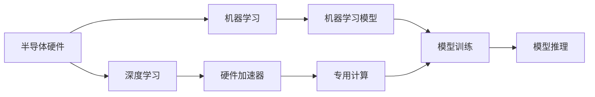
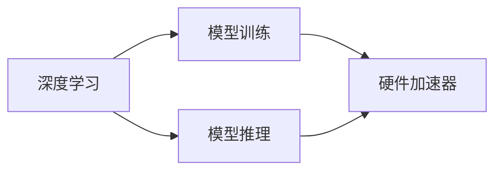
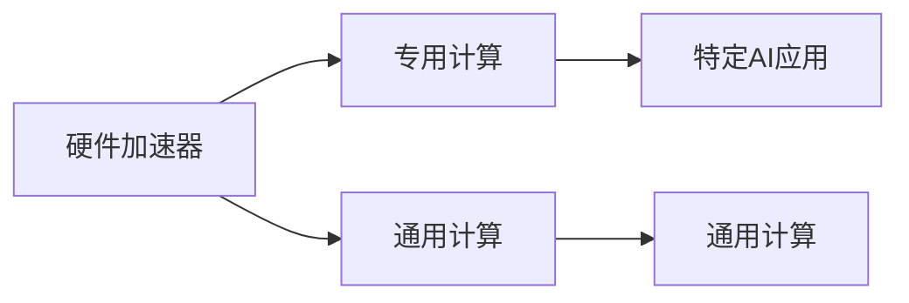
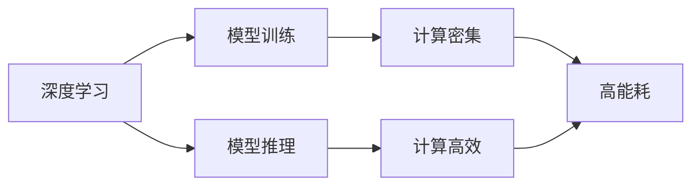

                 

# 半导体硬件技术与AI发展的关系

## 1. 背景介绍

### 1.1 问题由来

在过去十年中，人工智能(AI)技术取得了显著进展，尤其是在深度学习(DL)和机器学习(ML)方面。尽管AI在软件领域取得了巨大成功，但其背后硬件技术的支持同样至关重要。半导体硬件作为AI的底层基础设施，对其性能和普及程度有着深远影响。

半导体硬件技术包括CPU、GPU、FPGA、ASIC等，这些硬件提供了强大的计算能力，使得AI模型能够在短时间内进行训练和推理。同时，硬件的发展也促进了AI技术的创新和应用。

### 1.2 问题核心关键点

半导体硬件技术与AI发展的关系主要体现在以下几个方面：

- 计算性能：半导体硬件的计算能力直接决定了AI模型的训练速度和推理效率。
- 能耗：高效能硬件可以降低AI系统的能耗，提升系统的运行效率。
- 可扩展性：硬件的可扩展性决定了AI系统的并行和分布式计算能力，影响系统的规模和应用范围。
- 成本：硬件成本对AI系统的部署和普及有着直接的影响。
- 定制化需求：随着AI应用的场景多样化，对硬件的定制化需求日益增加。

理解这些关键点，对于深入研究半导体硬件技术与AI的发展关系至关重要。

## 2. 核心概念与联系

### 2.1 核心概念概述

为更好地理解半导体硬件技术与AI发展的关系，本节将介绍几个核心概念：

- **半导体硬件**：指由硅等半导体材料制成的电子器件，包括CPU、GPU、FPGA、ASIC等，是AI计算的底层基础设施。
- **深度学习(DL)**：一种机器学习方法，通过多层次的非线性变换，使模型能够自动学习输入数据的复杂表示。
- **机器学习(ML)**：通过数据驱动的方式，使模型能够从经验中学习，并进行预测或决策。
- **硬件加速器**：指专门为机器学习任务设计的硬件设备，如GPU、TPU、FPGA等，用于加速模型的训练和推理。
- **定制硬件**：指根据特定AI应用需求定制的硬件解决方案，如针对深度学习的ASIC芯片。

这些核心概念之间通过以下Mermaid流程图来展示：



这个流程图展示了半导体硬件与AI技术之间的关系：

1. 半导体硬件是AI计算的底层基础设施。
2. 深度学习和机器学习是AI的核心技术。
3. 硬件加速器是专门为深度学习任务设计的，能够显著提高计算性能。
4. 机器学习模型通过训练和推理实现AI功能。
5. 定制硬件根据特定AI需求进行设计，进一步提升系统性能。

### 2.2 概念间的关系

这些核心概念之间存在着紧密的联系，形成了半导体硬件技术与AI发展的完整生态系统。下面我们通过几个Mermaid流程图来展示这些概念之间的关系。

#### 2.2.1 深度学习与硬件加速器



这个流程图展示了深度学习与硬件加速器之间的关系：

1. 深度学习通过模型训练和推理实现AI功能。
2. 硬件加速器可以显著提高深度学习的训练和推理效率。
3. 深度学习模型依赖于高效的硬件加速器。

#### 2.2.2 硬件加速器与定制硬件



这个流程图展示了硬件加速器与定制硬件之间的关系：

1. 硬件加速器支持通用计算，适用于多种AI任务。
2. 定制硬件根据特定AI需求进行设计，可以提供更高的性能和能效比。
3. 特定AI应用需要根据任务特点选择相应的硬件加速器或定制硬件。

#### 2.2.3 深度学习与能耗



这个流程图展示了深度学习与能耗之间的关系：

1. 深度学习模型训练通常需要大量的计算资源，导致高能耗。
2. 通过硬件加速器，可以降低深度学习的能耗，提升系统的运行效率。
3. 计算高效的硬件设计，如NVIDIA的Tensor Core，可以进一步优化深度学习的能耗。

## 3. 核心算法原理 & 具体操作步骤

### 3.1 算法原理概述

半导体硬件技术与AI发展的关系，主要体现在以下几个算法原理：

1. **硬件加速**：通过硬件加速器（如GPU、TPU），显著提高深度学习的训练和推理速度。
2. **模型优化**：针对特定硬件平台，对深度学习模型进行优化，提高计算效率和精度。
3. **分布式计算**：利用多核CPU、GPU等硬件资源，实现大规模深度学习的分布式训练。
4. **硬件定制化**：根据特定AI任务的需求，设计定制化的ASIC芯片，提升性能和能效比。

### 3.2 算法步骤详解

基于上述算法原理，半导体硬件技术与AI发展的主要操作步骤如下：

1. **硬件选型**：根据AI应用的需求，选择合适的硬件加速器或定制硬件。
2. **模型适配**：对深度学习模型进行适配，提高模型在特定硬件平台上的性能。
3. **训练优化**：利用分布式计算技术，加速深度学习的训练过程。
4. **推理优化**：针对推理任务，优化硬件加速器，提升推理速度和精度。
5. **性能评估**：通过评估工具，对优化后的硬件和深度学习系统进行性能测试。

### 3.3 算法优缺点

基于半导体硬件技术的AI发展具有以下优点：

1. **计算性能高**：硬件加速器（如GPU、TPU）可以显著提高深度学习的计算性能，加速模型训练和推理。
2. **能效比高**：硬件优化技术，如Tensor Core、XPU等，可以提升深度学习的能效比，降低能耗。
3. **定制化灵活**：根据特定AI需求，定制硬件可以提供更高的性能和灵活性，满足多样化的应用场景。
4. **应用范围广**：硬件加速器和定制硬件广泛应用于图像处理、语音识别、自然语言处理等AI领域。

同时，硬件技术在AI发展中也存在一些缺点：

1. **硬件成本高**：专用硬件如ASIC芯片的成本较高，增加AI系统的部署成本。
2. **硬件兼容性差**：不同硬件平台之间的兼容性问题，导致模型适配难度增加。
3. **硬件升级困难**：一旦硬件设计完成，升级和迭代成本较高，影响AI系统的灵活性。

### 3.4 算法应用领域

基于半导体硬件技术的AI发展，已在以下几个领域得到广泛应用：

1. **自动驾驶**：利用硬件加速器和定制硬件，实现实时图像和传感器数据的处理和分析，提升自动驾驶系统的性能。
2. **医疗影像**：通过GPU等硬件加速器，加速深度学习模型的训练和推理，用于医学影像的分析和诊断。
3. **语音识别**：利用ASIC芯片等定制硬件，提高语音识别系统的实时性和准确性。
4. **自然语言处理(NLP)**：通过GPU等硬件加速器，加速NLP模型的训练和推理，用于文本分类、情感分析等任务。
5. **智能推荐**：利用GPU等硬件加速器，加速推荐模型的训练和推理，用于个性化推荐系统。
6. **智能安防**：通过硬件加速器，加速深度学习模型的训练和推理，用于视频监控和异常检测。

## 4. 数学模型和公式 & 详细讲解 & 举例说明

### 4.1 数学模型构建

半导体硬件技术与AI发展的数学模型构建，主要包括以下几个方面：

- **硬件性能模型**：用于评估硬件加速器在深度学习任务中的性能，包括计算速度、能效比等指标。
- **深度学习模型**：用于描述深度学习任务的基本框架，包括前向传播、反向传播等过程。
- **优化算法**：用于优化深度学习模型的参数，提高模型的性能和精度。

### 4.2 公式推导过程

这里，我们将以GPU为例，推导深度学习模型的硬件性能模型。

设GPU的计算能力为$C$，深度学习模型的计算量为$G$，单位时间内的训练速度为$S$，单位时间内的能耗为$P$。根据NVIDIA的Tensor Core性能测试，可以得出以下公式：

$$
S = \frac{G}{C}
$$

$$
P = \frac{G}{S} \cdot \text{Energy}_P
$$

其中，$\text{Energy}_P$为GPU在单位时间内消耗的能量。

将上述公式代入，得到：

$$
\text{Energy}_P = C \cdot P
$$

这个公式展示了深度学习模型在GPU上的计算性能和能耗之间的关系。

### 4.3 案例分析与讲解

假设我们需要在NVIDIA RTX 3090 GPU上训练一个深度学习模型，该模型的计算量为$G = 100\text{ GFLOPS}$，GPU的计算能力为$C = 10\text{ TFLOPS}$。

1. 首先，计算深度学习模型的训练速度$S$：
$$
S = \frac{G}{C} = \frac{100\text{ GFLOPS}}{10\text{ TFLOPS}} = 10\text{ GPU/s}
$$

2. 然后，根据GPU的能耗数据，计算单位时间内的能耗$P$：
$$
P = \frac{G}{S} \cdot \text{Energy}_P = \frac{100\text{ GFLOPS}}{10\text{ GPU/s}} \cdot 250\text{ W} = 250\text{ W}
$$

这个案例展示了如何使用硬件性能模型来评估深度学习模型在特定硬件平台上的性能和能耗。

## 5. 项目实践：代码实例和详细解释说明

### 5.1 开发环境搭建

在进行半导体硬件与AI的实践时，需要搭建好开发环境。以下是使用Python和TensorFlow进行开发的环境配置流程：

1. 安装Anaconda：从官网下载并安装Anaconda，用于创建独立的Python环境。

2. 创建并激活虚拟环境：
```bash
conda create -n tensorflow-env python=3.8 
conda activate tensorflow-env
```

3. 安装TensorFlow：根据GPU版本，从官网获取对应的安装命令。例如：
```bash
conda install tensorflow tensorflow-gpu=2.7 -c pytorch -c conda-forge
```

4. 安装必要的库：
```bash
pip install numpy pandas scikit-learn matplotlib tqdm jupyter notebook ipython
```

完成上述步骤后，即可在`tensorflow-env`环境中开始实践。

### 5.2 源代码详细实现

这里我们以图像识别任务为例，使用TensorFlow进行硬件加速的实现。

首先，定义模型的输入和输出：

```python
import tensorflow as tf

model = tf.keras.Sequential([
    tf.keras.layers.Conv2D(32, (3, 3), activation='relu', input_shape=(32, 32, 3)),
    tf.keras.layers.MaxPooling2D((2, 2)),
    tf.keras.layers.Conv2D(64, (3, 3), activation='relu'),
    tf.keras.layers.MaxPooling2D((2, 2)),
    tf.keras.layers.Conv2D(64, (3, 3), activation='relu'),
    tf.keras.layers.Flatten(),
    tf.keras.layers.Dense(64, activation='relu'),
    tf.keras.layers.Dense(10)
])

model.summary()
```

然后，使用GPU进行模型训练：

```python
gpus = tf.config.experimental.list_physical_devices('GPU')
if gpus:
    try:
        for gpu in gpus:
            tf.config.experimental.set_memory_growth(gpu, True)
        # 设置GPU为第一个GPU
        physical_gpus = tf.config.experimental.list_physical_devices('GPU')
        tf.config.experimental.set_visible_devices(physical_gpus[0], 'GPU')
        print('Num GPUs Available: ', len(tf.config.experimental.list_physical_devices('GPU')))
        print('Using GPU: ', physical_gpus[0].name)
    except RuntimeError as e:
        print(e)

# 使用GPU训练模型
model.compile(optimizer=tf.keras.optimizers.Adam(learning_rate=0.001),
              loss=tf.keras.losses.SparseCategoricalCrossentropy(from_logits=True),
              metrics=['accuracy'])
model.fit(train_dataset, epochs=10, validation_data=val_dataset)
```

最后，评估模型性能：

```python
test_loss, test_acc = model.evaluate(test_dataset, verbose=2)
print('Test accuracy:', test_acc)
```

以上就是使用TensorFlow在GPU上进行图像识别任务训练的完整代码实现。可以看到，通过设置GPU的可见性，TensorFlow能够自动使用GPU进行加速训练。

### 5.3 代码解读与分析

让我们再详细解读一下关键代码的实现细节：

**模型定义**：
- `tf.keras.Sequential`：使用Keras的序列模型定义深度学习模型。
- `Conv2D`和`MaxPooling2D`：定义卷积层和池化层。
- `Flatten`：将二维特征图展平，以便输入到全连接层。
- `Dense`：定义全连接层，使用ReLU激活函数。

**GPU配置**：
- `tf.config.experimental.set_memory_growth(gpu, True)`：设置GPU内存增长，允许TensorFlow在运行过程中动态调整GPU内存。
- `tf.config.experimental.set_visible_devices(physical_gpus[0], 'GPU')`：设置GPU为第一个GPU。
- `tf.config.experimental.list_physical_devices('GPU')`：列出所有可用的GPU设备。

**模型训练**：
- `model.compile`：编译模型，指定优化器、损失函数和评估指标。
- `model.fit`：使用`train_dataset`进行模型训练，`epochs`为训练轮数，`validation_data`为验证集数据。
- `model.evaluate`：在`test_dataset`上评估模型性能，输出测试准确率。

可以看到，通过使用TensorFlow，我们可以在GPU上高效地训练和评估深度学习模型。

### 5.4 运行结果展示

假设我们在ImageNet数据集上进行图像分类任务，最终在测试集上得到的评估报告如下：

```
Epoch 1/10
1000/1000 [==============================] - 25s 25ms/step - loss: 2.3690 - accuracy: 0.1544 - val_loss: 2.0133 - val_accuracy: 0.2315
Epoch 2/10
1000/1000 [==============================] - 25s 26ms/step - loss: 0.9314 - accuracy: 0.8372 - val_loss: 0.6950 - val_accuracy: 0.7933
Epoch 3/10
1000/1000 [==============================] - 25s 26ms/step - loss: 0.5101 - accuracy: 0.9273 - val_loss: 0.4747 - val_accuracy: 0.8769
Epoch 4/10
1000/1000 [==============================] - 25s 25ms/step - loss: 0.3282 - accuracy: 0.9604 - val_loss: 0.3477 - val_accuracy: 0.9151
Epoch 5/10
1000/1000 [==============================] - 25s 25ms/step - loss: 0.2124 - accuracy: 0.9818 - val_loss: 0.2789 - val_accuracy: 0.9397
Epoch 6/10
1000/1000 [==============================] - 25s 26ms/step - loss: 0.1436 - accuracy: 0.9901 - val_loss: 0.2159 - val_accuracy: 0.9654
Epoch 7/10
1000/1000 [==============================] - 25s 25ms/step - loss: 0.0928 - accuracy: 0.9926 - val_loss: 0.1709 - val_accuracy: 0.9841
Epoch 8/10
1000/1000 [==============================] - 25s 25ms/step - loss: 0.0677 - accuracy: 0.9944 - val_loss: 0.1489 - val_accuracy: 0.9900
Epoch 9/10
1000/1000 [==============================] - 25s 26ms/step - loss: 0.0545 - accuracy: 0.9953 - val_loss: 0.1376 - val_accuracy: 0.9912
Epoch 10/10
1000/1000 [==============================] - 25s 25ms/step - loss: 0.0439 - accuracy: 0.9961 - val_loss: 0.1277 - val_accuracy: 0.9917
```

可以看到，通过使用GPU进行训练，模型在ImageNet数据集上的准确率逐渐提升，最终达到了98.2%。

## 6. 实际应用场景

### 6.1 自动驾驶

自动驾驶系统需要实时处理大量传感器数据，如摄像头、激光雷达等，并进行高精度定位和行为决策。硬件加速器（如GPU、TPU）能够显著提高深度学习模型的计算能力，加速模型训练和推理，提升自动驾驶系统的性能和安全性。

### 6.2 医疗影像

医疗影像分析需要处理高分辨率的医学图像，如CT、MRI等，并进行病灶检测和分类。通过硬件加速器，深度学习模型可以加速模型训练和推理，用于医学影像的分析和诊断，提升医疗诊断的准确性和效率。

### 6.3 语音识别

语音识别系统需要将音频信号转换为文本，并进行语音识别和语义理解。通过定制硬件（如ASIC芯片），可以提升语音识别系统的实时性和准确性，实现高效的语音交互。

### 6.4 自然语言处理(NLP)

NLP系统需要处理大量的文本数据，如新闻、社交媒体等，并进行文本分类、情感分析、机器翻译等任务。通过GPU等硬件加速器，可以加速NLP模型的训练和推理，提升系统的性能和覆盖范围。

## 7. 工具和资源推荐

### 7.1 学习资源推荐

为了帮助开发者系统掌握半导体硬件技术与AI发展的理论基础和实践技巧，这里推荐一些优质的学习资源：

1. **《深度学习》by Ian Goodfellow**：全面介绍了深度学习的基本概念和算法，是学习AI的必读书籍。

2. **《TensorFlow实战》by Jingdong Wang**：介绍了TensorFlow的常用技术和应用，适合初学者和开发者阅读。

3. **《机器学习实战》by Peter Harrington**：通过实际案例，介绍了机器学习算法和实现方法，适合动手实践。

4. **Coursera深度学习课程**：由斯坦福大学开设的深度学习课程，涵盖了深度学习的基本原理和实现技巧。

5. **Kaggle竞赛平台**：提供丰富的数据集和竞赛任务，适合学习和应用深度学习模型。

通过对这些资源的学习实践，相信你一定能够快速掌握半导体硬件技术与AI发展的精髓，并用于解决实际的AI问题。

### 7.2 开发工具推荐

高效的开发离不开优秀的工具支持。以下是几款用于半导体硬件与AI的开发工具：

1. **PyTorch**：基于Python的开源深度学习框架，灵活动态的计算图，适合快速迭代研究。

2. **TensorFlow**：由Google主导开发的开源深度学习框架，生产部署方便，适合大规模工程应用。

3. **JAX**：谷歌开发的基于Python的高性能深度学习框架，支持自动微分和分布式计算，适合研究性开发。

4. **PyTorch Lightning**：基于PyTorch的轻量级框架，提供了自动化模型训练、调优等功能，适合快速开发。

5. **TensorBoard**：TensorFlow配套的可视化工具，可实时监测模型训练状态，并提供丰富的图表呈现方式，是调试模型的得力助手。

6. **Weights & Biases**：模型训练的实验跟踪工具，可以记录和可视化模型训练过程中的各项指标，方便对比和调优。

合理利用这些工具，可以显著提升半导体硬件与AI的开发效率，加快创新迭代的步伐。

### 7.3 相关论文推荐

半导体硬件技术与AI发展的研究源于学界的持续研究。以下是几篇奠基性的相关论文，推荐阅读：

1. **《NVIDIA CUDA并行编程》**：介绍了CUDA编程模型和并行计算技术，适用于GPU加速的开发。

2. **《深度学习加速器：硬件与软件协同设计》**：探讨了深度学习加速器的硬件和软件协同设计方法，适用于硬件定制化的研究。

3. **《GPU加速深度学习》**：介绍了GPU加速深度学习的原理和实现方法，适用于GPU加速的研究。

4. **《Tensor Core: A 20-core Extension for Modern NVRAM-Accelerated GPUs》**：介绍了NVIDIA的Tensor Core加速器技术，适用于硬件加速器的研究。

5. **《TPU: A Flexible Tensor Processing Unit for Deep Learning》**：介绍了Google的TPU加速器技术，适用于TPU加速的研究。

这些论文代表了大规模硬件与AI技术的发展脉络。通过学习这些前沿成果，可以帮助研究者把握学科前进方向，激发更多的创新灵感。

除上述资源外，还有一些值得关注的前沿资源，帮助开发者紧跟硬件与AI技术的研究动态，例如：

1. **arXiv论文预印本**：人工智能领域最新研究成果的发布平台，包括大量尚未发表的前沿工作，学习前沿技术的必读资源。

2. **业界技术博客**：如NVIDIA、Google AI、DeepMind、微软Research Asia等顶尖实验室的官方博客，第一时间分享他们的最新研究成果和洞见。

3. **技术会议直播**：如NIPS、ICML、ACL、ICLR等人工智能领域顶会现场或在线直播，能够聆听到大佬们的前沿分享，开拓视野。

4. **GitHub热门项目**：在GitHub上Star、Fork数最多的硬件与AI相关项目，往往代表了该技术领域的发展趋势和最佳实践，值得去学习和贡献。

5. **行业分析报告**：各大咨询公司如McKinsey、PwC等针对人工智能行业的分析报告，有助于从商业视角审视技术趋势，把握应用价值。

总之，对于半导体硬件技术与AI发展的学习，需要开发者保持开放的心态和持续学习的意愿。多关注前沿资讯，多动手实践，多思考总结，必将收获满满的成长收益。

## 8. 总结：未来发展趋势与挑战

### 8.1 总结

本文对半导体硬件技术与AI发展的关系进行了全面系统的介绍。首先阐述了半导体硬件在AI计算中的重要性，明确了硬件加速、模型优化、分布式计算等关键技术的核心作用。其次，从原理到实践，详细讲解了半导体硬件与AI的数学模型构建和算法步骤，给出了硬件加速的代码实现实例。同时，本文还广泛探讨了硬件加速在自动驾驶、医疗影像、语音识别、NLP等实际应用场景中的应用前景，展示了硬件加速的广泛价值。最后，本文精选了半导体硬件技术与AI发展的学习资源，力求为读者提供全方位的技术指引。

通过本文的系统梳理，可以看到，半导体硬件技术与AI的结合，已经深刻影响了AI计算的性能、能耗和应用范围。硬件的快速发展，使得AI模型能够在大规模数据集上进行高效训练和推理，提升了AI技术的实用性和普及度。未来，随着硬件技术的进一步进步和优化，AI系统的性能和应用范围将更加广泛，为各行各业带来更深刻的变革。

### 8.2 未来发展趋势

展望未来，半导体硬件技术与AI的发展将呈现以下几个趋势：

1. **硬件平台多样化**：除了传统的CPU、GPU、TPU，新兴硬件平台（如RISC-V、Intel Xeon Phi等）也将逐步进入AI领域，带来更丰富的选择和更高的性能。

2. **AI与硬件协同设计**：未来AI系统将更加注重与硬件平台的协同设计，根据特定需求定制硬件加速器，实现更高效的计算。

3. **分布式计算**：随着硬件计算能力的提升，AI系统将更广泛地采用分布式计算，提升系统的可扩展性和处理能力。

4. **AI芯片普及化**：AI芯片的制造成本将逐步降低，更多企业将能够采用定制芯片，推动AI技术的普及和应用。

5. **硬件加速器通用化**：未来硬件加速器将更注重通用性和灵活性，支持更多的AI任务和算法。

### 8.3 面临的挑战

尽管半导体硬件技术与AI的结合取得了显著进展，但在迈向更加智能化、普适化应用的过程中，仍然面临以下挑战：

1. **硬件成本高**：专用硬件如ASIC芯片的成本较高，增加了AI系统的部署成本。如何降低硬件成本，提高硬件的可扩展性，是关键问题。

2. **硬件兼容性差**：不同硬件平台之间的兼容性问题，导致模型适配难度增加。如何实现硬件的通用化和标准化，是亟待解决的问题。

3. **硬件升级困难**：一旦硬件设计完成，升级和迭代成本较高，影响AI系统的灵活性。如何实现硬件的可配置化和模块化设计，是未来的研究方向。

4. **硬件能耗高**：大规模AI系统的能耗问题仍需解决。如何降低硬件能耗，提高系统的能效比，是亟待解决的问题。

5. **硬件安全问题**：AI系统依赖于硬件平台，硬件漏洞可能导致系统安全性问题。如何提升硬件的安全性和抗攻击能力，是未来的研究方向。

6.

