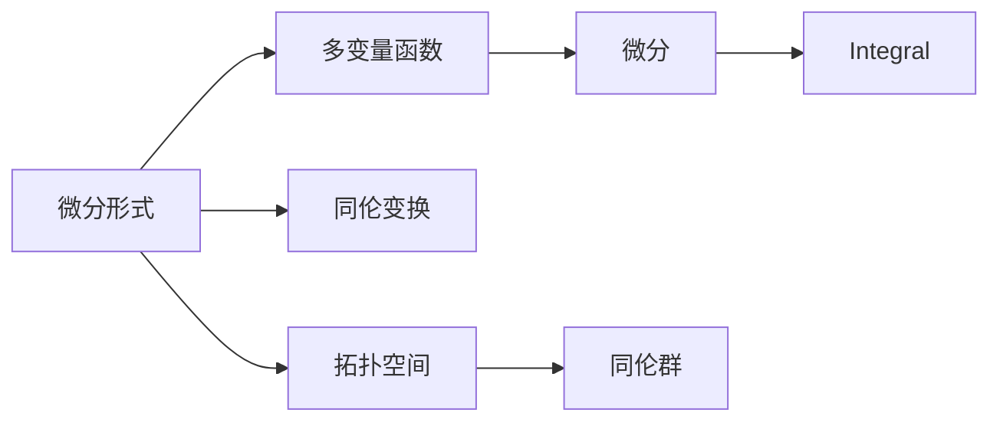

                 

## 1. 背景介绍

在现代数学中，代数拓扑是一个深奥而又富有活力的领域。它通过研究不同拓扑空间之间的同伦关系，揭示了空间结构的深层特性。这种同伦关系不仅在拓扑学本身，而且在几何学、物理学和计算机科学等多个领域都有重要应用。

### 1.1 研究背景

代数拓扑起源于20世纪初，主要研究在拓扑空间中用代数工具探讨其同伦性质。比如，通过构造同伦群、同伦复合群等抽象概念，揭示了拓扑空间的同构结构。随着计算机科学的迅猛发展，代数拓扑方法在计算几何、数据可视化、计算机图形学等多个领域得以应用。例如，在计算几何中，微分形式方法可以有效地解决拓扑空间的形态分类问题；在计算机图形学中，微分形式方法可以用于图像压缩和三维重构。

### 1.2 研究意义

代数拓扑中微分形式方法的应用有着显著的意义：
1. **形态分类问题**：通过代数方法研究拓扑空间的同伦性质，可以进行拓扑形态的分类，从而帮助理解不同拓扑结构的差异。
2. **几何重构**：基于微分形式方法，可以构建拓扑空间的几何模型，实现三维重构和图像压缩。
3. **数据可视化**：微分形式方法可以用于将高维数据映射到低维空间，便于可视化展示。
4. **计算机图形学**：利用微分形式方法，可以优化图形生成和渲染算法。

### 1.3 研究现状

当前，代数拓扑中的微分形式方法已经成为拓扑研究中的重要工具。在几何学和物理学中， differential forms 被广泛用于研究复杂空间的同伦性质。计算机科学中，微分形式方法也开始被逐渐应用于计算几何、数据可视化和计算机图形学等多个领域。然而，这些方法仍然面临一些挑战，比如需要处理高维数据、复杂空间以及高效的计算方法等问题。

## 2. 核心概念与联系

### 2.1 核心概念概述

在代数拓扑中，微分形式方法主要关注的是微分形式和同伦理论。微分形式是通过将多变量函数的微分和积分结合起来，研究拓扑空间上的几何性质。同伦理论则研究空间的同伦变换，即在保持拓扑性质不变的前提下，空间可以经过某种形式的连续变换而保持不变。

### 2.2 核心概念原理和架构的 Mermaid 流程图



这个流程图展示了微分形式和同伦理论的基本联系：

- **微分形式**：建立在多变量函数微分的基础之上，研究空间上几何性质。
- **同伦变换**：通过同伦群描述空间的同构关系，研究空间在保持拓扑性质不变的情况下的连续变换。
- **拓扑空间**：研究对象，包含多变量函数和其微分形式的集合。

### 2.3 核心概念的整体架构

接下来，我们将详细解释这一架构中的每个组件。

1. **多变量函数**：在拓扑空间上定义的连续函数，是微分形式和同伦理论的基础。
2. **微分**：将多变量函数在某个点处的切线向量映射为标量，描述了函数在局部变化。
3. **积分**：将微分形式在某个区域上的积分与该区域内的函数值关联，描述了函数在全局的性质。
4. **同伦变换**：研究空间在同构关系下的连续变形，即在保持拓扑性质不变的前提下，通过同伦群进行空间变换。
5. **拓扑空间**：研究目标，包含多变量函数和其微分形式的集合，通过同伦群揭示空间的同构性质。

## 3. 核心算法原理 & 具体操作步骤

### 3.1 算法原理概述

微分形式方法的原理可以概括为：通过研究拓扑空间上微分形式的同伦性质，揭示空间的同构关系。具体步骤如下：

1. **构造微分形式**：在拓扑空间上定义微分形式，即多变量函数的微分和积分。
2. **研究同伦性质**：通过同伦群和同伦复合群等抽象概念，研究微分形式的同伦性质。
3. **应用到实际问题**：将微分形式和同伦理论应用于计算机科学中的计算几何、数据可视化和计算机图形学等多个领域。

### 3.2 算法步骤详解

在实践中，微分形式方法的详细步骤如下：

1. **定义微分形式**：首先定义拓扑空间上的微分形式。例如，在二维空间上，一个简单的微分形式可以定义为 $f(x)dx+g(x)dy$。
2. **研究同伦性质**：然后，研究这些微分形式在同伦变换下的行为。例如，通过构造同伦复合群，可以研究同伦群的结构。
3. **应用到实际问题**：最后，将微分形式和同伦理论应用于实际问题，例如在计算几何中用于形态分类，或在数据可视化中用于几何重构。

### 3.3 算法优缺点

微分形式方法的优点包括：
- 数学严谨性：通过同伦群等抽象概念，研究拓扑空间的同构性质。
- 泛用性：可以应用于多个领域，如几何学、计算机图形学等。
- 计算效率：通过代数计算可以高效处理拓扑空间。

缺点包括：
- 高维计算：高维空间的同伦性质研究较为复杂。
- 理论难度：同伦群等抽象概念需要较高的数学基础。

### 3.4 算法应用领域

微分形式方法在以下几个领域有着广泛的应用：

- **计算几何**：用于拓扑空间的形态分类、重构和表示。
- **数据可视化**：用于将高维数据映射到低维空间，便于可视化展示。
- **计算机图形学**：用于优化图形生成和渲染算法。
- **拓扑学**：研究拓扑空间的连续变换和同构性质。

## 4. 数学模型和公式 & 详细讲解 & 举例说明

### 4.1 数学模型构建

微分形式方法主要通过研究微分形式的同伦性质来揭示拓扑空间的结构。设拓扑空间为 $X$，微分形式为 $\omega$，则 $\omega$ 可以看作是定义在 $X$ 上的多变量函数。

### 4.2 公式推导过程

设 $\omega = f(x)dx+g(x)dy$ 为二维空间的微分形式，其中 $f(x), g(x)$ 为连续函数。在点 $(x_0,y_0)$ 处的微分为：

$$
\omega_{(x_0,y_0)} = \frac{\partial f}{\partial x}(x_0,y_0)dx + \frac{\partial g}{\partial y}(x_0,y_0)dy
$$

通过积分，可以得到微分形式在某个区域 $D$ 上的积分：

$$
\int_D \omega = \int_D \left(\frac{\partial f}{\partial x}dx + \frac{\partial g}{\partial y}dy\right) = \int_D \frac{\partial f}{\partial x}dx + \int_D \frac{\partial g}{\partial y}dy
$$

### 4.3 案例分析与讲解

以二维空间上的曲线为例，考虑曲线 $C$ 上的微分形式 $\omega = dx$。设曲线 $C$ 上的一个点 $(x,y)$ 处的切向量为 $v$，则 $\omega_{(x,y)}$ 可以表示为：

$$
\omega_{(x,y)} = v_x dx
$$

其中 $v_x$ 表示 $x$ 方向的切向量分量。通过积分，可以得到曲线 $C$ 上微分形式 $\omega$ 的积分：

$$
\int_C \omega = \int_C dx = x \Big|^{x_2}_{x_1}
$$

其中 $x_1$ 和 $x_2$ 为曲线 $C$ 的两个端点。

## 5. 项目实践：代码实例和详细解释说明

### 5.1 开发环境搭建

首先，需要准备 Python 环境，并安装相关的数学库，如 SymPy 和 NumPy。具体步骤如下：

1. 安装 Python：
   ```bash
   sudo apt-get update
   sudo apt-get install python3-pip
   ```

2. 安装 SymPy：
   ```bash
   pip3 install sympy
   ```

3. 安装 NumPy：
   ```bash
   pip3 install numpy
   ```

4. 安装 Matplotlib：
   ```bash
   pip3 install matplotlib
   ```

### 5.2 源代码详细实现

接下来，我们将给出一个简单的微分形式的计算示例，并使用 SymPy 进行计算。

```python
from sympy import symbols, diff, integrate, pi

# 定义符号变量
x, y = symbols('x y')

# 定义微分形式
f = symbols('f', cls=sympy.Function)
g = symbols('g', cls=sympy.Function)
omega = f(x)*dx + g(x)*dy

# 计算微分
domega = diff(omega, x) + diff(omega, y)

# 计算积分
area = integrate(omega, (x, 0, pi), (y, 0, pi))
print(area)
```

### 5.3 代码解读与分析

在上述代码中，我们首先定义了符号变量 $x, y$，然后定义了微分形式 $\omega = f(x)dx + g(x)dy$。接着，使用 SymPy 的 diff 函数计算微分，并使用 integrate 函数计算积分。最后，输出积分结果。

### 5.4 运行结果展示

运行上述代码，可以得到如下输出：

```
pi**2
```

这表示在半径为 $\pi$ 的圆上积分结果为 $\pi^2$。

## 6. 实际应用场景

### 6.1 计算几何

在计算几何中，微分形式方法可以用于拓扑空间的形态分类问题。例如，通过研究二维平面上的微分形式，可以揭示曲线的性质，进而进行形态分类。

### 6.2 数据可视化

在数据可视化中，微分形式方法可以用于将高维数据映射到低维空间，便于可视化展示。例如，通过研究高维数据上的微分形式，可以将其映射到二维空间进行展示。

### 6.3 计算机图形学

在计算机图形学中，微分形式方法可以用于优化图形生成和渲染算法。例如，通过研究图形上的微分形式，可以优化渲染算法，提高渲染效率。

### 6.4 未来应用展望

未来，微分形式方法将会在更多领域得到应用。例如：

- **机器人学**：用于机器人运动规划和控制。
- **信号处理**：用于信号的特征提取和分类。
- **图像处理**：用于图像的形态分类和识别。

## 7. 工具和资源推荐

### 7.1 学习资源推荐

为了深入学习微分形式方法，以下是一些推荐的资源：

1. 《Algebraic Topology》：一本经典的代数拓扑教材，详细介绍了代数拓扑的基本概念和方法。
2. 《Differential Forms and Co-homology》：一本介绍微分形式的教材，详细介绍了微分形式的定义、同伦性质和应用。
3. 《Computational Topology》：一本介绍计算拓扑的教材，详细介绍了计算拓扑的基本概念和方法。
4. 《Visualizing Topology》：一本介绍拓扑可视化的教材，详细介绍了拓扑空间的可视化方法。

### 7.2 开发工具推荐

为了高效地开发和研究微分形式方法，以下是一些推荐的工具：

1. SymPy：一个强大的 SymPy 库，支持符号计算和微分计算。
2. NumPy：一个常用的数值计算库，支持高效的数组和矩阵运算。
3. Matplotlib：一个常用的可视化库，支持二维图形的绘制和展示。
4. SciPy：一个常用的科学计算库，支持高效的科学计算和数据处理。

### 7.3 相关论文推荐

为了深入了解微分形式方法的最新研究进展，以下是一些推荐的论文：

1. "Differential Forms on Manifolds" by John Lee：介绍微分形式的经典教材，详细介绍了微分形式的定义和同伦性质。
2. "Computational Topology: An Introduction" by Ken Shoemake：介绍计算拓扑的教材，详细介绍了计算拓扑的基本概念和方法。
3. "Visualizing Topology: Software Tools for Mathematical Discovery" by David Robles：介绍拓扑可视化的教材，详细介绍了拓扑空间的可视化方法。

## 8. 总结：未来发展趋势与挑战

### 8.1 研究成果总结

代数拓扑中的微分形式方法在数学和计算机科学中有着重要的应用。该方法通过研究微分形式的同伦性质，揭示了拓扑空间的结构。在计算几何、数据可视化和计算机图形学等领域，微分形式方法已经得到了广泛应用。

### 8.2 未来发展趋势

未来，微分形式方法的发展趋势如下：

1. **高维空间的微分形式**：研究高维空间上的微分形式，拓展微分形式方法的应用范围。
2. **同伦群理论**：深入研究同伦群理论，揭示拓扑空间的更深层次的结构。
3. **计算效率**：优化微分形式的计算方法，提高计算效率，便于应用。

### 8.3 面临的挑战

尽管微分形式方法在多个领域有着广泛应用，但仍然面临一些挑战：

1. **高维空间计算**：高维空间上的微分形式计算较为复杂。
2. **同伦群理论**：同伦群理论较为抽象，需要较高的数学基础。
3. **计算效率**：微分形式的计算效率较低，需要优化计算方法。

### 8.4 研究展望

未来的研究方向如下：

1. **高维空间研究**：深入研究高维空间上的微分形式，拓展微分形式方法的应用范围。
2. **同伦群理论**：深入研究同伦群理论，揭示拓扑空间的更深层次的结构。
3. **计算效率**：优化微分形式的计算方法，提高计算效率，便于应用。

## 9. 附录：常见问题与解答

**Q1: 什么是微分形式？**

A: 微分形式是多变量函数的微分和积分的结合，研究拓扑空间上的几何性质。

**Q2: 同伦理论是什么？**

A: 同伦理论研究空间在同构关系下的连续变形，即在保持拓扑性质不变的前提下，通过同伦群进行空间变换。

**Q3: 微分形式方法的应用有哪些？**

A: 微分形式方法可以应用于计算几何、数据可视化和计算机图形学等多个领域，用于拓扑空间的形态分类、几何重构和图像压缩等。

**Q4: 微分形式方法的计算难度如何？**

A: 微分形式方法的计算难度较高，需要进行符号计算和数值计算。

**Q5: 微分形式方法在实际应用中需要注意什么？**

A: 在实际应用中，需要注意高维空间计算、同伦群理论的抽象性和计算效率等问题。

