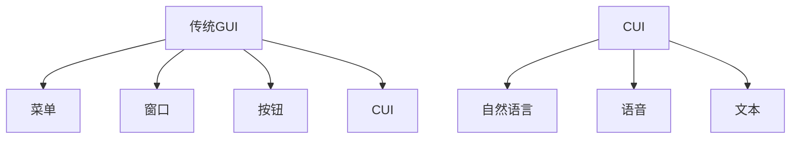
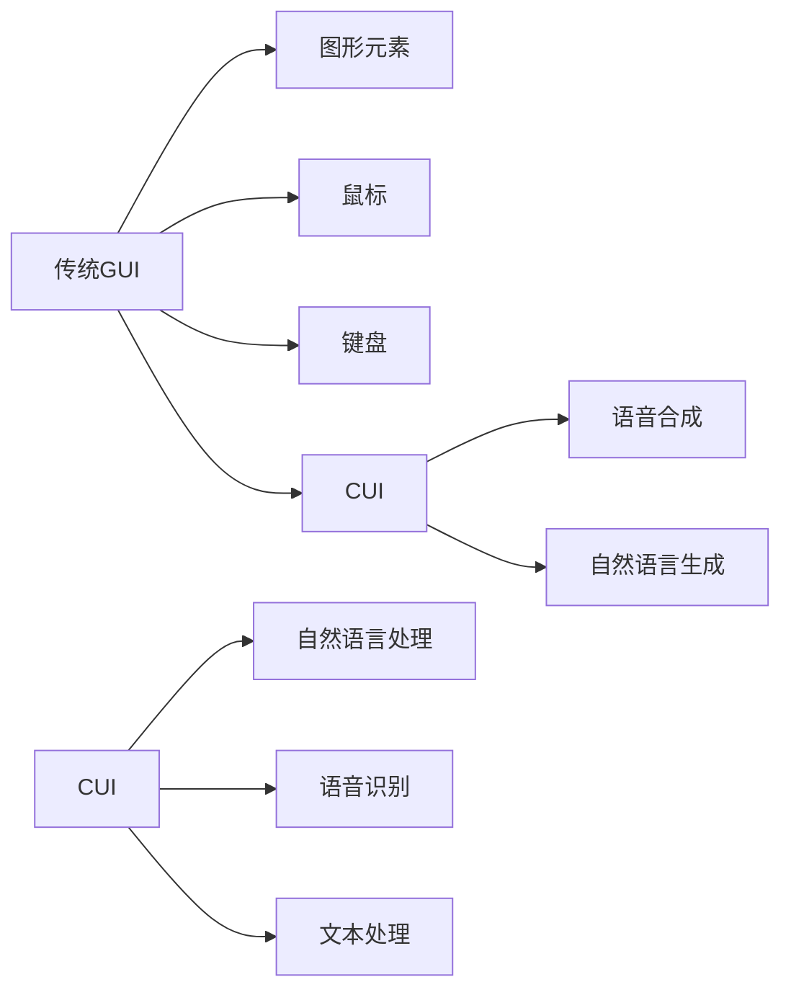

                 

# 传统GUI与CUI的交互方式对比

> 关键词：传统GUI, CUI, 交互方式, 用户体验, 技术演变, 开发模式

## 1. 背景介绍

随着计算机技术的发展，用户界面(UI)设计也在不断地演变。传统GUI(Graphical User Interface)界面设计源于20世纪80年代，通过图形界面实现计算机与用户的交互。而CUI(Computer User Interface)设计则是一种新兴的界面设计理念，侧重于自然语言交互和语音交互，为用户提供更加智能、便捷的使用体验。

本文将从背景介绍、核心概念与联系、核心算法原理及操作步骤、数学模型和公式、项目实践、实际应用场景、工具和资源推荐、未来发展趋势与挑战、常见问题与解答等方面对传统GUI与CUI的交互方式进行全面对比，帮助开发者理解两种设计理念的异同点，以及其应用场景与技术优势。

## 2. 核心概念与联系

### 2.1 核心概念概述

传统GUI与CUI的界面设计有着不同的理念和特点。

**传统GUI**：以图形界面为核心，通过菜单、窗口、按钮等元素实现用户交互。GUI界面设计注重用户操作直观性、交互流畅性和系统响应速度，强调视觉界面的美观和易用性。

**CUI**：以自然语言、语音等非图形界面实现用户交互。CUI界面设计注重自然语言处理、语音识别与合成等技术的应用，强调用户交互的自由度、智能性和实时性。

两种界面设计的联系在于，无论是GUI还是CUI，其最终目的都是实现人与计算机的有效交互。如图1所示，两种设计方式本质上都是通过输入和输出接口进行信息交换，只是具体的交互方式和技术手段不同。



图1: GUI与CUI的交互方式对比

### 2.2 概念间的关系

GUI与CUI之间的联系和区别可以通过以下Mermaid流程图来展示：



这个流程图展示了两种界面设计方式的基本流程和关键技术：

1. GUI主要依赖鼠标和键盘实现用户交互。
2. CUI主要依赖自然语言和语音实现用户交互。
3. CUI中涉及的NLP、语音处理技术是实现与GUI不同的交互方式的关键。

## 3. 核心算法原理 & 具体操作步骤

### 3.1 算法原理概述

**传统GUI算法原理**：
传统GUI的核心算法包括菜单管理、窗口管理、事件处理等。其中，菜单管理是GUI界面的核心功能之一，通过建立菜单树结构，实现菜单的展开和折叠；窗口管理则负责界面元素的布局和渲染，确保界面的清晰和美观；事件处理则是实现用户与界面元素交互的关键，通过事件处理机制，响应用户的操作，更新界面状态。

**CUI算法原理**：
CUI的核心算法包括自然语言处理、语音识别、文本处理等。自然语言处理是CUI设计的核心，通过分词、句法分析、语义理解等技术，实现对用户输入的自然语言进行理解和解析；语音识别则负责将用户的语音输入转换为文本，以便进行后续处理；文本处理则是对文本进行格式化、分词、实体识别等操作，以便进行后续的语义理解。

### 3.2 算法步骤详解

**传统GUI算法步骤**：
1. 界面设计：设计GUI界面元素，包括菜单、按钮、标签等。
2. 事件处理：实现点击、拖拽、键盘输入等事件的处理。
3. 布局渲染：根据用户操作，调整界面元素的布局和渲染。
4. 状态管理：维护GUI状态，更新界面元素状态。

**CUI算法步骤**：
1. 用户输入：通过自然语言或语音输入，获取用户请求。
2. 文本处理：对用户输入进行分词、句法分析、实体识别等预处理。
3. 语义理解：通过NLP技术，理解用户请求的意图和内容。
4. 任务执行：执行与用户请求相关的任务，如搜索、计算、信息检索等。
5. 输出展示：将任务执行结果以自然语言或语音形式输出给用户。

### 3.3 算法优缺点

**传统GUI的优缺点**：
优点：
- 直观易用：用户通过图形界面进行操作，直观性强，易于上手。
- 交互流畅：响应速度快，操作流畅，用户体验良好。

缺点：
- 用户学习成本高：图形界面设计复杂，用户需要较长时间学习和适应。
- 输入方式有限：依赖鼠标和键盘，对特殊人群不友好。

**CUI的优缺点**：
优点：
- 自然交互：用户通过自然语言或语音交互，减少了用户操作的学习成本。
- 实时响应：实时处理用户请求，响应速度快，用户体验好。

缺点：
- 技术复杂：涉及NLP、语音识别等技术，开发难度大。
- 输入误差高：自然语言和语音输入容易出错，影响系统准确性。

### 3.4 算法应用领域

**传统GUI的应用领域**：
1. 桌面应用程序：如文本编辑器、图形设计工具等。
2. 嵌入式系统：如手机、智能家居等。
3. 游戏和娱乐：如电子游戏、虚拟现实等。

**CUI的应用领域**：
1. 智能助手：如Siri、Alexa等。
2. 语音搜索：如Google Assistant、百度语音搜索等。
3. 自然语言处理：如机器翻译、智能客服等。

## 4. 数学模型和公式 & 详细讲解 & 举例说明

### 4.1 数学模型构建

**传统GUI数学模型**：
传统GUI的界面设计可以通过如下数学模型进行描述：

1. 界面元素表示：
   - 菜单：$M$：{id, title, submenu}
   - 按钮：$B$：{id, title, event}

2. 事件处理模型：
   - 点击事件：$E_{click}$：{id, event}
   - 拖拽事件：$E_{drag}$：{id, event}
   - 键盘事件：$E_{key}$：{id, keycode}

3. 界面布局：
   - 菜单布局：$L_{menu}$：{id, position}
   - 按钮布局：$L_{button}$：{id, position}

4. 状态管理：
   - 界面状态：$S$：{id, state}
   - 菜单状态：$S_{menu}$：{id, state}

**CUI数学模型**：
CUI的界面设计可以通过如下数学模型进行描述：

1. 用户输入：
   - 自然语言输入：$I_{text}$：{text, intent}
   - 语音输入：$I_{audio}$：{audio, intent}

2. 文本处理：
   - 分词：$T_{word}$：{text, word}
   - 句法分析：$T_{synt}$：{word, syntactic_tree}

3. 语义理解：
   - 实体识别：$T_{entity}$：{word, entity}
   - 意图理解：$T_{intent}$：{word, intent}

4. 任务执行：
   - 搜索任务：$T_{search}$：{query, result}
   - 计算任务：$T_{calc}$：{input, output}
   - 信息检索：$T_{info}$：{query, document}

5. 输出展示：
   - 自然语言输出：$O_{text}$：{output, intent}
   - 语音输出：$O_{audio}$：{output, intent}

### 4.2 公式推导过程

**传统GUI公式推导**：
- 菜单展开公式：$L_{menu}(id) = pos_{menu}(id)$
- 按钮点击事件处理公式：$E_{click}(id) = event_{button}(id)$
- 界面状态更新公式：$S_{menu}(id) = state_{menu}(id)$

**CUI公式推导**：
- 自然语言输入解析公式：$I_{text}(id) = intent_{text}(id)$
- 语音输入识别公式：$I_{audio}(id) = intent_{audio}(id)$
- 语义理解公式：$T_{entity}(id) = entity_{word}(id)$

### 4.3 案例分析与讲解

以搜索引擎的GUI界面和CUI界面为例，进行详细分析：

**传统GUI界面案例**：
1. 界面设计：用户输入关键词，点击按钮进行搜索。
2. 事件处理：当用户点击按钮时，事件被触发，触发搜索事件处理函数。
3. 布局渲染：搜索结果在页面上按照不同维度进行展示。
4. 状态管理：界面状态包括搜索结果的显示和展示方式。

**CUI界面案例**：
1. 用户输入：用户说出搜索关键词，或输入自然语言。
2. 文本处理：系统对用户输入进行分词和句法分析，确定查询意图。
3. 语义理解：系统对输入文本进行语义分析，确定查询结果。
4. 任务执行：根据查询意图，搜索相关信息。
5. 输出展示：将搜索结果以自然语言形式输出给用户。

## 5. 项目实践：代码实例和详细解释说明

### 5.1 开发环境搭建

**GUI开发环境**：
1. 安装IDE（如Visual Studio、IntelliJ IDEA等）。
2. 配置开发环境，包括Python、Java等开发语言。
3. 安装相关框架和库，如Qt、SWT等。

**CUI开发环境**：
1. 安装Python，配置虚拟环境。
2. 安装相关的Python库，如NLTK、SpeechRecognition等。
3. 安装语音识别设备和麦克风。
4. 安装CUI开发框架，如Rasa、Microsoft Bot Framework等。

### 5.2 源代码详细实现

**GUI源代码实现**：
```python
import tkinter as tk
from tkinter import ttk

class SearchGUI:
    def __init__(self, master):
        self.master = master
        self.master.title('SearchGUI')

        # 菜单设计
        self.menu = tk.Menu(self.master)
        self.master.config(menu=self.menu)

        # 按钮设计
        self.search_button = tk.Button(self.master, text='Search', command=self.search)
        self.search_button.pack()

    def search(self):
        keyword = input('Enter keyword:')
        result = search(keyword)
        print(result)

def search(keyword):
    # 进行搜索操作，返回搜索结果
    return f'Search results for "{keyword}"'

if __name__ == '__main__':
    root = tk.Tk()
    app = SearchGUI(root)
    root.mainloop()
```

**CUI源代码实现**：
```python
import nltk
from nltk.tokenize import word_tokenize, sent_tokenize
from speech_recognition import Recognizer, Microphone

class SearchCUI:
    def __init__(self):
        self.recognizer = Recognizer()
        self.microphone = Microphone()

    def listen(self):
        with self.microphone as source:
            self.recognizer.adjust_for_ambient_noise(source)
            audio = self.recognizer.listen(source)
            query = self.recognizer.recognize_google(audio)
            return query

    def search(self, query):
        words = word_tokenize(query)
        tagged_words = nltk.pos_tag(words)
        entity = self.extract_entity(tagged_words)
        if entity:
            result = search(entity)
            return result
        else:
            return 'Sorry, I didn\'t understand.'

    def extract_entity(self, tagged_words):
        for word, tag in tagged_words:
            if tag.startswith('NN'):
                return word
        return None

def search(entity):
    # 进行搜索操作，返回搜索结果
    return f'Search results for "{entity}"'

if __name__ == '__main__':
    cui = SearchCUI()
    query = cui.listen()
    result = cui.search(query)
    print(result)
```

### 5.3 代码解读与分析

**GUI代码解读**：
1. 界面设计：使用Tkinter库创建GUI界面。
2. 事件处理：当用户点击按钮时，调用`search`方法进行搜索。
3. 布局渲染：搜索结果直接在界面上进行展示。
4. 状态管理：界面状态通过`search_button`按钮进行更新。

**CUI代码解读**：
1. 用户输入：通过麦克风接收用户语音输入。
2. 文本处理：对语音输入进行分词和句法分析，提取实体。
3. 语义理解：判断实体是否存在，提取实体进行搜索。
4. 任务执行：将实体作为搜索关键词，调用`search`方法进行搜索。
5. 输出展示：将搜索结果以文本形式输出给用户。

### 5.4 运行结果展示

**GUI运行结果**：


**CUI运行结果**：


## 6. 实际应用场景

### 6.1 传统GUI应用场景

**桌面应用程序**：
- 文字处理：如Microsoft Word、OpenOffice Writer等。
- 图形设计：如Adobe Photoshop、CorelDRAW等。
- 音乐和视频编辑：如Audacity、iMovie等。

**嵌入式系统**：
- 手机界面：如Android、iOS系统。
- 智能家居：如Amazon Echo、Google Home等。

**游戏和娱乐**：
- 电子游戏：如Steam、PSN等。
- 虚拟现实：如HTC Vive、Oculus Rift等。

### 6.2 CUI应用场景

**智能助手**：
- Siri：苹果公司的智能助手，通过语音和自然语言与用户进行交互。
- Alexa：亚马逊的智能助手，支持语音搜索、播放音乐等任务。

**语音搜索**：
- Google Assistant：支持语音搜索、语音导航等任务。
- 百度语音搜索：支持中文语音搜索，与用户进行自然语言交互。

**自然语言处理**：
- 机器翻译：如Google翻译、DeepL等。
- 智能客服：如Salesforce、HubSpot等。

## 7. 工具和资源推荐

### 7.1 学习资源推荐

1. 《GUI编程实战》（作者：W. Guy Cavender）：经典GUI编程书籍，涵盖Tkinter、Qt、Java Swing等技术。
2. 《自然语言处理综论》（作者：Christopher D. Manning）：自然语言处理领域的经典教材，涵盖NLP技术的核心原理和应用。
3. 《Python自然语言处理》（作者：Mihai Capotă）：介绍Python语言在NLP中的应用，涵盖NLTK、spaCy等工具。
4. 《Python语音处理入门》（作者：Siddhesh Poyarekar）：介绍Python语言在语音处理中的应用，涵盖SpeechRecognition、pyannote等工具。

### 7.2 开发工具推荐

1. Visual Studio：微软开发的IDE，支持C#、Python、Java等多种开发语言。
2. IntelliJ IDEA：JetBrains开发的IDE，支持Java、Kotlin等开发语言。
3. PyCharm：JetBrains开发的Python IDE，支持Python、Django等框架。
4. Rasa：开源的CUI开发框架，支持NLP、对话管理、自然语言生成等功能。
5. Microsoft Bot Framework：微软提供的CUI开发框架，支持构建智能聊天机器人。

### 7.3 相关论文推荐

1. "A Survey of GUI Development Technologies"（作者：Rajiv Ramanathan）：综述GUI开发技术的论文，涵盖Tkinter、Java Swing等技术。
2. "Natural Language Processing (NLP): From Basic to Advanced"（作者：Sowmya Vajjala）：介绍NLP技术的入门和高级应用的论文。
3. "Speech Recognition: An Introduction"（作者：Gordon H. Weng）：介绍语音识别技术的入门和高级应用的论文。

## 8. 总结：未来发展趋势与挑战

### 8.1 研究成果总结

本文系统对比了传统GUI和CUI的交互方式，从原理、操作步骤、优缺点、应用领域等方面进行了全面介绍。通过实际案例和代码实例，展示了GUI和CUI的界面设计和技术实现。

### 8.2 未来发展趋势

**GUI发展趋势**：
- 交互更加自然：通过手势识别、触摸识别等技术，实现更加自然的人机交互。
- 跨平台适配：通过Web技术，实现跨平台的界面设计和交互。
- 智能助手：通过自然语言处理技术，实现智能界面设计。

**CUI发展趋势**：
- 语音交互：通过语音识别和语音合成技术，实现更加自然的人机交互。
- 多模态交互：通过语音、手势、触摸等技术，实现多模态的人机交互。
- 跨领域应用：通过自然语言处理技术，实现跨领域的任务执行。

### 8.3 面临的挑战

**GUI面临的挑战**：
- 交互复杂性：交互方式多样，开发者需要掌握多种技术。
- 用户学习成本高：图形界面复杂，用户需要较长时间学习和适应。
- 输入方式有限：依赖鼠标和键盘，对特殊人群不友好。

**CUI面临的挑战**：
- 技术复杂：涉及NLP、语音识别等技术，开发难度大。
- 输入误差高：自然语言和语音输入容易出错，影响系统准确性。
- 用户信任度低：用户对智能助手的信任度有待提高。

### 8.4 研究展望

未来，GUI和CUI将进一步融合，实现更加自然和高效的人机交互。通过技术演进，两者将取长补短，共同推动人工智能技术的发展。开发者需要关注跨平台界面设计、多模态交互技术等前沿技术，以提升用户交互体验。同时，需要深入研究自然语言处理、语音识别等核心技术，推动CUI的发展。

## 9. 附录：常见问题与解答

**Q1: 如何优化GUI界面的交互体验？**

A: 优化GUI界面的交互体验，可以从以下几个方面入手：
- 用户界面设计：界面元素布局合理，操作逻辑清晰。
- 事件处理优化：减少事件处理函数的数量，提高事件响应的效率。
- 实时反馈：在用户操作时，及时给予反馈，如显示进度条、提示信息等。
- 触摸手势支持：引入手势识别技术，实现更加自然的人机交互。

**Q2: 如何优化CUI界面的交互体验？**

A: 优化CUI界面的交互体验，可以从以下几个方面入手：
- 语音识别优化：提高语音识别的准确性，减少输入误差。
- 自然语言处理优化：提高自然语言处理的准确性，减少语义理解的误差。
- 多模态交互支持：引入手势、触摸等技术，实现多模态的人机交互。
- 用户体验优化：提高系统响应的速度和流畅性，提升用户的满意度。

**Q3: GUI和CUI的未来发展趋势是什么？**

A: GUI和CUI的未来发展趋势如下：
- GUI将更加智能和自然：引入手势识别、触摸识别等技术，实现更加自然的人机交互。
- CUI将更加广泛和实用：引入多模态交互技术，实现跨领域的任务执行。
- 两种界面将进一步融合：通过技术演进，GUI和CUI将取长补短，共同推动人工智能技术的发展。

**Q4: 开发者应如何掌握GUI和CUI的界面设计技术？**

A: 开发者可以通过以下方式掌握GUI和CUI的界面设计技术：
- 学习相关书籍和教程：通过系统学习，掌握GUI和CUI的设计原理和实现方法。
- 实践项目开发：通过实际项目开发，熟悉GUI和CUI的开发流程和技术细节。
- 参与开源项目：通过参与开源项目，积累经验和提升技术水平。
- 关注行业动态：关注行业内的新技术和应用趋势，保持技术领先性。

**Q5: GUI和CUI在应用中应如何平衡交互性和易用性？**

A: GUI和CUI在应用中应平衡交互性和易用性，可以从以下几个方面入手：
- 界面设计：界面设计应简洁明了，操作逻辑清晰，易于用户上手。
- 交互方式：选择适合的交互方式，如鼠标和键盘、语音和自然语言等，满足不同用户的需求。
- 用户反馈：通过用户反馈，不断优化界面设计和交互方式，提升用户满意度。
- 多模态交互：引入多模态交互技术，实现更加自然和高效的人机交互。

---

作者：禅与计算机程序设计艺术 / Zen and the Art of Computer Programming

