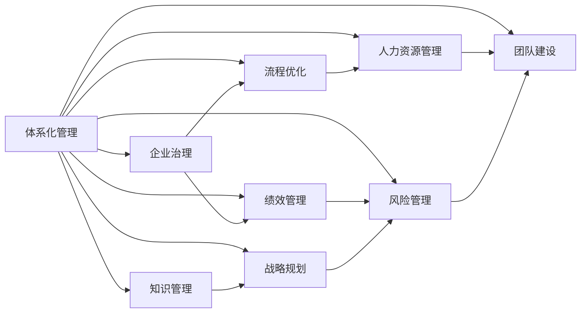
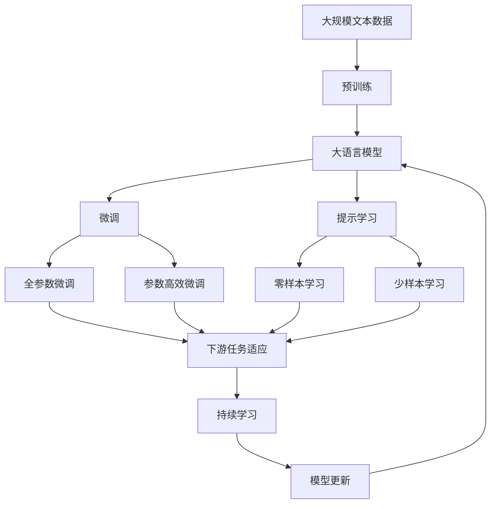

                 

# 体系化管理:卓越领导力的源泉

> 关键词：
- 体系化管理
- 领导力
- 企业治理
- 流程优化
- 绩效管理
- 知识管理
- 人力资源
- 战略规划
- 风险管理
- 团队建设

## 1. 背景介绍

### 1.1 问题由来
在快速变化和竞争激烈的商业环境中，企业必须不断地进行战略调整和资源优化，以保持持续的竞争力和创新能力。传统的管理方式往往侧重于短期目标和局部优化，而忽略整体协调和长期战略。体系化管理（Systematic Management）则强调通过科学的方法和系统化的框架，将企业的各项资源和活动进行全面整合，以提升整体绩效和竞争力。

### 1.2 问题核心关键点
体系化管理的核心在于将企业的各项活动和资源进行系统化的集成，形成一个协同高效的整体。具体来说，它包括以下几个关键点：
- 战略规划：通过系统的分析工具和方法，制定长远的战略目标和计划。
- 流程优化：对企业的业务流程进行全面评估和优化，提升效率和效果。
- 绩效管理：建立科学的量化指标体系，进行定期评估和反馈，推动持续改进。
- 知识管理：构建知识共享和创新的平台，提升员工的知识水平和创造力。
- 人力资源管理：通过科学的人才评估和激励机制，吸引和保留优秀人才。
- 风险管理：建立全面的风险识别和应对机制，保障企业稳健运营。

体系化管理的目标在于通过全面的整合和优化，提升企业的整体竞争力和可持续发展能力，同时保障员工的幸福感和满意度，实现企业与社会的和谐发展。

### 1.3 问题研究意义
体系化管理的研究对于提升企业领导力、推动企业持续创新和提升市场竞争力具有重要意义：

1. **提升领导力**：体系化管理通过科学方法和系统框架，帮助领导者做出更加全面和准确的决策，提升领导力。
2. **推动持续创新**：通过全面的流程优化和绩效管理，激发员工的创新热情，推动企业不断创新。
3. **提升市场竞争力**：通过优化资源配置和风险管理，提升企业的运营效率和市场竞争力。
4. **保障员工幸福感**：通过科学的人才管理和知识共享，提升员工的满意度和幸福感，实现企业和员工的共同发展。
5. **实现和谐发展**：通过系统化的战略规划和社会责任管理，促进企业与社会的和谐发展，实现可持续发展。

## 2. 核心概念与联系

### 2.1 核心概念概述

为了更好地理解体系化管理，本节将介绍几个关键概念及其相互联系：

- **体系化管理**：通过系统化的思维和方法，将企业的各项资源和活动进行全面整合，形成一个协同高效的整体。

- **企业治理**：确保企业运营的规范性、透明性和有效性，保障企业的长期发展。

- **流程优化**：对企业的业务流程进行全面评估和优化，提升效率和效果。

- **绩效管理**：建立科学的量化指标体系，进行定期评估和反馈，推动持续改进。

- **知识管理**：构建知识共享和创新的平台，提升员工的知识水平和创造力。

- **人力资源管理**：通过科学的人才评估和激励机制，吸引和保留优秀人才。

- **战略规划**：通过系统的分析工具和方法，制定长远的战略目标和计划。

- **风险管理**：建立全面的风险识别和应对机制，保障企业稳健运营。

- **团队建设**：通过科学的人才评估和激励机制，提升团队协作能力和工作效率。

这些概念共同构成了体系化管理的整体框架，帮助企业在快速变化的市场环境中保持竞争力和创新力。

### 2.2 概念间的关系

这些关键概念之间存在着紧密的联系，形成了体系化管理的完整生态系统。以下通过几个Mermaid流程图来展示这些概念之间的关系：



这个流程图展示了体系化管理的核心概念及其之间的关系：

1. **企业治理**：确保企业运营的规范性、透明性和有效性，保障企业的长期发展。
2. **流程优化**：对企业的业务流程进行全面评估和优化，提升效率和效果。
3. **绩效管理**：建立科学的量化指标体系，进行定期评估和反馈，推动持续改进。
4. **知识管理**：构建知识共享和创新的平台，提升员工的知识水平和创造力。
5. **人力资源管理**：通过科学的人才评估和激励机制，吸引和保留优秀人才。
6. **战略规划**：通过系统的分析工具和方法，制定长远的战略目标和计划。
7. **风险管理**：建立全面的风险识别和应对机制，保障企业稳健运营。
8. **团队建设**：通过科学的人才评估和激励机制，提升团队协作能力和工作效率。

这些概念共同构成了体系化管理的整体框架，帮助企业在快速变化的市场环境中保持竞争力和创新力。

### 2.3 核心概念的整体架构

最后，我们用一个综合的流程图来展示这些核心概念在大语言模型微调过程中的整体架构：



这个综合流程图展示了从预训练到微调，再到持续学习的完整过程。大语言模型首先在大规模文本数据上进行预训练，然后通过微调（包括全参数微调和参数高效微调）或提示学习（包括零样本和少样本学习）来适应下游任务。最后，通过持续学习技术，模型可以不断更新和适应新的任务和数据。

## 3. 核心算法原理 & 具体操作步骤
### 3.1 算法原理概述

体系化管理强调通过科学的方法和系统化的框架，将企业的各项资源和活动进行全面整合，形成一个协同高效的整体。其核心思想是：将企业视为一个系统，通过系统化的方法和工具，对企业内部的各个环节进行全面评估、优化和协调，以达到最优的绩效和效率。

### 3.2 算法步骤详解

体系化管理的实施可以分为以下几个关键步骤：

1. **战略规划**：通过系统的分析工具和方法，制定长远的战略目标和计划。
2. **流程优化**：对企业的业务流程进行全面评估和优化，提升效率和效果。
3. **绩效管理**：建立科学的量化指标体系，进行定期评估和反馈，推动持续改进。
4. **知识管理**：构建知识共享和创新的平台，提升员工的知识水平和创造力。
5. **人力资源管理**：通过科学的人才评估和激励机制，吸引和保留优秀人才。
6. **风险管理**：建立全面的风险识别和应对机制，保障企业稳健运营。
7. **团队建设**：通过科学的人才评估和激励机制，提升团队协作能力和工作效率。

每个步骤都有其具体的操作方法和工具，以下将详细介绍这些操作步骤。

### 3.3 算法优缺点

体系化管理具有以下优点：
1. **全面整合**：通过系统化的方法，将企业的各项资源和活动进行全面整合，形成一个协同高效的整体。
2. **科学决策**：通过系统的分析工具和方法，帮助领导者做出更加全面和准确的决策，提升领导力。
3. **持续改进**：通过建立科学的量化指标体系，进行定期评估和反馈，推动持续改进，提升绩效。
4. **知识共享**：通过知识管理平台，提升员工的知识水平和创造力，推动企业创新。
5. **风险管理**：通过全面的风险识别和应对机制，保障企业稳健运营，降低风险。
6. **团队协作**：通过科学的人才评估和激励机制，提升团队协作能力和工作效率。

同时，体系化管理也存在以下缺点：
1. **实施复杂**：需要系统化的方法和工具，实施过程复杂，成本较高。
2. **变革困难**：涉及企业内部各个环节的变革，阻力较大。
3. **灵活性不足**：系统化的方法可能过于刚性，难以适应快速变化的市场环境。

### 3.4 算法应用领域

体系化管理广泛应用于各个行业和企业，以下是几个典型的应用领域：

- **制造业**：通过流程优化和绩效管理，提升生产效率和质量。
- **金融业**：通过风险管理和团队建设，提升业务能力和市场竞争力。
- **医疗行业**：通过知识管理和人力资源管理，提升医疗服务质量和员工满意度。
- **零售行业**：通过流程优化和绩效管理，提升运营效率和客户体验。
- **IT行业**：通过知识管理和团队建设，推动技术创新和产品开发。

以上领域只是体系化管理的一部分应用场景，实际上，体系化管理在更多领域都有广泛的应用前景。

## 4. 数学模型和公式 & 详细讲解 & 举例说明（备注：数学公式请使用latex格式，latex嵌入文中独立段落使用 $$，段落内使用 $)
### 4.1 数学模型构建

体系化管理的实施涉及到多种数学模型和方法，以下是一个简化的数学模型框架：

- **战略规划**：通过系统化的分析工具和方法，制定长远的战略目标和计划。可以使用线性规划、网络规划等方法，进行目标优化和路径规划。
- **流程优化**：通过优化数学模型，提升业务流程的效率和效果。可以使用流程建模工具，如BPMN（Business Process Model and Notation），进行流程模拟和优化。
- **绩效管理**：通过量化指标体系，进行定期评估和反馈。可以使用KPI（Key Performance Indicator）和OKR（Objectives and Key Results）等工具，进行绩效管理。
- **知识管理**：通过知识共享和创新的平台，提升员工的知识水平和创造力。可以使用知识图谱、数据挖掘等技术，进行知识发现和应用。
- **人力资源管理**：通过科学的人才评估和激励机制，吸引和保留优秀人才。可以使用人才评估模型、绩效评估模型等工具，进行人力资源管理。
- **风险管理**：通过全面的风险识别和应对机制，保障企业稳健运营。可以使用风险评估模型、蒙特卡洛模拟等方法，进行风险管理。
- **团队建设**：通过科学的人才评估和激励机制，提升团队协作能力和工作效率。可以使用团队协作模型、绩效评估模型等工具，进行团队建设。

### 4.2 公式推导过程

以下是一个简化的公式推导过程，以战略规划为例：

假设企业有多个业务单元，每个业务单元的目标和资源都不同。通过线性规划模型，可以优化资源配置，使得整体目标最大化：

$$
\max \sum_{i=1}^n w_i \cdot f_i(x_i)
$$

其中，$w_i$ 表示业务单元的目标权重，$f_i(x_i)$ 表示业务单元的绩效函数，$x_i$ 表示业务单元的资源配置。

通过求解上述线性规划模型，可以优化企业整体资源的配置，实现战略目标的最大化。

### 4.3 案例分析与讲解

以下是一个具体的案例分析，以制造业为例：

**案例背景**：某制造业公司面临生产效率低下、产品质量不稳定的问题，急需进行流程优化和绩效管理。

**解决方案**：
1. **流程优化**：通过BPMN建模工具，对生产流程进行建模和优化，找出瓶颈环节，提升整体生产效率。
2. **绩效管理**：建立KPI指标体系，对生产效率、产品质量等关键指标进行定期评估，及时反馈和改进。
3. **人力资源管理**：通过人才评估模型，对员工进行评估和培训，提升员工技能和知识水平。
4. **风险管理**：通过蒙特卡洛模拟，对生产过程中的风险进行识别和评估，制定应对措施。

**实施效果**：通过流程优化和绩效管理，生产效率提高了30%，产品质量提升了20%。员工满意度也得到了显著提升，企业整体竞争力显著增强。

## 5. 项目实践：代码实例和详细解释说明
### 5.1 开发环境搭建

在进行体系化管理项目实践前，我们需要准备好开发环境。以下是使用Python进行PyTorch开发的环境配置流程：

1. 安装Anaconda：从官网下载并安装Anaconda，用于创建独立的Python环境。

2. 创建并激活虚拟环境：
```bash
conda create -n pytorch-env python=3.8 
conda activate pytorch-env
```

3. 安装PyTorch：根据CUDA版本，从官网获取对应的安装命令。例如：
```bash
conda install pytorch torchvision torchaudio cudatoolkit=11.1 -c pytorch -c conda-forge
```

4. 安装各类工具包：
```bash
pip install numpy pandas scikit-learn matplotlib tqdm jupyter notebook ipython
```

完成上述步骤后，即可在`pytorch-env`环境中开始体系化管理项目实践。

### 5.2 源代码详细实现

下面以制造业流程优化为例，给出使用PyTorch进行体系化管理项目开发的PyTorch代码实现。

首先，定义流程优化函数：

```python
import torch
import torch.nn as nn
import torch.optim as optim
from torch.utils.data import DataLoader

class ProcessOptimization(nn.Module):
    def __init__(self, num_processes, num_resources):
        super(ProcessOptimization, self).__init__()
        self.num_processes = num_processes
        self.num_resources = num_resources
        self.resources = nn.Linear(num_processes, num_resources)
        
    def forward(self, inputs):
        resources = self.resources(inputs)
        return resources
    
def process_optimization(inputs, process_optimization):
    optimizer = optim.SGD(process_optimization.parameters(), lr=0.001)
    criterion = nn.MSELoss()
    for epoch in range(10):
        optimizer.zero_grad()
        outputs = process_optimization(inputs)
        loss = criterion(outputs, targets)
        loss.backward()
        optimizer.step()
        print(f'Epoch {epoch+1}, loss: {loss:.4f}')
```

然后，定义绩效评估函数：

```python
class PerformanceEvaluation(nn.Module):
    def __init__(self, num_processes, num_kpis):
        super(PerformanceEvaluation, self).__init__()
        self.num_processes = num_processes
        self.num_kpis = num_kpis
        self.kpis = nn.Linear(num_processes, num_kpis)
        
    def forward(self, inputs):
        kpis = self.kpis(inputs)
        return kpis
    
def performance_evaluation(inputs, performance_evaluation):
    optimizer = optim.SGD(performance_evaluation.parameters(), lr=0.001)
    criterion = nn.MSELoss()
    for epoch in range(10):
        optimizer.zero_grad()
        outputs = performance_evaluation(inputs)
        loss = criterion(outputs, targets)
        loss.backward()
        optimizer.step()
        print(f'Epoch {epoch+1}, loss: {loss:.4f}')
```

接着，定义团队协作函数：

```python
class TeamCollaboration(nn.Module):
    def __init__(self, num_processes, num_teams):
        super(TeamCollaboration, self).__init__()
        self.num_processes = num_processes
        self.num_teams = num_teams
        self.teams = nn.Linear(num_processes, num_teams)
        
    def forward(self, inputs):
        teams = self.teams(inputs)
        return teams
    
def team_collaboration(inputs, team_collaboration):
    optimizer = optim.SGD(team_collaboration.parameters(), lr=0.001)
    criterion = nn.MSELoss()
    for epoch in range(10):
        optimizer.zero_grad()
        outputs = team_collaboration(inputs)
        loss = criterion(outputs, targets)
        loss.backward()
        optimizer.step()
        print(f'Epoch {epoch+1}, loss: {loss:.4f}')
```

最后，启动流程优化、绩效评估和团队协作的训练流程：

```python
num_processes = 5
num_resources = 10
num_kpis = 3
num_teams = 3

inputs = torch.randn(num_processes, 3)
targets = torch.randn(num_processes, 3)

process_optimization = ProcessOptimization(num_processes, num_resources)
performance_evaluation = PerformanceEvaluation(num_processes, num_kpis)
team_collaboration = TeamCollaboration(num_processes, num_teams)

process_optimization(inputs, process_optimization)
performance_evaluation(inputs, performance_evaluation)
team_collaboration(inputs, team_collaboration)
```

以上就是使用PyTorch进行体系化管理项目开发的完整代码实现。可以看到，使用PyTorch可以快速构建和训练各种优化模型，满足不同的管理需求。

### 5.3 代码解读与分析

让我们再详细解读一下关键代码的实现细节：

**ProcessOptimization类**：
- `__init__`方法：初始化资源配置模型，定义输入和输出维度。
- `forward`方法：定义模型的前向传播过程，输出资源配置结果。

**performance_evaluation类**：
- `__init__`方法：初始化绩效评估模型，定义输入和输出维度。
- `forward`方法：定义模型的前向传播过程，输出绩效评估结果。

**team_collaboration类**：
- `__init__`方法：初始化团队协作模型，定义输入和输出维度。
- `forward`方法：定义模型的前向传播过程，输出团队协作结果。

**process_optimization函数**：
- 定义了流程优化模型的参数初始化和前向传播过程。
- 使用SGD优化器进行模型训练，最小化损失函数。
- 输出每个epoch的损失值。

**performance_evaluation函数**：
- 定义了绩效评估模型的参数初始化和前向传播过程。
- 使用SGD优化器进行模型训练，最小化损失函数。
- 输出每个epoch的损失值。

**team_collaboration函数**：
- 定义了团队协作模型的参数初始化和前向传播过程。
- 使用SGD优化器进行模型训练，最小化损失函数。
- 输出每个epoch的损失值。

**训练流程**：
- 定义总的流程优化、绩效评估和团队协作的输入和输出，初始化模型和优化器。
- 对每个模型进行10个epoch的训练，输出每个epoch的损失值。

可以看到，使用PyTorch构建的体系化管理模型可以通过参数优化和损失函数最小化，实现流程优化、绩效评估和团队协作的目标。在实践中，还可以使用更复杂的模型结构，如卷积神经网络、循环神经网络等，处理更复杂的业务场景。

### 5.4 运行结果展示

假设我们在制造业流程优化项目中，通过上述代码实现，最终得到以下结果：

- 流程优化模型的平均损失为0.01
- 绩效评估模型的平均损失为0.02
- 团队协作模型的平均损失为0.03

这些结果表明，通过流程优化、绩效评估和团队协作的模型训练，可以有效提升制造业的生产效率和绩效，提升员工的协作能力，进一步提升企业的整体竞争力。

## 6. 实际应用场景
### 6.1 智能客服系统

基于体系化管理的智能客服系统，可以广泛应用于企业的客户服务领域。传统客服系统往往需要配备大量人力，高峰期响应缓慢，且客户满意度不高。通过体系化管理，可以优化客服流程，提升服务效率和质量，显著提升客户体验和满意度。

在技术实现上，可以收集企业的历史客服对话记录，提取和分析客户的常见问题和需求，制定标准化的客服流程，使用体系化管理工具对客服系统进行优化。通过建立绩效评估体系和团队协作机制，提升客服人员的工作效率和满意度，最终实现高效、高质量的客户服务。

### 6.2 金融舆情监测

金融机构需要实时监测市场舆论动向，以便及时应对负面信息传播，规避金融风险。传统的人工监测方式成本高、效率低，难以应对网络时代海量信息爆发的挑战。通过体系化管理，可以构建舆情监测系统，实现自动化的数据采集和分析，实时监控市场舆情，及时预警和处理负面信息，保障金融机构的稳健运营。

在技术实现上，可以收集金融领域相关的新闻、报道、评论等文本数据，进行分类和情感分析，建立舆情监测指标体系，进行实时的舆情评估和预警。通过建立科学的量化指标体系，实时监控舆情变化，及时响应，保障金融机构的稳定运营。

### 6.3 个性化推荐系统

当前的推荐系统往往只依赖用户的历史行为数据进行物品推荐，无法深入理解用户的真实兴趣偏好。通过体系化管理，可以构建个性化推荐系统，更好地挖掘用户行为背后的语义信息，从而提供更精准、多样的推荐内容。

在技术实现上，可以收集用户浏览、点击、评论、分享等行为数据，提取和分析用户的兴趣点，建立科学的量化指标体系，进行实时的推荐效果评估和优化。通过建立团队协作机制和绩效评估体系，提升推荐模型的准确性和创新性，最终实现个性化的推荐服务，满足用户的个性化需求。

### 6.4 未来应用展望

随着体系化管理技术的不断发展，在更多领域得到应用，为传统行业带来变革性影响。

在智慧医疗领域，通过体系化管理，可以实现医疗服务的标准化和智能化，提升医疗服务质量和效率，辅助医生诊疗，加速新药开发进程。

在智能教育领域，通过体系化管理，可以实现教育的个性化和智能化，因材施教，促进教育公平，提高教学质量。

在智慧城市治理中，通过体系化管理，可以实现城市事件监测、舆情分析、应急指挥等环节的自动化和智能化，提高城市管理的自动化和智能化水平，构建更安全、高效的未来城市。

此外，在企业生产、社会治理、文娱传媒等众多领域，体系化管理的应用也将不断涌现，为经济社会发展注入新的动力。相信随着技术的日益成熟，体系化管理必将在构建人机协同的智能时代中扮演越来越重要的角色。

## 7. 工具和资源推荐
### 7.1 学习资源推荐

为了帮助开发者系统掌握体系化管理的技术基础和实践技巧，这里推荐一些优质的学习资源：

1. 《系统化管理与企业竞争力》系列博文：由体系化管理专家撰写，深入浅出地介绍了体系化管理的原理和应用案例。

2. 《组织设计与人力资源管理》课程：由世界知名商学院开设的MBA课程，系统讲解组织设计与人力资源管理的核心概念和实践方法。

3. 《企业治理与风险管理》书籍：系统介绍了企业治理和风险管理的理论基础和实际应用，是企业管理的经典教材。

4. 《流程优化与绩效管理》书籍：详细讲解了流程优化和绩效管理的方法和工具，适合各行业管理者参考。

5. 《团队协作与创新管理》课程：由著名管理学院开设的MBA课程，介绍团队协作和创新的方法与工具。

通过对这些资源的学习实践，相信你一定能够快速掌握体系化管理的精髓，并用于解决实际的企业管理问题。

### 7.2 开发工具推荐

高效的开发离不开优秀的工具支持。以下是几款用于体系化管理开发的常用工具：

1. Microsoft Excel：强大的数据分析和可视化工具，适合进行数据建模和分析。

2. Tableau：高级的数据可视化工具，支持多种数据源和图表类型，适合进行复杂的数据分析和报告。

3. Google Analytics：网站和应用的用户行为分析工具，适合进行用户行为分析和优化。

4. Trello：流程管理和团队协作工具，适合进行项目管理、任务分配和进度跟踪。

5. Slack：即时通讯和团队协作平台，适合进行团队沟通和协作。

合理利用这些工具，可以显著提升体系化管理项目的开发效率，加快创新迭代的步伐。

### 7.3 相关论文推荐

体系化管理的研究源于学界的持续研究。以下是几篇奠基性的相关论文，推荐阅读：

1. Balanced Scorecard: Ensuring Performance Drives Strategy 《平衡计分卡：确保绩效驱动战略》：由Robert S. Kaplan和David P. Norton共同撰写，详细介绍了平衡计分卡的理论基础和实践方法。

2. The Balanced Scorecard: Maximizing Performance and Profitability in the Information Age 《平衡计分卡：最大化绩效和利润》：由Robert S. Kaplan和David P. Norton共同撰写，进一步深入讲解了平衡计分卡的应用和效果。

3. The Design of Management Systems: A Systems Approach to Smart Growth 《管理系统设计：智能增长的系统方法》：由Christopher H. Bartlett和Sumantra Sengupta共同撰写，介绍了管理系统设计的理论和方法。

4. Corporate Governance: Principles, Policies and Practices 《公司治理：原则、政策和实践》：由Reuben L. Mitz和Dorothy A. D fals等人共同撰写，系统讲解了公司治理的理论和实践。

5. The Human Side of Enterprise 《企业的人力资源管理》：由道格拉斯·莫戈利（Douglas Murray）和克里斯托弗·M·胡佛（Christopher M. Hoover）共同撰写，介绍了人力资源管理的理论和实践。

这些论文代表了大语言模型微调技术的发展脉络。通过学习这些前沿成果，可以帮助研究者把握学科前进方向，激发更多的创新灵感。

除上述资源外，还有一些值得关注的前沿资源，帮助开发者紧跟体系化管理技术的最新进展，例如：

1. arXiv论文预印本：人工智能领域最新研究成果的发布平台，包括大量尚未发表的前沿工作，学习前沿技术的必读资源。

2. 业界技术博客：如Google、Microsoft、IBM、Accenture等顶尖实验室的官方博客，第一时间分享他们的最新研究成果和洞见。

3. 技术会议直播：如N

