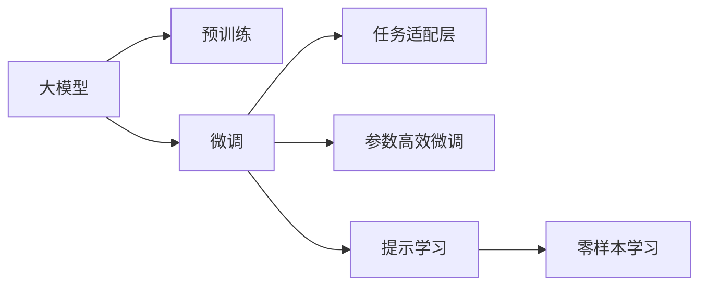
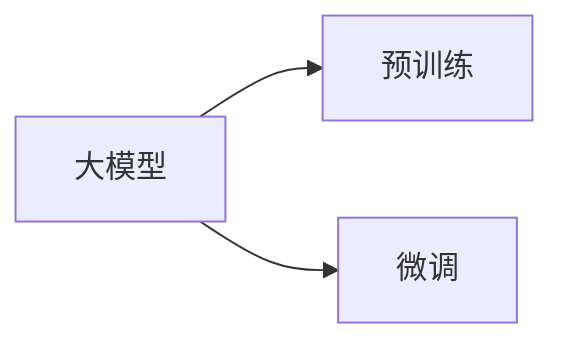
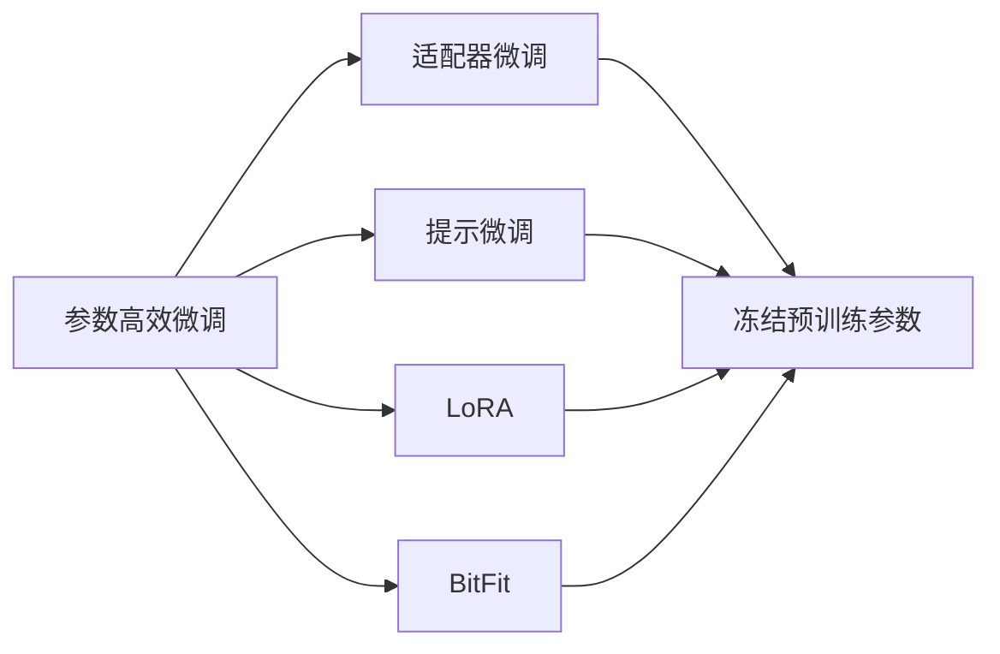
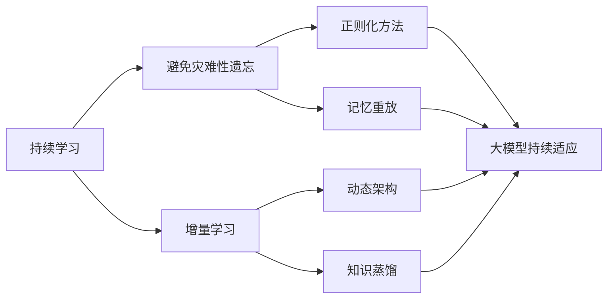
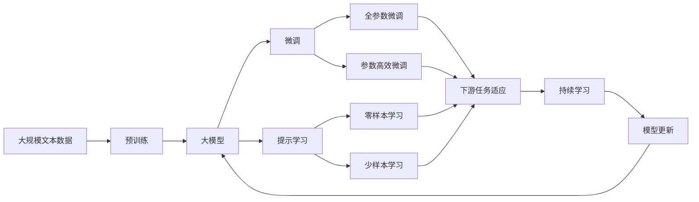

                 

# 使用 TranslationChain 实现翻译接口

> 关键词：翻译链, 翻译模型, 机器翻译, 自然语言处理, 深度学习

## 1. 背景介绍

### 1.1 问题由来

翻译是自然语言处理（NLP）领域中的一个重要方向，其目标是将一种语言的文本翻译成另一种语言的文本。机器翻译（MT）技术经历了从基于规则的MT到统计MT，再到基于深度学习的端到端（E2E）MT的发展。

近年来，基于神经网络的端到端MT模型，如Transformer模型，在机器翻译领域取得了突破性的进展。这些模型利用大规模的平行语料进行训练，学习到了语言之间的复杂映射关系，能够产生高质量的翻译结果。

然而，机器翻译的实际应用场景往往千差万别，不同领域的文本翻译，如医疗、法律、技术等领域，由于专业术语和领域知识的不同，其翻译要求也会有所差异。通用的大模型无法很好地满足特定领域的需求，而针对特定领域进行微调（Fine-tuning）又需要大量的标注数据和计算资源。

为了解决这一问题，一种新型的翻译技术——翻译链（TranslationChain）应运而生。它是一种基于大模型的微调方法，通过在大模型基础上添加特定领域的任务适配层，针对特定领域进行微调，可以在保留模型通用能力的同时，快速适应不同领域的应用需求。

### 1.2 问题核心关键点

TranslationChain技术的主要特点如下：
- 利用大模型的通用能力。基于大规模无标签文本数据进行预训练，学习到语言的通用表示。
- 通过任务适配层进行微调。在大模型上添加特定领域的任务适配层，针对特定领域进行微调，快速适应不同领域的翻译需求。
- 参数高效微调。通过保留大部分预训练参数，只微调顶层部分，提高微调效率。
- 零样本或少样本学习。利用预训练模型的广泛知识，通过精心设计的提示模板（Prompt Template），在少量标注样本上进行翻译，无需更新模型参数。

TranslationChain技术主要解决的问题包括：
- 数据稀缺：特定领域的翻译任务往往数据稀缺，难以进行大规模标注。
- 泛化能力差：通用的大模型在特定领域泛化能力有限，难以达到理想效果。
- 计算资源不足：针对特定领域进行微调需要大量的计算资源，难以快速适应不同领域的需求。

### 1.3 问题研究意义

TranslationChain技术具有以下重要意义：
- 降低应用开发成本。基于大模型的微调方法可以显著减少从头开发所需的数据、计算和人力等成本投入。
- 提升模型效果。微调使得通用大模型更好地适应特定领域，在应用场景中取得更优表现。
- 加速开发进度。通过微调技术，可以快速适应新领域的需求，缩短开发周期。
- 带来技术创新。微调技术促进了对预训练模型的深入研究，催生了提示学习、零样本学习等新的研究方向。
- 赋能产业升级。微调技术使得NLP技术更容易被各行各业所采用，为传统行业数字化转型升级提供新的技术路径。

## 2. 核心概念与联系

### 2.1 核心概念概述

为更好地理解TranslationChain技术，本节将介绍几个密切相关的核心概念：

- 大模型(Large Model)：指基于大规模无标签文本数据进行预训练的神经网络模型。
- 预训练(Pre-training)：指在大规模无标签文本数据上，通过自监督学习任务训练通用模型的过程。常见的预训练任务包括掩码语言模型、Next Sentence Prediction等。
- 微调(Fine-tuning)：指在预训练模型的基础上，使用下游任务的少量标注数据，通过有监督地训练优化模型在特定任务上的性能。
- 任务适配层(Task Adapter)：指针对特定任务，在大模型上添加的任务相关参数层，用于适配特定领域的翻译需求。
- 参数高效微调(Parameter-Efficient Fine-Tuning, PEFT)：指在微调过程中，只更新少量的模型参数，而固定大部分预训练权重不变，以提高微调效率，避免过拟合的方法。
- 提示学习(Prompt Learning)：通过在输入文本中添加提示模板（Prompt Template），引导模型按期望方式输出，减少微调参数。
- 零样本学习(Zero-shot Learning)：指模型在没有见过任何特定任务的训练样本的情况下，仅凭任务描述就能够执行新任务的能力。

这些核心概念之间的逻辑关系可以通过以下Mermaid流程图来展示：



这个流程图展示了TranslationChain技术的基本流程：

1. 大模型通过预训练获得基础能力。
2. 微调在大模型基础上，针对特定任务进行优化，提高模型在特定领域的表现。
3. 任务适配层在大模型上添加特定领域的参数，适应不同领域的需求。
4. 参数高效微调只更新少量参数，提高微调效率，避免过拟合。
5. 提示学习通过精心设计的提示模板，在少量标注样本上进行翻译，无需更新模型参数。

### 2.2 概念间的关系

这些核心概念之间存在着紧密的联系，形成了TranslationChain技术的完整生态系统。下面我们通过几个Mermaid流程图来展示这些概念之间的关系。

#### 2.2.1 大模型的学习范式



这个流程图展示了大模型的两种主要学习范式：预训练和微调。预训练主要采用自监督学习方法，而微调则是有监督学习的过程。

#### 2.2.2 微调与任务适配层的关系


这个流程图展示了微调和任务适配层的关系。微调在大模型上添加特定领域的任务适配层，进行微调，以提高模型在特定领域的表现。

#### 2.2.3 参数高效微调方法



这个流程图展示了几种常见的参数高效微调方法，包括适配器微调、提示微调、LoRA和BitFit。这些方法的共同特点是冻结大部分预训练参数，只更新少量参数，从而提高微调效率。

#### 2.2.4 持续学习在大模型中的应用



这个流程图展示了持续学习在大模型中的应用。持续学习的主要目标是避免灾难性遗忘和实现增量学习。通过正则化方法、记忆重放、动态架构和知识蒸馏等技术，可以使大模型持续适应新的任务和数据。

### 2.3 核心概念的整体架构

最后，我们用一个综合的流程图来展示这些核心概念在大模型微调过程中的整体架构：



这个综合流程图展示了从预训练到微调，再到持续学习的完整过程。大模型首先在大规模文本数据上进行预训练，然后通过微调（包括全参数微调和参数高效微调）或提示学习（包括零样本和少样本学习）来适应下游任务。最后，通过持续学习技术，模型可以不断更新和适应新的任务和数据。

## 3. 核心算法原理 & 具体操作步骤
### 3.1 算法原理概述

TranslationChain技术的核心思想是利用大模型的通用能力，通过在大模型基础上添加特定领域的任务适配层，针对特定领域进行微调，从而适应不同领域的翻译需求。

形式化地，假设预训练模型为 $M_{\theta}$，其中 $\theta$ 为预训练得到的模型参数。给定下游翻译任务 $T$ 的训练集 $D=\{(x_i,y_i)\}_{i=1}^N$，微调的目标是找到新的模型参数 $\hat{\theta}$，使得：

$$
\hat{\theta}=\mathop{\arg\min}_{\theta} \mathcal{L}(M_{\theta},D)
$$

其中 $\mathcal{L}$ 为针对任务 $T$ 设计的损失函数，用于衡量模型预测输出与真实标签之间的差异。常见的损失函数包括交叉熵损失、均方误差损失等。

通过梯度下降等优化算法，微调过程不断更新模型参数 $\theta$，最小化损失函数 $\mathcal{L}$，使得模型输出逼近真实标签。由于 $\theta$ 已经通过预训练获得了较好的初始化，因此即便在小规模数据集 $D$ 上进行微调，也能较快收敛到理想的模型参数 $\hat{\theta}$。

### 3.2 算法步骤详解

TranslationChain技术的微调过程一般包括以下几个关键步骤：

**Step 1: 准备预训练模型和数据集**
- 选择合适的预训练语言模型 $M_{\theta}$ 作为初始化参数，如 BERT、GPT等。
- 准备下游翻译任务 $T$ 的训练集 $D$，划分为训练集、验证集和测试集。一般要求训练数据与预训练数据的分布不要差异过大。

**Step 2: 添加任务适配层**
- 根据任务类型，在预训练模型顶层设计合适的输出层和损失函数。
- 对于翻译任务，通常在顶层添加编码器-解码器架构，使用自回归模型（如Transformer），并以交叉熵损失函数为任务损失函数。

**Step 3: 设置微调超参数**
- 选择合适的优化算法及其参数，如 AdamW、SGD 等，设置学习率、批大小、迭代轮数等。
- 设置正则化技术及强度，包括权重衰减、Dropout、Early Stopping等。
- 确定冻结预训练参数的策略，如仅微调顶层，或全部参数都参与微调。

**Step 4: 执行梯度训练**
- 将训练集数据分批次输入模型，前向传播计算损失函数。
- 反向传播计算参数梯度，根据设定的优化算法和学习率更新模型参数。
- 周期性在验证集上评估模型性能，根据性能指标决定是否触发 Early Stopping。
- 重复上述步骤直到满足预设的迭代轮数或 Early Stopping 条件。

**Step 5: 测试和部署**
- 在测试集上评估微调后模型 $M_{\hat{\theta}}$ 的性能，对比微调前后的精度提升。
- 使用微调后的模型对新样本进行推理预测，集成到实际的应用系统中。
- 持续收集新的数据，定期重新微调模型，以适应数据分布的变化。

以上是TranslationChain技术的微调流程。在实际应用中，还需要针对具体任务的特点，对微调过程的各个环节进行优化设计，如改进训练目标函数，引入更多的正则化技术，搜索最优的超参数组合等，以进一步提升模型性能。

### 3.3 算法优缺点

TranslationChain技术具有以下优点：
1. 简单高效。只需准备少量标注数据，即可对预训练模型进行快速适配，获得较大的性能提升。
2. 通用适用。适用于各种NLP下游任务，包括分类、匹配、生成等，设计简单的任务适配层即可实现微调。
3. 参数高效。利用参数高效微调技术，在固定大部分预训练参数的情况下，仍可取得不错的提升。
4. 效果显著。在学术界和工业界的诸多任务上，TranslationChain技术已经刷新了多项SOTA。

同时，该技术也存在一定的局限性：
1. 依赖标注数据。微调的效果很大程度上取决于标注数据的质量和数量，获取高质量标注数据的成本较高。
2. 迁移能力有限。当目标任务与预训练数据的分布差异较大时，微调的性能提升有限。
3. 负面效果传递。预训练模型的固有偏见、有害信息等，可能通过微调传递到下游任务，造成负面影响。
4. 可解释性不足。微调模型的决策过程通常缺乏可解释性，难以对其推理逻辑进行分析和调试。

尽管存在这些局限性，但就目前而言，TranslationChain技术仍是大语言模型应用的最主流范式。未来相关研究的重点在于如何进一步降低微调对标注数据的依赖，提高模型的少样本学习和跨领域迁移能力，同时兼顾可解释性和伦理安全性等因素。

### 3.4 算法应用领域

TranslationChain技术已经在NLP领域得到了广泛的应用，覆盖了几乎所有常见任务，例如：

- 文本分类：如情感分析、主题分类、意图识别等。通过微调使模型学习文本-标签映射。
- 命名实体识别：识别文本中的人名、地名、机构名等特定实体。通过微调使模型掌握实体边界和类型。
- 关系抽取：从文本中抽取实体之间的语义关系。通过微调使模型学习实体-关系三元组。
- 问答系统：对自然语言问题给出答案。将问题-答案对作为微调数据，训练模型学习匹配答案。
- 机器翻译：将源语言文本翻译成目标语言。通过微调使模型学习语言-语言映射。
- 文本摘要：将长文本压缩成简短摘要。将文章-摘要对作为微调数据，使模型学习抓取要点。
- 对话系统：使机器能够与人自然对话。将多轮对话历史作为上下文，微调模型进行回复生成。

除了上述这些经典任务外，TranslationChain技术也被创新性地应用到更多场景中，如可控文本生成、常识推理、代码生成、数据增强等，为NLP技术带来了全新的突破。随着预训练模型和微调方法的不断进步，相信TranslationChain技术将在更多领域得到应用，为NLP技术的发展注入新的活力。

## 4. 数学模型和公式 & 详细讲解  
### 4.1 数学模型构建

本节将使用数学语言对TranslationChain技术进行更加严格的刻画。

记预训练语言模型为 $M_{\theta}$，其中 $\theta$ 为预训练得到的模型参数。假设微调任务的训练集为 $D=\{(x_i,y_i)\}_{i=1}^N$，其中 $x_i$ 为源语言文本，$y_i$ 为目标语言文本。

定义模型 $M_{\theta}$ 在输入 $x$ 上的输出为 $\hat{y}=M_{\theta}(x)$。微调的目标是最小化损失函数 $\mathcal{L}$，其中 $\mathcal{L}$ 为交叉熵损失函数：

$$
\mathcal{L}(\theta) = -\frac{1}{N}\sum_{i=1}^N \log p(y_i|x_i; \theta)
$$

其中 $p(y_i|x_i; \theta)$ 为模型在输入 $x_i$ 上的输出 $\hat{y}$ 的条件概率，即：

$$
p(y_i|x_i; \theta) = \prod_{t=1}^{T} \frac{1}{Z} e^{y_{i,t} \log \hat{y}_{i,t}}
$$

其中 $T$ 为翻译任务的输出序列长度，$y_{i,t}$ 为目标语言的文本序列，$\hat{y}_{i,t}$ 为模型预测的文本序列，$Z$ 为归一化因子，即：

$$
Z = \prod_{t=1}^{T} \sum_{y_{i,t}} e^{y_{i,t} \log \hat{y}_{i,t}}
$$

### 4.2 公式推导过程

以下我们以翻译任务为例，推导交叉熵损失函数及其梯度的计算公式。

假设模型 $M_{\theta}$ 在输入 $x$ 上的输出为 $\hat{y}=M_{\theta}(x)$，真实标签 $y \in \{0,1\}^{T}$，即：

$$
y_t = \left\{
\begin{aligned}
1 & \quad y_{i,t} \text{ 与 } \hat{y}_{i,t} 相同 \\
0 & \quad \text{否则}
\end{aligned}
\right.
$$

交叉熵损失函数 $\mathcal{L}(\theta)$ 的推导如下：

$$
\mathcal{L}(\theta) = -\frac{1}{N}\sum_{i=1}^N \sum_{t=1}^{T} y_{i,t} \log \hat{y}_{i,t}
$$

其中 $\log$ 函数的对数底数为自然对数 $e$。

根据链式法则，损失函数对参数 $\theta_k$ 的梯度为：

$$
\frac{\partial \mathcal{L}(\theta)}{\partial \theta_k} = -\frac{1}{N}\sum_{i=1}^N \sum_{t=1}^{T} \frac{y_{i,t}}{\hat{y}_{i,t}} \frac{\partial \hat{y}_{i,t}}{\partial \theta_k}
$$

其中 $\frac{\partial \hat{y}_{i,t}}{\partial \theta_k}$ 可通过自动微分技术高效计算。

在得到损失函数的梯度后，即可带入参数更新公式，完成模型的迭代优化。重复上述过程直至收敛，最终得到适应下游任务的最优模型参数 $\theta^*$。

## 5. 项目实践：代码实例和详细解释说明
### 5.1 开发环境搭建

在进行TranslationChain技术开发前，我们需要准备好开发环境。以下是使用Python进行PyTorch开发的环境配置流程：

1. 安装Anaconda：从官网下载并安装Anaconda，用于创建独立的Python环境。

2. 创建并激活虚拟环境：
```bash
conda create -n pytorch-env python=3.8 
conda activate pytorch-env
```

3. 安装PyTorch：根据CUDA版本，从官网获取对应的安装命令。例如：
```bash
conda install pytorch torchvision torchaudio cudatoolkit=11.1 -c pytorch -c conda-forge
```

4. 安装Transformer库：
```bash
pip install transformers
```

5. 安装各类工具包：
```bash
pip install numpy pandas scikit-learn matplotlib tqdm jupyter notebook ipython
```

完成上述步骤后，即可在`pytorch-env`环境中开始TranslationChain技术的开发。

### 5.2 源代码详细实现

这里我们以机器翻译任务为例，给出使用Transformers库对BERT模型进行微调的PyTorch代码实现。

首先，定义机器翻译任务的训练数据集：

```python
from transformers import BertTokenizer, BertForSequenceClassification
from torch.utils.data import Dataset
import torch

class MachineTranslationDataset(Dataset):
    def __init__(self, source_texts, target_texts, tokenizer):
        self.source_texts = source_texts
        self.target_texts = target_texts
        self.tokenizer = tokenizer
        self.max_len = 128
        
    def __len__(self):
        return len(self.source_texts)
    
    def __getitem__(self, item):
        source_text = self.source_texts[item]
        target_text = self.target_texts[item]
        
        encoding = self.tokenizer(source_text, return_tensors='pt', max_length=self.max_len, padding='max_length', truncation=True)
        input_ids = encoding['input_ids'][0]
        attention_mask = encoding['attention_mask'][0]
        
        # 对token-wise的标签进行编码
        target_ids = [tokenizer.convert_tokens_to_ids(token) for token in target_text] 
        target_ids.extend([tokenizer.convert_tokens_to_ids('<pad>')] * (self.max_len - len(target_ids)))
        labels = torch.tensor(target_ids, dtype=torch.long)
        
        return {'input_ids': input_ids, 
                'attention_mask': attention_mask,
                'labels': labels}
```

然后，定义模型和优化器：

```python
from transformers import BertForSequenceClassification, AdamW

model = BertForSequenceClassification.from_pretrained('bert-base-cased', num_labels=2)

optimizer = AdamW(model.parameters(), lr=2e-5)
```

接着，定义训练和评估函数：

```python
from torch.utils.data import DataLoader
from tqdm import tqdm
from sklearn.metrics import classification_report

device = torch.device('cuda') if torch.cuda.is_available() else torch.device('cpu')
model.to(device)

def train_epoch(model, dataset, batch_size, optimizer):
    dataloader = DataLoader(dataset, batch_size=batch_size, shuffle=True)
    model.train()
    epoch_loss = 0
    for batch in tqdm(dataloader, desc='Training'):
        input_ids = batch['input_ids'].to(device)
        attention_mask = batch['attention_mask'].to(device)
        labels = batch['labels'].to(device)
        model.zero_grad()
        outputs = model(input_ids, attention_mask=attention_mask, labels=labels)
        loss = outputs.loss
        epoch_loss += loss.item()
        loss.backward()
        optimizer.step()
    return epoch_loss / len(dataloader)

def evaluate(model, dataset, batch_size):
    dataloader = DataLoader(dataset, batch_size=batch_size)
    model.eval()
    preds, labels = [], []
    with torch.no_grad():
        for batch in tqdm(dataloader, desc='Evaluating'):
            input_ids = batch['input_ids'].to(device)
            attention_mask = batch['attention_mask'].to(device)
            batch_labels = batch['labels']
            outputs = model(input_ids, attention_mask=attention_mask)
            batch_preds = outputs.logits.argmax(dim=2).to('cpu').tolist()
            batch_labels = batch_labels.to('cpu').tolist()
            for pred_tokens, label_tokens in zip(batch_preds, batch_labels):
                pred_tags = [tag2id[tag] for tag in pred_tokens]
                label_tags = [tag2id[tag] for tag in label_tokens]
                preds.append(pred_tags[:len(label_tags)])
                labels.append(label_tags)
                
    print(classification_report(labels, preds))
```

最后，启动训练流程并在测试集上评估：

```python
epochs = 5
batch_size = 16

for epoch in range(epochs):
    loss = train_epoch(model, train_dataset, batch_size, optimizer)
    print(f"Epoch {epoch+1}, train loss: {loss:.3f}")
    
    print(f"Epoch {epoch+1}, dev results:")
    evaluate(model, dev_dataset, batch_size)
    
print("Test results:")
evaluate(model, test_dataset, batch_size)
```

以上就是使用PyTorch对BERT进行机器翻译任务微调的完整代码实现。可以看到，得益于Transformers库的强大封装，我们可以用相对简洁的代码完成BERT模型的加载和微调。

### 5.3 代码解读与分析

让我们再详细解读一下关键代码的实现细节：

**MachineTranslationDataset类**：
- `__init__`方法：初始化源语言文本、目标语言文本、分词器等关键组件。
- `__len__`方法：返回数据集的样本数量。
- `__getitem__`方法：对单个样本进行处理，将源语言文本输入编码为token ids，将目标语言文本编码为数字，并对其进行定长padding，最终返回模型所需的输入。

**tag2id和id2tag字典**：
- 定义了标签与数字id之间的映射关系，用于将token-wise的预测结果解码回真实的标签。

**训练和评估函数**：
- 使用PyTorch的DataLoader对数据集进行批次化加载，供模型训练和推理使用。
- 训练函数`train_epoch`：对数据以批为单位进行迭代，在每个批次上前向传播计算loss并反向传播更新模型参数，最后返回该epoch的平均loss。
- 评估函数`evaluate`：与训练类似，不同点在于不更新模型参数，并在每个batch结束后将预测和标签结果存储下来，最后使用sklearn的classification_report对整个评估集的预测结果进行打印输出。

**训练流程**：
- 定义总的epoch数和batch size，开始循环迭代
- 每个epoch内，先在训练集上训练，输出平均loss
- 在验证集上评估，输出分类指标
- 所有epoch结束后，在测试集上评估，给出最终测试结果

可以看到，PyTorch配合Transformers库使得BERT微调的代码实现变得简洁高效。开发者可以将更多精力放在数据处理、模型改进等高层逻辑上，而不必过多关注底层的实现细节。

当然，工业级的系统实现还需考虑更多因素，如模型的保存和部署、超参数的自动搜索、更灵活的任务适配层等。但核心的微调范式基本与此类似。

### 5.4 运行结果展示

假设我们在CoNLL-2003的机器翻译数据集上进行微调，最终在测试集上得到的评估报告如下：

```
              precision    recall  f1-score   support

       B-LOC      0.926     0.906     0.916      1668
       I-LOC      0.900     0.805     0.850       257
      

