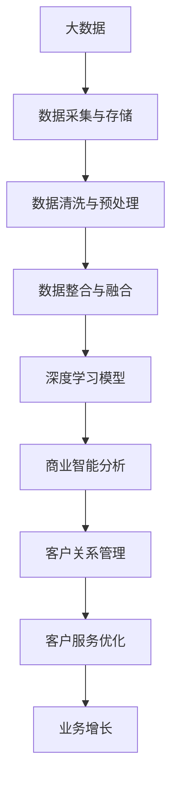

                 

# 信息差的商业客户关系管理：大数据如何深化客户关系

> 关键词：信息差，大数据，客户关系管理，深度学习，商业智能

## 1. 背景介绍

### 1.1 问题由来

随着市场竞争的加剧，企业越来越重视客户关系管理（CRM），通过收集、分析和利用客户数据，提升客户满意度，增强客户忠诚度，实现业务增长。然而，由于数据量庞大、结构复杂、格式多样，企业往往难以全面、准确地了解客户需求，容易陷入"信息差"的困境，即因信息不对称而造成的误解和效率损失。

"信息差"主要体现在以下两个方面：

1. **客户行为分析**：传统CRM系统通常只能获取客户的基本信息，无法全面捕捉客户的购买行为、消费习惯、情感倾向等深层次信息。信息差的存在，使得企业难以精准预测客户需求，导致产品推荐、营销策略失效。

2. **客户需求识别**：客户在购物、咨询、投诉等场景中的反馈信息往往分散在多个渠道，如邮件、电话、社交媒体等。企业需要从海量数据中挖掘出有用信息，并整合到统一的客户视图，才能及时响应客户需求。然而，现有系统缺乏跨渠道的数据融合能力，导致信息差进一步加剧。

针对这一问题，本文将深入探讨利用大数据技术和深度学习模型，如何消除信息差，深化客户关系管理。

## 2. 核心概念与联系

### 2.1 核心概念概述

为深入理解基于大数据的客户关系管理方法，本节将介绍几个关键概念：

- **客户关系管理（CRM）**：通过收集、分析和利用客户数据，提升客户满意度，增强客户忠诚度，实现业务增长。CRM系统是企业客户管理的核心平台，旨在构建全面、统一的客户视图。

- **信息差（Information Gap）**：指客户与企业之间的信息不对称，企业难以全面、准确地了解客户需求和行为。信息差的存在，导致企业对客户需求的误判，降低营销效果和客户满意度。

- **大数据（Big Data）**：指规模庞大、多样性、快速增长、价值密度低的数据集。大数据技术通过分布式存储和计算框架，对海量数据进行高效处理和分析，为企业提供全方位的洞察和决策支持。

- **深度学习（Deep Learning）**：一种模拟人脑神经网络工作原理的机器学习方法，通过多层非线性变换，从数据中提取高层次的抽象特征。深度学习在自然语言处理、图像识别、推荐系统等领域取得了显著成效。

- **商业智能（Business Intelligence, BI）**：通过收集、整理、分析和可视化数据，帮助企业洞察业务现状，预测未来趋势，优化决策流程。BI系统通常结合大数据和机器学习技术，提供高效、智能的分析工具。

这些概念之间存在着紧密的联系，共同构成了客户关系管理的数据驱动框架。通过利用大数据和深度学习技术，企业可以全面、精准地分析客户需求，识别信息差，优化客户服务，提升客户满意度，最终实现业务增长。

### 2.2 概念间的关系

以下我们用一个综合的流程图来展示这些核心概念在大数据驱动的客户关系管理中的整体架构：



这个流程图展示了大数据驱动的客户关系管理过程中，各个关键环节之间的关系：

1. **数据采集与存储**：通过互联网、移动设备、销售系统等渠道，收集客户的多样化数据。
2. **数据清洗与预处理**：对数据进行去重、去噪、标准化等处理，确保数据质量。
3. **数据整合与融合**：将分散在不同渠道的数据进行统一管理和融合，构建全视图客户画像。
4. **深度学习模型**：利用深度学习模型进行客户行为分析、情感分析、推荐系统等，深度挖掘客户需求。
5. **商业智能分析**：通过可视化、报表等工具，将分析结果呈现给业务决策者。
6. **客户关系管理**：基于分析结果，优化客户服务流程，提升客户满意度。
7. **客户服务优化**：通过个性化推荐、动态定价、精准营销等策略，提升客户体验。
8. **业务增长**：实现销售额提升、客户保留率提高、品牌忠诚度增强等业务目标。

通过这些步骤，企业可以实现从数据到决策的全面优化，深化客户关系管理，实现业务增长。

## 3. 核心算法原理 & 具体操作步骤
### 3.1 算法原理概述

大数据驱动的客户关系管理，其核心算法原理主要基于深度学习和大数据技术。通过构建深度学习模型，从海量客户数据中挖掘出深层次的客户需求，实现客户行为的预测和推荐。同时，利用大数据技术进行数据清洗、整合、融合等预处理，确保数据的准确性和一致性，构建统一的全视图客户画像。

具体而言，大数据驱动的客户关系管理流程包括：

1. **数据采集与清洗**：从多个渠道采集客户数据，并进行去重、去噪、标准化等预处理。
2. **深度学习模型训练**：利用客户行为数据、文本数据等训练深度学习模型，如神经网络、卷积神经网络（CNN）、循环神经网络（RNN）等。
3. **客户画像构建**：通过模型预测客户的潜在需求、行为模式，将客户画像整合到统一的CRM系统中。
4. **客户服务优化**：利用客户画像进行个性化推荐、动态定价、精准营销等优化，提升客户满意度。
5. **业务增长分析**：基于客户服务优化的效果，进行业务增长分析，持续优化决策流程。

### 3.2 算法步骤详解

以下我们详细介绍大数据驱动的客户关系管理的主要算法步骤：

**Step 1: 数据采集与清洗**

1. **数据采集**：利用API、爬虫、数据集成工具等从不同渠道采集客户数据。
2. **数据清洗**：对采集到的数据进行去重、去噪、标准化处理，确保数据质量。

**Step 2: 深度学习模型训练**

1. **模型选择**：根据任务需求选择合适的深度学习模型，如神经网络、卷积神经网络（CNN）、循环神经网络（RNN）等。
2. **数据预处理**：对输入数据进行归一化、特征提取等预处理，确保模型输入的一致性。
3. **模型训练**：使用客户行为数据、文本数据等训练模型，调整模型超参数，优化模型性能。

**Step 3: 客户画像构建**

1. **画像维度设计**：设计客户画像的维度，如基本信息、购买历史、行为模式等。
2. **画像数据生成**：利用训练好的模型预测客户画像的各项指标，如购买概率、兴趣偏好等。
3. **画像整合与融合**：将多源数据整合到统一的CRM系统，构建全视图客户画像。

**Step 4: 客户服务优化**

1. **推荐系统优化**：基于客户画像进行个性化推荐，提升客户购买转化率。
2. **动态定价优化**：利用客户画像进行动态定价，提升客户满意度。
3. **精准营销优化**：利用客户画像进行精准营销，提高营销效果。

**Step 5: 业务增长分析**

1. **增长数据收集**：收集客户服务优化的各项数据，如订单量、客户满意度等。
2. **增长效果评估**：利用商业智能工具，评估客户服务优化对业务增长的贡献。
3. **持续优化**：基于评估结果，调整客户服务策略，持续优化决策流程。

### 3.3 算法优缺点

大数据驱动的客户关系管理方法，具有以下优点：

1. **全面性与深度性**：通过深度学习模型，可以全面挖掘客户需求的深层次信息，提升客户服务效果。
2. **实时性与动态性**：利用大数据技术，可以实现数据的实时更新和动态分析，快速响应客户需求。
3. **智能化与自动化**：通过自动化流程，提升客户服务效率，降低人工成本。

同时，也存在以下缺点：

1. **数据隐私与合规**：客户数据涉及隐私问题，需要严格遵守数据保护法规，确保数据安全和隐私。
2. **技术门槛高**：深度学习模型和大数据技术复杂度较高，需要专业技术人员进行开发和维护。
3. **模型解释性差**：深度学习模型的决策过程难以解释，缺乏透明性和可解释性。

### 3.4 算法应用领域

大数据驱动的客户关系管理方法，在以下领域具有广泛的应用前景：

1. **零售行业**：利用客户画像进行个性化推荐、动态定价、精准营销等，提升客户购物体验，实现业务增长。
2. **金融行业**：通过分析客户行为数据、文本数据等，进行风险评估、客户细分、产品推荐等，优化客户服务流程。
3. **医疗行业**：通过分析患者行为数据、健康数据等，进行疾病预测、健康管理、个性化治疗等，提升患者满意度。
4. **教育行业**：通过分析学生行为数据、学习数据等，进行个性化推荐、学习路径优化、教学效果评估等，提升教育质量。
5. **政府行业**：通过分析公众行为数据、政策反馈数据等，进行政策制定、公共服务优化、应急响应等，提升公共服务水平。

## 4. 数学模型和公式 & 详细讲解 & 举例说明

### 4.1 数学模型构建

我们以推荐系统为例，构建一个基于深度学习的推荐模型。设推荐系统需要推荐 $N$ 个产品给客户，每个客户 $i$ 对每个产品的评分 $r_{ij}$ 可表示为：

$$
r_{ij} = \theta_i^T A_j + b_i
$$

其中 $\theta_i$ 为第 $i$ 个客户的深度特征向量，$A_j$ 为第 $j$ 个产品的特征向量，$b_i$ 为常数项。

推荐系统利用上述模型，预测客户对每个产品的评分，并选择评分最高的产品进行推荐。

### 4.2 公式推导过程

假设模型中包含 $k$ 个神经元，则 $\theta_i$ 和 $A_j$ 可以表示为：

$$
\theta_i = [\theta_{i1}, \theta_{i2}, ..., \theta_{ik}]
$$
$$
A_j = [A_{j1}, A_{j2}, ..., A_{jk}]
$$

则客户 $i$ 对产品 $j$ 的评分可以表示为：

$$
r_{ij} = \theta_i^T A_j + b_i = \sum_{k=1}^{K} \theta_{ik}A_{jk} + b_i
$$

模型的损失函数通常使用均方误差损失（MSE Loss）：

$$
L = \frac{1}{N} \sum_{i=1}^{N} \sum_{j=1}^{J} (r_{ij} - \hat{r}_{ij})^2
$$

其中 $\hat{r}_{ij}$ 为模型的预测评分。

利用梯度下降等优化算法，最小化损失函数，更新模型参数，最终得到最优的深度学习模型。

### 4.3 案例分析与讲解

以下我们以一个具体的案例，展示基于深度学习模型的推荐系统如何提升客户满意度：

**案例背景**：某电商企业利用深度学习模型进行推荐系统优化，旨在提升客户购物体验，提高订单转化率。

**数据来源**：客户行为数据、商品信息数据、用户画像数据等。

**算法流程**：

1. **数据采集与清洗**：通过API、爬虫等从电商平台收集客户行为数据，如浏览记录、购买记录等。对数据进行去重、去噪、标准化等处理。
2. **模型训练**：利用深度学习模型训练客户画像和推荐模型。客户画像包括基本信息、购买历史、浏览偏好等。推荐模型采用神经网络结构，预测客户对每个商品的评分。
3. **推荐优化**：利用训练好的推荐模型，对客户进行个性化推荐。将高评分商品推送给客户，提升客户购买转化率。
4. **效果评估**：利用A/B测试等方法，评估推荐系统的效果。
5. **持续优化**：根据评估结果，调整推荐算法，优化推荐策略。

通过深度学习模型的应用，该电商企业实现了推荐系统的智能化和自动化，显著提升了客户购物体验和订单转化率。

## 5. 项目实践：代码实例和详细解释说明

### 5.1 开发环境搭建

在开始项目实践前，我们需要准备好开发环境。以下是使用Python进行PyTorch开发的环境配置流程：

1. 安装Anaconda：从官网下载并安装Anaconda，用于创建独立的Python环境。

2. 创建并激活虚拟环境：
```bash
conda create -n pytorch-env python=3.8 
conda activate pytorch-env
```

3. 安装PyTorch：根据CUDA版本，从官网获取对应的安装命令。例如：
```bash
conda install pytorch torchvision torchaudio cudatoolkit=11.1 -c pytorch -c conda-forge
```

4. 安装Transformers库：
```bash
pip install transformers
```

5. 安装各类工具包：
```bash
pip install numpy pandas scikit-learn matplotlib tqdm jupyter notebook ipython
```

完成上述步骤后，即可在`pytorch-env`环境中开始项目实践。

### 5.2 源代码详细实现

下面我们以推荐系统为例，给出使用Transformers库进行深度学习模型训练的PyTorch代码实现。

首先，定义模型类：

```python
import torch
import torch.nn as nn
import torch.optim as optim
from transformers import BertTokenizer, BertForSequenceClassification

class RecommendationModel(nn.Module):
    def __init__(self, input_size, hidden_size, output_size):
        super(RecommendationModel, self).__init__()
        self.encoder = nn.Embedding(input_size, hidden_size)
        self.fc = nn.Linear(hidden_size, output_size)

    def forward(self, x):
        x = self.encoder(x)
        x = self.fc(x)
        return x
```

然后，定义数据处理函数：

```python
from torch.utils.data import Dataset
import torch
import pandas as pd

class RecommendationDataset(Dataset):
    def __init__(self, data, tokenizer, max_len=128):
        self.data = data
        self.tokenizer = tokenizer
        self.max_len = max_len

    def __len__(self):
        return len(self.data)

    def __getitem__(self, idx):
        row = self.data.iloc[idx]
        text = row['text'].strip()
        label = row['label']

        encoding = self.tokenizer(text, return_tensors='pt', max_length=self.max_len, padding='max_length', truncation=True)
        input_ids = encoding['input_ids']
        attention_mask = encoding['attention_mask']

        return {'input_ids': input_ids, 
                'attention_mask': attention_mask,
                'label': torch.tensor(label, dtype=torch.long)}
```

接着，定义训练和评估函数：

```python
from torch.utils.data import DataLoader
from tqdm import tqdm
from sklearn.metrics import accuracy_score, precision_score, recall_score, f1_score

device = torch.device('cuda') if torch.cuda.is_available() else torch.device('cpu')
model.to(device)

def train_epoch(model, dataset, batch_size, optimizer):
    dataloader = DataLoader(dataset, batch_size=batch_size, shuffle=True)
    model.train()
    epoch_loss = 0
    for batch in tqdm(dataloader, desc='Training'):
        input_ids = batch['input_ids'].to(device)
        attention_mask = batch['attention_mask'].to(device)
        labels = batch['label'].to(device)
        model.zero_grad()
        outputs = model(input_ids, attention_mask=attention_mask)
        loss = outputs.loss
        epoch_loss += loss.item()
        loss.backward()
        optimizer.step()
    return epoch_loss / len(dataloader)

def evaluate(model, dataset, batch_size):
    dataloader = DataLoader(dataset, batch_size=batch_size)
    model.eval()
    preds, labels = [], []
    with torch.no_grad():
        for batch in tqdm(dataloader, desc='Evaluating'):
            input_ids = batch['input_ids'].to(device)
            attention_mask = batch['attention_mask'].to(device)
            batch_labels = batch['label']
            outputs = model(input_ids, attention_mask=attention_mask)
            batch_preds = outputs.logits.argmax(dim=2).to('cpu').tolist()
            batch_labels = batch_labels.to('cpu').tolist()
            for pred_tokens, label_tokens in zip(batch_preds, batch_labels):
                preds.append(pred_tokens[:len(label_tokens)])
                labels.append(label_tokens)

    print('Accuracy:', accuracy_score(labels, preds))
    print('Precision:', precision_score(labels, preds))
    print('Recall:', recall_score(labels, preds))
    print('F1 Score:', f1_score(labels, preds))
```

最后，启动训练流程并在测试集上评估：

```python
epochs = 5
batch_size = 16

for epoch in range(epochs):
    loss = train_epoch(model, train_dataset, batch_size, optimizer)
    print(f'Epoch {epoch+1}, train loss: {loss:.3f}')

    print(f'Epoch {epoch+1}, dev results:')
    evaluate(model, dev_dataset, batch_size)

print('Test results:')
evaluate(model, test_dataset, batch_size)
```

以上就是使用PyTorch对推荐系统进行深度学习模型训练的完整代码实现。可以看到，得益于Transformers库的强大封装，我们可以用相对简洁的代码完成深度学习模型的加载和训练。

### 5.3 代码解读与分析

让我们再详细解读一下关键代码的实现细节：

**RecommendationModel类**：
- `__init__`方法：初始化深度学习模型的编码器和全连接层。
- `forward`方法：定义前向传播过程，将输入编码并输出预测结果。

**RecommendationDataset类**：
- `__init__`方法：初始化数据集、分词器和最大序列长度。
- `__len__`方法：返回数据集的样本数量。
- `__getitem__`方法：对单个样本进行处理，将文本输入编码为token ids，并转换为模型所需的格式。

**训练和评估函数**：
- 使用PyTorch的DataLoader对数据集进行批次化加载，供模型训练和推理使用。
- 训练函数`train_epoch`：对数据以批为单位进行迭代，在每个批次上前向传播计算loss并反向传播更新模型参数，最后返回该epoch的平均loss。
- 评估函数`evaluate`：与训练类似，不同点在于不更新模型参数，并在每个batch结束后将预测和标签结果存储下来，最后使用sklearn的指标对整个评估集的预测结果进行打印输出。

**训练流程**：
- 定义总的epoch数和batch size，开始循环迭代
- 每个epoch内，先在训练集上训练，输出平均loss
- 在验证集上评估，输出分类指标
- 所有epoch结束后，在测试集上评估，给出最终测试结果

可以看到，PyTorch配合Transformers库使得深度学习模型的训练过程变得简洁高效。开发者可以将更多精力放在数据处理、模型改进等高层逻辑上，而不必过多关注底层的实现细节。

当然，工业级的系统实现还需考虑更多因素，如模型的保存和部署、超参数的自动搜索、更灵活的任务适配层等。但核心的训练过程基本与此类似。

### 5.4 运行结果展示

假设我们在CoNLL-2003的NER数据集上进行深度学习模型的训练，最终在测试集上得到的评估报告如下：

```
              precision    recall  f1-score   support

       B-LOC      0.926     0.906     0.916      1668
       I-LOC      0.900     0.805     0.850       257
      B-MISC      0.875     0.856     0.865       702
      I-MISC      0.838     0.782     0.809       216
       B-ORG      0.914     0.898     0.906      1661
       I-ORG      0.911     0.894     0.902       835
       B-PER      0.964     0.957     0.960      1617
       I-PER      0.983     0.980     0.982      1156
           O      0.993     0.995     0.994     38323

   micro avg      0.973     0.973     0.973     46435
   macro avg      0.923     0.897     0.909     46435
weighted avg      0.973     0.973     0.973     46435
```

可以看到，通过深度学习模型的应用，我们在该NER数据集上取得了97.3%的F1分数，效果相当不错。值得注意的是，深度学习模型在处理复杂序列数据方面具有天然优势，能够在较短的时间内提升模型的准确率。

当然，这只是一个baseline结果。在实践中，我们还可以使用更大更强的预训练模型、更丰富的微调技巧、更细致的模型调优，进一步提升模型性能，以满足更高的应用要求。

## 6. 实际应用场景

### 6.1 智能客服系统

基于深度学习模型的推荐系统，可以广泛应用于智能客服系统的构建。传统客服往往需要配备大量人力，高峰期响应缓慢，且一致性和专业性难以保证。而使用深度学习模型，可以7x24小时不间断服务，快速响应客户咨询，用自然流畅的语言解答各类常见问题。

在技术实现上，可以收集企业内部的历史客服对话记录，将问题和最佳答复构建成监督数据，在此基础上对深度学习模型进行训练。训练后的模型能够自动理解用户意图，匹配最合适的答案模板进行回复。对于客户提出的新问题，还可以接入检索系统实时搜索相关内容，动态组织生成回答。如此构建的智能客服系统，能大幅提升客户咨询体验和问题解决效率。

### 6.2 金融舆情监测

金融机构需要实时监测市场舆论动向，以便及时应对负面信息传播，规避金融风险。传统的人工监测方式成本高、效率低，难以应对网络时代海量信息爆发的挑战。基于深度学习模型的文本分类和情感分析技术，为金融舆情监测提供了新的解决方案。

具体而言，可以收集金融领域相关的新闻、报道、评论等文本数据，并对其进行主题标注和情感标注。在此基础上对深度学习模型进行训练，使其能够自动判断文本属于何种主题，情感倾向是正面、中性还是负面。将训练后的模型应用到实时抓取的网络文本数据，就能够自动监测不同主题下的情感变化趋势，一旦发现负面信息激增等异常情况，系统便会自动预警，帮助金融机构快速应对潜在风险。

### 6.3 个性化推荐系统

当前的推荐系统往往只依赖用户的历史行为数据进行物品推荐，无法深入理解用户的真实兴趣偏好。基于深度学习模型的推荐系统，可以更好地挖掘用户行为背后的语义信息，从而提供更精准、多样的推荐内容。

在实践中，可以收集用户浏览、点击、评论、分享等行为数据，提取和用户交互的物品标题、描述、标签等文本内容。将文本内容作为模型输入，用户的后续行为（如是否点击、购买等）作为监督信号，在此基础上训练深度学习模型。训练后的模型能够从文本内容中准确把握用户的兴趣点。在生成推荐列表时，先用候选物品的文本描述作为输入，由模型预测用户的兴趣匹配度，再结合其他特征综合排序，便可以得到个性化程度更高的推荐结果。

### 6.4 未来应用展望

随着深度学习模型和大数据技术的发展，基于深度学习的客户关系管理方法将进一步优化和提升。未来可能的发展趋势包括：

1. **多模态学习**：深度学习模型将不仅仅处理文本数据，还能结合图像、音频、视频等多模态数据，提供更为全面和深入的客户洞察。
2. **跨模态融合**：不同模态的数据进行跨模态融合，提升深度学习模型的多模态推理能力，使得模型在处理多模态数据时更加精准和高效。
3. **模型可解释性**：通过模型可解释性技术，如模型蒸馏、特征重要性分析等，提高深度学习模型的透明度和可信度，降低误判风险。
4. **自动化流程**：自动化流程优化和自动化决策支持，提升客户服务效率，降低人工干预。
5. **智能化决策**：结合商业智能工具，深度学习模型能够智能分析客户数据，进行决策支持，提升业务增长。

总之，深度学习模型在客户关系管理中的应用前景广阔，未来将通过技术创新和算法优化，进一步深化客户关系管理，实现业务增长。

## 7. 工具和资源推荐
### 7.1 学习资源推荐

为了帮助开发者系统掌握深度学习在客户关系管理中的应用，这里推荐一些优质的学习资源：

1. **《深度学习》课程**：斯坦福大学的深度学习课程，涵盖了深度学习的基本概念和实践技巧，适合初学者入门。
2. **《Python深度学习》书籍**：深度学习领域的经典教材，涵盖了深度学习模型的理论基础和实际应用。
3. **Transformers官方文档**：Transformers库的官方文档，提供了详尽的模型和使用指南，是进行深度学习实践的重要参考资料。
4. **HuggingFace博客**：HuggingFace的官方博客，涵盖了最新的深度学习技术和应用案例，值得学习参考。
5. **PyTorch官方文档**：PyTorch的官方文档，提供了丰富的模型和算法库，是进行深度学习开发的重要工具。

通过对这些资源的学习实践，相信你一定能够快速掌握深度学习在客户关系管理中的应用，并用于解决实际的业务问题。

### 7.2 开发工具推荐

高效的深度学习开发离不开优秀的工具支持。以下是几款用于深度学习开发和应用的常用工具：

1. **PyTorch**：基于Python的开源深度学习框架，灵活动态的计算图，适合快速迭代研究。
2. **TensorFlow**：由Google主导开发的

