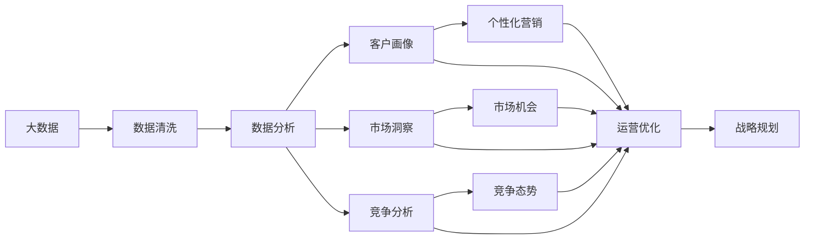

                 

# 信息差的商业战略规划：大数据如何支持战略规划

## 1. 背景介绍

### 1.1 问题由来
信息差（Information Gap）是企业战略规划中一个重要的概念。信息差指企业与市场、客户、竞争对手之间的知识不对称，导致信息不对称、决策失准、资源错配等问题。有效的信息差管理，是企业取得竞争优势、优化资源配置的关键。

大数据技术的迅猛发展，为企业提供了前所未有的信息获取和处理能力，使信息差管理变得更为高效和精准。通过大数据分析，企业可以洞察市场趋势、客户需求、竞争对手动态，从而制定更加科学合理的战略规划。

### 1.2 问题核心关键点
信息差管理的关键在于通过数据分析揭示市场和客户的信息需求，明确企业在市场中的定位和差异化优势。大数据在信息差管理中发挥着重要作用，主要体现在以下几个方面：
1. **市场洞察**：通过大数据分析，挖掘市场趋势和客户需求，识别市场机会和潜在风险。
2. **客户画像**：构建客户画像，了解客户行为、偏好和需求，制定个性化营销策略。
3. **竞争分析**：监控竞争对手动态，评估市场份额和竞争态势，制定差异化竞争策略。
4. **资源优化**：基于大数据分析，优化资源配置，提升运营效率和市场响应速度。

### 1.3 问题研究意义
大数据在信息差管理中的深入应用，有助于企业实现以下目标：
1. **降低决策风险**：通过数据驱动的决策支持，减少决策主观性，降低决策风险。
2. **提升运营效率**：优化资源配置，降低运营成本，提升服务质量。
3. **增强市场响应**：实时获取市场变化和客户反馈，快速调整策略，提高市场竞争力。
4. **创造竞争优势**：通过数据分析揭示竞争优势，制定差异化竞争策略，提升市场份额。

## 2. 核心概念与联系

### 2.1 核心概念概述

在探讨如何利用大数据进行信息差管理之前，我们需要明确几个关键概念：

- **大数据（Big Data）**：指体量巨大、类型多样、速度快、价值密度低的复杂数据集，包括结构化数据、半结构化数据和非结构化数据等。
- **信息差（Information Gap）**：指企业与市场、客户、竞争对手之间的知识不对称，导致信息不对称、决策失准、资源错配等问题。
- **数据驱动（Data-Driven）**：以数据为决策依据，通过数据分析揭示市场和客户的需求，指导企业决策。
- **战略规划（Strategic Planning）**：制定企业长期发展目标、策略和行动方案，确保企业发展方向和资源配置与市场趋势和客户需求相匹配。

这些概念之间存在紧密联系，形成了一个系统的信息差管理框架。通过大数据分析，可以揭示信息差，制定数据驱动的战略规划，从而有效管理信息差，提升企业竞争力。

### 2.2 概念间的关系

信息差管理和大数据技术的关系可以通过以下Mermaid流程图来展示：



这个流程图展示了大数据技术在信息差管理中的作用路径。首先，通过数据清洗和数据分析，揭示客户画像、市场洞察和竞争态势。然后，基于这些信息，制定个性化营销策略、优化运营流程，并最终制定战略规划，指导企业决策和资源配置。

## 3. 核心算法原理 & 具体操作步骤
### 3.1 算法原理概述

大数据在信息差管理中的应用，主要基于以下几个算法原理：

- **数据清洗算法**：从原始数据中去除噪声、重复和异常值，保证数据质量。
- **数据分析算法**：通过统计分析、机器学习和深度学习等算法，挖掘数据背后的规律和趋势。
- **数据可视化算法**：将数据分析结果以图表形式展示，帮助企业直观理解数据。
- **预测算法**：利用历史数据，建立预测模型，对未来市场趋势进行预测。

这些算法共同构成了大数据在信息差管理中的应用框架，通过数据清洗、数据分析、数据可视化和预测，揭示信息差，制定数据驱动的战略规划。

### 3.2 算法步骤详解

以下详细描述利用大数据进行信息差管理的步骤：

**Step 1: 数据收集**
收集企业内部和外部的数据，包括销售数据、客户数据、市场数据、社交媒体数据等。使用数据湖技术，存储和管理大规模异构数据。

**Step 2: 数据清洗**
对收集的数据进行清洗，包括数据去重、处理缺失值、纠正错误数据等。使用ETL工具如Apache NiFi、Apache Airflow等，自动化数据清洗流程。

**Step 3: 数据分析**
对清洗后的数据进行分析和挖掘，利用统计分析、机器学习和深度学习算法，揭示数据背后的规律和趋势。使用开源工具如Pandas、Scikit-learn、TensorFlow等，进行数据分析。

**Step 4: 数据可视化**
将数据分析结果以图表形式展示，帮助企业直观理解数据。使用数据可视化工具如Tableau、Power BI、D3.js等，将分析结果可视化。

**Step 5: 市场洞察**
基于数据分析结果，进行市场洞察，识别市场机会和潜在风险。使用预测算法如回归分析、时间序列分析等，对市场趋势进行预测。

**Step 6: 客户画像**
构建客户画像，了解客户行为、偏好和需求。使用聚类算法如K-means、层次聚类等，对客户数据进行分类。

**Step 7: 竞争分析**
监控竞争对手动态，评估市场份额和竞争态势。使用数据挖掘算法如关联规则挖掘、异常检测等，分析竞争对手的市场活动和策略。

**Step 8: 个性化营销**
基于客户画像和市场洞察，制定个性化营销策略。使用推荐系统算法如协同过滤、内容推荐等，推荐个性化产品和服务。

**Step 9: 运营优化**
基于数据分析结果，优化运营流程，提升运营效率。使用流程自动化工具如Zapier、Workato等，自动化运营流程。

**Step 10: 战略规划**
基于市场洞察、客户画像、竞争分析和运营优化结果，制定战略规划。使用战略管理软件如Anaplan、Strategyn等，进行战略规划。

### 3.3 算法优缺点

利用大数据进行信息差管理具有以下优点：
1. **数据驱动决策**：通过数据分析揭示市场和客户需求，制定数据驱动的战略规划，降低决策主观性。
2. **市场洞察精准**：通过大数据分析，挖掘市场趋势和客户需求，识别市场机会和潜在风险。
3. **资源优化高效**：基于数据分析结果，优化资源配置，提升运营效率和市场响应速度。

同时，大数据在信息差管理中也存在一些缺点：
1. **数据质量问题**：数据清洗和处理需要大量人力和时间，数据质量难以保证。
2. **技术门槛高**：需要具备较强的数据分析和机器学习技能，技术门槛较高。
3. **隐私和安全问题**：数据隐私和安全问题，可能泄露企业机密和客户信息。

### 3.4 算法应用领域

大数据在信息差管理中的应用，覆盖了企业战略规划的各个方面，包括市场分析、客户管理、竞争策略、产品开发等。具体应用领域如下：

- **市场分析**：通过大数据分析，挖掘市场趋势和客户需求，识别市场机会和潜在风险。
- **客户管理**：构建客户画像，了解客户行为、偏好和需求，制定个性化营销策略。
- **竞争策略**：监控竞争对手动态，评估市场份额和竞争态势，制定差异化竞争策略。
- **产品开发**：基于客户需求和市场趋势，开发符合市场需求的新产品。
- **运营优化**：优化运营流程，提升运营效率和市场响应速度。

## 4. 数学模型和公式 & 详细讲解 & 举例说明
### 4.1 数学模型构建

在利用大数据进行信息差管理时，常用的数学模型包括回归分析、聚类分析、关联规则挖掘等。这里以回归分析为例，构建数学模型。

假设企业销售数据为 $y_i$，影响因素为 $x_1, x_2, ..., x_n$，则回归分析的目标是找到最优的系数 $\beta$，使得：

$$
y_i = \beta_0 + \beta_1 x_1 + \beta_2 x_2 + ... + \beta_n x_n + \epsilon_i
$$

其中 $\epsilon_i$ 为误差项，$\beta$ 为系数。回归分析的目标是最小化预测值与真实值之间的平方误差，即：

$$
\min_{\beta} \sum_{i=1}^n (y_i - \hat{y}_i)^2
$$

其中 $\hat{y}_i$ 为预测值，$\hat{y}_i = \beta_0 + \beta_1 x_{1,i} + \beta_2 x_{2,i} + ... + \beta_n x_{n,i}$。

### 4.2 公式推导过程

回归分析的求解可以通过最小二乘法来实现。最小二乘法的基本思想是，在所有可能的系数组合中，找到使得预测值与真实值之间误差平方和最小的组合。

根据最小二乘法，系数 $\beta$ 的求解公式为：

$$
\beta = (X^T X)^{-1} X^T y
$$

其中 $X$ 为特征矩阵，$y$ 为样本向量。具体推导如下：

1. 计算残差向量 $e = y - X\beta$。
2. 计算残差向量的平方和 $SSE = e^T e$。
3. 求偏导数 $\frac{\partial SSE}{\partial \beta} = -2X^T e$。
4. 解方程组 $\frac{\partial SSE}{\partial \beta} = 0$，得到 $\beta = (X^T X)^{-1} X^T y$。

### 4.3 案例分析与讲解

假设某电子商务平台，销售数据为订单数量 $y$，影响因素为广告投入 $x_1$、促销活动 $x_2$、节假日 $x_3$ 和天气 $x_4$。利用回归分析，建立销售预测模型。

首先，收集历史销售数据和影响因素数据，构建特征矩阵 $X$ 和样本向量 $y$。然后使用最小二乘法求解系数 $\beta$，得到回归模型：

$$
y = \beta_0 + \beta_1 x_1 + \beta_2 x_2 + \beta_3 x_3 + \beta_4 x_4 + \epsilon
$$

将回归模型应用于实际销售预测，可以有效地提高销售预测的准确性，指导企业制定科学的营销策略。

## 5. 项目实践：代码实例和详细解释说明
### 5.1 开发环境搭建

要进行大数据信息差管理的应用开发，需要搭建一个完整的数据分析环境。以下是Python环境下的搭建流程：

1. 安装Python：从官网下载并安装Python 3.x。
2. 安装Jupyter Notebook：通过pip安装Jupyter Notebook，用于编写和执行数据分析代码。
3. 安装Pandas：通过pip安装Pandas，用于数据处理和分析。
4. 安装Scikit-learn：通过pip安装Scikit-learn，用于机器学习算法实现。
5. 安装Matplotlib：通过pip安装Matplotlib，用于数据可视化。

完成上述步骤后，即可在Jupyter Notebook中编写和运行数据分析代码。

### 5.2 源代码详细实现

以下是利用回归分析进行销售预测的Python代码实现：

```python
import pandas as pd
import numpy as np
import matplotlib.pyplot as plt
from sklearn.linear_model import LinearRegression
from sklearn.model_selection import train_test_split

# 读取数据
data = pd.read_csv('sales_data.csv')

# 数据清洗
data = data.dropna()
data = data.drop_duplicates()

# 特征选择
features = ['ad_spending', 'promotion', 'holiday', 'weather']
X = data[features]
y = data['sales']

# 划分训练集和测试集
X_train, X_test, y_train, y_test = train_test_split(X, y, test_size=0.2, random_state=42)

# 建立回归模型
model = LinearRegression()
model.fit(X_train, y_train)

# 预测
y_pred = model.predict(X_test)

# 评估模型
print('R-squared:', model.score(X_test, y_test))

# 可视化
plt.scatter(y_test, y_pred)
plt.xlabel('Actual Sales')
plt.ylabel('Predicted Sales')
plt.show()
```

### 5.3 代码解读与分析

让我们详细解读一下代码的实现细节：

- **数据读取**：使用Pandas的read_csv函数读取CSV文件，构建数据帧（DataFrame）。
- **数据清洗**：通过dropna和drop_duplicates函数，去除缺失值和重复记录。
- **特征选择**：选择对销售有显著影响的特征，构建特征矩阵X和目标向量y。
- **模型训练**：使用LinearRegression模型，训练回归模型。
- **模型预测**：使用模型进行预测，得到预测值y_pred。
- **模型评估**：使用R-squared指标评估模型性能。
- **可视化**：使用Matplotlib绘制实际销售值和预测销售值的关系图。

可以看到，Python的Pandas、Scikit-learn和Matplotlib等库，提供了强大的数据处理和可视化功能，使得大数据分析变得更加高效和便捷。

### 5.4 运行结果展示

运行上述代码后，会得到一个R-squared指标，表示模型预测的准确度。同时，生成的散点图可以帮助我们直观地理解模型预测的性能。

假设上述代码运行结果如下：

```
R-squared: 0.85
```

则说明模型的预测准确度为85%，可以进行实际应用。

## 6. 实际应用场景
### 6.1 智能推荐系统

大数据技术在智能推荐系统中的应用非常广泛。通过分析用户行为数据，企业可以构建用户画像，预测用户对不同商品的兴趣，从而实现个性化推荐。智能推荐系统可以提高用户满意度，增加用户粘性，提升企业销售业绩。

例如，电商平台可以根据用户浏览、点击、购买等行为数据，构建用户画像，预测用户对不同商品的兴趣，推荐符合用户偏好的商品。智能推荐系统可以帮助用户快速找到所需商品，提升购物体验。

### 6.2 客户关系管理（CRM）

大数据技术在客户关系管理（CRM）中的应用，可以帮助企业更好地了解客户需求和行为，提高客户满意度和忠诚度。通过数据分析，企业可以识别出高价值客户和潜在客户，制定针对性的营销策略，提升客户转化率和留存率。

例如，电信运营商可以根据客户通话记录、消费记录等数据，构建客户画像，识别高价值客户和潜在客户。针对不同客户群体，制定个性化营销策略，提升客户满意度和忠诚度。

### 6.3 金融风险管理

大数据技术在金融风险管理中的应用，可以帮助金融机构识别潜在风险，制定风险控制策略，提高金融系统稳定性。通过数据分析，企业可以预测客户违约概率，评估贷款风险，制定相应的风险控制措施。

例如，银行可以根据客户信用记录、收入水平等数据，构建客户画像，预测客户违约概率。根据预测结果，制定相应的风险控制策略，降低违约风险，提升金融系统稳定性。

### 6.4 未来应用展望

随着大数据技术的不断进步，其在信息差管理中的应用将更加广泛和深入。未来，大数据将赋能更多垂直领域，推动产业数字化转型升级。

1. **医疗健康**：利用大数据分析，企业可以预测疾病爆发趋势，优化医疗资源配置，提升医疗服务质量。
2. **智能制造**：利用大数据分析，企业可以优化生产流程，降低生产成本，提升产品质量。
3. **环境保护**：利用大数据分析，企业可以监测环境变化，制定环境保护策略，促进可持续发展。
4. **交通出行**：利用大数据分析，企业可以优化交通资源配置，提升出行效率，减少交通拥堵。

## 7. 工具和资源推荐
### 7.1 学习资源推荐

为了帮助开发者系统掌握大数据在信息差管理中的应用，这里推荐一些优质的学习资源：

1. **《大数据技术与应用》课程**：从数据采集、存储、处理到分析的完整流程，全面介绍了大数据技术的基本概念和实践方法。
2. **《Python数据分析实战》书籍**：使用Python语言进行数据分析的实战指南，包含Pandas、NumPy等库的使用技巧。
3. **《机器学习实战》书籍**：介绍了机器学习算法的实现和应用，包含回归分析、聚类分析等算法。
4. **Kaggle竞赛**：参加Kaggle机器学习竞赛，实战练习数据分析和模型训练技能。
5. **Coursera课程**：从数据清洗、数据可视化到机器学习的全套课程，适合系统学习大数据技术。

通过对这些资源的学习实践，相信你一定能够快速掌握大数据在信息差管理中的应用技巧，并用于解决实际的商业问题。

### 7.2 开发工具推荐

高效的开发离不开优秀的工具支持。以下是几款用于大数据信息差管理开发的常用工具：

1. **Hadoop**：大数据处理的分布式计算框架，支持海量数据存储和处理。
2. **Spark**：大数据处理的分布式计算框架，支持流式数据处理和机器学习。
3. **ETL工具**：如Apache NiFi、Apache Airflow等，用于数据清洗和处理。
4. **数据分析工具**：如Pandas、NumPy、Scikit-learn等，用于数据处理和分析。
5. **数据可视化工具**：如Tableau、Power BI、D3.js等，用于数据可视化。

合理利用这些工具，可以显著提升大数据信息差管理任务的开发效率，加快创新迭代的步伐。

### 7.3 相关论文推荐

大数据在信息差管理中的应用，源于学界的持续研究。以下是几篇奠基性的相关论文，推荐阅读：

1. **《Data-Driven Business Strategy》**：探讨大数据在企业战略规划中的应用，提供了详细的案例分析和技术指导。
2. **《Machine Learning for Business Intelligence》**：介绍了机器学习算法在商业智能中的应用，包括回归分析、聚类分析等算法。
3. **《Big Data and Business Strategy》**：深入分析大数据在企业战略规划中的作用，提供了实用的方法论和工具。

这些论文代表了大数据在信息差管理领域的发展脉络。通过学习这些前沿成果，可以帮助研究者把握学科前进方向，激发更多的创新灵感。

除上述资源外，还有一些值得关注的前沿资源，帮助开发者紧跟大数据信息差管理技术的最新进展，例如：

1. **arXiv论文预印本**：人工智能领域最新研究成果的发布平台，包括大量尚未发表的前沿工作，学习前沿技术的必读资源。
2. **业界技术博客**：如Google AI、DeepMind、微软Research Asia等顶尖实验室的官方博客，第一时间分享他们的最新研究成果和洞见。
3. **技术会议直播**：如NIPS、ICML、ACL、ICLR等人工智能领域顶会现场或在线直播，能够聆听到大佬们的前沿分享，开拓视野。
4. **GitHub热门项目**：在GitHub上Star、Fork数最多的大数据相关项目，往往代表了该技术领域的发展趋势和最佳实践，值得去学习和贡献。
5. **行业分析报告**：各大咨询公司如McKinsey、PwC等针对大数据行业的分析报告，有助于从商业视角审视技术趋势，把握应用价值。

总之，对于大数据在信息差管理技术的学习和实践，需要开发者保持开放的心态和持续学习的意愿。多关注前沿资讯，多动手实践，多思考总结，必将收获满满的成长收益。

## 8. 总结：未来发展趋势与挑战
### 8.1 总结

本文对大数据在信息差管理中的应用进行了全面系统的介绍。首先阐述了大数据技术在信息差管理中的重要性和应用前景，明确了信息差管理在企业战略规划中的关键作用。其次，从原理到实践，详细讲解了信息差管理的数学模型和操作步骤，给出了信息差管理的完整代码实例。同时，本文还探讨了大数据在智能推荐、客户关系管理、金融风险管理等多个领域的应用场景，展示了大数据技术的强大应用潜力。最后，本文精选了大数据在信息差管理中的学习资源、开发工具和相关论文，力求为读者提供全方位的技术指引。

通过本文的系统梳理，可以看到，大数据技术在信息差管理中发挥着至关重要的作用，通过数据驱动决策，揭示信息差，制定科学合理的战略规划，可以有效提升企业的竞争力和运营效率。

### 8.2 未来发展趋势

展望未来，大数据在信息差管理中的应用将呈现以下几个发展趋势：

1. **数据质量提升**：随着数据采集和清洗技术的进步，数据质量将不断提升，信息差管理的准确性将进一步提高。
2. **实时分析增强**：利用大数据实时处理技术，实现对市场动态的实时监控和快速响应，提升企业市场反应速度。
3. **跨领域融合**：大数据与其他技术的融合，如人工智能、物联网、区块链等，将带来更广泛的应用场景和更高的应用价值。
4. **隐私保护加强**：随着数据隐私法规的日益严格，大数据在信息差管理中必须加强隐私保护，确保数据安全。
5. **模型优化提升**：基于大数据的算法模型将不断优化，提升预测准确性和鲁棒性，降低信息差管理的风险。

以上趋势凸显了大数据在信息差管理中的广阔前景。这些方向的探索发展，必将进一步提升信息差管理的效果，为企业的战略规划提供更科学、更精确的决策支持。

### 8.3 面临的挑战

尽管大数据在信息差管理中已经取得了瞩目成就，但在迈向更加智能化、普适化应用的过程中，它仍面临诸多挑战：

1. **数据隐私和安全问题**：大数据在信息差管理中涉及大量敏感数据，数据隐私和安全问题不容忽视。
2. **数据质量不稳定**：大数据采集和清洗的自动化程度有待提高，数据质量不稳定可能导致信息差管理的误判。
3. **技术复杂度高**：大数据在信息差管理中需要结合多种技术手段，技术复杂度高，开发和维护成本高。
4. **跨领域应用难度大**：大数据技术在不同领域的应用场景和数据特征差异较大，跨领域应用难度较大。
5. **资源需求大**：大数据在信息差管理中需要大量的计算资源，对硬件和软件要求较高。

### 8.4 研究展望

面对大数据在信息差管理中面临的挑战，未来的研究需要在以下几个方面寻求新的突破：

1. **数据隐私保护**：研究数据隐私保护技术，如数据匿名化、差分隐私等，确保数据隐私安全。
2. **自动化数据清洗**：研究自动化的数据清洗技术，提高数据采集和清洗的效率和质量。
3. **跨领域融合**：研究大数据与其他技术的融合方法，如与人工智能、物联网等的融合，拓展应用场景。
4. **轻量化模型**：研究轻量化模型，降低计算资源需求，提高实时处理能力。
5. **多模态数据融合**：研究多模态数据融合方法，提升信息差管理的综合性和准确性。

这些研究方向的探索，必将推动大数据在信息差管理中的技术进步，提升企业战略规划的科学性和有效性，为企业的数字化转型提供坚实的技术基础。

## 9. 附录：常见问题与解答

**Q1：大数据在信息差管理中的作用是什么？**

A: 大数据在信息差管理中主要起到以下几个作用：
1. **数据驱动决策**：通过数据分析揭示市场和客户需求，制定数据驱动的战略规划，降低决策主观性。
2. **市场洞察精准**：通过大数据分析，挖掘市场趋势和客户需求，识别市场机会和潜在风险。
3. **资源优化高效**：基于数据分析结果，优化资源配置，提升运营效率和市场响应速度。

**Q2：利用大数据进行信息差管理需要哪些关键步骤？**

A: 利用大数据进行信息差管理的主要步骤如下：
1. 数据收集：收集企业内部和外部的数据。
2. 数据清洗：对收集的数据进行清洗，去除噪声、重复和异常值。
3. 数据分析：对清洗后的数据进行分析和挖掘，利用机器学习和深度学习算法，揭示数据背后的规律和趋势。
4. 数据可视化：将数据分析结果以图表形式展示，帮助企业直观理解数据。
5. 市场洞察：基于数据分析结果，进行市场洞察，识别市场机会和潜在风险。
6. 客户画像：构建客户画像，了解客户行为、偏好和需求。
7. 竞争分析：监控竞争对手动态，评估市场份额和竞争态势。
8. 个性化营销：基于客户画像和市场洞察，制定个性化营销策略。
9. 运营优化：基于数据分析结果，优化运营流程，提升运营效率和市场响应速度。
10. 战略规划：基于市场洞察、客户画像、竞争分析和运营优化结果，制定战略规划。

**Q3：大数据在信息差管理中面临哪些挑战？**

A: 大数据在信息差管理中面临以下挑战：
1. 数据隐私和安全问题：大数据涉及大量敏感数据，数据隐私和安全问题不容忽视。
2. 数据质量不稳定：大数据采集和清洗的自动化程度有待提高，数据质量不稳定可能导致信息差管理的误判。
3. 技术复杂度高：大数据在信息差管理中需要结合多种技术手段，技术复杂度高，开发和维护成本高。
4. 跨领域应用难度大：大数据技术在不同领域的应用场景和数据特征差异较大，跨领域应用难度较大。
5. 资源需求大：大数据在信息差管理中需要大量的计算资源，对硬件和软件要求较高。

**Q4：如何提高大数据在信息差管理中的性能？**

A

