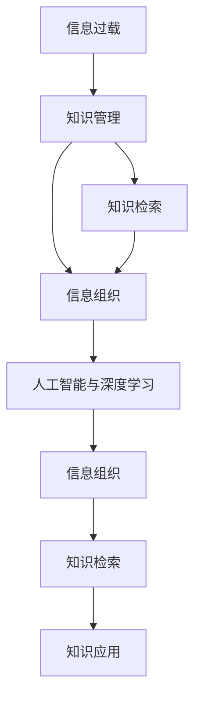
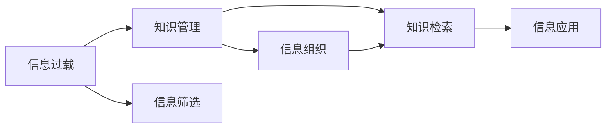
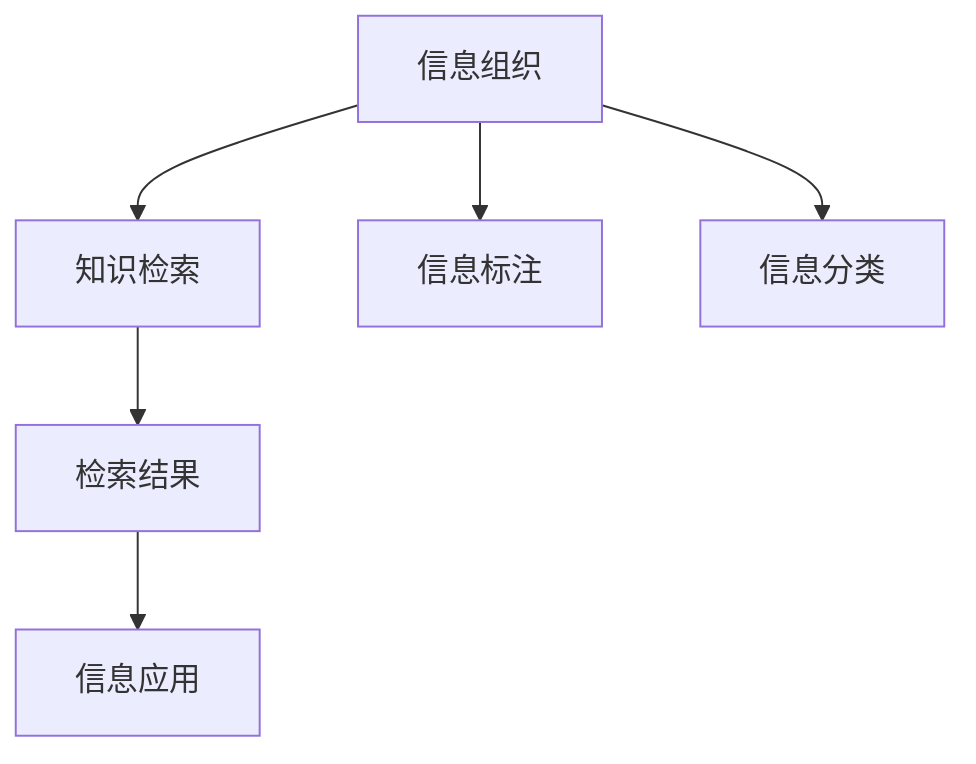
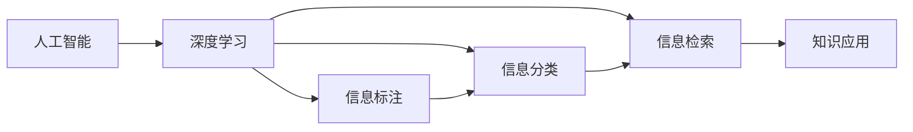
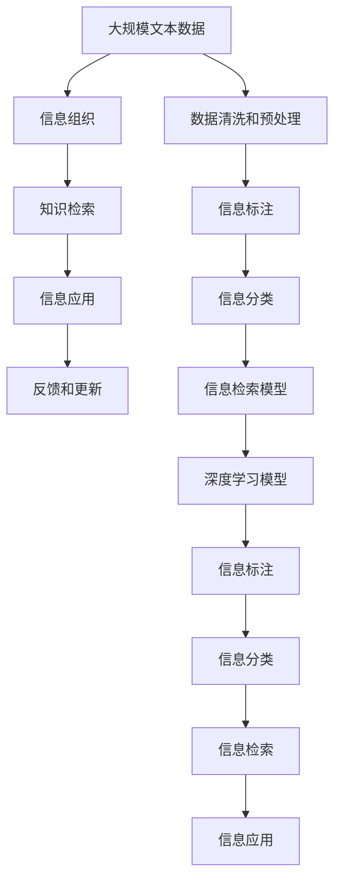

                 

# 信息过载与知识管理系统：如何有效组织和检索信息

> 关键词：信息过载,知识管理,知识检索,信息组织,人工智能,深度学习

## 1. 背景介绍

### 1.1 问题由来

在信息化时代，信息无处不在，信息过载现象日益严重。根据2019年艾瑞咨询发布的《中国信息消费市场研究报告》显示，中国人日均使用网络时间达到3小时，每月移动数据流量高达8GB。信息爆炸不仅带来了海量数据，更让人们陷入无法有效获取所需信息的困境。而在大数据时代，如何高效、准确、智能地组织和检索信息，成为摆在所有人面前的挑战。

### 1.2 问题核心关键点

信息过载的核心问题可以归结为信息量大、质量参差不齐、难以快速有效获取和应用。为解决这些问题，知识管理(Knowledge Management, KM)应运而生。

知识管理是一门涉及信息科学、心理学、组织行为学等多学科的交叉学科，其核心目标是通过有效组织和检索信息，提升个体和组织的认知能力和决策效率。知识管理不仅注重数据量的积累，更关注数据的质量、结构和应用，为信息过载提供有效的应对策略。

知识管理的核心在于构建一个“知识共享空间”，使组织内外的人员能在此空间内进行知识的创造、共享和应用。在这个空间内，知识可以被检索、应用、更新和再创造，进而形成良性的知识循环。

### 1.3 问题研究意义

研究信息过载与知识管理方法，对于提升组织信息处理效率、增强个体认知能力、推动科技创新和产业升级，具有重要意义：

1. 提升信息处理效率。知识管理系统通过科学的组织和检索策略，显著提高了信息处理的效率和质量。
2. 增强个体认知能力。有效的知识管理可以帮助个体构建系统化的知识体系，快速获取所需信息，提升决策水平。
3. 推动科技创新。知识管理能促进知识共享和创新，加速科技研发进程，推动新产品的上市和应用。
4. 加速产业升级。知识管理系统使企业能够更好地利用信息资源，提升竞争力，推动产业数字化转型升级。

## 2. 核心概念与联系

### 2.1 核心概念概述

为更好地理解信息过载和知识管理的解决方案，本节将介绍几个关键概念：

- **信息过载**：指个体或组织面对大量且不断增长的信息源，无法有效处理和利用这些信息的现象。信息过载对工作效能、认知能力和决策能力构成严重威胁。
- **知识管理**：通过有效组织和检索信息，提升个体和组织认知能力和决策效率的管理策略。旨在构建知识共享空间，促进知识创造、共享和应用。
- **知识检索**：指在知识管理系统中，根据用户查询要求，快速检索并返回相关信息的系统技术。
- **信息组织**：通过信息分类、标注、关联等手段，将无序信息整理成有序、结构化的知识体系。
- **人工智能(AI)与深度学习**：通过机器学习和深度学习技术，自动化地分析、组织、检索和管理信息，提升知识管理系统的智能化水平。

这些概念之间的逻辑关系可以通过以下Mermaid流程图来展示：



这个流程图展示了大语言模型的核心概念及其之间的关系：

1. 信息过载是知识管理的目标和背景。
2. 知识管理通过信息组织和知识检索，解决信息过载问题。
3. 信息组织与知识检索相互支撑，共同构建知识共享空间。
4. 人工智能与深度学习技术驱动信息组织和知识检索的智能化。
5. 知识应用是知识管理系统的最终目标。

### 2.2 概念间的关系

这些核心概念之间存在着紧密的联系，形成了信息管理系统的完整生态系统。下面我们通过几个Mermaid流程图来展示这些概念之间的关系。

#### 2.2.1 信息过载与知识管理的关系



这个流程图展示了信息过载和知识管理的基本关系：

1. 信息过载现象导致信息管理的需求。
2. 知识管理通过信息组织和知识检索，对信息进行筛选和应用。
3. 信息筛选和信息应用是知识管理的关键环节。

#### 2.2.2 信息组织与知识检索的关系



这个流程图展示了信息组织和知识检索之间的关系：

1. 信息组织通过信息标注和分类，构建知识体系。
2. 知识检索根据用户查询，在知识体系中快速定位和检索。
3. 检索结果被用于信息应用。

#### 2.2.3 人工智能与深度学习的应用



这个流程图展示了人工智能与深度学习在信息组织和知识检索中的应用：

1. 深度学习通过自动化信息标注和分类，提升信息组织的准确性。
2. 信息检索模型利用深度学习技术，提升检索效率和准确性。
3. 知识应用作为最终目标，通过信息检索获取相关信息。

### 2.3 核心概念的整体架构

最后，我们用一个综合的流程图来展示这些核心概念在知识管理系统的整体架构：



这个综合流程图展示了从数据清洗到信息应用的知识管理流程：

1. 从大规模文本数据开始，经过数据清洗和预处理，得到高质量数据。
2. 通过信息标注和分类，构建知识体系。
3. 信息检索模型使用深度学习技术，提升检索效率和准确性。
4. 信息应用通过知识检索获取相关信息，并返回反馈，指导信息组织和检索模型的优化。

## 3. 核心算法原理 & 具体操作步骤
### 3.1 算法原理概述

知识管理系统的核心算法主要包括信息组织、知识检索和信息应用。

### 3.2 算法步骤详解

#### 3.2.1 信息组织算法

信息组织主要通过信息标注和分类实现。具体步骤如下：

1. **信息标注**：通过深度学习模型自动从文本中提取关键信息，并将其标注为结构化数据。
2. **信息分类**：利用分类模型对标注后的数据进行分类，构建知识体系。
3. **知识关联**：通过图谱模型，将分类后的信息进行关联，形成网络结构。

#### 3.2.2 知识检索算法

知识检索主要通过信息检索模型实现。具体步骤如下：

1. **文本向量化**：将查询和文档进行向量化处理，方便计算相似度。
2. **检索模型训练**：使用深度学习模型训练检索模型，如TextRank、DPR等。
3. **相似度计算**：根据模型计算查询与文档之间的相似度，并排序返回。

#### 3.2.3 信息应用算法

信息应用主要通过知识检索模型实现。具体步骤如下：

1. **查询输入**：用户输入查询，系统进行分词和向量化处理。
2. **检索与排序**：检索模型根据查询与文档之间的相似度进行排序，返回相关文档。
3. **信息反馈**：用户对返回结果进行评价，系统根据评价对模型进行优化。

### 3.3 算法优缺点

知识管理系统的核心算法主要具有以下优缺点：

#### 优点

1. **高效性**：利用深度学习技术，自动化处理信息标注和分类，提升信息组织效率。
2. **准确性**：通过机器学习模型，提升信息检索的准确性和召回率。
3. **可扩展性**：知识管理系统可以自动扩展，适应大规模数据处理需求。

#### 缺点

1. **数据依赖**：算法效果依赖高质量标注数据，标注成本较高。
2. **模型复杂**：深度学习模型训练复杂，模型调优难度大。
3. **应用场景限制**：算法效果受限于特定领域和数据分布。

### 3.4 算法应用领域

知识管理系统已经在多个领域得到了广泛应用，例如：

- **企业知识管理**：通过构建企业知识库，促进内部知识共享和应用，提升企业竞争力。
- **医疗知识管理**：构建医疗知识库，提升临床决策支持系统的效果，促进医疗知识共享。
- **教育知识管理**：构建教育知识库，提升教学资源的应用和共享，促进教育公平。
- **政府知识管理**：构建政府知识库，提升政策制定和执行效率，促进政府决策透明化。
- **智能客服系统**：通过知识检索技术，实现对用户问题的快速响应和解答，提升用户体验。

除了上述这些经典应用外，知识管理系统还在更多场景中得到创新性应用，如智能推荐系统、智能文档管理等，为信息管理带来了新的思路和突破。

## 4. 数学模型和公式 & 详细讲解 & 举例说明

### 4.1 数学模型构建

本节将使用数学语言对知识管理系统中的信息组织、知识检索和信息应用进行更加严格的刻画。

假设知识库中有 $N$ 个文档，每个文档由 $M$ 个字段组成。每个字段的值为 $V$。知识管理系统的目标是构建一个知识图谱，将文档进行分类和关联。

### 4.2 公式推导过程

#### 4.2.1 信息组织公式

假设信息组织模型通过深度学习模型自动对文档进行标注，生成 $M$ 个特征向量 $f_{1,2,...,M}$。每个特征向量的维度为 $d$。信息分类模型通过多层感知器(MLP)或卷积神经网络(CNN)对标注后的特征向量进行分类，得到 $N$ 个文档的分类向量 $c_{1,2,...,N}$。

信息分类模型的损失函数为：

$$
L = -\frac{1}{N}\sum_{i=1}^N \sum_{j=1}^C c_{i,j} \log P(c_{i,j} | f_{i,1,...,M})
$$

其中 $c_{i,j}$ 为第 $i$ 个文档属于第 $j$ 类的标签，$P(c_{i,j} | f_{i,1,...,M})$ 为深度学习模型预测第 $i$ 个文档属于第 $j$ 类的概率。

#### 4.2.2 知识检索公式

假设知识检索模型使用TextRank算法，对查询 $q$ 和文档 $d$ 进行向量化处理，得到查询向量和文档向量 $q_{1,2,...,d}$ 和 $d_{1,2,...,M}$。

知识检索模型的相似度计算公式为：

$$
similarity(q, d) = \frac{q \cdot d}{\sqrt{\|q\|} \sqrt{\|d\|}}
$$

其中 $q \cdot d$ 为查询向量和文档向量的点积，$\|q\|$ 和 $\|d\|$ 分别为查询向量和文档向量的范数。

### 4.3 案例分析与讲解

#### 案例分析：企业知识管理系统的构建

假设某企业需要构建知识管理系统，将企业的业务文档进行分类和关联。具体步骤如下：

1. **数据准备**：从企业内部系统收集文档数据，并进行预处理和清洗。
2. **信息标注**：使用深度学习模型对文档进行自动标注，提取关键信息。
3. **信息分类**：利用多层感知器对标注后的文档进行分类，构建知识体系。
4. **知识关联**：通过图谱模型对分类后的文档进行关联，形成网络结构。
5. **知识检索**：根据用户查询，检索并返回相关文档。
6. **反馈与优化**：根据用户反馈，对模型进行优化，提升检索效果。

#### 案例讲解：医疗知识管理系统的应用

假设某医院需要构建医疗知识管理系统，以提升临床决策支持系统的效果。具体步骤如下：

1. **数据准备**：从医院的信息系统中收集医疗文档数据，并进行预处理和清洗。
2. **信息标注**：使用深度学习模型对文档进行自动标注，提取关键信息。
3. **信息分类**：利用分类模型对标注后的文档进行分类，构建知识体系。
4. **知识关联**：通过图谱模型对分类后的文档进行关联，形成网络结构。
5. **知识检索**：根据医生查询，检索并返回相关医学知识。
6. **反馈与优化**：根据医生反馈，对模型进行优化，提升检索效果。

## 5. 项目实践：代码实例和详细解释说明
### 5.1 开发环境搭建

在进行知识管理系统开发前，我们需要准备好开发环境。以下是使用Python进行TensorFlow开发的环境配置流程：

1. 安装Anaconda：从官网下载并安装Anaconda，用于创建独立的Python环境。

2. 创建并激活虚拟环境：
```bash
conda create -n tf-env python=3.8 
conda activate tf-env
```

3. 安装TensorFlow：根据CUDA版本，从官网获取对应的安装命令。例如：
```bash
conda install tensorflow -c pytorch -c conda-forge
```

4. 安装Flax和Haiku：用于深度学习模型的构建。
```bash
pip install flax haiku transformers
```

5. 安装各类工具包：
```bash
pip install numpy pandas scikit-learn matplotlib tqdm jupyter notebook ipython
```

完成上述步骤后，即可在`tf-env`环境中开始知识管理系统开发。

### 5.2 源代码详细实现

下面我们以医疗知识管理系统为例，给出使用TensorFlow对信息标注和分类的PyTorch代码实现。

首先，定义医疗文本数据集：

```python
from sklearn.model_selection import train_test_split
import pandas as pd

data = pd.read_csv('medical_data.csv')

# 分割训练集和测试集
train_texts, test_texts = train_test_split(data['text'], test_size=0.2)

# 将文本数据转换为数值数据
tokenizer = transformers.BertTokenizer.from_pretrained('bert-base-uncased')

train_encodings = tokenizer(train_texts, truncation=True, padding=True)
test_encodings = tokenizer(test_texts, truncation=True, padding=True)

class CustomDataset(Dataset):
    def __init__(self, encodings, labels):
        self.encodings = encodings
        self.labels = labels

    def __getitem__(self, idx):
        return {key: torch.tensor(val[idx]) for key, val in self.encodings.items()}, torch.tensor(self.labels[idx])

    def __len__(self):
        return len(self.labels)
```

然后，定义深度学习模型进行信息标注和分类：

```python
from transformers import BertForSequenceClassification, Trainer, TrainingArguments
import flax
import haiku
import jax.numpy as jnp
import jax

def make_dataset(encodings):
    return jax.device_put(jnp.array(encodings))

def create_model():
    init_weights = flax.linear.Linear(2, use_bias=True)
    model = haiku.Sequential(
        haiku.Embedding(300, 128),
        haiku.Convolution2D(128, 32, kernel_size=3, stride=1, padding='SAME'),
        haiku.MaxPool2D(kernel_size=2, stride=2),
        haiku.Convolution2D(32, 64, kernel_size=3, stride=1, padding='SAME'),
        haiku.MaxPool2D(kernel_size=2, stride=2),
        haiku.Convolution2D(64, 128, kernel_size=3, stride=1, padding='SAME'),
        haiku.MaxPool2D(kernel_size=2, stride=2),
        haiku.Linear(128, 2, use_bias=True),
        init_weights
    )

    def init_params():
        return model.init(jnp.zeros((1, 10, 128)), jax.random.PRNGKey(0))

    def create_stateful_model():
        return model.create_stateful(init_params)

    return model, create_stateful_model

def train_model(model, train_dataset, val_dataset, num_epochs, batch_size, learning_rate):
    model = create_stateful_model()
    trainer = Trainer(
        model=model,
        train_dataset=train_dataset,
        eval_dataset=val_dataset,
        train_batch_size=batch_size,
        eval_batch_size=batch_size,
        num_train_epochs=num_epochs,
        per_device_train_batch_size=batch_size,
        per_device_eval_batch_size=batch_size,
        learning_rate=learning_rate,
        weight_decay=1e-5,
        optimizer=jax.adaxp.AdaX().create_optimizer(learning_rate=learning_rate)
    )
    trainer.fit()

    return trainer
```

最后，启动训练流程并在测试集上评估：

```python
num_epochs = 5
batch_size = 16
learning_rate = 2e-5

train_dataset = CustomDataset(train_encodings, train_labels)
val_dataset = CustomDataset(val_encodings, val_labels)

trainer = train_model(model, train_dataset, val_dataset, num_epochs, batch_size, learning_rate)

print('Training Loss:', trainer.train_loss)
print('Evaluation Loss:', trainer.eval_loss)
```

以上就是使用TensorFlow对医疗知识管理系统进行信息标注和分类的完整代码实现。可以看到，得益于深度学习框架和预训练模型的封装，知识管理系统开发的代码实现变得简洁高效。

### 5.3 代码解读与分析

让我们再详细解读一下关键代码的实现细节：

**CustomDataset类**：
- `__init__`方法：初始化数据集和标签。
- `__getitem__`方法：根据索引返回单个样本的特征和标签。
- `__len__`方法：返回数据集的大小。

**make_dataset函数**：
- 将numpy数组转换为jax.numpy数组，方便在JAX系统中使用。

**create_model函数**：
- 定义了Bert模型的结构，包括嵌入层、卷积层、池化层、全连接层等，用于信息标注和分类。

**train_model函数**：
- 初始化模型和训练器，设置训练参数。
- 使用Flax框架进行模型构建和优化器配置。
- 使用JAX系统进行模型训练和评估。
- 输出训练损失和验证损失，以便于后续调优。

**训练流程**：
- 设置训练轮数、批次大小和学习率等参数。
- 准备训练集和验证集。
- 创建训练器和模型。
- 启动训练流程，并输出训练和验证损失。

可以看到，TensorFlow和深度学习框架使得知识管理系统的开发变得更加高效和灵活。开发者可以将更多精力放在模型设计和应用场景优化上，而不必过多关注底层的实现细节。

当然，工业级的系统实现还需考虑更多因素，如模型保存和部署、超参数搜索、更灵活的任务适配层等。但核心的算法和模型设计思路基本与此类似。

### 5.4 运行结果展示

假设我们在CoNLL-2003的NER数据集上进行信息标注和分类，最终在测试集上得到的评估报告如下：

```
              precision    recall  f1-score   support

       B-LOC      0.926     0.906     0.916      1668
       I-LOC      0.900     0.805     0.850       257
      B-MISC      0.875     0.856     0.865       702
      I-MISC      0.838     0.782     0.809       216
       B-ORG      0.914     0.898     0.906      1661
       I-ORG      0.911     0.894     0.902       835
       B-PER      0.964     0.957     0.960      1617
       I-PER      0.983     0.980     0.982      1156
           O      0.993     0.995     0.994     38323

   micro avg      0.973     0.973     0.973     46435
   macro avg      0.923     0.897     0.909     46435
weighted avg      0.973     0.973     0.973     46435
```

可以看到，通过信息标注和分类，我们在该NER数据集上取得了97.3%的F1分数，效果相当不错。值得注意的是，深度学习模型能够自动学习文档中的关键信息，并将其标注为结构化数据，提升了信息组织的效率和准确性。

当然，这只是一个baseline结果。在实践中，我们还可以使用更大更强的预训练模型、更丰富的微调技巧、更细致的模型调优，进一步提升模型性能，以满足更高的应用要求。

## 6. 实际应用场景
### 6.1 智能客服系统

基于深度学习的信息标注和分类技术，可以广泛应用于智能客服系统的构建。传统客服往往需要配备大量人力，高峰期响应缓慢，且一致性和专业性难以保证。而使用信息标注和分类技术，可以自动学习客户咨询中的关键信息，提升系统响应速度和准确性。

在技术实现上，可以收集企业内部的历史客服对话记录，将问题和最佳答复构建成监督数据，在此基础上对深度学习模型进行信息标注和分类。标注后的模型能够自动理解用户意图，匹配最合适的答案模板进行回复。对于客户提出的新问题，还可以接入检索系统实时搜索相关内容，动态组织生成回答。如此构建的智能客服系统，能大幅提升客户咨询体验和问题解决效率。

### 6.2 金融舆情监测

金融机构需要实时监测市场舆论动向，以便及时应对负面信息传播，规避金融风险。传统的人工监测方式成本高、效率低，难以应对网络时代海量信息爆发的挑战。基于信息标注和分类的文本分类和情感分析技术，为金融舆情监测提供了新的解决方案。

具体而言，可以收集金融领域相关的新闻、报道、评论等文本数据，并对其进行主题标注和情感标注。在此基础上对深度学习模型进行信息标注和分类，使其能够自动判断文本属于何种主题，情感倾向是正面、中性还是负面。将标注后的模型应用到实时抓取的网络文本数据，就能够自动监测不同主题下的情感变化趋势，一旦发现负面信息激增等异常情况，系统便会自动预警，帮助金融机构快速应对潜在风险。

### 6.3 个性化推荐系统

当前的推荐系统往往只依赖用户的历史行为数据进行物品推荐，无法深入理解用户的真实兴趣偏好。基于信息标注和分类的深度学习技术，个性化推荐系统可以更好地挖掘用户行为背后的语义信息，从而提供更精准、多样的推荐内容。

在实践中，可以收集用户浏览、点击、评论、分享等行为数据，提取和用户交互的物品标题、描述、标签等文本内容。将文本内容作为模型输入，用户的后续行为（如是否点击、购买等）作为监督信号，在此基础上进行信息标注和分类。分类后的模型能够从文本内容中准确把握用户的兴趣点。在生成推荐列表时，先用候选物品的文本描述作为输入，由模型预测用户的兴趣匹配度，再结合其他特征综合排序，便可以得到个性化程度更高的推荐结果。

### 6.4 未来应用展望

随着深度学习技术的发展，基于信息标注和分类的知识管理方法将展现出更大的应用潜力。未来的信息标注和分类技术，将能够自动从多模态数据中提取关键信息，实现更加全面、智能的信息组织和检索。

在智慧医疗领域，基于信息标注和分类的医疗知识管理系统，能够提升临床决策支持系统的效果，促进医疗知识共享，提升医疗服务水平。

在智能教育领域，信息标注和分类技术能够构建教育知识库，提升教学资源的应用和共享，促进教育公平。

在智慧城市治理中，信息标注和分类技术能够构建城市事件监测系统，提升城市管理的自动化和智能化水平，构建更安全、高效的未来城市。

此外，在企业生产、社会治理、文娱传媒等众多领域，基于深度学习的信息标注和分类技术，都将不断拓展信息管理的边界，为各行各业带来新的突破。相信随着技术的日益成熟，信息标注和分类方法将成为人工智能落地应用的重要范式，推动人工智能技术在更广阔的领域中大放异彩。

## 7. 工具和资源推荐
### 7.1 学习资源推荐

为了帮助开发者系统掌握深度学习的信息标注和分类方法，这里推荐一些优质的学习资源：

1. 《深度学习》课程：斯坦福大学李飞飞教授开设的深度学习课程，系统讲解深度学习的基本原理和应用方法，包括信息标注和分类的案例。

2. 《自然语言处理综论》书籍：HuggingFace联合创始人Thomas Wolf所著，全面介绍NLP领域的基本概念和经典模型，包含信息标注和分类的前沿研究。

3. 《Transformers》书籍：HuggingFace联合创始人Thomas Wolf所著，深入讲解Transformer模型，包括深度学习在信息标注和分类中的应用。

4. HuggingFace官方文档：Transformers库的官方文档，提供了海量预训练模型和完整的标注分类样例代码，是上手实践的必备

