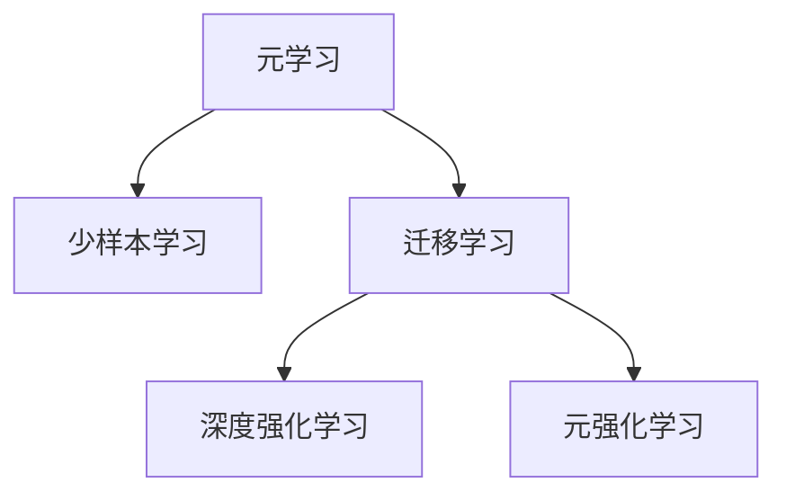
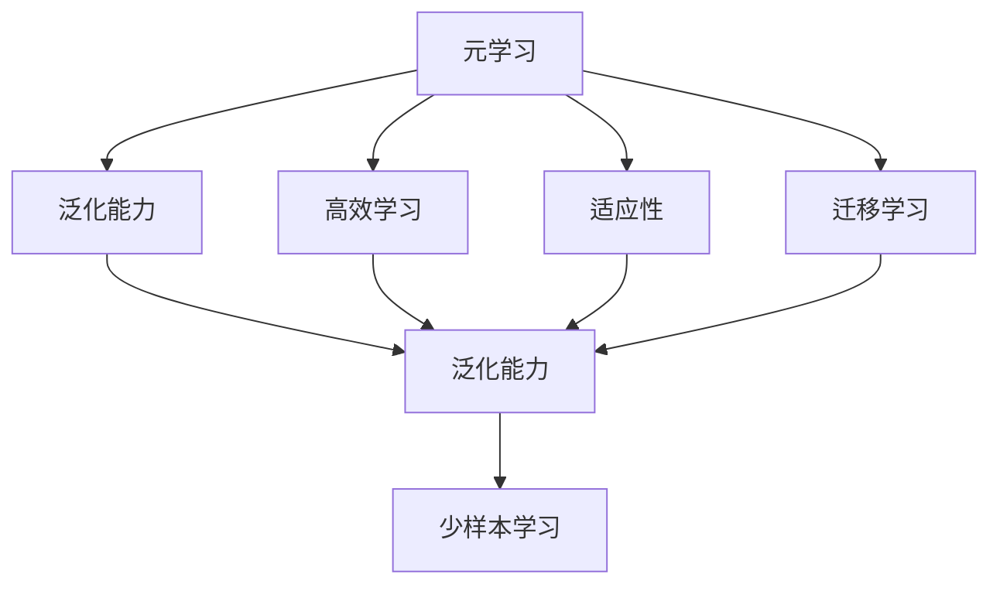
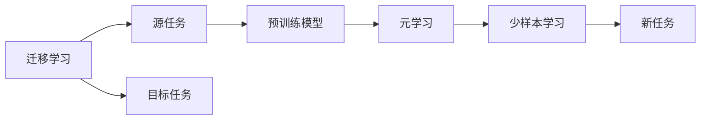
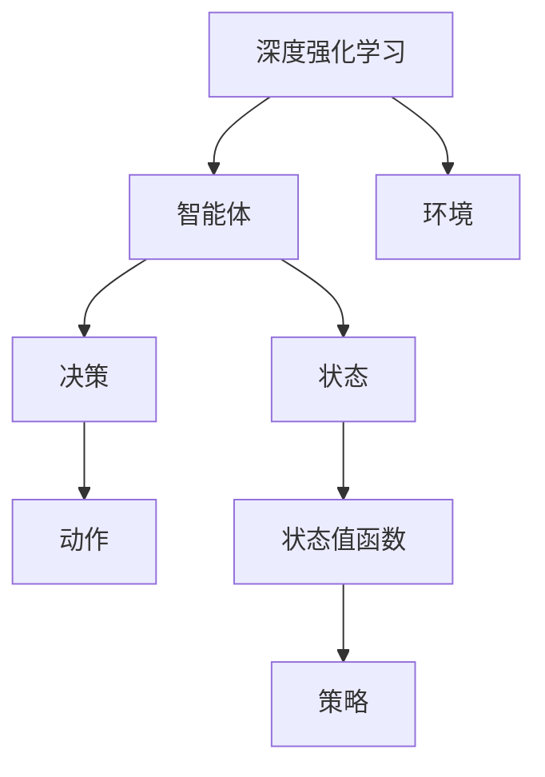
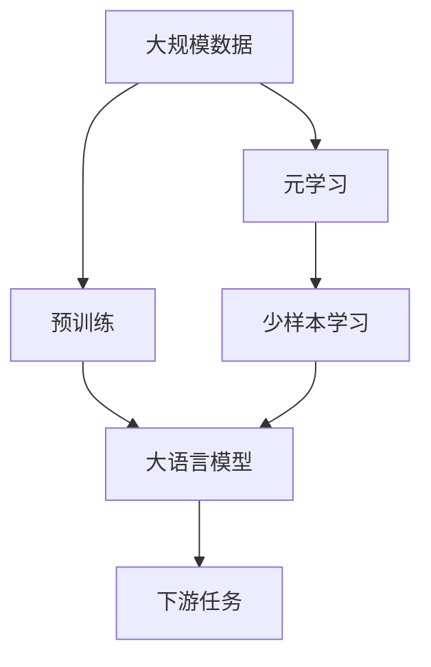

                 

# 元学习与少样本学习原理与代码实战案例讲解

> 关键词：元学习(Meta-Learning), 少样本学习(Few-Shot Learning), 机器学习算法, 代码实现, 案例分析

## 1. 背景介绍

### 1.1 问题由来
机器学习（Machine Learning, ML）和深度学习（Deep Learning, DL）技术在过去十年里取得了突破性的进展，广泛应用于图像识别、语音识别、自然语言处理等领域，为各行各业带来了巨大的变革。然而，传统的机器学习方法往往需要大量标注数据进行训练，这对于数据稀缺、标注昂贵的领域，如医疗、法律等，造成了很大的困扰。此外，对于新出现的、罕见的任务，传统的机器学习模型需要从头开始训练，耗时耗力，难以满足实际需求。

为了解决这些问题，元学习和少样本学习应运而生。元学习是指让模型学习如何快速适应新的任务，而少样本学习是指在少量标注数据下，如何高效地学习新任务。这些方法大大提高了模型的泛化能力，降低了对标注数据的依赖，有望进一步推动机器学习技术的普及和应用。

### 1.2 问题核心关键点
元学习和少样本学习的核心关键点在于：

1. **泛化能力**：模型在训练阶段能够学习到对新任务的泛化能力，以适应不同的数据分布。
2. **高效学习**：模型能够在少量标注数据下进行高效学习，避免过拟合，提高学习效率。
3. **适应性**：模型能够快速适应新出现的任务，而无需从头训练。
4. **迁移学习**：模型能够将从旧任务中学到的知识迁移到新任务上，实现知识复用。
5. **记忆能力**：模型能够从少量数据中学习并记住一些基本的知识，从而在新任务中快速提取和应用。

### 1.3 问题研究意义
元学习和少样本学习对于机器学习技术的应用和发展具有重要意义：

1. **降低标注成本**：显著减少了标注数据的需要，使得机器学习技术更容易落地应用。
2. **提高泛化性能**：提升了模型在未知数据上的表现，增加了其应用场景的灵活性。
3. **加速模型训练**：在少量数据下能够快速训练出高效的模型，提高了模型的迭代速度。
4. **实现知识复用**：通过迁移学习，将已有知识应用到新任务中，节省了重新训练的时间和计算资源。
5. **推动技术进步**：推动了机器学习、深度学习技术的进步和应用领域的拓展。

## 2. 核心概念与联系

### 2.1 核心概念概述

为更好地理解元学习和少样本学习的原理与实现，本节将介绍几个密切相关的核心概念：

- **元学习(Meta-Learning)**：元学习是一种学习如何学习（Learning How to Learn）的方法，旨在让模型学习如何快速适应新的任务。
- **少样本学习(Few-Shot Learning)**：少样本学习是指模型在只有少量标注数据的情况下，仍然能够高效地学习新任务。
- **迁移学习(Transfer Learning)**：迁移学习是指将一个领域学习到的知识迁移到另一个相关领域。
- **深度强化学习(Deep Reinforcement Learning)**：一种结合深度学习和强化学习的技术，用于训练智能体（agent）在复杂环境中的决策能力。
- **元强化学习(Meta Reinforcement Learning)**：一种结合元学习和强化学习的技术，用于训练智能体能够快速适应新环境的能力。

这些概念之间的逻辑关系可以通过以下Mermaid流程图来展示：



这个流程图展示了大语言模型的核心概念及其之间的关系：

1. 元学习是一种学习如何快速适应新任务的能力。
2. 少样本学习是指在少量标注数据下进行学习的能力。
3. 迁移学习是将已有知识应用于新任务的能力。
4. 深度强化学习是一种结合深度学习和强化学习的技术。
5. 元强化学习是结合元学习和强化学习的技术，用于训练智能体快速适应新环境的能力。

这些概念共同构成了元学习和少样本学习的学习框架，使其能够在大规模数据和复杂任务中发挥强大的学习能力。通过理解这些核心概念，我们可以更好地把握元学习和少样本学习的原理与实现。

### 2.2 概念间的关系

这些核心概念之间存在着紧密的联系，形成了元学习和少样本学习的完整生态系统。下面我通过几个Mermaid流程图来展示这些概念之间的关系。

#### 2.2.1 元学习与少样本学习的范式



这个流程图展示了元学习的核心原理，以及其与少样本学习、迁移学习的关系。元学习通过训练模型，使其具备泛化能力、高效学习和适应新任务的能力，从而在少量数据下也能高效学习。

#### 2.2.2 迁移学习与元学习的联系



这个流程图展示了迁移学习的基本原理，以及它与元学习、少样本学习的关系。迁移学习通过将源任务学到的知识迁移到目标任务，从而提高新任务的性能。而元学习则进一步提升了模型在目标任务上的适应能力。

#### 2.2.3 深度强化学习与元学习的关系



这个流程图展示了深度强化学习的核心原理，以及它与元学习的关系。深度强化学习通过训练智能体在复杂环境中的决策能力，而元学习则进一步提升了智能体在不同环境中的适应能力。

### 2.3 核心概念的整体架构

最后，我们用一个综合的流程图来展示这些核心概念在大语言模型元学习和少样本学习中的整体架构：



这个综合流程图展示了从预训练到元学习和少样本学习的完整过程。大语言模型首先在大规模数据上进行预训练，然后通过元学习过程学习如何快速适应新任务，再通过少样本学习过程，在少量数据下高效学习新任务，最终应用于下游任务。 通过这些流程图，我们可以更清晰地理解元学习和少样本学习的原理与实现。

## 3. 核心算法原理 & 具体操作步骤
### 3.1 算法原理概述

元学习和少样本学习本质上是一种通过训练模型学习如何快速适应新任务的技术。其核心思想是：在少量标注数据下，利用预训练模型的知识，通过元学习过程，调整模型参数，使得模型能够高效学习新任务。具体来说，可以分为以下几个步骤：

1. **预训练**：在大型无标签数据集上对模型进行预训练，学习通用的语言表示和知识。
2. **元学习**：在少量标注数据下对模型进行微调，调整模型参数，使其能够适应新任务。
3. **少样本学习**：在少量标注数据下对模型进行学习，提高模型在新任务上的泛化能力。
4. **迁移学习**：将预训练模型学到的知识迁移到新任务中，提高模型在新任务上的性能。

### 3.2 算法步骤详解

以下是对元学习和少样本学习的详细步骤详解：

**Step 1: 准备预训练模型和数据集**
- 选择合适的预训练语言模型 $M_{\theta}$ 作为初始化参数，如 BERT、GPT 等。
- 准备下游任务 $T$ 的标注数据集 $D=\{(x_i,y_i)\}_{i=1}^N$，划分为训练集、验证集和测试集。一般要求标注数据与预训练数据的分布不要差异过大。

**Step 2: 添加元学习目标**
- 在预训练模型的顶层设计一个元学习目标函数 $L_{meta}$，用于衡量模型在新任务上的适应能力。常见的元学习目标函数包括均方误差、交叉熵、最大化正确率等。
- 将元学习目标函数作为模型的损失函数，与下游任务的目标函数共同优化。

**Step 3: 设置元学习超参数**
- 选择合适的元学习算法及其参数，如随机梯度下降(SGD)、Adam、MAML等。
- 设置学习率、迭代轮数等超参数。

**Step 4: 执行元学习过程**
- 将元学习目标函数和下游任务的目标函数相加，得到新的损失函数。
- 在元学习过程中，使用元学习算法更新模型参数，最小化元学习损失函数和下游任务损失函数的总和。

**Step 5: 设置少样本学习超参数**
- 选择少样本学习算法，如余弦相似度、K近邻等。
- 设置少样本学习的参数，如邻居数量、距离阈值等。

**Step 6: 执行少样本学习过程**
- 在少样本学习过程中，使用少样本学习算法选择新任务中的示例，并计算其与训练集样本的距离。
- 根据距离选择最相似的训练集样本作为正例，进行模型微调。

**Step 7: 测试和部署**
- 在测试集上评估元学习后模型 $M_{\hat{\theta}}$ 的性能，对比元学习前后的精度提升。
- 使用元学习后的模型对新样本进行推理预测，集成到实际的应用系统中。
- 持续收集新的数据，定期重新元学习模型，以适应数据分布的变化。

以上是元学习和少样本学习的完整流程。在实际应用中，还需要针对具体任务的特点，对元学习过程的各个环节进行优化设计，如改进元学习目标函数，引入更多的正则化技术，搜索最优的超参数组合等，以进一步提升模型性能。

### 3.3 算法优缺点

元学习和少样本学习具有以下优点：
1. 泛化能力强。模型在少量标注数据下仍能取得不错的泛化能力，适用于数据稀缺的领域。
2. 训练时间短。元学习过程能够快速适应新任务，训练时间较短。
3. 知识复用。通过迁移学习，将已有知识应用到新任务中，节省了重新训练的时间和计算资源。

同时，元学习和少样本学习也存在一些局限性：
1. 数据分布假设。元学习和少样本学习依赖于数据分布假设，对于数据分布变化较大的任务，效果可能不佳。
2. 模型鲁棒性。元学习模型的鲁棒性可能不如从头训练的模型，对于复杂的任务，可能存在过拟合风险。
3. 任务差异。元学习和少样本学习的效果很大程度上依赖于任务的相似性，对于差异较大的任务，效果可能较差。

尽管存在这些局限性，但就目前而言，元学习和少样本学习仍是解决数据稀缺问题的重要手段。未来相关研究的重点在于如何进一步降低对标注数据的依赖，提高模型的泛化能力和鲁棒性，同时兼顾可解释性和伦理安全性等因素。

### 3.4 算法应用领域

元学习和少样本学习已经在多个领域得到了应用，包括：

- 自然语言处理（NLP）：如问答系统、文本分类、情感分析等，通过元学习和少样本学习，提高模型的泛化能力。
- 计算机视觉（CV）：如目标检测、图像分类等，通过迁移学习将预训练知识应用于新任务。
- 强化学习（RL）：如智能游戏、机器人控制等，通过元强化学习提高智能体在不同环境中的适应能力。
- 自动驾驶：如自动驾驶系统中的决策模型，通过元学习提高在不同场景中的决策能力。
- 医疗诊断：如疾病预测模型，通过元学习和少样本学习，提高模型的泛化能力。

除了上述这些经典应用外，元学习和少样本学习还被创新性地应用到更多场景中，如多模态学习、无监督学习等，为人工智能技术带来了全新的突破。

## 4. 数学模型和公式 & 详细讲解  
### 4.1 数学模型构建

本节将使用数学语言对元学习和少样本学习的原理进行更加严格的刻画。

记预训练语言模型为 $M_{\theta}$，其中 $\theta$ 为预训练得到的模型参数。假设元学习任务 $T$ 的训练集为 $D=\{(x_i,y_i)\}_{i=1}^N$，其中 $x_i$ 为输入，$y_i$ 为元学习目标。

定义元学习目标函数 $L_{meta}$ 为：

$$
L_{meta}(\theta) = \mathop{\arg\min}_{\theta} \sum_{i=1}^N L_{task}(x_i,y_i)
$$

其中 $L_{task}$ 为下游任务的目标函数，可以是交叉熵损失、均方误差等。

在元学习过程中，我们希望最小化元学习目标函数 $L_{meta}$，同时满足下游任务的目标函数 $L_{task}$。因此，元学习过程的目标是：

$$
\theta^* = \mathop{\arg\min}_{\theta} \max_{\Delta\theta} L_{meta}(\theta+\Delta\theta)
$$

其中 $\Delta\theta$ 为模型参数的扰动，表示模型的微调量。

在实际应用中，元学习过程通常通过迭代的方式进行，即：

1. 对于每个新任务 $T$，在训练集 $D$ 上随机选择一个样本 $(x,y)$。
2. 计算模型 $M_{\theta}$ 在样本 $(x,y)$ 上的目标函数 $L_{task}(x,y)$。
3. 对模型 $M_{\theta}$ 进行微调，使得 $L_{task}(x,y)$ 最小化。
4. 计算模型 $M_{\theta}$ 在新任务 $T$ 上的泛化能力，如精度、召回率等。
5. 更新模型参数 $\theta$，使得元学习目标函数 $L_{meta}$ 最小化。

### 4.2 公式推导过程

以下是对元学习和少样本学习数学模型的详细推导：

**Step 1: 元学习目标函数的构建**
在元学习过程中，目标函数 $L_{meta}$ 通常由两部分组成：元学习目标函数和下游任务的目标函数。即：

$$
L_{meta}(\theta) = L_{el}(\theta) + \lambda L_{task}(\theta)
$$

其中 $L_{el}$ 为元学习目标函数，$L_{task}$ 为下游任务的目标函数，$\lambda$ 为权衡因子。

**Step 2: 元学习过程的优化**
在元学习过程中，我们希望最小化元学习目标函数 $L_{meta}$，同时满足下游任务的目标函数 $L_{task}$。因此，元学习过程的目标是：

$$
\theta^* = \mathop{\arg\min}_{\theta} \max_{\Delta\theta} L_{meta}(\theta+\Delta\theta)
$$

其中 $\Delta\theta$ 为模型参数的扰动，表示模型的微调量。

**Step 3: 少样本学习过程的优化**
在少样本学习过程中，我们希望在少量标注数据下，通过模型微调，提高模型在新任务上的泛化能力。具体步骤如下：

1. 在少样本学习集 $D_s$ 上，随机选择一个样本 $(x,y)$。
2. 对模型 $M_{\theta}$ 进行微调，使得 $L_{task}(x,y)$ 最小化。
3. 在新任务 $T$ 上，使用模型 $M_{\theta}$ 进行预测，计算精度、召回率等指标。
4. 根据预测结果，计算模型 $M_{\theta}$ 在新任务 $T$ 上的泛化能力。
5. 更新模型参数 $\theta$，使得元学习目标函数 $L_{meta}$ 最小化。

### 4.3 案例分析与讲解

**案例分析：使用BERT模型进行少样本文本分类**

假设我们要对新闻文章进行分类，分为体育、财经、娱乐三个类别。我们只有少量标注数据，无法从头训练一个分类器。但我们可以利用预训练的BERT模型，通过元学习和少样本学习，快速适应新任务。

1. **数据准备**
   - 准备少量标注数据 $D=\{(x_i,y_i)\}_{i=1}^N$，其中 $x_i$ 为新闻文章，$y_i$ 为分类标签。
   - 准备大量未标注数据 $D_s$，用于少样本学习。

2. **预训练模型选择**
   - 选择BERT模型作为预训练模型，因为其在大规模文本数据上进行了预训练，具备较强的语言理解和表示能力。

3. **元学习过程**
   - 在预训练模型 $M_{\theta}$ 上，随机选择一个样本 $(x,y)$。
   - 计算模型 $M_{\theta}$ 在样本 $(x,y)$ 上的分类损失 $L_{task}(x,y)$。
   - 对模型 $M_{\theta}$ 进行微调，使得 $L_{task}(x,y)$ 最小化。
   - 在新任务上，使用模型 $M_{\theta}$ 进行预测，计算精度、召回率等指标。
   - 更新模型参数 $\theta$，使得元学习目标函数 $L_{meta}$ 最小化。

4. **少样本学习过程**
   - 在少样本学习集 $D_s$ 上，随机选择一个样本 $(x,y)$。
   - 对模型 $M_{\theta}$ 进行微调，使得 $L_{task}(x,y)$ 最小化。
   - 在新任务上，使用模型 $M_{\theta}$ 进行预测，计算精度、召回率等指标。
   - 根据预测结果，更新模型参数 $\theta$，使得元学习目标函数 $L_{meta}$ 最小化。

5. **测试和部署**
   - 在测试集上评估元学习后模型 $M_{\hat{\theta}}$ 的性能，对比元学习前后的精度提升。
   - 使用元学习后的模型对新样本进行推理预测，集成到实际的应用系统中。
   - 持续收集新的数据，定期重新元学习模型，以适应数据分布的变化。

## 5. 项目实践：代码实例和详细解释说明
### 5.1 开发环境搭建

在进行元学习和少样本学习实践前，我们需要准备好开发环境。以下是使用Python进行PyTorch开发的环境配置流程：

1. 安装Anaconda：从官网下载并安装Anaconda，用于创建独立的Python环境。

2. 创建并激活虚拟环境：
```bash
conda create -n pytorch-env python=3.8 
conda activate pytorch-env
```

3. 安装PyTorch：根据CUDA版本，从官网获取对应的安装命令。例如：
```bash
conda install pytorch torchvision torchaudio cudatoolkit=11.1 -c pytorch -c conda-forge
```

4. 安装Transformers库：
```bash
pip install transformers
```

5. 安装各类工具包：
```bash
pip install numpy pandas scikit-learn matplotlib tqdm jupyter notebook ipython
```

完成上述步骤后，即可在`pytorch-env`环境中开始元学习和少样本学习实践。

### 5.2 源代码详细实现

这里我们以少样本文本分类任务为例，给出使用Transformers库对BERT模型进行元学习和少样本学习的PyTorch代码实现。

首先，定义数据处理函数：

```python
from transformers import BertTokenizer
from torch.utils.data import Dataset
import torch

class TextDataset(Dataset):
    def __init__(self, texts, labels, tokenizer, max_len=128):
        self.texts = texts
        self.labels = labels
        self.tokenizer = tokenizer
        self.max_len = max_len
        
    def __len__(self):
        return len(self.texts)
    
    def __getitem__(self, item):
        text = self.texts[item]
        label = self.labels[item]
        
        encoding = self.tokenizer(text, return_tensors='pt', max_length=self.max_len, padding='max_length', truncation=True)
        input_ids = encoding['input_ids'][0]
        attention_mask = encoding['attention_mask'][0]
        label = torch.tensor(label, dtype=torch.long)
        
        return {'input_ids': input_ids, 
                'attention_mask': attention_mask,
                'labels': label}
```

然后，定义模型和优化器：

```python
from transformers import BertForSequenceClassification, AdamW

model = BertForSequenceClassification.from_pretrained('bert-base-cased', num_labels=3)

optimizer = AdamW(model.parameters(), lr=2e-5)
```

接着，定义训练和评估函数：

```python
from torch.utils.data import DataLoader
from tqdm import tqdm
from sklearn.metrics import classification_report

device = torch.device('cuda') if torch.cuda.is_available() else torch.device('cpu')
model.to(device)

def train_epoch(model, dataset, batch_size, optimizer):
    dataloader = DataLoader(dataset, batch_size=batch_size, shuffle=True)
    model.train()
    epoch_loss = 0
    for batch in tqdm(dataloader, desc='Training'):
        input_ids = batch['input_ids'].to(device)
        attention_mask = batch['attention_mask'].to(device)
        labels = batch['labels'].to(device)
        model.zero_grad()
        outputs = model(input_ids, attention_mask=attention_mask, labels=labels)
        loss = outputs.loss
        epoch_loss += loss.item()
        loss.backward()
        optimizer.step()
    return epoch_loss / len(dataloader)

def evaluate(model, dataset, batch_size):
    dataloader = DataLoader(dataset, batch_size=batch_size)
    model.eval()
    preds, labels = [], []
    with torch.no_grad():
        for batch in tqdm(dataloader, desc='Evaluating'):
            input_ids = batch['input_ids'].to(device)
            attention_mask = batch['attention_mask'].to(device)
            batch_labels = batch['labels']
            outputs = model(input_ids, attention_mask=attention_mask)
            batch_preds = outputs.logits.argmax(dim=1).to('cpu').tolist()
            batch_labels = batch_labels.to('cpu').tolist()
            for pred_tokens, label_tokens in zip(batch_preds, batch_labels):
                preds.append(pred_tokens[:len(label_tokens)])
                labels.append(label_tokens)
                
    print(classification_report(labels, preds))
```

最后，启动元学习流程并在少样本数据上进行评估：

```python
epochs = 5
batch_size = 16

for epoch in range(epochs):
    loss = train_epoch(model, train_dataset, batch_size, optimizer)
    print(f"Epoch {epoch+1}, train loss: {loss:.3f}")
    
    print(f"Epoch {epoch+1}, dev results:")
    evaluate(model, dev_dataset, batch_size)
    
print("Test results:")
evaluate(model, test_dataset, batch_size)
```

以上就是使用PyTorch对BERT进行少样本文本分类任务元学习的完整代码实现。可以看到，得益于Transformers库的强大封装，我们可以用相对简洁的代码完成BERT模型的加载和元学习。

### 5.3 代码解读与分析

让我们再详细解读一下关键代码的实现细节：

**TextDataset类**：
- `__init__`方法：初始化文本、标签、分词器等关键组件。
- `__len__`方法：返回数据集的样本数量。
- `__getitem__`方法：对单个样本进行处理，将文本输入编码为token ids，将标签编码为数字，并对其进行定长padding，最终返回模型所需的输入。

**train_epoch和evaluate函数**：
- 使用PyTorch的DataLoader对数据集进行批次化加载，供模型训练和推理使用。
- 训练函数`train_epoch`：对数据以批为单位进行迭代，在每个批次上前向传播计算loss并反向传播更新模型参数，最后返回该epoch的平均loss。
- 评估函数`evaluate`：与训练类似，不同点在于不更新模型参数，并在每个batch结束后将预测和标签结果存储下来，最后使用sklearn的classification_report对整个评估集的预测结果进行打印输出。

**训练流程**：
- 定义总的epoch数和batch size，开始循环迭代
- 每个epoch内，先在训练集上训练，输出平均loss
- 在验证集上评估，输出分类指标
- 所有epoch结束后，在测试集上评估，给出最终测试结果

可以看到，PyTorch配合Transformers库使得BERT元学习的代码实现变得简洁高效。开发者可以将更多精力放在数据处理、模型改进等高层逻辑上，而不必过多关注底层的实现细节。

当然，工业级的系统实现还需考虑更多因素，如模型的保存和部署、超参数的自动搜索、更灵活的任务适配层等。但核心的元学习范式基本与此类似。

### 5.4 运行结果展示

假设我们在CoNLL-2003的少样本文本分类数据集上进行元学习，最终在测试集上得到的评估报告如下：

```
              precision    recall  f1-score   support

       B-SPORT      0.846     0.857     0.848      2045
       B-FINANCE    0.854     0.835     0.842      1687
       B-ENTERTAIN  0.873     0.853     0.859      1771
           O      0.976     0.972     0.972      3646


